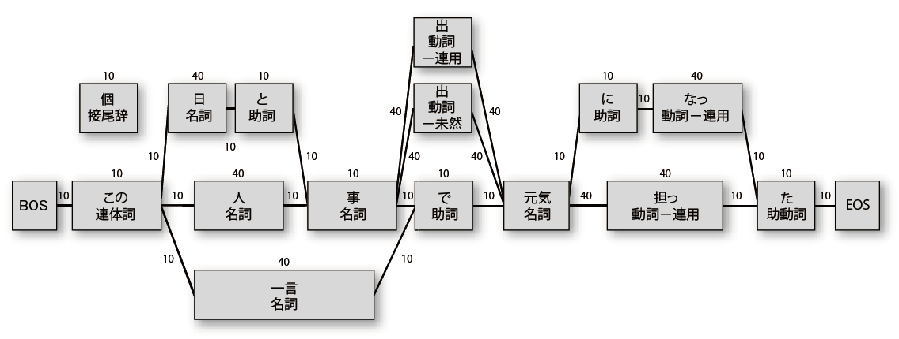
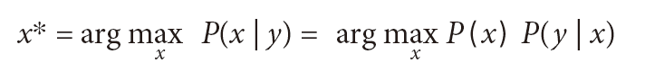

~~~~~~~~~~~~~~~~~~~~~~~~~~~~~~~
Python による日本語自然言語処理
~~~~~~~~~~~~~~~~~~~~~~~~~~~~~~~

.. def:: book
.. include:: ../definitions.rst

**はじめに**

この文書は、
    
    Steven Bird, Ewan Klein, Edward Loper 著  萩原 正人、中山 敬広、水野 貴明　訳
    `『入門 自然言語処理』`_
    O'Reilly Japan, 2010.

の第12章「Python による日本語自然言語処理」を、原書 `Natural Language Processing with Python` と同じ `Creative Commons Attribution Noncommercial No Derivative Works 3.0 US License`_ の下で公開するものです。

原書では主に英語を対象とした自然言語処理を取り扱っています。内容や考え方の多くは言語に依存しないものではありますが、単語の分かち書きをしない点や統語構造等の違いから、日本語を対象とする場合、いくつか気をつけなければいけない点があります。日本語を扱う場合にも応用できるように、訳者のひとりである萩原正人が、日本向けに原書にはない12章を書き下ろしました。ここでは、日本語をどのように処理するかという点に加えて、さらに学ぶために、日本語の処理に関する、もしくは日本語で書かれた参考文献を幅広く紹介しています。

なお、11章以前を参照する箇所が数多くありますが、それらについては同書をご参照下さい。

.. _『入門 自然言語処理』: http://www.oreilly.co.jp/books/9784873114705/
.. _Creative Commons Attribution Noncommercial No Derivative Works 3.0 US License: http://creativecommons.org/licenses/by-nc-nd/3.0/us/

.. contents:: **目次**
   :depth: 2

.. preface::

本書ではこれまで、主に英語を対象とした自然言語処理について取り扱ってきた。ここからは日本語を対象とした自然言語処理を取り扱う。日本語を対象とした処理を Python を用いて行う場合、どのような点に気をつけなければならないだろうか。また、主にその言語特性の違いから、英語と日本語の自然言語処理には、共通点以上に異なる点が数多く存在するが、それは具体的にどのような点だろうか。

本章の目的は、以下の質問に答えることである。

#. 日本語のテキストや辞書などの語彙資源をNLTK 上で扱うにはどのようにすればよいか。
#. 単語の分かち書きをしない言語である日本語を処理する際に、どのような注意を払わなければならないか。
#. 日本語に対する形態素解析、構文解析、意味解析を Python によって実現するにはどのようにすればよいか。

Python における日本語の取り扱い
-------------------------------

実際の作業に入る前に、Python によって日本語を取り扱う上での注意点を述べておこう。 ``print u"こんにちは世界！"`` のように、ソースファイル中に直接日本語の文字列を書く場合には、1行目にエンコーディングを指定しておこう。

    >>> # -*- coding: utf-8 -*-

また、日本語を含む文字列を標準入出力とやり取りする場合には、プログラムの最初で、

    >>> sys.stdout = codecs.getwriter('utf_8')(sys.stdout)
    >>> sys.stdin = codecs.getreader('utf_8')(sys.stdin)

としておくと、UTF-8 の文字列を標準出力に出力したり、標準入力から入力したりできるようになる（そうでないと、出力／入力の際に、 ``UnicodeEncodeError/UnicodeDecodeError`` が発生する場合がある）。また、UTF-8、Shift-JIS、EUC-JP など、日本語のエンコーディングで書かれたファイルを読み込む場合は ``codecs`` モジュールを使い、

    >>> f = codecs.open('sometext.txt', 'r', 'utf-8')

とすればよい。最後の引数にエンコーディングを指定すること以外は、標準の ``open()`` 関数の使用法と同じである。

なお、NLTK には内部的に Unicode 文字列（「3.3　Unicode を利用したテキストの処理」を参照）を想定していない（ ``str`` 型の通常の文字列しか扱えない）部分があり、Unicode でエンコードされた言語資源などを扱うときに不具合が発生する場合がある。たとえば、 ``Text`` クラスのインスタンスを生成するとき、NLTK は先頭の数個のトークンからなるコーパスの摘要を生成するが、そのときコーパスに Unicode 文字列が含まれているとエラーが発生する。また、以下のように Unicode 文字列と UTF-8 エンコードの文字列が（うっかり）混在してしまったときなどにもエラーが発生する。

    >>> print "%s で %s" % (u"パイソン", u"自然言語処理")
    Traceback (most recent call last):
    File "<stdin>", line 1, in <module>
    UnicodeDecodeError: 'ascii' codec can't decode byte 0xe3 in position 3: ordinal
    not in range(128)

これらのエラーの原因は、Python の標準設定における、デフォルトの文字エンコーディングが ASCII になっていることである。ある瞬間のデフォルトの文字エンコーディングは、 ``sys`` モジュールの ``getdefaultencoding()`` 関数で確認できる。

    >>> import sys
    >>> sys.getdefaultencoding()
    'ascii'

デフォルトのエンコーディングは、 ``sys`` モジュールの ``setdefaultencoding()`` 関数で設定できる。しかし、この関数自体が Python インタプリタの起動が完了した時点で削除され無効になっており、通常の方法で呼び出すことができない。これを回避する方法の1 つが、 ``sys`` モジュールを ``reload()`` 関数の第1引数に与えることである。Python インタプリタの起動後に以下の命令を実行すれば、デフォルトのエンコーディングを変更できる。

    >>> import sys
    >>> reload(sys)
    >>> sys.setdefaultencoding('utf-8')

    >>> print "%s で %s" % (u"パイソン", u"自然言語処理")
    パイソン で 自然言語処理

この方法を用いると、Python インタプリタを起動するたびに文字エンコーディングの設定をしなければならず、特に対話型セッションにおいて面倒である。この設定を永続化する方法として、Python の標準ライブラリがインストールされているディレクトリ ``/usr/lib/python2.X/`` もしくは ``/usr/lib/python2.X/site-packages/`` （環境によって異なる）にある ``sitecustomize.py`` ファイルに、

.. doctest-ignore::
    import sys
    sys.setdefaultencoding('utf-8')

を直接書き込む方法がある（この変更には管理者権限が必要である可能性が高い）。 ``sitecustomize.py`` は Python インタプリタの初期化時に読み込まれる設定ファイルである。こうすることによってそれ以降起動されるPython インタプリタのデフォルトの文字エンコーディングが UTF-8 になる [#]_ 。

なお、日本語の文字列を含む複雑なオブジェクト（リストや辞書など）を簡単にダンプして確認できるよう、以下のような ``pp()`` 関数を定義しておくと便利である。 ``print`` 文や ``repr()`` 関数などで直接表示しようとする場合、Unicode 文字は通常 ``\uXXXX`` の形式にエスケープされてしまうが、 ``pp()`` 関数ではそれを実体に置き換える。

    >>> import re, pprint
    >>> def pp(obj):
    ...     pp = pprint.PrettyPrinter(indent=4, width=160)
    ...     str = pp.pformat(obj)
    ...     return re.sub(r"\\u([0-9a-f]{4})", lambda x: unichr(int("0x"+x.group(1),
    ...                                                             16)), str)
    ... 
    >>> data = {
    ...     u"スクリプト言語":
    ...         {u"Perl": u"パール",
    ...          u"Python": u"パイソン",
    ...          u"Ruby": u"ルビー"},
    ...     u"関数型言語":
    ...         {u"Erlang": u"アーラング",
    ...          u"Haskell": u"ハスケル",
    ...          u"Lisp": u"リスプ"}
    ...     }
    >>> print data
    {u'\u95a2\u6570\u578b\u8a00\u8a9e': {u'Lisp': u'\u30ea\u30b9\u30d7', u'Erlang':
    u'\u30a2\u30fc\u30e9\u30f3\u30b0', u'Haskell': u'\u30cf\u30b9\u30b1\u30eb'}, u'\
    u30b9\u30af\u30ea\u30d7\u30c8\u8a00\u8a9e': {u'Python': u'\u30d1\u30a4\u30bd\
    u30f3', u'Ruby': u'\u30eb\u30d3\u30fc', u'Perl': u'\u30d1\u30fc\u30eb'}}
    >>> 
    >>> print pp(data)
    { u'スクリプト言語': {u'Perl': u'パール', u'Python': u'パイソン', u'Ruby': u'ルビー'},
    u'関数型言語': {u'Erlang': u'アーラング', u'Haskell': u'ハスケル', u'Lisp': u'リスプ'}}

　 最後の2 行を比較すれば、後者の方がより読みやすくデバッグに便利なのは明らかだ。

.. [#] ただし、このようにデフォルトのエンコーディングを変更すると、不用意に特定のエンコーディングに依存したプログラムを書いてしまう恐れがあるため、今回のように Unicode 対応が不完全なライブラリを使うときに限定すべきである。

12.1　日本語コーパスの取り扱い
------------------------------

日本語は膠着語（こうちゃくご）と呼ばれる言語の形態的分類に入れられる。また、自立語に複数の付属語が分かち書きされずに結合される構造を持っている。したがって、日本語の文に対して自然言語処理を実行するためには、単語境界を明確に同定する処理が必須である。そのため、特にトークン化（「3.7　テキストのトークン化のための正規表現」を参照）の処理に注意する必要がある。この特徴は中国語やタイ語などのほかの東アジア言語についても共通する問題である。

本節では、NLTK でどのように日本語コーパスを取り扱うかについて説明する。まず、コーパスリーダーを使って日本語コーパスをどのように読み込み、文字単位と単語単位の分かち書きなどの処理をどのようにするかについて述べる。その後、すでにトークン化とタグ付けが済んでいる形態素解析済みコーパスおよび構文解析済みコーパスを NLTK でどのように読み込んで利用するかを解説する。

12.1.1　平文コーパス
====================

ここでは、日本語の平文コーパス、すなわち、分かち書きされていないコーパスをどのようにして読み込み、各種の言語処理を行うかについて解説する。まず、平文コーパスを ``PlaintextCorpusReader`` （「2.1.9　独自のコーパスを読み込む」を参照） を使って読み込んでみよう。サンプルとして、 青空文庫_ のテキストである宮沢賢治の `『銀河鉄道の夜』`_ を用いることにする。このテキストは事前に ``corpora/gingatetsudono_yoru.txt`` という名前のテキストファイル（エンコーディングはUTF-8）で保存されているとする。

.. _青空文庫: http://www.aozora.gr.jp/ 
.. _『銀河鉄道の夜』: http://www.aozora.gr.jp/cards/000081/files/456_15050.html

ここでは、単語の分かち書きなどの複雑な処理はせずに、行をそのままパラグラフとして、「。」「！」「？」で終わる一連の文字列を文として、同一文字種（ひらがな、カタカナ、漢字、その他）の連続をトークンとして検出してみる。文字種を用いて文をトークンに分割するのは完璧とはほど遠いが（たとえば、以下の例で見るように「ではみなさんは」などの、ひらがなの連続が必ず1 トークンとなってしまうが、これは明らかに不適切である）、日本語文のトークン化の第1 ステップを体験するという目的から見て十分である。

なお、これらの命令を実行する前に、

    >>> import nltk
    >>> from nltk.corpus.reader import *
    >>> from nltk.corpus.reader.util import *
    >>> from nltk.text import Text

の各宣言を実行しておく必要があることに注意しよう。これ以下の節では、各スクリプト例の前にこれらがすでに宣言されていることを前提とする。

各行を各パラグラフとして読み込むためには、 ``PlaintextCorpusReader`` オブジェクト生成時にコンストラクタの ``para_block_reader`` 引数に ``read_line_block`` を渡せばよい。また、「。」、「！」、「？」で終わる一連の文字列を文として認識し分割するために、以下の ``RegexpTokenizer`` を定義しよう。

    >>> jp_sent_tokenizer = nltk.RegexpTokenizer(u'[^　「」！？。]*[！？。]')

また、文字種はそれぞれ Unicode の範囲（ひらがなについては ``[ぁ-ん]`` 、カタカナについては ``[ァ-ン]`` 、漢字については ``U+4E00 ～ U+9FFF`` ）を指定することによって検出できる。これらを ``RegexpTokenizer`` に渡す正規表現として以下のように書くことができる。

    >>> jp_chartype_tokenizer = nltk.RegexpTokenizer(u'([ぁ-んー]+|[ァ-ンー]+|[\u4e00-\
    ... \u9FFF]+|[^ぁ-んァ-ンー\u4e00-\u9FFF]+)')

以上の各パラメータを使って、平文コーパスを読み込む ``PlaintextCorpusReader`` は以下のように宣言できる（ ``/path/to/dir`` には、実際にコーパスファイルが置かれているディレクトリを指定する必要がある）。

    >>> ginga = PlaintextCorpusReader("/path/to/dir/", r'gingatetsudono_yoru.txt',
    ...                               encoding='utf-8',
    ...                               para_block_reader=read_line_block,
    ...                               sent_tokenizer=jp_sent_tokenizer,
    ...                               word_tokenizer=jp_chartype_tokenizer)

``CorpusReader`` によって読み込んだ後は、英語のコーパス（1 章参照）と同様に、平文を表示したり ``(1)`` 、トークンを列挙したり ``(2)`` 、 ``Text`` オブジェクトに変換した後コンコーダンス（「1.1.3　テキストを検索する」を参照）を表示したり ``(3)`` といった処理が簡単に実現できる。

    >>> print ginga.raw()                            # ... (1)
    銀河鉄道の夜
    宮沢賢治
    .
    　　一、午后《ごご》の授業
    .　
    「ではみなさんは、そういうふうに川だと云《い》われたり、乳の流れたあとだと云われたりしていた
    このぼんやりと白いものがほんとうは何かご承知ですか。」先生は、黒板に吊《つる》した大きな黒い
    星座の図の、上から下へ白くけ
    ... 

    >>> print '/'.join( ginga.words()[0:50] )        # ... (2)
    銀河鉄道/の/夜/
    /宮沢賢治/
    /
    /　　　/一/、/午后/《/ごご/》/の/授業/
    /
    /「/ではみなさんは/、/そういうふうに/川/だと/云/《/い/》/われたり/、/乳/の/流/れたあとだと/
    云/われたりしていたこのぼんやりと/白/いものがほんとうは/何/かご/承知/ですか/。」/先生/は/、
    /黒板/に/吊/《

    >>> ginga_t = Text( w.encode('utf-8') for w in ginga.words() )
    >>> ginga_t.concordance("川")                    # ... (3)
    Building index...
    Displaying 25 of 57 matches:
    ・・さんは 、 そういうふうに 川 だと 云 《 い 》 われたり ・
    ・・しもこの 天 《 あま 》 の 川 《 がわ 》 がほんとうに 川
    川 《 がわ 》 がほんとうに 川 だと 考 えるなら 、 その ・
    の 小 さな 星 はみんなその 川 のそこの 砂 や 砂利 《 じ・
    と 考 えるならもっと 天 の 川 とよく 似 ています 。 つま
    です 。 そんなら 何 がその 川 の 水 にあたるかと 云 いま
    ・・ つまりは 私 どもも 天 の 川 の 水 のなかに 棲 《 す 》
    けです 。 そしてその 天 の 川 の 水 のなかから 四方 を ・
    ・ く 見 えるように 、 天 の 川 の 底 の 深 く 遠 いところ・
    ...

なお、ここでのコーパスの内部処理は、原則としてすべて Unicode 文字列をベースとして行い、 ``raw()`` メソッドや ``words()`` メソッドなどで返されるのもUnicode 文字列である。ただし、(3) で ``Text`` クラスのインスタンスを生成する際に、Python のデフォルトのエンコーディングが UTF-8 ではなく、かつ、コンストラクタの引数で与えられたトークンが Unicode 文字列だとエラーが発生するため、ここでは特別に UTF-8 でエンコードした通常の文字列（ ``str`` 型）を用いている。よって、 ``concordance()`` 関数に渡す引数も通常の文字列である（ ``u"川"`` ではないことに注意）。

12.1.2　タグ付きコーパス
========================

前節で説明した文字種によるトークン化では、同じ文字種が1つのトークンにまとめられてしまうため、連続したひらがなをトークン化できないなどの問題があった。このままでは、各種の言語処理タスクや統計処理を正確に実行することができない。そこで、ここでは形態素解析済みのデータを使ってみよう。具体的には、MeCab（MeCab の詳細については「12.2.3　MeCab を使う」を参照）により自動的に解析したデータ（ChaSen 形式 [#]_ ）をタグ付きコーパスとして読み込んでみる [#]_ 。ただし、本節で扱うデータは自動的に解析したものであり、人手による修正を経ていないため、誤りを含む可能性があることに留意する必要がある。

NLTK のコーパスセットには、JEITA 形態素解析済みコーパス（ChaSen 形式）（ 以下単に「JEITA コーパス [#]_ 」と呼ぶ）が収録されている。このコーパスは、 ``import nltk`` とした後、 ``nltk.download()`` で表示される画面で選択し、インストールできる（「1.1.2　NLTK を使ってみよう」を参照）。 ``"all"`` というコレクション中の ``"jeita"`` という識別子を持つコーパスがそれである。

以下では、それを ``ChasenCorpusReader`` （最新バージョンは http://code.google.com/p/nltk/source/browse/trunk/nltk/nltk/corpus/reader/chasen.py から利用可能）で読み込んでみよう。第1 引数にはコーパスの格納してあるディレクトリへの絶対または相対パス、第2 引数にはコーパスのファイル名を指定する。コーパスのファイル名には、リストを与えたり、正規表現を与えたりすることにより、複数のファイルを指定することが可能である。

ここでは、ファイル名には ``'.*chasen'`` を指定しており、これは、同コーパスに含まれるすべての ChaSen 形式のファイルを対象にするという意図である。本コーパスには、青空文庫およびプロジェクト杉田玄白からのテキストの一部が含まれており、得られるコーパスはそれをすべて連結したものとなる。

    >>> from chasen import *
    >>> jeita = ChasenCorpusReader('/path/to/jeita/corpus/', '.*chasen', encoding='utf-8')

なお、このコード片を実行するには、上記の方法でダウンロードした JEITA コーパスの zip ファイルを同じ場所（通常は nltk_data ディレクトリ）に解凍する必要がある。もしくは、

    >>> from nltk.corpus.util import LazyCorpusLoader
    >>> jeita = LazyCorpusLoader('jeita', ChasenCorpusReader, r'.*chasen', encoding='utf-8')

としてコーパスリーダーを作成すれば、ダウンロードした zip ファイルをそのまま読み込むことができる。

コーパスリーダーを読み込んだ後は、以下のように ``words()`` メソッドによって単語について繰り返すことができる。

    >>> print '/'.join( jeita.words()[22100:22140] )
    たい/という/気持/が/、/この上なく/純粋/に/、/この上なく/強烈/で/あれ/ば/、/ついに/は/そのも
    の/に/なれる/。/なれ/ない/の/は/、/まだ/その/気持/が/そこ/まで/至っ/て/い/ない/から/だ/。/
    法

なお、タグ情報（ ``tagged_sents()`` のように ``tagged`` で始まるメソッドで返されるタプルの第2要素）はタブ区切りの文字列になっており、読み、原形、品詞1 、品詞2 、活用形の情報が含まれている。以下では、それらを連結して表示してみよう。このタグ情報は、以下の各種言語処理で頻繁に使うことになるため、その構造を十分に理解しておくことは重要である。

    >>> print '\nEOS\n'.join(['\n'.join("%s/%s" % (w[0],w[1].split('\t')[2]) for w
    ...     in sent) for sent in jeita.tagged_sents()[2170:2173]])
    を/助詞-格助詞-一般
    まくっ/動詞-自立
    た/助動詞
    とき/名詞-非自立-副詞可能
    吹き/動詞-自立
    こむ/動詞-非自立
    粉雪/名詞-一般
    の/助詞-連体化
    ため/名詞-非自立-副詞可能
    に/助詞-格助詞-一般
    、/記号-読点
    彼/名詞-代名詞-一般
    の/助詞-連体化
    姿/名詞-一般
    は/助詞-係助詞
    瞬間/名詞-副詞可能
    に/助詞-格助詞-一般
    みえ/動詞-自立
    なく/助動詞
    なっ/動詞-自立
    た/助動詞
    。/記号-句点
    それなり/名詞-一般
    だ/助動詞
    。/記号-句点
    ...

.. [#] : ChaSen 形式は、以下のように、出現形、読み、原形、品詞、活用などの情報がタブ区切りになっている形式である。

.. doctest-ignore::
    私        ワタクシ 私       名詞-代名詞-一般
    は        ハ       は       助詞-係助詞
    昨日      キノウ   昨日     名詞-副詞可能
    学校      ガッコウ 学校     名詞-一般
    へ        ヘ       へ       助詞-格助詞-一般
    行き      イキ     行く     動詞-自立         五段・カ行促音便 連用形
    まし      マシ     ます     助動詞   特殊・マス        連用形
    た        タ       た       助動詞   特殊・タ 基本形
    ．        ．       ．       記号- 句点
    EOS

なお、ChaSen については http://chasen-legacy.sourceforge.jp/ を参照。

.. [#] : MeCab の標準出力形式は ChaSen 形式とは異なるが、ここではコーパスのオリジナルフォーマットにしたがって ChaSen 形式で配布している。

.. [#] : http://www-lab25.kuee.kyoto-u.ac.jp/NLP_Portal/jeita_corpus/index.html

12.1.3　依存構造解析済みコーパス
================================

次に、依存構造がタグ付けされた日本語コーパスを読み込み、内容を表示してみよう。構文情報の付与された日本語コーパスは多くないが、ここで紹介する KNB コーパス [#]_ は、再配布可能な日本語タグ付きブログコーパスで、249 記事、4,189 文から構成されており、形態素、構文、格／省略／照応、評判情報を含んでいる。

NLTK のコーパスセットには、KNB コーパスそのものが含まれている。JEITA コーパスと同様に、 ``import nltk`` とした後、 ``nltk.download()`` で表示される画面で選択し、インストールしよう（ ``"knbc"`` という識別子を探す）。コーパスは、ほかのコーパスと同様、NLTK の標準データディレクトリ（デフォルトでは ``nltk_data`` ）に格納される。

このKNB コーパスを読み込むために、対応する ``KNBCorpusReader`` （最新バージョンは http://code.google.com/p/nltk/source/browse/trunk/nltk/nltk/corpus/reader/knbc.py から利用可能）を使ってみよう。まず、コーパスが格納されているディレクトリを ``nltk.data.find()`` 関数によって取得し、コーパスを構成するファイルを ``fileids`` として列挙する。

    >>> from knbc import *
    >>> from nltk.corpus.util import LazyCorpusLoader
    >>> root = nltk.data.find('corpora/knbc/corpus1')
    >>> fileids = [f for f in find_corpus_fileids(FileSystemPathPointer(root), ".*")
    ...   if re.search(r"\d\-\d\-[\d]+\-[\d]+", f)]

次に、 ``fileids`` を番号順にソートし、 ``KNBCorpusReader`` のコンストラクタにリストとしてすべて渡す。 ``_knbc_fileids_sort()`` というソート用の関数を定義する。すべての ``fileid`` はコーパスリーダーの ``fileids()`` メソッドによって取得できる。

    >>> def _knbc_fileids_sort(x):
    ...     cells = x.split('-')
    ...     return (cells[0], int(cells[1]), int(cells[2]), int(cells[3]))
    >>> knbc = LazyCorpusLoader('knbc/corpus1', KNBCorpusReader, sorted(fileids,
    ...     key=_knbc_fileids_sort), encoding='euc-jp')    
    >>> print knbc.fileids()
    ['KN001_Keitai_1/KN001_Keitai_1-1-1-01', 'KN001_Keitai_1/KN001_Keitai_1-1-2-01',
    'KN001_Keitai_1/KN001_Keitai_1-1-3-01', 'KN001_Keitai_1/KN001_Keitai_1-1-4-01',
    'KN001_Keitai_1/KN001_Keitai_1-1-5-01', ...

なお、このコード片を実行するには、上記の方法でダウンロードした KNB コーパスの zip ファイルを同じ場所（通常は nltk_data ディレクトリ）に解凍する必要がある。もしくは、上のように ``fileid`` を列挙する代わりに、

    >>> knbc = LazyCorpusLoader('knbc/corpus1', KNBCorpusReader, r'.*/KN.*', encoding='euc-jp')

としてコーパスリーダーを作成すれば、ダウンロードした zip ファイルをそのまま読み込むことができる。ただし、この場合コーパス中のファイルの順番の同一性は保証されない。

これで、コーパスを使う準備が整った。KNB コーパスも、NLTK に含まれる通常のコーパスと同様のインターフェイスを用いてアクセスできる。たとえば、すべての単語について繰り返すには ``words()`` メソッドが使用できる。

    >>> print ''.join( knbc.words()[:100] )
    ［携帯電話］プリペイドカード携帯布教。
    　もはや’今さら’だが、という接頭句で始めるしかないほど今さらだが、私はプリペイド携帯をずっと
    使っている。
    ...

係り受け関係を表現した木構造にアクセスするには、 ``parsed_sents()`` メソッドを使う。各文は ``nltk.tree.Tree`` クラスのインスタンスとして取得できる。

    >>> print '\n\n'.join( '%s' % tree for tree in knbc.parsed_sents()[0:2] )
    (布教/。
        (電話/］ ［/携帯)
        (携帯 (カード プリペイド)))
    (使って/いる/。
        (今さら/だ/が/、
            (ほど
	        (始める/しか/ない
		    もはや
		    (接頭句/で (いう ’/今さら/’/だ/が/、/と)))))
        私/は
        (携帯/を プリペイド)
        ずっと)

もちろん、タグ付きコーパスであるため、 ``tagged_words()`` のように、 ``tagged`` で始まるメソッドで返される各要素（タプル）の第2要素として、品詞タグなどを取得できる。

    >>> print '\n'.join( ' '.join("%s/%s"%(w[0], w[1].split(' ')[2]) for w in sent)
    ...     for sent in knbc.tagged_sents()[0:20] )
    ［/特殊 携帯/名詞 電話/名詞 ］/特殊 プリペイド/名詞 カード/名詞 携帯/名詞 布教/名詞 。/特殊
    もはや/副詞 ’/特殊 今さら/副詞 ’/特殊 だ/判定詞 が/助詞 、/特殊 と/助詞 いう/動詞 接頭句
    /名詞 で/助詞 始める/動詞 しか/助詞 ない/形容詞 ほど/名詞 今さら/副詞 だ/判定詞 が/助詞 、
    /特殊 私/名詞 は/助詞 プリペイド/名詞 携帯/名詞 を/助詞 ずっと/副詞 使って/動詞 いる/接尾辞
    。/特殊

.. [#] : 正式名称は「Kyoto-University and NTT Blog コーパス」(http://nlp.kuee.kyoto-u.ac.jp/kuntt/ )。詳細については [橋本ら2009]_  を参照。

12.1.4　コーパスを用いたテキスト処理
====================================

これまで、日本語の平文コーパス、タグ付きコーパス、依存構造解析済みコーパスをどのようにして利用するかについて見てきた。これらの言語資源および付与されている情報を用いると、どのような言語処理が可能になるだろうか。11章までに説明されているように、日本語コーパスに対しても、これまでと同様に単語の分散プロット（「1.1.3　テキストを検索する」）、頻度分布（「1.3.1　頻度分布」）、および品詞タグの頻度分布などを求めることができる。以下に例を示す。

まず、以下のようにして JEITA コーパスに含まれるプロジェクト杉田玄白（の一部分）のテキストを読み込んだコーパスを作成し、コーパスの長さを求めてみよう。プロジェクト杉田玄白のファ
イルはすべて ``"gNNNN.chasen"`` （ ``NNNN`` は文書ID）の形式をしているため、 ``"g\d{4}\.chasen"`` をファイル名のパターンとして指定すればよい（青空文庫には文語文が多く含まれるため、結果の統一性とわかりやすさを図るために、ここでは使っていない）。

``raw()`` メソッドでは、タグ情報も一緒に取得されてしまうため、ここでは ``words()`` メソッドによって単語のリストを取得し、その長さを計算している。

    >>> genpaku = ChasenCorpusReader('/path/to/jeita/corpus/', 'g.*chasen',
    ...     encoding='utf-8')
    >>> print len(genpaku.words())
    733016
    >>> print sum(len(w) for w in genpaku.words())
    1247143

ここから、コーパスの長さと単語数の比は約 1.70 であり、本コーパスには、1文字の助詞や人称
名詞、2文字の単語が頻出していることが推測できる。

続いて、コーパスに含まれている語彙（コーパス中に出現するすべての単語の集合）を求め、さらに単語および品詞タグの頻度分布をそれぞれ求めてみよう。語彙セットは、記号や英数字などを排除するために、既出の日本語文字の正規表現 ``‹‹ぁ-んーァ-ンー\u4e00-\u9FFF››`` を用いてフィルタリングしている。

    >>> genpaku_vocab = set(w for w in genpaku.words() if re.match(
    ...    ur"^[ぁ-んーァ-ンー\u4e00-\u9FFF]+$", w))
    >>> print ' '.join( sorted(genpaku_vocab)[:10] )
    ぁ あ あぁ ああ あい あいさつ あいだ あいつ あいにく あいまい
    >>> genpaku_t = Text(genpaku.words())
    >>> genpaku_wfd = FreqDist(genpaku_t)
    >>> genpaku_wfd.tabulate(10)
    、 の は 。 に を た て が で
    40153 38046 26823 25088 24699 22836 18040 17770 17044 13144
    >>> genpaku_tfd = FreqDist(t[2] for (w, t) in genpaku.tagged_words())
    >>> genpaku_tfd.tabulate(10)
    名詞-一般 動詞-自立 助詞-格助詞-一般 助動詞 記号-読点 助詞-係助詞 名詞-サ変接続 助詞-連体化
    記号-句点 助詞-接続助詞
    88053 74235 71789 67201 40826 33452 31904 30419 26699 25760

俗に「てにをは」と呼ばれる格助詞が頻出単語であることが上記 ``tabulate()`` メソッドの出力からわかる（格助詞以外に頻出する単語はどのようなものだろうか）。また、品詞としては、一般名詞、自立動詞、格助詞が頻出トップ3であることもわかる。

以上のように求めた頻度分布は、以下のようにしてグラフにプロットすることもできる。ただし、 ``matplotlib`` では、標準では日本語が文字化けしてしまうことに注意。

    >>> genpaku_wfd.plot(100)

ところで、日本語には、「貴社の記者が汽車で帰社する」などの言葉遊びがあるように、非常に同音異義語が多いことが知られている。ここで、タグ付きコーパスを使って同音異義語を列挙してみよう。 ``tagged_words()`` メソッドで返される各要素の第 2 要素は、品詞の情報とともに読みの情報を含んでいるので、この情報を使ってみよう。

    >>> print ' '.join( set(w for w,t in genpaku.tagged_words()
    ...     if t[0] == u"コウショウ") )
    高尚 公娼 工匠 交渉

この例では、読みが「コウショウ」に一致した単語のみを列挙し、その異なり集合を求めている。このコーパスでは、読みが「コウショウ」である単語が4 種類見つかった。なお、この手法では、「依る」「拠る」のような同音同義語も同時に取得できることに注意すること。

「1.3　言語の計算処理：簡単な統計処理」で示したように、 ``Text`` クラスの ``collocations()`` メソッドによって、テキストから日本語の形態素バイグラムのコロケーションを抽出したり、 ``generate()`` メソッドを用いてランダムな文を生成したりできる。

    >>> genpaku_t.collocations()
    Building collocations list
    オープン ソース; コール バック; インター フェイス; Red Hat; Teddy bear; フリー ソフトウェア; science
    fiction; Belle Epoque; 多かれ 少なかれ; シェーン ベルク; attribute name; ミドル ウェア;
    package com; ソース コード; ミルキー ホワイト; GNU システム; import org; フリー ソフト; GNU プロジェクト; あちら こちら

    >>> genpaku_t.generate()
    Building ngram index...
    ねんねん や 　 [ 直 示 定義 は しばしば 単一 ソース から の 手紙 は 、 役回り が 今 ここ に いる の で ある と 。
    が 、 いわゆる 実 無限 数 に 限定 し なかっ た 。 ふつふつ と わきあがる 怒り に 震え ながら 諦め て 死ぬ か を 。
    だっ たら こんな 、 疲れる 上 に 醸成 さ れ た か と いう こと だ 、 僕 が どれ だけ 助かる か 、 ぼく ら が
    群がっ て 彼女 の 腕 に あ たま を のせ た 。 　 彼 の 身体 は 、 自己 や 自分

また、以下のように使われる文脈の類似した単語を表示したり、2つの単語に共通する文脈を表示したりすることもできる。

    >>> genpaku_t.similar(u"ソフトウェア")
    # Building word-context index...
    ソフト 人 彼 私 それ 彼女 僕 人間 労働 彼ら 男 これ ぼく わたし 仕事 目 自分 あなた 世界 今

なお、ここでは類似する単語が、英語での実行結果ほど正確に求められていない。特に「私」「彼女」「僕」などの一般的な名詞ばかりが挙がってきている。その理由としては、日本語では助詞がかなり多く、 ``similar()`` メソッドでは前後1形態素しか利用していないため、単語の識別に十分な情報を得られないことが挙げられる。興味のある読者は、「5.1　タガーの利用」の ``similar()`` メソッドの解説か、コードを直接参照して、さらに理解を深めるとよい。

12.1.5　日本語WordNet
=====================

日本語の語彙体系（シソーラス）には、分類語彙表（国立国語研究所） [#]_ 、角川類語辞典（角川書店） [#]_  、日本語語彙大系（NTT） [#]_ 、EDR 概念体系辞書（日本電子化辞書研究所） [#]_ 、類語例解辞典（小学館） 、三省堂類語新辞典（三省堂）などがあるが、いずれも有料であり、リソースが自由に利用できない。ここでは、Nanyang Technological University の Francis Bond 氏が中心となって構築している日本語WordNet（ http://nlpwww.nict.go.jp/wn-ja/ ）を紹介しよう。

日本語WordNet は、主に日本語の単語を英語のWordNet に割り当てることによって構築されている。初期段階では、英語のWordNet とEuro のWordNet を日本語に翻訳して人手で修正するところから構築が始まった。すでに利用可能なWordNet を拡張する形で構築が続けられており、現在では、150,000 個以上の語義に、精度90%以上で日本語見出し語が付与されている。

公式ページでは、LMF（Lexical Markup Framework：語彙項目記述枠組み）フォーマット（XML） [Soria2009]_ 、sqlite3、タブ区切りの各形式のファイルを配布している。ここでは、日本語の見出し語と英語の同義語集合の対応関係のうち、人手により修正したものおよび確信度の高いものだけを収録したタブ区切り（TSV）ファイルである ``wnjpn-ok.tab`` を入手して用いてみよう。このファイルは、

========== ======== ====
02076196-n 海豹     hand
02076196-n アザラシ hand
02076196-n シール   hand
========== ======== ====

のような簡単な対応関係で構成されており、左側のフィールドから順に、WordNet の同義語集合 ID-POS（品詞ラベル）、日本語の見出し語、リンクのタイプとなっている。リンクのタイプには以下の4 種類があり、それぞれの意味は以下のとおりである。

===== ===================================================
hand  人手により修正済み
mlsn  MLSN（multilingual semantic network）からインポート
mono  曖昧性のない翻訳から作成
multi マルチリンガルリンクを用いて作成
===== ===================================================

ここでは、日本語の見出し語を ``wnjpn-ok.tab`` から作ったルックアップテーブルの中でまず検索し、英語 WordNet の同義語集合にマップすることにより、 ``wordnet`` モジュールに備わっている各種のメソッドを使ってみる。まず、日本語 WordNet に対するリーダーを以下のように定義してみよう。

.. pylisting:: 12_1_5_jpwordnet

    class JapaneseWordNetCorpusReader(WordNetCorpusReader):
        def __init__(self, root, filename):
	    WordNetCorpusReader.__init__(self, root)
	    import codecs
	    f=codecs.open(filename, encoding="utf-8")
	    self._jword2offset = {}
	    for line in f:
	        _cells = line.strip().split('\t')
		_offset_pos = _cells[0]
		_word = _cells[1]
		if len(_cells)>2: _tag = _cells[2]
		_offset, _pos = _offset_pos.split('-')
		self._jword2offset[_word] = {'offset': int(_offset), 'pos': _pos}
        def synset(self, word):
            if word in self._jword2offset:
                return WordNetCorpusReader._synset_from_pos_and_offset(
                    self, self._jword2offset[word]['pos'], self._jword2offset[word]['offset']
                )
            else:
                return None

この ``JapaneseWordNetCorpusReader`` は、日本語の見出し語から英語WordNet の同義語集合を返すシンプルな関数を1つだけ持っている。日本語の見出し語が与えられると、そこからルックアップテーブルを引き、同義語集合 ID と品詞を求める。同義語集合 ID と品詞を ``WordNetCorpusReader`` （「2.5　WordNet」を参照）の ``_synset_from_pos_and_offset()`` 関数に与えると、対応する同義語集合を返すことができる。

対応する同義語集合を求めた後は、以下のようにして英語 WordNet に備わっている各種の機能を用いることができるので大変便利である（ ``JapaneseWordNetCorpusReader`` のインスタンスを作成するときに、英語 WordNet へのパスならびにルックアップテーブルへのパスを両方指定する
ことに注意）。

    >>> jwn = JapaneseWordNetCorpusReader(nltk.data.find('corpora/wordnet'),
    ...     '/path/to/wnjpn-ok.tab')
    >>> jsyn_whale = jwn.synset(u"鯨")
    >>> jsyn_apple = jwn.synset(u"りんご")
    >>> jsyn_orange = jwn.synset(u"ミカン")
    >>> print jsyn_apple.path_similarity( jsyn_orange )
    0.25
    >>> print jsyn_whale.path_similarity( jsyn_orange )
    0.0526315789474

なお、日本語 WordNet では、英語版 WordNet との対応関係のほかにも、SUMO（Suggested Upper Merged Ontology）や日本語語彙体系などほかの語彙知識源との接続や、Open ClipArt Library の画像の対応づけ、語釈文と例文の翻訳なども進めている。

なお、京都大学の山家雄介氏によって開発された日本語 WordNet のデータベースを探索するフロントエンドプログラムが、 http://subtech.g.hatena.ne.jp/y_yanbe/20090314/p2 にて配布されている。このスクリプトでは、Python の sqlite3 バインディングを用いて、日本語 WordNet の SQLite3 形式の配布ファイルを検索する。英語 WordNet の ``wn`` コマンドと同様のインターフェイスを持っていることから、日本語 WordNet を手軽に利用したいときに参考にするとよいだろう。

.. [#] : http://www.kokken.go.jp/kanko/goihyo/
.. [#] : http://www.kadokawa.co.jp/book/bk_detail.php?pcd=199999011700
.. [#] : http://www.kecl.ntt.co.jp/mtg/resources/GoiTaikei/
.. [#] : http://www2.nict.go.jp/r/r312/EDR/J_index.html

12.1.6　その他の日本語コーパス
==============================

本節で紹介した日本語コーパス以外にも、主に研究、教育の目的で様々な日本語コーパスが開発、公開されている。主なものとして、EDR（日本電子化辞書研究所）の「EDR 電子化辞書」およびそれに付随する「EDR 日本語コーパス」（ http://www2.nict.go.jp/r/r312/EDR/J_index.html ）、RCWP（技術研究組合新情報処理開発機構）の「RWC テキストデータベース」、京都大学による「京都大学テキストコーパス」 （ http://www-nagao.kuee.kyoto-u.ac.jp/nl-resource/corpus.html ）、国立国語研究所、情報通信研究機構、東京工業大学の共同成果である「日本語話し言葉コーパス」（ http://www.kokken.go.jp/katsudo/seika/corpus/ ）、国立国語研究所による「現代日本語書き言葉均衡コーパス」（ http://www.tokuteicorpus.jp/ ）がある。

12.2　日本語形態素解析
----------------------

本節では、簡単な日本語形態素解析アルゴリズムを、Python を用いて実装することにより、その基礎を学んでみよう。また、オープンソースの形態素解析ツールを Python からどのように扱うかについても見ていく。

形態素とは意味を持つ最小の言語単位であり、形態素解析とは与えられた文を形態素単位に区切り、各形態素に品詞などの情報を付与する処理である。形態素の定義はもともと欧米語の言語学から来たものであるため、まちまちであり確立されていないが、日本語形態素解析の立場から言えば、辞書に記載されている見出し語を形態素と見なし、その単位に分割すると同時に、見出し語にひもづく品詞や標準形などを形態素に付与する処理であると言える。したがって、必要以上に単語や形態素の区別に気をつける必要はない。

英語のように空白文字によって明確に分かち書きされた言語では、品詞の同定が重要な問題である。一方、日本語の解析においては、品詞など、形態素の情報を記述した辞書を参照して形態素解析をするのが普通である。したがって、英語で言うトークン化（「3.7　テキストのトークン化のための正規表現」）、ステミング（「3.6　テキストの正規化」）、品詞タグ付け（「5 章　単語の分類とタグ付け」）を同時に行う処理であると言える。

日本語は分かち書きをしない言語であり、かつ動詞などが活用するため、単語を同定して原形を求める処理である形態素解析は、より高度な自然言語処理の基礎をなすきわめて重要な処理である。

12.2.1　形態素解析アルゴリズム
==============================

ここでは、簡単な日本語形態素解析アルゴリズムを Python で実装することを通じて、形態素解析の仕組みを把握しよう。形態素解析の入力文としては、一般的に仮名漢字交じりを想定するが、ここではより曖昧性が大きく、難しい問題設定として、入力が仮名べた書き文である場合を例として用いている。なお、この問題設定は、仮名べた書きを入力として適切な漢字変換候補を出力する仮名漢字変換と全く同じであり、実際、形態素解析と仮名漢字変換のモデルは共通するところが非常に多い。日本語や中国語、韓国語など、巨大な文字セットを持つ言語をキーボードから入力するためのソフトウェアを IME（Input Method Editor）と呼ぶが、その内部では形態素解析技術が使われるのが一般的である。なお、仮名漢字変換に関するトピックは、「12.5　参考文献」を参照のこと。

一般的な日本語形態素解析アルゴリズムの流れは、以下のようになる。

#. 入力文に対して、辞書を参考にしながら、可能な形態素分割をすべて求める。
#. 1 で求められたすべての解（形態素分割）に対して、なんらかの評価基準を用いて、もっとも適切な解を1 つ以上選択する。

ここでの「辞書」には、日本語の単語や形態素が付加情報とともに記述されている。形態素解析アルゴリズムは、この辞書に記載された情報を参照しながら、文の部分文字列が形態素として妥当かどうか、解析結果が妥当かどうかということを決定する。

ステップ1 では、入力文に対して可能な形態素分割を（概念的に）すべて求める。ただし、すべての分割を実際に求めると、文の長さの2 乗に比例した計算量が最低でもかかってしまうため、なんらかの効率化が必要である。

このステップでは、文の部分文字列に対して辞書を引き、その部分文字列に対応する形態素を高速に求める処理がキーとなる。そのためのデータ構造には様々なものがあるが、一般的には4 章においてすでに解説したトライ構造が用いられる。トライ構造は、中間接点が文字に対応するような木構造であり、入力文字列の文字を根から順にたどることにより、文字列に対する検索を入力文字列の長さに比例した計算量で行うことを可能にするデータ構造である。

ここでは、形態素解析に用いる単語の辞書をトライ構造により表現する。辞書エントリにどのような情報を格納するかは目的によって異なるが、形態素解析の一般的な場合では、見出し形（動詞の原形など、単語の基本的な形）、表層形（活用や表記揺れなどを考慮した、文中において文字列として実際に出現する形式）、および品詞や活用形の情報が含まれる。ここでは、表層形をキーにし、エントリに品詞（ ``pos`` ）と見出し形（ ``lemma`` ）の情報を含むトライを構築してみよう。そのために必要な辞書データは以下のようなリスト形式で準備し、一括でトライに追加できるようにしよう。なおここでは、例文に関連のある辞書エントリのみを用意している。

    ここでは、動詞などの活用形もすべて別の辞書エントリとしている。一方、原形と活用の種類だけを辞書に記述しておき、辞書のロード時に各活用形を展開する方法もある。前者は形態素解析器MeCab が、後者はChaSen が採用しているアプローチである。なお、本章で用いる品詞タグの定義は以下のとおりである。

        N 名詞    :raw-html:` `
	V 動詞（-Z 未然形 -Y 連用形 -S 終止形 -T 連体形 -R 命令形） :raw-html:` `
	J 助詞（-K 格助詞 -F 副助詞） :raw-html:` `
	T 連体詞 :raw-html:` `
	SF 接尾辞 :raw-html:` `
	A 助動詞  :raw-html:` `

.. pylisting:: 12_2_1_ma_dict_1

    dict_entries = [
        [u"かれ", {'pos':'V-Y', 'lemma':u"枯れ"}],
	[u"かれ", {'pos':'V-Z', 'lemma':u"枯れ"}],
	[u"かれ", {'pos':'N', 'lemma':u"彼"}],
	[u"の", {'pos':'J-K', 'lemma':u"の"}],
	[u"く", {'pos':'N', 'lemma':u"区"}],
	[u"くる", {'pos':'V-S', 'lemma':u"来る"}],
	[u"くる", {'pos':'V-T', 'lemma':u"来る"}],
	[u"くるま", {'pos':'N', 'lemma':u"車"}],
	[u"ま", {'pos':'N', 'lemma':u"間"}],
	[u"まで", {'pos':'J-F', 'lemma':u"まで"}],
	[u"で", {'pos':'J-K', 'lemma':u"で"}],
	[u"でま", {'pos':'N', 'lemma':u"デマ"}],
	[u"まつ", {'pos':'N', 'lemma':u"松"}],
	[u"まつ", {'pos':'V-S', 'lemma':u"待つ"}],
	[u"まつ", {'pos':'V-T', 'lemma':u"待つ"}],
	[u"つ", {'pos':'N', 'lemma':u"津"}]
    ]

トライの基本的な構造は4 章において解説したものとほぼ同じであるが、形態素辞書においては、単一のキー（表層形）に対して複数のエントリ（基本形）が対応する可能性があるため（例：「まつ」という表層形には動詞「待つ」や名詞「松」「末」などが対応する可能性がある）、トライの葉接点に複数のオブジェクトを追加できるように以下のように拡張した ``insert()`` 関数を用いる。キー ``'value'`` に対応する値は単一のオブジェクトではなくオブジェクトのリストになる。

    >>> def insert(trie, key, value):
    ...     if key:
    ...	        first, rest = key[0], key[1:]
    ...	    	if first not in trie:
    ... 	    trie[first] = {}
    ...         insert(trie[first], rest, value)
    ...	    else:
    ...         if not 'value' in trie:
    ...             trie['value'] = []
    ...         trie['value'].append(value)

これで辞書トライを構築する準備が整ったため、辞書エントリを一括でトライ ``matrie`` に追加する。なお、キーのエンコーディングとしては UTF-8 を用いている。すなわち、キー文字列のUTF-8 表現の各バイトが、トライの各中間接点に対応する。

    >>> for entry in dict_entries:
    ...	    entry[1]['length'] = len(entry[0])
    ...     insert(matrie, entry[0].encode('utf-8'), entry[1])

なおここでは、辞書の各エントリに ``'length'`` という情報を付与しているが、これは各キーの長さであり、形態素解析の際の形態素の分割の終わりを求めるために必要な情報である。この詳細については後述する。

形態素解析のステップ1では、入力文に対して可能な形態素分割をすべて求めるために、入力文の先頭の文字から順に、各文字に対して、その文字から始まる文字列の接頭辞をキーに持つ辞書エントリを列挙するという処理が必要になる。たとえば、文中の「くるま」という部分文字列に対して、「く（区）」「くる（来る）」「くるま（車）」などの辞書エントリを枚挙するという処理である。この「キーに対して接頭辞となっている辞書エントリをすべて求める」処理は **共通接頭辞探索** （common prefix search）として知られており、トライ構造を用いることで以下のように簡単に実現できる。この関数は、入力としてトライとキーを受け取り、出力として見つかった辞書エントリのリストを返す。

    >>> def common_prefix_search(trie, key):
    ...     ret = []
    ...     if 'value' in trie:
    ...         ret += trie['value']
    ...     if key:
    ...         first, rest = key[0], key[1:]
    ...         if first in trie:
    ...             ret += common_prefix_search(trie[first], rest)
    ...     return ret

トライが構築できれば、形態素解析のための準備は完了である。形態素解析のステップ1 では、可能な形態素分割をすべて求めるために、入力文の各部分文字列に対して共通接頭辞探索を行うという操作を文の先頭から順に行う。なお、この形態素分割の列挙の操作によって、膨大な数の分割候補が生成されるが、この候補の中には、日本語文として文法的に誤っているようなものもあり得る。たとえば、「かれの」という入力を考えるとき、単純に辞書を引くと「枯れ」（動詞「枯れる」の連用形）＋「の」（助詞）という分割候補も考えられるが、動詞の連用形に助詞の「の」が連続することは日本語文法に照らして適切ではない。そのため、形態素に関する品詞や活用などの情報を利用して、2 つの形態素が連接するかどうかの可能性を判定し、連接する可能性のある分割候補だけを列挙する。このために、共通接頭辞探索によって得られた候補に対して、その位置で終わる形態素との組み合わせを考え、連接が可能な形態素だけをつないでいく。すなわち、「の」の位置で辞書を引いた結果、助詞「の」が得られたとしても、その直前の「枯れ」という動詞の連用形とは接続しないため、候補から除外するのである。この操作の結果、形態素を接点とし、連接可能な形態素同士を枝によって結んだデータ構造が得られる。このようなグラフ構造はラティス構造（lattice structure）と呼ばれる（図12-1）。

.. figure:: fig_jpma_lattice1.png
    :scale: 60%
  
    入力文「かれのくるまでまつ」に対するラティス構造

連接可能性は、連接する左側と右側の形態素の情報を、それぞれ行列の行と列に対応させ、その要素に連接するかどうかを格納した行列の形で表現されるのが普通であり、これは連接可能性行列と呼ばれる。ここでは単純化のため、この連接可能性行列を左側と右側の形態素の情報を受け取り、接続可能かどうかを返す以下のような関数によって表現する。

    >>> def is_connectable(bnode, cnode):
    ...     ctable = set([
    ...          ('BOS', 'N'), ('BOS', 'V'), ('BOS', 'T'),
    ... 	 ('T', 'N'), ('N', 'J'), ('J', 'N'), ('J', 'V'),
    ... 	 ('V-T', 'N'), ('V-T', 'J-F'), ('V-Y', 'A'), ('V-S', 'EOS'), ('A', 'EOS')])
    ...     bpos = bnode['entry']['pos']
    ...     bpos_s = bpos.split('-')[0]
    ...     cpos = cnode['entry']['pos']
    ...     cpos_s = cpos.split('-')[0]
    ...     return (((bpos, cpos) in ctable) or ((bpos_s, cpos) in ctable)
    ...         or ((bpos, cpos_s) in ctable) or ((bpos_s, cpos_s) in ctable))

ここでは接続可能性行列をctable という集合の形で表現し、(<前の形態素の品詞>, <後ろの形態素の品詞>) のタプルがそこに含まれているかどうかで判定している。なお、辞書のキーに対応する形態素の情報として、「動詞」などの大きい分類から「動詞- 連体形」などの小さな分類まで、品詞は階層構造を取るのが普通である（一般的には、さらに多い階層を持つのが普通である）。接続可能性の表現にも、たとえば「助詞の後には名詞が接続できる」などの大分類を用いたものから、「動詞の連用形の後には副助詞が接続できる」などの小分類を用いたものがあるため、関数 ``is_connectable()`` では、その両方に対応できるようになっている。たとえば、 ``'V'`` によって「動詞全般」を表す一方で、 ``'V-S'`` は「動詞の終止形」を表すといった具合である。

また、品詞は形態素を左から見た場合と右から見た場合では違うものとして扱うのが一般的である。たとえば動詞は、左から見るときには「動詞の連用形の後には副助詞が接続できる」など、活用形の情報も必要であるが、このような制約も ``ctable`` の要素のタプルとして自然に表現されている。　なお、形態素の接続は、「接続できない」、「接続できる」など厳密に定義できるものではないことに注意しよう。たとえば、文末に名詞が来ることは少ないと思われるが、体言止めなどの例もあり得る。この場合、「接続できない」としてしまうと、体言止めの文の解析に必ず失敗してしまうため、ここでは「接続できる」として取り扱うべきである。この点については、後のコスト最小法のところで改めて触れる。

以上のアルゴリズムを実装したシンプルな形態素解析を行う関数 ``analyze_simple()`` は、以下のようになる。

.. pylisting:: 12_2_1_analyze_simple

    def analyze_simple(trie, sent, connect_func=lambda x, y: True):
        bos_node = {'next':[], 'entry': _BOS_ENTRY}                 # ... (1)
	end_node_list = nltk.defaultdict(list)                      # ... (2)
	end_node_list[0].append(bos_node)
	for i in range(0, len(sent)+1):                             # ... (6)
	    if i < len(sent):
	        cps_results = common_prefix_search(trie, sent[i:].encode('utf-8'))
	    else:
	    # EOS
	    cps_results = [_EOS_ENTRY]
	    
	    for centry in cps_results:
	        cnode = {'next':[], 'entry':centry}

		for bnode in end_node_list[i]:
		    if connect_func(bnode, cnode):                  # ... (3)
		        bnode['next'].append(cnode)                 # ... (5)

			end_nodes = end_node_list[i+centry['length']]
			if not cnode in end_nodes: end_nodes.append(cnode) 
                                                                    # ... (4)

	return enum_solutions(bos_node)                             # ... (7)

``_BOS_ENTRY`` と ``_EOS_ENTRY`` は、それぞれ文頭、文末を表す特殊な辞書エントリであり、最初に ``_BOS_ENTRY`` を、文頭を表す節点に代入している (1)。各節点の ``'next'`` フィールドは、その節点の次に接続する節点のリストであり、文末まで解析が終了した段階で、文頭からこのフィールドをたどっていくことによって、ラティス構造のすべての解を列挙することができる。この入力文に対するラティス構造を図12-2に示す。

    入力文「このひとことでげんきになった」に対するラティス構造。各節点上の数字は、その形態素の生起コストを、各枝上の数字は、その枝の接続コストを表している

``end_node_list`` (2) はリスト型であり、 ``end_node_list[i]`` が ``i`` 番目の位置の文字でちょうど終わる節点、すなわち形態素分割結果の末尾のリストとなっている。 ``end_node_list[i]`` に含まれるすべての節点と、 ``i`` 番目の位置での共通接頭辞探索の結果、すなわち ``i`` 番目の位置からちょうど始まる形態素候補のリストの組み合わせの連接可能性を調べることにより、次に続く可能性のある形態素を検出し、それを前の節点の ``'next'`` フィールドに追加する。この処理を文末まで1文字ずつ繰り返し (6)、最後に文頭ノードからラティス構造をたどることによって解を列挙する。 ``enum_solutions()`` 関数は、与えられたノードから文末までのすべてのパス（それ自体がノードのリスト）のリストを求める再帰関数であり、以下のように定義される。

    >>> def enum_solutions(node):
    ...     results = []
    ...     if node['entry']['lemma'] == u'EOS':
    ...        return [[u'EOS']]
    ...     for nnode in node['next']:
    ...        for solution in enum_solutions(nnode):
    ...           results.append([node['entry']['lemma']]+solution)
    ...     return results

この関数は、引数 ``node`` が ``EOS`` ではなく、かつ ``'next'`` フィールドが空のときには空のリストを返すため、 ``'next'`` フィールドをたどって文末 ``EOS`` までたどりつくようなパス、すなわちすべての形態素間において連結可能性が成り立っているようなパスのみを返す。一般的に、1つの文に対して複数の形態素解析結果が考えられるが、それらがすべて戻り値として返される。また、連結可能性を満たすような解が1つもない場合、単に空のリストを返す。

このシンプルな形態素解析を、入力文「かれのくるまでまつ」に対して実行してみよう。

    >>> res = analyze_simple(matrie, u"かれのくるまでまつ", is_connectable)
    >>> print '\n'.join('/'.join(sent) for sent in res)
    BOS/彼/の/来る/間/で/待つ/EOS
    BOS/彼/の/来る/まで/待つ/EOS
    BOS/彼/の/車/で/待つ/EOS

ここで、列挙された解の中に、「彼/の/来る/間/で/待つ」のような、文法的に間違ってはいないが、自然さという点では劣る解析結果が含まれていることに注目しよう。形態素解析においては、得られる複数の解のうち、日本語として「もっとも自然な」解析結果をどのようにして求めるかが重要であり、様々な手法がこれまでに考えられてきた。

そのうち比較的単純なものとして、 **ヒューリスティック** に基づいた手法がある。ヒューリスティックとは、理論的な裏づけが必ずしもあるわけではないが、比較的うまくいく発見的かつ経験的手法のことである。たとえば上の解のうち、「彼/の/来る/間/で/待つ」よりも「彼/の/車/で/待つ」の方が自然な解析結果だと考えられるが、これらをよく観察すると、後者の方が形態素数そしてそれに伴う文節の数が少ないことに気づく。よって、「形態素解析もしくは文節数が少ない解析結果ほどよい結果である」というヒューリスティックを考えることができる。

この考えをさらに推し進めて、「彼/の/来る/まで/待つ」と「彼/の/車/で/待つ」のどちらが解析結果としてより妥当かを順位づける手法はないだろうか。どちらも文法的には完全に正しく、かつ形態素の数も文節の数も同じである。ここで、各構成形態素に注目すると、たとえば、助詞「の」の後には、動詞よりも名詞の方が連接する可能性が高いかもしれない。また、「来る」という動詞と「車」という名詞を比べた場合、どちらが一般的に言って日本語の文に出現しやすいだろうか。この前者の直観は「形態素と形態素の結びつきやすさ／にくさ」というなんらかの値を割り当てることにより表現できる。また、後者は「形態素自体の出現のしやすさ/しにくさ」というなんらかの値に対応すると考えることができる。ここから、結びつきにくい形態素の連続や、出現しにくい形態素に対して高い「コスト（数値尺度）」を割り当て、文全体で見たときのコストの総和の小さな解析結果が、もっとも自然でありよいものであると言える。このようにしてもっとも適切な解析結果を選択する手法は **コスト最小法** と呼ばれる。

コスト最小法では、概念的には、上のようにして得られたラティスのすべてのパスについて、「形態素自体の出現しにくさ（生起コスト）」と「形態素と形態素の結びつきにくさ（連接コスト）」の総和を求め、そのもっとも小さいものを選択する。この処理は、 **ビタビアルゴリズム** （Viterbi Algorithm）と呼ばれる動的計画法の一種で求めることができる。ビタビアルゴリズムでは、あるノードまでの最小コストのみを保持しておくことにより、それよりも大きいコストを持つパスを考慮せずに済み、効率的に最小コストパスを計算できる。

コスト最小法に基づく形態素解析を行う関数 ``analyze()`` は、以下のようになる。

.. pylisting:: 12_2_1_mincost

    def analyze(trie, sent, connect_func=lambda x,y: True, cost_func=lambda x,y: 0):
        bos_node = {'begin':-1, 'next':[], 'entry': _BOS_ENTRY, 'cost': 0}
	end_node_list = nltk.defaultdict(list)
	end_node_list[0].append(bos_node)

	for i in range(0, len(sent)+1):
	    if i < len(sent):
	        cps_results = common_prefix_search(trie, sent[i:].encode('utf-8'))
	    else:
	        # EOS
		cps_results = [_EOS_ENTRY]

	    for centry in cps_results:
	        cnode = {'begin': i, 'next':[], 'entry':centry}
		min_cost = -1
		min_bnodes = []

	    	for bnode in end_node_list[i]:
		    if connect_func(bnode, cnode):
		        cost = bnode['cost']+cost_func(bnode, cnode)     # ... (1)

			if min_cost < 0 or cost < min_cost:              # ... (2)
			    min_cost = cost
			    min_bnodes = [bnode]
			elif cost == min_cost:
			    min_bnodes.append(bnode)

		if len(min_bnodes) > 0:
		    for bnode in min_bnodes:
		        cnode['cost'] = min_cost                         # ... (3)
			bnode['next'].append(cnode)

		end_nodes = end_node_list[i+centry['length']]
		if not cnode in end_nodes: end_nodes.append(cnode)

        return enum_solutions(bos_node)

ここでの主な変更点は、関数 ``cost_func()`` により、節点同士を接続する際のコストを計算していること (1) である。関数 ``cost_func()`` は、前の節点（ ``bnode`` ）と現在の節点（ ``cnode`` ）を与えると、現在の節点の生起コストおよび両者の接続コストを合計した値を返す関数である。ここで、各形態素の生起コストは、以下のように辞書に直接記入されている。なお、この例は [長尾1996]_ からの引用である。

.. pylisting:: 12_2_1_ma_dict_2

    dict_entries2 = [
        [u"こ",       {'pos':'SF',  'lemma':u"個", 'cost': 10}],
        [u"この",     {'pos':'T',   'lemma':u"この", 'cost': 10}],
        [u"ひ",       {'pos':'N',   'lemma':u"日", 'cost': 40}],
        [u"ひと",     {'pos':'N',   'lemma':u"人", 'cost': 40}],
        [u"ひとこと", {'pos':'N',   'lemma':u"一言", 'cost': 40}],
        [u"と",       {'pos':'J',   'lemma':u"と", 'cost': 10}],
        [u"こと",     {'pos':'N',   'lemma':u"事", 'cost': 10}],
        [u"で",       {'pos':'V-Z', 'lemma':u"出", 'cost': 40}],
        [u"で",       {'pos':'V-Y', 'lemma':u"出", 'cost': 40}],
        [u"で",       {'pos':'J',   'lemma':u"で", 'cost': 10}],
        [u"げんき",   {'pos':'N',   'lemma':u"元気", 'cost': 40}],
        [u"に",       {'pos':'J', '  lemma':u"に", 'cost': 10}],
        [u"になっ",   {'pos':'V-Y', 'lemma':u"担っ", 'cost': 40}],
        [u"なっ",     {'pos':'V-Y', 'lemma':u"なっ", 'cost': 40}],
        [u"た",       {'pos':'A',   'lemma':u"た", 'cost': 10}]
    ]

また、接続コストはそれぞれの節点の品詞ペアから定まるとする。以上の接続コストと生起コストを合計したコストを求める関数は以下のように書くことができる。

    >>> def cost_minimum(bnode, cnode):
    ...     ctable = {
    ...         ('BOS', 'T'): 10,
    ... 	('T', 'N'): 10,
    ... 	('N', 'J'): 10,
    ... 	('J', 'N'): 10,
    ... 	('N', 'N'): 10,
    ... 	('N', 'V-Z'): 40,
    ... 	('N', 'V-Y'): 40,
    ... 	('V-Z', 'N'): 40,
    ... 	('V-Y', 'N'): 40,
    ... 	('J', 'V-Z'): 10,
    ... 	('J', 'V-Y'): 10,
    ... 	('V-Y', 'A'): 10,
    ... 	('A', 'EOS'): 10
    ...     }
    ...     pos_2gram = (bnode['entry']['pos'], cnode['entry']['pos'])
    ...     return cnode['entry']['cost'] + (ctable[pos_2gram]
    ...	        if pos_2gram in ctable else 100)

コード (2) では、 ``is_connnectable()`` 関数によって接続可能と判断された ``(bnode, cnode)`` の組み合わせに対して、 ``cost_func()`` によりコストを計算し、その最小値と最小値となる ``bnode`` を保持している。最小値を取る ``bnode`` をリストで保持しているのは、同位（タイ）に対応するためである。(3) で、最終的に求められた最小コストを持つ ``bnode`` （のリスト）に対して、それらと ``cnode`` をつなげ、 ``cnode`` のコストを更新している。

なお、このコスト最小法を用いた解析アルゴリズムで、コスト関数 ``cost_func()`` を入れ替えることにより、その他のヒューリスティックを「シミュレート」することができる。もっとも単純な例として、 ``is_connectable()`` を常に ``True`` とし、 ``cost_func()`` をすべて 0 にすると、解の間で優劣をつけることができなくなるため、すべての解を列挙することができる。

    >>> res = analyze(matrie2, u"このひとことでげんきになった",
    ...     lambda x,y: True, lambda bnode, cnode: 0)
    >>> print '\n'.join('/'.join(sent) for sent in res)
    BOS/この/日/と/個/と/出/元気/に/なっ/た/EOS
    BOS/この/日/と/個/と/出/元気/担っ/た/EOS
    BOS/この/日/と/個/と/出/元気/に/なっ/た/EOS
    BOS/この/日/と/個/と/出/元気/担っ/た/EOS
    BOS/この/日/と/個/と/で/元気/に/なっ/た/EOS
    BOS/この/日/と/個/と/で/元気/担っ/た/EOS
    BOS/この/日/と/事/出/元気/に/なっ/た/EOS

また、 ``cost_func()`` を定数 1 にすると、パスの合計コストは、そのパス上に存在する形態素の数と同じになるため、 **形態素数最小法** のヒューリスティックを再現できる。同様に、自立語のみに対してコスト 1 を割り当てると、 **文節数最小法** のヒューリスティックが再現できる。

    注：ここで言う「文節」は、正確に言えば自立語の連続を別々の文節として扱う「IME 文節」の定義に近い。この文節の定義の詳細については「12.3.2　文節チャンキング」にて再度議論する。

    >>> cost_morpheme_num = lambda bnode, cnode: 1
    >>> jiritsugo = set(['N', 'V'])
    >>> cost_bunsetsu_num = (lambda bnode, cnode:
    ...     1 if cnode['entry']['pos'].split('-')[0] in jiritsugo else 0)
    >>> res = analyze(matrie2, u"このひとことでげんきになった",
    ...     lambda x,y: True, cost_morpheme_num)
    >>> print '\n'.join('/'.join(sent) for sent in res)
    BOS/この/一言/出/元気/担っ/た/EOS
    BOS/この/一言/出/元気/担っ/た/EOS
    BOS/この/一言/で/元気/担っ/た/EOS

    >>> res = analyze(matrie2, u"このひとことでげんきになった",
    ...     lambda x,y: True, cost_bunsetsu_num)
    >>> print '\n'.join('/'.join(sent) for sent in res)
    BOS/この/日/と/個/と/で/元気/に/なっ/た/EOS
    BOS/この/日/と/個/と/で/元気/担っ/た/EOS
    BOS/この/人/個/と/で/元気/に/なっ/た/EOS
    BOS/この/人/個/と/で/元気/担っ/た/EOS
    BOS/この/一言/で/元気/に/なっ/た/EOS
    BOS/この/一言/で/元気/担っ/た/EOS

なおここで、全く同一に見える2 つの解「BOS/この/一言/出/元気/担っ/た/EOS」が出力されているのは、「出る」の未然形と連用形が同一の表記「出」であるからだ。このコスト値は、以前は人手によって設定されることが多かったが、非常に手間のかかる作業であるため、近年では日本語の品詞タグ付きコーパスから自動推定することが多くなった。この場合、品詞バイグラムモデルを想定し、品詞の連接コストと、品詞を条件とした形態素生起コストを、出現頻度によって最尤推定することができる。このあたりのトピックの詳細については、 [山下1998]_ などを参照するとよい。

12.2.2　文字単位分かち書きを使う
================================

ここでは解析時に辞書データを直接参照しない形態素解析のアプローチである **TinySegmenter** について簡単に紹介しよう。TinySegmenter in Python は、工藤拓氏により開発された「JavaScript だけで実装されたコンパクトな分かち書き」 [#]_ を Python に移植したものであり、機械学習を用いることにより、文字単位でその文字が形態素の末尾かどうかを2値分類している。L1 正規化と呼ばれるテクニックを用いて素性をスパースにしているため、学習モデルが小さなサイズになっていることが特徴である。

``jptokenizer.JPSimpleTokenizer`` をトークナイザとして使って、既出の平文コーパスを読み込んでみよう。なお、TinySegmenter in Python の最新版は https://code.google.com/p/mhagiwara/source/browse/trunk/nltk/jpbook/jptokenizer.py から入手することができる。

    >>> import jptokenizer
    >>> jp_sent_tokenizer = nltk.RegexpTokenizer(u'[^　「」！？。]*[！？。]')
    >>> reader = PlaintextCorpusReader("/path/to/corpus/", r'gingatetsudono_yoru.txt',
    ...                                encoding='utf-8',
    ...                                para_block_reader=read_line_block,
    ... 			       sent_tokenizer=jp_sent_tokenizer,
    ... 			       word_tokenizer=jptokenizer.JPSimpleTokenizer())
    >>> print ' '.join(reader.words()[20:80])
    「 で はみ なさん は 、 そういう ふう に 川だ と 云 《い 》わ れ たり 、 乳 の 流れ た あ
    と だと 云わ れ たり し て い たこの ぼん やり と 白い もの が ほん とう は 何か ご 承知
    です か 。」 先生 は 、 黒板 に 吊 《つる 》 し た 大き な 黒い 星座

形態素の区切りに誤りが散見される（特にひらがなの連続している部分）が、特に漢字などの部分や「白い もの」「大き な 黒い 星座」などの日常語彙については正しく分かち書きができていることがわかる。

.. [#] : http://chasen.org/~taku/software/TinySegmenter/

12.2.3　MeCab を使う
====================

ここでは、日本語形態素解析システムとして広く用いられている MeCab をトークナイザとして用いてコーパスを読み込む方法を紹介する。まず、MeCab をインストールする。パッケージは http://mecab.sourceforge.net/ から取得できる。読者の環境に合ったパッケージをインストールしよう。本書執筆時点（2010年8月）での最新版は 0.98 である。

MeCab の文字コードはデフォルトで EUC-JP だが、Python から呼び出す利便性を考え、UTF-8 に統一しておくとよい。Unix 環境においては、辞書をインストールする際に、

.. doctest-ignore::
    % ./configure --with-charset=utf8
    % make
    % su
    # make install

とすると、辞書がUTF-8 でコンパイルされる。また、MeCab のコンパイル時の ``configure`` のオプションに ``--enable-utf8-only`` を指定すると、MeCab の文字コードが UTF-8 に固定され、内部に EUC-JP や Shift-JIS 用の変換テーブルを埋め込まないため、実行バイナリを小さくすることができる。

次に、MeCab の Python バインディング ``mecab-python-x.xx`` を http://mecab.sourceforge.net/ にしたがってインストールしよう。Python から MeCab を呼び出すには、たとえば以下のようにすればよい。

    >>> import MeCab
    >>> mecab = MeCab.Tagger('-Ochasen')
    >>> sent = u"かれのくるまでまつ".encode('utf-8')
    >>> print mecab.parse(sent)
    かれ カレ かれる 動詞-自立 一段 連用形
    の ノ の 助詞-格助詞-一般
    くる クル くる 動詞-自立 カ変・クル 基本形
    まで マデ まで 助詞-副助詞
    まつ マツ まつ 動詞-自立 五段・タ行 基本形
    EOS

ここでは、コンストラクタに ``-Ochasen`` オプションを与えることにより、ChaSen 形式で出力している。 ``MeCab.Tagger#parse()`` で、入力文を解析して出力を文字列として受け取ることができる。

また、以下のように、ラティスの節点について繰り返すこともできる。

    >>> node = mecab.parseToNode(sent)
    >>> node = node.next
    >>> while node:
    ... print node.surface, node.feature
    ... node = node.next
    ...
    かれ 動詞,自立,*,*,一段,連用形,かれる,カレ,カレ
    の 助詞,格助詞,一般,*,*,*,の,ノ,ノ
    くる 動詞,自立,*,*,カ変・クル,基本形,くる,クル,クル
    まで 助詞,副助詞,*,*,*,*,まで,マデ,マデ
    まつ 動詞,自立,*,*,五段・タ行,基本形,まつ,マツ,マツ
    BOS/EOS,*,*,*,*,*,*,*,*

``parseToNode()`` メソッドは、解析結果をノードの双方向連結リストとして受け取る。 ``node.next`` と ``node.prev`` でノードを順方向または逆方向にたどることができる。 ``surface`` は単語そのもの、 ``feature`` は素性を文字列として表したものであり、この場合、素性は「品詞1, 品詞2, 品詞3, 品詞4, 活用型, 活用系, 活用形, 読み, 発音」という構造をしている。なお、このリストの先頭および末尾は、それぞれ ``BOS`` 、 ``EOS`` 、すなわち文頭、文末を示す特殊なノードである。この例では、先頭はスキップしている。

また、トークナイザの1つとしてこの MeCab の Python バインディングのラッパーである ``JPMeCabTokenizer`` を用意しており、コーパスを読み込む際のトークン化に使うことができる。使い方は先の ``JPSimpleTokenizer`` と同様である。

    >>> reader = PlaintextCorpusReader("/path/to/corpus/", r'gingatetsudono_yoru.txt',
    ...                                encoding='utf-8',
    ... 			       para_block_reader=read_line_block,
    ... 			       sent_tokenizer=jp_sent_tokenizer,
    ... 			       word_tokenizer=jptokenizer.JPMeCabTokenizer())
    >>> print ' '.join(reader.words()[20:80])
    は 、 そういう ふう に 川 だ と 云 《 い 》 われ たり 、 乳 の 流れ た あと だ と 云わ れ
    たり し て い た この ぼんやり と 白い もの が ほんとう は 何 か ご 承知 です か 。 」 先
    生 は 、 黒板 に 吊 《 つる 》 し た 大きな 黒い 星座 の

先の ``TinySegmenter`` では誤って解析されていた部分の多くが、今度は正しく解析されていることがわかるだろう。

12.2.4　JUMAN を使う
====================

フリーで利用できる日本語形態素解析ツールには、もう1つ、京都大学で開発されている JUMAN があり、 http://reed.kuee.kyoto-u.ac.jp/nl-resource/juman-form.html からオンラインデモを試すことができる。JUMAN は、コスト最小法に基づいた日本語形態素解析に特化したツールであり、JUMAN および以下で取り上げる KNP の仕組みおよび使い方については、 [河原黒橋2009]_ で解説されているので参照するとよい。

JUMAN は独自の辞書とともに配布されており、MeCab で一般的に使用される IPADic と比べて付加情報が豊富なのが特徴である。たとえば、単語には代表表記が付与されていたり、自動詞と他動詞の対応、尊敬と謙譲、自他、授受、反義、派生など見出し語間の意味関係なども記述されていたりする。また、カテゴリ情報とドメイン情報も付与されている。たとえば、「引越（ひっこし）」という単語については、以下のように定義されている（辞書のファイルは ``dic/ContentW.dic`` にあるので、直接中身を見ることもできる）。

    (名詞 (サ変名詞 ((読み ひっこし)(見出し語 引越 (引こし 1.6) (ひっこし 1.6))(意味情報 "代
    表表記:引越/ひっこし カテゴリ:抽象物 ドメイン:家庭・暮らし 動詞派生:引っ越す/ひっこす"))))

Python から JUMAN を使うためのライブラリなどは正式には公開されてはいないが、原川氏によって http://app-dist.khlog.net/software/python-cjuman/ にて公開されている Python バインディングを用いることもできる。このページを参考にして Python 用モジュール ``cJuman`` を作成し、インストールしよう。インストール後、 ``cJuman`` モジュールを ``import`` し、以下のように解析を実行することができる。

    >>> import cJuman
    >>> cJuman.init(['-B', '-e2'])
    >>> S = [u'30年も前に言語と画像を研究していた。'.encode('euc-jp')]
    >>> print cJuman.parse_opt(S, cJuman.SKIP_NO_RESULT).decode('euc-jp')

``init()`` 関数で ``cJuman`` モジュールを初期化する。ここで与える引数は、コマンドライン引数をリストにしたものである。 ``-B`` は、ある位置から始まる複数の形態素をすべて表示するオプションである。 ``-e2`` は、各形態素について、完全な形態素情報を文字とコードで表示し、さらに意味情報を付加させるという意味である。 ``-B`` オプションと ``-e2`` オプションはそれぞれデフォルトの引数であり、JUMAN を引数なしのスタンドアロンで起動したときと同じ動作である。なお、JUMAN は EUC-JP にしか対応しておらず、日本語の文字列を EUC-JP エンコーディングで与えなければならないことに注意しよう。このコードを実行すると、以下のような結果が得られる。

.. doctest-ignore::
    30 30 30 未定義語 15 その他 1 * 0 * 0 NIL
    年 とし 年 名詞 6 時相名詞 10 * 0 * 0 "代表表記:年/とし 漢字読み:訓 弱時相名詞 カテゴリ:時間"
    @ 年 ねん 年 名詞 6 時相名詞 10 * 0 * 0 "代表表記:年/ねん 漢字読み:音 弱時相名詞 カテゴリ:時間"
    も も も 助詞 9 副助詞 2 * 0 * 0 NIL
    @ も も も 助詞 9 接続助詞 3 * 0 * 0 NIL
    前 まえ 前 名詞 6 時相名詞 10 * 0 * 0 "代表表記:前/まえ 漢字読み:訓 弱時相名詞 ～を～に構成語 カテゴリ:場所-機能;時間"
    に に に 助詞 9 格助詞 1 * 0 * 0 NIL
    @ に に に 助詞 9 接続助詞 3 * 0 * 0 NIL
    言語 げんご 言語 名詞 6 普通名詞 1 * 0 * 0 "代表表記:言語/げんご カテゴリ:抽象物"
    と と と 助詞 9 格助詞 1 * 0 * 0 NIL
    @ と と と 助詞 9 接続助詞 3 * 0 * 0 NIL
    画像 がぞう 画像 名詞 6 普通名詞 1 * 0 * 0 "代表表記:画像/がぞう カテゴリ:抽象物"
    を を を 助詞 9 格助詞 1 * 0 * 0 NIL
    研究 けんきゅう 研究 名詞 6 サ変名詞 2 * 0 * 0 "代表表記:研究/けんきゅう カテゴリ:抽象物 ドメイン:科学・技術"
    して して する 動詞 2 * 0 サ変動詞 16 タ系連用テ形 14 "代表表記:する/する 付属動詞候補（基本） 自他動詞:自:成る/なる"
    いた いた いる 接尾辞 14 動詞性接尾辞 7 母音動詞 1 タ形 10 "代表表記:いる/いる"
    。 。 。 特殊 1 句点 1 * 0 * 0 NIL
    EOS

``@`` で始まる行は、 ``-B`` オプションによって出力されている2番目以降の候補を示している。また、 ``-e2`` オプションによって、最後の要素として各形態素の意味情報が出力されている点に注意しよう（実際、この意味情報を用いて文書のトピック検出が実行できる）。

12.2.5　そのほかのトピック
==========================

**日本語形態素解析器の歴史**

本節では、オープンソース日本語形態素解析器である MeCab と JUMAN について解説した。これらの日本語形態素解析器の歴史は、1990 年代の初めまでさかのぼることができる。松本裕治教授
によるProlog [#]_ で書かれた日本語形態素解析器のデモから始まり、その後、JUMAN が開発された。JUMAN では、それまでの形態素解析器とは異なり、辞書や品詞体系、連接規則などをすべて外部化し、ユーザーによるカスタマイズを可能にした点が特徴的であった。ただ、人手によって連接/生起コストを付与したため、その辞書や規則などの開発には数か月を要した。

JUMAN と並んで古くから用いられている日本語解析ツールに KAKASI (Kanji Kana Simple Inverter、 http://kakasi.namazu.org/) がある。KAKASI は、漢字仮名混じり文をひらがなやローマ字綴りの文に変換するプログラムであるが、内部でSKK [#]_ の辞書を用いて単語ごとに分かち書きできる機能により、Namazu (http://www.namazu.org/) などの全文検索エンジンのインデックス構築の際の形態素解析エンジンとしてしばしば用いられる。アルゴリズムとしては、最長一致法のヒューリスティックに基づいている。

形態素解析器 ChaSen は、JUMAN2.0 が原型となって奈良先端科学技術大学院大学（NAIST）において開発された。これまで人手によって行われていたコスト推定を、統計的な手法（隠れマルコフモデル：HMM）によって行うようになった点が革新的であった。また辞書のデータ構造にパトリシアトライ（Patricia Trie） [Sedgewick1992]_ を用いて高速化されている。

MeCab は、JUMAN を元にして開発された汎用テキスト処理フレームワークであり、辞書や定義ファイルを入れ替えることによって日本語形態素解析以外にも応用できる点が特徴である。条件付き確率場（Conditional Random Field：CRF） [Lafferty2001]_ を用いてコストを推定しており、小さいデータでさらに高精度の推定ができる。また、DoubleArray [Aoe1989]_ に基づく辞書引きアルゴリズムを用いており、この技術は後になって ChaSen にも取り入れられた。また、JUMAN や ChaSen では未知語処理がハードコーディングされているが、MeCab ではすべて外部ファイルによって定義されており、ユーザーが自由に変更できる。MeCab を Java に移植してライブラリ化したSen (http://www.nilab.info/wiki/Sen.html) も開発され、公開されている。

文字単位で日本語の分かち書きを行うツールとしては、京都テキスト解析ツールキット KyTea (http://www.phontron.com/kytea/) や、本章でも解説した TinySegmenter (http://chasen.org/~taku/software/TinySegmenter/) がある。これらのツールでは、文字単位で単語境界を推定しているため、明示的に辞書を用いていない点が特徴である。

商用形態素解析エンジンとしてはBasis Technology 社 (http://www.basistech.co.jp/) のRosette 言語処理プラットフォームが有名であり、多くの大規模検索システムでの採用実績がある。そのほかには、言語郎 (http://gengoro.zoo.co.jp/) やマリモ (http://enterprise.mooter.co.jp/marimo/) などがある。また、ヤフージャパンでは日本語形態素解析API (http://developer.yahoo.co.jp/webapi/jlp/ma/v1/parse.html) を公開しており、形態素解析ツールをインストールすることなく、ウェブAPI 経由で日本語文を解析することができる。Google CGI API for Japanese Input (http://www.google.com/intl/ja/ime/cgiapi.html) では、CGI サービスを用いてひらがな列を仮名漢字交じりに変換できる。

.. [#] : Prolog は一階述語論理に基づいた論理型プログラミング言語。
.. [#] : SKK は、Emacs 上で動く日本語入力法の1 つである。形態素解析を利用せずに、ユーザーがかなと漢字の境界を直接指示するのが特徴である。

**形態素解析用辞書**

MeCab のオフィシャルページ (http://mecab.sourceforge.net/) では、IPA 辞書（IPADic と RWCP テキストコーパスを用いて学習）と JUMAN 辞書（JUMAN 辞書と京都大学テキストコーパスを用いて学習）の 2 種類の辞書を配布している。JUMAN Dic では、IPADic と比較して形態素の粒度が大きいのが特徴である（たとえば、「行って」は MeCab ＋ IPADict では「行っ/て」と解析されるのに対し、JUMAN では「行って」となる）。また、先に紹介した JUMAN 辞書用の豊富な語彙／ 意味情報を利用できる。IPADic や下記の Unidic では学校文法に基づく品詞体系を採用している一方、JUMAN は益岡、田窪の文法体系 [益岡田窪1989]_ に基づいている。

また、MeCab 用のコスト付き（学習済み）辞書としては、ほかに NAIST-jdic (http://sourceforge.jp/projects/naist-jdic/) とUniDic (http://www.tokuteicorpus.jp/dist/) がある。NAIST-jdic は、IPADic と比較して、表記揺れ情報、品詞の整理、複合語の構造付与などを行っている点が特徴である。UniDic は、「短単位」という揺れがない統一的な単位で設計されており、発音/アクセント情報や、語彙素、語形、書字形、発音形の見出し語階層を持つのが特徴である。

**派生文法**

ここで取り上げた日本語の文法は、 **学校文法** （橋本文法）と呼ばれているものである。一方、日本語の文法として、音韻論に基づく文法の1つである **派生文法** があり、それをここで紹介しよう。派生文法は、清瀬義三郎則府 [#]_ によって提案されたもので、字面ではなく音韻に基づく文法であり、動詞の活用や助動詞の接続などを、活用などを考えることなく規則的に解釈できるという利点を持つ。なお、学校文法の詳細など日本語文法の話題については、 [鈴木1972]_ などの解説書を参考にするとよい。また、派生文法については、 [清瀬1989]_ に詳しい解説がある。

派生文法では、語幹や活用語尾がなく、動詞「書く」が「書k（kak）」となる。「書きます」という文節は、丁寧を表す形態素「imas」と非過去を表す形態素「ru」が「書k-imas-ru」と接続した形として解釈される。なお、母音および子音が連続したときには、文末側の子音もしくは母音が脱落するという規則がある（この規則はそれぞれ **子音脱落** および **母音脱落** と呼ばれる）ため、「r」が脱落し「書kimasu」となる。

このように動詞の活用と助動詞の接続を考えると、たとえば五段活用や上一段活用などの活用形を考える必要がないというのも特徴である。「読む」という動詞（マ行五段活用）については、「読m」と解釈でき、否定を表す「ana」と接続し、「読m-ana-i（読まない）」となる。このように子音で終わる動詞を **子音幹** と呼ぶ。同様に、「着る」という動詞（カ行上一段活用）は「着」（ki）となり、「ki-ana-i（着ない）」となる。このように母音で終わる動詞を母音幹と呼ぶ。

なお、派生文法を用いた形態素解析システムに、MAJO がある。派生文法を形態素解析に応用すると、面倒な動詞や形容詞などの活用処理が不要になるという利点があるが、一方で解析結果が漢字仮名交じりになるという欠点もある。派生文法および MAJO については http://www.inagaki.nuie.nagoya-u.ac.jp/research/derivation_grammar.html に詳しい説明がある。

.. [#] : 「きよせ　ぎさぶろう　のりくら」と読む。

12.3　日本語構文解析
--------------------

前節までで、日本語を形態素解析し、文を単語のリストとして扱う準備が整った。日本語に対しても、英語の句構造や依存構造と同様に、その統語および意味的構造を定義、解析することができる。本節では、日本語に対する構文解析、特に係り受け解析について、それを Python を用いてどのように実装するかについて解説する。

12.3.1　句構造解析
==================

ここではまず、8 章で解説した文脈自由文法を用いて、日本語の文法を定義、解析してみよう。まず、例として以下の文脈自由文法 ``jpcfg1`` を定義してみよう（なお、この例は [吉村2000]_ （p.9）からの引用である。Unicode 文字列ではなく、UTF-8 エンコードした通常の文字列を用いて定義することに注意しよう。Unicode 文字列を用いるとエラーになる）

    >>> jpcfg1 = nltk.parse_cfg("""
    ... S -> PP VP
    ... PP -> NP P
    ... VP -> PP VP
    ... VP -> V TENS
    ... NP -> NP 'の' NP
    ... NP -> NP 'と' NP
    ... NP -> N
    ... N -> '先生' | '自転車' | '学校' | '僕'
    ... P -> 'は' | 'が' | 'を' | 'で' | 'に'
    ... V -> '行k' | '殴r' | '見'
    ... TENS -> 'ru' | 'ita'
    ... """)

ここで、 ``S`` 、 ``NP`` 、 ``VP`` 、 ``N`` 、 ``V`` については、英語と同様、文、名詞句、動詞句、名詞、動詞をそれぞれ表す。 ``P`` は後置詞、 ``PP`` は後置詞句である。

この文法を用いて、例文「先生は自転車で学校に行った」（先生 は 自転車 で 学校 に 行k ita）を構文解析すると、

    >>> sent = "先生 は 自転車 で 学校 に 行k ita".split(' ')
    >>> parser = nltk.ChartParser(jpcfg1)
    >>> for tree in parser.nbest_parse(sent):
    ...     print tree
    (S
      (PP (NP (N 先生)) (P は))
      (VP
        (PP (NP (N 自転車)) (P で))
	(VP (PP (NP (N 学校)) (P に)) (VP (V 行k) (TENS ita)))))

となる。なお、ここでは派生文法に基づく形態素区切りを用いて、面倒な活用の処理を省略している点に注意しよう。

日本語は語順の自由度が高く、かつ省略も多いため、文脈自由文法によって文法を定義しようとすると、あらゆる語順やあらゆる省略のパターンに対して規則を準備しなければならない（たとえば上で定義した文法 ``jpcfg1`` に、「昨日」や「ゆっくり」などの副詞句を定義しようとするとどうなるか考えてみるとよい）。また、文法 ``jpcfg1`` では、「行く」という動詞に対して、「先生は」、「自転車で」、「学校に」といった句の関係を十分に捉えることができていない。たとえば、入力文の文節の順番を少し入れ替え、「学校に自転車で先生は行った」という文を同じ文法で解析してみよう。

    >>> sent = "学校 に 自転車 で 先生 は 行k ita".split(' ')
    >>> parser = nltk.ChartParser(jpcfg1)
    >>> for tree in parser.nbest_parse(sent):
    ...     print tree
    ...
    (S
      (PP (NP (N 学校)) (P に))
      (VP
        (PP (NP (N 自転車)) (P で))
        (VP (PP (NP (N 先生)) (P は)) (VP (V 行k) (TENS ita)))))

この文法における「先生は」と「行く」の関係は、先ほどの入力文における「学校に」と「行く」との関係と同じ（両者とも ``VP -> PP VP`` の子要素）である。しかし、果たして両者の関係は本当に同じであろうか。前者の場合は「先生は行く」であり、英語にすると「The teacher goes ...」と訳されるべきだが、後者の場合、「学校に」は「行く」の方向を表しており、英語にすると「go to school」と訳されるべきである。機械翻訳システムを考えた場合、この構文解析結果から、翻訳に必要な意味的情報を得ることはできない。

まとめると、文脈自由文法は、英語のような語順に強い制約のある言語を定義するのには向いているが、日本語に対しては、文節間の係り受け関係を規定する依存文法を用いるのが自然である。　依存文法では、係る文節のタイプと受ける文節のタイプによって文法を規定する。たとえば、名詞＋格助詞「が」は動詞に係る、動詞（連体形）は名詞に係る、といった具合である。この依存文法については、省略や語順の問題とは無関係に解析を進められる利点がある。

この文法にしたがった日本語係り受け解析については、後に詳しく述べる。係り受け解析のための重要な基礎解析が、次に説明する文節チャンキングである。

12.3.2　文節チャンキング
========================

日本語にとって非常に重要な言語的構造の1つに文節がある。文節は文を意味上、発音上から不自然でない程度に切った最小の言語単位であり、非常に単純化した定義では、1個以上の自立語の連続に0個以上の付属語が連続した形式をしている。ここで、自立語は、名詞と代名詞、動詞、形容
詞と形容動詞、連体詞、接続詞、感嘆詞などのことであり、付属語には、助詞と助動詞、補助動詞などが含まれる。また、これに加えて0個以上の接頭辞と接尾辞が自立語に付属する場合もある。

日本語は語順が比較的自由な言語であると言われるが、これは正確に言えば文節の順序が比較的自由ということであり、文節内の構造および語順には強い制限がある。そのため、日本語は文節の連続として解析するのが自然であり、これまで様々な解析手法が開発されてきた。

もっとも基礎となる技術が、文を文節の単位に区切るチャンキングである。ここでは、NLTK の ``RegexpParser`` を用いてこの操作を体験してみよう。自立語および付属語は、単語の品詞の情報を用いて識別するため、ここでは JEITA コーパスの品詞タグを使ってみよう。

まず、以下のようにしてコーパスを読み込む。

>>> genpaku = ChasenCorpusReader('/path/to/jeita/corpus/', 'g0014.chasen',
encoding='utf-8')
>>> print '/'.join( genpaku.words()[80:120] )
呼び鈴/を/押す/こと/だろ/う/。/アスカム/が/時間/に/几帳面/で/助かっ/た/。/どっち/つか/ず/
の/状態/は/、/グラニス/の/神経/にとって/、/徐々に/耐え難い/もの/に/なっ/て/い/た/。/呼び鈴
/の/音

次に、品詞列に対する正規表現を記述し、文節を定義する。ここではまず、自立語（JIRITSU）と付属語（FUZOKU）を定義し、次に文節を1 個以上の自立語および0 個以上の付属語の系列として定義している。

    >>> grammer = u'''JIRITSU: {<形容詞-自立>|<名詞.*>|<未知語>|<動詞-自立>|<記号-一般>|<副詞.*>}
    ... FUZOKU: {<助動詞>|<助詞.*>|<動詞-接尾>|<動詞-非自立>|<名詞-非自立>}
    ... CHUNK: {<JIRITSU>+<FUZOKU>*}'''
    ...
    >>> cp = nltk.RegexpParser(grammer)
    >>> print cp.parse([(x, '-'.join(y[2].split('-')[0:2])) for x,y in genpaku.tagged_words()[80:120]])
    (S
      (CHUNK (JIRITSU 呼び鈴/名詞-一般) (FUZOKU を/助詞-格助詞))
      (CHUNK
        (JIRITSU 押す/動詞-自立)
	(JIRITSU こと/名詞-非自立)
	(FUZOKU だろ/助動詞)
	(FUZOKU う/助動詞))
      。/記号-句点
      (CHUNK (JIRITSU アスカム/未知語) (FUZOKU が/助詞-格助詞))
      (CHUNK (JIRITSU 時間/名詞-副詞可能) (FUZOKU に/助詞-格助詞))
      (CHUNK (JIRITSU 几帳面/名詞-形容動詞語幹) (FUZOKU で/助動詞))
      (CHUNK (JIRITSU 助かっ/動詞-自立) (FUZOKU た/助動詞))
      。/記号-句点
      (CHUNK
        (JIRITSU どっち/名詞-代名詞)
	(JIRITSU つか/動詞-自立)
	(FUZOKU ず/助動詞)
	(FUZOKU の/助詞-連体化))
      (CHUNK (JIRITSU 状態/名詞-一般) (FUZOKU は/助詞-係助詞))
      、/記号-読点
      (CHUNK (JIRITSU グラニス/未知語) (FUZOKU の/助詞-連体化))
      (CHUNK (JIRITSU 神経/名詞-一般) (FUZOKU にとって/助詞-格助詞))
      、/記号-読点
      (CHUNK
        (JIRITSU 徐々に/副詞-一般)
	(JIRITSU 耐え難い/形容詞-自立)
	(JIRITSU もの/名詞-非自立)
	(FUZOKU に/助詞-格助詞))
      (CHUNK
        (JIRITSU なっ/動詞-自立)
	(FUZOKU て/助詞-接続助詞)
	(FUZOKU い/動詞-非自立)
	(FUZOKU た/助動詞))
      。/記号-句点
      (CHUNK (JIRITSU 呼び鈴/名詞-一般) (FUZOKU の/助詞-連体化))
      (CHUNK (JIRITSU 音/名詞-一般)))

この文節の定義は、副詞の扱いなど、細かい点において不十分ではあるが、処理のおおよその感覚は把握できるだろう。

なお、ここで用いた1 個以上の自立語に 0 個以上の付属語が連続するという文節の定義は、厳密に言うと学校文法にしたがった定義である。一方、日本語仮名漢字変換（IME）においても、変換の基本単位として文節を用いるが、この場合は仮名漢字変換（特に変換候補選択）の利便性を考えると、文節粒度が小さい方が便利なため、1 個の自立語に 0 個以上の付属語が連続するものとして定義されることが多い。これがいわゆる「IME 文節」と呼ばれるものであり、これにしたがうと、たとえば「Python で自然言語文を文節チャンキングする」は「Python で/自然/言語/文を/文節/チャンキング/する」となる（適当な IME ソフトウェアで試してみよう）。学校文法と IME の文節定義については、工藤氏の投稿 (http://chasen.org/~taku/blog/archives/2007/07/ime.html) も参考になる。

12.3.3　CaboCha を使う
======================

CaboCha は、日本語係り受け解析器である。係り受けとは、文節間の意味的な修飾関係のことであり、格関係など意味的な関係を捉える上で重要である。CaboCha は、サポートベクターマシンと Cascaded Chunking Model と呼ばれる上昇型決定アルゴリズムに基づいており、固有表現解析などの豊富な機能も持つ。最新版のソースは http://sourceforge.net/projects/cabocha/ からダウンロードできる。

CaboCha バージョン 0.60pre1 から、文字コードとして UTF-8 に対応しているので、これ以降のバージョンを使うことをお勧めする。以前のバージョン（0.53 以前）からの変更点は、作者である工藤氏の投稿 (http://chasen.org/~taku/blog/archives/2008/01/cabocha_060_pre.html) にまとめられているので参照されたい。

Unix 環境において、CaboCha を UTF-8 対応としてインストールするには、以下のようにすればよい。

.. doctest-ignore::
    % ./configure --with-charset=UTF8
    % make
    % su
    # make install

また、Python 用のバインディングについては、CaboCha のソースを展開したディレクトリの ``python`` 以下に収録されている。MeCab の Python 用バインディングと同様に、以下のようにしてインストールしよう。

.. doctest-ignore::
    % python setup.py build
    % su
    # python setup.py install

バインディングをインストールした後は、以下のようにして Python から CaboCha を呼び出すことができる。

    >>> import CaboCha
    >>> cabocha = CaboCha.Parser('--charset=UTF8')
    >>> sent = u"太郎はこの本を二郎を見た女性に渡した。".encode('utf-8')

``CaboCha#parseToString()`` メソッドで、以下のように解析結果を文字列として受け取ることができる。

    >>> print cabocha.parseToString(sent)
    <PERSON>太郎</PERSON>は-----------D
                          この-D |
			    本を---D |
			    二郎を-D |
			        見た-D |
				女性に-D
				渡した。
    EOS

    >>> tree = cabocha.parse(sent)
    >>> print tree.toString(CaboCha.FORMAT_LATTICE)

また、 ``CaboCha#parse()`` メソッドを呼び出すと、 ``CaboCha::Tree`` のインスタンスとして解析結果を受け取ることができ、その ``toString()`` メソッドによってその解析結果を文字列に変換できる。変換フォーマットとして ``CaboCha.FORMAT_TREE`` を渡すと、上と同じデフォルトの木構造が返される。 ``CaboCha.FORMAT_LATTICE`` を渡すと、「京都大学コーパスフォーマット」に基づいたフォーマットが返される。

.. doctest-ignore::
    * 0 6D 0/1 0.000000
    太郎    名詞,固有名詞,人名,名,*,*,太郎,タロウ,タロー B-PERSON
    は      助詞,係助詞,*,*,*,*,は,ハ,ワ O
    * 1 2D 0/0 1.468291
    この    連体詞,*,*,*,*,*,この,コノ,コノ O
    * 2 4D 0/1 0.742535
    本      名詞,一般,*,*,*,*,本,ホン,ホン O
    を      助詞,格助詞,一般,*,*,*,を,ヲ,ヲ O
    ...

CaboCha.FORMAT_XML を渡すとXML 形式が返されるので、その後の処理に便利である。

.. doctest-ignore::
    &lt;sentence&gt;
      &lt;chunk id="0" link="6" rel="D" score="0.000000" head="0" func="1"&gt;
        &lt;tok id="0" feature="名詞,固有名詞,人名,名,*,*,太郎,タロウ,タロー" ne="B-PERSON"&gt;太郎&lt;/tok&gt;
        &lt;tok id="1" feature="助詞,係助詞,*,*,*,*,は,ハ,ワ" ne="O"&gt;は&lt;/tok&gt;
      &lt;/chunk&gt;
      &lt;chunk id="1" link="2" rel="D" score="1.468291" head="2" func="2"&gt;
        &lt;tok id="2" feature="連体詞,*,*,*,*,*,この,コノ,コノ" ne="O"&gt;この&lt;/tok&gt;
      &lt;/chunk&gt;
      &lt;chunk id="2" link="4" rel="D" score="0.742535" head="3" func="4"&gt;
        &lt;tok id="3" feature="名詞,一般,*,*,*,*,本,ホン,ホン" ne="O"&gt;本&lt;/tok&gt;
        &lt;tok id="4" feature="助詞,格助詞,一般,*,*,*,を,ヲ,ヲ" ne="O"&gt;を&lt;/tok&gt;
      &lt;/chunk&gt;
    ...

12.3.4　KNP を使う
==================

CaboCha と並んで有名なもう1つの日本語構文解析システムに KNP (http://www-lab25.kuee.kyoto-u.ac.jp/nl-resource/knp.html) がある。バージョン 3.0 以降の KNP は、ウェブから獲得した大規模格フレームを用いた高精度な係り受け解析および格解析を行うことができる。JUMAN と同様
に、 http://reed.kuee.kyoto-u.ac.jp/nl-resource/knp-form.html からオンラインデモを試すことができる。

KNP は、JUMAN による形態素解析結果を入力として、まず、ルールを用いてそれらを文節列に変換する。形態素に各素性を与えるルールは人手により記述されており、「注目する形態素、直前の形態素、直後の形態素がある一定の条件を満たす場合、その形態素を文節の頭とする」のようなルールから構成される。興味のある読者は、KNP を解凍したディレクトリにある ``rule/mrph_basic.rule`` を参照するとよい。

KNP は、次に、文節へ素性を付与する。この素性付与のためのルールには、文節のタイプ（構成する形態素）に合わせて、その文節の係り受けのタイプを規定するものなどが含まれる。詳細については、 ``rule/bnst_basic.rule`` 、 ``rule/bnst_type.rule`` を参照するとよい。

続いて、並列構造を解析した後、係り受け解析を行う。係り受け解析は、文節の表層格や用言の種類などを条件とする係り受け可能性にしたがって行われる。係り受け解析のためのルールは、 ``rule/kakari_uke.rule`` に記述されている。係り受け解析と並列構造解析の詳細については次節を参考にしよう。

あいにく、Python 用の利用可能なバインディングがないため、ここでは KNP をコマンドラインから直接呼び出すことにする。KNP の入力は JUMAN の出力であり、以下のようにパイプでつないで呼び出すとよい。オプションを何も指定せずに呼び出すと、以下のように係り受け関係を視覚的に出力する [#]_ 。

.. doctest-ignore::
    % echo "30年も前に言語と画像を研究していた" | juman | knp
    # S-ID:1 KNP:3.01-CF1.0 DATE:2010/09/04 SCORE:-22.55597
    30──┐
          年も──┐
	          前に──┐
      言語と&lt;P&gt;─┐ │
      画像を&lt;P&gt;─PARA ─┤
                  研究していた
    EOS

一方、 ``-tab`` オプションを指定して呼び出すと、各文節および形態素の情報をすべて出力する。

.. doctest-ignore::
    % echo "30年も前に言語と画像を研究していた" | juman | knp -tab
    # S-ID:1 KNP:3.01-CF1.0 DATE:2010/09/04 SCORE:-22.55597
    * 1D <文頭><時間><モ><助詞><体言><係:隣><時数裸><区切:0-0><RID:1264><正規化代表表記
    :30/30+年/とし?年/ねん><主辞代表表記:年/とし?年/ねん><主辞’代表表記:30/30+年/とし?年/ね
    ん>
    + 1D <文節内><係:文節内><文頭><体言><名詞項候補><先行詞候補><正規化代表表記:30/30>
    30 30 30 名詞 6 普通名詞 1 * 0 * 0 "疑似代表表記 代表表記:30/30 品詞変更:30-30-30-15-1-
    0-0" <疑似代表表記><代表表記:30/30><正規化代表表記:30/30><文頭><品詞変更:30-30-30-15-1-
    0-0-"疑似代表表記 代表表記:30/30"><品曖-その他><未知語><英記号><記号><名詞相当語><自立><
    内容語><タグ単位始><文節始>
    + 2D <時間><モ><助詞><体言><係:隣><時数裸><区切:0-0><RID:1264><一文字漢字><名詞項候補><
    先行詞候補><正規化代表表記:年/とし?年/ねん>
    年 とし 年 名詞 6 時相名詞 10 * 0 * 0 "代表表記:年/とし 漢字読み:訓 弱時相名詞 カテゴリ:
    時間" <代表表記:年/とし><漢字読み:訓><弱時相名詞><カテゴリ:時間><正規化代表表記:年/とし?年
    /ねん><品曖><ALT-年-ねん-年-6-1
    0-0-0-"代表表記:年/ねん 漢字読み:音 弱時相名詞 カテゴリ:時間"><品曖-時相名詞><原形曖昧><時
    間名詞><漢字><かな漢字><名詞相当語><自立><複合←><内容語><タグ単位始><文節主辞>
    も も も 助詞 9 副助詞 2 * 0 * 0 NIL <品曖><ALT-も-も-も-9-3-0-0-NIL><品曖-副助詞><品曖
    -接続助詞><かな漢字><ひらがな><付属>
    * 4D <相対名詞><時間><モ～><ニ><助詞><体言><準用言><受:隣のみ><後方チ><～を～に可能><一文
    字漢字><係:ニ格><区切:0-0><RID:1180><格要素><連用要素><正規化代表表記:前/まえ><主辞代表表
    記:前/まえ>
    + 5D <相対名詞><時間><モ～><ニ><助詞><体言><準用言><受:隣のみ><後方チ><～を～に可能><一文
    字漢字><係:ニ格><区切:0-0><RID:1180><格要素><連用要素><名詞項候補><先行詞候補><省略解析な
    し><正規化代表表記:前/まえ><解析格:時間>
    前 まえ 前 名詞 6 時相名詞 10 * 0 * 0 "代表表記:前/まえ 漢字読み:訓 弱時相名詞 ～を～に構
    成語 カテゴリ:場所-機能;時間" <代表表記:前/まえ><漢字読み:訓><弱時相名詞><～を～に構成語><
    カテゴリ:場所-機能;時間><正規化代表表記:前/まえ><相対名詞><漢字><かな漢字><名詞相当語><自立
    ><内容語><タグ単位始><文節始><固有修飾><文節主辞>
    に に に 助詞 9 格助詞 1 * 0 * 0 NIL <品曖><ALT-に-に-に-9-3-0-0-NIL><品曖-格助詞><品曖
    -接続助詞><かな漢字><ひらがな><付属>
    ...

この ``tab`` 形式は、京都テキストコーパスの形式とも同じであり、この基本を理解しておくことは重要である。アスタリスク（*）で始まる行は文節の開始位置を表しており、その後の「数字＋アルファベット」（例： ``1D`` ）は、1 番目の文節にD（dependency：依存関係）というラベルで係っているということを示している。

なお、 ``-detail`` オプションと ``-debug`` オプションをつけて起動すると、さらに詳細な情報（たとえば並列構造解析の結果、格解析結果など）を表示させることができる。KNP の起動オプションとさらに詳しい使い方については、解凍ディレクトリのマニュアル ``doc/manual.pdf`` を参照すること。

.. [#] : KNP は、JUMAN と同様に EUC-JP をデフォルトの文字エンコーディングとして用いており、以下の例は環境の文字エンコーディングも EUC-JP であると想定している。環境の文字エンコーディングが EUC-JP と異なる場合は、EUC-JP エンコーディングのテキストファイルなどを用意するか、 ``iconv`` などで変換する必要がある。

12.3.5　係り受け解析
====================

本節では、日本語係り受け解析の簡単なアルゴリズムを紹介し、それを Python で実装する。ある文における単語間の依存関係は、単語を節点、依存関係を辺としたグラフで表現することができる。

一般的に、このグラフには以下の条件が仮定されている [言語処理学事典2009]_ 。

1. グラフは連結している
2. 各単語は係り先を最大で１つ持つ
3. グラフの中に閉路は存在しない（非連結性）
4. 係り受け関係は交差しない

この中でも 4 は特に「非交差条件」と呼ばれ、英語の依存構造解析などでも前提とされる重要な条件である。さらに、日本語の係り受けの条件として、

5. 後方を修飾する

という特徴があると言われている [内元2000]_  [関根1999]_ 。また、係ることのできる最も近い文節に係るという傾向も利用することができる。

係り受け解析の手法としては、ルールベースのものと統計的な手法があるが、いずれも形態素、品詞、活用、句読点や付属語の情報を利用して、係り受けを制約したり、種々の文節に対する係りやすさである選好を学習したりする。以下では、Python を用いてルールベースの係り受け解析を実装することにより、その基礎を把握してみよう。

以下では、文節チャンキングまではすでに完了しているものとする。この手間を省くため、CaboCha の出力の文節情報のみを利用しよう。CaboCha の出力から ``DependencyGraph`` を構築する関数 ``cabocha2depgraph()`` は以下のようになる。ただし、CaboCha の文節間の係り受け情報は利用しないので（これこそがまさにここで求めようとしているものである）、それを ``reset_deps()`` でリセットしてしまおう。

.. pylisting:: 12_3_5_dep_1

    def cabocha2depgraph(t):
        dg = DependencyGraph()
	i = 0
	for line in t.splitlines():
	    if line.startswith("*"):
	        # start of bunsetsu
		
		cells = line.strip().split(" ", 3)
		m = re.match(r"([\-0-9]*)([ADIP])", cells[2])

		node = dg.nodelist[i]
		node.update(
		    {'address': i,
		    'rel': m.group(2), # dep_type
		    'word': [],
		    'tag': []
		    })
		dep_parent = int(m.group(1))

		while len(dg.nodelist) < i+1 or len(dg.nodelist) < dep_parent+1:
		    dg.nodelist.append({'word':[], 'deps':[], 'tag': []})

		if dep_parent == -1:
		    dg.root = node
		else:
		    dg.nodelist[dep_parent]['deps'].append(i)

		i += 1
	    elif not line.startswith("EOS"):
	        # normal morph
		cells = line.strip().split("\t")

		morph = (cells[0], tuple(cells[1].split(',')))
		dg.nodelist[i-1]['word'].append(morph[0])
		dg.nodelist[i-1]['tag'].append(morph[1])

	    return dg

	def reset_deps(dg):
	    for node in dg.nodelist:
	        node['deps'] = []
	    dg.root = dg.nodelist[-1]

ここでは [関根1999]_ に基づき、文末の文節から決定的に係り先を同定していくアルゴリズムを実装する。本手法はヒューリスティックに基づいた比較的単純な手法であるが、係り受け解析の基本原理を理解する上では役立つだろう。なお、文末から係り受けを解析すると、先頭から解析した場合のように、係り先が未解決の状態を保存しておく必要がなく、かつ注目している文節よりも後ろの文節については解析が完了しているため、係り先として非交差条件を満たす文節のみを考えればよく、効率的であるという利点がある。

続いて、文節間の係り受けを決定するための重要な要素として、主辞（head）と語形（form）がある。主辞とは、「各文節内で、品詞の大分類が特殊、助詞、接尾辞となるものを除き、もっとも文末に近い形態素」と定義され、文節内の自立語の最後の形態素におおよそ対応する。語形とは、「特殊を除きもっとも文末に近い形態素であり、もしそれが助詞、接尾辞以外の形態素で活用型、活用形を持つものである場合はその活用部分とする」と定義され、その文節の助詞もしくは動詞、助動詞などの活用部分に対応する [内元1999]_ 。これらの定義は JUMAN の品詞体系に基づいているため、IPA 辞書の品詞体系には直接適用できないが、簡単に「シミュレート」することができる。

まず、各文節に対して、主辞と語形を求める関数 ``set_head_form()`` を以下のように定義しよう。

.. pylisting:: 12_3_5_dep_2

    def set_head_form(dg):
        for node in dg.nodelist:
	    tags = node['tag']
	    num_morphs = len(tags)
	    # extract bhead (主辞) and bform (語形)
	    bhead = -1
	    bform = -1
	    for i in xrange(num_morphs-1, -1, -1):
	        if tags[i][0] == u"記号":
		    continue
		else:
		    if bform == -1: bform = i
		    if not (tags[i][0] == u"助詞"
		        or (tags[i][0] == u"動詞" and tags[i][1] == u"非自立")
			or tags[i][0] == "助動詞"):
			if bhead == -1: bhead = i

	    node['bhead'] = bhead
	    node['bform'] = bform

ここでは、格文節の形態素のリストを後ろから順に見ていき、最初に出会った「記号」以外の形態素を語形（form）に、また、最初に出会った「助詞」、「助動詞」、「動詞」、「非自立」以外の形態素を主辞（head）にセットしている。

次に、 [内元1999]_ のヒューリスティックを実装してみよう。ここでは、文節の語形によって、その文節がどのような文節に係るかというルールを指定している。たとえば「文節の語形が格助詞であれば、動詞を含むもっとも近い文節に係る」といった具合である。まずは、文節が与えられたとき、その文節がどのような文節に係るかを返す関数 ``get_dep_type()`` を以下のように定義しよう。ただし、ここで定義するルールは紙面および実装の都合上、以下の3つとする。

1. 語形が格助詞ならば、動詞を含むもっとも近い文節に係る
2. 語形が「タ形」 [#]_ ならば、名詞を含むもっとも近い文節に係る
3. それ以外の場合、次の文節に係る

戻り値は定数によって定義されており、「次の文節に係る（ ``NEXT_NODE`` ）」、「動詞を含むもっとも近い文節に係る（ ``NEXT_VERB_NODE`` ）」および「名詞を含むもっとも近い文節に係る（ ``NEXT_NOUN_NODE`` ）」のいずれかである。

.. pylisting:: 12_3_5_dep_3

    NEXT_NODE = 1
    NEXT_VERB_NODE = 2
    NEXT_NOUN_NODE = 3
    def get_dep_type(node):
        bform_tag = node['tag'][node['bform']]
	if bform_tag[0] == u"助詞" and bform_tag[1] == u"格助詞":
	    return NEXT_VERB_NODE
	elif bform_tag[0] == u"助動詞" and bform_tag[-1] == u"タ":
	    return NEXT_NOUN_NODE
	else:
	    return NEXT_NODE

これで、係り受け解析アルゴリズムのための基本的な準備が整った。係り受けを実際に解析する関数 ``analyze_dependency()`` は以下のようになる。

.. pylisting:: 12_3_5_dep_4

    def analyze_dependency(dg):
        num_nodes = len(dg.nodelist)
	for i in xrange(num_nodes-1, 0, -1):
	    node = dg.nodelist[i]
	    if i == num_nodes - 1:                        # ... (1)
	        # last node -> to_node = 0
		to_node = 0
	    elif i == num_nodes - 2:                      # ... (2)
	        # one from the last node -> to_node = num_nodes - 1
		to_node = num_nodes - 1
	    else:
	        # other nodes
		dep_type = get_dep_type(node)             # ... (3)
		if dep_type == NEXT_NODE:                 # ... (4)
		    to_node = i + 1
	        elif (dep_type == NEXT_VERB_NODE or
		    dep_type == NEXT_NOUN_NODE):          # ... (4)
		    for j in xrange(i+1, num_nodes):
		        nnode_j = dg.nodelist[j]
		    	node_j_headtag = node_j['tag'][node_j['bhead']]
		    	if (node_j['closed'] == False and
		            (dep_type == NEXT_VERB_NODE and node_j_headtag[0] == u"動詞") or
			    (dep_type == NEXT_NOUN_NODE and node_j_headtag[0] == u"名詞" and
			    node_j_headtag[1] != u"形容動詞語幹")):
			    to_node = j
			    break

		node['head'] = to_node
		dg.nodelist[to_node]['deps'].append(i)    # ... (5)
		for j in xrange(i+1, to_node):
		    dg.nodelist[j]['closed'] = True       # ... (6)

アルゴリズムの外枠は以下のようになる。

1. 最後の文節は文の主辞なので、係り先はなしとする (1)。
2. 最後から1つ目の文節を考えると、後方係り受けのみを考慮するので、係り先は最後の文節とする (2)。
3. その他の文節について、

    a. 文節の情報をもとに、係り受けのタイプを ``get_dep_type()`` を呼び出して取得する (3)。
    b. 係り受けのタイプをもとに、係り先の文節を設定する (4)。
    c. 係り先の情報を係り元の文節に書き込む。また、係り元の情報を係り先の文節に書き込む (5)。
    d. 係り受け関係が「飛び越す」文節に対して ``closed`` 属性を設定する (6)

なおここで、文節節点に対する ``closed`` プロパティには注意が必要だろう。 ``closed`` は、「その文節が、ある係り受け関係の弧によって閉じているか」を示しており、文節 bi に対して、bj → bk ( j < i かつ k > i ) となるような係り受け関係が 1 つでも存在するとき、またそのときに限り真となる。文節 bi の ``closed`` が真であるとき、それよりも前の文節 bj ( j < i) からの係り受けを考えると、そこから bi への係り受けは、いずれかの係り受け関係と交差してしまうことになり、上述の非交差条件を満たさない。したがって、係り受け先の候補としては、 ``closed`` が偽であるような文節だけを考えればよいというわけである。

以上の関数群を使って、文節区切りの入力を係り受け解析する流れは以下のようになる。

.. pylisting:: 12_3_5_dep_5

    cabocha_result = u'''* 0 7D 0/1 0.000000
    太郎 名詞,固有名詞,人名,名,*,*,太郎,タロウ,タロー B-PERSON
    は 助詞,係助詞,*,*,*,*,は,ハ,ワ O
    * 1 2D 0/0 1.468291
    この 連体詞,*,*,*,*,*,この,コノ,コノ O
    * 2 4D 0/1 0.742535
    本 名詞,一般,*,*,*,*,本,ホン,ホン O
    を 助詞,格助詞,一般,*,*,*,を,ヲ,ヲ O
    * 3 4D 1/2 1.892480
    二 名詞,数,*,*,*,*,二,ニ,ニ O
    郎 名詞,一般,*,*,*,*,郎,ロウ,ロー O
    を 助詞,格助詞,一般,*,*,*,を,ヲ,ヲ O
    * 4 6D 0/1 0.702689
    見 動詞,自立,*,*,一段,連用形,見る,ミ,ミ O
    た 助動詞,*,*,*,特殊・タ,基本形,た,タ,タ O
    * 5 6D 0/1 1.193842
    きれい 名詞,形容動詞語幹,*,*,*,*,きれい,キレイ,キレイ O
    な 助動詞,*,*,*,特殊・ダ,体言接続,だ,ナ,ナ O
    * 6 7D 0/1 0.000000
    女性 名詞,一般,*,*,*,*,女性,ジョセイ,ジョセイ O
    に 助詞,格助詞,一般,*,*,*,に,ニ,ニ O
    * 7 -1D 0/1 0.000000
    渡し 動詞,自立,*,*,五段・サ行,連用形,渡す,ワタシ,ワタシ O
    た 助動詞,*,*,*,特殊・タ,基本形,た,タ,タ O
    。 記号,句点,*,*,*,*,。,。,。 O
    EOS
    '''

    dg = cabocha2depgraph(cabocha_result)
    reset_deps(dg)
    set_head_form(dg)

    def _node_map(n):
        node['word'] = '/'.join(node['word']).encode('utf-8')
	return node

    dg.nodelist = [_node_map(n) for n in dg.nodelist]

    analyze_handrules(dg)

    print str(dg.tree()).decode('utf-8')

    (渡し/た/。
        (女性/に きれい/な (見/た 二/郎/を (本/を この))))

最終的に、 ``DependencyGraph`` の ``tree()`` メソッドで ``Tree`` オブジェクトを返し、それを ``print`` 文で表示している。 ``Tree`` オブジェクトの節点のデータ形式としては、通常の文字列にしか対応していないため、ここでは各節点の ``word`` キーに Unicode 文字列ではなく UTF-8 でエンコードした文字列を代入している（ ``_node_map()`` 関数）。

なお、係り受け解析の難しいサブ問題の1つに、並列構造解析がある。これは、たとえば「中学校の運動部と、地域の小学生のクラブチームが統合したサッカークラブが奈良市内に誕生した。」のような文中における「中学校の運動部」と「地域の小学校のクラブチーム」のように、どの文節列とどの文節列が意味的/構文的並列関係にあるかを同定する処理であり、一般的には、単語の類似度や付属語の一致などの要素を用いて文節間の類似度を定義し、文節（列）間の構造の類似性を捉えることによって解析する。京都大学テキストコーパスでは、D（係り受け）に加えて、A（同格）とP（並列）の関係が定義されている。また、日本語構文解析システムKNP には、この並列構造解析の機能が実装されており、これらの文節間関係を出力することができる。

係り受け解析のアルゴリズムには、ここで紹介したもの以外にも、様々な手法が紹介されている。 [関根1999]_ 、 [内元2000]_ では、実際には最大エントロピー法によって求められた確率値に基づくビームサーチによって係り先を決定している。 [内元2000]_ では、「係る」、「係らない」の2値分類ではなく、「係る」、「越える」、「手前」の3値分類として定式化している。

従来手法の多くでは、係り受け関係はすべて独立と仮定し、ある文節がある文節に係るかを判定する2値分類の問題に帰着して解くのが一般的であった [工藤2000]_ 。ただしこの手法では、たとえば「太郎は 本を 持っている」のような文に対して「太郎は」は「持っている」に係るが、「太郎は花子が 持っている 本を 探している」のような文に対しては、「持っている」に係らず「探している」に係る。したがって、文節の係りやすさは、ほかの候補との関係で決まると言える。この問題に対して、近年では、係り受けの確信度を比べ、もっとも係りやすい文節に係るといった戦略を取り入れたアルゴリズムが提案されている [工藤2005]_  [岩立2008]_

.. [#] : 「昨日買った本」の「買った」のような形。主に連体形。

12.4　日本語意味解析
--------------------

本節では、日本語の意味解析として重要な処理である格解析を取り上げる。また、日本語に対しても、本書9章で紹介したような素性ベースの単一化に基づいた文法（ユニフィケーション文法）がいくつか提案、開発されている。素性ベースの文法については、本書では紙面の都合上、代表的な試みをいくつか紹介するにとどめるので、興味のある読者はここで挙げた参考文献を参照してほしい。

12.4.1　格フレームとその獲得
============================

**格** とは、名詞句の文法的および意味的な役割を表したラベルであり、 **格フレーム** とは、動詞などの用言を中心に見たときに、それらが取る（取り得る）格要素の構造パターンのことである [#]_ 。格要素に対する傾向は **選択選好** （selectional preference）と呼ばれる。格フレームは、格解析に用いるだけではなく、照応解析や意味解析などにも重要な知識源である。「9.3　素性ベース文法の拡張」においても、ドイツ語の格解析の例が出てきたが、日本語は用言を中心に文節が取り巻いている形として解釈するのが自然であるため、格フレームはより一層重要である。

格には、文法的および表層的な関係である **表層格** と、意味的な関係である **深層格** がある。日本語においては、表層格は「ガ格」、「ヲ格」などのように主に格助詞で表される関係である。また、英語の場合、表層格には主格、属格（所有格）、対格（目的格）などがあるが、言語の持つ表層格は文法に依存しており、言語によって大きく異なる。

一方、深層格は、すべての言語に共通した意味を表現する意味的関係である。深層格については、チャールズ・フィルモアによって提案された以下の格が有名である [Fillmore1971]_ 。

    動作主格（agent）
    対象格（object）
    経験者格（experiencer）
    道具格（instrument）
    源泉格（source）
    目標格（goal）
    場所格（Location）
    時間格（Time） [#]_

なお、表層格と深層格は1対1に対応するものではないことに注意しよう。たとえば日本語を例に取ってみると、格助詞には曖昧性があるので、「東京で仕事をする」と「ドライバーでこじ開ける」などのように、表層格「で」は同じであっても、深層格が異なる（この例では、それぞれ場所と道具を表している）。このような曖昧性は「に」などの多くの助詞にも見受けられる。

ここで、格フレームの具体的な例を見てみよう。たとえば「買う」については、

    ｛語1：動作主格｝が｛語2：対象物｝を買う

というような格フレームがある。ここで語1には、「私」、「太郎」、「会社」などの買う主体となることができる単語、人間や組織が入る。また、語2 には、「りんご」、「電化製品」、「自社株」などの買われる対象となり得る、すなわち価格によって評価可能な事物を表す単語が入る。格フレームにおいては、このように格要素に対してなんらかの意味的制約も同時に記述することが一般的である。

動詞「買う」に対して、その対象物のように、ほぼ必須だと考えられる格は **必須格** と呼ばれ、「1,000円で買う」などのように省略可能な格は **任意格** と呼ばれる。ただし、日本語においては格が省略されることも多いため、この両者の区別は厳密ではない。

この日本語の格フレームを、構文情報付きコーパスから学習する方法が提案されている。その中でも今回は、 [河原2002]_ のアプローチを紹介しよう。この手法では、大量のコーパスを構文解析し、構文的曖昧性のない用言と、その直前の格要素の関係を抽出し、クラスタ化することによって獲得する。以下では、この手法を実装する枠組みを簡単に示そう。

まず、次の条件に当てはまる用例を収集する。用例は、用言と各要素間の関係である。

格の条件

- ガ格、ヲ格、ニ格、ト格、デ格、カラ格、ヨリ格、ヘ格、マデ格、無格
- その他、時間格や～をめぐって、～によってのような複合辞

用言の条件

- 動詞、形容詞、名詞＋判定詞

この部分を Python を使って書くと以下のようになる。入力は、前節で説明した ``DependencyGraph`` のインスタンス ``dg`` である。

.. pylisting:: 12_4_1_case_1

    def extract_case_frame(dg):
        res = []
	for node in dg.nodelist:
	    if is_yogen(node):
	        for case_cand in [dg.nodelist[i] for i in node['deps']]:
		    if is_case(case_cand):
		        res.append([yogen, case_cand])
        return res

アルゴリズム自体は非常に単純である。まず、文中の各文節について、それが用言かどうかをチェックする。用言かどうかについては、 ``head`` が動詞である、もしくは形容動詞語幹＋「である」のような形にマッチするかどうかなどのルールを用いることができる（ ``is_yogen()`` 関数）。次に、その用言に係っている文節を格候補としてチェックする。その文節が格の条件に沿っているならば、その用言と格のペアを抽出する。格の条件については、格助詞を持っているかどうかなどをチェックする（ ``is_case()`` 関数）。なお、ここでは紙面の都合上、各関数の詳細については立ち入らない。 ``is_yogen()`` 関数および ``is_case()`` 関数の外枠は以下のようになるだろう。

.. pylisting:: 12_4_1_case_2

    def is_yogen(node):
        bhead_tag = node['tag'][node['bhead']]
	bform_tag = node['tag'][node['bform']]

	if bhead_tag[0] == u"動詞":
	    return True
	elif bhead_tag[0] == u"形容詞":
	    return True
	elif bhead_tag[0] == u"名詞" and bform_tag[0] == u"助動詞":
	    return True
	else:
	    return False

    def is_case(node):
        bhead_tag = node['tag'][node['bhead']]
	bform_tag = node['tag'][node['bform']]
	bform_surface = bform_tag[-1]
	if (bform_tag[0] == u"助詞" and bform_tag[1] == u"格助詞"
	    and (bform_surface in set([u"ガ", u"ヲ", u"ニ", u"ト", u"デ", u"カラ", u"ヨリ", u"ヘ", u"マデ"]))):
	    return True
	elif bhead_tag[0] == u"名詞" and bform_tag[0:2] == [u"名詞", u"接尾"]:
	    return True
	else:
	    return False

ただし、用例から得られるのは、たとえば「トラックに荷物を積む」の場合は「｛トラック：に｝｛荷物：を｝積む」といった、格フレームのスロットが具体的な値で埋められた格フレームのインスタンスである。用言の用法には多様性があるため、たとえば「積む」については、「荷物を積む」、「経験を積む」など異なる意味を持つ異なる用法があり、それらに応じて格フレームも異なる。ここからどのようにして格フレームを得るかということが問題となる。

[河原2005]_ の手法では、次に用例を用言と直前の格要素によってまとめ、用例パターンを作成する。次に、用例パターンをクラスタ化して最終的に用例格フレームを得る。クラスタ化は、日本語語彙大系のシソーラス中の階層構造から計算された単語間の類似度から、用例パターン間の類似度を計算することによって行われる。

これまでに構築された格フレーム資源としては、NTT 日英機械翻訳システムの格フレーム辞書 (http://www.kecl.ntt.co.jp/mtg/bib/exp-mt-j.php) や、EDR の日本語共起辞書 (http://www2.nict.go.jp/r/r312/EDR/J_index.html)、IPA (情報処理振興事業協会) 計算機用日本語基本辞書IPAL (http://www.gsk.or.jp/catalog/GSK2007-D/catalog.html) などがあるが、一般には公開されていなかったり、辞書の記述の十分さやカバレッジなどの点で問題があったりする。IPA では、動詞の形態、統語、意味、テンスアスペクト情報などを収録した動詞辞書のほかに、形容詞辞書や名詞辞書も作成している。

一方、 [河原2006]_ では、ウェブから格フレームを大規模に抽出するプロジェクトを進めており、その成果である「京都大学格フレームバージョン1.0」はウェブインターフェイス (http://nlp.kuee.kyoto-u.ac.jp/nl-resource/caseframe.html) から検索可能である。また、語彙概念構造辞書 (http://cl.it.okayama-u.ac.jp/rsc/lcs/) や日本語フレームネット (http://jfn.st.hc.keio.ac.jp/ja/index.html) も、動詞の項構造や格フレームに関する日本語語彙資源であり、ウェブから自由に利用できる。

.. [#] : 格フレームは用言と格との関係を対象としており、ここで「用言」には動詞のほかに、「日本のブランドは中国などのアジア諸国で若い女性に人気である」という例文中の「｛語1：対象｝は｛語2：動作主｝に人気だ」のように、形容詞や形容動詞などの品詞も含まれることに注意しよう。

.. [#] : なお、1969 年に提案されたフィルモアの深層格には場所格と時間格がなかったりと、多少のバリエーションがある。

12.4.2　日本語LFG
=================

LFG [KaplanBresnan1982]_ は、宣言的な文法規則に基づく「深い」言語解析を実現するための言語学的フレームワークの1 つであり、入力された自然言語文に対して、構成素構造である c-structure と、文法関係や述語項構造などをAVM（「9.1.3　用語」を参照）によって表現する f-structure（意味構造）を出力する。文法規則には、c-structure とf-structure 間の対応づけが記述でき、f-structure を用いて言語非依存の意味を表現できるのが特徴である。

日本語LFG 文法は、ParaGram プロジェクト [Butt2002]_ の一環として開発されており、言語による違いはきわめて小さく保たれているのが特徴である。富士ゼロックスでは、LFG に基づいた処理系であるXLE（Xerox Linguistic Environment）プラットフォームを開発しており、LFGを用いた実用レベルでの日本語解析が実現されている。日本語の実テキストのうち95%以上をカバーしており、文法機能の同定評価において平均78%程度の再現率/ 適合率が得られたという報告がある。日本語LFG 文法および処理系XLE プラットフォームの詳細については、 [増市大熊2003]_ 、 [増市ら2006]_ などを参照されたい。

12.4.3　日本語句構造文法（ICOT JPSG）
=====================================

JPSG は、HPSG [SagWasow1999]_ 、GPSG [Gazdar1985]_ などの単一化文法の考え方に基づきながら、日本語の語順の任意性やコントロール現象などを扱うために一般化された文法体系である。なお、以下で述べるその他の日本語句構造文法と対比させる意味で、ICOT JPSG と呼ぶことがある。

GPSG に対する HPSG の特徴の1 つとして、下位範疇化素性 SUBCAT の解釈を変えたことがある。具体的には、動詞の主要部がどのような統語範疇を補語として取るかのリストを与えるというものであるが、JPSG ではこの変更に加えて、SUBCAT を「リスト」ではなく「集合」とすることにより、日本語に特徴的な語順の柔軟性を扱うことができる。JPSG に関する詳細については、 [三吉ら1986]_ 、 [郡司1987]_ を参照のこと。また、 [吉村2000]_ にも平易な解説があるので、興味のある読者は参照されたい。

12.4.4　その他の日本語 HPSG
===========================

[橋本2003]_ は、計算機上で動作し、かつ理論言語学の知見を限りなくそのまま実装した日本語 HPSG 文法を構築している。 [Mitsuishi1998]_ は、意味表現出力は伴わないもの、きわめて高い解析カバー率を持つ日本語 HPSG システムを実装している。また、 [大谷2000]_ は、NAIST JPSG と呼ばれる日本語句構造文法を構築している。特徴としては、ICOT JPSG と比較して、実用的なシステムを開発することにより関心を向けており、日本語の各種言語現象に対応する精緻化のためのスキーマを導入している。

日本語 HPSG に基づく構文解析器に Jacy があり、 そのデモが http://wiki.delph-in.net/moin/JacyTop において公開されている。また、型付き素性構造を用いたプログラミング言語 LiLFeS 上で動作する日本語 HPSG 文法 SLUNG (http://www-tsujii.is.s.u-tokyo.ac.jp/lilfes/index-j.html) や、HPSG の Treebank である Hinoki [Bond2004]_ もある。

12.4.5　述語項構造解析
======================

「10.3　一階述語論理」において解説した述語項構造とは、述語と項（日本語の場合は格）との関係を表した構造であり、意味関係を記述したものであるとも言える。

英語においては述語項構造がタグ付けされたコーパスが整備、公開されている。代表的なものに、PropBank（コロラド大学で開発されており、CoNLL の Shared Task で評価データとして利用されている）があり、述語の項のラベルとして意味役割に相当する35 種類のタグが用いられている。ニューヨーク大学で開発されている NomBank は、PropBank の「名詞版」であり、名詞を中心としてよく共起する項がタグ付けされている。

日本語においても、述語項構造タグのつけられたコーパスがいくつか利用可能である。たとえば、京都テキストコーパス Version 4.0 (http://www-lab25.kuee.kyoto-u.ac.jp/nl-resource/corpus.html) に含まれている約 40,000 文のうち、5,000 文には格関係、照応と省略関係、共参照の情報が付与されている。また、NAIST テキストコーパス (http://cl.naist.jp/nldata/corpus/) は、述語と表層格、事態性名詞と表層格、共参照関係、照応関係を付加したコーパスであり、述語項構造については、「誰が何を何に対してどうする」という情報抽出的な観点でタグを付与している。GDA（Global Document Annotation、 http://i-content.org/gda/) は、係り受け関係、照応関係、共参照などをXML 形式でタグ付けするプロジェクトである。意味的関係としては深層格を扱っている。

述語項構造解析は、文中の各述語について、その述語に対する項を同定するタスクであり、構造
学習 [#]_ に基づいた手法 [平永田2008]_ 、述語項構造の生成モデルを統合した確率モデル [河原黒橋2007]_ 、動詞と格要素の共起尺度を用いる手法 [小町ら2007]_ などが提案されている。

格フレームおよび述語項構造を解析するツールに SynCha があり、 http://cl.naist.jp/~ryu-i/syncha/ にてデモが公開されている。また、日本語述語項構造解析器 YuCha「夕茶」が公開されており、 http://hayashibe.jp/yucha/ からダウンロードできる。

.. [#] : 構造学習とは、構造を持つような入力および出力のペアを与えたとき、正解とそれ以外を弁別するようにモデルを学習する機械学習手法の 1 つである。

12.4.6　照応解析
================

照応解析については、「1.5.2　代名詞解決」と「10.5　談話意味論」でも簡単に解説されている。照応解析は、機械翻訳や談話解析などにとって重要なタスクであるが、省略などの多い日本語にとってはさらに難しい問題である。

照応詞には、いわゆる「コソアド言葉」（正確には指示詞と言う）のほかにも、様々な種類がある。

**繰り返し**
    「おじいさんとおばあさんがいました。おじいさんは山へ...」
**代名詞**
    「太郎君は学生です。彼は、...」
**共参照**
    2 つ（もしくはそれ以上）の表現が現実世界（もしくは仮想世界）において同一の実体を指している場合には共参照（もしくは同一指示）の関係にあると言う。
**省略**
    「おじいさんは地面に腰を下ろしました。やがて眠ってしまいました。」
    後者の文では主語「おじいさんは」が省略されていると考えられるが、これはゼロ代名詞と呼ばれ、これも照応の一種である。

照応解析は、以下の2 つのステップから構成されるのが一般的である。

1. 解析が必要な照応詞を特定する
2. 先行詞を特定する

人手で作成された規則に基づく手法 [村田ら1996a]_  [村田ら1996b]_ では、名詞句の指示性をスコアリングし（ステップ1）、続いて、定名詞と分類された名詞句に対して同一指示関係を推定する（ステップ2）。

機械学習に基づく手法 [飯田ら2003]_  [飯田ら2004]_ では、照応詞と先行詞候補の語彙的な一致、品詞、固有表現タグ、距離などを素性として用いて、照応詞と先行詞候補が実際に照応関係にあるかどうかを直接分類している。

照応関係のタグがつけられたコーパスはそれほど多くはない。英語については、MUC（Message Understanding Conference）のMUC-6 とMUC-7 (http://www.itl.nist.gov/iaui/894.02/related_projects/muc/proceedings/muc_7_toc.html) において照応解析のタスクを扱っており、照応関係のタグ付き評価セットを用いることができる。日本語においては、先に述べた京都テキストコーパス Version 4.0 と NAIST テキストコーパスがある。笹野氏によって開発された「省略・照応解析」システムのデモが http://orchid.kuee.kyoto-u.ac.jp/~ryohei/zero_anaphora/index.cgi から利用できる。

12.5　さらに学ぶために
----------------------

本書の11章までは、自然言語処理一般の参考文献に焦点を当ててきたが、本章では、日本語の自然言語処理もしくは日本語で書かれた書籍および文献に焦点を当てて紹介する。

12.5.1　ウェブサイト
====================

言語資源協会 (GSK、 http://www.gsk.or.jp/) は、日本国内で入手可能な、主に日本語の言語資源の配布および販売を行う組織である。グーグルの「Web 日本語 N グラム第1版」（日本語ウェブページ）もGSK を通して販売されている。

言語情報処理ポータル (http://www-lab25.kuee.kyoto-u.ac.jp/NLP_Portal/) は、電子情報技術産業協会（JEITA）によって運営されている日本および日本語の自然言語処理に関する各種情報のポータルサイトであり、会議案内、言語資源とツール、書籍などの情報が充実している。その中でも特に「日本の言語資源・ツールのカタログ」 (http://nlp.kuee.kyoto-u.ac.jp/NLP_Portal/lr-cat-j.html) では、日本語関連の言語資源やツールの情報がかなり網羅されており非常に有用である。

12.5.2　一般的な教科書
======================

自然言語処理全般を扱ったものとしては、 [長尾1996]_ がオートマトンや正規言語、一階述語論理などの数理論理学、統計などの基礎理論から、日本語形態素や構文解析、意味解析などの応用まで非常に幅広く扱っており、自然言語処理に関する教科書としてはもっとも内容が豊富で充実している。

[田中1999]_ もまた、工学的立場から書かれた自然言語処理の基礎および応用に関する教科書であり、第4章の文書生成、第5章の辞書では、それぞれ深層/表層生成、および辞書設計の詳細に触れるなど、幅広い応用について踏み込んで書かれている。また、第6章ではコーパスベースの技術、特に単語の共起抽出について多く解説がなされている。第7章の文書処理では、校正支援や文字認識後処理などの、教科書としてはユニークなタスクを取り扱っている点が特徴である。

[長尾1996]_ と [田中1999]_ の2冊は、これらを合わせて読めば、2000年代の統計的手法の勃興前までの自然言語処理の基礎および各応用トピックについてほぼ網羅できる良著である。

[天野ら2007]_ は、コンピュータ科学の知識を前提としておらず、自然言語処理のトピックを広く浅く網羅した解説本である。研究者、エンジニアだけでなく、分野を俯瞰したい広く一般の読者にお勧めできる。言語処理に関する用語、トピックを網羅した事典としては [言語処理学事典2009]_ があり、各トピックについて基礎から最新の研究動向までが簡潔に記述されている。

統計的自然言語処理について日本語で読める定番の教科書として、 [北1999]_ を挙げておこう。確率、統計に立脚しているため数学的に高度な内容を含むが、統計的自然言語処理の基礎となる、確率論、最大エントロピー法、EM アルゴリズムからスムージング、N グラム言語モデル、確率文法までカバーしている良書である。また、同じ著者の [北1996]_ は、音声認識と自然言語処理応用の視点から、コーパスベースの統計、N グラム、隠れマルコフモデル、確率文法などをカバーしている。 [高村2010]_ は、自然言語処理によく用いられる機械学習トピックを解説したものであり、EM アルゴリズム、確率的潜在意味インデクシング法（Probabilistic Latent Semantic Indexing：PLSI）、サポートベクターマシン（Support Vector Machine：SVM）などメジャーなアルゴリズムを網羅している。特に、日本語で条件付き確率場（Conditional Random Field：CRF）の解説が読める、 [高橋堀田2009]_ と並んで数少ない教科書と言ってよいだろう。

12.5.3　形態素解析
==================

日本語の形態素解析については、ウェブ上で良質の入門ドキュメントを読むことができる。 [山下1998]_ は、日本語形態素解析の基礎、具体的には、パトリシアトライなどの辞書構造表現、コスト最小法、確率的形態素解析などのトピックについて解説しており、これだけで形態素解析アルゴリズムの概要を知ることができる。形態素解析アルゴリズムについては、 [松本ら1997]_ の第2 章でも詳細に解説されている。

[松本ら2003]_ は、形態素解析器「茶筌」の使用説明書であり、ツールとしての詳細な使い方やカスタマイズ方法が記載されている。さらに興味のある読者は、参考文献に挙げられている各種文献をたどると、日本語形態素解析に対する理解をさらに深めることができる。 [工藤2009]_ は、汎用言語処理フレームワークとしての MeCab および係り受け解析器 CaboCha の解説であり、コスト最小法などのアルゴリズムの基礎や、MeCab の設計思想などを学ぶことができる。JUMAN とKNP の詳細な使用方法および内部仕様については、JUMAN およびKNP パッケージの解凍フォルダ ``doc/manual.pdf`` にある文献 [黒橋河原2009a]_ と [黒橋河原2009b]_ を参考にしよう。また、 [河原黒橋2009]_ にも平易な解説があり、このプレゼンテーション自体が形態素解析、依存構造解析、未知語獲得、格フレーム獲得の非常によいチュートリアルとなっている。

12.5.4　仮名漢字変換
====================

「12.2.1　形態素解析アルゴリズム」で説明したように、日本語の形態素解析と仮名漢字変換は密接に関連している。

仮名漢字変換は、1980年代から1990年代にかけては、人手による辞書や変換規則のチューニングに大部分を頼っていた。具体的には、辞書と左最長一致、2 文節最長一致法、文節数最小法などのヒューリスティックを用いて適切な文節分割および変換候補を提示していた。

その後、2000年前後から形態素解析などにおいて統計的手法が盛んになるにしたがい、仮名漢字変換もコストや確率に基づく統計的な手法が主流になっていった。統計的仮名漢字変換モデルでは、 *y* をキーボードから入力された記号すなわち仮名の系列、 *x* を出力の仮名漢字まじり文とし、音声認識や統計的機械翻訳でも用いられる雑音のある通信路モデルによって、以下のように確率を最大化する *x\** を変換候補として出力する。

    統計的仮名漢字変換モデル

この式はベイズの定理にしたがって変形されており、出力の確率分布 *P(x | y)* が、 *P(x)* すなわち日本語の言語モデルと、 *P(y | x)* すなわち仮名漢字の変換モデルに分解されている。これらの確率値は、単語分割および読み付きコーパスから推定することができる。

このモデルは、 *P(x)* を連接確率、 *P(y | x)* を生起確率としたときのコスト最小法に基づく形態素解析と非常に類似しており、同様にビタビアルゴリズム（Viterbi Algorithm）によって最適解を効率よく求めることができる。

統計的仮名漢字変換についての詳細は、 [森ら1999]_ と [森2007]_ を参考にするとよい。また、「統計的かな漢字変換の仕組み：ChaIME 徹底解説」 (http://cl.naist.jp/~komachi/chaime/statime.html) がよいチュートリアルとなっている。統計的なモデルに基づいた統計的仮名漢字変換システムには ChaIME (http://cl.naist.jp/~komachi/chaime/) や Anthy (http://anthy.sourceforge.jp/) などがある。ChaIME では、Google 日本語 N グラムの大規模なデータを用いて言語モデルを計算している。

12.5.5　構文解析と意味解析
==========================

日本語構文解析については、 [長尾1996]_ 、 [田中1999]_ などの教科書に基本的な解説がある。また、 [吉村2000]_ にも、日本語の CFG や JPSG の概要が紹介されている。そのほかの手法については、「12.3　日本語構文解析」において紹介した各種関連研究 [内元2000]_ 、 [工藤2000]_ 、 [工藤2005]_ を参考にするとよい。 [田中1988]_ は、自然言語処理全般のトピックをカバーしているが、意味解析、特に談話解析について日本語で書かれた数少ない解説の1つである。 [長尾ら2004]_ も、単一化文法をはじめとする文法理論についての日本語で読める良質な教科書である。

12.5.6　機械翻訳
================

機械翻訳については、本書では「1.5　自動自然言語理解」で少し（否定的に）触れられているだけであるが、自然言語処理における重要な未解決課題の1 つである。

機械翻訳の歴史は、自然言語処理の歴史と同じくらい前にさかのぼる。自然言語処理は機械翻訳とともに発展してきたと言っても過言ではないかもしれない。古くは、ロシア語やフランス語の科学技術論文を英語に翻訳する目的でアメリカにて始まった機械翻訳は、当初 **ルールベース機械翻訳** （Rule-based Machine Translation：RBMT）のシステムが主流であり、辞書や文法、翻訳規則などを専門家の手で高いコストをかけて整備していた。翻訳の手法には、辞書や変換テーブルを引いて直接対象言語の語句に置き換える「直接翻訳方式」、原言語を解析結果を、規則を用いて変換することで対象言語の構文木などを生成する「トランスファー方式」、言語非依存の意味表現方式である中間言語を介して翻訳する「中間言語方式」などがある。

1990 年に [Brown1990]_ らによって統計的翻訳モデル、いわゆるIBM Model が提案されてから、 **統計的機械翻訳** （Statistical Machine Translation：SMT） [Kohen2010]_ が主流になりつつある。統計的機械翻訳では、単語や句の統計情報を用い、専門家による辞書や翻訳規則などを高いコストをかけて整備しなくてもよいという利点があるが、学習に膨大な対訳コーパスが必要になるという問題がある。なお、日本では、アナロジーに基づく手法 [佐藤1997]_ が盛んに研究されていた。これは例文とその翻訳を保存しておき、類似の文の翻訳に用いる手法であり、後に用例主導機械翻訳（Example-based Machine Translation：EBMT）と呼ばれるようになった。

日本語で読める機械翻訳の教科書としては、 [長尾1996]_ 、 [田中1999]_ 、 [長尾ら1998]_ などで触れられているのを除くと多くなく、そのほとんどがルールベースもしくは用例ベースの機械翻訳についてのものである。統計的機械翻訳については、 [永田ら2008]_ 、 [塚田ら2008]_ 、 [渡辺2004]_ 、 [山本2008]_ などの良質な入門用資料がウェブ上で読めるので、日本での動向を理解する上でも役に立つ。

統計的機械翻訳に関連したツールとしては、単語アラインメントを求めるGIZA++ (http://fjoch.com/GIZA++.html) 、言語モデルを構築する SRILM (http://www.speech.sri.com/projects/srilm/) 、句に基づくデコーダである Moses (http://www.statmt.org/moses/) が有名である。これらのツールを使い、どのように簡単な統計的翻訳モデルを構築するかについてのチュートリアルが「Shared Task: Baseline System」 (http://www.statmt.org/wmt07/baseline.html) にある。また、Python で書かれたCubit (http://www.cis.upenn.edu/~lhuang3/cubit/) という、Cube Pruning という枝狩りアルゴリズムに基づいた句デコーダが公開されている。また階層的句に基づくデコーダとして Hiero [Chiang2007]_ があり、これも公開はされていないが Python で書かれている。

日本語を含む対訳コーパスとしては、NICT 内山氏が中心となって公開している「日英新聞記事対応付けデータJENAAD」 (http://mastarpj.nict.go.jp/~mutiyama/jea/index-ja.html) 、「日英対訳文対応付けデータ」 (http://mastarpj.nict.go.jp/~mutiyama/align/index.html) 、「大規模オープンソース日英対訳コーパスの構築」 (http://mastarpj.nict.go.jp/~mutiyama/manual/index-ja.html) があるほか、田中コーパス (http://www.csse.monash.edu.au/%7Ejwb/tanakacorpus.html) も利用できる。

12.5.7　情報検索
================

[長尾ら1998]_ では、機械翻訳、言語の統計などのトピックのほかに、情報検索について解説がなされている。 [徳永1999]_ は、日本語で書かれた数少ない情報検索の教科書である。意味解析などの高度な言語処理技術を情報検索に応用した試みは、必ずしも成功しているとは言い難いが、第4章ではこのような試みがいくつか紹介されている。 [北2002]_ は、評価、重みづけ、ベクトル空間モデル、潜在意味インデクシング（Latent Semantic Indexing：LSI）などを平易に解説している。第6章で、転置ファイルやパトリシアトライなどのインデックス構造に焦点が当てられている点が特徴的である。 [Pierre2003]_ の日本語訳は、索引付け、ベクトル空間法、LSI、pLSI、テキスト分類、情報抽出など基礎的なテキストマイニング技術、および自然言語処理においても語彙獲得などに応用のあるグラフやリンク解析に関する幅広いトピックが読める日本語の教科書である。最新の研究成果への参考文献も充実している。

12.6　演習問題
--------------

1. ○ **文字統計**

    日本語の文書にもっとも多く現れる文字はなんだろうか。また、多く出現するひらがな、カタカナ、漢字のトップN を求めてみよう。また、人名に限定した場合、どのような漢字が多く現れるだろうか（タグ付きコーパスの品詞情報も参考してみよう）。さらに、適当なテキストについて、そこに含まれる漢字の割合を計算する関数を書いてみよう。どのようなテキストに漢字がもっとも多く現れるだろうか。

2. ○ **単語統計**

    適当な日本語コーパスをロードし、そのコーパスについて、単語の長さの頻度分布を求めてみよう。もっとも多いのは何文字の単語だろうか。また、色々なコーパスについて、延べ単語数、異なり単語数、語彙の多様性をそれぞれ求めて比べてみよう。

3. ○ **単語抽出**

    適当な日本語コーパスを選び、そこから「学」で終わるが「大学」では終わらない単語を抽出し、学問の名前を列挙してみよう。参考までに、JEITA コーパス（のプロジェクト杉田玄白部分）に対してこれを実行すると、以下のような出力が得られる（順不同）。

        工学 スコラ哲学 衒学 医学 詩学 考古学 中学 化学 文学 哲学 数学 復学 形而上学 入学 美学
        天文学 科学 法学 碩学 量子力学 学 生態学 生理学 力学 理学 神学 光学

4. ○ **同音異義語**

    「12.1　日本語コーパスの取り扱い」で触れた同音異義語・同音同義語について、ほかに同じ音を持つ異なる単語をいくつか考え、実際にコーパスの中に何種類出現するかを調べてみよう。また、コーパス中における同音異義語を列挙するプログラムを書いてみよう。もっとも多くの同音異義語・同音同義語を持つ単語はなんだろうか。

5. ○ **品詞タグ**

    JEITA コーパスには、「名詞-形容動詞語幹」、「動詞-自立」などのように、2階層からなる品詞タグがつけられている。これを、第1階層と第2階層に分離し、第1階層のタグについて頻度分布を求めてみよう。また、第1 階層の品詞タグのバイグラムの頻度分布も求めてみよう。ここからわかったことについて議論してみよう。

6. ○ **品詞コロケーション**

    日本語タグ付きコーパスから、「形容詞と名詞」と「副詞と動詞」などのように、特定の品詞の連続の条件を満たすバイグラムを抽出しよう。前の単語と後ろの単語の関係は何か。また、このような共起データからどのような応用が考えられるだろうか。

7. ○ **複合名詞**

    日本語には、英語や中国語などと同じように、「自然言語処理」のように名詞を連続させ、意味をつけ加えていくことで簡単に複合名詞を作ることができるという特徴がある。コーパス中における複合名詞を列挙するプログラムを書いてみよう。コーパス中でもっとも長い複合名詞を抽出するにはどうしたらよいだろうか（参考までに、JEITA コーパスにおいてもっとも長い複合名詞の1 つは「可溶性劣化ウラン化合物摂取許容量」である）。

8. ○ **分散プロット**

    適当な単語を5個ほど選び、「12.1　日本語コーパスの取り扱い」で取り上げたプロジェクト杉田玄白コーパスもしくは青空文庫コーパスを用いて、単語の分散プロットを描写してみよう。

9. |soso| **ローマ字変換**

    日本語の発音を表記する手法にローマ字があり、発音に基づく類似度や翻字（音訳）など、自然言語処理においても様々な応用がある。与えられた仮名べた書き文字列をローマ字に変換する関数を書いてみよう。なお、ローマ字にはヘボン式や訓令式などの表記バリエーションがあるので注意すること。

#. |soso| **日本語文分割**

    日本語の文を分割するトークナイザを、RegexTokenizer を使って書いてみよう。「モーニング娘。」などの変則的な例を正しく扱うにはどうしたらよいだろうか。

#. |soso| **日本語品詞タグ付け**

    形態素単位に分かち書きされた日本語の文に対して品詞タグ付けをする分類器を 6 章で紹介されたテクニックを使って作成してみよう（形態素タグ付けされたコーパスを読み込み、学習データとして使ってみよう）。その際、どのような素性が有効だろうか。また、このように形態素分割と品詞タグ付けを独立して処理することのメリットとデメリットは何かを考えてみよう。

#. |soso| **句構造解析**

    「12.3.1　句構造解析」で紹介したのと同じアプローチを用いて、いろいろな日本語の文を解析してみよう。必要に応じて文脈自由文法を定義し、拡張してみよう。

#. |soso| **係り受け解析KNP**

    KNP を http://www-lab25.kuee.kyoto-u.ac.jp/nl-resource/knp.html からダウンロードおよび解凍し、 ``rule`` ディレクトリ内の各ルール（ ``morph_basic.rule`` 、 ``bnst_basic.rule`` 、 ``bnst_type.rule`` 、 ``kakari_uke.rule`` ）を見てみよう。各ファイルはEmacs Lisp によって書かれており、馴染みがないかもしれないが、ファイル先頭のコメントを読めばだいたいの記述形式は理解できるだろう。

    ルールをいくつかピックアップし、そのルールがどのような形態素や文節に作用し、どのように働くのかを考えてみよう。

#. ● **形態素解析における未知語の問題**

    「12.2　日本語形態素解析」において説明した形態素解析アルゴリズムには、未知語すなわち辞書に載っていない単語を含む文を解析できないという欠点がある。この未知語の問題を解決するアプローチとしてどのようなものがあるか調べてみよう。たとえば単純な例として、辞書に載っていないカタカナの連続を名詞1 単語として、仮想的な辞書エントリと見なすことが可能であるが、これを実装する場合、「12.2　日本語形態素解析」の関数をどのように修正すればよいだろうか。

#. ● **形態素解析の本質的な曖昧性**

    「ここではきものをぬぐ」、「にわにはにわがある」などの文に対して適切な辞書エントリを定義して、「12.2　日本語形態素解析」のアルゴリズムを用いて形態素解析をしてみよう。どのような解が考えられるだろうか。また、これらの解に対して適切なものを選択するためにはどのような知識が必要だろうか。

    さらに、「辻元議員」のような固有名詞を形態素解析することを考えると、「辻／元議員」と「辻元／議員」などの、文字列だけからは判断できない本質的な曖昧性が生じる。このような曖昧性を解消するためにはどうしたらよいか考えてみよう。

#. ● **派生文法に基づく日本語形態素解析**

    派生文法に基づく日本語形態素解析システムを考えてみよう。その場合、辞書に格納すべき情報は、学校文法に基づく形態素解析システムとどのような点で異なるだろうか。また、解析アルゴリズムについてはどうだろうか。

#. ● **係り受け解析**

    [内元1999]_ の人手による規則をなるべくたくさん実装してみよう。また、実装した規則が含まれる例文を作成し、その例文が正しく係り受け解析できることを確かめよう。なお、 [内元1999]_ に記述されている人手による規則のすべては以下のとおりである。

    ============================== ==========================
    の（接続助詞）                 前文節の次の文節
    指示詞                         前文節の次の文節
    連体詞                         前文節の次の文節
    の（格助詞）、かつ読点あり     前文節の次の文節
    格助詞                         動詞を含むもっとも近い文節
    は（副助詞）                   動詞を含むもっとも遠い文節
    連体形                         名詞を含むもっとも近い文節
    タ形                           名詞を含むもっとも近い文節
    連用形                         動詞を含むもっとも近い文節
    テ形                           動詞を含むもっとも近い文節
    接続詞                         文末の文節
    名詞性述語接尾辞、かつ読点あり 動詞を含むもっとも近い文節
    名詞性名詞接尾辞、かつ読点あり 動詞を含むもっとも近い文節
    名詞性特殊接尾辞、かつ読点あり 動詞を含むもっとも近い文節
    名詞性述語接尾辞               前文節の次の文節
    名詞性名詞接尾辞               前文節の次の文節
    名詞性特殊接尾辞               前文節の次の文節
    副詞                           動詞を含むもっとも近い文節
    その他                         前文節の次の文節
    ============================== ==========================

#. ● 格フレーム獲得

    「12.3　日本語構文解析」で係り受け解析した結果から、用例を抽出し、格フレーム辞書を構築してみよう。また、係り受け解析を用いないアプローチとして、検索エンジンの提供するAPI を利用して、「を積む」などのクエリ（検索語）で検索した結果（スニペット）を形態素解析し、その直前に来る名詞を集計することによって、表層格を抽出してみよう。

    この格フレームの応用にはどのようなものがあるだろうか。たとえば、「かける」のように曖昧性のある動詞の曖昧性を解消するために用いるにはどのようにすればよいだろうか。

#. ● 語彙概念階層抽出

    「りんご」に対して「果物」などの上位語、またはその逆の下位語を自動的に推定するプログラムを書いてみよう。上位語と下位語は、たとえば「X や Y などの Z」や「X や Y をはじめとするZ」などのパターンを大規模コーパスから抽出して、その統計を取ることによって求めることができる。さらにカバレッジを高めるために、検索エンジンの公開API を利用して、このようなパターンをクエリとして検索した結果を利用してみよう。その他に、上位語と下位語を獲得するためにどのようなパターンが思いつくだろうか。また、このような手法を用いて、上位語と下位語以外の語彙関係を抽出するにはどうしたらよいだろうか。

    なお、このような語彙知識抽出に関する良質な解説として、 [言語処理学事典2009]_ の「情報抽出」（pp. 348 ～）を参照するとよい。

#. ● 回文作成

    回文とは、「たけやぶやけた」のように、前から読んでも逆から読んでも同じ音節であり、言語としてある程度意味の通るような文のことである。与えられた文字列が回文として成り立つかどうか、すなわち、

    1. 前から読んでも逆から読んでも同じ音節である
    2. ある程度意味が通る

    という 2 つの条件を満たすかどうかチェックする関数を書いてみよう。MeCab のような形態素解析ツールを用いて読みを推定することで 1 の条件は簡単にチェックできる。また、2 の条件については、未知語の有無や、形態素解析結果の累積コストなどを参考にしながらチェックするロジックを考えてみよう。

謝辞
----

本書翻訳の機会を与えてくださったオライリージャパンの伊藤篤さん、査読をしてくだり、多くの指摘をしてくださった小町守さん、中村敦さん、原川浩一さん、佐藤敏紀さん、内海慶さん、前澤敏之さん、奥野陽さん、坪坂正志さん、本書執筆および NLTK に関する多数の助言をしてくださった Steven Bird さん、本当にありがとうございました。

また、12章を執筆するにあたって、コーパスやツールの利用・掲載許可をいただいた、井佐原均教授をはじめとする JEITA 言語資源分科会の皆さま、黒橋禎夫教授をはじめとする京都大学黒橋・河原研究室の皆さま、Francis Bond さん、工藤拓さん、原川浩一さん、山家雄介さん、の皆さまに深く感謝いたします。

2010年10月 萩原正人・水野貴明

.. include:: ./ch12bibs.rst
