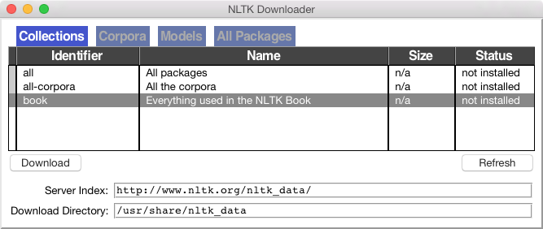

.. -*- mode: rst -*-
.. include:: ../definitions.rst

.. TODO: update cspy reference to more recent book
.. TODO: add some literature references (esp to other intro linguistics textbooks)
.. TODO: adopt simpler hacker example with only single character transpositions;
   move hacker example to later section (later chapter?)
.. TODO: get URL hyperlinks to be fixed width
.. TODO: websites with automatically generated language -- lobner prize... 

.. _chap-introduction:

=================================
1. Language Processing and Python
=================================

It is easy to get our hands on millions of words of text.
What can we do with it, assuming we can write some simple programs?
In this chapter we'll address the following questions:

#. What can we achieve by combining simple programming techniques with large quantities of text?
#. How can we automatically extract key words and phrases that sum up the style and content of a text?
#. What tools and techniques does the Python programming language provide for such work?
#. What are some of the interesting challenges of natural language processing?

This chapter is divided into sections that skip between two quite
different styles.  In the "computing with language" sections we will
take on some linguistically motivated programming tasks without necessarily
explaining how they work.  In the "closer look at Python" sections we
will systematically review key programming concepts.  We'll flag the two styles in the section titles,
but later chapters will mix both styles without being so up-front about it.
We hope this style of introduction gives you an
authentic taste of what will come later, while covering a range of
elementary concepts in linguistics and computer science.
If you have basic familiarity with both areas, you can skip to
sec-automatic-natural-language-understanding_;
we will repeat any important points in later chapters, and if you miss anything
you can easily consult the online reference material at |NLTK-URL|.
If the material is completely new to you, this chapter will raise
more questions than it answers, questions that are addressed in
the rest of this book.

.. _sec-automatic-natural-language-understanding:

----------------------------------------
Automatic Natural Language Understanding
----------------------------------------

..
    >>> from nltk.misc import babelize_shell

We have been exploring language bottom-up, with the help of texts and
the Python programming
language.  However, we're also interested in exploiting our knowledge of language and computation
by building useful language technologies. We'll take the opportunity
now to step back from the nitty-gritty of code in order to paint a
bigger picture of natural language processing.

At a purely practical level, we all need help to navigate the universe of information
locked up in text on the Web.  Search engines have been crucial to the
growth and popularity of the Web, but have some shortcomings.
It takes skill, knowledge, and some luck,
to extract answers to such questions as: `What tourist sites can I
visit between Philadelphia and Pittsburgh on a limited budget?`:lx:
`What do experts say about digital SLR cameras?`:lx: `What
predictions about the steel market were made by credible commentators
in the past week?`:lx: Getting a computer to answer them automatically
involves a range of language processing tasks, including information extraction,
inference, and summarization, and would need to be carried out on a scale
and with a level of robustness that is still beyond our current capabilities.

On a more philosophical level, a long-standing challenge within artificial intelligence
has been to build intelligent machines, and a major part of intelligent behaviour is understanding
language.  For many years this goal has been seen as too difficult.
However, as |NLP| technologies become more mature, and robust methods for
analyzing unrestricted text become more widespread, the prospect of
natural language understanding has re-emerged as a plausible goal.

In this section we describe some language understanding technologies,
to give you a sense of the interesting challenges that are waiting for you.

Word Sense Disambiguation
-------------------------

In `word sense disambiguation`:dt: we want to work out
which sense of a word was intended in a given context.  Consider the
ambiguous words `serve`:lx: and `dish`:lx:\ :

.. ex::
    .. ex:: `serve`:lx:\ : help with food or drink; hold an office; put ball into play
    .. ex:: `dish`:lx:\ : plate; course of a meal; communications device

In a sentence containing the phrase: `he served the dish`:lx:, you
can detect that both `serve`:lx: and `dish`:lx: are being used with
their food meanings.  It's unlikely that the topic of discussion
shifted from sports to crockery in the space of three words.
This would force you to invent bizarre images, like a tennis pro
taking out his or her frustrations on a china tea-set laid out beside the court. 
In other words, we automatically disambiguate words using context, exploiting
the simple fact that nearby words have closely related meanings.
As another example of this contextual effect, consider the word
`by`:lx:, which has several meanings, e.g.: `the book by
Chesterton`:lx: (agentive |mdash| Chesterton was the author of the book);
`the cup by the stove`:lx: (locative |mdash| the stove is where the
cup is); and `submit by Friday`:lx: (temporal |mdash| Friday is the
time of the submitting).
Observe in ex-lost-children_ that the meaning of the italicized word helps us
interpret the meaning of `by`:lx:.

.. _ex-lost-children:
.. ex::
   .. ex:: The lost children were found by the `searchers`:em:  (agentive)
   .. ex:: The lost children were found by the `mountain`:em:   (locative)
   .. ex:: The lost children were found by the `afternoon`:em:  (temporal)

Pronoun Resolution
------------------

A deeper kind of language understanding is to work out "who did what to whom" |mdash|
i.e., to detect the subjects and objects of verbs.  You learnt to do this in
elementary school, but it's harder than you might think.
In the sentence `the thieves stole the paintings`:lx:
it is easy to tell who performed the stealing action.
Consider three possible following sentences in ex-thieves_, and try to determine
what was sold, caught, and found (one case is ambiguous).
  
.. _ex-thieves:
.. ex::
   .. ex:: The thieves stole the paintings.  They were subsequently `sold`:em:.
   .. ex:: The thieves stole the paintings.  They were subsequently `caught`:em:.
   .. ex:: The thieves stole the paintings.  They were subsequently `found`:em:.

Answering this question involves finding the `antecedent`:dt: of the pronoun `they`:lx:,
either thieves or paintings.  Computational techniques for tackling this problem
include `anaphora resolution`:dt: |mdash| identifying what a pronoun or noun phrase
refers to |mdash| and `semantic role labeling`:dt: |mdash| identifying how a noun phrase
relates to the verb (as agent, patient, instrument, and so on).

Generating Language Output
--------------------------

If we can automatically solve such problems of language understanding, we will
be able to move on to tasks that involve generating language output, such as
`question answering`:dt: and `machine translation`:dt:.  In the first case,
a machine should be able to answer a user's questions relating to collection of texts:

.. _ex-qa-application:
.. ex::
   .. ex:: *Text:* ... The thieves stole the paintings.  They were subsequently sold. ...
   .. ex:: *Human:* Who or what was sold?
   .. ex:: *Machine:* The paintings.

The machine's answer demonstrates that it has correctly worked out that `they`:lx:
refers to paintings and not to thieves.  In the second case, the machine should
be able to translate the text into another language, accurately
conveying the meaning of the original text.  In translating the example text into French,
we are forced to choose the gender of the pronoun in the second sentence:
`ils`:lx: (masculine) if the thieves are found, and `elles`:lx: (feminine) if
the paintings are found.  Correct translation actually depends on correct understanding of
the pronoun.

.. _ex-mt-application:
.. ex::
   .. ex:: The thieves stole the paintings.  They were subsequently found.
   .. ex:: Les voleurs ont vol\ |eacute| les peintures. Ils ont |eacute|\ t\ |eacute| trouv\ |eacute|\ s plus tard.  (the thieves)
   .. ex:: Les voleurs ont vol\ |eacute| les peintures. Elles ont |eacute|\ t\ |eacute| trouv\ |eacute|\ es plus tard.  (the paintings)
    
In all of these examples, working out the sense of a word, the subject of a verb, and the 
antecedent of a pronoun are steps in establishing the meaning of a sentence, things
we would expect a language understanding system to be able to do.

Machine Translation
-------------------

For a long time now, machine translation (MT) has
been the holy grail of language understanding,
ultimately seeking to provide high-quality,
idiomatic translation between any pair of languages.
Its roots go back to the early days of the Cold War, when the promise
of automatic translation led to substantial government sponsorship,
and with it, the genesis of |NLP| itself.

Today, practical translation systems exist for particular pairs
of languages, and some are integrated into web search engines.
However, these systems have some serious shortcomings, which
are starkly revealed by translating a sentence back and forth
between a pair of languages until equilibrium is reached, e.g.:

| 0> how long before the next flight to Alice Springs?
| 1> wie lang vor dem folgenden Flug zu Alice Springs?
| 2> how long before the following flight to Alice jump?
| 3> wie lang vor dem folgenden Flug zu Alice springen Sie?
| 4> how long before the following flight to Alice do you jump?
| 5> wie lang, bevor der folgende Flug zu Alice tun, Sie springen?
| 6> how long, before the following flight to Alice does, do you jump?
| 7> wie lang bevor der folgende Flug zu Alice tut, tun Sie springen?
| 8> how long before the following flight to Alice does, do you jump?
| 9> wie lang, bevor der folgende Flug zu Alice tut, tun Sie springen?
| 10> how long, before the following flight does to Alice, do do you jump?
| 11> wie lang bevor der folgende Flug zu Alice tut, Sie tun Sprung?
| 12> how long before the following flight does leap to Alice, does you?

Observe that the system correctly translates `Alice Springs`:lx: from English
to German (in the line starting ``1>``), but on the way back to English, this ends up as `Alice jump`:lx:
(line ``2``).  The preposition `before`:lx: is initially translated into the corresponding
German preposition `vor`:lx:, but later into the conjunction `bevor`:lx: (line 5).
After line ``5`` the sentences become nonsensical (but notice the various phrasings
indicated by the commas, and the change from `jump`:lx: to `leap`:lx:).
The translation system did not recognize when a word was part of a proper name,
and it misinterpreted the grammatical structure.

.. note:: |TRY| Try this yourself using ``http://translationparty.com/``

Machine translation is difficult because a given word could have several possible
translations (depending on its meaning), and because word order must be changed
in keeping with the grammatical structure of the target language.
Today these difficulties are being faced by collecting massive quantities of
parallel texts from news and government websites that publish documents
in two or more languages.  Given a document in German and English, and possibly
a bilingual dictionary, we can automatically pair up the sentences,
a process called `text alignment`:dt:.  Once we have a million or more sentence
pairs, we can detect corresponding words and phrases, and build a model
that can be used for translating new text.

Spoken Dialog Systems
---------------------

In the history of artificial intelligence, the chief measure of intelligence
has been a linguistic one, namely the `Turing Test`:dt:\ : can a dialogue system,
responding to a user's text input, perform so naturally that we cannot distinguish
it from a human-generated response?  In contrast, today's commercial dialogue systems
are very limited, but still perform useful functions in narrowly-defined domains,
as we see here:

| S: How may I help you?
| U: When is Saving Private Ryan playing?
| S: For what theater?
| U: The Paramount theater.
| S: Saving Private Ryan is not playing at the Paramount theater, but
| it's playing at the Madison theater at 3:00, 5:30, 8:00, and 10:30. 

You could not ask this system to provide driving instructions or
details of nearby restaurants unless the required information
had already been stored and suitable question-answer pairs
had been incorporated into the language processing system.

Observe that this system seems to understand the user's goals:
the user asks when a movie is showing and the system
correctly determines from this that the user wants to see
the movie. This inference seems so obvious that you probably
didn't notice it was made, yet a natural language system
needs to be endowed with this capability in order to interact
naturally.  Without it, when asked `Do you know when Saving Private
Ryan is playing?`:lx:, a system might unhelpfully respond with a cold `Yes`:lx:.
However, the developers of commercial dialogue systems use
contextual assumptions and business logic to ensure that the different ways in which a user might
express requests or provide information are handled in a way that
makes sense for the particular application.  So, if you type
`When is ...`:lx:, or `I want to know when ...`:lx:, or `Can you tell me
when ...`:lx:, simple rules will always yield screening times.  This is
enough for the system to provide a useful service.

.. _fig-sds:
.. figure:: ../images/dialogue.png
   :scale: 25:32:30

   Simple Pipeline Architecture for a Spoken Dialogue System:
   Spoken input (top left) is analyzed, words are recognized, sentences are parsed and
   interpreted in context, application-specific actions take place (top right);
   a response is planned, realized as a syntactic structure, then to suitably
   inflected words, and finally to spoken output; different types of
   linguistic knowledge inform each stage of the process.

Dialogue systems give us an opportunity to mention the
commonly assumed pipeline for |NLP|.
fig-sds_ shows the architecture of a simple dialogue system.
Along the top of the diagram, moving from left to right, is a
"pipeline" of some language understanding `components`:dt:.
These map from speech input via syntactic parsing
to some kind of meaning representation.  Along the middle, moving from
right to left, is the reverse pipeline of components for converting
concepts to speech.  These components make up the dynamic aspects of the system.
At the bottom of the diagram are some representative bodies of
static information: the repositories of language-related data that
the processing components draw on to do their work.

.. note:: |TRY|
   For an example of a primitive dialogue system, try having
   a conversation with an NLTK chatbot.  To see the available chatbots,
   run ``nltk.chat.chatbots()``.
   (Remember to ``import nltk`` first.) 

Textual Entailment
------------------

The challenge of language understanding has been brought into focus in recent years by a public
"shared task" called Recognizing Textual Entailment (RTE). The basic
scenario is simple.  Suppose you want to find evidence to support
the hypothesis: `Sandra Goudie was defeated by Max Purnell`:lx:, and
that you have another short text that seems to be relevant, for example,
`Sandra Goudie was first elected to Parliament in the 2002 elections,
narrowly winning the seat of Coromandel by defeating Labour candidate
Max Purnell and pushing incumbent Green MP Jeanette Fitzsimons into
third place`:lx:.  Does the text provide enough evidence for you to
accept the hypothesis?  In this particular case, the answer will be "No."
You can draw this conclusion easily, but it is very hard to come up with 
automated methods for making the right decision. The RTE
Challenges provide data that allow competitors to develop their
systems, but not enough data for "brute force" machine learning techniques (a topic
we will cover in chap-data-intensive_\ ).  Consequently, some
linguistic analysis is crucial. In the previous example, it is important
for the system to note that `Sandra Goudie`:lx: names the person being
defeated in the hypothesis, not the person doing the defeating in the
text. As another illustration of the difficulty of the task, consider
the following text-hypothesis pair:

.. ex::
   .. ex:: Text: David Golinkin is the editor or author of eighteen books, and over 150 responsa, articles, sermons and books 
   .. ex:: Hypothesis: Golinkin has written eighteen books

In order to determine whether the hypothesis is supported by the
text, the system needs the following background knowledge:
(i) if someone is an author of a book, then he/she has written that
book; (ii) if someone is an editor of a book, then he/she has not
written (all of) that book; (iii) if someone is editor or author of eighteen
books, then one cannot conclude that he/she is author of eighteen books. 

Limitations of |NLP|
--------------------

Despite the research-led advances in tasks like RTE, natural language
systems that have been deployed for real-world applications still cannot perform
common-sense reasoning or draw on world knowledge in a general and
robust manner.  We can wait for these difficult artificial
intelligence problems to be solved, but in the meantime it is
necessary to live with some severe limitations on the reasoning and
knowledge capabilities of natural language systems. Accordingly, right
from the beginning, an important goal of |NLP| research has been to
make progress on the difficult task of building technologies that
"understand language," using superficial yet powerful techniques instead of
unrestricted knowledge and reasoning capabilities.
Indeed, this is one of the goals of this book, and we hope to equip you with
the knowledge and skills to build useful |NLP| systems, and to
contribute to the long-term aspiration of building intelligent machines.

.. _sec-overview-of-nltk:

----------------
Overview of NLTK
----------------

Getting Started
---------------

Before going further you should install |NLTK3|\ , downloadable for free from |NLTK-URL|.
Follow the instructions there to download the version required for your platform.

Once you've installed |NLTK|, start up the Python interpreter as
before, and install the data required for the book by
typing the following two commands at the Python prompt, then selecting
the ``book`` collection as shown in fig-nltk-downloader_.
   
.. doctest-ignore::
    >>> import nltk
    >>> nltk.download()
   
.. _fig-nltk-downloader:

   Downloading the NLTK Book Collection: browse the available packages
   using ``nltk.download()``.  The **Collections** tab on the downloader
   shows how the packages are grouped into sets, and you should select the line labeled
   **book** to obtain all
   data required for the examples and exercises in this book.  It consists
   of about 30 compressed files requiring about 100Mb disk space.
   The full collection of data (i.e., **all** in the downloader) is
   nearly ten times this size (at the time of writing) and continues to expand.

Once the data is downloaded to your machine, you can load some of it
using the Python interpreter.
The first step is to type a special command at the
Python prompt which tells the interpreter to load some texts for us to
explore: ``from nltk.book import *``.
This says "from NLTK's ``book`` module, load
all items."  The ``book`` module contains all the data you will need
as you read this chapter.  After printing a welcome message, it loads
the text of several books (this will take a few seconds).  Here's the
command again, together with the output that
you will see.  Take care to get spelling and punctuation right, and
remember that you don't type the ``>>>``.

    >>> from nltk.book import *
    *** Introductory Examples for the NLTK Book ***
    Loading text1, ..., text9 and sent1, ..., sent9
    Type the name of the text or sentence to view it.
    Type: 'texts()' or 'sents()' to list the materials.
    text1: Moby Dick by Herman Melville 1851
    text2: Sense and Sensibility by Jane Austen 1811
    text3: The Book of Genesis
    text4: Inaugural Address Corpus
    text5: Chat Corpus
    text6: Monty Python and the Holy Grail
    text7: Wall Street Journal
    text8: Personals Corpus
    text9: The Man Who Was Thursday by G . K . Chesterton 1908
    >>>

Any time we want to find out about these texts, we just have
to enter their names at the Python prompt:

    >>> text1
    <Text: Moby Dick by Herman Melville 1851>
    >>> text2
    <Text: Sense and Sensibility by Jane Austen 1811>
    >>>

Now that we can use the Python interpreter, and have some data to work with,
we're ready to get started.

Searching Text
--------------

There are many ways to examine the context of a text apart from
simply reading it.  A concordance view shows us every occurrence of a given word, together
with some context.  Here we look up the word `monstrous`:lx: in *Moby
Dick* by entering ``text1`` followed by a period, then the term
``concordance``, and then placing ``"monstrous"`` in parentheses:

    >>> text1.concordance("monstrous")
    Displaying 11 of 11 matches:
    ong the former , one was of a most monstrous size . ... This came towards us ,
    ON OF THE PSALMS . " Touching that monstrous bulk of the whale or ork we have r
    ll over with a heathenish array of monstrous clubs and spears . Some were thick
    d as you gazed , and wondered what monstrous cannibal and savage could ever hav
    that has survived the flood ; most monstrous and most mountainous ! That Himmal
    they might scout at Moby Dick as a monstrous fable , or still worse and more de
    th of Radney .'" CHAPTER 55 Of the monstrous Pictures of Whales . I shall ere l
    ing Scenes . In connexion with the monstrous pictures of whales , I am strongly
    ere to enter upon those still more monstrous stories of them which are to be fo
    ght have been rummaged out of this monstrous cabinet there is no telling . But
    of Whale - Bones ; for Whales of a monstrous size are oftentimes cast up dead u
    >>>

The first time you use a concordance on a particular text, it takes a
few extra seconds to build an index so that subsequent searches are fast.

.. note:: |TRY|
   Try searching for other words; to save re-typing, you might be able to
   use up-arrow, Ctrl-up-arrow or Alt-p to access the previous command and modify the word being searched.
   You can also try searches on some of the other texts we have included.
   For example, search *Sense and Sensibility* for the word
   `affection`:lx:, using ``text2.concordance("affection")``.  Search the book of Genesis
   to find out how long some people lived, using
   ``text3.concordance("lived")``.  You could look at ``text4``, the
   *Inaugural Address Corpus*, to see examples of English going
   back to 1789, and search for words like `nation`:lx:, `terror`:lx:, `god`:lx:
   to see how these words have been used differently over time.
   We've also included ``text5``, the *NPS Chat Corpus*: search this for
   unconventional words like `im`:lx:, `ur`:lx:, `lol`:lx:.
   (Note that this corpus is uncensored!)

Once you've spent a little while examining these texts, we hope you have a new
sense of the richness and diversity of language.  In the next chapter
you will learn how to access a broader range of text, including text in
languages other than English.

A concordance permits us to see words in context.  For example, we saw that
`monstrous`:lx: occurred in contexts such as `the ___ pictures`:lx:
and `a ___ size`:lx: .  What other words appear in a similar range
of contexts?  We can find out
by appending the term ``similar`` to the name of the text in
question, then inserting the relevant word in parentheses:

    >>> text1.similar("monstrous")
    mean part maddens doleful gamesome subtly uncommon careful untoward
    exasperate loving passing mouldy christian few true mystifying
    imperial modifies contemptible
    >>> text2.similar("monstrous")
    very heartily so exceedingly remarkably as vast a great amazingly
    extremely good sweet
    >>>

Observe that we get different results for different texts.  
Austen uses this word quite differently from Melville; for her, `monstrous`:lx: has
positive connotations, and sometimes functions as an intensifier like the word
`very`:lx:.  

The term ``common_contexts`` allows us to examine just the
contexts that are shared by two or more words, such as `monstrous`:lx:
and `very`:lx:. We have to enclose these words by square brackets as
well as parentheses, and separate them with a comma:

    >>> text2.common_contexts(["monstrous", "very"])
    a_pretty is_pretty am_glad be_glad a_lucky
    >>>

.. note:: |TRY|
   Pick another pair of words and compare their usage in two different texts, using
   the ``similar()`` and ``common_contexts()`` functions.

It is one thing to automatically detect that a particular word occurs in a text,
and to display some words that appear in the same context.  However, we can also determine
the *location* of a word in the text: how many words from the beginning it appears.
This positional information can be displayed using a `dispersion plot`:dt:.
Each stripe represents an instance
of a word, and each row represents the entire text.  In fig-inaugural_ we
see some striking patterns of word usage over the last 220 years
(in an artificial text constructed by joining
the texts of the Inaugural Address Corpus end-to-end). 
You can produce this plot as shown below.
You might like to try more words (e.g., `liberty`:lx:, `constitution`:lx:),
and different texts.  Can you predict the
dispersion of a word before you view it?  As before, take
care to get the quotes, commas, brackets and parentheses exactly right.

.. doctest-ignore::
    >>> text4.dispersion_plot(["citizens", "democracy", "freedom", "duties", "America"])
    >>>

.. _fig-inaugural:
.. figure:: ../images/inaugural.png
   :scale: 90:90:90

   Lexical Dispersion Plot for Words in U.S. Presidential Inaugural Addresses:
   This can be used to investigate changes in language use over time.

.. note:: |IMPORTANT|
   You need to have Python's NumPy and Matplotlib packages installed
   in order to produce the graphical plots used in this book.
   Please see |NLTK-URL| for installation instructions.

.. note::
   You can also plot the frequency of word usage through time using
   |GOOGLE-NGRAM|

Now, just for fun, let's try generating some random text in the various
styles we have just seen.  To do this, we type the name of the text
followed by the term ``generate``. (We need to include the
parentheses, but there's nothing that goes between them.)

    >>> text3.generate()
    In the beginning of his brother is a hairy man , whose top may reach
    unto heaven ; and ye shall sow the land of Egypt there was no bread in
    all that he was taken out of the month , upon the earth . So shall thy
    wages be ? And they made their father ; and Isaac was old , and kissed
    him : and Laban with his cattle in the midst of the hands of Esau thy
    first born , and Phichol the chief butler unto his son Isaac , she
    >>>

.. note::
   The ``generate()`` method is not available in NLTK 3.0 but will be
   reinstated in a subsequent version.

..
   Note that the first time you run this command, it is slow because it gathers statistics
   about word sequences.  Each time you run it, you will get different output text.
   Now try generating random text in the style of an inaugural address or an
   Internet chat room.  Although the text is random, it re-uses common words and
   phrases from the source text and gives us a sense of its style and content.
   (What is lacking in this randomly generated text?)

.. note
   When ``generate`` produces its output, punctuation is split off
   from the preceding word.  While this is not correct formatting
   for English text, we do it to make clear that words and
   punctuation are independent of one another. You will learn
   more about this in chap-words_.

.. _sec-computing-with-language-simple-statistics:

------------------------------------------
Computing with Language: Simple Statistics
------------------------------------------

.. reimport

   >>> from nltk.book import *

In this section we take up the question of what makes a text distinct,
and use automatic methods to find characteristic words and expressions
of a text.

Before continuing further, you might like to check your understanding of the
last section by predicting the output of the following code.  You can use
the interpreter to check whether you got it right.  If you're not sure how
to do this task, it would be a good idea to review the previous section
before continuing further.

    >>> saying = ['After', 'all', 'is', 'said', 'and', 'done',
    ...           'more', 'is', 'said', 'than', 'done']
    >>> tokens = set(saying)
    >>> tokens = sorted(tokens)
    >>> tokens[-2:]
    what output do you expect here?
    >>>

Frequency Distributions
-----------------------

How can we automatically identify the words of a text that are most
informative about the topic and genre of the text?  Imagine how you might
go about finding the 50 most frequent words of a book.  One method
would be to keep a tally for each vocabulary item, like that shown in fig-tally_.
The tally would need thousands of rows, and it would be an exceedingly
laborious process |mdash| so laborious that we would rather assign the task to a machine.

.. _fig-tally:
.. figure:: ../images/tally.png
   :scale: 20:100:25

   Counting Words Appearing in a Text (a frequency distribution)

The table in fig-tally_ is known as a `frequency distribution`:dt:,
and it tells us the frequency of each vocabulary item in the text.
(In general, it could count any kind of observable event.)
It is a "distribution"
because it tells us how the total number of word tokens in the text
are distributed across the vocabulary items.
Since we often need frequency distributions in language processing, NLTK
provides built-in support for them.  Let's use a ``FreqDist`` to find the
50 most frequent words of *Moby Dick*:

    >>> fdist1 = FreqDist(text1) # [_freq-dist-call]
    >>> print(fdist1) # [_freq-dist-inspect]
    <FreqDist with 19317 samples and 260819 outcomes>
    >>> fdist1.most_common(50) # [_freq-dist-most-common]
    [(',', 18713), ('the', 13721), ('.', 6862), ('of', 6536), ('and', 6024),
    ('a', 4569), ('to', 4542), (';', 4072), ('in', 3916), ('that', 2982),
    ("'", 2684), ('-', 2552), ('his', 2459), ('it', 2209), ('I', 2124),
    ('s', 1739), ('is', 1695), ('he', 1661), ('with', 1659), ('was', 1632),
    ('as', 1620), ('"', 1478), ('all', 1462), ('for', 1414), ('this', 1280),
    ('!', 1269), ('at', 1231), ('by', 1137), ('but', 1113), ('not', 1103),
    ('--', 1070), ('him', 1058), ('from', 1052), ('be', 1030), ('on', 1005),
    ('so', 918), ('whale', 906), ('one', 889), ('you', 841), ('had', 767),
    ('have', 760), ('there', 715), ('But', 705), ('or', 697), ('were', 680),
    ('now', 646), ('which', 640), ('?', 637), ('me', 627), ('like', 624)]
    >>> fdist1['whale']
    906
    >>>

When we first invoke ``FreqDist``, we pass the name of the text as an
argument freq-dist-call_. We can inspect the total number of words ("outcomes")
that have been counted up freq-dist-inspect_ |mdash| 260,819 in the
case of *Moby Dick*. The expression ``most_common(50)`` gives us a list of
the 50 most frequently occurring types in the text freq-dist-most-common_.

.. note:: |TRY|
   Try the preceding frequency distribution example for yourself, for
   ``text2``.  Be careful to use the correct parentheses and uppercase letters.
   If you get an error message ``NameError: name 'FreqDist' is not defined``,
   you need to start your work with ``from nltk.book import *``

.. SB: no period after the above import statement

Do any words produced in the last example help us grasp the topic or genre of this text?
Only one word, `whale`:lx:, is slightly informative!  It occurs over 900 times.
The rest of the words tell us nothing about the text; they're just English "plumbing."
What proportion of the text is taken up with such words?
We can generate a cumulative frequency plot for these words,
using ``fdist1.plot(50, cumulative=True)``, to produce the graph in fig-fdist-moby_.
These 50 words account for nearly half the book!

.. _fig-fdist-moby:
.. figure:: ../images/fdist-moby.png
   :scale: 20:25:25

   Cumulative Frequency Plot for 50 Most Frequently Words in *Moby Dick*:
   these account for nearly half of the tokens.

If the frequent words don't help us, how about the words that occur once
only, the so-called `hapaxes`:dt:?  View them by typing ``fdist1.hapaxes()``.
This list contains `lexicographer`:lx:, `cetological`:lx:,
`contraband`:lx:, `expostulations`:lx:, and about 9,000 others.
It seems that there are too many rare words, and without seeing the
context we probably can't guess what half of the hapaxes mean in any case!
Since neither frequent nor infrequent words help, we need to try
something else.

Fine-grained Selection of Words
-------------------------------

Next, let's look at the *long* words of a text; perhaps these will be
more characteristic and informative.  For this we adapt some notation
from set theory.  We would like to find the words from the vocabulary
of the text that are more than 15 characters long.  Let's call
this property `P`:math:, so that `P(w)`:math: is true
if and only if `w`:math: is more than 15 characters long.
Now we can express the words of interest using mathematical 
set notation as shown in ex-set-comprehension-math_.
This means "the set of all `w`:math: such that `w`:math: is an
element of `V`:math: (the vocabulary) and `w`:math: has property `P`:math:".

.. _ex-set-comprehension:
.. ex::
   .. _ex-set-comprehension-math:
   .. ex:: {`w`:math: | `w`:math: |element| `V`:math: & `P(w)`:math:\ }
   .. _ex-set-comprehension-python:
   .. ex:: ``[w for w in V if p(w)]``

The corresponding Python expression is given in ex-set-comprehension-python_.
(Note that it produces a list, not a set, which means that duplicates are possible.)
Observe how similar the two notations are.  Let's go one more step and
write executable Python code:

    >>> V = set(text1)
    >>> long_words = [w for w in V if len(w) > 15]
    >>> sorted(long_words)
    ['CIRCUMNAVIGATION', 'Physiognomically', 'apprehensiveness', 'cannibalistically',
    'characteristically', 'circumnavigating', 'circumnavigation', 'circumnavigations',
    'comprehensiveness', 'hermaphroditical', 'indiscriminately', 'indispensableness',
    'irresistibleness', 'physiognomically', 'preternaturalness', 'responsibilities',
    'simultaneousness', 'subterraneousness', 'supernaturalness', 'superstitiousness',
    'uncomfortableness', 'uncompromisedness', 'undiscriminating', 'uninterpenetratingly']
    >>>

For each word ``w`` in the vocabulary ``V``, we check whether
``len(w)`` is greater than 15; all other words will
be ignored.  We will discuss this syntax more carefully later.

.. note:: |TRY|
   Try out the previous statements in the Python interpreter,
   and experiment with changing the text and changing the length condition.
   Does it make a difference to your results if you change the
   variable names, e.g., using ``[word for word in vocab if ...]``? 

Let's return to our task of finding words that characterize a text.
Notice that the long words in ``text4`` reflect its national focus
|mdash| `constitutionally`:lx:, `transcontinental`:lx: |mdash|
whereas those in ``text5`` reflect its informal content:
`boooooooooooglyyyyyy`:lx: and `yuuuuuuuuuuuummmmmmmmmmmm`:lx:.
Have we succeeded in automatically extracting words that typify
a text?  Well, these very long words are often hapaxes (i.e., unique)
and perhaps it would be better to find *frequently occurring*
long words.  This seems promising since it eliminates
frequent short words (e.g., `the`:lx:) and infrequent long words
(e.g. `antiphilosophists`:lx:).
Here are all words from the chat corpus
that are longer than seven characters, that occur more than seven times:

    >>> fdist5 = FreqDist(text5)
    >>> sorted(w for w in set(text5) if len(w) > 7 and fdist5[w] > 7)
    ['#14-19teens', '#talkcity_adults', '((((((((((', '........', 'Question',
    'actually', 'anything', 'computer', 'cute.-ass', 'everyone', 'football',
    'innocent', 'listening', 'remember', 'seriously', 'something', 'together',
    'tomorrow', 'watching']
    >>>

Notice how we have used two conditions: ``len(w) > 7`` ensures that the
words are longer than seven letters, and ``fdist5[w] > 7`` ensures that
these words occur more than seven times.  At last we have managed to
automatically identify the frequently-occurring content-bearing
words of the text.  It is a modest but important milestone: a tiny piece of code,
processing tens of thousands of words, produces some informative output.

Collocations and Bigrams
------------------------

A `collocation`:dt: is a sequence of words that occur together
unusually often. Thus `red wine`:lx: is a collocation, whereas `the
wine`:lx: is not. A characteristic of collocations is that they are
resistant to substitution with words that have similar senses;
for example, `maroon wine`:lx: sounds definitely odd.  

To get a handle on collocations, we start off by extracting from a text
a list of word pairs, also known as `bigrams`:dt:. This is easily
accomplished with the function ``bigrams()``:

    >>> list(bigrams(['more', 'is', 'said', 'than', 'done']))
    [('more', 'is'), ('is', 'said'), ('said', 'than'), ('than', 'done')]
    >>>

.. note::
   If you omitted ``list()`` above, and just typed ``bigrams(['more', ...])``,
   you would have seen output of the form ``<generator object bigrams at 0x10fb8b3a8>``.
   This is Python's way of saying that it is ready to compute
   a sequence of items, in this case, bigrams. For now, you just need
   to know to tell Python to convert it into a list, using ``list()``.

Here we see that the pair of words `than-done`:lx: is a bigram, and we write
it in Python as ``('than', 'done')``.  Now, collocations are essentially
just frequent bigrams, except that we want to pay more attention to the
cases that involve rare words.  In particular, we want to find
bigrams that occur more often than we would expect based on
the frequency of the individual words.  The ``collocations()`` function
does this for us. We will see how it works later.

    >>> text4.collocations()
    United States; fellow citizens; four years; years ago; Federal
    Government; General Government; American people; Vice President; Old
    World; Almighty God; Fellow citizens; Chief Magistrate; Chief Justice;
    God bless; every citizen; Indian tribes; public debt; one another;
    foreign nations; political parties
    >>> text8.collocations()
    would like; medium build; social drinker; quiet nights; non smoker;
    long term; age open; Would like; easy going; financially secure; fun
    times; similar interests; Age open; weekends away; poss rship; well
    presented; never married; single mum; permanent relationship; slim
    build
    >>>

The collocations that emerge are very specific to the genre of the
texts. In order to find  `red wine`:lx: as a collocation, we would
need to process a much larger body of text.

Counting Other Things
---------------------

Counting words is useful, but we can count other things too.  For example, we can
look at the distribution of word lengths in a text, by creating a ``FreqDist``
out of a long list of numbers, where each number is the length of the corresponding
word in the text: 

    >>> [len(w) for w in text1] # [_word-lengths]
    [1, 4, 4, 2, 6, 8, 4, 1, 9, 1, 1, 8, 2, 1, 4, 11, 5, 2, 1, 7, 6, 1, 3, 4, 5, 2, ...]
    >>> fdist = FreqDist(len(w) for w in text1)  # [_freq-word-lengths]
    >>> print(fdist)  # [_freq-word-lengths-size]
    <FreqDist with 19 samples and 260819 outcomes>
    >>> fdist
    FreqDist({3: 50223, 1: 47933, 4: 42345, 2: 38513, 5: 26597, 6: 17111, 7: 14399,
      8: 9966, 9: 6428, 10: 3528, ...})
    >>>

We start by deriving a list of the lengths of words in ``text1``
word-lengths_,
and the ``FreqDist`` then counts the number of times each of these
occurs freq-word-lengths_. The result freq-word-lengths-size_ is a distribution containing
a quarter of a million items, each of which is a number corresponding to a
word token in the text.  But there are at most only 20 distinct
items being counted, the numbers 1 through 20, because there are only 20
different word lengths.  I.e., there are words consisting of just one character,
two characters, ..., twenty characters, but none with twenty one or more
characters.  One might wonder how frequent the different lengths of word are
(e.g., how many words of length four appear in the text, are there more words of length five
than length four, etc). We can do this as follows:

    >>> fdist.most_common()
    [(3, 50223), (1, 47933), (4, 42345), (2, 38513), (5, 26597), (6, 17111), (7, 14399),
    (8, 9966), (9, 6428), (10, 3528), (11, 1873), (12, 1053), (13, 567), (14, 177),
    (15, 70), (16, 22), (17, 12), (18, 1), (20, 1)]
    >>> fdist.max()
    3
    >>> fdist[3]
    50223
    >>> fdist.freq(3)
    0.19255882431878046
    >>>

From this we see that the most frequent word length is 3, and that
words of length 3 account for roughly 50,000 (or 20%) of the words making up the
book.  Although we will not pursue it here, further analysis of word
length might help us understand differences between authors, genres, or
languages.

tab-freqdist_ summarizes the functions defined in frequency distributions.

.. table:: tab-freqdist

   ===============================  ======================================================================
   Example                          Description
   ===============================  ======================================================================
   ``fdist = FreqDist(samples)``    create a frequency distribution containing the given samples
   ``fdist[sample] += 1``           increment the count for this sample
   ``fdist['monstrous']``           count of the number of times a given sample occurred
   ``fdist.freq('monstrous')``      frequency of a given sample
   ``fdist.N()``                    total number of samples
   ``fdist.most_common(n)``         the ``n`` most common samples and their frequencies
   ``for sample in fdist:``         iterate over the samples
   ``fdist.max()``                  sample with the greatest count
   ``fdist.tabulate()``             tabulate the frequency distribution
   ``fdist.plot()``                 graphical plot of the frequency distribution
   ``fdist.plot(cumulative=True)``  cumulative plot of the frequency distribution
   ``fdist1 |= fdist2``             update ``fdist1`` with counts from ``fdist2``
   ``fdist1 < fdist2``              test if samples in ``fdist1`` occur less frequently than in ``fdist2``
   ===============================  ======================================================================

   Functions Defined for |NLTK|\ 's Frequency Distributions

Our discussion of frequency distributions has introduced some important Python concepts,
and we will look at them systematically in sec-making-decisions_.

.. 
   We've also touched on the topic of normalization, and we'll explore this in
   depth in chap-words_.   

---------------
Further Reading
---------------

This chapter has introduced new concepts in programming, natural language processing,
and linguistics, all mixed in together.
Many of them are consolidated in the following chapters.  However, you may also want to
consult the online materials provided with this chapter (at |NLTK-URL|), including links
to additional background materials, and links to online |NLP| systems.
You may also like to read up on
some linguistics and |NLP|\ -related concepts in Wikipedia (e.g., collocations,
the Turing Test, the type-token distinction).

You should acquaint yourself with the Python documentation available at |PYTHON-DOCS|,
including the many tutorials and comprehensive reference materials linked there.
A `Beginner's Guide to Python`:em: is available at ``http://wiki.python.org/moin/BeginnersGuide``.
Miscellaneous questions about Python might be answered in the FAQ at
``http://python.org/doc/faq/general/``.

As you delve into |NLTK|, you might want to subscribe to the mailing list where new
releases of the toolkit are announced.  There is also an NLTK-Users mailing list,
where users help each other as they learn how to use Python and |NLTK| for
language analysis work.  Details of these lists are available at |NLTK-URL|.

For more information on the topics covered in sec-automatic-natural-language-understanding_,
and on |NLP| more generally, you might like to consult one of the following excellent
books:

* Indurkhya, Nitin and Fred Damerau (eds, 2010) *Handbook of Natural Language Processing*
  (Second Edition) Chapman & Hall/CRC. 2010.  [IndurkhyaDamerau2010]_ [Dale00handbook]_

* Jurafsky, Daniel and James Martin (2008) *Speech and Language Processing* (Second Edition).  Prentice Hall.
  [JurafskyMartin2008]_

* Mitkov, Ruslan (ed, 2003) *The Oxford Handbook of Computational Linguistics*.  Oxford University Press.
  (second edition expected in 2010).  [Mitkov02handbook]_

The Association for Computational Linguistics is the international organization that
represents the field of |NLP|.  The ACL website (``http://www.aclweb.org/``) hosts many useful resources, including:
information about international and regional conferences and workshops;
the `ACL Wiki`:em: with links to hundreds of useful resources;
and the `ACL Anthology`:em:, which contains most of the |NLP| research literature
from the past 50+ years, fully indexed and freely downloadable.

Some excellent introductory Linguistics textbooks are:
[Finegan2007]_, [OGrady2004]_, [OSU2007]_.  You might like to consult
`LanguageLog`:em:, a popular linguistics blog with occasional posts that
use the techniques described in this book.

.. include:: footer.rst
