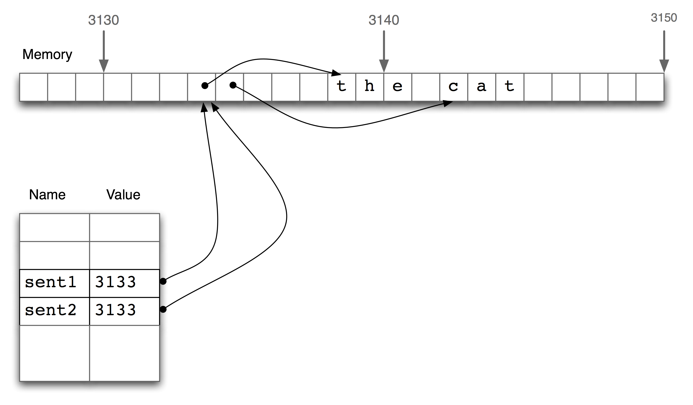
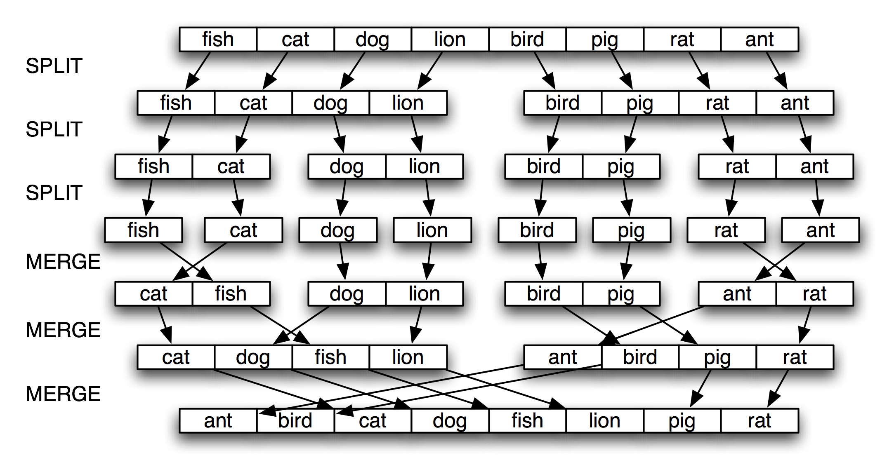

.. -*- mode: rst -*-
.. include:: ../definitions.rst
.. include:: regexp-defns.rst

.. standard global imports

    >>> from __future__ import division
    >>> import nltk, re, pprint

.. TODO: introduce diagnostic print statements
.. TODO: docstrings, commenting practice
.. TODO: recipes for flattening a list of lists into a list, and for the reverse grouping a list into a list of lists
.. TODO: generating all combinations, e.g. map list of words to list of lists of stress patterns; concatenate to make phrase-level stress patterns in all possible ways
.. TODO: finding all pairs of nouns that occur in the same sentence more than n times in a text
.. TODO: boolean values?
.. TODO: introduce `obj` notation to get string from object; useful for concatenating strings and ints
.. TODO: for sentence in tagged_corpus: tokens, tags = zip(*sentence)
.. TODO: discuss duck typing
.. TODO: check ch06-extras for further content
.. TODO: shared values between multiple dictionaries
.. TODO: illustrate graph data structure using a network of adjectives
         with links to indicate same vs different semantic orientation
         cf Hatzivassiloglou and McKeown EACL 1997
         http://www.aclweb.org/anthology/P97-1023
.. TODO: general technique for computing transitive closures, e.g.
         adjectives connected by synonymy to a particular word, cf.
         http://www.aclweb.org/anthology/W04-3253
.. TODO: explain function vs method
.. TODO: say more about performance tuning of a Python program
.. TODO: add exercises on string formatting
.. TODO: this chapter presumes knowledge of dictionaries, not defined until ch05
.. TODO: the "b" flag for read(), when to use "rb"; also the "rU" flag

.. _chap-structured-programming:

==============================
4. Writing Structured Programs
==============================

By now you will have a sense of the capabilities of the Python programming language
for processing natural language.  However, if you're new to Python or to programming, you may
still be wrestling with Python and not feel like you are in full control yet.  In this chapter we'll
address the following questions:

1. How can we write well-structured, readable programs that you and others will be able to re-use easily?

2. How do the fundamental building blocks work, such as loops, functions and assignment?

3. What are some of the pitfalls with Python programming and how can we avoid them?

Along the way, you will consolidate your knowledge of fundamental programming
constructs, learn more about using features of the Python language in a natural
and concise way, and learn some useful techniques in visualizing natural language data.
As before, this chapter contains many examples and
exercises (and as before, some exercises introduce new material).
Readers new to programming should work through them carefully
and consult other introductions to programming if necessary;
experienced programmers can quickly skim this chapter.

In the other chapters of this book, we have organized the programming
content as dictated by the needs of |NLP|.  Here we revert to a more
conventional approach where the sequence of concepts is based on
the structure of the programming language.  There's not room for
a complete presentation of the language, so we will focus on likely
pitfalls, and on idioms that are suitable for |NLP|.

.. _sec-back-to-the-basics:

------------------
Back to the Basics
------------------

Assignment
----------

Assignment would seem to be the most elementary programming concept, and not
worth a separate discussion.  However, there are some surprising subtleties and
pitfalls here.  Consider the following code fragment:  

    >>> foo = 'Monty'
    >>> bar = foo              # [_assignment1]
    >>> foo = 'Python'         # [_assignment2]
    >>> bar
    'Monty'

This behaves exactly as expected.  When we write ``bar = foo`` on line assignment1_,
the value of ``foo`` (the string ``'Monty'``) is assigned to ``bar``.
That is, ``bar`` is a `copy`:dt: of ``foo``, so when we overwrite
``foo`` with a new string ``'Python'`` on line assignment2_, the value
of ``bar`` is not affected.

However, assignment statements do not always involve making copies in this way.
Assignment always copies the value of an expression, but a value is not
always what you might expect it to be.  In particular,
the "value" of a structured object such as a list is actually just a
`reference`:em: to the object.  In the following example,
assignment3_ assigns the reference of ``foo`` to the new variable ``bar``.
Now when we modify something inside ``foo`` on line assignment4_, we can see
that the contents of ``bar`` have also been changed.

    >>> foo = ['Monty', 'Python']
    >>> bar = foo              # [_assignment3]
    >>> foo[1] = 'Bodkin'      # [_assignment4]
    >>> bar
    ['Monty', 'Bodkin']

.. _fig-array-memory:

   List Assignment and Computer Memory

The line ``bar = foo`` does not copy the contents of the
variable, only its "object reference".
To understand what is going on here, we need to
know how lists are stored in the computer's memory.
In Figure fig-array-memory_, we see that a list ``foo`` is
a reference to an object stored at location 3133 (which is
itself a series of pointers to other locations holding strings).
When we assign ``bar = foo``, it is just the object reference
3133 that gets copied.
This behavior extends to other aspects of the language, such as
parameter passing (Section sec-functions_).

Let's experiment some more, by creating a variable ``empty`` holding the
empty list, then using it three times on the next line.

    >>> empty = []
    >>> nested = [empty, empty, empty]
    >>> nested
    [[], [], []]
    >>> nested[1].append('Python')
    >>> nested
    [['Python'], ['Python'], ['Python']]

Observe that changing one of the items inside our nested list of lists changed them all.
This is because each of the three elements is actually just a reference to one and the
same list in memory.

.. note:: |TRY|
   Use multiplication to create a list of lists: ``nested = [[]] * 3``.
   Now modify one of the elements of the list, and observe that all the
   elements are changed.  Use Python's ``id()`` function to find out
   the numerical identifier for any object, and verify that
   ``id(nested[0])``, ``id(nested[1])``, and ``id(nested[2])`` are
   all the same.

Now, notice that when we assign a new value to one of the elements of the list,
it does not propagate to the others:

    >>> nested = [[]] * 3
    >>> nested[1].append('Python')
    >>> nested[1] = ['Monty']
    >>> nested
    [['Python'], ['Monty'], ['Python']]

We began with a list containing three references to a single empty list object.  Then we
modified that object by appending ``'Python'`` to it, resulting in a list containing
three references to a single list object ``['Python']``.
Next, we *overwrote* one of those references with a reference to a new object ``['Monty']``.
This last step modified one of the three object references inside the nested list.
However, the ``['Python']`` object wasn't changed, and is still referenced from two places in
our nested list of lists.  It is crucial to appreciate this difference between
modifying an object via an object reference, and overwriting an object reference.

.. note::
   To copy the items from a list ``foo`` to a new list ``bar``, you can write
   ``bar = foo[:]``.  This copies the object references inside the list.
   To copy a structure without copying any object references, use ``copy.deepcopy()``.

Equality
--------

Python provides two ways to check that a pair of items are the same.
The ``is`` operator tests for object identity.  We can use it to
verify our earlier observations about objects.  First we create
a list containing several copies of the same object, and demonstrate
that they are not only identical according to ``==``, but also
that they are one and the same object:

    >>> size = 5
    >>> python = ['Python']
    >>> snake_nest = [python] * size
    >>> snake_nest[0] == snake_nest[1] == snake_nest[2] == snake_nest[3] == snake_nest[4]
    True
    >>> snake_nest[0] is snake_nest[1] is snake_nest[2] is snake_nest[3] is snake_nest[4]
    True

Now let's put a new python in this nest.  We can easily show that the objects are not
all identical:

    >>> import random
    >>> position = random.choice(range(size))
    >>> snake_nest[position] = ['Python']
    >>> snake_nest
    [['Python'], ['Python'], ['Python'], ['Python'], ['Python']]
    >>> snake_nest[0] == snake_nest[1] == snake_nest[2] == snake_nest[3] == snake_nest[4]
    True
    >>> snake_nest[0] is snake_nest[1] is snake_nest[2] is snake_nest[3] is snake_nest[4]
    False

You can do several pairwise tests to discover which position contains the interloper.
An easier solution is to use the ``id()`` function.  Now we can see that the second
item of the list has a distinct identifier.  If you do this you'll see different numbers,
and the exceptional one will probably be in a different position.

    >>> [id(snake) for snake in snake_nest]
    [513528, 533168, 513528, 513528, 513528]

Having two kinds of equality might seem strange.  However, its really just the
type-token distinction, familiar from natural language, here showing up in
a programming language.  
 
Conditionals
------------

In the condition part of an ``if`` statement, a
nonempty string or list is evaluated as true, while an empty string or
list evaluates as false. 

    >>> mixed = ['cat', '', ['dog'], []]
    >>> for element in mixed:
    ...     if element: 
    ...         print element
    ... 
    cat
    ['dog']

That is, we *don't* need to say ``if len(element) > 0:`` in the
condition.

What's the difference between using ``if...elif`` as opposed to using
a couple of ``if`` statements in a row? Well, consider the following
situation:

    >>> animals = ['cat', 'dog']
    >>> if 'cat' in animals:
    ...     print 1
    ... elif 'dog' in animals:
    ...     print 2
    ... 
    1
    >>>

Since the ``if`` clause of the statement is satisfied, Python never
tries to evaluate the ``elif`` clause, so we never get to print out
``2``. By contrast, if we replaced the ``elif`` by an ``if``, then we
would print out both ``1`` and ``2``. So an ``elif`` clause
potentially gives us more information than a bare ``if`` clause; when
it evaluates to true, it tells us not only that the condition is
satisfied, but also that the condition of the main ``if`` clause was
*not* satisfied.

We can check that all or any items meet some condition:

    >>> all(len(w) > 4 for w in sent)
    False
    >>> any(len(w) > 4 for w in sent)
    True

---------
Sequences
---------

So far, we have seen two kinds of sequence object: strings and lists.  Another
kind of sequence is called a `tuple`:dt:.
Tuples are formed with the comma operator, and typically enclosed
using parentheses create-tuple_.  We've actually seen them in the
previous chapters, and sometimes referred to them as "pairs", since
there were always two members.  However, tuples can have any number
of members.  Like lists and strings, tuples can be indexed index-tuple_
and sliced slice-tuple_, and have a length length-tuple_.

.. doctest-ignore::
   >>> t = 'walk', 'fem', 3 # [_create-tuple]
   >>> t
   ('walk', 'fem', 3)
   >>> t[0] # [_index-tuple]
   'walk'
   >>> t[1:] # [_slice-tuple]
   ('fem', 3)
   >>> len(t) # [_length-tuple]

.. caution::
   Tuples are constructed using the comma operator.  Parentheses are a more
   general feature of Python syntax, designed for grouping.
   A tuple containing the single element ``'snark'`` is defined by adding a
   trailing comma, like this: "``'snark',``".  The empty tuple is a special
   case, and is defined using empty parentheses ``()``. 

Let's compare strings, lists and tuples directly, and do the indexing, slice, and length
operation on each type:

    >>> text = 'I turned off the spectroroute'
    >>> words = ['I', 'turned', 'off', 'the', 'spectroroute']
    >>> pair = (6, 'turned')
    >>> text[2], words[3], pair[1]
    ('t', 'the', 'turned')
    >>> text[-3:], words[-3:], pair[-3:]
    ('ute', ['off', 'the', 'spectroroute'], (6, 'turned'))
    >>> len(text), len(words), len(pair)
    (29, 5, 2)

Other objects, including dictionaries and sets, behave like sequences
when they appear in a suitable context:

    >>> fd = {'Monty': 24, 'Python': 80}
    >>> list(fd)
    ['Monty', 'Python']
    >>> for key in fd:
    ...     print fd[key],
    ...
    24 80

Operating on Sequence Types
---------------------------

We can iterate over the items in a sequence ``s`` in a variety of useful ways,
as shown in Table tab-python-sequence_.

.. table:: tab-python-sequence

   ======================================  ===============================================
   Python Expression                       Comment                                        
   ======================================  ===============================================
   ``for item in s``                       iterate over the items of ``s``
   ``for item in sorted(s)``               iterate over the items of ``s`` in order
   ``for item in set(s)``                  iterate over unique elements of ``s``
   ``for item in reversed(s)``             iterate over elements of ``s`` in reverse
   ``for item in set(s).difference(t)``    iterate over elements of ``s`` not in ``t``
   ``for item in random.shuffle(s)``       iterate over elements of ``s`` in random order
   ======================================  ===============================================

   Various ways to iterate over sequences

The sequence functions illustrated in Table tab-python-sequence_ can be combined
in various ways; for example, to get unique elements of ``s`` sorted
in reverse, use ``reversed(sorted(set(s)))``.

We can convert between these sequence types.  For example,
``tuple(s)`` converts any kind of sequence into a tuple, and
``list(s)`` converts any kind of sequence into a list.
We can convert a list of strings to a single string using the
``join()`` function, e.g. ``':'.join(words)``.

Notice in the above code sample that we computed multiple values on a
single line, separated by commas.  These comma-separated expressions
are actually just tuples |mdash| Python allows us to omit the
parentheses around tuples if there is no ambiguity. When we print a
tuple, the parentheses are always displayed. By using tuples in this
way, we are implicitly aggregating items together.

In the next example, we use tuples to re-arrange the
contents of our list.  (We can omit the parentheses
because the comma has higher precedence than assignment.)

    >>> words[2], words[3], words[4] = words[3], words[4], words[2]
    >>> words    
    ['I', 'turned', 'the', 'spectroroute', 'off']

This is an idiomatic and readable way to move items inside a list.
It is equivalent to the following traditional way of doing such
tasks that does not use tuples (notice that this method needs a
temporary variable ``tmp``).

    >>> tmp = words[2]
    >>> words[2] = words[3]
    >>> words[3] = words[4]
    >>> words[4] = tmp

As we have seen, Python has sequence functions such as ``sorted()`` and ``reversed()``
that rearrange the items of a sequence.  There are also functions that
modify the `structure`:em: of a sequence and which can be handy for
language processing.  Thus, ``zip()`` takes
the items of two or more sequences and "zips" them together into a single list of pairs.
Given a sequence ``s``, ``enumerate(s)`` returns pairs consisting of
an index and the item at that index.

    >>> words = ['I', 'turned', 'off', 'the', 'spectroroute']
    >>> tags = ['NNP', 'VBD', 'IN', 'DT', 'NN']
    >>> zip(words, tags)
    [('I', 'NNP'), ('turned', 'VBD'), ('off', 'IN'),
    ('the', 'DT'), ('spectroroute', 'NN')]
    >>> list(enumerate(words))
    [(0, 'I'), (1, 'turned'), (2, 'off'), (3, 'the'), (4, 'spectroroute')]

For some |NLP| tasks it is necessary to cut up a sequence into two or more parts.
For instance, we might want to "train" a system on 90% of the data and test it
on the remaining 10%.  To do this we decide the location where we want to
cut the data cut-location_, then cut the sequence at that location cut-sequence_.  

    >>> text = nltk.corpus.nps_chat.words()
    >>> cut = int(0.9 * len(text)) # [_cut-location]
    >>> training_data, test_data = text[:cut], text[cut:] # [_cut-sequence]
    >>> text == training_data + test_data # [_cut-preserve]
    True
    >>> len(training_data) / len(test_data) # [_cut-ratio]
    9

We can verify that none of the original data is lost during this process, nor is it duplicated
cut-preserve_.  We can also verify that the ratio of the sizes of the two pieces is what
we intended cut-ratio_.

Combining Different Sequence Types
----------------------------------

Let's combine our knowledge of these three sequence types, together with list
comprehensions, to perform the task of sorting the words in a string by
their length.

    >>> words = 'I turned off the spectroroute'.split()
    >>> wordlens = [(len(word), word) for word in words]
    >>> wordlens.sort()
    >>> ' '.join(w for (_, w) in wordlens)
    'I off the turned spectroroute'

Each of the above lines of code contains a significant feature.
The first line demonstrates that a simple string is actually
an object with methods defined on it such as ``split()``.
The second line shows the construction of a list of tuples,
where each tuple consists of a number (the word length) and the
word, e.g. ``(3, 'the')``.  The third line sorts the list in-place.
The last line discards the length
information then joins the words back into a single string.

We began by talking about the commonalities in these sequence types,
but the above code illustrates important differences in their
roles.  First, strings appear at the beginning and the end: this is
typical in the context where our program is reading in some text and
producing output for us to read.  Lists and tuples are used in the
middle, but for different purposes.  A list is typically a sequence of
objects all having the `same type`:em:, of `arbitrary length`:em:.  We often
use lists to hold sequences of words.  In contrast,
a tuple is typically a collection of objects of `different types`:em:, of
`fixed length`:em:.  We often use a tuple to hold a `record`:dt:,
a collection of different `fields`:dt: relating to some entity.
This distinction between the use of lists and tuples takes some
getting used to,
so here is another example:

    >>> lexicon = [
    ...     ('the', 'DT', ['Di:', 'D@']),
    ...     ('off', 'IN', ['Qf', 'O:f'])
    ... ]

Here, a lexicon is represented as a list because it is a
collection of objects of a single type |mdash| lexical entries |mdash|
of no predetermined length.  An individual entry is represented as a
tuple because it is a collection of objects with different
interpretations, such as the orthographic form, the part of speech,
and the pronunciations (represented in the
`SAMPA <http://www.phon.ucl.ac.uk/home/sampa/index.html>`_ computer
readable phonetic alphabet).  Note that these pronunciations are stored
using a list. (Why?)

.. note::
   A good way to decide when to use tuples vs lists is to ask whether
   the interpretation of an item depends on its position.  For example,
   a tagged token combines two strings having different interpretation,
   and we choose to interpret the first item as the token and the
   second item as the tag.  Thus we use tuples like this: ``('grail', 'NN')``;
   a tuple of the form ``('NN', 'grail')`` would be nonsensical since
   it would be a word ``NN`` tagged ``grail``.
   In contrast, the elements of a text are all tokens, and position is
   not significant.  Thus we use lists like this: ``['venetian', 'blind']``;
   a list of the form ``['blind', 'venetian']`` would be equally valid.
   The linguistic meaning of the words might be different, but the
   interpretation of list items as tokens is unchanged. 

The distinction between lists and tuples has been described in terms of
usage.  However, there is a more fundamental difference: in Python,
lists are `mutable`:dt:, while tuples are `immutable`:dt:.  In other
words, lists can be modified, while tuples cannot.  Here are some of
the operations on lists that do in-place modification of the list.

    >>> lexicon.sort()
    >>> lexicon[1] = ('turned', 'VBD', ['t3:nd', 't3`nd'])
    >>> del lexicon[0]

.. note:: |TRY|
   Convert lexicon to a tuple, using ``lexicon = tuple(lexicon)``,
   then try each of the above operations, to confirm that none of
   them is permitted on tuples.

Generator Expressions
---------------------

[Recap list comprehensions, discuss generator expressions]

.. _sec-formatting:

---------------------------------
Formatting: From Lists to Strings
---------------------------------

Often we write a program to report a single data item, such as a particular element
in a corpus that meets some complicated criterion, or a single summary statistic
such as a word-count or the performance of a tagger.  More often, we write a program
to produce a structured result, such as a tabulation of numbers or linguistic forms,
or a reformatting of the original data.  When the results to be presented are linguistic,
textual output is usually the most natural choice.  However, when the results are numerical,
it may be preferable to produce graphical output.  In this section you will learn about
a variety of ways to present program output.

Converting Between Strings and Lists (notes)
--------------------------------------------

We specify the string to be used as the "glue", followed by a
period, followed by the ``join()`` function.

    >>> silly = ['We', 'called', 'him', 'Tortoise', 'because', 'he', 'taught', 'us', '.']
    >>> ' '.join(silly)
    'We called him Tortoise because he taught us .'
    >>> ';'.join(silly)
    'We;called;him;Tortoise;because;he;taught;us;.'
    >>> ''.join(silly)
    'WecalledhimTortoisebecausehetaughtus.'

So ``' '.join(silly)`` means: take all the items in ``silly`` and
concatenate them as one big string, using ``' '`` as a spacer between
the items.  (Many people find the notation for ``join()`` rather unintuitive.)

Notice that ``join()`` only works on a list of strings (what we have been calling a text).

.. (Thus we could say this type is privileged in Python.)

Formatting Output
-----------------

The output of a program is usually structured to make the information
easily digestible by a reader.  Instead of running some code and then
manually inspecting the contents of a variable, we would like the code
to tabulate some output.
There are many ways we might want to format the output of a program.  For
instance, we might want to place the length value in parentheses `after`:em: the
word, and print all the output on a single line:

    >>> saying = ['After', 'all', 'is', 'said', 'and', 'done', ',',
    ...           'more', 'is', 'said', 'than', 'done', '.']
    >>> for word in saying:
    ...     print word, '(' + str(len(word)) + '),',
    After (5), all (3), is (2), said (4), and (3), done (4), , (1), more (4), is (2), said (4), than (4), done (4), . (1),

However, this approach has some problems.  First, the ``print``
statement intermingles variables and punctuation, making it a little
difficult to read.  Second, the output has spaces around every item
that was printed.  Third, we have to convert the length of the word to
a string so that we can surround it with parentheses.  A cleaner way to produce structured output uses
Python's `string formatting expressions`:dt:. Before diving into
clever formatting tricks, however, let's look at a really simple example. We
are going to use a special symbol, ``%s``, as a placeholder in
strings. Once we have a string containing this placeholder, we follow
it with a single ``%``
and then a value ``v``. Python then returns a new string where
``v`` has been slotted in to replace ``%s``:

    >>> "I want a %s right now" % "coffee"
    'I want a coffee right now'

In fact, we can have a number of placeholders, but following the ``%`` operator
we need to specify a tuple with exactly the same number of values.

    >>> "%s wants a %s %s" % ("Lee", "sandwich", "for lunch")
    'Lee wants a sandwich for lunch'
    >>>

We can also provide the values for the placeholders indirectly. Here's
an example using a ``for`` loop:

    >>> menu = ['sandwich', 'spam fritter', 'pancake']
    >>> for snack in menu:
    ...     "Lee wants a %s right now" % snack
    ... 
    'Lee wants a sandwich right now'
    'Lee wants a spam fritter right now'
    'Lee wants a pancake right now'
    >>>

We oversimplified things when we said that placeholders were
of the form ``%s``; in fact, this is a complex object, called a
`conversion specifier`:dt:. This has to start with the ``%``
character, and ends with conversion character such as ``s`` or ``d``. The ``%s``
specifier tells Python that the corresponding variable is a string (or
should be converted into a string), while the ``%d`` specifier
indicates that the corresponding variable should be converted into a
decimal integer representation. The string containing conversion specifiers is
called a `format string`:dt:.

Picking up on the ``print`` example that we opened this section with,
here's how we can use two different kinds of conversion specifier:

    >>> for word in saying:
    ...     print "%s (%d)," % (word, len(word)),
    After (5), all (3), is (2), said (4), and (3), done (4), , (1), more (4), is (2), said (4), than (4), done (4), . (1),'

To summarize, string formatting is accomplished with
the syntax: `format`:ph: ``%`` `values`:ph:.  The
`format`:ph: section is a string containing format specifiers
such as ``%s`` and ``%d`` that Python will replace with the supplied
values.  The `values`:ph: section of a formatting string is a parenthesized
list containing exactly as many items as there are format specifiers in the
`format`:ph: section.  In the case that there is just one item, the
parentheses can be left out.

In the above example, we used a trailing comma to suppress the
printing of a newline. Suppose, on the other hand, that we want to
introduce some additional newlines in our output. We can accomplish
this by inserting the "special" character ``\n`` into the ``print`` string:

    >>> for i, word in enumerate(saying[:6]):
    ...    print "Word = %s\nIndex = %s" % (word, i)
    ...
    Word = After
    Index = 0
    Word = all
    Index = 1
    Word = is
    Index = 2
    Word = said
    Index = 3
    Word = and
    Index = 4
    Word = done
    Index = 5

Strings and Formats
-------------------

We have seen that there are two ways to display the contents of an object:

    >>> word = 'cat'
    >>> sentence = """hello
    ... world"""
    >>> print word
    cat
    >>> print sentence
    hello
    world
    >>> word
    'cat'
    >>> sentence
    'hello\nworld'

The ``print`` command yields Python's attempt to produce the most human-readable form of an object.
The second method |mdash| naming the variable at a prompt |mdash| shows us a string
that can be used to recreate this object.  It is important to keep in mind that both of
these are just strings, displayed for the benefit of you, the user.  They do not give
us any clue as to the actual internal representation of the object.

There are many other useful ways to display an object as a string of
characters.  This may be for the benefit of a human reader, or because
we want to `export`:dt: our data to a particular file format for use
in an external program.

Formatted output typically contains a combination of variables and
pre-specified strings, e.g. given a dictionary ``wordcount``
consisting of words and their frequencies we could do:

    >>> wordcount = {'cat':3, 'dog':4, 'snake':1}
    >>> for word in sorted(wordcount):
    ...     print word, '->', wordcount[word], ';',
    cat -> 3 ; dog -> 4 ; snake -> 1 ;

Apart from the problem of unwanted whitespace, print statements
that contain alternating variables and constants can be difficult to read and
maintain.  A better solution is to use formatting strings:

    >>> for word in sorted(wordcount):
    ...    print '%s->%d;' % (word, wordcount[word]),
    cat->3; dog->4; snake->1;

.. TODO: describe textwrap package

Lining Things Up
----------------

So far our formatting strings generated output of arbitrary width
on the page (or screen), such as ``%s`` and ``%d``.  We can specify
a width as well, such as ``%6s``, producing a string that is
padded to width 6.  It is right-justified by default right-justified_,
but we can include a minus sign to make it left-justified left-justified_.
In case we don't know in advance how wide a displayed value should be,
the width value can be replaced with a star in the formatting string,
then specified using a variable width-variable_.

    >>> '%6s' % 'dog' # [_right-justified]
    '   dog'
    >>> '%-6s' % 'dog' # [_left-justified]
    'dog   '
    >>> width = 6
    >>> '%-*s' % (width, 'dog') # [_width-variable]
    'dog   '

Other control characters are used for decimal integers and floating point numbers.
Since the percent character ``%`` has a special interpretation in formatting strings,
we have to precede it with another ``%`` to get it in the output.

    >>> count, total = 3205, 9375 
    >>> "accuracy for %d words: %2.4f%%" % (total, 100 * count / total)
    'accuracy for 9375 words: 34.1867%'

An important use of formatting strings is for tabulating data.
Recall that in Section sec-extracting-text-from-corpora_ we saw
data being tabulated from a conditional frequency distribution.
Let's perform the tabulation ourselves, exercising full control
of headings and column widths.
Note the clear separation between the language processing work,
and the tabulation of results.

.. pylisting:: code-modal-tabulate
   :caption: Frequency of Modals in Different Sections of the Brown Corpus

    def tabulate(cfdist, words, categories):
        print '%-16s' % 'Category',
        for word in words:                                  # column headings
            print '%6s' % word,
        print
        for category in categories:
            print '%-16s' % category,                       # row heading
            for word in words:                              # for each word
                print '%6d' % cfdist[category][word],       # print table cell
            print                                           # end the row

    >>> from nltk.corpus import brown
    >>> cfd = nltk.ConditionalFreqDist(
    ...           (genre, word)
    ...           for genre in brown.categories()
    ...           for word in brown.words(categories=genre))
    >>> genres = ['news', 'religion', 'hobbies', 'science_fiction', 'romance', 'humor']
    >>> modals = ['can', 'could', 'may', 'might', 'must', 'will']
    >>> tabulate(cfd, modals, genres)
    Category            can  could    may  might   must   will
    news                 93     86     66     38     50    389
    religion             82     59     78     12     54     71
    hobbies             268     58    131     22     83    264
    science_fiction      16     49      4     12      8     16
    romance              74    193     11     51     45     43
    humor                16     30      8      8      9     13

Recall from the listing in Example code-stemmer-indexing_ that we used a formatting string
``"%*s"``.  This allows us to specify the width of a field using a variable.

    >>> '%*s' % (15, "Monty Python")
    '   Monty Python'

We could use this to automatically customise the column to be
just wide enough to accommodate all the words, using
``width = max(len(w) for w in words)``.  Remember that the comma at the end
of print statements adds an extra space, and this is sufficient to prevent
the column headings from running into each other.

Writing Results to a File
-------------------------

We have seen how to read text from files (Section sec-accessing-text_).
It is often useful to write output to files as well.  The following
code opens a file ``output.txt`` for writing, and saves the program
output to the file.

    >>> output_file = open('output.txt', 'w')
    >>> words = set(nltk.corpus.genesis.words('english-kjv.txt'))
    >>> for word in sorted(words):
    ...     output_file.write(word + "\n")
    >>> output_file.close()

.. note:: |TRY|
   What is the effect of appending ``\n`` to each string before
   we write it to the file?  If you're using a Windows machine
   you may want to use ``word + "\r\n"`` instead.  
   What happens if we do ``output_file.write(word)``?

When we write non-text data to a file we must convert it to a string first.
We can do this conversion using formatting strings, as we saw above.
We can also do it using Python's backquote notation, which converts any
object into a string.  Let's write the total number of words to our
file, before closing it.

    >>> len(words)
    2789
    >>> str(len(words))
    '2789'
    >>> file.write(str(len(words)) + "\n")
    >>> file.close()

------------------
Questions of Style
------------------

Python Coding Style
-------------------

When writing programs you make many subtle choices about names,
spacing, comments, and so on.  When you look at code written by
other people, needless differences in style make it harder to
to interpret the code.  Therefore, the designers of the Python
language have published a style guide for Python code, available
at ``http://www.python.org/dev/peps/pep-0008/``.
The underlying value presented in the style guide is `consistency`:em:,
for the purpose of maximizing the readability of code.
We briefly review some of its key recommendations here, and refer
readers to the full guide for detailed discussion with examples.

Code layout should use four spaces per indentation level.  You should
avoid tabs for indentation, since these can be misinterpreted by
different text editors and the indentation can be messed up.
Lines should be less than 80 characters long; if necessary you can
break a line inside parentheses, brackets, or braces, because
Python is able to detect that the line continues over to the next line, e.g.:

.. doctest-ignore::
    >>> cv_word_pairs = [(cv, w) for w in rotokas_words
    ...                          for cv in re.findall('[ptksvr][aeiou]', w)]
    >>> cfd = nltk.ConditionalFreqDist(
    ...           (genre, word)
    ...           for genre in brown.categories()
    ...           for word in brown.words(categories=genre))
    >>> ha_words = ['aaahhhh', 'ah', 'ahah', 'ahahah', 'ahh', 'ahhahahaha',
    ...             'ahhh', 'ahhhh', 'ahhhhhh', 'ahhhhhhhhhhhhhh', 'ha',
    ...             'haaa', 'hah', 'haha', 'hahaaa', 'hahah', 'hahaha']

If you need to break a line outside parentheses, brackets, or braces,
you can often add extra parentheses, and you can always add a backslash at
the end of the line that is broken:

.. doctest-ignore::
    >>> if (len(syllables) > 4 and len(syllables[2]) == 3 and
    ...    syllables[2][2] in [aeiou] and syllables[2][3] == syllables[1][3]):
    ...     process(syllables)
    >>> if len(syllables) > 4 and len(syllables[2]) == 3 and \
    ...    syllables[2][2] in [aeiou] and syllables[2][3] == syllables[1][3]:
    ...     process(syllables)

.. note::
   Typing spaces instead of tabs soon becomes a chore.  Many programming
   editors have built-in support for Python, and can automatically indent
   code and highlight any syntax errors (including indentation errors).
   For a list of Python-aware editors, please see
   ``http://wiki.python.org/moin/PythonEditors``.

Procedural vs Declarative Style
-------------------------------

We have just seen how the same task can be performed in different
ways, with implications for efficiency.  Another factor influencing
program development is *programming style*.  Consider the following
program to compute the average length of words in the Brown Corpus:

    >>> tokens = nltk.corpus.brown.words(categories='news')
    >>> count = 0
    >>> total = 0
    >>> for token in tokens:
    ...     count += 1
    ...     total += len(token)
    >>> print total / count
    4.2765382469

In this program we use the variable ``count`` to keep track of the
number of tokens seen, and ``total`` to store the combined length of
all words.  This is a low-level style, not far removed from machine
code, the primitive operations performed by the computer's CPU.
The two variables are just like a CPU's registers, accumulating values
at many intermediate stages, values that are meaningless until the end. 
We say that this program is written in a *procedural* style, dictating
the machine operations step by step.  Now consider the following
program that computes the same thing:

    >>> total = sum(len(t) for t in tokens)
    >>> print total / len(tokens)
    4.2765382469

The first line uses a list comprehension to sum the token lengths,
while the second line computes the average as before.
Each line of code performs a complete, meaningful task, which
can be understood in terms of high-level properties like:
"``total`` is the sum of the lengths of the tokens".
Implementation details are left to the Python interpreter.
Accordingly, we say that this program is written in a *declarative* style.
Let's look at an extreme example:

    >>> word_list = []
    >>> len_word_list = len(word_list)
    >>> i = 0
    >>> while i < len(tokens):
    ...     j = 0
    ...     while j < len_word_list and word_list[j] < tokens[i]:
    ...         j += 1
    ...     if j == 0 or tokens[i] != word_list[j]:
    ...         word_list.insert(j, tokens[i])
    ...         len_word_list += 1
    ...     i += 1

The equivalent declarative version makes use of higher-level built-in functions,
and its purpose is instantly recognizable:

    >>> word_list = sorted(set(tokens))

Another case where a loop counter seems to be necessary is for printing
a counter with each line of output.  Instead, we can use ``enumerate()``, which
processes a sequence ``s`` and produces a tuple of the form ``(i, s[i])`` for each
item in ``s``, starting with ``(0, s[0])``.  Here we enumerate the keys of the
frequency distribution, and capture the integer-string pair in the variables ``rank``
and ``word``.  We print ``rank+1`` so that the counting appears to start from ``1``,
as required when producing a list of ranked items.

    >>> fd = nltk.FreqDist(nltk.corpus.brown.words())
    >>> cumulative = 0.0
    >>> for rank, word in enumerate(fd):
    ...     cumulative += fd[word] * 100 / fd.N()
    ...     print "%3d %6.2f%% %s" % (rank+1, cumulative, word)
    ...     if cumulative > 25:
    ...         break
    ...
      1   5.40% the
      2  10.42% ,
      3  14.67% .
      4  17.78% of
      5  20.19% and
      6  22.40% to
      7  24.29% a
      8  25.97% in

Its sometimes tempting to use loop variables to store a maximum or minimum value
seen so far.  Let's use this method to find the longest word in a text.

    >>> text = nltk.corpus.gutenberg.words('milton-paradise.txt')
    >>> longest = ''
    >>> for word in text:
    ...     if len(word) > len(longest):
    ...         longest = word
    >>> longest
    'unextinguishable'

However, a more transparent solution uses two list comprehensions,
both having forms that should be familiar by now:

    >>> maxlen = max(len(word) for word in text)
    >>> [word for word in text if len(word) == maxlen]
    ['unextinguishable', 'transubstantiate', 'inextinguishable', 'incomprehensible']

Note that our first solution found the first word having the longest length, while the
second solution found *all* of the longest words (which is usually what we would want).
Although there's a theoretical efficiency difference between the two solutions,
the main overhead is reading the data into main memory; once its there, a second pass
through the data is effectively instantaneous.  We also need to balance our concerns about
program efficiency with programmer efficiency.  A fast but cryptic solution
will be harder to understand and maintain.

Some Legitimate Uses for Counters
---------------------------------

There are cases where we still want to use loop variables in a list comprehension.
For example, we need to use a loop variable to extract successive overlapping n-grams
from a list:
    
    >>> sent = ['The', 'dog', 'gave', 'John', 'the', 'newspaper']
    >>> n = 3
    >>> [sent[i:i+n] for i in range(len(sent)-n+1)]
    [['The', 'dog', 'gave'],
     ['dog', 'gave', 'John'],
     ['gave', 'John', 'the'],
     ['John', 'the', 'newspaper']]

It is quite tricky to get the range of the loop variable right.
Since this is a common operation in |NLP|\ , |NLTK|
supports it with functions ``bigrams(text)`` and ``trigrams(text)``, and
a general purpose ``ngrams(text, n)``.

Here's an example of how we can use loop variables in
building multidimensional structures.
For example, to build an array with *m* rows and *n* columns,
where each cell is a set, we could use a nested list comprehension:

    >>> m, n = 3, 7
    >>> array = [[set() for i in range(n)] for j in range(m)]
    >>> array[2][5].add('Alice')
    >>> pprint.pprint(array)
    [[set([]), set([]), set([]), set([]), set([]), set([]), set([])],
     [set([]), set([]), set([]), set([]), set([]), set([]), set([])],
     [set([]), set([]), set([]), set([]), set([]), set(['Alice']), set([])]]

Observe that the loop variables ``i`` and ``j`` are not used
anywhere in the resulting object, they are just needed for a syntactically
correct ``for`` statement.  As another example of this usage, observe
that the expression ``['very' for i in range(3)]`` produces a list
containing three instances of ``'very'``, with no integers in sight.

Note that it would be incorrect to do this work using multiplication,
for reasons that were discussed earlier in this section.

    >>> array = [[set()] * n] * m
    >>> array[2][5].add(7)
    >>> pprint.pprint(array)
    [[set([7]), set([7]), set([7]), set([7]), set([7]), set([7]), set([7])],
     [set([7]), set([7]), set([7]), set([7]), set([7]), set([7]), set([7])],
     [set([7]), set([7]), set([7]), set([7]), set([7]), set([7]), set([7])]]

Iteration is an important programming device.  It is tempting to import idioms
from other languages, when Python offers some elegant and highly readable
alternatives.

.. _sec-functions:

---------------------------------------------------
Functions: The Foundation of Structured Programming
---------------------------------------------------

Once you have been programming for a while, you will find that
the number of completely novel things you have to do in creating a program
decreases significantly.  Half of the work may involve simple tasks that
you have done before.  Thus it is important for your code to be `re-usable`:em:.
One effective way to do this is to abstract commonly used sequences of steps
into a `function`:dt:.

For example, suppose we find that we often want to read text from an HTML file.
This involves several steps: opening the file, reading it in, normalizing
whitespace, and stripping HTML markup.  We can collect these steps into a
function, and give it a name such as ``get_text()``, as shown in Example
code-get-text_.

.. pylisting:: code-get-text
   :caption: Read text from a file

   import re
   def get_text(file):
       """Read text from a file, normalizing whitespace
       and stripping HTML markup."""
       text = open(file).read()
       text = re.sub('\s+', ' ', text)
       text = re.sub(r'<.*?>', ' ', text)
       return text

Now, any time we want to get cleaned-up text from an HTML file, we can just call
``get_text()`` with the name of the file as its only argument.  It will return
a string, and we can assign this to a variable, e.g.:
``contents = get_text("test.html")``.  Each time we want to use this series of
steps we only have to call the function.

Notice that a function definition consists of the keyword ``def`` (short for "define"), followed
by the function name, followed by a sequence of parameters enclosed in parentheses, then
a colon.  The following lines contain an indented block of code, the `function body`:dt:.

Using functions has the benefit of saving space in our program.  More
importantly, our choice of name for the function helps make the program *readable*.
In the case of the above example, whenever our program needs to read cleaned-up
text from a file we don't have to clutter the program with four lines of code, we
simply need to call ``get_text()``.  This naming helps to provide some "semantic
interpretation" |mdash| it helps a reader of our program to see what the program "means".

Notice that the above function definition contains a string.  The first string inside
a function definition is called a `docstring`:dt:.  Not only does it document the
purpose of the function to someone reading the code, it is accessible to a programmer
who has loaded the code from a file::

    >>> help(get_text)
    Help on function get_text:

    get_text(file)
        Read text from a file, normalizing whitespace
        and stripping HTML markup.

We have seen that functions help to make our work reusable and readable.  They
also help make it *reliable*.  When we re-use code that has already been developed
and tested, we can be more confident that it handles a variety of cases correctly.
We also remove the risk that we forget some important step, or introduce a bug.
The program that calls our function also has increased reliability.  The author
of that program is dealing with a shorter program, and its components behave
transparently.

To summarize, as its name suggests, a function captures functionality.
It is a segment of code that can be given a meaningful name and which performs
a well-defined task.  Functions allow us to abstract away from the details,
to see a bigger picture, and to program more effectively.

The rest of this section takes a closer look at functions, exploring the
mechanics and discussing aspects of literate programming.

Function Parameters
-------------------

We pass information to functions using a function's parameters,
the parenthesized list of variables and constants following
the function's name, e.g. ``repeat(monty, 3)``.  Here's a complete example:

    >>> def repeat(msg, num):
    ...     return msg * num
    >>> monty = 'Monty Python'
    >>> repeat(monty, 3)
    'Monty PythonMonty PythonMonty Python'

It is not necessary to have any parameters, as we see in the following example:

    >>> def monty():
    ...     return "Monty Python"
    >>> monty()
    "Monty Python"

When there are a lot of parameters it is easy to get confused about the
correct order.  Instead we can refer to parameters by name, and even assign
them a default value just in case one was not provided by the calling
program.  Now the parameters can be specified in any order, and can be omitted.

    >>> def repeat(msg='<empty>', num=1):
    ...     return msg * num
    >>> repeat(num=3)
    '<empty><empty><empty>'
    >>> repeat(msg='Alice')
    'Alice'
    >>> repeat(num=5, msg='Alice')
    'AliceAliceAliceAliceAlice'

These are called keyword arguments.
If we mix these two kinds of parameters, then we must ensure that the unnamed parameters precede the named ones.
It has to be this way, since unnamed parameters are defined by position.  We can define a function that takes
an arbitrary of unnamed and named parameters, and access them via an in-place list of arguments ``*args`` and
an in-place dictionary of keyword arguments ``**kwargs``.

    >>> def generic(*args, **kwargs):
    ...     print *args
    ...     print **kwargs
    ...
    >>> generic(1, "African swallow", monty="python")
    (1, 'African swallow')
    {'monty': 'python'}

When ``*args`` appears as a function parameter, it actually corresponds to all the unnamed parameters of
the function.  Here's another illustration of this aspect of Python syntax, for the ``zip()`` function which
operates on a variable number of arguments.  We'll use the variable name ``*song`` to demonstrate that
there's nothing special about the name ``*args``.

    >>> song = [['four', 'calling', 'birds'],
    ...         ['three', 'French', 'hens'],
    ...         ['two', 'turtle', 'doves']]
    >>> zip(song[0], song[1], song[2])
    [('four', 'three', 'two'), ('calling', 'French', 'turtle'), ('birds', 'hens', 'doves')]
    >>> zip(*song)
    [('four', 'three', 'two'), ('calling', 'French', 'turtle'), ('birds', 'hens', 'doves')]

It should be clear from the above example that typing ``*song`` is just a convenient
shorthand, and equivalent to typing out ``song[0], song[1], song[2]``.

Parameter Passing
-----------------

Back in Section sec-back-to-the-basics_ you saw that assignment works on values,
but that the value of a structured object is a `reference`:em: to that object.  The same
is true for functions.  Python interprets function parameters as values (this is
known as `call-by-value`:dt:).  In the following code, ``set_up()`` has two parameters,
both of which are modified inside the function.  We begin by assigning an empty string
to ``w`` and an empty dictionary to ``p``.  After calling the function, ``w`` is unchanged,
while ``p`` is changed:

    >>> def set_up(word, properties):
    ...     word = 'cat'
    ...     properties['pos'] = 'noun'
    ...     properties = 5
    ...
    >>> w = ''
    >>> p = {}
    >>> set_up(w, p)
    >>> w
    ''
    >>> p
    {'pos': 'noun'}

Notice that ``w`` was not changed by the function.
When we called ``set_up(w, p)``, the value of ``w`` (an empty string) was assigned to
a new variable ``word``.  Inside the function, the value of ``word`` was modified.
However, that change did not propagate to ``w``.  This parameter passing is
identical to the following sequence of assignments:

    >>> w = ''
    >>> word = w
    >>> word = 'cat'
    >>> w
    ''

Let's look at what happened with the dictionary ``p``.
When we called ``set_up(w, p)``, the value of ``p`` (a reference to an empty
dictionary) was assigned to a new local variable ``properties``,
so now both variables now reference the same memory location.
The function modifies ``properties``, and this change is also
reflected in the value of ``p`` as we saw.  The function also
assigned a new value to properties (the number ``5``); this
did not modify the contents at that memory location, but
created a new local variable.
This behavior is just as if we had done the following sequence of assignments:

    >>> p = {}
    >>> properties = p
    >>> properties['pos'] = 'noun'
    >>> properties = 5
    >>> p
    {'pos': 'noun'}

Thus, to understand Python's call-by-value parameter passing,
it is enough to understand how assignment works.

Scope Rules (notes)
-------------------

* local and global variables
* global variables introduce dependency on context and limits the reusability of a function
* importance of avoiding side-effects

Checking Parameter Types
------------------------

Python does not force us to declare the type of a variable when we write a program,
and this permits us to define functions that are flexible
about the type of their arguments.  For example, a tagger might expect
a sequence of words, but it wouldn't care whether this sequence is expressed
as a list, a tuple, or an iterator (a new sequence type that we'll discuss below).

However, often we want to write programs for later use by others, and want
to program in a defensive style, providing useful warnings when functions
have not been invoked correctly.  Observe that the following ``tag()``
function behaves sensibly for string arguments,
but that it does not complain when it is passed a dictionary.

    >>> def tag(word):
    ...     if word in ['a', 'the', 'all']:
    ...         return 'DT'
    ...     else:
    ...         return 'NN'
    ...
    >>> tag('the')
    'DT'
    >>> tag('dog')
    'NN'
    >>> tag({'lexeme':'turned', 'pos':'VBD', 'pron':['t3:nd', 't3`nd']})
    'NN'

It would be helpful if the author of this function took some extra steps to
ensure that the ``word`` parameter of the ``tag()`` function is a string.
A naive approach would be to check the type of the argument using
``if not type(word) is str``, and if ``word`` is not a string, to simply
return Python's special empty value, ``None``.
However, this approach is dangerous because the calling program
may not detect the error, and the diagnostic return value may be
propagated to other parts of the program with unpredictable consequences.
This approach also fails if the word is a Unicode string, which has
type ``unicode``, not ``str``.
Here's a better solution, that uses an assertion and Python's ``basestring``
type that generalizes over both ``unicode`` and ``str``.

    >>> def tag(word):
    ...     assert isinstance(word, basestring), "argument to tag() must be a string"
    ...     if word in ['a', 'the', 'all']:
    ...         return 'DT'
    ...     else:
    ...         return 'NN'

This produces an error that cannot be ignored, since it halts program execution.
Additionally, the error message is easy to interpret.  Adding assertions to
a program helps you find logical errors, and is a kind of "defensive programming."

.. note::
   For runtime efficiency you can
   tell the interpreter to ignore assertions using its optimize flag
   (``python -O``).

[Further discussion of duck-typing, including exceptions.]

The Return Statement
--------------------

Another aspect of defensive programming concerns the return statement of a function.
In order to be confident that all execution paths through a function lead to a
return statement, it is best to have a single return statement at the end of
the function definition.
This approach has a further benefit: it makes it more likely that the
function will only return a single type.
Thus, the following version of our ``tag()`` function is safer:

    >>> def tag(word):
    ...     result = 'NN'                       # default value, a string
    ...     if word in ['a', 'the', 'all']:     # in certain cases...
    ...         result = 'DT'                   #   overwrite the value
    ...     return result                       # all paths end here

A return statement can be used to pass multiple values back to the calling
program, by packing them into a tuple.
Here we define a function that returns a tuple
consisting of the average word length of a sentence, and the inventory
of letters used in the sentence.  It would have been clearer to write
two separate functions.

    >>> def proc_words(words):
    ...     avg_wordlen = sum(len(word) for word in words)/len(words)
    ...     chars_used = ''.join(sorted(set(''.join(words))))
    ...     return avg_wordlen, chars_used
    >>> proc_words(['Not', 'a', 'good', 'way', 'to', 'write', 'functions'])
    (3, 'Nacdefginorstuwy')

.. EK: wouldn't it be better to use an example which isn't then open to criticism?

Functions do not need to have a return statement at all.
Some functions do their work as a side effect, printing a result,
modifying a file, or updating the contents of a parameter to the function.
Consider the following three sort functions; the last approach is dangerous
because a programmer could use it without realizing that it had modified
its input.

    >>> def my_sort1(l):      # good: modifies its argument, no return value
    ...     l.sort()
    >>> def my_sort2(l):      # good: doesn't touch its argument, returns value
    ...     return sorted(l)
    >>> def my_sort3(l):      # bad: modifies its argument and also returns it
    ...     l.sort()
    ...     return l

Functional Decomposition
------------------------

Well-structured programs usually make extensive use of functions.
When a block of program code grows longer than 10-20 lines, it is a
great help to readability if the code is broken up into one or more
functions, each one having a clear purpose.  This is analogous to
the way a good essay is divided into paragraphs, each expressing one main idea.

Functions provide an important kind of *abstraction*.
They allow us to group multiple actions into a single, complex action,
and associate a name with it.
(Compare this with the way we combine the actions of
`go`:lx: and `bring back`:lx: into a single more complex action `fetch`:lx:.)
When we use functions, the main program can be written at a higher level
of abstraction, making its structure transparent, e.g.

.. doctest-ignore::
    >>> data = load_corpus()
    >>> results = analyze(data)
    >>> present(results)

Appropriate use of functions makes programs more readable and maintainable.
Additionally, it becomes possible to reimplement a function
|mdash| replacing the function's body with more efficient code |mdash|
without having to be concerned with the rest of the program.

Consider the ``freq_words`` function in Example freq-words1_.
It updates the contents of a frequency distribution that is
passed in as a parameter, and it also prints a list of the
`n`:math: most frequent words.

.. pylisting:: freq-words1
   :caption: Poorly Designed Function to Compute Frequent Words

   def freq_words(url, freqdist, n):
       text = nltk.clean_url(url)
       for word in nltk.word_tokenize(text):
           freqdist.inc(word.lower())
       print freqdist.keys()[:n]

   >>> constitution = "http://www.archives.gov/national-archives-experience/charters/constitution_transcript.html"
   >>> fd = nltk.FreqDist()
   >>> freq_words(constitution, fd, 20)
   ['the', 'of', 'charters', 'bill', 'constitution', 'rights', ',',
   'declaration', 'impact', 'freedom', '-', 'making', 'independence']

This function has a number of problems.
The function has two side-effects: it modifies the contents of its second
parameter, and it prints a selection of the results it has computed.
The function would be easier to understand and to reuse elsewhere if we
initialize the ``FreqDist()`` object inside the function (in the same place
it is populated), and if we moved the selection and display of results to the
calling program.  In Example freq-words2_ we `refactor`:dt: this function,
and simplify its interface by providing a single ``url`` parameter.

.. pylisting:: freq-words2
   :caption: Well-Designed Function to Compute Frequent Words

   def freq_words(url):
       freqdist = nltk.FreqDist()
       text = nltk.clean_url(url)
       for word in nltk.word_tokenize(text):
           freqdist.inc(word.lower())
       return freqdist

   >>> fd = freq_words(constitution)
   >>> print fd.keys()[:20]
   ['the', 'of', 'charters', 'bill', 'constitution', 'rights', ',',
   'declaration', 'impact', 'freedom', '-', 'making', 'independence']

Note that we have now simplified the work of ``freq_words``
to the point that we can do its work with three lines of code:

    >>> words = nltk.word_tokenize(nltk.clean_url(constitution))
    >>> fd = nltk.FreqDist(word.lower() for word in words)
    >>> fd.keys()[:20]
    ['the', 'of', 'charters', 'bill', 'constitution', 'rights', ',',
    'declaration', 'impact', 'freedom', '-', 'making', 'independence']

Documenting Functions
---------------------

If we have done a good job at decomposing our program into functions, then it should
be easy to describe the purpose of each function in plain language, and provide
this in the docstring at the top of the function definition.  This statement
should not explain how the functionality is implemented; in fact it should be possible
to re-implement the function using a different method without changing this
statement.

NLTK's docstrings are (mostly) written using the "epytext" markup
language.  Using an explicit markup language allows us to generate
prettier online documentation, e.g. see:

   http://nltk.org/doc/api/nltk.tree.Tree-class.html

[Examples of function-level docstrings with epytext markup.]

[The importance of documenting the types of arguments expected by the function.]

.. _sec-doing-more-with-functions:

-------------------------
Doing More with Functions
-------------------------

Functions as Parameters
-----------------------

So far the parameters we have passed into functions have been simple objects like
strings, or structured objects like lists.  Python also lets us pass a function as
an argument to another function.  Now we can abstract out the operation, and apply
a `different operation`:em: on the `same data`:em:.  As the following examples show,
we can pass the built-in function ``len()`` or a user-defined function ``last_letter()``
as parameters to another function:

    >>> sent = ['Take', 'care', 'of', 'the', 'sense', ',', 'and', 'the',
    ...         'sounds', 'will', 'take', 'care', 'of', 'themselves', '.']
    >>> def extract_property(prop):
    ...     return [prop(word) for word in sent]
    ...
    >>> extract_property(len)
    [4, 4, 2, 3, 5, 1, 3, 3, 6, 4, 4, 4, 2, 10, 1]
    >>> def last_letter(word):
    ...     return word[-1]
    >>> extract_property(last_letter)
    ['e', 'e', 'f', 'e', 'e', ',', 'd', 'e', 's', 'l', 'e', 'e', 'f', 's', '.']    

Observe that ``len`` and ``last_letter`` are objects that can be
passed around like lists and dictionaries.  Notice that parentheses
are only used after a function name if we are invoking the function;
when we are simply treating the function as an object these are not used.

Python provides us with one more way to define functions as arguments
to other functions, so-called `lambda expressions`:dt:.  Supposing there
was no need to use the above ``last_letter()`` function in multiple places,
and thus no need to give it a name.  We can equivalently write the following:

    >>> extract_property(lambda w: w[-1])
    ['e', 'e', 'f', 'e', 'e', ',', 'd', 'e', 's', 'l', 'e', 'e', 'f', 's', '.']

Our next example illustrates passing a function to the ``sorted()`` function.
When we call the latter with a single argument (the list to be sorted),
it uses the built-in lexicographic comparison function ``cmp()``.
However, we can supply our own sort function, e.g. to sort by decreasing
length.

    >>> sorted(sent)
    [',', '.', 'Take', 'and', 'care', 'care', 'of', 'of', 'sense', 'sounds',
    'take', 'the', 'the', 'themselves', 'will']
    >>> sorted(sent, cmp)
    [',', '.', 'Take', 'and', 'care', 'care', 'of', 'of', 'sense', 'sounds',
    'take', 'the', 'the', 'themselves', 'will']
    >>> sorted(sent, lambda x, y: cmp(len(y), len(x)))
    ['themselves', 'sounds', 'sense', 'Take', 'care', 'will', 'take', 'care',
    'the', 'and', 'the', 'of', 'of', ',', '.']

Iterators
---------

[itertools, bigrams vs ibigrams, efficiency, ...]

Accumulative Functions
----------------------

These functions start by initializing some storage, and iterate over
input to build it up, before returning some final object (a large structure
or aggregated result).  A standard way to do this is to initialize an
empty list, accumulate the material, then return the list, as shown
in function ``search1()`` in Example search-examples_.

.. pylisting:: search-examples
   :caption: Accumulating Output into a List
   
   def search1(substring, words):
       result = []
       for word in words:
           if substring in word:
               result.append(word)
       return result

   def search2(substring, words):
       for word in words:
           if substring in word:
               yield word

   print "search1:"
   for item in search1('zz', nltk.corpus.brown.words()):
       print item
   print "search2:"
   for item in search2('zz', nltk.corpus.brown.words()):
       print item
   
The function ``search2()`` is a generator.
The first time this function is called, it gets as far as the ``yield``
statement and stops.  The calling program gets the first word and does
any necessary processing.  Once the calling program is ready for another
word, execution of the function is continued from where it stopped, until
the next time it encounters a ``yield`` statement.  This approach is
typically more efficient, as the function only generates the data as it is
required by the calling program, and does not need to allocate additional
memory to store the output.

Here's a more sophisticated example of a generator, which produces
all permutations of a list of words.  (We could use this method for testing
a grammar, cf Chapter chap-parse_).

    >>> def perms(seq):
    ...     if len(seq) <= 1:
    ...         yield seq
    ...     else:
    ...         for perm in perms(seq[1:]):
    ...             for i in range(len(perm)+1):
    ...                 yield perm[:i] + seq[0:1] + perm[i:]
    ...
    >>> list(perms(['police', 'fish', 'buffalo']))
    [['police', 'fish', 'buffalo'], ['fish', 'police', 'buffalo'],
     ['fish', 'buffalo', 'police'], ['police', 'buffalo', 'fish'],
     ['buffalo', 'police', 'fish'], ['buffalo', 'fish', 'police']]

Higher-Order Functions
----------------------

Python provides some higher-order functions that are standard
features of functional programming languages such as Haskell.
We illustrate them here, alongside the equivalent expression
using list comprehensions.

Let's start by defining a function ``is_content_word()``
which checks whether a word is from the open class of content words.
We use this function as the first parameter of ``filter()``,
which applies the function to each item in the sequence contained
in its second parameter, and only retains the items for which
the function returns ``True``.

    >>> def is_content_word(word):
    ...     return word.lower() not in ['a', 'of', 'the', 'and', 'will', ',', '.']
    >>> filter(is_content_word, sent)
    ['Take', 'care', 'sense', 'sounds', 'take', 'care', 'themselves']
    >>> [w for w in sent if is_content_word(w)]
    ['Take', 'care', 'sense', 'sounds', 'take', 'care', 'themselves']
    
Another higher-order function is ``map()``, which applies a function
to every item in a sequence.  It is a general version of the
``extract_property()`` function we saw in sec-doing-more-with-functions_.  
Here is a simple way to find the average length of a sentence in the news
section of the Brown Corpus:

    >>> lengths = map(len, nltk.corpus.brown.sents(categories='news'))
    >>> sum(lengths) / len(lengths)
    21.7508111616
    >>> lengths = [len(w) for w in nltk.corpus.brown.sents(categories='news'))]
    >>> sum(lengths) / len(lengths)
    21.7508111616

In the above examples we specified a user-defined function ``is_content_word()``
and a built-in function ``len()``.  We can also provide a lambda expression.
Here's an example which counts the number of vowels in each word.

    >>> map(lambda w: len(filter(lambda c: c.lower() in "aeiou", w)), sent)
    [2, 2, 1, 1, 2, 0, 1, 1, 2, 1, 2, 2, 1, 3, 0]
    >>> [len([c for c in w if c.lower() in "aeiou"]) for w in sent]
    [2, 2, 1, 1, 2, 0, 1, 1, 2, 1, 2, 2, 1, 3, 0]
    
The solutions based on list comprehensions are usually more readable than the
solutions based on higher-order functions, and we have favored the former
approach throughout this book.

Named Arguments
---------------

One of the difficulties in re-using functions is remembering the order of arguments.
Consider the following function, that finds the ``n`` most frequent words that are
at least ``min_len`` characters long:

    >>> def freq_words(file, min, num):
    ...     text = open(file).read()
    ...     tokens = nltk.word_tokenize(text)
    ...     freqdist = nltk.FreqDist(t for t in tokens if len(t) >= min)
    ...     return freqdist.keys()[:num]
    >>> freq_words('ch01.rst', 4, 10)
    ['words', 'that', 'text', 'word', 'Python', 'with', 'this', 'have', 'language', 'from']

This function has three arguments.  It follows the convention of listing the most
basic and substantial argument first (the file).  However, it might be hard to remember
the order of the second and third arguments on subsequent use.  We can make this function
more readable by using `keyword arguments`:dt:.  These appear in the function's argument
list with an equals sign and a default value:

    >>> def freq_words(file, min=1, num=10):
    ...     text = open(file).read()
    ...     tokens = nltk.word_tokenize(text)
    ...     freqdist = nltk.FreqDist(t for t in tokens if len(t) >= min)
    ...     return freqdist.keys()[:num]

Now there are several equivalent ways to call this function:
``freq_words('ch01.rst', 4, 10)``, 
``freq_words('ch01.rst', min=4, num=10)``,
``freq_words('ch01.rst', num=10, min=4)``.

When we use an integrated development environment such as IDLE,
simply typing the name of a function at the command prompt will
list the arguments.  Using named arguments helps someone to re-use the code...

A side-effect of having named arguments is that they permit optionality.  Thus we
can leave out any arguments where we are happy with the default value:
``freq_words('ch01.rst', min=4)``, ``freq_words('ch01.rst', 4)``.

Another common use of optional arguments is to permit a flag, e.g.:

    >>> def freq_words(file, min=1, num=10, trace=False):
    ...     freqdist = FreqDist()
    ...     if trace: print "Opening", file
    ...     text = open(file).read()
    ...     if trace: print "Read in %d characters" % len(file)
    ...     for word in nltk.word_tokenize(text):
    ...         if len(word) >= min:
    ...             freqdist.inc(word)
    ...             if trace and freqdist.N() % 100 == 0: print "."
    ...     if trace: print
    ...     return freqdist.keys()[:num]

.. caution::
   Take care not to use a mutable object as the default value of
   an argument.  A series of calls to the function will use the
   same object, with bizarre results. 

Exceptions
----------

[not strictly part of a section on functions; but we'll mainly use them for
defensive programming, duck typing, etc, inside functions.]

-------------------
Program Development
-------------------

Programming is a skill that is acquired over several years of
experience with a variety of programming languages and tasks.  Key
high-level abilities are *algorithm design* and its manifestation in
*structured programming*.  Key low-level abilities include familiarity
with the syntactic constructs of the language, and knowledge of a
variety of diagnostic methods for trouble-shooting a program which
does not exhibit the expected behavior.

This section describes the internal structure of a program module, and
how to organize a multi-module program.  Then it describes various
kinds of error that arise during program development, and what you can
do to fix them, and to avoid them in the first place.

Structure of a Python Module
----------------------------

The purpose of a program module is to bring logically-related definitions and functions
together in order to facilitate re-use and abstraction.  Python modules are nothing
more than individual ``.py`` files.  For example, if you were working
with a particular corpus format, the functions to read and write the format could be
kept together.  Constants used by both formats, such as field separators,
or a ``EXTN = ".inf"`` filename extension, could be shared.  If the format was updated,
you would know that only one file needed to be changed.  Similarly, a module could
contain code for creating and manipulating a particular data structure such as
syntax trees, or code for performing a particular processing task such as
plotting corpus statistics.

When getting started with writing Python modules, it helps to have some
examples to emulate.  You can locate the code for any |NLTK| module on your
system using the ``__file__`` variable, e.g.:

.. doctest-ignore::
    >>> nltk.metrics.distance.__file__
    '/usr/lib/python2.5/site-packages/nltk/metrics/distance.pyc'

You'll probably get a different location on your machine.
This is the location of the compiled ``.pyc`` file, and
you'll need to open the corresponding ``.py`` source file.
Alternatively, you can view the latest version of this module on the web
at ``http://code.google.com/p/nltk/source/browse/trunk/nltk/nltk/metrics/distance.py``.

Like every other |NLTK| module, this begins with a group of comment
lines giving a one-line title of the module and identifying the authors.
(Since the code is distributed, it also includes the URL where the
code is available, a copyright statement, and license information.)

Next is the module-level docstring, a triple-quoted multiline string
containing information about the module that will be printed when
someone types ``help(nltk.metrics.distance)``.
Next comes all the import statements required for the module,
then any global variables,
followed by a series of function definitions that make up most
of the module.  Other modules define "classes," the main building block
of object-oriented programming, which falls outside the scope of this book.
(Most |NLTK| modules also include a ``demo()`` function which can be used
to see examples of the module in use.) 

.. note::
   Some module variables and functions are only used within the module.
   These should have names beginning with an underscore, e.g. ``_helper()``,
   since this will hide the name.  If another module imports this one,
   using the idiom: ``from module import *``, these names will not be imported.
   You can optionally list the externally accessible names of a module using
   a special built-in variable like this: ``__all__ = ['edit_distance', 'jaccard_distance']``.

Multi-Module Programs
---------------------

Some programs bring together a diverse range of tasks, such as loading data from
a corpus, performing some analysis tasks on the data, then visualizing it.
We may already have stable modules that take care of loading data and producing visualizations.
Our work might involve coding up the analysis task, and just invoking functions
from the existing modules.  This scenario is depicted in fig-multi-module_.

.. _fig-multi-module:
.. figure:: ../images/multi-module.png
   :scale: 50:50:50

   Structure of a Multi-Module Program: The main program ``my_program.py`` imports functions
   from two other modules; unique analysis tasks are localized to the main program, while
   common loading and visualization tasks are kept apart to facilitate re-use and abstraction.

By dividing our work into several modules and using ``import`` statements to
access functions defined elsewhere, we can keep the individual modules simple
and easy to maintain.  This approach will also result in a growing collection
of modules, and make it possible for us to build sophisticated systems involving
a hierarchy of modules.  Designing such systems well is a
complex software engineering task, and beyond the scope of this book.  

Sources of Error
----------------

Mastery of programming depends on having a variety of problem-solving skills to
draw upon when the program doesn't work as expected.  Something as trivial as
a mis-placed symbol might cause the program to behave very differently.
We call these "bugs" because they are tiny in comparison to the damage
they can cause.  They creep into our code unnoticed, and its only much later
when we're running the program on some new data that their presence is detected.
Sometimes, fixing one bug only reveals another, and we get the distinct impression
that the bug is on the move.  The only reassurance we have is that bugs are
spontaneous and not the fault of the programmer.
 
Flippancy aside, debugging code is hard because there are so many ways for
it to be faulty.  Our understanding of the input data, the algorithm, or
even the programming language, may be at fault.  Let's look at examples
of each of these.
  
First, the input data may contain some unexpected characters.
For example, WordNet synset names have the form ``tree.n.01``, with three
components separated using periods.  The |NLTK| WordNet module initially
decomposed these names using ``split('.')``.  However, this method broke when
someone tried to look up the word `PhD`:lx:, which has the synset
name ``ph.d..n.01``, containing four periods instead of the expected two.
The solution was to use ``rsplit('.', 2)`` to do at most two splits, using
the rightmost instances of the period, and leaving the ``ph.d.`` string intact.
Although several people had tested
the module before it was released, it was some weeks before someone detected
the problem (see ``http://code.google.com/p/nltk/issues/detail?id=297``).

Second, a supplied function might not behave as expected.
For example, while testing |NLTK|\ 's interface to WordNet, one of the
authors noticed that no synsets had any antonyms defined, even though
the underlying database provided a large quantity of antonym information.
What looked like a bug in the WordNet interface turned out to
be a misunderstanding about WordNet itself: antonyms are defined for
lemmas, not for synsets.  The only bug was the user's misunderstanding
of the interface (see ``http://code.google.com/p/nltk/issues/detail?id=98``).

Third, our understanding of Python's semantics may be at fault.
It is easy to make the wrong assumption about the relative
scope of two operators.
For example, ``"%s.%s.%02d" % "ph.d.", "n", 1`` produces a run-time
error ``TypeError: not enough arguments for format string``.
This is because the percent operator has higher precedence than
the comma operator.  The fix is to add parentheses in order to
force the required scope.  As another example, suppose we are
defining a function to collect all tokens of a text having a
given length.  The function has parameters for the text and
the word length, and an extra parameter that allows the initial
value of the result to be given as a parameter:

    >>> def find_words(text, wordlength, result=[]):
    ...     for word in text:
    ...         if len(word) == wordlength:
    ...             result.append(word)
    ...     return result
    >>> find_words(['the', 'cat', 'sat', 'on', 'the', 'mat'], 3) # [_find-words-1]
    ['the', 'cat', 'sat', 'the', 'mat']
    >>> find_words(['the', 'cat', 'sat', 'on', 'the', 'mat'], 2, ['be']) # [_find-words-2]
    ['be', 'on']
    >>> find_words(['the', 'cat', 'sat', 'on', 'the', 'mat'], 3) # [_find-words-3]
    ['the', 'cat', 'sat', 'the', 'mat', 'the', 'cat', 'sat', 'the', 'mat']

The first time we call ``find_words()`` find-words-1_, we get all three-letter
words as expected.  The second time we specify an initial value for the result,
a list ``['be']``, and as expected, the result has this word along with the
other two-letter word in our text.  Now, the next time we call ``find_words()`` find-words-3_
we use the same parameters as in find-words-1_, but we get a different result!
Each time we call ``find_words()`` with no third parameter, the result will
simply extend the result of the previous call, rather than start with the
empty result list as specified in the function definition.  The program's
behavior is not as expected because we incorrectly assumed that the default
value was created at the time the function was invoked.  However, it is
created just once, at the time the Python interpreter loads the function.
This one list object is used whenever no explicit value is provided to the function.

Debugging Techniques
--------------------

Since most code errors result from the programmer making incorrect assumptions,
the first thing to do when you detect a bug is to `check your assumptions`:em:.
Localize the problem by adding ``print`` statements to the program, showing the
value of important variables, and showing how far the program has progressed.
If the program produced an exception, the interpreter will print a `stack trace`:dt:,
pinpointing the location of program execution at the time of the error.
If the program depends on input data, try to reduce this to the smallest
size while still producing the error.

Once you have localized the problem to a particular function, or to a line
of code, you need to work out what is going wrong.  It is often helpful to
recreate the situation using the interactive command line.  Define some
variables then copy-paste the offending line of code into the session
and see what happens.  Check your understanding of the code by reading
some documentation, and examining other code samples that purport to do
the same thing that you are trying to do.  Try explaining your code to
someone else, in case they can see where things are going wrong.

Python provides a `debugger`:dt: which allows you to monitor the execution
of your program, specify line numbers where execution will stop (i.e. `breakpoints`:dt:),
and step through sections of code and inspect the value of variables.
You can invoke the debugger on your code as follows:

.. doctest-ignore::
    >>> import pdb
    >>> import mymodule
    >>> pdb.run('mymodule.myfunction()')

It will present you with a prompt ``(Pdb)`` where you can type instructions
to the debugger.  Type ``help`` to see the full list of commands.
Typing ``step`` (or just ``s``) will execute the current line and
stop.  If the current line calls a function, it will enter the function
and stop at the first line.  Typing ``next`` (or just ``n``) is similar,
but it stops execution at the next line in the current function.  The
``break`` (or ``b``) command can be used to create or list breakpoints.  Type
``continue`` (or ``c``) to continue execution as far as the next breakpoint.
Type the name of any variable to inspect its value.

We can use the Python debugger to locate the problem in our ``find_words()``
function.  Remember that the problem arose the second time the function was
called.  We'll start by calling the function without using the debugger first-run_,
using the smallest possible input.  The second time, we'll call it with the
debugger second-run_.
 
.. doctest-ignore::
    >>> import pdb
    >>> find_words(['cat'], 3) # [_first-run]
    ['cat']
    >>> pdb.run("find_words(['dog'], 3)") # [_second-run]
    > <string>(1)<module>()
    (Pdb) step
    --Call--
    > <stdin>(1)find_words()
    (Pdb) args
    text = ['dog']
    wordlength = 3
    result = ['cat']

Here we typed just two commands into the debugger: ``step`` took us inside
the function, and ``args`` showed the values of its arguments (or parameters).
We see immediately that ``result`` has an initial value of ``['cat']``, and not
the empty list as expected.  The debugger has helped us to localize the problem,
but it turns out not to be a bug in the code, but a bug in our understanding
of how Python's default parameters work.

Defensive Programming
---------------------

In order to avoid some of the pain of debugging, it helps to adopt
some `defensive programming`:dt: habits.  Instead of writing a 20-line
program then testing it, build the program bottom-up out of
small pieces that are known to work.  Each time you combine these
pieces to make a larger unit, test it carefully to see that it works
as expected.  Consider adding ``assert`` statements to your code,
specifying properties of a variable, e.g. ``assert(isinstance(text, list))``.
If the value of the ``text`` variable later becomes a string when your
code is used in some larger context, this will raise an ``AssertionError``
and you will get immediate notification of the problem.

Once you think you've found the bug, view your solution as a hypothesis.
Try to predict the effect of your bugfix before re-running the program.
If the bug isn't fixed, don't fall into the trap of blindly changing
the code in the hope that it will magically start working again.
Instead, for each change, try to articulate a hypothesis about what
is wrong and why the change will fix the problem.  Then undo the change
if the problem was not resolved.

As you develop your program, extend its functionality, and fix any bugs,
it helps to maintain a suite of test cases.
This is called `regression testing`:dt:, since it is meant to detect
situations where the code "regresses" |mdash| where a change to the
code has an unintended side-effect of breaking something that
used to work.  Python provides a simple regression testing framework
in the form of the ``doctest`` module.  This module searches a file
of code or documentation for blocks of text that look like
an interactive Python session, of the form you have already seen
many times in this book.  It executes the Python commands it finds,
and tests that their output matches the output supplied in the original
file.  Whenever there is a mismatch, it reports the expected and actual
values.  For details please consult the ``doctest`` documentation at
``http://docs.python.org/library/doctest.html``.  Apart from its
value for regression testing, the ``doctest`` module is useful for
ensuring that your software documentation stays in sync with your
code.

Perhaps the most important defensive programming strategy is to
set out your code clearly, choose meaningful variable and function
names, and simplify the code wherever possible by decomposing it into
functions and modules with well-documented interfaces.

.. _sec-algorithm-design:

----------------
Algorithm Design
----------------

A major part of algorithmic problem solving is selecting or adapting
an appropriate algorithm for the problem at hand.  Sometimes there are
several alternatives, and choosing the best one depends on knowledge
about how each alternative performs as the size of the data grows.
Whole books are written on this topic, and we only have space to introduce
some key concepts and elaborate on the approaches that are most prevalent
in natural language processing.

The best known strategy is known as `divide-and-conquer`:dt:.
We attack a problem of size *n* by dividing it into two problems of size *n/2*,
solve these problems, and combine their results into a solution of the original problem.
For example, suppose that we had a pile of cards with a single word written on each card.
We could sort this pile by splitting it in half and giving it to two other people
to sort (they could do the same in turn).  Then, when two sorted piles come back, it
is an easy task to merge them into a single sorted pile.
See Figure fig-mergesort_ for an illustration of this process.

.. _fig-mergesort:

   Sorting by Divide-and-Conquer (Mergesort)

Another example is the process of looking up a word in a dictionary.  We open
the book somewhere around the middle and compare our word with the current
page.  If its earlier in the dictionary we repeat the process on the first
half; if its later we use the second half.  This search method is called
`binary search`:lx: since it splits the problem in half at every step.

In another approach to algorithm design, we attack a problem
by transforming it into an instance of a problem we already know how to solve.
For example, in order to detect duplicate entries in a list, we can `pre-sort`:dt:
the list, then scan through it once to check if any adjacent pairs of elements
are identical.

Recursion
---------

The above examples of sorting and searching have a striking property:
to solve a problem of size `n`:math:, we have to break it in half and
then work on one or more problems of size `n/2`:math:.
A common way to implement such methods uses `recursion`:dt:.
We define a function `f`:math: which simplifies the problem,
and `calls itself`:em: to solve one or more easier instances
of the same problem.  It then combines the results into a solution
for the original problem.

For example, suppose we have a set of `n`:math: words, and want to
calculate how many different ways they can be combined to make a
sequence of words.  If we have only one word (`n=1`:math:), there is
just one way to make it into a sequence.  If we have a set of two
words, there are two ways to put them into a sequence.  For three
words there are six possibilities.  In general, for `n`:math: words,
there are `n`:math: |times| `n-1` |times| |dots| |times| `2`:math: |times| `1`:math:
ways (i.e. the factorial of `n`:math:).  We can code this up as follows:

    >>> def factorial1(n):
    ...     result = 1
    ...     for i in range(n):
    ...         result *= (i+1)
    ...     return result

However, there is also a recursive algorithm for solving this problem,
based on the following observation.  Suppose we have a way to
construct all orderings for `n-1`:math: distinct words.  Then
for each such ordering, there are `n`:math: places where we can
insert a new word: at the start, the end, or any of the `n-2`:math:
boundaries between the words.  Thus we simply multiply the number
of solutions found for `n-1`:math: by the value of `n`:math:.
We also need the `base case`:dt:, to say that if we have a single
word, there's just one ordering.  We can code this up as follows:

    >>> def factorial2(n):
    ...     if n == 1:
    ...         return 1
    ...     else:
    ...         return n * factorial2(n-1)

These two algorithms solve the same problem.  One uses iteration
while the other uses recursion.

We can use recursion to navigate a deeply-nested object, such as the
WordNet hypernym hierarchy.  Let's count the size of the hypernym
hierarchy rooted at a given synset `s`:math:.  We'll do this by finding the
size of each hyponym of `s`:math:, then adding these together
(we will also add ``1`` for the synset itself).  The following
function ``size1()`` does this work; notice that the body of
the function includes a recursive call to ``size1()``:

    >>> def size1(s):
    ...     return 1 + sum(size1(child) for child in s.hyponyms())

We can also design an iterative solution to this problem which processes
the hierarchy in layers.  The first layer is the synset itself first-layer_,
then all the hyponyms of the synset, then all the hyponyms of the
hyponyms.  Each time through the loop it computes the next layer
by finding the hyponyms of everything in the last layer update-layer_.
It also maintains a total of the number of synsets encountered so far update-total_.

    >>> def size2(s):
    ...     layer = [s] # [_first-layer]
    ...     total = 0
    ...     while layer:
    ...         total += len(layer) # [_update-total]
    ...         layer = [h for c in layer for h in c.hyponyms()] # [_update-layer]
    ...     return total

Not only is the iterative solution much longer, it is harder to interpret.
It forces us to think procedurally, and keep track of what is happening with
the ``layer`` and ``total`` variables through time.  Let's satisfy ourselves
that both solutions give the same result:

    >>> from nltk.corpus import wordnet as wn
    >>> dog = wn.synset('dog.n.01')
    >>> size1(dog)
    190
    >>> size2(dog)
    190

As a final example of recursion, let's use it to `construct`:em:
a deeply-nested object.
A `letter trie`:dt: is a data structure that can be used
for indexing a lexicon, one letter at a time.  For example, if ``trie``
contained a letter trie, then the sub-trie ``trie['c']`` would be a smaller
trie which held all words starting with `c`:lx:. 
Example trie_ demonstrates the process of building a trie.
We initialize an empty trie to be a dictionary whose
default value for an entry is an empty dictionary.
Now, to insert the word `chien`:lx: (French for `dog`:lx:),
we split off the `c`:lx: and recursively insert `hien`:lx:
into the sub-trie ``trie['c']``.  The recursion continues
until there are no letters remaining in the word, when we
store the intended value (in this case, the word `dog`:lx:).

.. pylisting:: trie
   :caption: Building a Letter Trie

   def insert(trie, key, value):
       if key:
           first, rest = key[0], key[1:]
           insert(trie[first], rest, value)
       else:
           trie['value'] = value

   >>> trie = defaultdict(dict)
   >>> insert(trie, 'chat', 'cat')
   >>> insert(trie, 'chien', 'dog')
   >>> trie = dict(trie)               # for nicer printing
   >>> trie['c']['h']
   {'a': {'t': {'value': 'cat'}}, 'i': {'e': {'n': {'value': 'dog'}}}}
   >>> trie['c']['h']['a']['t']['value']
   'cat'
   >>> pprint.pprint(trie)
   {'c': {'h': {'a': {'t': {'value': 'cat'}},
                'i': {'e': {'n': {'value': 'dog'}}}}}}

.. caution::
   Despite the simplicity of recursive programming, it comes with a cost.
   Each time a function is called, some state information needs to be
   pushed on a stack, so that once the function has completed, execution
   can continue from where it left off.  For this reason, iterative
   solutions are often faster than recursive solutions.

Space-Time Tradeoffs
--------------------

We can sometimes significantly speed up the execution of a program by building an auxiliary
data structure, such as an index.  Here's an example of a simple text retrieval system for
the Movie Reviews Corpus.  By indexing the document collection it can provide much faster lookup.

.. pylisting:: search-documents
   :caption: A Simple Text Retrieval System

   def raw(file):
       contents = open(file).read()
       contents = re.sub(r'<.*?>', ' ', contents)
       contents = re.sub('\s+', ' ', contents)
       return contents

   def snippet(doc, term): # buggy
       text = ' '*30 + raw(doc) + ' '*30
       pos = text.index(term)
       return text[pos-30:pos+30]

   print "Building Index..."
   files = nltk.corpus.movie_reviews.abspaths()
   idx = nltk.Index((w, f) for f in files for w in raw(f).split())

   while True:
       query = raw_input("query> ")
       if query in idx:
           for doc in idx[query]:
               print snippet(doc, query)
       else:
           print "Not found"

A more subtle example of a space-time tradeoff involves replacing the tokens of a corpus
with integer identifiers.  We create a vocabulary for the corpus, a list in which each
word is stored once, then invert this list so that we can look up any word to find its
identifier.  Each document is preprocessed, so that a list of words becomes a list of integers.
Any language models can now work with integers.  See the listing in Example strings-to-ints_
for an example of how to do this for a tagged corpus.
[further discussion and performance comparison.]

.. pylisting:: strings-to-ints
   :caption: Preprocess tagged corpus data, converting all words and tags to integers

   def preprocess(tagged_corpus):
       words = set()
       tags = set()
       for sent in tagged_corpus:
           for word, tag in sent:
               words.add(word)
               tags.add(tag)
       wm = dict((w,i) for (i,w) in enumerate(words))
       tm = dict((t,i) for (i,t) in enumerate(tags))
       return [[(wm[w], tm[t]) for (w,t) in sent] for sent in tagged_corpus]

Another example of a space-time tradeoff is maintaining a vocabulary list.
If you need to process an input text to check that all words are in an
existing vocabulary, the vocabulary should be stored as a set, not a list.
The elements of a set are automatically indexed, so testing membership
of a large set will be much faster than testing membership of the
corresponding list.

We can test this claim using the ``timeit`` module.
The ``Timer`` class has two parameters, a statement which
is executed multiple times, and setup code that is executed
once at the beginning.  We will simulate a vocabulary of
100,000 items using a list vocab-list_ or set vocab-set_
of integers.  The test statement will generate a random
item which has a 50% chance of being in the vocabulary vocab-statement_.

    >>> from timeit import Timer
    >>> vocab_size = 100000
    >>> setup_list = "import random; vocab = range(%d)" % vocab_size # [_vocab-list]
    >>> setup_set = "import random; vocab = set(range(%d))" % vocab_size # [_vocab-set]
    >>> statement = "random.randint(0, %d) in vocab" % vocab_size * 2 # [_vocab-statement]
    >>> print Timer(statement, setup_list).timeit(1000)
    2.78092288971
    >>> print Timer(statement, setup_set).timeit(1000)
    0.0037260055542

Performing 1000 list membership tests takes a total of 2.8 seconds,
while the equivalent tests on a set take a mere 0.0037 seconds,
or three orders of magnitude faster!

Dynamic Programming
-------------------

Dynamic programming is a general technique for designing algorithms
which is widely used in natural language processing.  The term
'programming' is used in a different sense to what you might expect,
to mean planning or scheduling.  Dynamic programming is used when a
problem contains overlapping sub-problems.  Instead of computing
solutions to these sub-problems repeatedly, we simply store them in a
lookup table.
In the remainder of this section we will introduce dynamic programming,
but in a rather different context to syntactic parsing.

Pingala was an Indian author who lived around the 5th century B.C.,
and wrote a treatise on Sanskrit prosody called the *Chandas Shastra*.
Virahanka extended this work around the 6th century A.D., studying the
number of ways of combining short and long syllables to create a meter
of length *n*.  He found, for example, that there are five ways to
construct a meter of length 4: *V*\ :subscript:`4` = *{LL, SSL, SLS,
LSS, SSSS}*.  Observe that we can split *V*\ :subscript:`4` into two
subsets, those starting with *L* and those starting with
*S*, as shown in ex-v4_.

.. _ex-v4:
.. ex::
   .. parsed-literal::

    *V*\ :subscript:`4` =
      LL, LSS
        i.e. L prefixed to each item of *V*\ :subscript:`2` = {L, SS}
      SSL, SLS, SSSS
        i.e. S prefixed to each item of *V*\ :subscript:`3` = {SL, LS, SSS}

.. pylisting:: virahanka
   :caption: Four Ways to Compute Sanskrit Meter: (i) iterative; (ii) bottom-up dynamic programming;
             (iii) top-down dynamic programming; and (iv) built-in memoization.

   def virahanka1(n):
       if n == 0:
           return [""]
       elif n == 1:
           return ["S"]
       else:
           s = ["S" + prosody for prosody in virahanka1(n-1)]
           l = ["L" + prosody for prosody in virahanka1(n-2)]
           return s + l

   def virahanka2(n):
       lookup = [[""], ["S"]]
       for i in range(n-1):
           s = ["S" + prosody for prosody in lookup[i+1]]
           l = ["L" + prosody for prosody in lookup[i]]
           lookup.append(s + l)
       return lookup[n]

   def virahanka3(n, lookup={0:[""], 1:["S"]}):
       if n not in lookup:
           s = ["S" + prosody for prosody in virahanka3(n-1)]
           l = ["L" + prosody for prosody in virahanka3(n-2)]
           lookup[n] = s + l
       return lookup[n]

   from nltk import memoize
   @memoize
   def virahanka4(n):
       if n == 0:
           return [""]
       elif n == 1:
           return ["S"]
       else:
           s = ["S" + prosody for prosody in virahanka4(n-1)]
           l = ["L" + prosody for prosody in virahanka4(n-2)]
           return s + l

   >>> virahanka1(4)
   ['SSSS', 'SSL', 'SLS', 'LSS', 'LL']  
   >>> virahanka2(4)
   ['SSSS', 'SSL', 'SLS', 'LSS', 'LL']  
   >>> virahanka3(4)
   ['SSSS', 'SSL', 'SLS', 'LSS', 'LL']  
   >>> virahanka4(4)
   ['SSSS', 'SSL', 'SLS', 'LSS', 'LL']  

With this observation, we can write a little recursive function called
``virahanka1()`` to compute these meters, shown in Example virahanka_.
Notice that, in order to compute *V*\ :subscript:`4` we first compute
*V*\ :subscript:`3` and *V*\ :subscript:`2`.  But to compute *V*\ :subscript:`3`,
we need to first compute *V*\ :subscript:`2` and *V*\ :subscript:`1`.  This `call
structure`:dt: is depicted in ex-call-structure_.

.. _ex-call-structure:
.. ex:: 
   .. tree:: (V4 (V3 (V2 V1 V0) V1) (V2 V1 V0))

As you can see, *V*\ :subscript:`2` is computed twice.
This might not seem like a significant problem, but 
it turns out to be rather wasteful as *n* gets large:
to compute *V*\ :subscript:`20` using this recursive technique, we
would compute *V*\ :subscript:`2` 4,181 times;
and for *V*\ :subscript:`40` we would compute *V*\ :subscript:`2` 63,245,986 times!
A much better alternative is to store the value of *V*\ :subscript:`2` in a table
and look it up whenever we need it.  The same goes for other values, such
as *V*\ :subscript:`3` and so on.  Function ``virahanka2()`` implements a
dynamic programming approach to the problem.  It works by filling up a
table (called ``lookup``) with solutions to *all* smaller instances of the
problem, stopping as soon as we reach the value we're interested in.
At this point we read off the value and return it.  Crucially, each
sub-problem is only ever solved once.

Notice that the approach taken in ``virahanka2()`` is to solve smaller
problems on the way to solving larger problems.  Accordingly, this is known as the
`bottom-up`:dt: approach to dynamic programming.  Unfortunately it turns out
to be quite wasteful for some applications, since it
may compute solutions to sub-problems that are never required for
solving the main problem.  This wasted computation can be avoided
using the `top-down`:dt: approach to dynamic programming, which is
illustrated in the function ``virahanka3()`` in Example virahanka_.
Unlike the bottom-up approach, this approach is recursive.  It avoids
the huge wastage of ``virahanka1()`` by checking whether it has
previously stored the result.  If not, it computes the result
recursively and stores it in the table.  The last step is to return
the stored result.  The final method, in ``virahanka4()``,
is to use a Python `decorator`:dt: called ``memoize``,
which takes care of the housekeeping work done
by ``virahanka3()`` without cluttering up the program.
This "memoization" process stores the result of each previous
calls to the function along with the parameters that were used.
If the function is subsequently called with the same parameters,
it returns the stored result instead of recalculating it.

This concludes our brief introduction to dynamic programming.
We will encounter it again in Section sec-parsing_.

.. _sec-libraries:

----------------------------
A Sample of Python Libraries
----------------------------

Matplotlib
----------

Python has some libraries that are useful for visualizing language data.
The Matplotlib package supports sophisticated
plotting functions with a MATLAB-style interface, and is available from
``http://matplotlib.sourceforge.net/``.

So far we have focused on textual presentation and the use of formatted print
statements to get output lined up in columns.  It is often very useful to display
numerical data in graphical form, since this often makes it easier to detect
patterns.  For example, in code-modal-tabulate_ we saw a table of numbers
showing the frequency of particular modal verbs in the Brown Corpus, classified
by genre.  The program in code-modal-plot_ presents the same information in graphical
format.  The output is shown in Figure fig-modal-genre_ (a color figure in the online version).

.. pylisting:: code-modal-plot
   :caption: Frequency of Modals in Different Sections of the Brown Corpus

   colors = 'rgbcmyk' # red, green, blue, cyan, magenta, yellow, black
   def bar_chart(categories, words, counts):
       "Plot a bar chart showing counts for each word by category"
       import pylab
       ind = pylab.arange(len(words))
       width = 1 / (len(categories) + 1)
       bar_groups = []
       for c in range(len(categories)):
           bars = pylab.bar(ind+c*width, counts[categories[c]], width, color=colors[c % len(colors)])
           bar_groups.append(bars)
       pylab.xticks(ind+width, words)
       pylab.legend([b[0] for b in bar_groups], categories, loc='upper left')
       pylab.ylabel('Frequency')
       pylab.title('Frequency of Six Modal Verbs by Genre')
       pylab.show()

   >>> genres = ['news', 'religion', 'hobbies', 'government', 'adventure']
   >>> modals = ['can', 'could', 'may', 'might', 'must', 'will']
   >>> cfdist = nltk.ConditionalFreqDist(
   ...              (genre, word)
   ...              for genre in genres
   ...              for word in nltk.corpus.brown.words(categories=genre)
   ...              if word in modals)
   ...
   >>> counts = {}
   >>> for genre in genres:
   ...     counts[genre] = [cfdist[genre][word] for word in modals]
   >>> bar_chart(genres, modals, counts)

.. _fig-modal-genre:
.. figure:: ../images/modal_genre.png
   :scale: 25

   Bar Chart Showing Frequency of Modals in Different Sections of Brown Corpus: this
   visualization was produced by the program in Example code-modal-plot_.

..
  def count_words_by_tag(t, genres):
      cfdist = nltk.ConditionalFreqDist()
      for genre in genres:
          for (word,tag) in nltk.corpus.brown.tagged_words(categories=genre):
              if tag == t:
                   cfdist[genre].inc(word.lower())
      return cfdist
    

From the bar chart it is immediately obvious that `may`:lx: and `must`:lx: have
almost identical relative frequencies.  The same goes for `could`:lx: and `might`:lx:.

We can generate data visualizations on the fly, based on user input via the web...
To do this we have to specify the ``Agg`` backend for ``matplotlib`` before
importing ``pylab``, as follows:

    >>> import matplotlib
    >>> matplotlib.use('Agg')
    >>> import pylab

Next, we use all the same PyLab methods as before, but instead of displaying the
result on a graphical terminal using ``pylab.show()``, we save it to a file
using ``pylab.savefig()``.  We specify the filename and dpi, then print
HTML markup that directs the web browser to load the file.

.. doctest-ignore::
    >>> pylab.savefig('modals.png')
    >>> print 'Content-Type: text/html'
    >>> print
    >>> print '<html><body>'
    >>> print ''
    >>> print '</body></html>'

The ``networkx`` Package
------------------------

The NetworkX package is for defining and manipulating structures consisting of
nodes and edges, known as `graphs`:dt:.  It is
available from ``https://networkx.lanl.gov/``.
NetworkX can be used in conjunction with Matplotlib to
visualize networks, such as WordNet (the semantic network we
introduced in Section sec-wordnet_).  The program in code-networkx_
initializes an empty graph define-graph_ then traverses
the WordNet hypernym hierarchy adding edges to
the graph add-edge_.
Notice that the traversal is recursive recursive-traversal_,
applying the programming technique discussed in
Section sec-algorithm-design_.

.. pylisting:: code-networkx
   :caption: Using the NetworkX and Matplotlib Libraries

    import networkx as nx
    import matplotlib
    from nltk.corpus import wordnet as wn

    def traverse(graph, start, node):
        graph.depth[node.name] = node.shortest_path_distance(start)
        for child in node.hyponyms():
            graph.add_edge(node.name, child.name) # [_add-edge]
            traverse(graph, start, child) # [_recursive-traversal]

    def hyponym_graph(start):
        G = nx.Graph() # [_define-graph]
        G.depth = {}
        traverse(G, start, start)
        return G

    def graph_draw(graph):
        nx.draw_graphviz(graph,
             node_size = [16 * graph.degree(n) for n in graph],
             node_color = [graph.depth[n] for n in graph],
             with_labels = False)
        matplotlib.pyplot.show()

    >>> dog = wn.synset('dog.n.01')
    >>> graph = hyponym_graph(dog)
    >>> graph_draw(graph)

    
.. _fig-dog-graph:
.. figure:: ../images/dog-graph.png
   :scale: 80:80:80

   Visualization with NetworkX and Matplotlib: Part of the WordNet hypernym
   hierarchy is displayed, starting with ``dog.n.01`` (the darkest node in the middle);
   node size is based on the number of children of the node, and color is based on
   the distance of the node from ``dog.n.01``; this visualization was produced
   by the program in Example networkx_.

csv
---

Language analysis work often involves data tabulations, containing information
about lexical items, or the participants in an empirical study, or the linguistic
features extracted from a corpus.  Here's a fragment of a simple lexicon, in CSV format:  

::
    sleep, sli:p, v.i, a condition of body and mind ...
    walk, wo:k, v.intr, progress by lifting and setting down each foot ...
    wake, weik, intrans, cease to sleep

We can use Python's CSV library to read and write files stored in this format.
For example, we can open a CSV file called ``dict.csv`` open-csv_ 
and iterate over its rows iterate-csv_:

    >>> import csv
    >>> input_file = open("dict.csv", "rb") # [_open-csv]
    >>> for row in csv.reader(input_file): # [_iterate-csv]
    ...     print row
    ['sleep', 'sli:p', 'v.i', 'a condition of body and mind ...']
    ['walk', 'wo:k', 'v.intr', 'progress by lifting and setting down each foot ...']
    ['wake', 'weik', 'intrans', 'cease to sleep']

Each row is just a list of strings.  If any fields contain numerical
data, they will appear as strings, and will have to be converted using
``int()`` or ``float()``.

Database Connectivity (notes)
-----------------------------

[Example storing corpus analysis to a database]

Lucene
------

[Python-Lucene interface]

-------
Summary
-------

* [Summary of string formatting.]

* A module serves as a `namespace`:dt:\ : names defined in a module |mdash| such as variables
  and functions |mdash| are not visible to other modules, unless those names are imported.

---------------
Further Reading
---------------

Consult [URL] for further materials on this chapter.

[Harel2004]_

[Levitin2004]_

[Knuth2006Trees]_

http://docs.python.org/lib/typesseq-strings.html

http://www.jwz.org/doc/worse-is-better.html

http://c2.com/cgi/wiki?DontRepeatYourself

http://effbot.org/zone/python-objects.htm

Pages on Python pitfalls.

Python books.

---------
Exercises
---------

#. |easy| Find out more about sequence objects using Python's help facility.
   In the interpreter, type ``help(str)``, ``help(list)``, and ``help(tuple)``.
   This will give you a full list of the functions supported by each type.
   Some functions have special names flanked with underscore; as the
   help documentation shows, each such function corresponds to something
   more familiar.  For example ``x.__getitem__(y)`` is just a long-winded
   way of saying ``x[y]``.

#. |easy| Identify three operations that can be performed on both tuples
   and lists.  Identify three list operations that cannot be performed on
   tuples.  Name a context where using a list instead of a tuple generates
   a Python error.

#. |easy| Find out how to create a tuple consisting of a single item.
   There are at least two ways to do this.

#. |easy| Create a list ``words = ['is', 'NLP', 'fun', '?']``.  Use
   a series of assignment statements (e.g. ``words[1] = words[2]``)
   and a temporary variable ``tmp`` to transform this list into the
   list ``['NLP', 'is', 'fun', '!']``.  Now do the same transformation
   using tuple assignment.

#. |easy| Does the method for creating a sliding window of n-grams
   behave correctly for the two limiting cases: `n`:math: = 1, and `n`:math: = ``len(sent)``?

#. |easy| Create two dictionaries, ``d1`` and ``d2``, and add some entries to
   each.  Now issue the command ``d1.update(d2)``.  What did this do?
   What might it be useful for?

#. |easy| We pointed out that when empty strings and empty lists occur
   in the condition part of an ``if`` clause, they evaluate to
   false. In this case, they are said to be occuring in a `Boolean
   context`:dt:.
   Experiment with different kind of non-Boolean expressions in Boolean
   contexts, and see whether they evaluate as true or false.

#. |soso| Create a list of words and store it in a variable ``sent1``.
   Now assign ``sent2 = sent1``.  Modify one of the items in ``sent1``
   and verify that ``sent2`` has changed.

   a) Now try the same exercise but instead assign ``sent2 = sent1[:]``.
      Modify ``sent1`` again and see what happens to ``sent2``.  Explain.
   b) Now define ``text1`` to be a list of lists of strings (e.g. to
      represent a text consisting of multiple sentences.  Now assign
      ``text2 = text1[:]``, assign a new value to one of the words,
      e.g. ``text1[1][1] = 'Monty'``.  Check what this did to ``text2``.
      Explain.
   c) Load Python's ``deepcopy()`` function (i.e. ``from copy import deepcopy``),
      consult its documentation, and test that it makes a fresh copy of any
      object.

#. |soso| Write code that starts with a string of words and
   results in a new string consisting of the same words, but where
   the first word swaps places with the second, and so on. For
   example, ``'the cat sat on the mat'`` will be converted into ``'cat
   the on sat mat the'``.

#. |soso| Initialize an *n*\ -by-*m* list of lists of empty strings using list
   multiplication, e.g. ``word_table = [[''] * n] * m``.  What happens
   when you set one of its values, e.g. ``word_table[1][2] = "hello"``?
   Explain why this happens.  Now write an expression using ``range()``
   to construct a list of lists, and show that it does not have this problem.

#. |soso| Write code to initialize a two-dimensional array of sets called
   ``word_vowels`` and process a list of words, adding each
   word to ``word_vowels[l][v]`` where ``l`` is the length of the word and ``v`` is
   the number of vowels it contains.

#. |soso| Write a function ``novel10(text)`` that prints any word that
   appeared in the last 10% of a text that had not been encountered earlier.

#. |soso| Write a program that takes a sentence expressed as a single string,
   splits it and counts up the words.  Get it to print out each word and the
   word's frequency, one per line, in alphabetical order.

#. |soso| Write code that builds a dictionary of dictionaries of sets.

#. |soso| Use ``sorted()`` and ``set()`` to get a sorted list of tags used in the Brown
   corpus, removing duplicates.

#. |soso| Write code to convert text into *hAck3r*, where characters are
   mapped according to the following table:

   +---------+---+---+---+----+---+--------+-----+
   | Input:  | e | i | o | l  | s | .      | ate |
   +---------+---+---+---+----+---+--------+-----+
   | Output: | 3 | 1 | 0 | \| | 5 | 5w33t! | 8   |
   +---------+---+---+---+----+---+--------+-----+

#. |soso| Read up on Gematria, a method for assigning numbers to words, and for
   mapping between words having the same number to discover the hidden meaning of
   texts (``http://en.wikipedia.org/wiki/Gematria``, ``http://essenes.net/gemcal.htm``).

   a) Write a function ``gematria()`` that sums the numerical values of
      the letters of a word, according to the letter values in ``letter_vals``:

      letter_vals = {'a':1, 'b':2, 'c':3, 'd':4, 'e':5, 'f':80, 'g':3, 'h':8,
       'i':10, 'j':10, 'k':20, 'l':30, 'm':40, 'n':50, 'o':70, 'p':80, 'q':100,
       'r':200, 's':300, 't':400, 'u':6, 'v':6, 'w':800, 'x':60, 'y':10, 'z':7}

   b) Process a corpus (e.g. ``nltk.corpus.state_union``) and for each document, count how
      many of its words have the number 666.

   c) Write a function ``decode()`` to process a text, randomly replacing words with
      their Gematria equivalents, in order to discover the "hidden meaning" of the text.

#. |soso| Write a function ``shorten(text, n)`` to process a text, omitting the ``n``
   most frequently occurring words of the text.  How readable is it?

#. |easy| Write code that removes whitespace at the beginning and end of a
   string, and normalizes whitespace between words to be a single
   space character.

   #) do this task using ``split()`` and ``join()``

   #) do this task using regular expression substitutions

#. |easy| What happens when the formatting strings ``%6s`` and ``%-6s``
   are used to display strings that are longer than six characters?

#. |easy| We can use a dictionary to specify the values to be
   substituted into a formatting string.  Read Python's library
   documentation for formatting strings
   (`http://docs.python.org/lib/typesseq-strings.html
   <http://docs.python.org/lib/typesseq-strings.html>`_),
   and use this method to display today's date in two
   different formats.

#. |easy| Write a program to sort words by length.  Define a helper function
   ``cmp_len`` which uses the ``cmp`` comparison function on word
   lengths.

#. |soso| Write code to print out an index for a lexicon, allowing someone
   to look up words according to their meanings (or pronunciations; whatever
   properties are contained in lexical entries).

#. |easy| Review the answers that you gave for the exercises in sec-back-to-the-basics_,
   and rewrite the code as one or more functions.

#. |soso| In this section we saw examples of some special functions such as ``filter()`` and
   ``map()``.  Other functions in this family are ``zip()`` and ``reduce()``.
   Find out what these do, and write some code to try them out.
   What uses might they have in language processing?

#. |soso| Write a function that takes a list of words (containing duplicates) and
   returns a list of words (with no duplicates) sorted by decreasing frequency.
   E.g. if the input list contained 10 instances of the word ``table`` and 9 instances
   of the word ``chair``, then ``table`` would appear before ``chair`` in the output
   list.

#. |soso| Write a function that takes a text and a vocabulary as its arguments
   and returns the set of words that appear in the text but not in the
   vocabulary.  Both arguments can be represented as lists of strings.
   Can you do this in a single line, using ``set.difference()``?

#. |soso| As you saw, ``zip()`` combines two lists into a single list
   of pairs. What happens when the lists are of unequal lengths?
   Define a function ``myzip()`` that does something different with
   unequal lists.

#. |soso| Import the ``itemgetter()`` function from the ``operator`` module in Python's
   standard library (i.e. ``from operator import itemgetter``).  Create a list
   ``words`` containing several words.  Now try calling:
   ``sorted(words, key=itemgetter(1))``, and ``sorted(words, key=itemgetter(-1))``.
   Explain what ``itemgetter()`` is doing.

#. |soso| Write a recursive function ``lookup(trie, key)`` that looks up a key in a trie,
   and returns the value it finds.  Extend the function to return a word when it is uniquely
   determined by its prefix (e.g. ``vanguard`` is the only word that starts with ``vang-``,
   so ``lookup(trie, 'vang')`` should return the same thing as ``lookup(trie, 'vanguard')``).

#. |soso| Read about string edit distance and the Levenshtein Algorithm.
   Try the implementation provided in ``nltk.edit_dist()``.
   How is this using dynamic programming?  Does it use the bottom-up or
   top-down approach?
   [See also ``http://norvig.com/spell-correct.html``]

#. |soso| The Catalan numbers arise in many applications of combinatorial mathematics,
   including the counting of parse trees (Section sec-grammar-development_).  The series
   can be defined as follows: C\ :subscript:`0` = 1, and
   C\ :subscript:`n+1` = |Sigma|\ :subscript:`0..n` (C\ :subscript:`i`\ C\ :subscript:`n-i`).

   a) Write a recursive function to compute `n`:math:\ th Catalan number C\ :subscript:`n`

   b) Now write another function that does this computation using dynamic programming

   c) Use the ``timeit`` module to compare the performance of these functions as `n`:math:
      increases.

#. |hard| 
   Reproduce some of the results of [Zhao07]_ concerning authorship identification.

#. |hard| Study gender-specific lexical choice, and see if you can
   reproduce some of the results of ``http://www.clintoneast.com/articles/words.php``

#. |hard| Write a recursive function that pretty prints a trie in alphabetically
   sorted order, as follows

   chat: 'cat'
   --ien: 'dog'
   -???: ???

#. |hard| Write a recursive function that processes text, locating the uniqueness point in
   each word, and discarding the remainder of each word.  How much compression does this
   give?  How readable is the resulting text?

#. |hard| Develop a simple extractive summarization tool, that prints the
   sentences of a document which contain the highest total word
   frequency.  Use ``FreqDist()`` to count word frequencies, and use
   ``sum`` to sum the frequencies of the words in each sentence.
   Rank the sentences according to their score.  Finally, print the *n*
   highest-scoring sentences in document order.  Carefully review the
   design of your program, especially your approach to this double
   sorting.  Make sure the program is written as clearly as possible.
   
#. |hard|
   Develop your own NGramTagger class that inherits from NLTK's class,
   and which encapsulates the method of collapsing the vocabulary of
   the tagged training and testing data that was described in Chapter
   chap-tag_.  Make sure that the unigram and default backoff taggers
   have access to the full vocabulary.  

#. |hard| **Statistically Improbable Phrases:**
   Design an algorithm to find the statistically improbable
   phrases of a document collection.
   http://www.amazon.com/gp/search-inside/sipshelp.html

#. |hard| Write a program to implement a brute-force algorithm for
   discovering word squares, a kind of `n`:math: |times| `n`:math crossword
   in which the entry in the `n`:math:\ th row is the same as the entry
   in the `n`:math:\ th column.  For discussion, see
   ``http://itre.cis.upenn.edu/~myl/languagelog/archives/002679.html``

.. #. |hard| Extend the program in Example compound-keys_ in the following ways:

   a) Define two sets ``verbs`` and ``preps``, and add each verb and preposition
      as they are encountered.  (Note that you can add an item to a set without
      bothering to check whether it is already present.)

   b) Create nested loops to display the results, iterating over verbs and
      prepositions in sorted order.  Generate one line of output per verb,
      listing prepositions and attachment ratios as follows:
      ``raised: about 0:3, at 1:0, by 9:0, for 3:6, from 5:0, in 5:5...``

   c) We used a tuple to represent a compound key consisting of two strings.
      However, we could have simply concatenated the strings, e.g.
      ``key = verb + ":" + prep``, resulting in a simple string key.
      Why is it better to use tuples for compound keys?

.. include:: footer.rst
