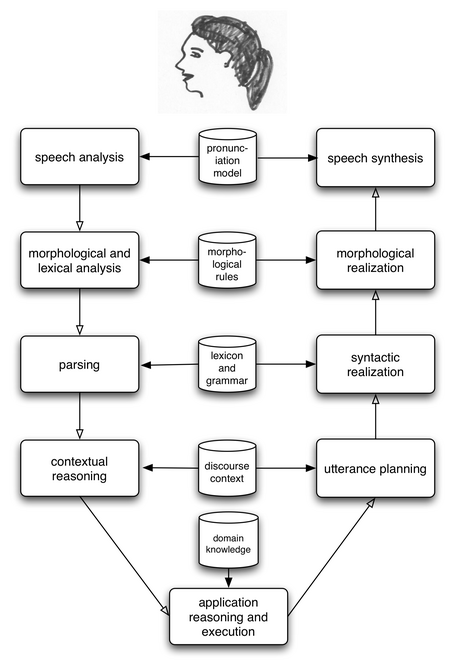

.. -*- mode: rst -*-
.. include:: ../definitions.rst

.. TODO: add exercises for Unicode section?
.. TODO: add bullet points on regular expressions to summary
.. TODO: update cspy reference to more recent book
.. TODO: add some literature references (esp to other intro linguistics textbooks)
.. TODO: adopt simpler hacker example with only single character transpositions;
   move hacker example to later section (later chapter?)
.. TODO: get URL hyperlinks to be fixed width
.. TODO: introduce list.append() in ch01 as its used in ch02

.. _chap-introduction:

=================================
1. Language Processing and Python
=================================

It is easy to get our hands on millions of words of text.
What can we do with it, assuming we can write some simple programs?
In this chapter we'll tackle the following questions:

#. what can we achieve by combining simple programming techniques with large quantities of text?
#. how can we automatically extract key words and phrases that sum up the style and content of a text?
#. is the Python programming language suitable for such work?
#. what are some of the interesting challenges of natural language processing?

This chapter is divided into sections that skip between two quite
different styles.  In the "computing with language" sections we will
take on some linguistically-motivated programming tasks without necessarily
understanding how they work.  In the "closer look at Python" sections we
will systematically review key programming concepts.  We'll flag the two styles in the section titles,
but later chapters will mix both styles without being so up-front about it.
We hope this style of introduction gives you an
authentic taste of what will come later, while covering a range of
elementary concepts in linguistics and computer science.
If you have basic familiarity with both areas you can skip to Section sec-automatic-natural-language-processing_;
we will repeat any important points in later chapters, and if you miss anything
you can easily consult the online reference material at |NLTK-URL|.

.. _sect-computing-with-language-texts-and-words:

----------------------------------------
Computing with Language: Texts and Words
----------------------------------------

We're all very familiar with text, since we read and write it every day.
But here we will treat text as raw data for the programs we write,
programs that manipulate and analyze it in a variety of interesting ways.
Before we can do this, we have to get started with the Python interpreter.

Getting Started
---------------

One of the friendly things about Python is that it allows you
to type directly into the interactive `interpreter`:dt: |mdash|
the program that will be running your Python programs.
You can access the Python interpreter using a simple graphical interface
called the Interactive DeveLopment Environment (|IDLE|).
On a Mac you can find this under *Applications*\ |rarr|\ *MacPython*,
and on Windows under *All Programs*\ |rarr|\ *Python*.
Under Unix you can run Python from the shell by typing ``idle``
(if this is not installed, try typing ``python``).
The interpreter will print a blurb about your Python version;
simply check that you are running Python 2.4 or greater (here it is 2.5.1):

.. doctest-ignore::
    Python 2.5.1 (r251:54863, Apr 15 2008, 22:57:26) 
    [GCC 4.0.1 (Apple Inc. build 5465)] on darwin
    Type "help", "copyright", "credits" or "license" for more information.
    >>>

.. note::
   If you are unable to run the Python interpreter, you probably don't
   have Python installed correctly.  Please visit |PYTHON-URL| for
   detailed instructions.

The ``>>>`` prompt indicates that the Python interpreter is now waiting
for input.  When copying examples from this book be sure not to type
in the ``>>>`` prompt yourself.  Now, let's begin by using Python as a calculator:

    >>> 1 + 5 * 2 - 3
    8
    >>>

Once the interpreter has finished calculating the answer and displaying it, the
prompt reappears. This means the Python interpreter is waiting for another instruction.

.. note:: |TRY|
   Enter a few more expressions of your own. You can use asterisk (``*``)
   for multiplication and slash (``/``) for division, and parentheses for
   bracketing expressions.  Note that division doesn't always behave
   as you might expect |mdash| it does integer division or floating point
   division depending on whether you type ``1/3`` or ``1.0/3.0``.

These examples demonstrate how you can work interactively with the
interpreter, allowing you to experiment and explore.
Now let's try a nonsensical expression to see how the interpreter handles it:

    >>> 1 +
      File "<stdin>", line 1
        1 +
          ^
    SyntaxError: invalid syntax
    >>>

Here we have produced a `syntax error`:dt:.  It doesn't make sense
to end an instruction with a plus sign. The Python interpreter indicates
the line where the problem occurred (line 1 of "standard input").

.. note::
   The chapter contains many examples and exercises;
   there is no better way to learn to |NLP| than to dive in and try
   these yourself.  However, before continuing you need to install
   |NLTK| and its associated data, downloadable for free from |NLTK-URL|.

Searching Text
--------------

Now that we can use the Python interpreter, let's see how we can harness its
power to process text.  The first step is to type a special command at the
Python prompt which tells the interpreter to load some texts for us to explore:
``from nltk.book import *`` |mdash| i.e. load NLTK's ``book`` module, which
contains the examples you'll be working with as you read this chapter.
After printing a welcome message, it loads
the text of several books, including *Moby Dick*.  Type the following,
taking care to get spelling and punctuation exactly right:

    >>> from nltk.book import *
    *** Introductory Examples for the NLTK Book ***
    Loading: text1, ..., text8 and sent1, ..., sent8
    Type the name of the text or sentence to view it.
    Type: 'texts()' or 'sents()' to list the materials.
    >>> text1
    <Text: Moby Dick by Herman Melville 1851>
    >>> text2
    <Text: Sense and Sensibility by Jane Austen 1811>
    >>>

We can examine the contents of a text in a variety
of ways.  A concordance view shows us every occurrence of a given word, together
with some context.  Here we look up the word `monstrous`:lx:.

    >>> text1.concordance("monstrous")
    mong the former , one was of a most monstrous size . ... This came towards us , o
    ION OF THE PSALMS . " Touching that monstrous bulk of the whale or ork we have re
    all over with a heathenish array of monstrous clubs and spears . Some were thickl
    ed as you gazed , and wondered what monstrous cannibal and savage could ever have
     that has survived the flood ; most monstrous and most mountainous ! That Himmale
     they might scout at Moby Dick as a monstrous fable , or still worse and more det
    ath of Radney .'" CHAPTER 55 Of the monstrous Pictures of Whales . I shall ere lo
    ling Scenes . In connexion with the monstrous pictures of whales , I am strongly 
    >>>

.. note:: |TRY|
   Try seaching for other words; you can use the up-arrow
   key to access the previous command and modify the word being searched.
   You can also try searches on some of the other texts we have included.
   For example, search *Sense and Sensibility* for the word
   `affection`:lx:, using ``text2.concordance("affection")``.  Search the book of Genesis
   to find out how long some people lived, using:
   ``text3.concordance("lived")``.  You could look at ``text4``, the
   *US Presidential Inaugural Addresses* to see examples of English dating
   back to 1789, and search for words like `nation`:lx:, `terror`:lx:, `god`:lx:
   to see how these words have been used differently over time.
   We've also included ``text5``, the *NPS Chat Corpus*: search this for
   unconventional words like `im`:lx:, `ur`:lx:, `lol`:lx:.
   (Note that this corpus is uncensored!)

Once you've spent a few minutes examining these texts, we hope you have a new
sense of the richness and diversity of language.  In the next chapter
you will learn how to access a broader range of text, including text in
languages other than English.

It is one thing to automatically detect that a particular word occurs in a text
and to display some words that appear in the same context.  We can also determine
the *location* of a word in the text: how many words in from the beginning it appears.
This positional information can be displayed using a so-called `dispersion plot`:dt:.
Each stripe represents an instance
of a word and each row represents the entire text.  In Figure fig-inaugural_ we
see some striking patterns of word usage over the last 220 years.  You can
produce this plot as shown below.
You might like to try different words, and different texts.  Can you predict the
dispersion of a word before you view it?  As before, take
care to get the quotes, commas, brackets and parentheses exactly right.

    >>> text4.dispersion_plot(["citizens", "democracy", "freedom", "duties", "America"])
    >>>

.. _fig-inaugural:
.. figure:: ../images/inaugural.png
   :scale: 90

   Lexical Dispersion Plot for Words in US Presidential Inaugural Addresses

.. note::
   You need to have Python's Numpy and Pylab packages installed in order to produce the
   graphical plots used in this book.  Please see |NLTK-URL| for installation
   instructions.

A concordance permits us to see words in context, e.g. we saw that
`monstrous`:lx: appeared in the context `the monstrous pictures`:lx:.
What other words appear in the same contexts that `monstrous`:lx:
appears in?  We can find out as follows:

    >>> text1.similar("monstrous")
    imperial subtly impalpable pitiable curious abundant perilous
    trustworthy untoward singular lamentable few determined maddens
    horrible tyrannical lazy mystifying christian exasperate
    >>> text2.similar("monstrous")
    great very so good vast a exceedingly heartily amazingly as sweet
    remarkably extremely
    >>>

Observe that we get different results for different books.  Melville and
Austen use this word quite differently.  For Austen `monstrous`:lx: has
positive connotations, and might even function as an intensifier, like the word
`very`:lx:.  Let's examine the contexts that are shared by `monstrous`:lx:
and `very`:lx::

    >>> text2.common_contexts(["monstrous", "very"])
    be_glad am_glad a_pretty is_pretty a_lucky
    >>>

.. note:: |TRY|
   Pick another word and compare its usage in two different texts, using
   the ``similar()`` and ``common_contexts()`` methods.

Now, just for fun, let's try generating some random text in the various
styles we have just seen.  To do this, we type the name of the text
followed by the "generate" function:

    >>> text3.generate()
    In the beginning of his brother is a hairy man , whose top may reach
    unto heaven ; and ye shall sow the land of Egypt there was no bread in
    all that he was taken out of the month , upon the earth . So shall thy
    wages be ? And they made their father ; and Isaac was old , and kissed
    him : and Laban with his cattle in the midst of the hands of Esau thy
    first born , and Phichol the chief butler unto his son Isaac , she
    >>>

Note that first time you run this, it is slow because it gathers statistics
about word sequences.  Each time you run it, you will get different output text.
Now try generating random text in the style of an inaugural address or an
internet chat room.  Although the text is random, it re-uses common words and
phrases from the source text and gives us a sense of its style and content.

.. note::
   When text is printed, punctuation has been split off
   from the previous word.  Although this is not correct formatting
   for English text, we do this to make it clear that punctuation does
   not belong to the word.  This is called "tokenization", and you will learn
   about it in Chapter chap-words_.

Counting Vocabulary
-------------------

The most obvious fact about texts that emerges from the previous section is that
they differ in the vocabulary they use.  In this section we will see how to use the
computer to count the words in a text, in a variety of useful ways.
As before you will jump right in and experiment with
the Python interpreter, even though you may not have studied Python systematically
yet.  Test your understanding by modifying the examples, and trying the
exercises at the end of the chapter.

Let's begin by finding out the length of a text from start to finish,
in terms of the words and punctuation symbols that appear.  We'll use
the text of *Moby Dick* again:

    >>> len(text1)
    260819
    >>>

That's a quarter of a million words long!  But how many distinct words does this text
contain?  To work this out in Python we have to pose the question slightly
differently.  The vocabulary of a text is just the *set* of words that it uses,
and in Python we can list the vocabulary of ``text3`` with the command: ``set(text3)``
(many screens of words will fly past).  Now try the following:

    >>> sorted(set(text3))
    ['!', "'", '(', ')', ',', ',)', '.', '.)', ':', ';', ';)', '?', '?)',
    'A', 'Abel', 'Abelmizraim', 'Abidah', 'Abide', 'Abimael', 'Abimelech',
    'Abr', 'Abrah', 'Abraham', 'Abram', 'Accad', 'Achbor', 'Adah', ...]
    >>> len(set(text3))
    2789
    >>> len(text3) / len(set(text3))
    16
    >>>

Here we can see a sorted list of vocabulary items, beginning with various
punctuation symbols and continuing with words starting with `A`:lx:.  All
capitalized words precede lowercase words.
We discover the size of the vocabulary indirectly, by asking
for the length of the set.  There are fewer than 3,000 distinct words in this book.  
Finally, we can calculate a measure of the lexical
richness of the text and learn that each word is used 16 times on average.

Next, let's focus on particular words.  We can count how often a word occurs
in a text, and compute what percentage
of the text is taken up by a specific word:

    >>> text3.count("smote")
    5
    >>> 100.0 * text4.count('a') / len(text4)
    1.4587672822333748
    >>>

.. note:: |TRY|
   How many times does the word `lol`:lx: appear in ``text5``?
   How much is this as a percentage of the total number of words
   in this text? 

You might like to repeat such calculations on several texts,
but it is tedious to keep retyping it for different texts.  Instead,
we can come up with our own name for a task, e.g. "score", and
associate it with a block of code.  Now we only have to type a short
name instead of one or more complete lines of Python code, and
we can re-use it as often as we like:

    >>> def score(text):
    ...     return len(text) / len(set(text))
    ...
    >>> score(text3)
    16
    >>> score(text4)
    4
    >>>

.. caution::
   The Python interpreter changes the prompt from
   ``>>>`` to ``...`` after encountering the colon at the
   end of the first line.  The ``...`` prompt indicates
   that Python expects an indented code block to appear next.
   It is up to you to do the indentation, by typing four
   spaces.  To finish the indented block just enter a blank line.

The keyword ``def`` is short for "define", and the above code
defines a `function`:dt" called "score".
We used the function by typing its name, followed
by an open parenthesis, the name of the text, then a close parenthesis.
This is just what we did for the ``len`` and ``set`` functions earlier.
These parentheses will show up often: their role is to separate
the name of a task |mdash| such as ``score`` |mdash| from the data
that the task is to be performed on |mdash| such as ``text3``.
Functions are an advanced concept in programming and we only
mention them at the outset to give newcomers a sense of the
power and creativity of programming.  Later we'll see how to use
such functions when tabulating data, like Table brown-types_.
Each row of the table will involve the same computation but
with different data, and we'll do this repetitive work using functions.

.. table:: brown-types

   ==================  ===========  ==========  =====
   Genre               Token Count  Type Count  Score
   ==================  ===========  ==========  =====
   skill and hobbies   82345        11935       6.9
   humor               21695        5017        4.3
   fiction: science    14470        3233        4.5
   press: reportage    100554       14394       7.0
   fiction: romance    70022        8452        8.3
   religion            39399        6373        6.2
   ==================  ===========  ==========  =====

   Lexical Diversity of Various Genres in the Brown Corpus

.. _sec-a-closer-look-at-python-texts-as-lists-of-words:

------------------------------------------------
A Closer Look at Python: Texts as Lists of Words
------------------------------------------------

You've seen some important building blocks of the Python programming language.
Let's review them systematically.

Lists
-----

What is a text?  At one level, it is a sequence of symbols on a page, such
as this one.  At another level, it is a sequence of chapters, made up
of a sequence of sections, where each section is a sequence of paragraphs,
and so on.  However, for our purposes, we will think of a text as nothing
more than a sequence of words and punctuation.  Here's how we represent
text in Python, in this case the opening sentence of *Moby Dick*:

    >>> sent1 = ['Call', 'me', 'Ishmael', '.']
    >>>

After the prompt we've given a name we made up, ``sent1``, followed
by the equals sign, and then some quoted words, separated with
commas, and surrounded with brackets.  This bracketed material
is known as a `list`:dt: in Python: it is how we store a text.
We can inspect it by typing the name, and we can ask for its length:

    >>> sent1
    ['Call', 'me', 'Ishmael', '.']
    >>> len(sent1)
    4
    >>> score(sent1)
    1
    >>>

We can even apply our own "score" function to it.
Some more lists have been defined for you,
one for the opening sentence of each of our texts,
``sent2`` |dots| ``sent8``.  We inspect two of them
here; you can see the rest for yourself using the Python interpreter.

    >>> sent2
    ['The', 'family', 'of', 'Dashwood', 'had', 'long',
    'been', 'settled', 'in', 'Sussex', '.']
    >>> sent3
    ['In', 'the', 'beginning', 'God', 'created', 'the',
    'heaven', 'and', 'the', 'earth', '.']
    >>>

.. note:: |TRY|
   Make up a few sentences of your own, by typing a name, equals
   sign, and a list of words, like this:
   ``ex1 = ['Monty', 'Python', 'and', 'the', 'Holy', 'Grail']``
   Repeat some of the other Python operations we saw above in
   Section sect-computing-with-language-texts-and-words_,
   e.g. ``sorted(ex1)``, ``len(set(ex1))``, ``ex1.count('the')``.

We can also do arithmetic operations with lists in Python.
Multiplying a list by a number, e.g. ``sent1 * 2``,
creates a longer list with multiple
copies of the items in the original list.  Adding two
lists, e.g. ``sent4 + sent1``, creates a new list
with everything from the first list, followed
by everything from the second list:

    >>> sent1 * 2
    ['Call', 'me', 'Ishmael', '.', 'Call', 'me', 'Ishmael', '.']
    >>> sent4 + sent1
    ['Fellow', '-', 'Citizens', 'of', 'the', 'Senate', 'and', 'of', 'the',
    'House', 'of', 'Representatives', ':', 'Call', 'me', 'Ishmael', '.']
    >>>

.. note::
   This special use of the addition operation is called `concatenation`:dt:;
   it links the lists together into a single list.  We can concatenate
   sentences to build up a text.

Indexing Lists
--------------

As we have seen, a text in Python is just a list of words, represented
using a particular combination of brackets and quotes.  Just as with an
ordinary page of text, we can count up the total number of words using
``len(text1)``, and count the occurrences of a particular word using
``text1.count('heaven')``.  And just as we can pick out the
first, tenth, or even 14,278th word in a printed text, we can identify
the elements of a list by their number, or `index`:dt:, by following
the name of the text with the index inside brackets.  We can
also find the index of the first occurrence of any word:

    >>> text4[173]
    'awaken'
    >>> text4.index('awaken')
    173
    >>>

Indexes turn out to be a common way to access the words of a text,
or |mdash| more generally |mdash| the elements of a list.
Python permits us to access sublists as well, extracting
manageable pieces of language from large texts, a technique
known as `slicing`:dt:.

    >>> text5[1040:1060]
    ['U86', 'thats', 'why', 'something', 'like', 'gamefly', 'is', 'so', 'good',
    'because', 'you', 'can', 'actually', 'play', 'a', 'full', 'game', 'without',
    'buying', 'it']
    >>> text6[1600:1625]
    ['We', "'", 're', 'an', 'anarcho', '-', 'syndicalist', 'commune', '.', 'We',
    'take', 'it', 'in', 'turns', 'to', 'act', 'as', 'a', 'sort', 'of', 'executive',
    'officer', 'for', 'the', 'week']

Indexes have some subtleties, and we'll explore these with
the help of an artificial sentence:

    >>> sent = ['word1', 'word2', 'word3', 'word4', 'word5',
                'word6', 'word7', 'word8', 'word9', 'word10',
                'word11', 'word12', 'word13', 'word14', 'word15',
                'word16', 'word17', 'word18', 'word19', 'word20']
    >>> sent[0]
    'word1'
    >>> sent[19]
    'word20'
    >>>

Notice that our indexes start from zero: ``sent`` element zero, written ``sent[0]``,
is the first word, ``'word1'``, while ``sent`` element 19 is ``'word20'``. 
The reason is simple: the moment Python accesses the content of a list from
the computer's memory, it is already at the first element;
we have to tell it how many elements forward to go.
Thus, zero steps forward leaves it at the first element.

.. note::
   This is initially confusing, but typical of modern programming languages.
   You'll quickly get the hang of this if
   you've mastered the system of counting centuries where 19XY is a year
   in the 20th century, or if you live in a country where the floors of
   a building are numbered from 1, and so walking up `n-1`:math: flights of
   stairs takes you to level `n`:math:. 

Now, if we tell it to go too far, by using an index value that is too large, we get an error:

    >>> sent[20]
    Traceback (most recent call last):
      File "<stdin>", line 1, in ?
    IndexError: list index out of range
    >>>

This time it is not a syntax error, for the program fragment is syntactically correct.
Instead, it is a `runtime error`:dt:, and it produces a ``Traceback`` message that
shows the context of the error, followed by the name of the error,
``IndexError``, and a brief explanation.

Let's take a closer look at slicing, using our artificial sentence again:

    >>> sent[17:20]
    ['word18', 'word19', 'word20']
    >>> sent[17]
    'word18'
    >>> sent[18]
    'word19'
    >>> sent[19]
    'word20'
    >>>

Thus, the slice ``17:20`` includes ``sent`` elements 17, 18, and 19.
By convention, ``m:n`` means elements `m`:mathit:\ |dots|\ `n-1`:mathit:.
We can omit the first number if the slice begins at the start of the
list, and we can omit the second number if the slice goes to the end:

    >>> sent[:3]
    ['word1', 'word2', 'word3']
    >>> text2[141525:]
    ['among', 'the', 'merits', 'and', 'the', 'happiness', 'of', 'Elinor', 'and', 'Marianne',
    ',', 'let', 'it', 'not', 'be', 'ranked', 'as', 'the', 'least', 'considerable', ',',
    'that', 'though', 'sisters', ',', 'and', 'living', 'almost', 'within', 'sight', 'of',
    'each', 'other', ',', 'they', 'could', 'live', 'without', 'disagreement', 'between',
    'themselves', ',', 'or', 'producing', 'coolness', 'between', 'their', 'husbands', '.',
    'THE', 'END']
    >>>

We can modify an element of a list by assigning to one of its index values,
e.g. putting ``sent[0]`` on the left of the equals sign.  We can also
replace an entire slice with new material:

    >>> sent[0] = 'First Word'
    >>> sent[19] = 'Last Word'
    >>> sent[1:19] = ['Second Word', 'Third Word']
    >>> sent
    ['First Word', 'Second Word', 'Third Word', 'Last Word']
    >>>

Take a few minutes to define a sentence of your own and modify individual words and
groups of words (slices) using the same methods used above.  Check your understanding
by trying the exercises on lists at the end of this chapter.

Variables
---------

From the start of Section sect-computing-with-language-texts-and-words_, you have had
access texts called ``text1``, ``text2``, and so on.  It saved a lot
of typing to be able to refer to a 250,000-word book with a short name
like this!  In general, we can make up names for anything we care
to calculate.  We did this ourselves in the previous sections, e.g.
defining a `variable`:dt: ``sent1`` as follows:

    >>> sent1 = ['Call', 'me', 'Ishmael', '.']
    >>>

Such lines have the form: *variable = expression*.  Python will evaluate
the expression, and save its result to the variable.  This process is
called `assignment`:dt:.  It does not generate any output;
you have to type the variable on a line of its
own to inspect its contents.  The equals sign is slightly misleading,
since information is copied from the right side to the left.
It might help to think of it as a left-arrow.
The variable can be anything you like, e.g. ``my_sent``, ``sentence``, ``xyzzy``.
It must start with a letter, and can include numbers and underscores.
Here are some examples of variables and assignments:
  
    >>> mySent = ['Bravely', 'bold', 'Sir', 'Robin', ',', 'rode', 'forth',
    ...          'from', 'Camelot', '.']
    >>> noun_phrase = mySent[1:4]
    >>> noun_phrase
    ['bold', 'Sir', 'Robin']
    >>> wOrDs = sorted(noun_phrase)
    >>> wOrDs
    ['Robin', 'Sir', 'bold']
    >>>

It is good to choose meaningful variable names to help you |mdash| and anyone
who reads your Python code |mdash| to understand what your code is meant to do.
Python does not try to make sense of the names; it blindly follows your instructions,
and does not object if you do something confusing, such as ``one = 'two'`` or ``two = 3``.
A variable name cannot be any of Python's reserved words, such as ``if``, ``not``,
and ``import``.  If you use a reserved word, Python will produce a syntax error:

    >>> not = 'Camelot'
    File "<stdin>", line 1
        not = 'Camelot'
            ^
    SyntaxError: invalid syntax
    >>>

We can use variables to hold intermediate steps of a computation.  This may make
the Python code easier to follow.  Thus ``len(set(text1))`` could also be written:

    >>> vocab = set(text1)
    >>> vocab_size = len(vocab)
    >>> vocab_size
    19317
    >>>

.. caution::
   Take care with your choice of names (or `identifiers`:dt:) for Python
   variables.  First, you should start the name with a letter, optionally
   followed by digits (``0`` to ``9``) or letters. Thus, ``abc23`` is fine, but
   ``23abc`` will cause a syntax error. You can use underscores anywhere in a
   name, but not a hyphen, since this gets interpreted as a minus sign.

Strings
-------

Some of the methods we used to access the elements of a list also work with individual words
(or `strings`:dt:):

    >>> name = 'Monty'
    >>> name[0]
    'M'
    >>> name[:4]
    'Mont'
    >>> name * 2
    'MontyMonty'
    >>> name + '!'
    'Monty!'
    >>>

We can join the words of a list to make a single string, or split a string into a list, as follows:

    >>> ' '.join(['Monty', 'Python'])
    'Monty Python'
    >>> 'Monty Python'.split()
    ['Monty', 'Python']

We will come back to the topic of strings in Chapter chap-words_.

.. _computing-with-language-simple-statistics:

------------------------------------------
Computing with Language: Simple Statistics
------------------------------------------

Let's return to our exploration of the ways we can bring our computational
resources to bear on large quantities of text.  We began this discussion in
Section sect-computing-with-language-texts-and-words_, and saw how to search for words
in context, how to compile the vocabulary of a text, how to generate random
text in the same style, and so on.

In this section we pick up the question of what makes a text distinct,
and use automatic methods to find characteristic words and expressions
of a text.  As in Section sect-computing-with-language-texts-and-words_, you will try
new features of the Python language by copying them into the interpreter,
and you'll learn about these features systematically in the following section.

Before continuing with this section, check your understanding of the
previous section by predicting the output of the following code, and using the
interpreter to check if you got it right.  If you found it difficult
to do this task, it would be a good idea to review the previous section
before continuing further.

.. doctest-ignore::
    >>> saying = ['After', 'all', 'is', 'said', 'and', 'done', ',',
    ...           'more', 'is', 'said', 'than', 'done', '.']
    >>> words = set(saying)
    >>> words = sorted(words)
    >>> words[:2]

Frequency Distributions
-----------------------

How could we automatically identify the words of a text that are most
informative about the topic and genre of the text?  Let's begin by
finding the most frequent words of the text.  Imagine how you might
go about finding the 50 most frequent words of a book.  One method
would be to keep a tally for each vocabulary item, like that shown in Figure tally_.
We would need thousands of counters and it would be a laborious process,
so laborious that we would rather assign the task to a machine.

.. _tally:
.. figure:: ../images/tally.png
   :scale: 30

   Counting Words Appearing in a Text (a frequency distribution)

The table in Figure tally_ is known as a `frequency distribution`:dt:,
and it tells us the frequency of each vocabulary item in the text
(in general it could count any kind of observable `event`:dt:).
It is a "distribution"
since it tells us how the the total number of words in the text |mdash| 260,819
in the case of *Moby Dick* |mdash| are distributed across the vocabulary items.
Since we often need frequency distributions in language processing, NLTK
provides built-in support for them.  Let's use a ``FreqDist`` to find the
50 most frequent words of *Moby Dick*.

    >>> fdist1 = FreqDist(text1)
    >>> fdist1
    <FreqDist with 260819 samples>
    >>> vocabulary1 = fdist1.keys()
    >>> vocabulary1[:50]
    [',', 'the', '.', 'of', 'and', 'a', 'to', ';', 'in', 'that', "'", '-',
    'his', 'it', 'I', 's', 'is', 'he', 'with', 'was', 'as', '"', 'all', 'for',
    'this', '!', 'at', 'by', 'but', 'not', '--', 'him', 'from', 'be', 'on',
    'so', 'whale', 'one', 'you', 'had', 'have', 'there', 'But', 'or', 'were',
    'now', 'which', '?', 'me', 'like']
    >>> fdist1['whale']
    906
    >>>

.. note:: |TRY|
   Try the above frequency distribution example for yourself, for
   ``text2``.  Be careful use the correct parentheses and uppercase letters.
   If you get an error message ``NameError: name 'FreqDist' is not defined``,
   you need to start your work with ``from nltk.book import *``.

Do any words in the above list help us grasp the topic or genre of this text?
Only one word, `whale`:lx:, is slightly informative!  It occurs over 900 times.
The rest of the words tell us nothing about the text; they're just English "plumbing."
What proportion of English text is taken up with such words?
We can generate a cumulative frequency plot for these words,
using ``fdist1.plot(cumulative=True)``, to produce the graph in Figure fdist-moby_.
These 50 words account for nearly half the book!

.. _fdist-moby:
.. figure:: ../images/fdist-moby.png
   :scale: 25

   Cumulative Frequency Plot for 50 Most Frequent Words in *Moby Dick*

If the frequent words don't help us, how about the words that occur once
only, the so-called `hapaxes`:dt:.  See them using ``fdist1.hapaxes()``.
This list contains `lexicographer`:lx:, `cetological`:lx:,
`contraband`:lx:, `expostulations`:lx:, and about 9,000 others.
It seems that there's too many rare words, and without seeing the
context we probably can't guess what half of them mean in any case!
Neither frequent nor infrequent words help, so we need to try something else.

Fine-grained Selection of Words
-------------------------------

Next let's look at the *long* words of a text; perhaps these will be
more characteristic and informative.  For this we adapt some notation
from set theory.  We would like to find the words from the vocabulary
of the text that are more than than 15 characters long.  Let's call
this property `P`:math:, so that `P(w)`:math: is true
if and only if `w`:math: is more than 15 characters long.
Now we can express the words of interest using mathematical 
set notation as shown in ex-set-comprehension-math_.
This means "the set of all `w`:math: such that `w`:math: is an
element of `V`:math: (the vocabulary) and `w`:math: has property `P`:math:.

.. _ex-set-comprehension:
.. ex::
   .. _ex-set-comprehension-math:
   .. ex:: {`w`:math: | `w`:math: |element| `V`:math: & `P(w)`:math:\ }
   .. _ex-set-comprehension-python:
   .. ex:: ``[w for w in V if p(w)]``

The equivalent Python expression is given in ex-set-comprehension-python_.
Notice how similar the two notations are.  Let's go one more step and
write executable Python code:

    >>> V = set(text1)
    >>> long_words = [w for w in V if len(w) > 15]
    >>> sorted(long_words)
    ['apprehensiveness', 'comprehensiveness', 'indiscriminately',
    'superstitiousness', 'circumnavigating', 'simultaneousness',
    'physiognomically', 'circumnavigation', 'hermaphroditical',
    'subterraneousness', 'uninterpenetratingly', 'irresistibleness',
    'responsibilities', 'uncompromisedness', 'uncomfortableness',
    'supernaturalness', 'characteristically', 'cannibalistically',
    'circumnavigations', 'indispensableness', 'preternaturalness',
    'CIRCUMNAVIGATION', 'undiscriminating', 'Physiognomically']
    >>>

For each word ``w`` in the vocabulary ``V``, we check if
``len(w)`` is greater than 15; all other words will
be ignored.  We will discuss this syntax more carefully later.

.. note:: |TRY|
   Try out the above statements in the Python interpreter,
   and try changing the text, and changing the length condition.
   Also try changing the variable names, e.g. using ``[word for word in vocab if ...]``.

Let's return to our task of finding words that characterize a text.
Notice that the long words in ``text4`` reflect its national focus:
`constitutionally`:lx:, `transcontinental`:lx:, while
those in ``text5`` reflect its informal content:
`boooooooooooglyyyyyy`:lx: and `yuuuuuuuuuuuummmmmmmmmmmm`:lx:.
Have we succeeded in automatically extracting words that typify
a text?  Well, these very long words are often hapaxes (i.e. unique)
and perhaps it would be better to find *frequently occurring*
long words.  This seems promising since it eliminates
frequent short words (e.g. `the`:lx:) and infrequent long words
like (`antiphilosophists`:lx:).
Here are all words from the chat corpus
that are longer than 5 characters, that occur more than 5 times:

    >>> fdist5 = FreqDist(text5)
    >>> sorted(w for w in set(text5) if len(w) > 5 and fdist5[w] > 5)
    ['#14-19teens', '<empty>', 'ACTION', 'anybody', 'anyone', 'around',
    'cute.-ass', 'everybody', 'everyone', 'female', 'listening', 'minutes',
    'people', 'played', 'player', 'really', 'seconds', 'should', 'something',
    'watching']
    >>>

Notice how we have used two conditions: ``len(w) > 5`` ensures that the
words are longer than 5 letters, and ``fdist5[w] > 5`` ensures that
these words occur more than five times.  At last we have managed to
automatically identify the frequently-occuring content-bearing
words of the text.  It is a modest but important milestone: a tiny piece of code,
processing thousands of words, produces some informative output.

Bigrams and Collocations
------------------------

Frequency distributions are very powerful.  Here we briefly explore
a more advanced application that uses word pairs, also known as `bigrams`:dt:.
We can convert a list of words to a list of bigrams as follows:

    >>> bigrams(['more', 'is', 'said', 'than', 'done'])
    [('more', 'is'), ('is', 'said'), ('said', 'than'), ('than', 'done')]
    >>>

Here we see that the pair of words `than-done`:lx: is a bigram, and we write
it in Python as ``('than', 'done')``.  Now, collocations are essentially
just frequent bigrams, except that we want to pay more attention to the
cases that involve rare words.  In particular, we want to find
bigrams that occur more often than we would expect based on
the frequency of individual words.  The ``collocations()`` function
does this for us (we will see how it works later).

    >>> text4.collocations()
    United States; fellow citizens; has been; have been; those who;
    Declaration Independence; Old World; Indian tribes;
    District Columbia; four years; Chief Magistrate; and the;
    the world; years ago; Santo Domingo; Vice President;
    the people; for the; specie payments; Western Hemisphere
    >>>

Counting Other Things
---------------------

Counting words is useful, but we can count other things too.  For example, we can
look at the distribution of word lengths in a text, by creating a ``FreqDist``
out of a long list of numbers, where each number is the length of the corresponding
word in the text: 

    >>> [len(w) for w in text1]
    [1, 4, 4, 2, 6, 8, 4, 1, 9, 1, 1, 8, 2, 1, 4, 11, 5, 2, 1, 7, 6, 1, 3, 4, 5, 2, ...]
    >>> fdist = FreqDist(len(w) for w in text1)
    >>> fdist
    <FreqDist with 260819 samples>
    >>> fdist.samples()
    [1, 2, 3, 4, 5, 6, 7, 8, 9, 10, 11, 12, 13, 14, 15, 16, 17, 18, 20]
    >>>

.. confusing nomenclature for "samples"!  Are there 260819 or 20 samples?

The material being counted up in the frequency distribution consists of the
numbers ``[1, 4, 4, 2, ...]``, and the result is a distribution containing
a quarter of a million items, one per word.  There are only twenty distinct
items being counted, the numbers 1 through 20.  Let's look at the frequency
of each sample:  

    >>> fdist.items()
    [(1, 47933), (2, 38513), (3, 50223), (4, 42345), (5, 26597), (6, 17111), (7, 14399),
    (8, 9966), (9, 6428), (10, 3528), (11, 1873), (12, 1053), (13, 567), (14, 177),
    (15, 70), (16, 22), (17, 12), (18, 1), (20, 1)]
    >>> fdist.max()
    3
    >>> fdist[3]
    50223
    >>> fdist.freq(3)
    0.19255882431878046
    >>>

From this we see that the most frequent word length is 3, and that words of length 3 account for 50,000 (20%) of
of the words of the book.  Further analysis of word length might help us understand differences between
authors, genres or languages.  Table freqdist_ summarizes the methods defined in frequency distributions.

.. table:: freqdist

   ===============================  ==============================================================
   Example                          Description
   ===============================  ==============================================================
   ``fdist = FreqDist(samples)``    create a frequency distribution containing the given samples
   ``fdist.inc(sample)``            increment the count for this sample
   ``fdist['monstrous']``           count of the number of times a given sample occurred
   ``fdist.freq('monstrous')``      frequency of a given sample
   ``fdist.N()``                    total number of samples
   ``fdist.keys()``                 the samples sorted in order of decreasing frequency
   ``for sample in fdist:``         iterate over the samples, in order of decreasing frequency
   ``fdist.max()``                  sample with the greatest count
   ``fdist.tabulate()``             tabulate the frequency distribution
   ``fdist.plot()``                 graphical plot of the frequency distribution
   ``fdist.plot(cumulative=True)``  cumulative plot of the frequency distribution
   ``fdist1 < fdist2``              samples in ``fdist1`` occur less frequently than in ``fdist2``
   ===============================  ==============================================================

   Methods Defined for |NLTK|\ 's Frequency Distributions

Our discussion of frequency distributions has introduced some important Python concepts,
and we will look at them systematically in Section sec-making-decisions_.
We've also touched on the topic of normalization, and we'll explore this in
depth in Chapter chap-words_.   

.. _sec-making-decisions:

---------------------------------------------------
Back to Python: Making Decisions and Taking Control
---------------------------------------------------

So far, our little programs have had some interesting qualities:
(i) the ability to work with language, and
(ii) the potential to save human effort through automation.
A key feature of programming is the ability of machines to
make decisions on our behalf, executing instructions when
certain conditions are met, or repeatedly looping through
text data until some condition is satisfied.  This feature
is known as `control`:dt:, and is the focus of this section.

Conditionals
------------

Python supports a wide range of operators like ``<`` and ``>=`` for
testing the relationship between values. The full set of these `relational
operators`:dt: are shown in Table inequalities_.

.. table:: inequalities

   ======== ==============
   Operator Relationship
   ======== ==============
   ``<``    less than
   ``<=``   less than or equal to
   ``==``   equal to (note this is two not one ``=`` sign)
   ``!=``   not equal to
   ``>``    greater than
   ``>=``   greater than or equal to
   ======== ==============

   Numerical Comparison Operators

We can use these to select different words from a sentence of news text.
Here are some examples |mdash| only the operator is changed from one
line to the next.  They all use ``sent7``, the first sentence from ``text7``
(Wall Street Journal).

    >>> [w for w in sent7 if len(w) < 4]
    [',', '61', 'old', ',', 'the', 'as', 'a', '29', '.']
    >>> [w for w in sent7 if len(w) <= 4]
    [',', '61', 'old', ',', 'will', 'join', 'the', 'as', 'a', 'Nov.', '29', '.']
    >>> [w for w in sent7 if len(w) == 4]
    ['will', 'join', 'Nov.']
    >>> [w for w in sent7 if len(w) != 4]
    ['Pierre', 'Vinken', ',', '61', 'years', 'old', ',', 'the', 'board',
    'as', 'a', 'nonexecutive', 'director', '29', '.']
    >>> 

Notice the pattern in all of these examples:
``[w for w in text if`` *condition* ``]``.
In these cases the condition is always a numerical comparison.
However, we can also test various properties of words,
using the functions listed in Table word-tests_.

.. table:: word-tests

   ====================   =====================================================
   Function               Meaning
   ====================   =====================================================
   ``s.startswith(t)``    ``s`` starts with ``t``
   ``s.endswith(t)``      ``s`` ends with ``t``
   ``t in s``             ``t`` is contained inside ``s``
   ``s.islower()``        all cased characters in ``s`` are lowercase
   ``s.isupper()``        all cased characters in ``s`` are uppercase
   ``s.isalpha()``        all characters in ``s`` are alphabetic
   ``s.isalnum()``        all characters in ``s`` are alphanumeric
   ``s.isdigit()``        all characters in ``s`` are digits
   ``s.istitle()``        ``s`` is titlecased (all words have initial capital)
   ====================   =====================================================

   Some Word Comparison Operators

Here are some examples of these operators being used to
select words from our texts:
words ending with `-ableness`:lx:;
words containing `gnt`:lx:;
words having an initial capital;
and words consisting entirely of digits.

    >>> sorted(w for w in set(text1) if w.endswith('ableness'))
    ['comfortableness', 'honourableness', 'immutableness', 'indispensableness', ...]
    >>> sorted(term for term in set(text4) if 'gnt' in term)
    ['Sovereignty', 'sovereignties', 'sovereignty']
    >>> sorted(item for item in set(text6) if item.istitle())
    ['A', 'Aaaaaaaaah', 'Aaaaaaaah', 'Aaaaaah', 'Aaaah', 'Aaaaugh', 'Aaagh', ...] 
    >>> sorted(item for item in set(sent7) if item.isdigit())
    ['29', '61']

We can also create more complex conditions.  If `c`:math: is a
condition, then ``not`` `c`:math: is also a condition.
If we have two conditions `c`:math:\ `1`:subscript: and `c`:math:\ `2`:subscript:,
then we can combine them to form a new condition using ``and`` and ``or``:
`c`:math:\ `1`:subscript: ``and`` `c`:math:\ `2`:subscript:,
`c`:math:\ `1`:subscript: ``or`` `c`:math:\ `2`:subscript:.

.. note:: |TRY|
   Run the following examples and try to explain what is going on in each one.
   Next, try to make up some conditions of your own.

      sorted(w for w in set(text7) if '-' in w and 'index' in w)
      sorted(wd for wd in set(text3) if wd.istitle() and len(wd) > 10)
      sorted(w for w in set(sent7) if not w.islower())
      sorted(t for t in set(text2) if 'cie' in t or 'cei' in t)

Operating on Every Element
--------------------------

In Section computing-with-language-simple-statistics_, we saw some examples of
counting items other than words.  Let's take a closer look at the notation we used:

    >>> [len(w) for w in text1]
    [1, 4, 4, 2, 6, 8, 4, 1, 9, 1, 1, 8, 2, 1, 4, 11, 5, 2, 1, 7, 6, 1, 3, 4, 5, 2, ...]
    >>> [w.upper() for w in text1]
    ['[', 'MOBY', 'DICK', 'BY', 'HERMAN', 'MELVILLE', '1851', ']', 'ETYMOLOGY', '.', ...]
    >>>

These expressions have the form ``[f(w) for ...]`` or ``[w.f() for ...]``, where
``f`` is a function that operates on a word to compute its length, or to
convert it to uppercase.
For now, you don't need to understand the difference between the notations ``f(w)`` and
``w.f()``.  Instead, simply learn this Python idiom which performs the
same operation on every element of a list.  In the above examples, it goes through
each word in ``text1``, assigning each one in turn to the variable ``w`` and
performing the specified operation on the variable.

.. note::
   The above notation is called a "list comprehension".  This is our first example
   of a Python idiom, a fixed notation that we use habitually without bothering to
   analyze each time.  Mastering such idioms is an important part of becoming a
   fluent Python programmer.

Let's return to the question of vocabulary size, and apply the same idiom here:

    >>> len(text1)
    260819
    >>> len(set(text1))
    19317
    >>> len(set(word.lower() for word in text1))
    17231
    >>>

Now that we are not double-counting words like `This`:lx: and `this`:lx:, which differ only
in capitalization, we've wiped 2,000 off the vocabulary count!  We can go a step further
and eliminate numbers and punctuation from the vocabulary count, by filtering out any
non-alphabetic items:

    >>> len(set(word.lower() for word in text1 if word.isalpha()))
    16948
    >>> 

This example is slightly complicated: it lowercases all the purely alphabetic items.
Perhaps it would have been simpler just to count the lowercase-only items, but this
gives the incorrect result (why?).  Don't worry if you don't feel
confident with these already.  You might like to try some of the exercises at the end of
this chapter, or wait til we come back to these again in the next chapter.

Nested Code Blocks
------------------

Most programming languages permit us to execute a block of code when a
`conditional expression`:dt:, or ``if`` statement, is satisfied.  In
the following program, we have created a variable called ``word``
containing the string value ``'cat'``. The ``if`` statement
checks whether the conditional expression ``len(word) < 5`` is true.
It is, so the body of the ``if`` statement is invoked and
the ``print`` statement is executed, displaying a message to the user.
Remember to indent the print statement by typing four spaces.

    >>> word = 'cat'
    >>> if len(word) < 5:
    ...     print 'word length is less than 5'
    ... 
    word length is less than 5
    >>>

When we use the Python interpreter we have to have an extra blank line
in order for it to detect that the nested block is complete.

If we change the conditional expression to ``len(word) >= 5``,
to check that the length of ``word`` is greater than or equal to ``5``,
then the conditional expression will no longer be true.
This time, the body of the ``if`` statement will not be executed,
and no message is shown to the user:

    >>> if len(word) >= 5:
    ...   print 'word length is greater than or equal to 5'
    ... 
    >>>

An ``if`` statement is known as a `control structure`:dt:
because it controls whether the code in the indented block will be run.
Another control structure is the ``for`` loop.  Don't forget
the colon and the four spaces:

    >>> for word in ['Call', 'me', 'Ishmael', '.']:
    ...     print word
    ...
    Call
    me
    Ishmael
    .
    >>>

This is called a loop because Python executes the code in
circular fashion.  It starts by performings the
assignment ``word = 'Call'``,
effectively using the ``word`` variable to name the first
item of the list.  Then it displays the value of ``word``
to the user.  Next, it goes back to the ``for`` statement,
and performs the assignment ``word = 'me'``, before displaying this new value
to the user, and so on.  It continues in this fashion until
every item of the list has been processed.

Looping with Conditions
-----------------------

Now we can combine the ``if`` and ``for`` statements.
We will loop over every item of the list, and only print
the item if it ends with the letter "l".  We'll pick another
name for the variable to demonstrate that Python doesn't
try to make sense of variable names.

    >>> sent1 = ['Call', 'me', 'Ishmael', '.']
    >>> for xyzzy in sent1:
    ...     if xyzzy.endswith('l'):
    ...         print xyzzy
    ...
    Call
    Ishmael
    >>>

You will notice that ``if`` and ``for`` statements
have a colon at the end of the line,
before the indentation begins. In fact, all Python
control structures end with a colon.  The colon
indicates that the current statement relates to the
indented block that follows.

We can also specify an action to be taken if
the condition of the ``if`` statement is not met.
Here we see the ``elif`` "else if" statement, and
the ``else`` statement.  Notice that these also have
colons before the indented code.

    >>> for token in sent1:
    ...     if token.islower():
    ...         print 'lowercase word'
    ...     elif token.istitle():
    ...         print 'titlecase word'
    ...     else:
    ...         print 'punctuation'
    ...
    titlecase word
    lowercase word
    titlecase word
    punctuation
    >>>

As you can see, even with this small amount of Python knowledge,
you can start to build multi-line Python programs.
It's important to develop such programs in pieces,
testing that each piece does what you expect before
combining them into a program.  This is why the Python
interactive interpreter is so invaluable, and why you should get
comfortable using it.

Finally, let's combine the idioms we've been exploring.
First we create a list of `cie`:lx: and `cei`:lx: words,
then we loop over each item and print it.  Notice the
comma at the end of the print statement, which tells
Python to produce its output on a single line.

    >>> confusing = sorted(w for w in set(text2) if 'cie' in w or 'cei' in w)
    >>> for word in confusing:
    ...     print word,
    ancient ceiling conceit conceited conceive conscience
    conscientious conscientiously deceitful deceive ...
    >>>

.. _sec-automatic-natural-language-processing:

----------------------------------------
Automatic Natural Language Understanding
----------------------------------------

We have been exploring language bottom-up, with the help of texts, dictionaries, and a programming
language.  However, we're also interested in exploiting our knowledge of language and computation
by building useful language technologies.

At a purely practical level, we all need help to navigate the universe of information
locked up in text on the Web.  Search engines have been crucial to the
growth and popularity of the Web, but have some shortcomings.
It takes skill, knowledge, and some luck,
to extract answers to such questions as `What tourist sites can I
visit between Philadelphia and Pittsburgh on a limited budget?`:lx:
`What do experts say about digital SLR cameras?`:lx: `What
predictions about the steel market were made by credible commentators
in the past week?`:lx: Getting a computer to answer them automatically
involves a range of language processing tasks, including information extraction,
inference, and summarization, and would need to be carried out on a scale
and with a level of robustness that is still beyond our current capabilities.

On a more philosophical level, a long-standing challenge within artificial intelligence
has been to build intelligent machines, and a major part of intelligent behaviour is understanding
language.  For many years this goal has been seen as too difficult.
However, as |NLP| technologies become more mature, and robust methods for
analysing unrestricted text become more widespread, the prospect of
natural language understanding has re-emerged as a plausible goal.

In this section we describe some language processing components and systems, to give you
a sense the interesting challenges that are waiting for you.

Word Sense Disambiguation
-------------------------

In `word sense disambiguation`:dt: we want to work out
which sense of a word was intended in a given context.  Consider the
ambiguous words `serve`:lx: and `dish`:lx:\ :

.. ex::
    .. ex:: `serve`:lx:\ : help with food or drink; hold an office; put ball into play
    .. ex:: `dish`:lx:\ : plate; course of a meal; communications device

|nopar|
Now, in a sentence containing the phrase: `he served the dish`:lx:, you
can detect that both `serve`:lx: and `dish`:lx: are being used with
their food meanings.  Its unlikely that the topic of discussion
shifted from sports to crockery in the space of three words |mdash|
this would force you to invent bizarre images, like a tennis pro
taking out her frustrations on a china tea-set laid out beside the court. 
In other words, we automatically disambiguate words using context, exploiting
the simple fact that nearby words have closely related meanings.
As another example of this contextual effect, consider the word
`by`:lx:, which has several meanings, e.g.: `the book by Chesterton`:lx: (agentive);
`the cup by the stove`:lx: (locative); and `submit by Friday`:lx: (temporal).
Observe in lost-children_ that the meaning of the italicized word helps us
interpret the meaning of `by`:lx:.

.. _lost-children:
.. ex::
   .. ex:: The lost children were found by the `searchers`:em:  (agentive)
   .. ex:: The lost children were found by the `mountain`:em:   (locative)
   .. ex:: The lost children were found by the `afternoon`:em:  (temporal)

Pronoun Resolution
------------------

A deeper kind of language understanding is to work out who did what to whom |mdash|
i.e. to detect the subjects and objects of verbs.  You learnt to do this in
elementary school, but its harder than you might think.
In the sentence `the thieves stole the paintings`:lx:
it is easy to tell who performed the stealing action.
Consider three possible following sentences in thieves_, and try to determine
what was sold, caught, and found (one case is ambiguous).
  
.. _thieves:
.. ex::
   .. ex:: The thieves stole the paintings.  They were subsequently `sold`:em:.
   .. ex:: The thieves stole the paintings.  They were subsequently `caught`:em:.
   .. ex:: The thieves stole the paintings.  They were subsequently `found`:em:.

|nopar|
Answering this question involves finding the `antecedent`:dt: of the pronoun `they`:lx:
(the thivves or the paintings).  Computational techniques for tackling this problem
include `anaphora resolution`:dt: |mdash| identifying what a pronoun or noun phrase
refers to |mdash| and `semantic role labeling`:dt: |mdash| identifying how a noun phrase
relates to verb (as agent, patient, instrument, and so on).

Generating Language Output
--------------------------

If we can automatically solve such problems, we will have understood enough of the
text to perform some tasks that involve generating language output, such as
`question answering`:idx: and `machine translation`:idx:.  In the first case,
a machine should be able to answer a user's questions relating to collection of texts:

.. _qa-application:
.. ex::
   .. ex:: *Text:* ... The thieves stole the paintings.  They were subsequently sold. ...
   .. ex:: *Human:* Who or what was sold?
   .. ex:: *Machine:* The paintings.

|nopar|
The machine's answer demonstrates that it has correctly worked out that `they`:lx:
refers to paintings and not to thieves.  In the second case, the machine should
be able to translate the text into another language, accurately
conveying the meaning of the original text.  In translating the above text into French,
we are forced to choose the gender of the pronoun in the second sentence:
`ils`:lx: (masculine) if the thieves are sold, and `elles`:lx: (feminine) if
the paintings are sold.  Correct translation actually depends on correct understanding of
the pronoun.

.. _mt-application:
.. ex::
   .. ex:: The thieves stole the paintings.  They were subsequently found.
   .. ex:: Les voleurs ont vol\ |eacute| les peintures. Ils ont |eacute|\ t\ |eacute| trouv\ |eacute|\ s plus tard.  (the thieves)
   .. ex:: Les voleurs ont vol\ |eacute| les peintures. Elles ont |eacute|\ t\ |eacute| trouv\ |eacute|\ es plus tard.  (the paintings)
    
In all of the above examples |mdash| working out the sense of a word, the subject of a verb, the 
antecedent of a pronoun |mdash| are steps in establishing the meaning of a sentence, things
we would expect a language understanding system to be able to do.  We'll come back to some
of these topics later in the book.

Spoken Dialog Systems
---------------------

In the history of artificial intelligence, the chief measure of intelligence
has been a linguistic one, namely the `Turing Test`:idx:\ : can a dialogue system,
responding to a user's text input, perform so naturally that we cannot distinguish
it from a human-generated response?  In contrast, today's commercial dialogue systems
are very limited, but still perform useful functions in narrowly-defined domains,
as we see below: 

| S: How may I help you?
| U: When is Saving Private Ryan playing?
| S: For what theater?
| U: The Paramount theater.
| S: Saving Private Ryan is not playing at the Paramount theater, but
| it's playing at the Madison theater at 3:00, 5:30, 8:00, and 10:30. 

You could not ask this system to provide driving instructions or
details of nearby restaurants unless the required information
had already been stored and suitable question-answer pairs
had been incorporated into the language processing system.

Observe that the above system seems to understand the user's goals:
the user asks when a movie is showing and the system
correctly determines from this that the user wants to see
the movie. This inference seems so obvious that you probably
didn't notice it was made, yet a natural language system
needs to be endowed with this capability in order to interact
naturally.  Without it, when asked `Do you know when Saving Private
Ryan is playing`:lx:, a system might unhelpfully respond with a cold `Yes`:lx:.
However, the developers of commercial dialogue systems use
contextual assumptions and business logic to ensure that the different ways in which a user might
express requests or provide information are handled in a way that
makes sense for the particular application.  So, if you type
`When is ...`:lx:, or `I want to know when ...`:lx:, or `Can you tell me
when ...`:lx:, simple rules will always yield screening times.  This is
enough for the system to provide a useful service.

Dialogue systems give us an opportunity to mention the complete
processing pipeline for |NLP|.
Figure sds_ shows the architecture of a simple dialogue system.

.. _sds:

   Simple Pipeline Architecture for a Spoken Dialogue System

Along the top of the diagram, moving from left to right, is a
"pipeline" of some language understanding `components`:dt:.
These map from speech input via syntactic parsing
to some kind of meaning representation.  Along the middle, moving from
right to left, is the reverse pipeline of components for converting
concepts to speech.  These components make up the dynamic aspects of the system.
At the bottom of the diagram are some representative bodies of
static information: the repositories of language-related data that
the processing components draw on to do their work.

Textual Entailment
------------------

The challenge of language understanding has been brought into focus in recent years by a public
"shared task" called Recognizing Textual Entailment (RTE). The basic
scenario is simple.  Suppose you want to find find evidence to support
the hypothesis: `Sandra Goudie was defeated by Max Purnell`:lx:, and
that you have another short text that seems to be relevant, for example,
`Sandra Goudie was first elected to Parliament in the 2002 elections,
narrowly winning the seat of Coromandel by defeating Labour candidate
Max Purnell and pushing incumbent Green MP Jeanette Fitzsimons into
third place`:lx:.  Does the text provide enough evidence for you to
accept the hypothesis?  In this particular case, the answer will be No.
You can draw this conclusion easily, but it is very hard to come up with 
automated methods for making the right decision. The RTE
Challenges provide data which allow competitors to develop their
systems, but not enough data to brute-force approaches using
standard machine learning techniques. Consequently, some
linguistic analysis is crucial. In the above example, it is important
for the system to note that `Sandra Goudie`:lx: names the person being
defeated in the hypothesis, not the person doing the defeating in the
text. As another illustration of the difficulty of the task, consider
the following text/hypothesis pair:

.. ex::
   .. ex:: David Golinkin is the editor or author of eighteen books, and over 150 responsa, articles, sermons and books 
   .. ex:: Golinkin has written eighteen books

In order to determine whether or not the hypothesis is supported by the
text, the system needs the following background knowledge:
(i) if someone is an author of a book, then he/she has written that
book; (ii) if someone is an editor of a book, then he/she has not
written that book; (iii) if someone is editor or author of eighteen
books, then one cannot conclude that he/she is author of eighteen books. 

Limitations of |NLP|
--------------------

Despite the research-led advances in tasks like RTE, natural language
systems that have been deployed for real-world applications still cannot perform
common-sense reasoning or draw on world knowledge in a general and
robust manner.  We can wait for these difficult artificial
intelligence problems to be solved, but in the meantime it is
necessary to live with some severe limitations on the reasoning and
knowledge capabilities of natural language systems. Accordingly, right
from the beginning, an important goal of |NLP| research has been to
make progress on the holy grail of natural language understanding,
using superficial yet powerful counting and symbol manipulation techniques,
but `without`:em: recourse to this unrestricted knowledge and reasoning capability.

This is one of the goals of this book, and we hope to equip you with
the knowledge and skills to build useful |NLP| systems, and to
contribute to the long-term vision of building intelligent machines.

.. Note:
   Try running the various chatbots included with |NLTK|, using
   ``nltk.chat.demo()``.  How *intelligent* are these programs?
   Take a look at the program code
   and see if you can discover how it works.  You can find the code
   online at: ``http://nltk.org/nltk/chat/``.

-------
Summary
-------

* Texts are represented in Python using lists:
  ``['Monty', 'Python']``.  We can use indexing, slicing
  and the ``len()`` function on lists.
* We get the vocabulary of a text ``t`` using ``sorted(set(t))``.
* To get the vocabulary, collapsing case distinctions and ignoring punctuation,
  we can write ``set(w.lower() for w in text if w.isalpha())``. 
* We operate on each item of a text using ``[f(x) for x in text]``. 
* We process each word in a text using a ``for`` statement such
  as ``for w in t:`` or ``for word in text:``.  This must be followed by the colon character
  and an indented block of code, to be executed each time through the loop.
* We test a condition using an ``if`` statement: ``if len(word) < 5:``.
  This must be followed by the colon character and an indented block of
  code, to be executed only if the condition is true.
* A frequency distribution is a collection of items along with their frequency counts
  (e.g. the words of a text and their frequency of appearance).
* WordNet is a semantically-oriented dictionary of English, consisting of synonym sets |mdash| or synsets |mdash|
  and organized into a hierarchical network.

.. include:: footer.rst
