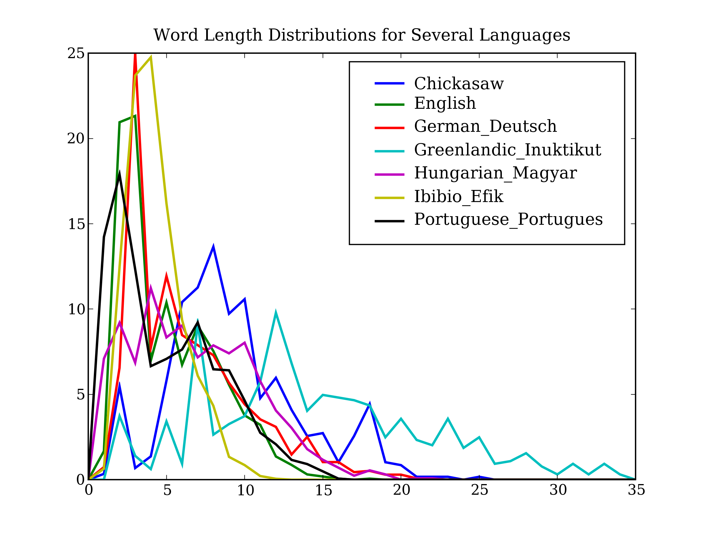
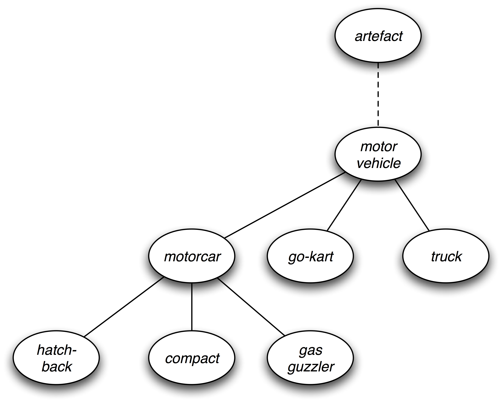

.. -*- mode: rst -*-
.. include:: ../definitions.rst

.. TODO: add exercises for Unicode section?
.. TODO: add bullet points on regular expressions to summary
.. TODO: update cspy reference to more recent book
.. TODO: add pointers to regexp toolkits (e.g. Kodos)
.. TODO: adopt simpler hacker example with only single character transpositions;
   move hacker example to later section (later chapter?)

.. _chap-programming:

=================================================
1. Introduction to Language Processing and Python
=================================================

.. _the-language-challenge:

----------------------
The Language Challenge
----------------------

Today, people from all walks of life |mdash| including professionals, students,
and the general population |mdash| are confronted by
unprecedented volumes of information, the vast bulk of which is stored
as unstructured text. In 2003, it was estimated that the annual
production of books amounted to 8 Terabytes. (A Terabyte is 1,000
Gigabytes, i.e., equivalent to 1,000 pickup trucks filled with books.)
It would take a human being about five years to read the new
scientific material that is produced every 24 hours.  Although these
estimates are based on printed materials, increasingly the information
is also available electronically. Indeed, there has been an explosion of text
and multimedia content on the World Wide Web.  For many people, a
large and growing fraction of work and leisure time is spent
navigating and accessing this universe of information.

.. 
   http://www2.sims.berkeley.edu/courses/is202/f00/lectures/Lecture2.ppt
   William Hayes

The presence of so much text in electronic form is a huge challenge to
|NLP|. Arguably, the only way for humans to cope with the information
explosion is to exploit computational techniques that can sift
through huge bodies of text. 

Although existing search engines have been crucial to the growth and
popularity of the Web, humans require skill, knowledge, and some luck,
to extract answers to such questions as `What tourist sites can I
visit between Philadelphia and Pittsburgh on a limited budget?`:lx:
`What do expert critics say about digital SLR cameras?`:lx: `What
predictions about the steel market were made by credible commentators
in the past week?`:lx: Getting a computer to answer them automatically
is a realistic long-term goal, but would involve a range of language
processing tasks, including information extraction, inference, and
summarization, and would need to be carried out on a scale and with a
level of robustness that is still beyond our current capabilities.

The Richness of Language
------------------------

Language is the chief manifestation of human intelligence.  Through
language we express basic needs and lofty aspirations, technical
know-how and flights of fantasy.  Ideas are shared over great
separations of distance and time.  The following samples from English
illustrate the richness of language:

.. ex::

  .. ex:: Overhead the day drives level and grey, hiding the sun by a flight
          of grey spears.  (William Faulkner, *As I Lay Dying*, 1935)
  .. ex:: When using the toaster please ensure that the exhaust fan is turned
          on. (sign in dormitory kitchen)
  .. ex:: Amiodarone weakly inhibited CYP2C9, CYP2D6, and CYP3A4-mediated
          activities with Ki values of 45.1-271.6 |mu|\M (Medline, PMID: 10718780)
  .. ex:: Iraqi Head Seeks Arms (spoof news headline)
  .. ex:: The earnest prayer of a righteous man has great power and wonderful
          results. (James 5:16b)
  .. ex:: Twas brillig, and the slithy toves did gyre and gimble in the wabe
         (Lewis Carroll, *Jabberwocky*, 1872)
  .. ex:: There are two ways to do this, AFAIK :smile:  (internet discussion archive)

Thanks to this richness, the study of language is part of many
disciplines outside of linguistics, including translation, literary
criticism, philosophy, anthropology and psychology.  Many less obvious
disciplines investigate language use, such as law, hermeneutics,
forensics, telephony, pedagogy, archaeology, cryptanalysis and speech
pathology.  Each applies distinct methodologies to gather
observations, develop theories and test hypotheses.  Yet all serve to
deepen our understanding of language and of the intellect that is
manifested in language.

The importance of language to science and the arts is matched in
significance by the cultural treasure embodied in language.
Each of the world's ~7,000 human languages is rich in unique respects,
in its oral histories and creation legends, down to its grammatical
constructions and its very words and their nuances of meaning.
Threatened remnant cultures have words to distinguish plant subspecies
according to therapeutic uses that are unknown to science.  Languages
evolve over time as they come into contact with each other and they
provide a unique window onto human pre-history.  Technological change
gives rise to new words like `blog`:lx: and new morphemes like `e-`:lx: and
`cyber-`:lx:.  In many parts of the world, small linguistic variations
from one town to the next add up to a completely different language in
the space of a half-hour drive.  For its breathtaking complexity and
diversity, human language is as a colorful tapestry stretching
through time and space.

The Promise of |NLP|
--------------------

As we have seen, |NLP| is important
for scientific, economic, social, and cultural reasons.  |NLP| is
experiencing rapid growth as its theories and methods are deployed in
a variety of new language technologies.  For this reason it is
important for a wide range of people to have a working knowledge of
|NLP|.
Within industry, it includes people in
`human-computer interaction`:idx:, `business information analysis`:idx:,
and `Web software development`:idx:.
Within academia, this includes people in areas from
`humanities computing`:idx: and `corpus linguistics`:idx:
through to `computer science`:idx: and `artificial intelligence`:idx:.
We hope that you, a member of this diverse
audience reading these materials, will come to appreciate the workings
of this rapidly growing field of |NLP| and will apply its techniques in
the solution of real-world problems.  

This book presents a
carefully-balanced selection of theoretical foundations and practical
applications, and equips readers to work with large datasets, to create
robust models of linguistic phenomena, and to deploy them in working
language technologies.  By integrating all of this into the Natural
Language Toolkit (|NLTK|), we hope this book opens up the exciting
endeavor of practical natural language processing to a broader
audience than ever before.

The rest of this chapter provides a non-technical overview of Python and will
cover the basic programming knowledge needed for the rest of
the chapters in Part 1.  It contains many examples and exercises;
there is no better way to learn to program than to dive in and try
these yourself.  Before you know it you will be programming!

The goal of this chapter is to answer the following questions:

#. what can we achieve by combining simple programming techniques with large quantities of text?
#. how can we automatically extract representative words from a large text?
#. is the Python programming language suitable for such work?

The rest of this chapter is divided into sections that skip between two quite
different styles: "computing with language" where we carry out a range of
linguistically-motivated tasks without necessarily understanding how they
work, and "closer looks at Python" where we systematically review key
programming concepts.  We hope this style of introduction gives you an
authentic taste of what will come later, while covering a range of
elementary concepts in linguistics and computer science.

.. _sect-computing-with-language-texts-and-words:

----------------------------------------
Computing with Language: Texts and Words
----------------------------------------

As we will see, it is easy to get our hands on large quantities of text.
What can we do with it, assuming we can write some simple programs?
Here we will treat the text as data for the programs we write,
programs that manipulate and analyze it in a variety of interesting ways.
The first step is to get started with the Python interpreter.

Getting Started
---------------

..  The emphasised text in this paragraph used to be literal, which is
    probably not applicable.  I'm not sure if emphasis is the best
    markup either.  See note 10 in toolscheck-response.txt in the
    O'Reilly repository.

    The arrows in this section have been written literally, not using
    the macros defined in definitions.rst, since using macros here
    wasn't working for me.

    pbone@csse.unimelb.edu.au

One of the friendly things about Python is that it allows you
to type directly into the interactive `interpreter`:dt: |mdash|
the program that will be running your Python programs.
You can run the Python interpreter using a simple graphical interface
called the Interactive DeveLopment Environment (|IDLE|).
On a Mac you can find this under *Applications→MacPython*,
and on Windows under *All Programs→Python*.
Under Unix you can run Python from the shell by typing ``python``.
The interpreter will print a blurb about your Python version;
simply check that you are running Python 2.4 or greater (here it is 2.5):

.. doctest-ignore::
    Python 2.5 (r25:51918, Sep 19 2006, 08:49:13) 
    [GCC 4.0.1 (Apple Computer, Inc. build 5341)] on darwin
    Type "help", "copyright", "credits" or "license" for more information.
    >>>

.. note::
   If you are unable to run the Python interpreter, you probably don't
   have Python installed correctly.  Please visit |NLTK-URL| for
   detailed instructions.

The ``>>>`` prompt indicates that the Python interpreter is now waiting
for input.  When copying examples from this book be sure not to type
in the ``>>>`` prompt yourself.  Now, let's begin by using Python as a calculator:

    >>> 1 + 5 * 2 - 3
    8
    >>>

Once the interpreter has finished calculating the answer and displaying it, the
prompt reappears. This means the Python interpreter is waiting for another instruction.

Try a few more expressions of your own. You can use asterisk (``*``)
for multiplication and slash (``/``) for division, and parentheses for
bracketing expressions. One strange thing you might come across is
that division doesn't always behave as you might expect; it does integer
division or floating point division depending on how you specify the inputs:

    >>> 3/3
    1
    >>> 1/3
    0
    >>> 1.0/3.0
    0.33333333333333331
    >>>

These examples demonstrate how you can work interactively with the
interpreter, allowing you to experiment and explore.
As you will see later, your intuitions about numerical expressions
will be useful for manipulating language data in Python.

Now let's try a nonsensical expression to see how the interpreter handles it:

    >>> 1 +
    Traceback (most recent call last):
      File "<stdin>", line 1
        1 +
          ^
    SyntaxError: invalid syntax
    >>>

.. The real output doesn't contain the "Traceback ..." line, but
   doctest doesn't recognize it as an exception without it.

Here we have produced a `syntax error`:dt:.  It doesn't make sense
to end an instruction with a plus sign. The Python interpreter indicates
the line where the problem occurred.

Searching Text
--------------

Now that we can use the Python interpreter, let's see how we can harness its
power to process text.  The first step is to type a line of magic at the
Python prompt, telling the interpreter to load some texts for us to explore:
``from nltk.book import *`` (i.e. import all names from NLTK's book module).
After printing a welcome message, it loads
the text of several books, including *Moby Dick*.  Type the following,
taking care to get spelling and punctuation exactly right:

    >>> from nltk.book import *
    >>> text1
    <Text: Moby Dick by Herman Melville 1851>
    >>> text2
    <Text: Sense and Sensibility by Jane Austen 1811>
    >>>

We can examine the contents of a text in a variety
of ways.  A concordance view shows us a given word in its context.  Here we
look up the word `monstrous`:lx:.  Try seaching for other words; you can use the up-arrow
key to access the previous command and modify the word being searched.

    >>> text1.concordance("monstrous")
    mong the former , one was of a most monstrous size . ... This came towards us , o
    ION OF THE PSALMS . " Touching that monstrous bulk of the whale or ork we have re
    all over with a heathenish array of monstrous clubs and spears . Some were thickl
    ed as you gazed , and wondered what monstrous cannibal and savage could ever have
     that has survived the flood ; most monstrous and most mountainous ! That Himmale
     they might scout at Moby Dick as a monstrous fable , or still worse and more det
    ath of Radney .'" CHAPTER 55 Of the monstrous Pictures of Whales . I shall ere lo
    ling Scenes . In connexion with the monstrous pictures of whales , I am strongly 
    >>>

You can now try concordance searches on some of the other texts we have included.
For example, search *Sense and Sensibility* for the word
`affection`:lx:, using ``text2.concordance("affection")``.  Search the book of Genesis
to find out how long some people lived, using:
``text3.concordance("lived")``.  You could look at ``text4``, the
*US Presidential Inaugural Addresses* to see examples of English dating
back to 1789, and search for words like `nation`:lx:, `terror`:lx:, `god`:lx:.
We've also included ``text5``, the *NPS Chat Corpus*: search this for
unconventional words like `im`:lx:, `ur`:lx:, `lol`:lx:.
(Note that this corpus is uncensored!)

Once you've spent some time examining these texts, we hope you have a new
sense of the richness and diversity of language.  In the next chapter
you will learn how to access a broader range of text, including text in
languages other than English.

If we can find words in a text, we can also take note of their position within
the text.  We produce a dispersion plot, where each bar represents an instance
of a word and each row represents the entire text.  In Figure fig-inaugural_ we
see some striking patterns of word usage over the last 220 years.  You can
produce this plot as shown below (so long as you have Numpy and Pylab installed).
You might like to try different words, and different texts.  As before, take
care to get the quotes, commas, brackets and parentheses exactly right.

    >>> text4.dispersion_plot(["citizens", "democracy", "freedom", "duties", "America"])
    >>>

.. _fig-inaugural:
.. figure:: ../images/inaugural.png
   :scale: 100

   Lexical Dispersion Plot for Words in Presidential Inaugural Addresses

A concordance permits us to see words in context, e.g. we saw that
`monstrous`:lx: appeared in the context `the monstrous pictures`:lx:.
What other words appear in the same contexts that `monstrous`:lx:
appears in?  We can find out as follows:

    >>> text1.similar("monstrous")
    subtly impalpable curious abundant perilous trustworthy untoward
    singular imperial few maddens loving mystifying christian exasperate
    puzzled fearless uncommon domineering candid
    >>> text2.similar("monstrous")
    great very so good vast a exceedingly heartily amazingly as sweet
    remarkably extremely
    >>>

Observe that we get different results for different books.

Now, just for fun, let's try generating some random text in the various
styles we have just seen.  To do this, we type the name of the text
followed by the "generate" function, e.g. ``text3.generate()``:

    >>> text3.generate()
    In the beginning of his brother is a hairy man , whose top may reach
    unto heaven ; and ye shall sow the land of Egypt there was no bread in
    all that he was taken out of the month , upon the earth . So shall thy
    wages be ? And they made their father ; and Isaac was old , and kissed
    him : and Laban with his cattle in the midst of the hands of Esau thy
    first born , and Phichol the chief butler unto his son Isaac , she
    >>>

Note that first time you run this, it is slow because it gathers statistics
about word sequences.  Each time you run it, you will get different output text.
Now try generating random text in the style of an inaugural address or an
internet chat room.

.. note:: When text is printed, punctuation has been split off
   from the previous word.  Although this is not correct formatting
   for English text, we do this to make it clear that punctuation does
   not belong to the word.  This is called "tokenization", and you will learn
   about it in Chapter chap-words_.

Counting Vocabulary
-------------------

The most obvious fact about texts that emerges from the previous section is that
they differ in the vocabulary they use.  In this section we will see how to use the
computer to count the words in a text, in a variety of useful ways.
As before you will jump right in and experiment with
the Python interpreter, even though you may not have studied Python systematically
yet.

Let's begin by finding out the length of a text from start to finish,
in terms of the words and punctuation symbols that appear.  We'll use
the text of *Moby Dick* again:

    >>> len(text1)
    260819
    >>>

That's a quarter of a million words long!  But how many distinct words does this text
contain?  To work this out in Python we have to pose the question slightly
differently.  The vocabulary of a text is just the *set* of words that it uses,
and in Python we can list the vocabulary of ``text3`` with the command: ``set(text3)``.
This will produce many screens of words.  Now try the following:

    >>> sorted(set(text3))
    ['!', "'", '(', ')', ',', ',)', '.', '.)', ':', ';', ';)', '?', '?)',
    'A', 'Abel', 'Abelmizraim', 'Abidah', 'Abide', 'Abimael', 'Abimelech',
    'Abr', 'Abrah', 'Abraham', 'Abram', 'Accad', 'Achbor', 'Adah', ...]
    >>> len(set(text3))
    2789
    >>> len(text3) / len(set(text3))
    16
    >>>

Here we can see a sorted list of vocabulary items, beginning with various
punctuation symbols and continuing with words starting with `A`:lx:.  Words
starting with `a`:lx: will appear much later, after the last "Z" word, `Zoroaster`:lx:.
We discover the size of the vocabulary indirectly, by asking
for the length of the set.  Finally, we can calculate a measure of the lexical
richness of the text and learn that each word is used 16 times on average.

Next, let's focus in on particular words.  We can count how often a word occurs
in a text, and compute what percentage
of the text is taken up by a specific word:

    >>> text3.count("smote")
    5
    >>> 100.0 * text4.count('a') / len(text4)
    1.4587672822333748
    >>>

You might like to repeat such calculations on several texts,
but it is tedious to keep retyping it for different texts.  Instead,
we can come up with our own name for this task, e.g. "score", and
define a `function`:dt: that can be re-used as often as we like:

    >>> def score(text):
    ...     return len(text) / len(set(text))
    ...
    >>> score(text3)
    16
    >>> score(text4)
    4
    >>>

.. note:: The Python interpreter changes the prompt from
   ``>>>`` to ``...`` after encountering the colon at the
   end of the first line.  The ``...`` prompt indicates
   that Python expects an indented code block to appear next.
   It is up to you to do the indentation, by typing four
   spaces.  To finish the indented block just enter a blank line.

Notice that we used the ``score`` function by typing its name, followed
by an open parenthesis, the name of the text, then a close parenthesis.
This is just what we did for the ``len`` and ``set`` functions earlier.
These parentheses will show up often: their role is to separate
the name of a task |mdash| such as ``score`` |mdash| from the data
that the task is to be performed on |mdash| such as ``text3``.
Functions are an advanced concept in programming and we only
mention them at the outset to give newcomers a sense of the
power and flexibility of programming.  We'll come back to them
towards the end of this chapter.  Later we'll see how to use
such functions when tabulating data, as shown below:
same task many times over using functions, we can easily build
up tables like Table brown-types_.

.. table:: brown-types

   ==================  ===========  ==========  =====
   Genre               Token Count  Type Count  Score
   ==================  ===========  ==========  =====
   skill and hobbies   82345        11935       6.9
   humor               21695        5017        4.3
   fiction: science    14470        3233        4.5
   press: reportage    100554       14394       7.0
   fiction: romance    70022        8452        8.3
   religion            39399        6373        6.2
   ==================  ===========  ==========  =====

   Lexical Diversity of Various Genres in the Brown Corpus

Exercises
---------

#. |easy| How many words are there in ``text2``?  How many
   distinct words are there?

#. |easy| Compare the lexical diversity scores for humor
   and romance fiction in Table brown-types_.  Which genre is
   more lexically diverse?

#. |talk| Compare the lexical dispersion plot with Google Trends, which
   shows the frequency with which a term has been referenced in news reports
   or been used in search terms over time.

#. |easy| Produce a dispersion plot of the four main protagonists in
   *Sense and Sensibility*: Elinor, Marianne, Edward, Willoughby.
   What can you observe about the different roles played by the males
   and females in this novel?  Can you identify the couples?

#. |easy| According to Strunk and White's *Elements of Style*,
   the word `however`:lx:, used at the start of a sentence,
   means "in whatever way" or "to whatever extent", and not
   "nevertheless".  They give this example of correct usage:
   `However you advise him, he will probably do as he thinks best.`:lx:
   (http://www.bartleby.com/141/strunk3.html)
   Use the concordance tool to study actual usage of this word
   in the various texts we have been considering.

#. |soso| Consider the following Python expression: ``len(set(text4))``.
   State the purpose of this expression.  Describe the two steps
   involved in performing this computation.

#. |soso| How many times does the word `lol`:lx: appear in ``text5``?
   How much is this as a percentage of the total number of words
   in this text? 

#. |soso| Pick a pair of texts and study the differences between them,
   in terms of vocabulary, vocabulary richness, genre, etc.  Can you
   find pairs of words which have quite different meanings across the
   two texts, such as `monstrous`:lx: in *Moby Dick* and in *Sense and Sensibility*?

#. |soso| Compare the frequency of use of the modal verbs `will`:lx: and
   `could`:lx: in ``text2`` (romance fiction) and ``text7`` (news).
   Which modal verb is more common in which genre? 

We will leave our quest for characteristic words of a text,
and explore a rather different approach that uses the
*ratio* of word frequencies.

------------------------------------------------
A Closer Look at Python: Texts as Lists of Words
------------------------------------------------

You've seen some important building blocks of the Python programming language.
Here we take a break from language processing to take a closer look at Python.

Lists
-----

What is a text?  At one level, it is a sequence of symbols on a page, such
as this one.  At another level, it is a sequence of chapters, made up
of a sequence of sections, where each section is a sequence of paragraphs,
and so on.  However, for our purposes, we will think of a text as nothing
more than a sequence of words and punctuation.  Here's how we represent
text in Python, in this case the opening sentence of *Moby Dick*:

    >>> sent1 = ["Call", "me", "Ishmael", "."]
    >>>

After the prompt we've given a name we made up, ``sent1``, followed
by the equals sign, and then some quoted words, separated with
commas, and surrounded with brackets.  This bracketed material
is known as a `list`:dt: in Python: it is how we store a text.
Each individual word must be quoted, using double or single quotes,
like ``"this"`` or like ``'this'``.
(When using single quotes, use the *close* quote character at the start and the end.)
Here, we've given this list the name ``sent1``.  We can inspect
it by typing the name, and we can ask for its length:

    >>> sent1
    ['Call', 'me', 'Ishmael', '.']
    >>> len(sent1)
    4
    >>> score(sent1)
    1
    >>>

We can even apply our own "score" function to it.
Some more lists have been defined for you,
one for the opening sentence of each of our texts,
``sent2`` |dots| ``sent8``.  We inspect two of them
here; you can see the rest for yourself using the Python interpreter.

    >>> sent2
    ["The", "family", "of", "Dashwood", "had", "long",
    "been", "settled", "in", "Sussex", "."]
    >>> sent3
    ["In", "the", "beginning", "God", "created", "the",
    "heaven", "and", "the", "earth", "."]

You can type these in or else make up a few sentences of your own.
Now let's repeat some of the other Python operations we saw above in
Section sect-computing-with-language-texts-and-words_:

    >>> sorted(sent3)
    ['.', 'God', 'In', 'and', 'beginning', 'created', 'earth',
    'heaven', 'the', 'the', 'the']
    >>> len(set(sent3))
    9
    >>> sent3.count("the")
    3
    >>>

We can also do arithmetic operations with lists in Python.
Multiplying a list by a number, e.g. ``sent1 * 2``,
creates a longer list containing multiple
copies of the items in the original list.  Adding two
lists, e.g. ``sent4 + sent1``, creates a new list
containing everything from the first list, followed
by everything from the second list:

    >>> sent1 * 2
    ['Call', 'me', 'Ishmael', '.', 'Call', 'me', 'Ishmael', '.']
    >>> sent4 + sent1
    ['Fellow', '-', 'Citizens', 'of', 'the', 'Senate', 'and', 'of', 'the',
    'House', 'of', 'Representatives', ':', 'Call', 'me', 'Ishmael', '.']
    >>>

This special use of the addition operation is called `concatenation`:dt:;
it links the lists together into a single list.  We can concatenate
sentences to build up a text.

Indexing
--------

As we have seen, a text in Python is just a list of words, represented
using a particular combination of brackets and quotes.  Just as with an
ordinary page of text, we can count up the total number of words
(``len(text1)``), and count the occurrences of a particular word
(``text1.count("heaven")``).  And just as we can pick out the
first, tenth, or even 14,278th word in a printed text, we can identify
the elements of a list by their number, or `index`:dt:, by following
the name of the text with the index inside brackets.  We can
also find the index of the first occurrence of any word:

    >>> text4[173]
    'awaken'
    >>> text4.index("awaken")
    173
    >>>

Indexes turn out to be a common way to access the words of a text,
or |mdash| more generally |mdash| the elements of a list.
Python permits us to access sublists as well, extracting
manageable pieces of language from large texts, a technique
known as `slicing`:dt:.

    >>> text5[1040:1060]
    ['U86', 'thats', 'why', 'something', 'like', 'gamefly', 'is',
    'so', 'good', 'because', 'you', 'can', 'actually', 'play',
    'a', 'full', 'game', 'without', 'buying', 'it']

Indexes have some subtleties, and we'll explore these with
the help of an artificial sentence:

    >>> sent = ["word1", "word2", "word3", "word4", "word5",
                "word6", "word7", "word8", "word9", "word10",
                "word11", "word12", "word13", "word14", "word15",
                "word16", "word17", "word18", "word19", "word20"]
    >>> sent[0]
    'word1'
    >>> sent[19]
    'word20'
    >>>

Notice that our indexes start from zero:
``sent`` element zero, written ``sent[0]``,
is the first word, ``'word1'``, while
``sent`` element 19 is ``'word20'``. 
This is initially confusing,
but typical of modern programming languages.
(If you've mastered the system of counting
centuries where 19XY is a year in the 20th century,
or if you live in a country where walking up
1 flight of stairs puts you on level 2
of a building, you'll quickly get the hang of this.)
The moment Python accesses the content of a list from
the computer's memory, it is already at the first element;
we have to tell it how many elements forward to go.

Let's take a closer look at slicing, using our artificial sentence again:

    >>> sent[17:20]
    ['word18', 'word19', 'word20']
    >>> sent[17]
    'word18'
    >>> sent[18]
    'word19'
    >>> sent[19]
    'word20'
    >>>

Thus, the slice ``17:20`` includes ``sent`` elements 17, 18, and 19.
By convention, ``m:n`` means elements `m`:mathit:\ |dots|\ `n-1`:mathit:.
We can omit the first number if the slice begins at the start of the
list, and we can omit the second number if the slice goes to the end:

    >>> sent[:3]
    ['word1', 'word2', 'word3']
    >>> text2[141525:]
    ['among', 'the', 'merits', 'and', 'the', 'happiness', 'of', 'Elinor',
    'and', 'Marianne', ',', 'let', 'it', 'not', 'be', 'ranked', 'as', 'the',
    'least', 'considerable', ',', 'that', 'though', 'sisters', ',', 'and',
    'living', 'almost', 'within', 'sight', 'of', 'each', 'other', ',',
    'they', 'could', 'live', 'without', 'disagreement', 'between', 'themselves',
    ',', 'or', 'producing', 'coolness', 'between', 'their', 'husbands', '.',
    'THE', 'END']
    >>>

We can modify an element of a list by assigning to one of its index values,
e.g. putting ``sent[0]`` on the left of the equals sign.  We can also
replace an entire slice with new material:

    >>> sent[0] = "First Word"
    >>> sent[19] = "Last Word"
    >>> sent[1:19] = ["Second Word", "Third Word"]
    >>> sent
    ['First Word', 'Second Word', 'Third Word', 'Last Word']
    >>>

Variables
---------

From the start of Section sect-computing-with-language-texts-and-words_, you have had
access texts called ``text1``, ``text2``, and so on.  It saved a lot
of typing to be able to refer to a 250,000-word book with a short name
like this!  In general, we can make up names for anything we care
to calculate.  We did this ourselves in the previous sections, e.g.
defining a `variable`:dt: ``sent1`` as follows:

    >>> sent1 = ['Call', 'me', 'Ishmael', '.']
    >>>

Such lines have the form: *variable = expression*.  Python will evaluate
the expression, and save its result to the variable.  This process does
not generate any output; you have to type the variable on a line of its
own to inspect its contents.  The equals sign is slightly misleading,
since information is copied from the right side to the left.
The variable can be anything you like, e.g. ``my_sent``, ``sentence``, ``xyzzy``.
It must start with a letter, and can include numbers and underscores.
It cannot be any of Python's reserved words, such as ``if``, ``not``,
and ``import``.  Here are some examples:

    >>> mySent = ["The", "family", "of", "Dashwood", "had", "long",
    ...          "been", "settled", "in", "Sussex", "."]
    >>> noun_phrase = mySent[:4]
    >>> noun_phrase
    ['The', 'family', 'of', 'Dashwood']
    >>> wOrDs = sorted(noun_phrase)
    >>> wOrDs
    ['Dashwood', 'The', 'family', 'of']
    >>>

It is good to choose meaningful variable names to help you |mdash| and anyone
who reads your Python code |mdash| to understand what your code is meant to do.
Python does not try to make sense of the names; it blindly follows your instructions,
and does not object if you do something confusing, such as ``one = "two"`` or ``two = 3``.

We can use variables to hold intermediate steps of a computation.  This may make
the Python code easier to follow.  Thus ``len(set(text1))`` could also be written:

    >>> vocab = set(text1)
    >>> vocab_size = len(vocab)
    >>> vocab_size
    19317
    >>>

Exercises
---------

#. |easy| Create a variable ``phrase`` containing a list of words.
   Experiment with the operations described above, including addition,
   multiplication, indexing, slicing, and sorting. 

#. |easy| The index of `the`:lx in ``sent3`` is 1, because ``sent3[1]``
   gives us ``'the'``.  What are the indexes of the two other occurrences
   of this word in ``sent3``?

#. |easy| Our artificial sentence had 20 elements.  What does the interpreter
   do when you enter ``sent[20]``?  Why?

#. |easy| We can count backwards from the end of a list using negative indexes.
   The last element of a list always has index ``-1``.
   See what happens when you enter ``text2[-1]``.

#. |soso| Use ``text6.index(??)`` to find the index of the word `sunset`:lx:.
   By a process of trial and error, find the slice for the complete sentence that
   contains this word.

#. |soso| Use the addition, set, and sorted operations to compute the
   vocabulary of the sentences defined above (``sent1`` ...).

#. |soso| Write the slice expression to produces the last two
   words of ``text2``.

.. _computing-with-language-simple-statistics:

------------------------------------------
Computing with Language: Simple Statistics
------------------------------------------

Let's return to our exploration of the ways we can bring our computational
resources to bear on large quantities of text.  We began this discussion in
Section sect-computing-with-language-texts-and-words_, and we saw how to search for words
in context, how to compile the vocabulary of a text, how to generate random
text in the same style, and so on.

In this section we pick up the question of what makes a text distinct,
and use automatic methods to find characteristic words and collocations
of a text.  As in Section sect-computing-with-language-texts-and-words_, you will try
new features of the Python language by copying them into the interpreter,
and you'll learn about these features systematically in the following section.

Before continuing with this section, check your understanding of the
previous section by predicting the output of the following code, and using the
interpreter to check if you got it right.  If you found it difficult
to do this task, it would be a good idea to review the previous section
before continuing further.

.. doctest-ignore::
    >>> saying = ["After", "all", "is", "said", "and", "done", ",",
    ...           "more", "is", "said", "than", "done", "."]
    >>> words = set(saying)
    >>> words = sorted(words)
    >>> words[-2:]

.. _sec-frequency-distributions:

Frequency Distributions
-----------------------

How could we automatically identify the words of a text that are most
informative about the topic and genre of the text?  Let's begin by
finding the most frequent words of the text.  Imagine how you might
go about finding the 50 most frequent words of a book.  One method
would be to keep a tally for each vocabulary item, like that shown in Figure tally_.
We would need thousands of counters and it would be a laborious process,
so laborious that we would rather assign the task to a machine.

.. _tally:
.. figure:: ../images/tally.png
   :scale: 40

   Counting Words Appearing in a Text

The table in Figure tally_ is known as a `frequency distribution`:dt:,
and it tells us the frequency of each vocabulary item in the text.  It is a "distribution"
since it tells us how the the total number of words in the text |mdash| 260,819
in the case of *Moby Dick* |mdash| are distributed across the vocabulary items.
Since we often need frequency distributions in language processing, NLTK
provides built-in support for them.  Let's use a ``FreqDist`` to find the
50 most frequent words of *Moby Dick*.  Be sure to try this for yourself,
taking care to use the correct parentheses and uppercase letters.
(This code assumes that you have already done
``from nltk.book import *`` during your Python session.)

    >>> fdist1 = FreqDist(text1)
    >>> fdist1
    <FreqDist with 260819 samples>
    >>> vocabulary1 = fdist1.sorted()
    >>> vocabulary1[:50]
    [',', 'the', '.', 'of', 'and', 'a', 'to', ';', 'in', 'that', "'", '-',
    'his', 'it', 'I', 's', 'is', 'he', 'with', 'was', 'as', '"', 'all', 'for',
    'this', '!', 'at', 'by', 'but', 'not', '--', 'him', 'from', 'be', 'on',
    'so', 'whale', 'one', 'you', 'had', 'have', 'there', 'But', 'or', 'were',
    'now', 'which', '?', 'me', 'like']
    >>> fdist1["whale"]
    906
    >>>

Do any words in the above list help us grasp the topic or genre of this text?
Only one word, `whale`:lx:, is slightly informative!  It occurs over 900 times.
This list tells us almost nothing about the text; they just represent the
plumbing of English text.
What proportion of English text is taken up with such words?
We can generate a cumulative frequency plot for these words,
using ``fdist1.plot()``, to produce the graph shown in Figure fdist-moby_.
From this, it looks like these 50 words account for almost half the
words of the book!

.. _fdist-moby:
.. figure:: ../images/fdist-moby.png
   :scale: 25

   Cumulative Frequency Plot for 50 Most Frequent Words in *Moby Dick*

If the frequent words don't help us, how about the words that occur once
only, the so-called `hapaxes`:dt:.  See them using ``fdist1.hapaxes()``.
This list contains `lexicographer`:lx:, `cetological`:lx:,
`contraband`:lx:, `expostulations`:lx:, and about 9,000 others!
It seems that there's too many rare words, and without seeing the
context we probably can't guess what half of them mean in any case.

Next let's look at the *long* words of a text; perhaps these will be
more characteristic and informative.  For this we adapt some notation
from set theory.  We would like to find the words from the vocabulary
of the text that are more than than 15 characters long.  We can
express this in mathematical notation as follows:    

.. _ex-set-comprehension:

.. ex:: {`w`:math: | `w`:math: |element| `V`:math: & `P(w)`:math:\ },
   where `P(w)`:math: is true if and only if `w`:math: is more than 15 characters long.

In other words, we want to find all `w`:math: such that `w`:math:
is in the vocabulary and `w`:math: is longer than 15 characters.
We can translate this expression into Python as follows:

    >>> v = set(text1)
    >>> sorted(w for w in v if len(w) > 15)
    ['apprehensiveness', 'comprehensiveness', 'indiscriminately',
    'superstitiousness', 'circumnavigating', 'simultaneousness',
    'physiognomically', 'circumnavigation', 'hermaphroditical',
    'subterraneousness', 'uninterpenetratingly', 'irresistibleness',
    'responsibilities', 'uncompromisedness', 'uncomfortableness',
    'supernaturalness', 'characteristically', 'cannibalistically',
    'circumnavigations', 'indispensableness', 'preternaturalness',
    'CIRCUMNAVIGATION', 'undiscriminating', 'Physiognomically']

The expression ``w for w in v`` could have equally been written
``word for word in vocab``, and means "give me all words, where each
word is an element of the vocabulary set".  For each such word,
we check that its length is greater than 15; all other words will
be ignored.  We will discuss this more carefully later.  For now
you should simply try out the above statements in the Python interpreter,
and try changing the text, and changing the length condition.

Let's return to our task of finding words that characterize a text.
Notice that the long words in ``text4`` reflect its national focus:
`constitutionally`:lx:, `transcontinental`:lx:, while
those in ``text5`` reflect its informal content:
`boooooooooooglyyyyyy`:lx: and `yuuuuuuuuuuuummmmmmmmmmmm`:lx:.
Have we succeeded in automatically extracting words that typify
a text?  Well, these very long words are often hapaxes (i.e. unique)
and perhaps it would be better to find *frequently occurring*
long words.  This seems promising since it eliminates
frequent short words (e.g. `the`:lx:) and infrequent long words
like (`antiphilosophists`:lx:).
Here are all words from the chat corpus
that are longer than 5 characters, that occur more than 5 times:

    >>> fdist5 = FreqDist(text5)
    >>> sorted(w for w in set(text5) if len(w) > 5 and text5.count(w) > 5)
    ['#14-19teens', '<empty>', 'ACTION', 'anybody', 'anyone', 'around',
    'cute.-ass', 'everybody', 'everyone', 'female', 'listening', 'minutes',
    'people', 'played', 'player', 'really', 'seconds', 'should', 'something',
    'watching']

Notice how we have used two conditions: ``len(w) > 5`` ensures that the
words are longer than 5 letters, and ``text5.count(w) > 5`` ensures that
these words occur more than five times.  At last we have managed to
automatically identify the frequently-occuring content-bearing
words of the text.

Collocations
------------

Frequency distributions are very powerful.  Here we briefly explore
a more advanced application that uses word pairs, also known as `bigrams`:dt:.
We can convert a list of words to a list of bigrams as follows:

    >>> bigrams(["more", "is", "said", "than", "done"])
    [('more', 'is'), ('is', 'said'), ('said', 'than'), ('than', 'done')]
    >>>

Here we see that the pair of words `than-done`:lx: is a bigram, and we write
it in Python as ``('than', 'done')``.  Now, collocations are essentially
just frequent bigrams, except that we want to pay more attention to the
cases that involve rare words.  In particular, we want to find
bigrams that occur more often than we would expect based on
the frequency of individual words.  The ``collocations()`` function
does this for us (we will see how it works later).

    >>> text4.collocations()
    United States; fellow citizens; has been; have been; those who;
    Declaration Independence; Old World; Indian tribes;
    District Columbia; four years; Chief Magistrate; and the;
    the world; years ago; Santo Domingo; Vice President;
    the people; for the; specie payments; Western Hemisphere

Statistics Over Secondary Data
------------------------------

[statistics over word lengths (multiple plots on one graph), eliminating words, normalizing words, freqdists over letters]

..
   IDLE session:
   indexing, max()
   set.difference()?

..
   zipf curve of letters

..
   Forward pointers:
   dictionaries

.. FreqDists in detail, [] notation

Exercises
---------

#. |soso| **The demise of teen language:**
   Read the BBC News article: *UK's Vicky Pollards 'left behind'* ``http://news.bbc.co.uk/1/hi/education/6173441.stm``.
   The article gives the following statistic about teen language:
   "the top 20 words used, including yeah, no, but and like, account for around a third of all words."
   How many word types account for a third
   of all word tokens, for a variety of text sources.  What do you conclude about this statistic?
   Read more about this on *LanguageLog*, at ``http://itre.cis.upenn.edu/~myl/languagelog/archives/003993.html``.

---------------------------------------------------
Back to Python: Making Decisions and Taking Control
---------------------------------------------------

So far, our simple programs have been able to manipulate sequences of
words, and perform some operation on each one.  We applied this to lists
consisting of a few words, but the approach works the same for lists of
arbitrary size, containing thousands of items.  Thus, such programs
have some interesting qualities: (i) the ability to work with
language, and (ii) the potential to save human effort through
automation.  Another useful feature of programs is their ability to
`make decisions`:em: on our behalf; this is our focus in this section.

Conditionals
------------

Python supports a wide range of operators like ``<`` and ``>=`` for
testing the relationship between values. The full set of these `relational
operators`:dt: are shown in Table inequalities_.

.. table:: inequalities

   ======== ==============
   Operator Relationship
   ======== ==============
   ``<``    less than
   ``<=``   less than or equal to
   ``==``   equal to (note this is two not one ``=`` sign)
   ``!=``   not equal to
   ``>``    greater than
   ``>=``   greater than or equal to
   ======== ==============

   Numerical Comparison Operators

We can use these to select different words from a sentence of news text.
Here are some examples |mdash| only the operator is changed from one
line to the next.

    >>> [w for w in sent7 if len(w) < 4]
    [',', '61', 'old', ',', 'the', 'as', 'a', '29', '.']
    >>> [w for w in sent7 if len(w) <= 4]
    [',', '61', 'old', ',', 'will', 'join', 'the', 'as', 'a', 'Nov.', '29', '.']
    >>> [w for w in sent7 if len(w) == 4]
    ['will', 'join', 'Nov.']
    >>> [w for w in sent7 if len(w) != 4]
    ['Pierre', 'Vinken', ',', '61', 'years', 'old', ',', 'the', 'board',
    'as', 'a', 'nonexecutive', 'director', '29', '.']
    >>> 

The above expressions involve numerical comparisons.  We can also
test various properties of words, using the functions listed in
Table word-tests_.

.. table:: word-tests

   ====================   =============================================
   Function               Meaning
   ====================   =============================================
   ``s.startswith(t)``    ``s`` starts with ``t``
   ``s.endswith(t)``      ``s`` ends with ``t``
   ``t in s``             ``t`` is contained inside ``s``
   ``s.islower()``        all cased characters in ``s`` are lowercase
   ``s.isupper()``        all cased characters in ``s`` are uppercase
   ``s.isalpha()``        all characters in ``s`` are alphabetic
   ``s.isalnum()``        all characters in ``s`` are alphanumeric
   ``s.isdigit()``        all characters in ``s`` are digits
   ``s.istitle()``        ``s`` is titlecased
   ====================   =============================================

   Some Word Comparison Operators

Here are some examples of these operators being used to
select words from our texts.

    >>> sorted(w for w in set(text1) if w.endswith("ableness"))
    ['comfortableness', 'honourableness', 'immutableness',
    'indispensableness', 'indomitableness', 'intolerableness',
    'palpableness', 'reasonableness', 'uncomfortableness']
    >>> sorted(w for w in set(text4) if "gnt" in w)
    ['Sovereignty', 'sovereignties', 'sovereignty']
    >>> sorted(w for w in set(sent7) if w.isdigit())
    ['29', '61']
    >>>

We can also use ``and``, ``or``, and ``not``:    

    >>> sorted(w for w in set(text7) if "-" in w and "index" in w)
    ['Stock-index', 'index-arbitrage', 'index-fund',
    'index-options', 'index-related', 'stock-index']
    >>> sorted(w for w in set(text3) if w.istitle() and len(w) > 10)
    ['Abelmizraim', 'Allonbachuth', 'Beerlahairoi', 'Canaanitish',
    'Chedorlaomer', 'Girgashites', 'Hazarmaveth', ...]
    >>> sorted(w for w in set(sent7) if not w.islower())
    [',', '.', '29', '61', 'Nov.', 'Pierre', 'Vinken']
    >>> sorted(w for w in set(text2) if "cie" in w or "cei" in w)
    ['ancient', 'ceiling', 'conceit', 'conceited', 'conceive', 'conscience',
    'conscientious', 'conscientiously', 'deceitful', 'deceive', ...]

Control Structures
------------------

Most programming languages permit us to execute a block of code when a
`conditional expression`:dt:, or ``if`` statement, is satisfied.  In
the following program, we have created a variable called ``word``
containing the string value ``'cat'``. The ``if`` statement then
checks whether the condition ``len(word) < 5`` is true.  Because the
conditional expression is true, the body of the ``if`` statement is
invoked and the ``print`` statement is executed, and displays a
message to the user.

    >>> word = "cat"
    >>> if len(word) < 5:
    ...     print 'word length is less than 5'
    ... 
    word length is less than 5
    >>>

When we use the Python interpreter we have to have an extra blank line
in order for it to detect that the nested block is complete.

If we change the conditional expression to ``len(word) >= 5``,
to check that the length of ``word`` is greater than or equal to ``5``,
then the conditional expression will no longer be true.
This time, the body of the ``if`` statement will not be executed,
and no message is shown to the user:

    >>> if len(word) >= 5:
    ...   print 'word length is greater than or equal to 5'
    ... 
    >>>

An ``if`` statement is known as a `control structure`:dt:
because it controls whether the code in the indented block will be run.
Another control structure is the ``for`` loop:

    >>> for word in ['Call', 'me', 'Ishmael', '.']:
    ...     print word
    ...
    Call
    me
    Ishmael
    .
    >>>

This is called a loop because Python executes the code in
circular fashion.  It starts by doing ``word = 'Call'``,
effectively using the ``word`` variable to name the first
item of the list.  Then it displays the value of ``word``
to the user.  Next, it moves on to the second item of the
list, and so on.  It stops once every item of the list has
been processed.

Now we can combine the ``if`` and ``for`` statements.
We will loop over every item of the list, and only print
the item if it ends with the letter "l".  We'll pick another
name for the variable to demonstrate that Python doesn't
try to make sense of variable names.

    >>> sent1 = ['Call', 'me', 'Ishmael', '.']
    >>> for xyzzy in sent1:
    ...     if xyzzy.endswith("l"):
    ...         print xyzzy
    ...
    Call
    Ishmael
    >>>

You will notice that ``if`` and ``for`` statements
have a colon at the end of the line,
before the indentation begins. In fact, all Python
control structures end with a colon.  The colon
indicates that the current statement relates to the
indented block that follows.

We can also specify an action to be taken if
the condition of the ``if`` statement is not met.
Here we see the ``elif`` "else if" statement, and
the ``else`` statement.  Notice that these also have
colons before the indented code.

    >>> for token in sent1:
    ...     if token.islower():
    ...         print "lowercase word"
    ...     elif token.istitle():
    ...         print "titlecase word"
    ...     else:
    ...         print "punctuation"
    ...
    titlecase word
    lowercase word
    titlecase word
    punctuation
    >>>

As you can see, even with this small amount of Python knowledge,
you can start to build multi-line Python programs.
Its important to develop such programs in pieces,
testing that each piece does what you expect before
combining them into a program.  This is why the Python
interactive interpreter is so invaluable, and why you should get
comfortable using it.

Finally, let's combine the idioms we've been exploring.
First we create a list of `cie`:lx: and `cei`:lx: words,
then we loop over each item and print it.  Notice the
comma at the end of the print statement, which tells
Python to produce its output on a single line.

    >>> confusing = sorted(w for w in set(text2) if "cie" in w or "cei" in w)
    >>> for word in confusing:
    ...     print word,
    ancient ceiling conceit conceited conceive conscience
    conscientious conscientiously deceitful deceive ...

Functions
---------

.. _sec-defining-functions:

It often happens that part of a program needs to be used several times
over.  For example, suppose we were writing a program that needed to
be able to form the plural of a singular noun, and that this needed to
be done at various places during the program.  Rather than repeating
the same code several times over, it is more efficient (and reliable)
to localize this work inside a `function`:dt:.  A function is a
programming construct that can be called with one or more inputs and
which returns an output.  We define a function using the keyword
``def`` followed by the function name and any input parameters,
followed by a colon; this in turn is followed by the body of the
function. We use the keyword ``return`` to indicate the value that is
produced as output by the function. The best way to convey this is
with an example. Our function ``plural()`` in Listing plural_
takes a singular noun and generates a plural form (one which is not always
correct).

.. pylisting:: plural
   :caption: Example of a Python function

   def plural(word):
       if word.endswith('y'):
           return word[:-1] + 'ies'
       elif word[-1] in 'sx' or word[-2:] in ['sh', 'ch']:
           return word + 'es'
       elif word.endswith('an'):
           return word[:-2] + 'en'
       return word + 's'

   >>> plural('fairy')
   'fairies'
   >>> plural('woman')
   'women'

(There is much more to be said about functions, but
we will hold off until Section sec-functions_.)

Frequency Distributions
-----------------------

Some of the methods defined on NLTK frequency distributions are shown in Table freqdist_.
[More discussion and examples...]

.. table:: freqdist

   ============================  =======================================================
   Example                       Description
   ============================  =======================================================
   ``fdist['monstrous']``        count of the number of times a given sample occurred
   ``fdist.freq('monstrous')``   frequency of a given sample
   ``fdist.N()``                 total number of samples
   ``fdist.sorted()``            the samples sorted in order of decreasing frequency
   ``for sample in fdist:``      iterate over the samples
   ``fdist.max()``               sample with the greatest count
   ``fdist.plot()``              graphical plot of the frequency distribution
   ============================  =======================================================

   Methods Defined in the Frequency Distribution Module

Exercises
---------

#. |easy| Assign a new value to ``sent``, namely the sentence
   ``["she", "sells", "sea", "shells", "by", "the", "sea", "shore"]``,
   then write code to perform the following tasks:

   a) Print all words beginning with ``'sh'``:

   b) Print all words longer than 4 characters.

   c) Generate a new sentence that adds the popular
      hedge word ``'like'`` before every word
      beginning with ``'se'``.

#. |soso| What does the following Python do?  ``sum(len(w) for w in text1)``
   Can you use it to work out the average word length of a text?

#. |soso| What is the difference between the test ``w.isupper()`` and
   ``not w.islower()``?

.. _sec-extracting-text-from-corpora:

-----------------------------------------------
Computing with Language: Accessing Text Corpora
-----------------------------------------------

A text corpus is a large body of text, containing a careful balance of material in
one or more genres.  We have already seen some small corpora, such as the
presidential inaugural addresses.  This corpus actually contains dozens of
individual texts |mdash| one per address |mdash| but we glued them end-to-end
and treated them like chapters of a book, i.e. as a single text.  In this
section we will examine a variety of text corpora and will see how to select
individual texts, and how to compare them.  

The Gutenberg Corpus
--------------------

|NLTK| includes a small selection of texts from the `Project Gutenberg
<http://www.gutenberg.org/>`_ electronic text archive containing
some 25,000 free electronic books.  Let's find
out what it contains.  We begin
by telling the Python interpreter to load the |NLTK| package,
then ask to see ``nltk.corpus.gutenberg.files()``, the files in
|NLTK|\ 's corpus of Gutenberg texts:  

    >>> import nltk
    >>> nltk.corpus.gutenberg.files()
    ('austen-emma.txt', 'austen-persuasion.txt', 'austen-sense.txt', 'bible-kjv.txt',
    'blake-poems.txt', 'chesterton-ball.txt', 'chesterton-brown.txt', 'chesterton-thursday.txt',
    'melville-moby_dick.txt', 'milton-paradise.txt', 'shakespeare-caesar.txt',
    'shakespeare-hamlet.txt', 'shakespeare-macbeth.txt', 'whitman-leaves.txt')
    >>>

Let's pick out the first of these texts |mdash| *Emma* by Jane Austen |mdash| and
give it a short name ``emma``, then find out how many words it contains: 

    >>> emma = nltk.corpus.gutenberg.words("austen-emma.txt")
    >>> len(emma)
    192432
    >>>

.. note:: In |NLTK| 0.9.5 you cannot do concordancing (and other tasks from
   Section sect-computing-with-language-texts-and-words_) using a text
   defined this way.  Instead you have to do the following:
   
       >>> emma = nltk.Text(nltk.corpus.gutenberg.words("austen-emma.txt"))
       >>>

It might get cumbersome to type ``nltk.corpus.gutenberg`` all the time, and there's
nothing to stop us giving this a name in the usual way, e.g. by defining a name
``gutenberg = nltk.corpus.gutenberg``, then using this instead.  This is so common
that Python provides direct support for it:

    >>> from nltk.corpus import gutenberg
    >>> gutenberg.files()
    ('austen-emma.txt', 'austen-persuasion.txt', 'austen-sense.txt', 'bible-kjv.txt',
    'blake-poems.txt', 'chesterton-ball.txt', 'chesterton-brown.txt', 'chesterton-thursday.txt',
    'melville-moby_dick.txt', 'milton-paradise.txt', 'shakespeare-caesar.txt',
    'shakespeare-hamlet.txt', 'shakespeare-macbeth.txt', 'whitman-leaves.txt')
    >>>

Let's write a short program to display other information about each text:

    >>> for filename in gutenberg.files():
    ...     r = gutenberg.raw(filename)
    ...     w = gutenberg.words(filename)
    ...     s = gutenberg.sents(filename)
    ...     v = set(w)
    ...     print filename, len(r)/len(w), len(w)/len(s), len(w)/len(v)
    ... 
    austen-emma.txt 4 21 24
    austen-persuasion.txt 4 23 16
    austen-sense.txt 4 24 20
    bible-kjv.txt 4 33 73
    blake-poems.txt 4 18 4
    chesterton-ball.txt 4 17 10
    chesterton-brown.txt 4 19 10
    chesterton-thursday.txt 4 16 10
    melville-moby_dick.txt 4 24 13
    milton-paradise.txt 4 52 9
    shakespeare-caesar.txt 4 12 7
    shakespeare-hamlet.txt 4 13 6
    shakespeare-macbeth.txt 4 13 5
    whitman-leaves.txt 4 35 10
    >>>

This program has displayed the filename, followed by three statistics for each text:
average word length, average sentence length, and the number of times each vocabulary
item appears in the text on average (our lexical diversity score).
Observe that average word length appears to be a general property of English,
while average sentence length and lexical diversity
appears to be a characteristic of individual authors.
  
This example also showed how we can access the "raw" text of the book,
not split up into words.  The ``raw()`` function gives us the contents of the file
without any linguistic processing.  So, for example, ``len(gutenberg.raw("blake-poems.txt")``
tells us how many *letters* occur in the text, including the spaces between words.
The ``sents()`` function divides the text up into its sentences, where each sentence is
a list of words:

    >>> macbeth_sentences = gutenberg.sents("shakespeare-macbeth.txt")
    >>> macbeth_sentences
    [['[', 'The', 'Tragedie', 'of', 'Macbeth', 'by', 'William', 'Shakespeare',
    '1603', ']'], ['Actus', 'Primus', '.'], ...]
    >>> macbeth_sentences[1038]
    ['Double', ',', 'double', ',', 'toile', 'and', 'trouble', ';',
    'Fire', 'burne', ',', 'and', 'Cauldron', 'bubble']
    >>>

.. note:: Most |NLTK| corpus readers include a variety of access methods
   apart from ``words()``.  We access the raw file contents using ``raw()``,
   and get the content sentence by sentence using ``sents()``.  Richer
   linguistic content is available from some corpora, such as part-of-speech
   tags, dialogue tags, syntactic trees, and so forth; we will see these
   in later chapters.

Web Text
--------

Although Project Gutenberg contains thousands of books, it represents established
literature.  Its important to consider less formal language as well.  |NLTK|\ 's
small collection of web text includes content from a Firefox discussion forum,
conversations overheard in New York, the movie script of *Pirates of the Carribean*,
personal advertisements, and wine reviews:

    >>> for f in nltk.corpus.webtext.files():
    ...     print f, nltk.corpus.webtext.raw(f)[:70]
    ... 
    firefox.txt Cookie Manager: "Don't allow sites that set removed cookies to set fut
    overheard.txt White guy: So, do you have any plans for this evening? Asian girl: Yea
    pirates.txt PIRATES OF THE CARRIBEAN: DEAD MAN'S CHEST, by Ted Elliott & Terry Ros
    singles.txt 25 SEXY MALE, seeks attrac older single lady, for discreet encounters.
    wine.txt Lovely delicate, fragrant Rhone wine. Polished leather and strawberrie 
    >>>

There is also a corpus of instant messaging chat sessions, originally collected
by the Naval Postgraduate School for research on automatic detection of internet predators.
The corpus contains over 10,000 posts, anonymized by replacing usernames with generic
names of the form "UserNNN", and manually edited to remove any other identifying information.
The corpus is organized into 15 files, where each file contains several hundred posts
collected on a given date, for an age-specific chatroom (teens, 20s, 30s, 40s, plus a
generic adults chatroom).  The filename contains the date, chatroom,
and number of posts, e.g. ``10-19-20s_706posts.xml`` contains 706 posts gathered from
the 20s chat room on 10/19/2006.

    >>> chatroom = nltk.corpus.nps_chat.posts("10-19-20s_706posts.xml")
    >>> chatroom[123]
    ['i', 'do', "n't", 'want', 'hot', 'pics', 'of', 'a', 'female', ',',
    'I', 'can', 'look', 'in', 'a', 'mirror', '.']
    >>>

The Brown Corpus
----------------

The Brown Corpus was the first million-word electronic
corpus of English, created in 1961 at Brown University.
This corpus contains text from many sources, and the sources
have been categorized by genre, and given a label ``a`` through ``r``,
as set out in Table brown-categories_.

.. table:: brown-categories

   ===  =================  ===  ==================  ===  ================  ===  ================
   Sec  Genre              Sec  Genre               Sec  Genre             Sec  Genre
   ===  =================  ===  ==================  ===  ================  ===  ================
   a    Press: Reportage   b    Press: Editorial    c    Press: Reviews    d    Religion
   e    Skill and Hobbies  f    Popular Lore        g    Belles-Lettres    h    Government
   j    Learned            k    Fiction: General    k    Fiction: General  l    Fiction: Mystery
   m    Fiction: Science   n    Fiction: Adventure  p    Fiction: Romance  r    Humor
   ===  =================  ===  ==================  ===  ================  ===  ================

   Sections of the Brown Corpus

We can access the corpus as a list of words, or a list of sentences (where each sentence
is itself just a list of words).  We can optionally specify a section of the corpus to read:

    >>> nltk.corpus.brown.categories()
    ['a', 'b', 'c', 'd', 'e', 'f', 'g', 'h', 'j', 'k', 'l', 'm', 'n', 'p', 'r']
    >>> nltk.corpus.brown.words(categories='a')
    ['The', 'Fulton', 'County', 'Grand', 'Jury', 'said', ...]
    >>> nltk.corpus.brown.sents(categories='a')
    [['The', 'Fulton', 'County'...], ['The', 'jury', 'further'...], ...]
    >>>

We can use the Brown Corpus to study systematic differences between
genres, a kind of linguistic inquiry known as `stylistics`:dt:.
For example, Table brown-modals_ was constructed by counting
the number of times various modal words appear in different sections of the corpus:

.. table:: brown-modals

   ==================  ===  =====  ===  =====  ====  ====
   Genre               can  could  may  might  must  will 
   ==================  ===  =====  ===  =====  ====  ====
   skill and hobbies   273  59     130  22     83    259 
   humor               17   33     8    8      9     13 
   fiction: science    16   49     4    12     8     16 
   press: reportage    94   86     66   36     50    387 
   fiction: romance    79   195    11   51     46    43 
   religion            84   59     79   12     54    64 
   ==================  ===  =====  ===  =====  ====  ====

   Use of Modals in Brown Corpus, by Genre

|nopar|
Observe that the most frequent modal in the reportage genre is
`will`:lx:, suggesting a focus on the future, while the most frequent
modal in the romance genre is `could`:lx:, suggesting a focus on
possibilities.  (We will return to this example in Section sec-lining-things-up_).

Reuters Corpus
--------------

The Reuters Corpus contains 10,788 news documents totaling 1.3 million words.
The documents have been classified for relevance to 90 topics, and grouped
into two sets, called "training" and "test" (for training and testing algorithms
that automatically detect the topic of a document, as we will explore further
in Chapter chap-data-intensive_).

    >>> nltk.corpus.reuters.files()
    ('test/14826', 'test/14828', 'test/14829', 'test/14832', ...)
    >>> reuters.categories() 
    ['acq', 'alum', 'barley', 'bop', 'carcass', 'castor-oil', 'cocoa',
    'coconut', 'coconut-oil', 'coffee', 'copper', 'copra-cake', 'corn',
    'cotton', 'cotton-oil', 'cpi', 'cpu', 'crude', 'dfl', 'dlr', ...]
    >>>

Unlike the Brown Corpus, categories in the Reuters corpus overlap with each
other, simply because a news story often covers multiple topics.  We can
ask for the topics covered by one or more documents, or for the documents
included in one or more categories:

    >>> reuters.categories('training/9865')
    ['barley', 'corn', 'grain', 'wheat']
    >>> reuters.categories(['training/9865', 'training/9880'])
    ['barley', 'corn', 'grain', 'money-fx', 'wheat']
    >>> reuters.files('barley') 
    ['test/15618', 'test/15649', 'test/15676', 'test/15728', 'test/15871', ...]
    >>> reuters.files(['barley', 'corn']) 
    ['test/14832', 'test/14858', 'test/15033', 'test/15043', 'test/15106',
    'test/15287', 'test/15341', 'test/15618', 'test/15618', 'test/15648', ...]
    >>>

.. note:: Many other English text corpora are provided with |NLTK|.  For a
   list see Appendix app-modules_.  For more examples of access |NLTK| corpora,
   please consult the online guide at ``http://nltk.org/doc/guides/corpus.html``.

Corpora in Other Languages
--------------------------

NLTK comes with corpora for many languages, though in some cases
you will need to learn how to manipulate character encodings in Python
before using these corpora (see Appendix app-unicode_).

    >>> print nltk.corpus.nps_chat.words()
    ['now', 'im', 'left', 'with', 'this', 'gay', 'name', ...]
    >>> nltk.corpus.cess_esp.words()
    ['El', 'grupo', 'estatal', 'Electricit\xe9_de_France', ...]
    >>> nltk.corpus.floresta.words()
    ['Um', 'revivalismo', 'refrescante', 'O', '7_e_Meio', ...]
    >>> nltk.corpus.udhr.files()
    ('Abkhaz-Cyrillic+Abkh', 'Abkhaz-UTF8', 'Achehnese-Latin1', 'Achuar-Shiwiar-Latin1',
    'Adja-UTF8', 'Afaan_Oromo_Oromiffa-Latin1', 'Afrikaans-Latin1', 'Aguaruna-Latin1',
    'Akuapem_Twi-UTF8', 'Albanian_Shqip-Latin1', 'Amahuaca', 'Amahuaca-Latin1', ...)
    >>> nltk.corpus.udhr.words('Javanese-Latin1')[11:]
    ['Saben', 'umat', 'manungsa', 'lair', 'kanthi', 'hak', ...]
    >>> nltk.corpus.indian.words('hindi.pos')
    ['\xe0\xa4\xaa\xe0\xa5\x82\xe0\xa4\xb0\xe0\xa5\x8d\xe0\xa4\xa3',
    '\xe0\xa4\xaa\xe0\xa5\x8d\xe0\xa4\xb0\xe0\xa4\xa4\xe0\xa4\xbf\xe0\xa4\xac\xe0\xa4\x82\xe0\xa4\xa7', ...]
    >>>

The last of these corpora, ``udhr`` contains the Universal Declaration of Human Rights
in over 300 languages.  (Note that the names of the files in this corpus include
information about character encoding, and for now we will stick with texts in ISO Latin-1, or ASCII)

Let's use a frequency distribution to examine the differences in word lengths,
for a selection of languages included in this corpus.
The program in Listing word-len-dist_ goes beyond the methods covered in this chapter,
and is included to give you a sense of what is to come later. 
The output is shown in Figure fig-word-len-dist_ (run the program yourself to see a color plot).

.. pylisting:: word-len-dist
   :caption: Cumulative Word Length Distributions for Several Languages

   import pylab

   def cld(lang):
       text = nltk.corpus.udhr.words(lang)
       fd = nltk.FreqDist(len(token) for token in text)
       ld = [100*fd.freq(i) for i in range(36)]
       return [sum(ld[0:i+1]) for i in range(len(ld))]

   >>> langs = ['Chickasaw-Latin1', 'English-Latin1',
   ...          'German_Deutsch-Latin1', 'Greenlandic_Inuktikut-Latin1',
   ...          'Hungarian_Magyar-Latin1', 'Ibibio_Efik-Latin1']
   >>> dists = [pylab.plot(cld(l), label=l[:-7], linewidth=2) for l in langs]
   >>> pylab.title('Cumulative Word Length Distributions for Several Languages')
   >>> pylab.legend(loc='lower right')
   >>> pylab.show()     # doctest: +SKIP

.. _fig-word-len-dist:

   Cumulative Word Length Distributions for Several Languages

Exercises
---------

#. |easy| Define a frequency distribution over the letters of a text, e.g. 
   ``fdist = nltk.FreqDist(gutenberg.raw("blake-poems.txt"))``.  Now plot
   this distribution, using ``fdist.plot()``, to see which letters are more
   frequent.  Now do this using texts from the Universal Declaration of
   Human Rights, to see how languages differ in their frequency of use of
   different letters.

#. |soso| **Exploring text genres:**
   Investigate the table of modal distributions and look for other patterns.
   Try to explain them in terms of your own impressionistic understanding
   of the different genres.  Can you find other closed classes of words that
   exhibit significant differences across different genres?
   

------------------------------
More Python: Getting Organized
------------------------------

A text, as we have seen, is treated in Python as a list of words.
An important property of lists is that we can "look up" a particular
item by giving its index, e.g. ``text1[100]``.  Notice how we specify
a number, and get back a word.  We can think of a list as a simple
kind of table, as shown in Figure maps01_.

.. _maps01:
.. figure:: ../images/maps01.png
   :scale: 25

   List Look-up

Contrast this situation with frequency distributions (section sec-frequency-distributions_),
where we specify a word in order to get back a number, e.g. ``fdist['monstrous']``, which
tells us the number of times a given word has occurred in a text.  Look-up using words is
familiar to anyone who has used a dictionary.  Some more examples are shown in
Figure maps02_.

.. _maps02:
.. figure:: ../images/maps02.png
   :scale: 22

   Dictionary Look-up

In the case of a phone book, we look up an entry using a `name`:em:,
and get back a number.  When we type a domain name in a web browser,
the computer looks this up to get back an IP address.  A word
frequency table allows us to look up a word and find its frequency in
a text collection.  In all these cases, we are mapping from names to
numbers, rather than the other way round.
In general, we would like to be able to map between
arbitrary types of information.  Table linguistic-objects_ lists a variety
of linguistic objects, along with what they map.

.. table:: linguistic-objects

    +--------------------+-------------------------------------------------+
    | Linguistic Object  |                      Maps                       |
    |                    +------------+------------------------------------+
    |                    |    from    | to                                 |
    +====================+============+====================================+
    |Document Index      |Word        |List of pages (where word is found) |
    |                    |            |                                    |
    +--------------------+------------+------------------------------------+
    |Thesaurus           |Word sense  |List of synonyms                    |
    +--------------------+------------+------------------------------------+
    |Dictionary          |Headword    |Entry (part of speech, sense        |
    |                    |            |definitions, etymology)             |
    |                    |            |                                    |
    +--------------------+------------+------------------------------------+
    |Comparative Wordlist|Gloss term  |Cognates (list of words, one per    |
    |                    |            |language)                           |
    +--------------------+------------+------------------------------------+
    |Morph Analyzer      |Surface form|Morphological analysis (list of     |
    |                    |            |component morphemes)                |
    |                    |            |                                    |
    +--------------------+------------+------------------------------------+

    Linguistic Objects as Mappings from Keys to Values

Most often, we are mapping from a "word" to some structured object.
For example, a document index maps from a word (which we can represent
as a string), to a list of pages (represented as a list of integers).
In this section, we will see how to represent such mappings in Python.

Accessing Data with Data
------------------------

Python provides a `dictionary`:dt: data type that can be used for
mapping between arbitrary types.

.. Note:: A Python dictionary is somewhat like a linguistic dictionary
   |mdash| they both give you a systematic means of looking things up,
   and so there is some potential for confusion. However, we hope that
   it will usually be clear from the context which kind of dictionary
   we are talking about.

Here we define ``pos`` to be an empty dictionary and then add three
entries to it, specifying the part-of-speech of some words.  We add
entries to a dictionary using the familiar square bracket notation:

    >>> pos = {}
    >>> pos['colorless'] = 'adj'
    >>> pos['furiously'] = 'adv'
    >>> pos['ideas'] = 'n'
    >>>

So, for example, ``pos['colorless'] = 'adj'`` says that the look-up
value of ``'colorless'`` in ``pos`` is the string ``'adj'``.

.. Monkey-patching to get our dict examples to print consistently:

    >>> from nltk import SortedDict
    >>> pos = SortedDict(pos)

To look up a value in ``pos``, we again use indexing notation, except
now the thing inside the square brackets is the item whose value we
want to recover:

    >>> pos['ideas']
    'n'
    >>> pos['colorless']
    'adj'
    >>>

The item used for look-up is called the `key`:dt:, and the
data that is returned is known as the `value`:dt:.  As with indexing
a list or string, we get an exception when we try to access the value
of a key that does not exist:

    >>> pos['missing']
    Traceback (most recent call last):
      File "<stdin>", line 1, in ?
    KeyError: 'missing'
    >>>

This raises an important question.  Unlike lists and strings, where we
can use ``len()`` to work out which integers will be legal indices, how
do we work out the legal keys for a dictionary?  Fortunately, we can
check whether a key exists in a dictionary using the ``in`` operator:

    >>> 'colorless' in pos
    True
    >>> 'missing' in pos
    False
    >>> 'missing' not in pos
    True
    >>>

Notice that we can use ``not in`` to check if a key is `missing`:em:.  Be
careful with the ``in`` operator for dictionaries: it only applies to
the keys and not their values.  If we check for a value, e.g. ``'adj'
in pos``, the result is ``False``, since ``'adj'`` is not a key.
We can loop over all the entries in a dictionary using a ``for`` loop.

    >>> for word in pos:
    ...     print word, pos[word]
    ... 
    colorless adj
    furiously adv
    ideas n
    >>>

We can see what the contents of the dictionary look like by inspecting
the variable ``pos``.  Note the presence of the colon character to separate
each key from its corresponding value:

    >>> pos
    {'furiously': 'adv', 'ideas': 'n', 'colorless': 'adj'}
    >>>

Here, the contents of the dictionary are shown as `key-value
pairs`:dt:.  As you can see,  the order of the key-value pairs is different
from the order in which they were originally entered.  This is because
dictionaries are not sequences but mappings. The keys in a mapping
are not inherently ordered, and any ordering that we might want to impose on the keys
exists independently of the mapping.  As we shall see later, this
gives us a lot of flexibility.  

We can use the same key-value pair format to create a dictionary:

    >>> pos = {'furiously': 'adv', 'ideas': 'n', 'colorless': 'adj'}
    >>>

.. Monkey-patching to get our dict examples to print consistently:

    >>> pos = SortedDict(pos)

Using the dictionary methods ``keys()``, ``values()`` and ``items()``,
we can access the keys and values as separate lists,
and also the key-value pairs:

    >>> pos.keys()
    ['colorless', 'furiously', 'ideas']
    >>> pos.values()
    ['adj', 'adv', 'n']
    >>> pos.items()
    [('colorless', 'adj'), ('furiously', 'adv'), ('ideas', 'n')]
    >>> for (key, val) in pos.items():
    ...     print key, "==>", val
    ...
    colorless ==> adj
    furiously ==> adv
    ideas ==> n
    >>>

Note that keys are forced to be unique.
Suppose we try to use a dictionary to store the fact that the
word `content`:lx: is both a noun and a verb:

    >>> pos['content'] = 'n'
    >>> pos['content'] = 'v'
    >>> pos
    {'content': 'v', 'furiously': 'adv', 'ideas': 'n', 'colorless': 'adj'}
    >>>

Initially, ``pos['content']`` is given the value ``'n'``, and this is
immediately overwritten with the new value ``'v'``.
In other words, there is only one entry for ``'content'``.
If we wanted to store multiple values in that entry, we could use a list,
e.g. ``pos['content'] = ['n', 'v']``.

Dictionaries vs Frequency Distributions
---------------------------------------

|NLTK|\ 's frequency distributions (``nltk.FreqDist``) is just
a special kind of dictionary which has additional support for sorting
and plotting that are needed in language processing.

We can use dictionaries to count word occurrences, emulating the
method used for tallying words (Figure tally_).  
We begin by initializing
an empty dictionary, then process each word of the text.  If the word hasn't
been seen before, we add it to our list with a zero count.  If we've
seen it before we increment its count using the ``+=`` operator.  

    >>> counts = {}
    >>> for word in nltk.corpus.gutenberg.words('shakespeare-macbeth.txt'):
    ...     if word not in counts:
    ...         counts[word] = 0
    ...     counts[word] += 1
    ...
    >>> counts['Scotland']
    12
    >>> counts['the']
    692
    >>> counts.sorted()[:50]
    Traceback (most recent call last):
      File "<stdin>", line 1, in <module>
    AttributeError: 'dict' object has no attribute 'sorted'

However, it is preferable to use |NLTK|\ 's support for frequency distributions,
since it is more compact and has more functionality:

    >>> counts = nltk.FreqDist(nltk.corpus.gutenberg.words('shakespeare-macbeth.txt'))
    >>> counts['Scotland']
    12
    >>> counts.sorted()[:50]
    [',', '.', "'", 'the', ':', 'and', 'I', 'of', 'to', '?', 'd', 'a', 'you', 'in', 'my',
    'And', 'is', 'that', 'not', 'it', 'Macb', 'with', 's', 'his', 'be', 'The', 'haue',
    'me', 'your', 'our', '-', 'him', 'for', 'That', 'Enter', 'this', 'he', 'What', 'To',
    'so', 'all', 'are', 'thou', 'will', 'thee', 'Macbeth', 'But', 'but', 'on', 'they']
    
Generating Random Text with Style
---------------------------------

We have used frequency distributions to count the number of occurrences of
each word in a text.  Here we will generalize this idea to look at the
distribution of words in a given context.
A `conditional frequency distribution`:dt: is a collection
of frequency distributions, each one for a different condition.
Here the condition will be the preceding word.

In Listing random_, we've defined a function ``train_model()`` that
uses ``ConditionalFreqDist()`` to count words as they appear
relative to the context defined by the preceding word (stored in ``prev``).
It scans the corpus, incrementing the appropriate counter, and
updating the value of ``prev``.  The function ``generate_model()``
contains a simple loop to generate text: we set an initial
context, pick the most likely token in that context as our next
word (using ``max()``), and then use that word as our new context.
This simple approach to text generation tends to get stuck in loops;
another method would be to randomly choose the next word from among
the available words.

.. pylisting:: random
   :caption: Generating Random Text in the Style of Genesis

   def train_model(text):
       cfdist = nltk.ConditionalFreqDist()
       prev = None
       for word in text:
           cfdist[prev].inc(word)
           prev = word
       return cfdist

   def generate_model(cfdist, word, num=15):
       for i in range(num):
           print word,
           word = cfdist[word].max()

   >>> model = train_model(nltk.corpus.genesis.words('english-kjv.txt'))
   >>> model['living']
   <FreqDist with 16 samples>
   >>> list(model['living'])
   ['substance', ',', '.', 'thing', 'soul', 'creature']
   >>> generate_model(model, 'living')
   living creature that he said , and the land of the land of the land

Exercises
---------

#. |talk| Review the mappings in Table linguistic-objects_.  Discuss any other
   examples of mappings you can think of.  What type of information do they map
   from and to?

#. |easy| Using the Python interpreter in interactive mode, experiment with
   the examples in this section.  Create a dictionary ``d``, and add
   some entries.  What happens if you try to access a non-existent
   entry, e.g. ``d['xyz']``?

#. |easy| Try deleting an element from a dictionary, using the syntax
   ``del d['abc']``.  Check that the item was deleted.

#. |easy| Create a dictionary ``e``, to represent a single lexical entry
   for some word of your choice.
   Define keys like ``headword``, ``part-of-speech``, ``sense``, and
   ``example``, and assign them suitable values.

#. |soso| Write a program to find all words that occur at least three times in the Brown Corpus.

#. |soso| Write a program to generate a table of token/type ratios, as we saw in
   Table brown-types_.  Include the full set of Brown Corpus genres (``nltk.corpus.brown.categories()``).
   Which genre has the lowest diversity (greatest number of tokens per type)?
   Is this what you would have expected?

#. |soso| Modify the text generation program in Listing random_ further, to
   do the following tasks:

   a) Store the *n* most likely words in a list ``lwords`` then randomly
      choose a word from the list using ``random.choice()``.

   b) Select a particular genre, such as a section of the Brown Corpus,
      or a genesis translation, one of the Gutenberg texts, or one of the Web texts.  Train
      the model on this corpus and get it to generate random text.  You
      may have to experiment with different start words. How intelligible
      is the text?  Discuss the strengths and weaknesses of this method of
      generating random text.

   c) Now train your system using two distinct genres and experiment
      with generating text in the hybrid genre.  Discuss your observations.

#. |soso| Write a program to print the most frequent bigrams
   (pairs of adjacent words) of a text,
   omitting non-content words, in order of decreasing frequency.

#. |soso| Write a program to create a table of word frequencies by genre,
   like the one given above for modals.  Choose your own words and
   try to find words whose presence (or absence) is typical of a genre.
   Discuss your findings.

#. |hard| **Zipf's Law**:
   Let *f(w)* be the frequency of a word *w* in free text. Suppose that
   all the words of a text are ranked according to their frequency,
   with the most frequent word first. Zipf's law states that the
   frequency of a word type is inversely proportional to its rank
   (i.e. *f.r = k*, for some constant *k*). For example, the 50th most
   common word type should occur three times as frequently as the
   150th most common word type.

   a) Write a function to process a large text and plot word
      frequency against word rank using ``pylab.plot``. Do
      you confirm Zipf's law? (Hint: it helps to use a logarithmic scale).
      What is going on at the extreme ends of the plotted line?

   #) Generate random text, e.g. using ``random.choice("abcdefg ")``,
      taking care to include the space character.  You will need to
      ``import random`` first.  Use the string
      concatenation operator to accumulate characters into a (very)
      long string.  Then tokenize this string, and generate the Zipf
      plot as before, and compare the two plots.  What do you make of
      Zipf's Law in the light of this?

#. |hard| Modify the ``generate_model()`` function in Listing random_ to use Python's
   ``random.choose()`` method to randomly pick the next word from
   the available set of words.

#. |soso| Write a function ``tf()`` that takes a word and the name of a section
   of the Brown Corpus as arguments, and computes the text frequency of the word
   in that section of the corpus.

------------------------------------------
Computing with Language: Semantic Networks
------------------------------------------

`WordNet`:idx: is a semantically-oriented dictionary of English,
similar to a traditional thesaurus but with a richer structure.
WordNet groups words into synonym sets, or `synsets`:dt:, each with
its own definition and with links to other synsets.
WordNet 3.0 data is distributed with NLTK, and includes 117,659 synsets.

Although WordNet was originally developed for research
in psycholinguistics, it is widely used in NLP and Information Retrieval.
WordNets are being developed for many other languages, as documented
at ``http://www.globalwordnet.org/``.

Senses and Synonyms
-------------------

Consider the following sentence:

.. _carex1:
.. ex::
   Benz is credited with the invention of the motorcar.

If we replace `motorcar`:lx: in carex1_ by `automobile`:lx:, the
meaning of the sentence stays pretty much the same:

.. _carex2:
.. ex::
   Benz is credited with the invention of the automobile.

Since everything else in the sentence has remained unchanged, we can
conclude that the words `motorcar`:lx: and `automobile`:lx: have the
same meaning, i.e. they are `synonyms`:dt:. 

In order to look up the senses of a word, we need to pick
a part of speech for the word.  WordNet contains four dictionaries: ``N``
(nouns), ``V`` (verbs), ``ADJ`` (adjectives), and ``ADV``
(adverbs). To simplify our discussion, we will focus on the ``N``
dictionary here.  Let's look up `motorcar`:lx: in the ``N`` dictionary.

    >>> from nltk import wordnet
    >>> car = wordnet.N['motorcar']
    >>> car
    motorcar (noun)

The variable ``car`` is now bound to a ``Word`` object.
Words will often have more than sense, where each
sense is represented by a synset. However,
`motorcar`:lx: only has one sense in WordNet, as we can discover
using ``len()``.  We can then find the synset (a set of
lemmas), the words it contains, and a gloss.

    >>> len(car)
    1
    >>> car[0]
    {noun: car, auto, automobile, machine, motorcar}
    >>> list(car[0])
    ['car', 'auto', 'automobile', 'machine', 'motorcar']
    >>> car[0].gloss
    'a motor vehicle with four wheels; usually propelled by an
    internal combustion engine; 
    "he needs a car to get to work"'
    >>>

The ``wordnet`` module also defines ``Synset``\ s.
Let's look at a word which is `polysemous`:dt:\ ;
that is, which has multiple synsets:

    >>> poly = wordnet.N['pupil']
    >>> for synset in poly:
    ...     print synset
    {noun: student, pupil, educatee}
    {noun: pupil}
    {noun: schoolchild, school-age_child, pupil}
    >>> poly[1].gloss
    'the contractile aperture in the center of the iris of the eye;
    resembles a large black dot'

The WordNet Hierarchy
---------------------

WordNet synsets correspond to abstract concepts, which may or may not
have corresponding words in English.  These concepts are linked together in a hierarchy.
Some are very general, such as *Entity*, *State*, *Event* |mdash| these are called
`unique beginners`:dt:.  Others, such as *gas guzzler* and
*hatchback*, are much more specific. A small portion of a concept
hierarchy is illustrated in Figure wn-hierarchy_. The edges between nodes
indicate the hypernym/hyponym relation; the dotted line at the top is
intended to indicate that *artifact* is a non-immediate hypernym of *motorcar*. 

.. _wn-hierarchy:

   Fragment of WordNet Concept Hierarchy

WordNet makes it easy to navigate between concepts.
For example, given a concept like *motorcar*,
we can look at the concepts that are more specific;
the (immediate) `hyponyms`:dt:. Here is one way to carry out this
navigation:

    >>> for concept in car[0][wordnet.HYPONYM][:10]:
    ... 	print concept
    {noun: ambulance}
    {noun: beach_wagon, station_wagon, wagon, estate_car, beach_waggon, station_waggon, waggon}
    {noun: bus, jalopy, heap}
    {noun: cab, hack, taxi, taxicab}
    {noun: compact, compact_car}
    {noun: convertible}
    {noun: coupe}
    {noun: cruiser, police_cruiser, patrol_car, police_car, prowl_car, squad_car}
    {noun: electric, electric_automobile, electric_car}
    {noun: gas_guzzler}

|nopar|
We can also move up the hierarchy, by looking at broader concepts than
*motorcar*, e.g. the immediate `hypernym`:dt: of a concept:

    >>> car[0][wordnet.HYPERNYM]
    [{noun: motor_vehicle, automotive_vehicle}]

We can also look for the hypernyms of hypernyms.  In fact, from any
synset we can trace (multiple) paths back to a unique beginner.
Synsets have a method for doing this, called ``tree()``,
which produces a nested list structure.

    >>> pprint.pprint(wordnet.N['car'][0].tree(wordnet.HYPERNYM))
    [{noun: car, auto, automobile, machine, motorcar},
     [{noun: motor_vehicle, automotive_vehicle},
      [{noun: self-propelled_vehicle},
       [{noun: wheeled_vehicle},
        [{noun: vehicle},
         [{noun: conveyance, transport},
          [{noun: instrumentality, instrumentation},
           [{noun: artifact, artefact},
            [{noun: whole, unit},
             [{noun: object, physical_object},
              [{noun: physical_entity}, [{noun: entity}]]]]]]]],
        [{noun: container},
         [{noun: instrumentality, instrumentation},
          [{noun: artifact, artefact},
           [{noun: whole, unit},
            [{noun: object, physical_object},
             [{noun: physical_entity}, [{noun: entity}]]]]]]]]]]]

A related method ``closure()`` produces a flat version of this structure,
with repeats eliminated.
Both of these functions take an optional ``depth`` argument that permits
us to limit the number of steps to take.
(This is important when using unbounded relations like ``SIMILAR``.)
Table wordnet-rel_ lists the most important lexical relations supported
by WordNet; see ``dir(wordnet)`` for a full list.

.. table:: wordnet-rel

   ===========  ================  ==============================================
   Hypernym     more general      `animal`:lx: is a hypernym of `dog`:lx:
   Hyponym      more specific     `dog`:lx: is a hyponym of `animal`:lx:
   Meronym      part of           `door`:lx: is a meronym of `house`:lx:
   Holonym      has part          `house`:lx: is a holonym of `door`:lx:
   Synonym      similar meaning   `car`:lx: is a synonym of `automobile`:lx:
   Antonym      opposite meaning  `like` is an antonym of `dislike`:lx:
   Entailment   necessary action  `step` is an entailment of `walk`:lx:
   ===========  ================  ==============================================

   Major WordNet Lexical Relations

Recall that we can iterate over the words of a synset, with ``for word in synset``.
We can also test if a word is in a dictionary, e.g. ``if word in wordnet.V``.
As our last task, let's put these together to find "animal words" that are used as verbs.
Since there are a lot of these, we will cut this off at depth 4.
Can you think of the animal and verb sense of each word?

    >>> animals = wordnet.N['animal'][0].closure(wordnet.HYPONYM, depth=4)
    >>> [word for synset in animals for word in synset if word in wordnet.V]
    ['pet', 'stunt', 'prey', 'quarry', 'game', 'mate', 'head', 'dog',
     'stray', 'dam', 'sire', 'steer', 'orphan', 'spat', 'sponge',
     'worm', 'grub', 'pooch', 'toy', 'queen', 'baby', 'pup', 'whelp',
     'cub', 'kit', 'kitten', 'foal', 'lamb', 'fawn', 'bird', 'grouse',
     'hound', 'bulldog', 'stud', 'hog', 'baby', 'fish', 'cock', 'parrot',
     'frog', 'beetle', 'bug', 'bug', 'queen', 'leech', 'snail', 'slug',
     'clam', 'cockle', 'oyster', 'scallop', 'scollop', 'escallop', 'quail']

NLTK also includes VerbNet, a hierarhical verb lexicon linked to WordNet.
It can be accessed with ``nltk.corpus.verbnet``.

WordNet Similarity
------------------

.. TODO: discuss WSD, mention Semcor, give pine cone example

.. It is often useful to be able to tell whether two lexical concepts are
   `semantically related`:dt:. For example, in order to check whether a
   particular instance of the word `bank`:lx: means
   *financial institution*, we can count the number of nearby words
   that are semantically related to this sense.  Using WordNet, we can
   investigate whether semantic relatedness can be
   expressed in terms of the graph structure of the concept hierarchy. 

We would expect that the semantic similarity of two concepts
would correlate with the length of the path between them in WordNet.
The ``wordnet`` package includes a variety of measures
that incorporate this basic insight.  For example,
``path_similarity`` assigns a score in the range 0\ |ndash|\
1, based on the shortest path that connects the concepts in the hypernym
hierarchy (-1 is returned in those cases where a path cannot be
found).  A score of 1 represents identity, i.e., comparing a sense with
itself will return 1.

    >>> wordnet.N['poodle'][0].path_similarity(wordnet.N['dalmatian'][1])
    0.33333333333333331
    >>> wordnet.N['dog'][0].path_similarity(wordnet.N['cat'][0])
    0.20000000000000001
    >>> wordnet.V['run'][0].path_similarity(wordnet.V['walk'][0])
    0.25
    >>> wordnet.V['run'][0].path_similarity(wordnet.V['think'][0])
    -1

Several other similarity measures are provided in ``wordnet``:
Leacock-Chodorow, Wu-Palmer, Resnik, Jiang-Conrath, and Lin.
For a detailed comparison of various measures, see [Budanitsky2006EWB]_.

Exercises
---------

1. |easy| Familiarize yourself with the WordNet interface, by reading the
   documentation available via ``help(wordnet)``.  Try out the text-based
   browser, ``wordnet.browse()``.

#. |easy| Investigate the holonym / meronym relations for some nouns.  Note that there
   are three kinds (member, part, substance), so access is more specific,
   e.g., ``wordnet.MEMBER_MERONYM``, ``wordnet.SUBSTANCE_HOLONYM``.

.. Currently too hard since we can't iterate over synsets easily
   #. |soso| What percentage of noun synsets have no hyponyms?

#. |easy| The polysemy of a word is the number of senses it has.
   Using WordNet, we can determine that the noun *dog* has 7 senses
   with: ``len(nltk.wordnet.N['dog'])``.
   Compute the average polysemy of nouns, verbs, adjectives and
   adverbs according to WordNet.

#. |soso| What is the branching factor of the noun hypernym hierarchy?
   (For all noun synsets that have hyponyms, how many do they have on average?)

#. |soso| Define a function ``supergloss(s)`` that takes a synset ``s`` as its argument
   and returns a string consisting of the concatenation of the glosses of ``s``, all
   hypernyms of ``s``, and all hyponyms of ``s``.

#. |soso| Write a program to score the similarity of two nouns as the depth
   of their first common hypernym.

#. |hard| Use one of the predefined similarity measures to score
   the similarity of each of the following pairs of words.
   Rank the pairs in order of decreasing similarity.
   How close is your ranking to the order given here?
   (Note that this order was established experimentally
   by [MillerCharles1998]_.)

::
      car-automobile, gem-jewel, journey-voyage, boy-lad,
      coast-shore, asylum-madhouse, magician-wizard, midday-noon,
      furnace-stove, food-fruit, bird-cock, bird-crane, tool-implement,
      brother-monk, lad-brother, crane-implement, journey-car,
      monk-oracle, cemetery-woodland, food-rooster, coast-hill,
      forest-graveyard, shore-woodland, monk-slave, coast-forest,
      lad-wizard, chord-smile, glass-magician, rooster-voyage, noon-string.      

#. |hard| Write a program that processes a text and discovers
   cases where a word has been used with a novel sense.
   For each word, compute the wordnet similarity
   between all synsets of the word and all synsets of the
   words in its context.  (Note that this is a crude
   approach; doing it well is an open research problem.)

.. _getting-organized:

-------
Summary
-------

* Texts are represented in Python using lists:
  ``['colorless', 'green', 'ideas']``.  We can use indexing, slicing
  and the ``len()`` function on lists.

* Strings can be split into lists: ``'Hello World'.split()`` gives
  ``['Hello', 'World']``.  Lists can be joined into strings:
  ``'/'.join(['Hello', 'World'])`` gives ``'Hello/World'``.

* Lists can be sorted using: ``sorted(words)``.

* We process each word in a text using a ``for`` statement such
  as ``for w in t:`` or ``for word in text:``.  This must be followed by the colon character
  and an indented block of code, to be executed each time through the loop.

* We test a condition using an ``if`` statement: ``if len(word) < 5``.
  This must be followed by the colon character and an indented block of
  code, to be executed only if the condition is true.

* A dictionary is used to map between arbitrary types of information,
  such as a string and a number: ``freq['cat'] = 12``.  We create
  dictionaries using the brace notation: ``pos = {}``,
  ``pos = {'furiously': 'adv', 'ideas': 'n', 'colorless': 'adj'}``.

* Some functions are not available by default, but must be accessed using
  Python's ``import`` statement.

* WordNet is a semantically-oriented dictionary of English, consisting of synonym sets |mdash| or synsets |mdash|
  and organized into a hierarchical network.

---------------
Further Reading
---------------

Two freely available online texts are the following:

* Josh Cogliati, *Non-Programmer's Tutorial for Python*,
  http://en.wikibooks.org/wiki/Non-Programmer's_Tutorial_for_Python/Contents

*  Allen B. Downey, Jeffrey Elkner and Chris Meyers, 
   *How to Think Like a Computer Scientist: Learning with Python*,
   http://www.ibiblio.org/obp/thinkCSpy/

*An Introduction to Python*
[vanRossum2006IP]_ is a Python tutorial by Guido van
Rossum, the inventor of Python and Fred L. Drake, Jr., the official
editor of the Python documentation. It is available online at
http://docs.python.org/tut/tut.html. A more detailed but still
introductory text is [Lutz2003LP]_, which covers the essential
features of Python, and also provides an overview of the standard libraries.

..
    A more advanced text, [vanRossum2006IPLR]_ is the official reference
    for the Python language itself, and describes the syntax of Python and
    its built-in datatypes in depth. It is also available online at
    http://docs.python.org/ref/ref.html.

[Beazley2006PER]_ is a succinct reference book; although not suitable
as an introduction to Python, it is an excellent resource for
intermediate and advanced programmers.

Finally, it is always worth checking the official *Python
Documentation* at http://docs.python.org/.

.. include:: footer.rst
