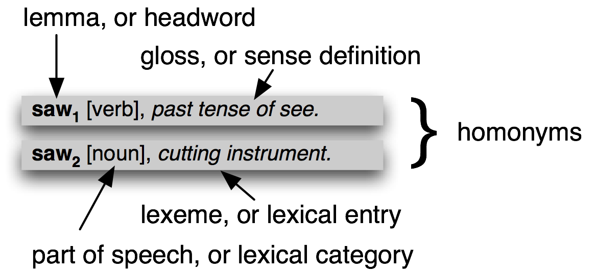

.. -*- mode: rst -*-
.. include:: ../definitions.rst
.. include:: regexp-defns.rst

.. standard global imports

    >>> import nltk, re, pprint

.. TODO: more on regular expressions, including ()
.. TODO: talk about fact that English lexicon is open set (e.g. malware = malicious software)
.. TODO: add section on sentence tokenization (or sentence segmentation), and punkt
.. TODO: add pointers to regexp toolkits (e.g. Kodos)
.. TODO: other issues
   - nltk.corpus.brown.items returns a tuple, not a list (cf discussion in ch 6)
   - invocation of pprint.pprint is a little clunky
   - regexp_tokenize() doesn't work when it is given a compiled pattern
.. TODO: add more graphical plots
.. TODO: material on chatbots
.. TODO: map and reduce
.. FreqDist of CHARACTER BIGRAMS...

.. _chap-words:

======================
3. Processing Raw Text
======================

The most important source of texts is undoubtedly the Web.  Its convenient
to have existing text collections to explore, such as the corpora we saw
in Chapter chap-introduction_.  However, you probably have your own text sources
in mind, and need to learn how to access them.

The goal of this chapter is to answer the following questions:

#. how can we write programs to access text from local files and
   from the web, in order to get hold of an unlimited range of
   language material?
#. how can we split documents up into individual words and
   punctuation symbols, so we can do the same kinds of
   analysis we did with text corpora in earlier chapters?
#. what features of the Python programming language are
   needed to do this?

In order to address these questions, we will be covering
key concepts in NLP, including tokenization and stemming.
Along the way you will consolidate your Python knowledge and
learn about strings, files, and regular expressions.  Since
so much text on the web is in |HTML| format, we will also
see how to dispense with markup.

.. Note:: From this chapter onwards, our program samples will assume you
   begin your interactive session or your program with: ``import nltk, re, pprint``

.. _sec-accessing-text:

-----------------------------------------
Accessing Text from the Web and from Disk
-----------------------------------------

Electronic Books
----------------

A small sample of texts from Project Gutenberg appears in the |NLTK| corpus collection.
However, you may be interested in analyzing other texts from Project Gutenberg.
You can browse the catalog of 25,000 free online books at
``http://www.gutenberg.org/catalog/``, and obtain a URL to an ASCII text file.
Although 90% of the texts in Project Gutenberg are in English, it
includes material in over 50 other languages, including Catalan, Chinese, Dutch,
Finnish, French, German, Italian, Portuguese and Spanish (with more than
100 texts each).

Text number 2554 is an English translation of *Crime and Punishment*,
and we can access it as follows:

    >>> from urllib import urlopen
    >>> url = "http://www.gutenberg.org/files/2554/2554.txt"
    >>> raw = urlopen(url).read()
    >>> type(raw)
    <type 'str'>
    >>> len(raw)
    1176831
    >>> raw[:75]
    'The Project Gutenberg EBook of Crime and Punishment, by Fyodor Dostoevsky\r\n'

.. note:: The read() process will take a few seconds as it downloads this large book.
   If you're using an internet proxy which is not correctly detected by Python,
   you may need to specify the proxy manually as follows:
   
       >>> proxies = {'http': 'http://www.someproxy.com:3128'}
       >>> raw = urllib.urlopen(url, proxies=proxies).read()
   
The variable ``raw`` contains a string with 1,176,831 characters.  This is the raw
content of the book, including many details we are not interested in such as
whitespace, line breaks and blank lines.  Instead, we want to break it up into
words and punctuation, as we saw in Chapter chap-introduction_.  This step is
called `tokenization`:dt:, and it produces our familiar structure, a list of words
and punctuation.  From now on we will call these `tokens`:dt:.

    >>> tokens = nltk.wordpunct_tokenize(raw)
    >>> type(tokens)
    <type 'list'>
    >>> text[:10]
    ['The', 'Project', 'Gutenberg', 'EBook', 'of', 'Crime', 'and', 'Punishment', ',', 'by']
    >>> len(text)
    255809

If we now take the further step of creating an |NLTK| text from this list, we can do
all of the other linguistic processing we saw in Chapter chap-introduction_, along with
the regular list operations like slicing:

    >>> text = nltk.Text(tokens)
    >>> type(text)
    <type 'nltk.text.Text'>
    >>> text[1020:1060]
    ['CHAPTER', 'I', 'On', 'an', 'exceptionally', 'hot', 'evening', 'early', 'in',
    'July', 'a', 'young', 'man', 'came', 'out', 'of', 'the', 'garret', 'in',
    'which', 'he', 'lodged', 'in', 'S', '.', 'Place', 'and', 'walked', 'slowly',
    ',', 'as', 'though', 'in', 'hesitation', ',', 'towards', 'K', '.', 'bridge', '.']
    >>> text.collocations()
    Katerina Ivanovna; Pulcheria Alexandrovna; Avdotya Romanovna; Pyotr
    Petrovitch; Project Gutenberg; Marfa Petrovna; Rodion Romanovitch;
    Sofya Semyonovna; Nikodim Fomitch; did not; Hay Market; Andrey
    Semyonovitch; old woman; Literary Archive; Dmitri Prokofitch; great
    deal; United States; Praskovya Pavlovna; Porfiry Petrovitch; ear rings

Notice that "Project Gutenberg" appears as a collocation in this text.
Each text downloaded from Project Gutenberg contains a header with the
name of the text, the author, the names of people who scanned and
corrected the text, a license, and so on.  Sometimes this information
appears in a footer at the end of the file.  We cannot reliably detect
where the content begins and ends, and so have to resort to manual
inspection of the file, to discover unique strings that mark the beginning
and the end, before trimming ``raw`` to be just the content and nothing else:

    >>> raw.find("PART I")
    5303
    >>> raw.rfind("End of Project Gutenberg's Crime")
    1157681
    >>> raw = raw[5303:1157681]

The "find" and "reverse find" functions help us get the right index values.
Now the raw text begins with "PART I", and goes up to (but not including) the
phrase that marks the end of the content.

This was our first brush with reality: texts found on the web may contain
unwanted material, and there may not be an automatic way to remove it.
With a small amount of extra work we can extract the material we need.

Dealing with HTML
-----------------

A large amount of text on the web is in the form of |HTML| documents.
You can use a web browser to save a page as text to a local
file, then access this as described in the section on files below.
However, if you're going to do this a lot, its easiest to get Python
to do the work directly.  The first step is the same as before,
using ``urlopen``.  For fun we'll pick a BBC News story
called *Blondes to die out in 200 years*, an urban legend
reported as established scientific fact (as noted on ``languagelog.org``).

    >>> url = "http://news.bbc.co.uk/2/hi/health/2284783.stm"
    >>> html = urlopen(url).read()
    >>> html[:60]
    '<!doctype html public "-//W3C//DTD HTML 4.0 Transitional//EN'

You can type ``print html`` to see the |HTML| content in all its glory,
including meta tags, an image map, JavaScript, forms, and tables.

Getting text out of |HTML| is a sufficiently common task that |NLTK| provides
a helper function ``nltk.clean_html()``, which takes an |HTML| string and
returns text.

    >>> raw = nltk.clean_html(html)
    >>> tokens = nltk.wordpunct_tokenize(raw)
    >>> tokens
    ['BBC', 'NEWS', '|', 'Health', '|', 'Blondes', "'", 'to', 'die', 'out', ...]

This still contains lots of unwanted material concerning site navigation and related
stories.  With some trial and error you can find the start and end indexes of the
content and select the tokens of interest, and initialize a text as before.

    >>> tokens = tokens[96:399]
    >>> text = nltk.Text(tokens)
    >>> text.concordance('gene')
     they say too few people now carry the gene for blondes to last beyond the next tw
    t blonde hair is caused by a recessive gene . In order for a child to have blonde 
    to have blonde hair , it must have the gene on both sides of the family in the gra
    there is a disadvantage of having that gene or by chance . They don ' t disappear 
    ondes would disappear is if having the gene was a disadvantage and I do not think 

Processing Google Results
-------------------------

[how to extract google hits]

LanguageLog example for `absolutely`:lx:

.. table:: absolutely

   +-----------------+------------+-------------+-------------+--------------+
   | Google hits     |`adore`:lx: | `love`:lx:  |`like`:lx:   |`prefer`:lx:  |
   +-----------------+------------+-------------+-------------+--------------+
   | `absolutely`:lx:|     289,000|      905,000|       16,200|           644|
   +-----------------+------------+-------------+-------------+--------------+
   | `definitely`:lx:|       1,460|       51,000|      158,000|        62,600|
   +-----------------+------------+-------------+-------------+--------------+
   | ratio           |       198:1|         18:1|         1:10|          1:97|
   +-----------------+------------+-------------+-------------+--------------+

   `Absolutely`:lx: vs `Definitely`:lx: (Liberman 2005, LanguageLog.org)

.. note:: |TRY|
   Foo bar foo bar    Foo bar foo bar    Foo bar foo bar    Foo bar foo bar
   Foo bar foo bar    Foo bar foo bar    Foo bar foo bar    Foo bar foo bar
   Foo bar foo bar    Foo bar foo bar    Foo bar foo bar    Foo bar foo bar

Reading Local Files
-------------------

.. Monkey-patching to fake the file/web examples in this section:

    >>> from StringIO import StringIO
    >>> def fake_open(filename, mode=None):
    ...     return StringIO('Hello World!\nThis is a test file.\n')
    >>> def fake_urlopen(url):
    ...     return StringIO('<!doctype html public "-//W3C//DTD HTML 4.0 Transitional//EN"')
    >>> open = fake_open
    >>> import urllib
    >>> urllib.urlopen = fake_urlopen

It is easy to access local files in Python.  As an exercise, create a
file called ``corpus.txt`` using a text editor, and enter the
following text::

   Time flies like an arrow.
   Fruit flies like a banana.

|nopar| 
Be sure to save the file as plain text. You also need to make sure
that you have saved the file in the same directory or folder in which
you are running the Python interactive interpreter.

.. Note:: If you are using |IDLE|, you can easily create this file by
   selecting the *New Window* command in the *File* menu, typing
   the required text into this window, and then saving the file as
   ``corpus.txt`` in the first directory that |IDLE| offers in the
   pop-up dialogue box.

|nopar| 
The next step is to `open`:dt: a file using the built-in function ``open()``
which has two parameters, the name of the file, here ``corpus.txt``, and the
mode to open the file with (``'r'`` means to open the file for reading,
and ``'U'`` stands for "Universal", which lets us ignore the different
conventions used for marking newlines).

.. doctest-ignore::
    >>> f = open('corpus.txt', 'rU')

.. Note:: If the interpreter cannot find your file, it will give an
   error like this:

   .. doctest-ignore::
      >>> f = open('corpus.txt', 'rU')
      Traceback (most recent call last):
      File "<pyshell#7>", line 1, in -toplevel-
      f = open('corpus.txt', 'rU')
      IOError: [Errno 2] No such file or directory: 'corpus.txt'

   To check that the file that you are trying to open is really in the
   right directory, use |IDLE|\ 's *Open* command in the *File* menu;
   this will display a list of all the files in the directory where
   |IDLE| is running. An alternative is to examine the current
   directory from within Python:

   .. doctest-ignore::
      >>> import os
      >>> os.listdir('.')

|nopar| 
There are several methods for reading the file.
The following uses the method ``read()`` on the file object
``f``; this reads the entire contents of a file into a string.

.. doctest-ignore::
    >>> f.read() 
    'Hello World!\nThis is a test file.\n'

|nopar|
Recall that the ``'\n'`` characters are `newlines`:dt:\ ; this
is equivalent to pressing *Enter* on a keyboard and starting a new line. 
Note that we can open and read a file in one step:

    >>> text = open('corpus.txt', 'rU').read()

|nopar|
We can also read a file one line at a time using the ``for`` loop construct:

    >>> f = open('corpus.txt', 'rU')
    >>> for line in f:
    ...     print line[:-1]
    Hello world!
    This is a test file.

|nopar| 
Here we use the slice ``[:-1]`` to remove the newline character at the end of
the input line.

It is possible to use the methods described above
with ``nltk.data.find()`` method to access and read NLTK's corpus files
directly:

    >>> file = nltk.data.find('corpora/gutenberg/melville-moby_dick.txt')
    >>> raw = open(file, 'rU').read()

Extracting Text from PDF, MSWord and other Binary Formats
---------------------------------------------------------

ASCII text and |HTML| text are human readable formats.  Text often comes in binary
formats |mdash| like PDF and MSWord |mdash| that can only be opened using specialized
software.  Third-party libraries such as ``pypdf`` and ``pywin32`` can be used to access
these formats [appendix section on this?].  For once-off conversion of a few documents,
it is simpler to open the document with a suitable application, then save it as text
to the local drive, and access it as described below.
If the document is already on the web, you can enter its URL in Google's search box.
The search result often includes a link to an |HTML| version of the document,
which you can save as text.  

Getting User Input
------------------

Another source of text is a user interacting with our program.  We can prompt the user
to type a line of input using ``raw_input()``.  We can save that to a variable and
manipulate it just as we have done for other strings.

    >>> s = raw_input("Enter some text: ")
    Enter some text: On an exceptionally hot evening early in July
    >>> print "You typed", len(nltk.wordpunct_tokenize(s)), "words."
    You typed 8 words.

The Processing Pipeline
-----------------------

Figure pipeline1_ summarizes what we have covered in this section, including the process
of building a vocabulary that we saw in Chapter chap-introduction_.  (One step, normalization,
will be discussed later in this chapter.)

[Discuss types of object at each stage of the pipeline; and ``type()``]

.. _pipeline1:
.. figure:: ../images/pipeline1.png
   :scale: 40

   The Processing Pipeline

Integers, strings and lists are all kinds of `data types`:dt: in
Python, and have types ``int``, ``str`` and ``list`` respectively. In
fact, every value in Python has a type. Python's ``type()`` function
will tell you what an object's type is:

    >>> oddments = ['cat', 'cat'.index('a'), 'cat'.split()]
    >>> for e in oddments:
    ...     type(e)
    ... 
    <type 'str'>
    <type 'int'>
    <type 'list'>

The type determines what operations you can perform on the data
value. So, for example, we have seen that we can index strings and
lists, but we can't index integers:

    >>> one = 'cat'
    >>> one[0]
    'c'
    >>> two = [1, 2, 3]
    >>> two[1]
    2
    >>> three = 1234
    >>> three[2]
    Traceback (most recent call last):
    File "<pyshell#95>", line 1, in -toplevel-
    three[2]
    TypeError: 'int' object is unsubscriptable

The fact that this is a problem with types is signalled by the class of
error, i.e., ``TypeError``; an object being "unsubscriptable" means we
can't index into it.

Similarly, we can concatenate strings with strings, and lists with
lists, but we cannot concatenate strings with lists:

    >>> query = 'Who knows?'
    >>> beatles = ['john', 'paul', 'george', 'ringo']
    >>> query + beatles
    Traceback (most recent call last):
      File "<stdin>", line 1, in <module>
    TypeError: cannot concatenate 'str' and 'list' objects

You may also have noticed that our analogy between operations on
strings and numbers works for multiplication and addition, but not
subtraction or division:

    >>> 'very' * 3 
    'veryveryvery'
    >>> 'very' - 'y'
    Traceback (most recent call last):
      File "<stdin>", line 1, in <module>
    TypeError: unsupported operand type(s) for -: 'str' and 'str'
    >>> 6 / 2
    3
    >>> 'very' / 2
    Traceback (most recent call last):
      File "<stdin>", line 1, in <module>
    TypeError: unsupported operand type(s) for /: 'str' and 'int'

These error messages are another example of Python telling us that we
have got our data types in a muddle. In the first case, we are told
that the operation of substraction (i.e., ``-``) cannot apply to
objects of type ``str``, while in the second, we are told that
division cannot take ``str`` and ``int`` as its two operands.

Type conversions: ``str()``, ``int()``, ``list()``.

.. _sec-strings:

-------
Strings
-------

Its time to study a fundamental data type that we've been ignoring
so far.  In earlier chapters we focussed on a text as a list of words.  We didn't
look too closely at words and how they are handled in the programming
language.  By using |NLTK|\ 's corpus interface we were able to ignore
the files that these texts had come from.  The contents of a word, and
of a file, are represented by programming languages as a fundamental
data type known as a `string`:dt:.  In this section we explore strings
in detail, and show the connection between strings, words, texts and files.

Basic Operations with Strings
-----------------------------

    >>> monty = 'Monty Python'
    >>> monty
    'Monty Python'
    >>> circus = 'Monty Python's Flying Circus'
      File "<stdin>", line 1
        circus = 'Monty Python's Flying Circus'
                               ^
    SyntaxError: invalid syntax
    >>> circus = "Monty Python's Flying Circus"
    >>> circus
    "Monty Python's Flying Circus"
     
The ``+`` operation can be used with strings, and is known as `concatenation`:dt:.
It produces a new string that is a copy of the
two original strings pasted together end-to-end.  Notice that
concatenation doesn't do anything clever like insert a space between
the words.  The Python interpreter has no way of knowing that you want
a space; it does `exactly`:em: what it is told.  Given the example
of ``+``, you might be able guess what multiplication will do:

    >>> 'very' + 'very' + 'very'
    'veryveryvery'
    >>> 'very' * 3
    'veryveryvery'

.. Note:: Be careful to distinguish between the string ``' '``, which
   is a single whitespace character, and ``''``, which is the empty string.

Printing Strings
----------------

So far, when we have wanted to look at the contents of a variable or
see the result of a calculation, we have just typed the variable name
into the interpreter.  We can also see the contents of a variable
using the ``print`` statement:

    >>> print monty
    Monty Python

Notice that there are no quotation marks this time.  When we inspect
a variable by typing its name in the interpreter, the interpreter prints
the Python representation of its value.  Since its a string,
the result is quoted.  However, when we tell the
interpreter to print the contents of the variable, we don't see
quotation characters since there are none inside the string.

The ``print`` statement allows us to display more than one item on a line
in various ways, as shown below:

    >>> grail = 'Holy Grail'
    >>> print monty grail
    Monty PythonHoly Grail
    >>> print monty, grail
    Monty Python Holy Grail
    >>> print monty, "and the", grail
    Monty Python and the Holy Grail    
    
Accessing Individual Characters
-------------------------------

As we saw in Section sec-a-closer-look-at-python-texts-as-lists-of-words_ for lists, strings are indexed, starting from zero.
As for lists, if we try to access an index that is outside of the string we get an error:

    >>> monty[0]
    'M'
    >>> monty[3]
    't'
    >>> monty[5]
    ' '
    >>> monty[20]
    Traceback (most recent call last):
      File "<stdin>", line 1, in ?
    IndexError: string index out of range
    >>> monty[-1]
    'n'
    >>> monty[-7]
    ' '

As with lists, we can use negative indexes for strings,
where ``-1`` is the index of the last character.
Using positive and negative indexes, we have two ways to refer to
any position in a string.  In this case, when the string had a length of 12,
indexes ``5`` and ``-7`` both refer to the same character (a space), and:
``5 = len(monty) - 7``.

Accessing Substrings
--------------------

A substring is any continuous section of a string that we want to pull out for
further processing.  We can easily access substrings using the same slice notation
we used for lists.
For example, the following code accesses the substring starting at index ``6``,
up to (but not including) index ``10``:

    >>> monty[6:10]
    'Pyth'

Here we see the characters are ``'P'``, ``'y'``, ``'t'``, and ``'h'`` which correspond
to ``monty[6]`` ... ``monty[9]`` but not ``monty[10]``. This is because
a slice `starts`:em: at the first index but finishes `one before`:em: the end index.

We can also slice with negative indices |mdash| the same basic rule of starting
from the start index and stopping one before the end index applies;
here we stop before the space character.

    >>> monty[0:-7]
    'Monty'

As with list slices, if we omit the first value, the substring begins at the start
of the string.  If we omit the second value, the substring continues to the end
of the string: 

    >>> monty[:5]
    'Monty'
    >>> monty[6:]
    'Python'

We can also find the position of a substring within a string, using ``find()``:

    >>> monty.find('Python')
    6

Iterating over Strings
----------------------

We can write ``for`` loops to iterate over the characters
in strings.  This ``print`` statement ends with a trailing comma, which is
how we tell Python not to print a newline at the end.

    >>> sent = 'colorless green ideas sleep furiously'
    >>> for char in sent:
    ...     print char,
    ... 
    c o l o r l e s s   g r e e n   i d e a s   s l e e p   f u r i o u s l y
    >>>

Analyzing Strings
-----------------

* character frequency plot, e.g get text in some language using ``language_x = nltk.corpus.udhr.raw(x)``,
  then construct its frequency distribution ``fdist = FreqDist(language_x)``, then
  view the distribution with ``fdist.keys()`` and ``fdist.plot()``.

* functions involving strings, e.g. determining past tense

* built-ins, ``find()``, ``rfind()``, ``index()``, ``rindex()``

* revisit string tests like ``endswith()`` from chapter 1

Counting Letters
----------------

We can count individual letters as well.  For each word `w`:math:, we have
to loop over each character contained in the word.  We can do this as follows:

    >>> fdist = FreqDist(char for w in text1 for char in w)
    >>> fdist.samples()
    >>> ['e', 't', 'a', 'o', 'n', 's', 'i', 'h', 'r', 'l', 'd', 'u', 'm', 'c',
        'w', 'g', 'f', ',', 'y', 'p', 'b', 'v', 'k', '.', '-', ';', 'I', '"',
        "'", 'A', 'T', 'S', '!', 'H', 'B', 'W', 'E', 'q', 'N', 'C', 'P', 'x',
        '?', 'O', 'L', 'j', 'R', 'F', 'M', 'D', 'G', 'z', 'Y', 'Q', 'J', 'U',
        ')', '(', ':', 'K', 'V', '1', '0', '2', '8', '5', '7', '3', '*', '4',
        'Z', '6', '9', '_', 'X', '[', ']', '$', '&']

If we're just interested in letter frequencies, we should ignore the case
distinction by normalizing everything to lowercase, and filter out non-alphabetic characters.
Here's how we can do it:

    >>> fdist = FreqDist(char.lower() for w in text1 for char in w if w.isalpha())
    >>> fdist.keys()
    ['e', 't', 'a', 'o', 'n', 'i', 's', 'h', 'r', 'l', 'd', 'u', 'm', 'c', 'w',
    'f', 'g', 'p', 'b', 'y', 'v', 'k', 'q', 'j', 'x', 'z']

This gives us the letters of the alphabet, with the most frequently occurring letters
listed first (this is quite complicated and we'll explain it more carefully below).
You might like to visualize the distribution using ``fdist.plot()``.
The relative character frequencies of a text can be used in automatically identifying
the language of the text.

These methods for operating on every element of a list are surprisingly powerful.
Let's enrich things one more time:

    >>> [char.lower() for w in text1 for char in w if char.isalpha()]
    ['m', 'o', 'b', 'y', 'd', 'i', 'c', 'k', 'b', 'y', 'h', 'e', 'r', 'm', 'a', 'n', ...]
    >>>

For every word in the text, for every character in the word, if the character is
alphabetic, lowercase it.  There's three variables involved here, and we have to
use them correctly or it won't work.  Here's the general template:
``[f(x) for y in z for x in y if g(x)]``.

The Difference between Lists and Strings
----------------------------------------

Strings and lists are both kind of `sequence`:dt:.  We can pull them
apart by indexing and slicing them, and we can join them together
by concatenating them.  However, we cannot join strings and lists:

    >>> query = 'Who knows?'
    >>> beatles = ['John', 'Paul', 'George', 'Ringo']
    >>> query[2]
    'o'
    >>> beatles[2]
    'George'
    >>> query[:2]
    'Wh'
    >>> beatles[:2]
    ['John', 'Paul']
    >>> query + " I don't"
    "Who knows? I don't"
    >>> beatles + 'Brian'
    Traceback (most recent call last):
      File "<stdin>", line 1, in <module>
    TypeError: can only concatenate list (not "str") to list
    >>> beatles + ['Brian']
    ['John', 'Paul', 'George', 'Ringo', 'Brian']

When we open a file
for reading into a Python program, we get a string
corresponding to the contents of the whole file. If we to use a ``for`` loop to
process the elements of this string, all we can pick out are the
individual characters |mdash| we don't get to choose the
granularity. By contrast, the elements of a list can be as big or
small as we like: for example, they could be paragraphs, sentence,
phrases, words, characters. So lists have the advantage that we
can be flexible about the elements they contain, and
correspondingly flexible about any downstream processing.
So one of the first things we are likely to do in a piece of |NLP|
code is tokenize a string into a list of strings (Section sec-tokenization_).
Conversely, when we want to write our results to a file, or to a terminal,
we will usually format them as a string (Section sec-formatting_).

Lists and strings do not have exactly the same functionality.
Lists have the added power that you can change their elements:

    >>> beatles[0] = "John Lennon"
    >>> del beatles[-1]
    >>> beatles
    ['John Lennon', 'Paul', 'George', 'Ringo']

On the other hand if we try to do that with a *string*
|mdash| changing the 0th character in ``query`` to ``'F'`` |mdash| we get:

.. doctest-ignore::
    >>> query[0] = 'F'
    Traceback (most recent call last):
      File "<stdin>", line 1, in ?
    TypeError: object does not support item assignment

|nopar| This is because strings are `immutable`:dt: |mdash| you can't change a
string once you have created it.  However, lists are `mutable`:dt:,
and their contents can be modified at any time.  As a result, lists
support operations that modify the original value rather than producing a new value.

.. _sec-regular-expressions:

-------------------
Regular Expressions
-------------------

We have already noted that a text can be viewed as a string of
characters. What kinds of processing are performed at the character
level?  Perhaps word games are the most familiar example of such
processing.  In completing a crossword we may want to know which
3-letter English words end with the letter ``c`` (e.g.  ``arc``).  We
might want to know how many words can be formed from the letters:
``a``, ``c``, ``e``, ``o``, and ``n`` (e.g. ``ocean``).  We may want
to find out which unique English word contains the substring ``gnt``
(left as an exercise for the reader).  In all these examples, we are
considering which word |mdash| drawn from a large set of candidates |mdash|
matches a given pattern. To put this in a more computational
framework, we could imagine searching through a large digital corpus
in order to find all words that match a particular pattern. There are
many serious uses of this so-called *pattern matching*.

One instructive example is the task of finding all doubled words in a
text; an example would be the string ``for for example``. Notice that
we would be particularly interested in finding cases where the words
were split across a linebreak (in practice, most erroneously doubled
words occur in this context). Consequently, even with such a
relatively banal task, we need to be able to describe patterns which
refer not just to "ordinary" characters, but also to formatting
information.

There are conventions for indicating structure in strings, also known
as *formatting*. For example, there are a number of alternative ways
of formatting a "date string", such as ``23/06/2002``, ``6/23/02``, or
``2002-06-23``.  Whole texts may be formatted, such as an email
message which contains header fields followed by the message
body. Another familiar form of formatting involves visual structure,
such as tabular format and bulleted lists.

Finally, texts may contain explicit "markup", such as
``<abbrev>Phil</abbrev>``, which provides information about the
interpretation or presentation of some piece of text.  To summarize,
in language processing, strings are ubiquitous, and they often contain
important structure.

So far we have seen elementary examples of pattern matching, the
matching of individual characters.  More often we are interested in
matching *sequences* of characters.  For example, part of the
operation of a naive spell-checker could be to remove a word-final
``s`` from a suspect word token, in case the word is a plural, and see
if the putative singular form exists in the dictionary.  For this we
must locate ``s`` and remove it, but only if it precedes a word
boundary.  This requires matching a pattern consisting of two
characters.

Beyond this pattern matching on the *content* of a text, we often want
to process the *formatting* and *markup* of a text.  We may want to
check the formatting of a document (e.g. to ensure that every sentence
begins with a capital letter) or to reformat a document
(e.g. replacing sequences of space characters with a single space).
We may want to find all date strings and extract the year.  We may
want to extract all words contained inside the ``<abbrev> </abbrev>``
markup in order to construct a list of abbreviations.

Processing the content, format and markup of strings is a central task
in most kinds of NLP.  The most widespread method for string
processing uses *regular expressions*.
    
Simple Regular Expressions
--------------------------

In this section we will see the building blocks for simple regular
expressions, along with a selection of linguistic examples. We can
think of a regular expression as *a specialized notation for
describing patterns that we want to match*. In order to make explicit
when we are talking about a pattern *patt*, we will
use the notation |patt|\ . The first thing to say
about regular expressions is that most letters match themselves. For
example, the pattern |l|\ ``sing``\ |r| exactly matches the
string ``sing``.  Here's an example of exact matching:

  >>> r1 = re.compile('aa') 
  >>> wordlist = nltk.corpus.words.words('en')
  >>> [w for w in wordlist if r1.search(w)]
  ['Afrikaans', 'bazaar', 'bazaars', 'Canaan', 'Haag', 'Haas', 'Isaac', 'Isaacs', 'Isaacson', 'Izaak', 'Salaam', 'Transvaal', 'Waals']

In addition, regular expressions provide us with a
set of *special characters* which give us a way to match *sets of
strings*, and we will now look at these.
These "special characters" are often called *meta-characters*; that is,
characters which express properties of (ordinary) characters.

The Wildcard
------------

The "``.``" symbol is called a *wildcard*: it matches any single
character. For example, the regular expression |s.ng| matches the
following English words: ``sang``, ``sing``, ``song``, and
``sung``. Note that |.| will match not only alphabetic characters, but
also numeric and whitespace characters. Consequently, |s.ng| will also
match non-words such as ``s3ng``.

We can also use the wildcard symbol for counting characters. For
instance |....zy| matches six-letter strings that end in ``zy``.  The
pattern |....berry| finds words like ``cranberry``. In our text from
Wall Street Journal below, the pattern |t...| will match the words
``that`` and ``term``, and will also match the word sequence ``to a``
(since the third "``.``" in the pattern can match the space
character)::

  Paragraph 12 from wsj_0034:
  It's probably worth paying a premium for funds that invest in markets
  that are partially closed to foreign investors, such as South Korea,
  some specialists say.  But some European funds recently have
  skyrocketed; Spain Fund has surged to a startling 120% premium.  It has
  been targeted by Japanese investors as a good long-term play tied to
  1992's European economic integration.  And several new funds that aren't
  even fully invested yet have jumped to trade at big premiums.

  "I'm very alarmed to see these rich valuations," says Smith Barney's
  Mr. Porter.

.. Note:: Note that the wildcard matches *exactly* one character, and must be
   repeated for as many characters as should be matched.  To match a
   variable number of characters we must use notation for *optionality*.

We can see exactly where a regular expression matches against a string
using NLTK's ``re_show`` function.  Readers are encouraged to use
``re_show`` to explore the behavior of regular expressions.

    >>> string = """
    ... It's probably worth paying a premium for funds that invest in markets
    ... that are partially closed to foreign investors, such as South Korea, ...
    ... """
    >>> nltk.re_show('t...', string)
    I{t's }probably wor{th p}aying a premium for funds {that} inves{t in} markets
    {that} are par{tial}ly closed {to f}oreign inves{tors}, such as Sou{th K}orea, ...

Optionality and Repeatability
-----------------------------

The "``?``" symbol indicates that the immediately preceding regular
expression is optional.  The regular expression |colou?r| matches both
British and American spellings, ``colour`` and ``color``.  The
expression that precedes the ``?`` may be punctuation, such as an
optional hyphen.  For instance |e-?mail| matches both ``e-mail`` and
``email``.
      
The "``+``" symbol indicates that the immediately preceding expression
is repeatable, up to an arbitrary number of times.  For example, the
regular expression |coo+l| matches ``cool``, ``coool``, and so on.
This symbol is particularly effective when combined with the ``.``
symbol.  For example, |f.+f| matches all strings of length greater
than two, that begin and end with the letter ``f`` (e.g.
``foolproof``).  The expression |.+ed| finds strings that potentially
have the past-tense ``-ed`` suffix.
      
The "``*``" symbol indicates that the immediately preceding expression
is both optional and repeatable. For example |.*gnt.*| matches all
strings that contain ``gnt``.
      
Occasionally we need to match material that spans a line-break.  For
example, we may want to strip out the HTML markup from a document.
To do this we must delete material between angle brackets.
The most obvious expression is: |<.*>|.  However, this has two
problems: it will not match an HTML tag that contains a line-break,
and the |.*| will consume as much material as possible (including the
``>`` character).  To permit matching over a line-break we must use
Python's ``DOTALL`` flag, and to ensure that the ``>`` matches
against the first instance of the character we must do non-greedy
matching using ``*?``:

    >>> text = """one two three four five"""
    >>> re.sub(r'<.*?>', ' ', text, re.DOTALL)

Choices
-------

Patterns using the wildcard symbol are very effective, but there are
many instances where we want to limit the set of characters that the
wildcard can match.  In such cases we can use the ``[]`` notation,
which enumerates the set of characters to be matched - this is called
a *character class*.  For example, we can match any English vowel, but
no consonant, using |[aeiou]|\ . Note that this pattern can be
interpreted as saying "match ``a`` or ``e`` or ... or ``u``"; that
is, the pattern resembles the wildcard in only matching a string of
length one; unlike the wildcard, it restricts the characters matched
to a specific class (in this case, the vowels).  Note that the order
of vowels in the regular expression is insignificant, and we would
have had the same result with the expression |[uoiea]|\ . As a second
example, the expression |p[aeiou]t| matches the words: ``pat``,
``pet``, ``pit``, ``pot``, and ``put``.

We can combine the ``[]`` notation with our notation for
repeatability.  For example, expression |p[aeiou]+t| matches the words
listed above, along with: ``peat``, ``poet``, and ``pout``.

As an example of multi-character choices, suppose that we wanted
to create a program to simplify English prose, replacing rare words
(like ``abode``) with a more frequent, synonymous word (like
``home``).  In this situation, we need to map from a potentially large
set of words to an individual word.  We can match the set of words
using the choice operator.  In the case of the word ``home``, we would
want to match the regular expression |dwelling|domicile|abode|\ .

.. Note:: Note that the choice operator has wide scope, so that |123|456|
   is a choice between ``123`` and ``456``, and not between ``12356`` and
   ``12456``.  The latter choice must be written using parentheses: |12(3|4)56|\ .

Ranges
------

Earlier we saw how the ``[]`` notation could be used to express a set
of choices between individual characters.  Instead of listing each
character, it is also possible to express a *range* of characters,
using the ``-`` operator.  For example, |[a-z]| matches any lowercase
letter.  This allows us to avoid the over-permissive matching we noted
above with the pattern |t...|\ . If we were to use the pattern
|t[a-z][a-z][a-z]|, then we would no longer match the two word
sequence ``to a``.

As expected, ranges can be combined with other operators. For example
|[A-Z][a-z]*| matches words that have an initial capital letter
followed by any number of lowercase letters.  The pattern
|20[0-4][0-9]| matches year expressions in the range 2000 to 2049.
  
Ranges can be combined, e.g.  |[a-zA-Z]| which matches any lowercase
or uppercase letter.  The expression |[b-df-hj-np-tv-z]+| matches
words consisting only of consonants (e.g. ``pygmy``).
  
Complementation
---------------

We just saw that the character class |[b-df-hj-np-tv-z]+| allows us to
match sequences of consonants. However, this expression is quite
cumbersome. A better alternative is to say: let's match anything which
isn't a vowel. To do this, we need a way of expressing
*complementation*.  We do this using the symbol "``^``" as the first
character inside a class expression ``[]``. Let's look at an example.
The regular expression |[^aeiou]| is just like our earlier character
class |[aeiou]|, except now the set of vowels is preceded
by ``^``. The expression as a whole is interpreted as matching
anything which *fails* to match |[aeiou]|\ . In other
words, it matches all lowercase consonants (plus all uppercase letters
and non-alphabetic characters).

As another example, suppose we want to match any string which is
enclosed by the HTML tags for boldface, namely ``<B>`` and ``</B>``.
We might try something like this: |<B>.*</B>|\ . This would
successfully match ``<B>important</B>``, but would also match
``<B>important</B> and <B>urgent</B>``, since the |.*| sub-pattern will
happily match all the characters from the end of ``important`` to the
end of ``urgent``. One way of ensuring that we only look at matched
pairs of tags would be to use the expression |l|\ ``<B>[^<]*</B>``\
|r|\ , where the character class matches anything other than a left
angle bracket.

Finally, note that character class complementation also works with
ranges. Thus |[^a-z]| matches anything other than the lower case
alphabetic characters ``a`` through ``z``.

Common Special Symbols
----------------------

So far, we have only looked at patterns which match with the content
of character strings. However, it is also useful to be able to refer
to formatting properties of texts. Two important symbols in this
regard are "``^``" and "``$``" which are used to *anchor* matches to
the beginnings or ends of lines in a file.

.. Note:: "``^``" has two quite distinct uses: it is interpreted as
   complementation when it occurs as the first symbol within a character
   class, and as matching the beginning of lines when it occurs elsewhere
   in a pattern.

For example, suppose we wanted to find all the words that occur at the
beginning of lines in the WSJ text above. Our first attempt might look
like |^[A-Za-z]+|\ . This says: starting at the beginning of a line,
look for one or more alphabetic characters (upper or lower case),
followed by a space. This will match the words ``that``, ``some``,
``been``, and ``even``. However, it fails to match ``It's``, since
``'`` isn't an alphabetic character. A second attempt might be
|^[^ ]+|\ , which says to match any string starting at the
beginning of a line, followed by one or more characters which are
*not* the space character, followed by a space. This matches all the
previous words, together with ``It's``, ``skyrocketed``, ``1992s``,
``I'm`` and ``"Mr.``. As a second example, |[a-z]*s$| will
match words ending in ``s`` that occur at the end of a line. Finally,
consider the pattern |^$|\ ; this matches strings where no
character occurs between the beginning and the end of a line - in
other words, empty lines!

As we have seen, special characters like "``.``", "``*``", "``+``" and
"``$``" give us powerful means to generalize over character
strings. But suppose we wanted to match against a string which itself
contains one or more special characters? An example would be the
arithmetic statement ``$5.00 * ($3.05 + $0.85)``. In this case, we
need to resort to the so-called *escape* character "``\``"
("backslash"). For example, to match a dollar amount, we might use
|l|\ ``\$[1-9][0-9]*\.[0-9][0-9]``\ |r|\ .  The same goes for matching
other special characters.

.. Advanced Regular Expressions
   zero-width assertions
   more special symbols: \b etc

.. table:: tab-re-symbols:

   ===========  ===================================================================
   Symbol       Function
   ===========  ===================================================================
   ``\b``       Word boundary (zero width)
   ``\d``       Any decimal digit (equivalent to ``[0-9]``)
   ``\D``       Any non-digit character (equivalent to ``[^0-9]``)
   ``\s``       Any whitespace character (equivalent to ``[ \t\n\r\f\v]``
   ``\S``       Any non-whitespace character (equivalent to ``[^ \t\n\r\f\v]``)
   ``\w``       Any alphanumeric character (equivalent to ``[a-zA-Z0-9_]``)
   ``\W``       Any non-alphanumeric character (equivalent to ``[^a-zA-Z0-9_]``)
   ===========  ===================================================================

   Regular Expression Symbols

Merge with previous section
---------------------------

Characters preceded by a ``\``, such as ``'\s'``, have a
special interpretation inside regular expressions; thus, ``'\s'``
matches a whitespace character. We could have used ``' '`` in our
pattern, but ``'\s'`` is better practice in general. One reason is
that the sense of "whitespace" we are using is more general than you
might have imagined; it includes not just inter-word spaces, but also
tabs and newlines. If you try to inspect the variable ``s``, you
might initially get a shock:

.. doctest-ignore::
    >>> s
    "Google Analytics is very very very nice (now)\nBy Jason Hoffman 
    18 August 06\nGoogle
    ...
    >>>

|nopar| You might recall that ``'\n'`` is a special character that corresponds
to a newline in a string. The following example shows how newline is
matched by ``'\s'``.

    >>> s2 = "I'm very very\nvery happy"
    >>> nltk.re_show('very\s', s2)
    I'm {very }{very
    }{very }happy
    >>>

Python Interface
----------------

Suppose now that we want to find all three-letter words ending in the
letter "``c``". Our first attempt might be as follows:

  >>> r1 = re.compile('..c') 
  >>> [w for w in wordlist if r1.match(w)][:10]
  ['accede', 'acceded', 'accedes', 'accelerate', 'accelerated', 'accelerates', 'accelerating', 'acceleration', 'accelerations', 'accelerator']

The problem is that we have matched words containing three-letter
sequences ending in "``c``" which occur *anywhere within a word*. For
example, the pattern will match "``c``" in words like ``aback``,
``Aerobacter`` and ``albacore``.  Instead, we must revise our pattern
so that it is anchored to the beginning and ends of the word: |l|\ ``^...$``\ |r|\ :

  >>> r2 = re.compile('^..c$')
  >>> [w for w in wordlist if r2.match(w)]
  ['arc', 'Doc', 'Lac', 'Mac', 'Vic']

In the section on complementation, we briefly looked at the task of
matching strings which were enclosed by HTML markup. Our first attempt
is illustrated in the following code example, where we incorrectly
match the whole string, rather than just the substring
"``<B>important</B>``".

  >>> html = '<B>important</B> and <B>urgent</B>'
  >>> r2 = re.compile('<B>.*</B>')
  >>> print r2.findall(html)
  ['<B>important</B> and <B>urgent</B>']

As we pointed out, one solution is to use a character class which
matches with the complement of "``<``":

  >>> r4 = re.compile('<B>[^<]*</B>')
  >>> print r4.findall(html)
  ['<B>important</B>', '<B>urgent</B>']

However, there is another way of approaching this problem.
|<B>.*</B>| gets the wrong results because the
|*| operator tries to consume as much input as
possible. That is, the matching is said to be *greedy*. In the current
case, |*| matches everything after the first
``<B>``, including the following ``</B>`` and ``<B>``.  If we instead
use the non-greedy star operator |*?|\ , we get the
desired match, since |*?| tries to consume as little input as possible.

.. _sec-tokenization:

---------------------------------
Tokenization: From Files to Texts
---------------------------------

Consider the following code, which splits a string into a list of words: 

    >>> sentence = "This is the time -- and this is the record of the time."
    >>> words = sentence.split()
    >>> words
    ['This', 'is', 'the', 'time', '--', 'and', 'this', 'is', 'the', 'record', 'of', 'the', 'time.']
    >>> len(words)
    13
    >>> len(set(words))
    10

|nopar| This process of segmenting a string of characters into words
is known as `tokenization`:dt:. Tokenization is a prelude to pretty
much everything else we do in |NLP|, since it tells our
processing software what our basic units are. We will discuss
tokenization in more detail shortly.

Tokens vs Types
---------------

If we ask how many words there are in ``sentence``, we get
different answers depending on whether we count duplicates. 
Clearly we are using different senses of "word" here.
A word `token`:dt: is an individual occurrence
of a word in a concrete context; it exists in time and space.  A word
`type`:dt: is a more abstract; it's what we're talking about when we
say that the three occurrences of ``the`` in ``sentence`` are  "the same word."
As it happens, Python can tell us if two strings are the same token or not:

    >>> words[2]
    'the'
    >>> words[2] == words[8]
    True
    >>> words[2] is words[8]
    False
    >>> words[2] is words[2]
    True

The operator ``==`` tests whether two expressions are equal, and in
this case, it is testing for string-identity. This is the notion of
identity that was assumed by our use of ``set()`` above. By contrast, the
``is`` operator tests whether two objects are stored in the same
location of memory, and is therefore analogous to token-identity.  
When we used ``split()`` to turn a string into a list of words,
our tokenization method was to say that any strings that
are delimited by whitespace count as a word token. But this simple
approach doesn't always give the desired results.
Also, testing string-identity isn't a very useful criterion for
assigning tokens to types. We therefore need to address two questions
in more detail:
*Tokenization:* Which substrings of the original text should be treated as word tokens?
*Type definition:* How do we decide whether two tokens have the same type?

To see the problems with our first stab at defining tokens and types
in ``sentence``, let's look at the actual tokens we found:

    >>> set(words)
    set(['and', 'this', 'record', 'This', 'of', 'is', '--', 'time.', 'time', 'the'])

|nopar|
Observe that ``'time'`` and ``'time.'`` are incorrectly
treated as distinct types since the trailing period
has been bundled with the rest of the word.
Although ``'--'`` is some kind of token, it's not a `word`:em: token.
Additionally, ``'This'`` and ``'this'`` are incorrectly distinguished
from each other, because of a difference in capitalization that should
be ignored.

If we turn to languages other than English, tokenizing text is even more
challenging.  In Chinese text there is no visual representation of word
boundaries.  Consider the following
three-character string: |ai4|\ |guo3|\ |ren2| (in pinyin plus tones:
ai4 "love" (verb), guo3 "country", ren2 "person"). This could
either be segmented as [|ai4|\ |guo3|]\ |ren2|\ ,
"country-loving person" or as |ai4|\ [|guo3|\ |ren2|]\ ,
"love country-person."

The terms *token* and *type* can also be applied to other linguistic
entities.  For example, a `sentence token`:dt: is an individual
occurrence of a sentence; but a `sentence type`:dt: is an abstract
sentence, without context. If I say the same sentence twice, I have
uttered two sentence tokens but only used one sentence type.  When the kind
of token or type is obvious from context, we will simply use the terms
token and type.

To summarize, we cannot just say that two word tokens have the same type if they are
the same string of characters.  We need to
consider a variety of factors in determining what counts as
the same word, and we need to be careful in how we
identify tokens in the first place.

NLTK Tokenizers
---------------

Tokenization based solely on whitespace is too simplistic for most applications...

NLTK's tokenizers: wordpunct, ...

Tokenization with Regular Expressions
-------------------------------------

Tokenization is the task of cutting a string into
identifiable linguistic units that constitute a piece of language data. In our first attempt to
carry out this task, we started off with a string of characters, and
used the ``split()`` method to break the string at whitespace
characters (including tabs and newlines).
In this section we will take a more sophisticated approach, using
regular expressions to specify which character sequences should be
treated as words.

Let's begin by splitting the string on whitespace (this includes tabs and newline)

    >>> re.split(r'\s', sentence)
    ['This', 'is', 'the', 'time', '--', 'and', 'this', 'is', 'the', 'record', 'of', 'the', 'time.']

[need a better example of tokenization problems, including "don't".

The above method includes sentence-ending punctuation with a word...  What happens when we use the
'\W' operator to consume these?

    >>> re.split(r'\W', sentence)
    ['This', 'is', 'the', 'time', '', '', '', 'and', 'this', 'is', 'the', 'record', 'of', 'the', 'time', '']

Also gives us empty strings (explain why).

    >>> re.findall('\w+', sentence)
    ['This', 'is', 'the', 'time', 'and', 'this', 'is', 'the', 'record', 'of', 'the', 'time']
    >>> re.findall('\w+|\S+', sentence)
    ['This', 'is', 'the', 'time', '--', 'and', 'this', 'is', 'the', 'record', 'of', 'the', 'time', '.']

Merge with previous section
---------------------------

Python's ``re.findall(``\ `patt`:ph:, `s`:ph:\ ``)`` function is a useful
way to find all the substrings in `s`:ph: that are matched by `patt`:ph:.
Before illustrating, let's introduce  two further
special characters, ``'\d'`` and ``'\w'``: the first
will match any digit, and the second will match any alphanumeric character.
Before we can use ``re.findall()`` we have to load Python's regular
expression module, using ``import re``.

    >>> import re
    >>> re.findall('\d\d', s)
    ['18', '06', '10']
    >>> re.findall('\s\w\w\w\s', s)
    [' the ', ' the ', ' its\n', ' the ', ' and ', ' you ']
    >>> 

|nopar| As you will see, the second example matches three-letter
words. However, this regular expression is not quite what we
want. First, the leading and trailing spaces are extraneous. Second,
it will fail to match against strings such as ``'the San'``, where two
three-letter words are adjacent. To solve this problem, we can use
another special character, namely ``'\b'``. This is sometimes called a
"zero-width" character; it matches against the empty string, but only
at the beginning and end of words:

    >>> re.findall(r'\b\w\w\w\b', s)
    ['now', 'the', 'the', 'San', 'its', 'the', 'ago', 'and', 'you']

.. Note:: This example uses a Python `raw string`:dt:\:
   ``r'\b\w\w\w\b'``. The specific justification here is that in an
   ordinary string, ``\b`` is interpreted as a backspace character.
   Python will convert it to a backspace in a regular expression
   unless you use the ``r`` prefix to create a raw string as shown
   above. Another use for raw strings is to match strings that
   include backslashes. Suppose we want to match 'either\\or'. In order
   to create a regular expression, the backslash needs to be escaped,
   since it is a special character; 
   so we want to pass the pattern ``\\`` to the regular expression
   interpreter. But to express this as a Python string literal, each
   backslash must be escaped again, yielding the string
   ``'\\\\'``. However, with a raw string, this reduces down to
   ``r'\\'``. 

Returning to the case of repeated words, we might want to look for
cases involving ``'very'`` or ``'really'``, and for this we use the
disjunction operator ``|``.

    >>> nltk.re_show('((very|really)\s)+', s)
    Google Analytics is {very very very }nice (now)
    By Jason Hoffman 18 August 06
    Google Analytics, the result of Google's acquisition of the San
    Diego-based Urchin Software Corporation, {really really }opened its
    doors to the world a couple of days ago, and it allows you to
    track up to 10 sites within a single google account.
    >>>

In addition to the matches just illustrated, the regular expression
``'((very|really)\s)+'`` will also match cases where the two disjuncts
occur with each other, such as the string ``'really very really '``.

NLTK's Regular Expression Tokenizer
-----------------------------------

The function ``nltk.tokenize.regexp_tokenize()`` takes a text string and a
regular expression, and returns the list of substrings that match the
regular expression.  To define a tokenizer that includes punctuation
as separate tokens, we could do the following:

    >>> text = '''Hello.  Isn't this fun?'''
    >>> pattern = r'\w+|[^\w\s]+'
    >>> nltk.tokenize.regexp_tokenize(text, pattern)
    ['Hello', '.', 'Isn', "'", 't', 'this', 'fun', '?']

|nopar| 
The regular expression in this example will match a sequence
consisting of one or more word characters ``\w+``.  It will also match
a sequence consisting of one or more punctuation characters (or
non-word, non-space characters ``[^\w\s]+``).  This is another negated range
expression; it matches one or more characters that are not word
characters (i.e., not a match for ``\w``) and not a whitespace
character (i.e., not a match for ``\s``).  We use the disjunction
operator ``|`` to combine these into a single complex expression
``\w+|[^\w\s]+``.

There are a number of ways we could improve on this regular
expression.  For example, it currently breaks `$22.50`:lx: into four
tokens; we might want it to treat this as a single token.
Similarly, `U.S.A.` should count as a single token.  We can
deal with these by adding further cases to the regular
expression.  For readability we will break it up and insert comments, and
insert the special ``(?x)`` "verbose flag" so that Python knows
to strip out the embedded whitespace and comments.

    >>> text = 'That poster costs $22.40.'
    >>> pattern = r'''(?x)
    ...     \w+               # sequences of 'word' characters
    ...   | \$?\d+(\.\d+)?    # currency amounts, e.g. $12.50
    ...   | ([A-Z]\.)+        # abbreviations, e.g. U.S.A.
    ...   | [^\w\s]+          # sequences of punctuation
    ... '''
    >>> nltk.tokenize.regexp_tokenize(text, pattern)
    ['That', 'poster', 'costs', '$22.40', '.']

It is sometimes more convenient to write a regular expression
matching the material that appears *between* tokens, such as whitespace
and punctuation.  The ``nltk.tokenize.regexp_tokenize()`` function permits
an optional boolean parameter ``gaps``; when set to ``True`` the
pattern is matched against the gaps.  For example, we could define
a whitespace tokenizer as follows:

    >>> nltk.tokenize.regexp_tokenize(text, pattern=r'\s+', gaps=True)
    ['That', 'poster', 'costs', '$22.40.']

It is more convenient to call |NLTK|\ 's whitespace
tokenizer directly, as ``nltk.WhitespaceTokenizer(text)``.
(However, in this case is generally better to use Python's ``split()``
method, defined on strings: ``text.split()``.)

------------------------------------------------------
More Powerful Regular Expression Processing (Optional)
------------------------------------------------------

Substitutions
-------------

Let's now look at how to perform substitutions, using the ``re.sub()``
function.  In the first instance we replace
all instances of ``l`` with ``s``.  Note that this generates a string
as output, and doesn't modify the original string.  Then we replace
any instances of ``green`` with ``red``.

    >>> sent = "colorless green ideas sleep furiously"
    >>> re.sub('l', 's', sent)
    'cosorsess green ideas sseep furioussy'
    >>> re.sub('green', 'red', sent)
    'colorless red ideas sleep furiously'
    >>>

We can also disjoin individual characters using a square bracket
notation.  For example, ``[aeiou]`` matches any of ``a``, ``e``,
``i``, ``o``, or ``u``, that is, any vowel.  The expression
``[^aeiou]`` matches any single character that is `not`:em: a vowel.
In the following example, we match sequences consisting of a non-vowel
followed by a vowel.

    >>> nltk.re_show('[^aeiou][aeiou]', sent)
    {co}{lo}r{le}ss g{re}en{ i}{de}as s{le}ep {fu}{ri}ously
    >>>

|nopar|
Using the same regular expression, the function ``re.findall()``
returns a list of all the substrings in ``sent`` that are matched:

    >>> re.findall('[^aeiou][aeiou]', sent)
    ['co', 'lo', 'le', 're', ' i', 'de', 'le', 'fu', 'ri']
    >>>

Groupings
---------

Returning briefly to our earlier problem with unwanted whitespace
around three-letter words, we note that ``re.findall()`` behaves
slightly differently if we create `groups`:dt: in the regular
expression using parentheses; it only returns strings that occur
within the groups:

    >>> re.findall('\s(\w\w\w)\s', s)
    ['the', 'the', 'its', 'the', 'and', 'you']
    >>>

|nopar|
The same device allows us to select only the non-vowel characters
that appear before a vowel:

    >>> re.findall('([^aeiou])[aeiou]', sent)
    ['c', 'l', 'l', 'r', ' ', 'd', 'l', 'f', 'r']
    >>>

By delimiting a second group in the regular expression, we can even
generate pairs (or `tuples`:dt:) that we may then go on and
tabulate.

    >>> re.findall('([^aeiou])([aeiou])', sent)
    [('c', 'o'), ('l', 'o'), ('l', 'e'), ('r', 'e'), (' ', 'i'),
    ('d', 'e'), ('l', 'e'), ('f', 'u'), ('r', 'i')]
    >>>

Our next example also makes use of groups. One further special
character is the so-called wildcard element, ``'.'``; this has the
distinction of matching any single character (except ``'\n'``). Given
the string ``s3``, our task is to pick out login names and email domains:

    >>> s3 = """
    ... <hart@vmd.cso.uiuc.edu>
    ... Final editing was done by Martin Ward <Martin.Ward@uk.ac.durham>
    ... Michael S. Hart <hart@pobox.com>
    ... Prepared by David Price, email <ccx074@coventry.ac.uk>"""

The task is made much easier by the fact that all the email addresses
in the example are delimited by angle brackets, and we can exploit
this feature in our regular expression:

    >>> re.findall(r'<(.+)@(.+)>', s3)
    [('hart', 'vmd.cso.uiuc.edu'), ('Martin.Ward', 'uk.ac.durham'), 
    ('hart', 'pobox.com'), ('ccx074', 'coventry.ac.uk')]
    >>>

|nopar|
Since ``'.'`` matches any single character, ``'.+'`` will match any
non-empty `string`:em: of characters, including punctuation symbols
such as the period.  

One question that might occur to you is how do
we specify a match against a period? The answer is that we have to
place a ``'\'`` immediately before the ``'.'`` in order to escape its
special interpretation.

    >>> re.findall(r'(\w+\.)', s3)
    ['vmd.', 'cso.', 'uiuc.', 'Martin.', 'uk.', 'ac.', 'S.', 
    'pobox.', 'coventry.', 'ac.']
    >>>

Now, let's suppose that we wanted to match occurrences of both
``'Google'`` and ``'google'`` in our sample text. If you have been
following up till now, you would reasonably expect that this regular
expression with a disjunction would do the trick:
``'(G|g)oogle'``. But look what happens when we try this with
``re.findall()``:

    >>> re.findall('(G|g)oogle', s)
    ['G', 'G', 'G', 'g']
    >>> 

|nopar|
What is going wrong? We innocently used
the parentheses to indicate the scope of the operator ``'|'``, but
``re.findall()`` has interpreted them as marking a group. In order to
tell ``re.findall()``  "don't try to do anything special with these
parentheses", we need an extra piece of notation:

    >>> re.findall('(?:G|g)oogle', s)
    ['Google', 'Google', 'Google', 'google']
    >>> 

|nopar|
Placing ``'?:'`` immediately after the opening parenthesis makes it
explicit that the parentheses are just being used for scoping.

Practice Makes Perfect
----------------------

Regular expressions are very flexible and very powerful. However, they
often don't do what you expect. For this reason, you are strongly
encouraged to try out a variety of tasks using ``re_show()`` and
``re.findall()`` in order to develop your intuitions further; the
exercises below should help get you started.  We suggest that you build up a
regular expression in small pieces, rather than trying to get it
completely right first time.  Table regexp-operators_ lists some operators
and sequences that are commonly used in natural language processing.

.. table:: regexp-operators

   ===========  ====================================================================
   Operator     Behavior
   ===========  ====================================================================
   ``*``        Zero or more, e.g. ``a*``, ``[a-z]*``
   ``+``        One or more, e.g. ``a+``, ``[a-z]+``
   ``?``        Zero or one (i.e. optional), e.g. ``a?``, ``[a-z]?``
   ``[..]``     A set or range of characters, e.g. ``[aeiou]``, ``[a-z0-9]``
   ``(..)``     Grouping parentheses, e.g. ``(the|a|an)``
   ``\d``       Any decimal digit (``\D`` is any non-digit)
   ``\s``       Any whitespace character (``\S`` is any non-whitespace character)
   ``\w``       Any alphanumeric character (``\W`` is any non-alphanumeric character)
   ``\t``       The tab character
   ``\n``       The newline character
   ===========  ====================================================================

   Commonly-used Operators and Sequences

Stripping HTML with Regular Expressions
---------------------------------------

Web pages are usually in |HTML| format.  To extract the text, we
need to strip out the |HTML| markup, i.e. remove all material enclosed in
angle brackets. Let's digress briefly to consider how to carry out
this task using regular expressions. Our first attempt might look as
follows:

    >>> line = '<title>BBC NEWS | News Front Page</title>'
    >>> new = re.sub(r'<.*>', '', line)

So the regular expression ``'<.*>'`` is intended to match a
pair of left and right angle brackets, with a string of any characters
intervening. However, look at what the result is:

    >>> new
    '' 

|nopar| 
What has happened here? The problem is twofold. First,
the wildcard ``'.'`` matches any character other than ``'\n'``,
so it will match ``'>'`` and ``'<'``.
Second, the ``'*'`` operator is "greedy", in the sense that it matches
as many characters as it can. In the above example,
``'.*'`` will return not the shortest match, namely
``'title'``, but the longest match, ``'title>BBC NEWS | News Front
Page</title'``.   To get the *shortest* match we have to use the ``'*?'`` operator.
We will also normalize whitespace, replacing any sequence
of spaces, tabs or newlines (``'\s+'``) with a single space character.

    >>> page = re.sub('<.*?>', '', page)
    >>> page = re.sub('\s+', ' ', page)
    >>> print page[:60]
     BBC NEWS | News Front Page News Sport Weather World Service

.. Note:: Note that your output for the above code may differ from ours,
   because the BBC home page may have been changed since this
   example was created.

.. TODO: fix above example?  (make it current; issue with script on BBC site)

You will probably find it useful to borrow the structure of the above code
snippet for future tasks involving regular expressions: each time
through a series of substitutions, the result of operating on ``page``
gets assigned as the new value of ``page``. This approach allows us to
decompose the transformations we need into a series of simple regular
expression substitutions, each of which can be tested and debugged on its own.

Sentence Segmentation
---------------------

Manipulating texts at the level of individual words often presupposes
the ability to divide a text into individual sentences.  As we have
seen, some corpora already provide access at the sentence level.  In
the following example, we compute the average number of words per
sentence in the Brown Corpus:

    >>> len(nltk.corpus.brown.words()) / len(nltk.corpus.brown.sents())
    20

In other cases, the text is only available as a stream of characters.  Before
doing word tokenization, we need to do sentence segmentation.  NLTK facilitates
this by including the Punkt sentence segmenter [KissStrunk2006]_, along with
supporting data for English.  Here is an example of its use in segmenting
the text of a novel:

    >>> sent_tokenizer=nltk.data.load('tokenizers/punkt/english.pickle')
    >>> text = nltk.corpus.gutenberg.raw('chesterton-thursday.txt')
    >>> sents = sent_tokenizer.tokenize(text)
    >>> pprint(sents[171:181])
    ['"Nonsense!',
     '" said Gregory, who was very rational when anyone else\nattempted paradox.',
     '"Why do all the clerks and navvies in the\nrailway trains look so sad and tired, so very sad and tired?',
     'I will\ntell you.',
     'It is because they know that the train is going right.',
     'It\nis because they know that whatever place they have taken a ticket\nfor that place they will reach.',
     'It is because after they have\npassed Sloane Square they know that the next station must be\nVictoria, and nothing but Victoria.',
     'Oh, their wild rapture!',
     'oh,\ntheir eyes like stars and their souls again in Eden, if the next\nstation were unaccountably Baker Street!'
     '"\n\n"It is you who are unpoetical," replied the poet Syme.']

Notice that this example is really a single sentence, reporting the speech of Mr Lucian Gregory.
However, the quoted speech contains several sentences, and these have been split into individual
strings.  This is reasonable behavior for most applications.

-------------------------------
Lemmatization and Normalization
-------------------------------

Earlier we talked about counting word tokens, and completely ignored
the rest of the sentence in which these tokens appeared.  Thus, for an
example like `I saw the saw`:lx:, we would have treated both `saw`:lx:
tokens as instances of the same type.  However, one is a form of the
verb `see`:lx:, and the other is the name of a cutting instrument.
How do we know that these two forms of `saw`:lx: are unrelated?  One
answer is that as speakers of English, we know that these would appear
as different entries in a dictionary. Another, more empiricist, answer
is that if we looked at a large enough number of texts, it would
become clear that the two forms have very different distributions. For
example, only the noun `saw`:lx: will occur immediately after
determiners such as `the`:lx:.  Distinct words that have the same
written form are called `homographs`:dt:. We can distinguish
homographs with the help of context; often the previous word suffices.
We will explore this idea of context briefly, before addressing the
main topic of this section.

As a first approximation to discovering the distribution of a word, we
can look at all the bigrams it occurs in.
A `bigram`:dt: is simply a pair of words.
For example, in the sentence `She sells sea shells by the sea shore`:lx:,
the bigrams are
`She sells`:lx:,
`sells sea`:lx:,
`sea shells`:lx:,
`shells by`:lx:,
`by the`:lx:,
`the sea`:lx:,
`sea shore`:lx:.
Let's consider all bigrams from the Brown Corpus that have the
word `often`:lx: as first element.
Here is a small selection, ordered by their counts::

    often ,     16
    often a     10
    often in        8
    often than      7
    often the       7
    often been      6
    often do        5
    often called    4
    often appear    3
    often were      3
    often appeared  2
    often are       2
    often did       2
    often is        2
    often appears   1
    often call      1

|nopar|
In the topmost entry, we see that `often`:lx: is frequently followed
by a comma.  This suggests that `often`:lx: is common at the end of
phrases. We also see that `often`:lx: precedes verbs, presumably as an
adverbial modifier.  We might conclude that when `saw`:lx:
appears in the context `often saw`:lx:, then `saw`:lx: is being used
as a verb.

You will also see that this list includes different grammatical forms
of the same verb. We can form separate groups consisting of
`appear`:lx: |tilde| `appears`:lx: |tilde| `appeared`:lx:; `call`:lx:
|tilde| `called`:lx:; `do`:lx: |tilde| `did`:lx:; and `been`:lx:
|tilde| `were`:lx: |tilde| `are`:lx: |tilde| `is`:lx:.  It is common
in linguistics to say that two forms such as `appear`:lx: and
`appeared`:lx: belong to a more abstract notion of a word called a
`lexeme`:dt:; by contrast, `appeared`:lx: and `called`:lx: belong to
different lexemes. You can think of a lexeme as corresponding to an
entry in a dictionary, and a `lemma`:dt: as the headword for that entry.
By convention, small capitals are used when referring to a lexeme or lemma: `appear`:lex:.

Although `appeared`:lx: and `called`:lx: belong to different lexemes,
they do have something in common: they are both past tense forms. This
is signaled by the segment `-ed`:lx:, which we call a morphological
`suffix`:dt:. We also say that such morphologically complex forms are
`inflected`:dt:.  If we strip off the suffix, we get something called
the `stem`:dt:, namely `appear`:lx: and `call`:lx: respectively. While
`appeared`:lx:, `appears`:lx: and `appearing`:lx: are all
morphologically inflected, `appear`:lx: lacks any morphological
inflection and is therefore termed the `base`:dt: form. In English,
the base form is conventionally used as the `lemma`:dt: for a word.

Our notion of context would be more compact if we could group
different forms of the various verbs into their lemmas; then we could
study which verb lexemes are typically modified by a particular
adverb. `Lemmatization`:dt: |mdash| the process of mapping words
to their lemmas |mdash| would yield the
following picture of the distribution of `often`:lx:.
Here, the counts for `often appear`:lx: (3),
`often appeared`:lx: (2) and `often appears`:lx: (1)
are combined into a single line.

::

    often ,     16
    often a     10
    often be        13
    often in        8
    often than      7
    often the       7
    often do        7
    often appear    6
    often call      5

Lemmatization is a rather sophisticated process that uses rules
for the regular word patterns, and table look-up for
the irregular patterns. Within |NLTK|, we can use off-the-shelf
stemmers, such as the `Porter Stemmer`:dt:, the `Lancaster Stemmer`:dt:,
and the stemmer that comes with WordNet, e.g.:

    >>> stemmer = nltk.PorterStemmer()
    >>> verbs = ['appears', 'appear', 'appeared', 'calling', 'called']
    >>> stems = [stemmer.stem(verb) for verb in verbs]
    >>> sorted(set(stems))
    ['appear', 'call']

Stemmers for other languages are added to NLTK as they are contributed,
e.g. the RSLP Portuguese Stemmer, ``nltk.RSLPStemmer()``.

Lemmatization and stemming are special cases of `normalization`:dt:.
They identify a canonical representative for a set of related word forms.
Normalization collapses distinctions.  Exactly how we normalize words depends
on the application.  Often, we convert everything into lower
case so that we can ignore the written distinction between sentence-initial
words and the rest of the words in the sentence.
The Python string method ``lower()`` will accomplish this for us:

    >>> str = 'This is the time'
    >>> str.lower()
    'this is the time'

.. We need to be careful, however; case normalization will also collapse the `New`:lx:
   of `New York`:lx: with the `new`:lx: of `my new car`:lx:.
   [SB: this mixes the issue with named entity detection, and should probably
   be left to the engineering chapter]

A final issue for normalization is the presence of contractions, such
as `didn't`:lx:.  If we are analyzing the meaning
of a sentence, it would probably be more useful to normalize this
form to two separate forms: `did`:lx: and `n't`:lx: (or `not`:lx:).

More Examples
-------------

Lemmatization and normalization involve applying the same operation to
each word token in a text.  `List comprehensions`:dt: are a convenient
Python construct for doing this.  Here we lowercase each word:

    >>> sent = ['The', 'dog', 'gave', 'John', 'the', 'newspaper']
    >>> [word.lower() for word in sent]
    ['the', 'dog', 'gave', 'john', 'the', 'newspaper']

List comprehensions can constrain the items they include.  In the next
example we remove some non-content words from a list of words:

    >>> def is_lexical(word):
    ...     return word.lower() not in ('a', 'an', 'the', 'that', 'to')
    >>> [word for word in sent if is_lexical(word)]
    ['dog', 'gave', 'John', 'newspaper']

|nopar|
Now we can combine the two ideas (constraints and normalization),
to pull out the content words and normalize them.

    >>> [word.lower() for word in sent if is_lexical(word)]
    ['dog', 'gave', 'john', 'newspaper']

List comprehensions can build nested structures too.  For example,
the following code builds a list of tuples, where each tuple consists
of a word and its stem.

    >>> sent = nltk.corpus.brown.sents(categories='news')[0]
    >>> [(x, stemmer.stem(x).lower()) for x in sent]
    [('The', 'the'), ('Fulton', 'fulton'), ('County', 'counti'),
    ('Grand', 'grand'), ('Jury', 'juri'), ('said', 'said'), ('Friday', 'friday'),
    ('an', 'an'), ('investigation', 'investig'), ('of', 'of'),
    ("Atlanta's", "atlanta'"), ('recent', 'recent'), ('primary', 'primari'),
    ('election', 'elect'), ('produced', 'produc'), ('``', '``'), ('no', 'no'),
    ('evidence', 'evid'), ("''", "''"), ('that', 'that'), ('any', 'ani'),
    ('irregularities', 'irregular'), ('took', 'took'), ('place', 'place'), ('.', '.')]

The Lexicon
-----------

* words are more than just the output of tokenization
* explore what it means for a document to contain a word
* ways this can fail: mis-spelling; different endings; synonyms; homonyms
* type vs token distinction; connection of types to lemmas
* concept of "word", many-to-many mapping between forms and meanings
* why the lexicon is an open set, lexical productivity and challenge for NLP
* morphology

.. _fig-lexicon:

   
   Lexicon Terminology

String Similarity
-----------------

* spelling correction (a kind of normalization)
* stemming (``nltk.stem``)
* Soundex -- indexing strings in a dictionary (key = soundex code; value = list of words)
* anagrams -- key = sorted letters of word; value = list of words with these letters

Semantic Similarity
-------------------

.. TODO: discuss WSD, mention Semcor, give pine cone example

.. It is often useful to be able to tell whether two lexical concepts are
   `semantically related`:dt:. For example, in order to check whether a
   particular instance of the word `bank`:lx: means
   *financial institution*, we can count the number of nearby words
   that are semantically related to this sense.  Using WordNet, we can
   investigate whether semantic relatedness can be
   expressed in terms of the graph structure of the concept hierarchy. 

We would expect that the semantic similarity of two concepts
would correlate with the length of the path between them in WordNet.
The ``wordnet`` package includes a variety of measures
that incorporate this basic insight.  For example,
``path_similarity`` assigns a score in the range ``0``\ |ndash|\
``1``, based on the shortest path that connects the concepts in the hypernym
hierarchy (``-1`` is returned in those cases where a path cannot be
found).  A score of 1 represents identity, i.e., comparing a sense with
itself will return ``1``.

    >>> wordnet.N['poodle'][0].path_similarity(wordnet.N['dalmatian'][1])
    0.33333333333333331
    >>> wordnet.N['dog'][0].path_similarity(wordnet.N['cat'][0])
    0.20000000000000001
    >>> wordnet.V['run'][0].path_similarity(wordnet.V['walk'][0])
    0.25
    >>> wordnet.V['run'][0].path_similarity(wordnet.V['think'][0])
    -1

Several other similarity measures are provided in ``wordnet``:
Leacock-Chodorow, Wu-Palmer, Resnik, Jiang-Conrath, and Lin.
For a detailed comparison of various measures, see [Budanitsky2006EWB]_.

Indexing Texts
--------------

(Discussion of the use of normalization in indexing a text collection; better concordancing)

.. soundex concordancing, wordnet concordancing

.. _sec-formatting:

---------------------------------
Formatting: From Lists to Strings
---------------------------------

Converting Between Strings and Lists
------------------------------------

... use the ``join()`` method...

``join()`` only works on a list of strings (what we have been calling a text).
(Thus we could say this type is privileged in Python.)

We specify the string to be used as the "glue", followed by a
period, followed by the ``join()`` function.

    >>> ' '.join(chomsky)
    'colorless green ideas sleep furiously'
    >>> ';'.join(chomsky)
    'colorless;green;ideas;sleep;furiously'

So ``' '.join(chomsky)`` means: take all the items in ``chomsky`` and
concatenate them as one big string, using ``' '`` as a spacer between
the items. 

To be honest, many people find the notation for ``join()`` rather
unintuitive. 

.. Note::
   Move Elsewhere:
   We will see other examples of statements with ``import`` later in this
   chapter.  In general, we use ``import`` statements when we want to get
   access to Python code that doesn't already come as part of core
   Python. This code will exist somewhere as one or more files. Each such
   file corresponds to a Python `module`:dt: |mdash| this is a way of
   grouping together code and data that we regard as reusable. When you
   write down some Python statements in a file, you are in effect
   creating a new Python module. And you can make your code depend on
   another module by using the ``import`` statement. In our example
   earlier, we imported the module ``string`` and then used the
   ``join()`` function from that module. By adding ``string.`` to the
   beginning of ``join()``, we make it clear to the Python interpreter
   that the definition of ``join()`` is given in the ``string``
   module. An alternative, and equally valid, approach is to use the
   ``from`` *module* ``import`` *identifier* statement, as shown in the
   next example:

    >>> from string import join
    >>> join(chomsky)
    'colorless green ideas sleep furiously'  
    >>>

In this case, the name ``join`` is added to all the other identifier that we
have defined in the body of our programme, and we can use it to call a
function like any other.

.. Note:: If you are creating a file to contain some of your Python
   code, do *not* name your file ``nltk.py``: it may get imported in
   place of the "real" NLTK package. (When it imports modules, Python
   first looks in the current folder / directory.)

Formatting Output
-----------------

The output of a program is usually structured to make the information
easily digestible by a reader.  Instead of running some code and then
manually inspecting the contents of a variable, we would like the code
to tabulate some output.  We already saw this above in the first
``for`` loop example that used a list of words,
where each line of output was similar to ``5 p sleep``,
consisting of a word length, the last character of the word,
then the word itself.

There are many ways we might want to format such output.  For
instance, we might want to place the length value in parentheses `after`:em: the
word, and print all the output on a single line:

    >>> for word in chomsky:
    ...     print word, '(', len(word), '),',
    colorless ( 9 ), green ( 5 ), ideas ( 5 ), sleep ( 5 ), furiously ( 9 ),
    >>>

However, this approach has a couple of problems.  First, the ``print``
statement intermingles variables and punctuation, making it a little
difficult to read.  Second, the output has spaces around every item
that was printed.  A cleaner way to produce structured output uses
Python's `string formatting expressions`:dt:. Before diving into
clever formatting tricks, however, let's look at a really simple example. We
are going to use a special symbol, ``%s``, as a placeholder in
strings. Once we have a string containing this placeholder, we follow
it with a single ``%``
and then a value ``v``. Python then returns a new string where
``v`` has been slotted in to replace ``%s``:

    >>> "I want a %s right now" % "coffee"
    'I want a coffee right now'
    >>>

In fact, we can have a number of placeholders, but following the ``%`` operator
we need to specify exactly the same number of values.  Note that the
parentheses are required.

    >>> "%s wants a %s %s" % ("Lee", "sandwich", "for lunch")
    'Lee wants a sandwich for lunch'
    >>>

We can also provide the values for the placeholders indirectly. Here's
an example using a ``for`` loop:

    >>> menu = ['sandwich', 'spam fritter', 'pancake']
    >>> for snack in menu:
    ...     "Lee wants a %s right now" % snack
    ... 
    'Lee wants a sandwich right now'
    'Lee wants a spam fritter right now'
    'Lee wants a pancake right now'
    >>>

We oversimplified things when we said that placeholders were
of the form ``%s``; in fact, this is a complex object, called a
`conversion specifier`:dt:. This has to start with the ``%``
character, and ends with conversion character such as ``s` or ``d``. The ``%s``
specifier tells Python that the corresponding variable is a string (or
should be converted into a string), while the ``%d`` specifier
indicates that the corresponding variable should be converted into a
decimal representation. The string containing conversion specifiers is
called a `format string`:dt:.

Picking up on the ``print`` example that we opened this section with,
here's how we can use two different kinds of conversion specifier:

    >>> for word in chomsky:
    ...     print "%s (%d)," % (word, len(word)),
    colorless (9), green (5), ideas (5), sleep (5), furiously (9), 
    >>>

To summarize, string formatting is accomplished with a three-part
object having the syntax: `format`:ph: ``%`` `values`:ph:.  The
`format`:ph: section is a string containing format specifiers
such as ``%s`` and ``%d`` that Python will replace with the supplied
values.  The `values`:ph: section of a formatting string is a parenthesized
list containing exactly as many items as there are format specifiers in the
`format`:ph: section.  In the case that there is just one item, the
parentheses can be left out.  (We will discuss Python's
string-formatting expressions in more detail in Section
sec-presenting-results_).

In the above example, we used a trailing comma to suppress the
printing of a newline. Suppose, on the other hand, that we want to
introduce some additional newlines in our output. We can accomplish
this by inserting the "special" character ``\n`` into the ``print`` string:

    >>> for word in chomsky:
    ...	   print "Word = %s\nIndex = %s\n*****" % (word, chomsky.index(word))
    ...
    Word = colorless
    Index = 0
    *****
    Word = green
    Index = 1
    *****
    Word = ideas
    Index = 2
    *****
    Word = sleep
    Index = 3
    *****
    Word = furiously
    Index = 4
    *****
    >>> 

----------
Conclusion
----------

In this chapter we saw that we can do a variety of interesting
language processing tasks that focus solely on words.  Tokenization
turns out to be far more difficult than expected.
No single solution works well across-the-board, and we
must decide what counts as a token depending on the application
domain.  We also looked at normalization (including lemmatization) and
saw how it collapses distinctions between tokens.  In the next chapter
we will look at word classes and automatic tagging.

-------
Summary
-------

* Text is represented in Python using strings, and we type these with
  single or double quotes: ``'Hello'``, ``"World"``.
* The characters of a string are accessed using indexes, counting from zero:
  ``'Hello World'[1]`` gives the value ``e``.  The length of a string is
  found using ``len()``.
* Substrings are accessed using slice notation: ``'Hello World'[1:5]``
  gives the value ``ello``.  If the start index is omitted, the
  substring begins at the start of the string; if the end index is omitted,
  the slice continues to the end of the string.
* Strings can be split into lists: ``'Hello World'.split()`` gives
  ``['Hello', 'World']``.  Lists can be joined into strings:
  ``'/'.join(['Hello', 'World'])`` gives ``'Hello/World'``.
* we can read text from a file ``f`` using ``text = open(f).read()``
* we can read text from a URL ``u`` using ``text = urlopen(u).read()``
* texts found on the web may contain unwanted material (such as headers, footers, markup),
  that need to be removed before we do any linguistic processing.
* Some functions are not available by default, but must be accessed using
  Python's ``import`` statement.
* a word token is an individual occurrence of a word in a particular context
* a word type is the vocabulary item, independent of any particular use of that item
* tokenization is the segmentation of a text into basic units |mdash| or tokens |mdash|
  such as words and punctuation.
* tokenization based on whitespace is inadequate for many applications because it
  bundles punctuation together with words
* lemmatization is a process that maps the various forms of a word (such as `appeared`:lx:, `appears`:lx:)
  to the canonical or citation form of the word, also known as the lexeme or lemma (e.g. `appear`:lex:).
* Regular expressions are a powerful and flexible method of specifying
  patterns. Once we have imported the ``re`` module, we can use
  ``re.findall()`` to find all substrings in a string that match a pattern,
  and we can use ``re.sub()`` to replace substrings of one sort with another.

---------------
Further Reading
---------------

To learn about Unicode, see app-unicode_.

A.M. Kuchling.
*Regular Expression HOWTO*,
http://www.amk.ca/python/howto/regex/

For more examples of processing words with |NLTK|, please see the
guides at ``http://nltk.org/doc/guides/tokenize.html``,
``http://nltk.org/doc/guides/stem.html``,
and ``http://nltk.org/doc/guides/wordnet.html``.
A guide on accessing |NLTK| corpora is available at:
``http://nltk.org/doc/guides/corpus.html``.
Chapters 2 and 3 of [JurafskyMartin2008]_ contain more advanced
material on regular expressions and morphology.

Regular Expressions
-------------------

There are many references for regular expressions, both practical and
theoretical.  [Friedl2002MRE]_ is a comprehensive and detailed manual
in using regular expressions, covering their syntax in most major
programming languages, including Python.

For an introductory
tutorial to using regular expressions in Python with the ``re``
module, see A. M. Kuchling, *Regular Expression HOWTO*,
http://www.amk.ca/python/howto/regex/. 

Chapter 3 of [Mertz2003TPP]_ provides a more extended tutorial on
Python's facilities for text processing with regular expressions.

http://www.regular-expressions.info/ is a useful online resource,
providing a tutorial and references to tools and other sources of
information.

..
   John Hopkins Center for Language and Speech Processing, 1999
   Summer Workshop on Normalization of Non-Standard Words: Final Report
   http://www.clsp.jhu.edu/ws99/projects/normal/report.pdf

---------
Exercises
---------

#. |easy| Create a small text file, and write a program to read it and print it
   with a line number at the start of each line.  (Make sure you don't introduce
   an extra blank line between each line.)

#. |soso| Write code to read a file and print the lines in reverse order,
   so that the last line is listed first.

#. |soso| Read in some text from a corpus, tokenize it, and print the list of
   all `wh`:lx:\ -word types that occur.  (`wh`:lx:\ -words in English
   are used in questions, relative clauses and exclamations:
   `who`:lx:, `which`:lx:, `what`:lx:, and so on.) Print
   them in order.  Are any words duplicated in this list, because of
   the presence of case distinctions or punctuation?

#. |soso| Write code to access a favorite webpage and extract some text from it.
   For example, access a weather site and extract the forecast top
   temperature for your town or city today.

#. |soso| Write a function ``unknown()`` that takes a URL as its argument,
   and returns a list of unknown words that occur on that webpage.
   In order to do this, extract all substrings consisting of lowercase letters
   (using ``re.findall()``) and remove any items from this set that occur
   in the words corpus (``nltk.corpus.words``).  Try to categorize these words
   manually and discuss your findings.

#. |soso| Examine the results of processing the URL
   ``http://news.bbc.co.uk/`` using the regular expressions suggested
   above. You will see that there is still a fair amount of
   non-textual data there, particularly Javascript commands. You may
   also find that sentence breaks have not been properly
   preserved. Define further regular expressions that improve the
   extraction of text from this web page.

#. |soso| Define a function ``ghits()`` that takes a word as its argument and
   builds a Google query string of the form ``http://www.google.com/search?q=word``.
   Strip the |HTML| markup and normalize whitespace.  Search for a substring
   of the form ``Results 1 - 10 of about``, followed by some number
   `n`:math:,  and extract `n`:math:.
   Convert this to an integer and return it.

#. |easy| Describe the class of strings matched by the following regular
   expressions. Note that ``'*'`` means: match zero or more
   occurrences of the preceding regular expression.

   a) ``[a-zA-Z]+``
   #) ``[A-Z][a-z]*``
   #) ``\d+(\.\d+)?``
   #) ``([bcdfghjklmnpqrstvwxyz][aeiou][bcdfghjklmnpqrstvwxyz])*``
   #) ``\w+|[^\w\s]+``

   Test your answers using ``re_show()``.

#. |easy| Write regular expressions to match the following classes of strings:

    a) A single determiner (assume that `a`:lx:, `an`:lx:, and `the`:lx:
       are the only determiners).
    #) An arithmetic expression using integers, addition, and
       multiplication, such as ``2*3+8``.

#. |soso| The above example of extracting (name, domain) pairs from
   text does not work when there is more than one email address
   on a line, because the ``+`` operator is "greedy" and consumes
   too much of the input.

   a) Experiment with input text containing more than one email address
      per line, such as that shown below.  What happens?
   #) Using ``re.findall()``, write another regular expression
      to extract email addresses, replacing the period character
      with a range or negated range, such as ``[a-z]+`` or ``[^ >]+``.
   #) Now try to match email addresses by changing the regular
      expression ``.+`` to its "non-greedy" counterpart, ``.+?``

   >>> s = """
   ... austen-emma.txt:hart@vmd.cso.uiuc.edu  (internet)  hart@uiucvmd (bitnet)
   ... austen-emma.txt:Internet (72600.2026@compuserve.com); TEL: (212-254-5093)
   ... austen-persuasion.txt:Editing by Martin Ward (Martin.Ward@uk.ac.durham)
   ... blake-songs.txt:Prepared by David Price, email ccx074@coventry.ac.uk
   ... """

#. |soso| Write code to convert text into *hAck3r* again, this time using regular expressions
   and substitution, where
   ``e`` |rarr| ``3``,
   ``i`` |rarr| ``1``,
   ``o`` |rarr| ``0``,
   ``l`` |rarr| ``|``,
   ``s`` |rarr| ``5``,
   ``.`` |rarr| ``5w33t!``,
   ``ate`` |rarr| ``8``.
   Normalize the text to lowercase before converting it.
   Add more substitutions of your own.  Now try to map
   ``s`` to two different values: ``$`` for word-initial ``s``,
   and ``5`` for word-internal ``s``.

#. |soso| *Pig Latin* is a simple transliteration of English.  Each word of the
   text is converted as follows: move any consonant (or consonant cluster)
   that appears at the start of the word to the end,
   then append `ay`:lx:, e.g. `string`:lx: |rarr| `ingstray`:lx:,
   `idle`:lx: |rarr| `idleay`:lx:.  ``http://en.wikipedia.org/wiki/Pig_Latin``

   a) Write a function to convert a word to Pig Latin.

   b) Write code that converts text, instead of individual words.

   c) Extend it further to preserve capitalization, to keep ``qu`` together
      (i.e. so that ``quiet`` becomes ``ietquay``), and to detect when ``y``
      is used as a consonant (e.g. ``yellow``) vs a vowel (e.g. ``style``).

#. |hard| An interesting challenge for tokenization is words that have been
   split across a line-break.  E.g. if *long-term* is split, then we
   have the string ``long-\nterm``.

   a) Write a regular expression that identifies words that are
      hyphenated at a line-break.  The expression will need to include the
      ``\n`` character.

   b) Use ``re.sub()`` to remove the ``\n`` character from these
      words.

#. |easy| Write a utility function that takes a URL as its argument, and returns
   the contents of the URL, with all HTML markup removed.  Use ``urllib.urlopen``
   to access the contents of the URL, e.g.
   ``raw_contents = urllib.urlopen('http://nltk.org/').read()``.

#. |soso| Download some text from a language that has vowel harmony (e.g. Hungarian),
   extract the vowel sequences of words, and create a vowel bigram table.

#. |hard| Read the Wikipedia entry on *Soundex*.  Implement this
   algorithm in Python.

#. |hard| Define a function ``percent(word, text)`` that calculates
   how often a given word occurs in a text, and expresses the result
   as a percentage.

#. |easy| **Regular expression tokenizers:**
   Save some text into a file ``corpus.txt``.  Define a function ``load(f)``
   that reads from the file named in its sole argument, and returns a string
   containing the text of the file.

   a) Use ``nltk.tokenize.regexp_tokenize()`` to create a tokenizer that tokenizes
      the various kinds of punctuation in this text.  Use a single
      regular expression, with inline comments using the
      ``re.VERBOSE`` flag.
   b) Use ``nltk.tokenize.regexp_tokenize()`` to create a tokenizer that tokenizes
      the following kinds of expression: monetary amounts; dates; names
      of people and companies.

#. |easy| Rewrite the following loop as a list comprehension:

    >>> sent = ['The', 'dog', 'gave', 'John', 'the', 'newspaper']
    >>> result = []
    >>> for word in sent:
    ...     word_len = (word, len(word))
    ...     result.append(word_len)
    >>> result
    [('The', 3), ('dog', 3), ('gave', 4), ('John', 4), ('the', 3), ('newspaper', 9)]

#. |soso| Consider the numeric expressions in the following sentence from
   the MedLine corpus: `The corresponding free cortisol fractions in these
   sera were 4.53 +/- 0.15% and 8.16 +/- 0.23%, respectively.`:lx:
   Should we say that the numeric expression `4.53 +/- 0.15%`:lx: is three
   words?  Or should we say that it's a single compound word?  Or should
   we say that it is actually *nine* words, since it's read "four point
   five three, plus or minus fifteen percent"?  Or should we say that
   it's not a "real" word at all, since it wouldn't appear in any dictionary?
   Discuss these different possibilities.  Can you think of application domains
   that motivate at least two of these answers?

#. |soso| Readability measures are used to score the reading difficulty of a
   text, for the purposes of selecting texts of appropriate difficulty
   for language learners.  Let us define
   |mu|\ :subscript:`w` to be the average number of letters per word, and
   |mu|\ :subscript:`s` to be the average number of words per sentence, in
   a given text.  The Automated Readability Index (ARI) of the text
   is defined to be:
   ``4.71 * `` |mu|\ :subscript:`w` ``+ 0.5 * `` |mu|\ :subscript:`s` ``- 21.43``.
   Compute the ARI score for various sections of the Brown Corpus, including
   section ``f`` (popular lore) and ``j`` (learned).  Make use of the fact that
   ``nltk.corpus.brown.words()`` produces a sequence of words, while
   ``nltk.corpus.brown.sents()`` produces a sequence of sentences.

#. |hard| Obtain raw texts from two or more genres and compute their respective
   reading difficulty scores as in the previous exercise.
   E.g. compare ABC Rural News and ABC Science News (``nltk.corpus.abc``).
   Use Punkt to perform sentence segmentation.

#. |hard| Rewrite the following nested loop as a nested list comprehension:

    >>> words = ['attribution', 'confabulation', 'elocution',
    ...          'sequoia', 'tenacious', 'unidirectional']
    >>> vsequences = set()
    >>> for word in words:
    ...     vowels = []
    ...     for char in word:
    ...         if char in 'aeiou':
    ...             vowels.append(char)
    ...     vsequences.add(''.join(vowels))
    >>> sorted(vsequences)
    ['aiuio', 'eaiou', 'eouio', 'euoia', 'oauaio', 'uiieioa']    

    .. sorted(set(''.join(c for c in word if c in 'aeiou') for word in words))

#. |soso| Use the Porter Stemmer to normalize some tokenized text, calling
   the stemmer on each word.  Do the same thing with the Lancaster Stemmer
   and see if you observe any differences.

#. |easy| Split ``sent`` on some other character, such as ``'s'``.

#. |easy| We pointed out that when ``phrase`` is a list, ``phrase.reverse()``
   returns a modified version of ``phrase`` rather than a new list. On
   the other hand, we can use the slice trick mentioned in the
   exercises for the previous section, ``[::-1]`` to create a `new`:em: reversed list
   without changing ``phrase``. Show how you can confirm this
   difference in behavior.

#. |easy| We have seen how to represent a sentence as a list of words, where
   each word is a sequence of characters.  What does ``phrase1[2][2]`` do?
   Why?  Experiment with other index values.

#. |easy| Write a ``for`` loop to print out the characters of a string, one per line.

#. |easy| What is the difference between calling ``split`` on a string
   with no argument or with ``' '`` as the argument,
   e.g. ``sent.split()`` versus ``sent.split(' ')``?  What happens
   when the string being split contains tab characters, consecutive
   space characters, or a sequence of tabs and spaces?  (In IDLE you
   will need to use ``'\t'`` to enter a tab character.)

#. |easy| Create a variable ``words`` containing a list of words.
   Experiment with ``words.sort()`` and ``sorted(words)``.
   What is the difference?

#. |easy| Earlier, we asked you to use a text editor to create a file
   called ``test.py``, containing the single line ``msg = 'Hello
   World'``. If you haven't already done this (or can't find the file),
   go ahead and do it now. Next, start up a new session with the
   Python interpreter, and enter the expression ``msg`` at the prompt.
   You will get an error from the interpreter. Now, try the following
   (note that you have to leave off the ``.py`` part of the filename):

       >>> from test import msg
       >>> msg

   This time, Python should return with a value. You can also try
   ``import test``, in which case Python should be able to
   evaluate the expression ``test.msg`` at the prompt.  

#. |soso| Process the list ``chomsky`` using a ``for`` loop, and store the
   result in a new list ``lengths``.  Hint: begin by assigning the
   empty list to ``lengths``, using ``lengths = []``. Then each time
   through the loop, use ``append()`` to add another length value to
   the list.

#. |soso| Define a variable ``silly`` to contain the string:
   ``'newly formed bland ideas are inexpressible in an infuriating
   way'``.  (This happens to be the legitimate interpretation that
   bilingual English-Spanish speakers can assign to Chomsky's
   famous phrase, according to Wikipedia).  Now write code to perform
   the following tasks:

   a) Split ``silly`` into a list of strings, one per
      word, using Python's ``split()`` operation, and save
      this to a variable called ``bland``.
   b) Extract the second letter of each word in ``silly`` and join
      them into a string, to get ``'eoldrnnnna'``.
   c) Combine the words in ``bland`` back into a single string, using ``join()``.
      Make sure the words in the resulting string are separated with
      whitespace.
   d) Print the words of ``silly`` in alphabetical order, one per line.

#. |soso| The ``index()`` function can be used to look up items in sequences.
   For example, ``'inexpressible'.index('e')`` tells us the index of the
   first position of the letter ``e``.

   a) What happens when you look up a substring, e.g. ``'inexpressible'.index('re')``?
   b) Define a variable ``words`` containing a list of words.  Now use ``words.index()``
      to look up the position of an individual word.
   c) Define a variable ``silly`` as in the exercise above.
      Use the ``index()`` function in combination with list slicing to
      build a list ``phrase`` consisting of all the words up to (but not
      including) ``in`` in ``silly``.

#. |soso| Write code to abbreviate text by removing all the vowels.
   Define ``sentence`` to hold any string you like, then initialize
   a new string ``result`` to hold the empty string ``''``.  Now write
   a ``for`` loop to process the string, one character at a time,
   and append any non-vowel characters to the result string.

#. |hard| Write a program that processes a text and discovers
   cases where a word has been used with a novel sense.
   For each word, compute the wordnet similarity
   between all synsets of the word and all synsets of the
   words in its context.  (Note that this is a crude
   approach; doing it well is an open research problem.)

.. include:: footer.rst
