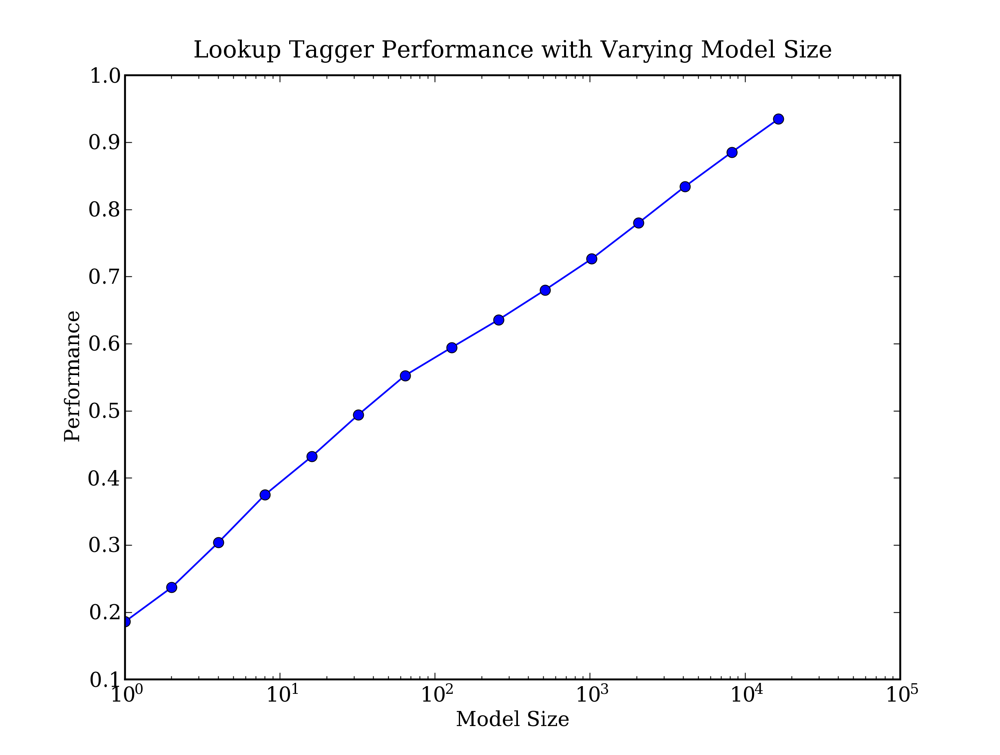
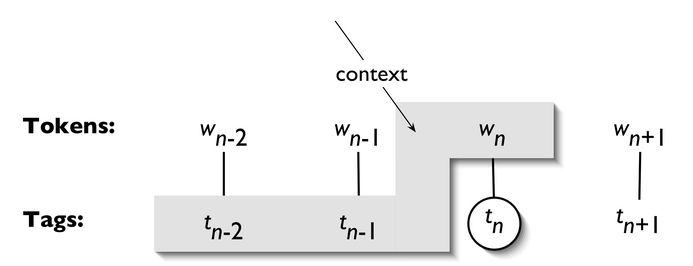

.. -*- mode: rst -*-
.. include:: ../definitions.rst

.. standard global imports

    >>> import nltk, re, pprint

.. TODO: exercise on cascaded tagging
.. TODO: other simplified tagset
.. TODO: motivate trigram tagging by showing some cases where bigram tagging doesn't work
.. TODO: xref to unicode section in prog chapter
.. TODO: * outstanding problems:
   - what are we doing with ConditionalFreqDist?
   - nltk.tag contains all of math library
   - nltk.corpus.brown.tagged_sents() is too verbose?
   - tag method returns generator object? 
.. TODO: type conversions: ``str()``, ``int()``, ``list()``.
.. TODO: explain how nltk.Index is a defaultdict
.. TODO: tagging for language analysis: find all pairs of nouns which occur in the same sentence
.. TODO: possibly add section on exploring tagged corpora
.. TODO: fix up tag-context.png
.. TODO: add back in short section on Brill and HMM tagging
.. TODO: how to tag unknown words
.. TODO: how POS tagging disambiguates the word "like" and this can be
   useful for sentiment detection

.. _chap-tag:

=================================
4. Categorizing and Tagging Words
=================================

Back in elementary school you learnt the difference between nouns, verbs,
adjectives, and adverbs.  These "word classes" are not just
the idle invention of grammarians, but are useful categories for many
language processing tasks.  As we will see, they arise from simple analysis
of the distribution of words in text.  The goal of this chapter is to
answer the following questions:

#. What are lexical categories and how are they used in natural language processing?
#. What is a good Python data structure for storing words and their categories?
#. How can we automatically tag each word of a text with its word class?

Along the way, we'll cover some fundamental techniques in NLP, including
sequence labeling, n-gram models, backoff, and evaluation.  These techniques
are useful in many areas, and tagging gives us a simple context in which
to present them.

The process of classifying words into their parts-of-speech and
labeling them accordingly is known as `part-of-speech tagging`:dt:,
`POS-tagging`:dt:, or simply `tagging`:dt:.  The collection of tags
used for a particular task is known as a `tagset`:dt:.  Our emphasis
in this chapter is on exploiting tags, and tagging text automatically.

.. _sec-applications-of-tagging:

-----------------------
Applications of Tagging
-----------------------

Automatic tagging has several applications.  We have already
seen an example of how to exploit tags in corpus analysis |mdash| we
get a clear understanding of the distribution of `often`:lx: by
looking at the tags of adjacent words.  Automatic tagging
also helps predict the behavior of previously unseen words.
For example, if we encounter the word
`scrobbling`:lx: we can probably infer that it is a verb, with
the root `scrobble`:lx:, and likely to occur after forms of the auxiliary
``to be`` (e.g. `he was scrobbling`:lx:).  Parts-of-speech are also used
in speech synthesis and recognition.  For example, ``wind/NN``, as in
`the wind blew`:lx:, is pronounced with a short vowel, whereas
``wind/VB``, as in `to wind the clock`:lx:, is pronounced with a long
vowel.  Other examples can be found where the stress pattern differs
depending on whether the word is a noun or a verb, e.g. `contest`:lx:,
`insult`:lx:, `present`:lx:, `protest`:lx:, `rebel`:lx:, `suspect`:lx:.
Without knowing the part-of-speech we cannot be sure of pronouncing
the word correctly. Finally, there are many applications where
automatic part-of-speech tagging is a vital step that feeds into later
processing. We will look at many examples of this in later chapters.

Evidence for Lexical Categories: Distributional Similarity
----------------------------------------------------------

Before we go further, let's look for words based on similar distribution
in a text.  We will look up `woman`:lx: (a noun), `bought`:lx: (a verb),
`over`:lx: (a preposition), and `the`:lx: (a determiner), using
|NLTK|\ 's ``Text.similar()`` function:

    >>> text = nltk.Text(word.lower() for word in nltk.corpus.brown.words())
    >>> text.similar('woman')
    Building word-context index...
    man number fact end time world use kind state matter house result way
    group part day rest sense couple be
    >>> text.similar('bought')
    able been made found used was had said have that given in expected as
    told put taken got seen done
    >>> text.similar('over')
    of in to on at for was is with that from and into by all as out up back the
    >>> text.similar('the')
    a his this that it their one her an all in its any which our some he
    these my be

This function takes a word `w`:math:, finds all contexts
`w`:math:\ `1`:subscript:\ `w`:math: `w`:math:\ `2`:subscript:,
then finds all words `w'`:math: that appear in the same context,
i.e. `w`:math:\ `1`:subscript:\ `w'`:math:\ `w`:math:\ `2`:subscript:.
(You can find the implementation online at ``http://nltk.org/nltk/text.py``)    

Observe that searching for `woman`:lx: finds *nouns*;
searching for `bought`:lx: finds *verbs*;
searching for `over`:lx: generally finds *prepositions*;
searching for `the`:lx: finds several *determiners*.

These groups of words are so important that they have several names,
all in common use: `word classes`:dt:, `lexical categories`:dt:, and `parts of speech`:dt:.
We'll use these names interchangeably.

Exploring a Tagged Corpus
-------------------------

.. SB: fix this up...

For example, if we are
interested in searching for occurrences of the pattern ``"<Verb> to
<Verb>"`` in the Brown corpus, we could use the following program:

    >>> from nltk.corpus import brown
    >>> for sent in brown.tagged_sents():
    ...     # Look at each 3-word window in the sentence.
    ...     for triple in nltk.trigrams(sent):
    ...         # Get the part-of-speech tags for this 3-word window.
    ...         tags = [t for (w,t) in triple]
    ...         # Check if they match our pattern.
    ...         if ( tags[0].startswith('V') and tags[1]=='TO' and
    ...              tags[2].startswith('V') ):
    ...             print triple
    [('combined', 'VBN'), ('to', 'TO'), ('achieve', 'VB')]
    [('continue', 'VB'), ('to', 'TO'), ('place', 'VB')]
    [('serve', 'VB'), ('to', 'TO'), ('protect', 'VB')]
    [('wanted', 'VBD'), ('to', 'TO'), ('wait', 'VB')]
    [('allowed', 'VBN'), ('to', 'TO'), ('place', 'VB')]
    [('expected', 'VBN'), ('to', 'TO'), ('become', 'VB')]
      ...
    [('seems', 'VBZ'), ('to', 'TO'), ('overtake', 'VB')]
    [('want', 'VB'), ('to', 'TO'), ('buy', 'VB')]

.. note:: Remember that our program samples assume you
   begin your interactive session or your program with: ``import nltk, re, pprint``

--------------
Tagged Corpora
--------------

A Simplified Part-of-Speech Tagset
----------------------------------

Tagged corpora use many different conventions for tagging words.
To help us get started, we will be looking at a simplified tagset
(shown in Table simplified-tagset_).

.. table:: simplified-tagset

    =======  ===================  ==========================================
    Tag      Meaning              Examples
    =======  ===================  ==========================================
    ``ADJ``  adjective            `new, good, high, special, big, local`:lx:
    ``ADV``  adverb               `really, already, still, early, now`:lx:
    ``CNJ``  conjunction          `and, or, but, if, while, although`:lx:
    ``DET``  determiner           `the, a, some, most, every, no`:lx:
    ``EX``   existential          `there, there's`:lx:
    ``FW``   foreign word         `dolce, ersatz, esprit, quo, maitre`:lx:
    ``MOD``  modal verb           `will, can, would, may, must, should`:lx:
    ``N``    noun                 `year, home, costs, time, education`:lx:
    ``NP``   proper noun          `Alison, Africa, April, Washington`:lx:
    ``NUM``  number               `twenty-four, fourth, 1991, 14:24`:lx: 
    ``PRO``  pronoun              `he, their, her, its, my, I, us`:lx:
    ``P``    preposition          `on, of, at, with, by, into, under`:lx:
    ``TO``   the word `to`:lx:    `to`:lx:
    ``UH``   interjection         `ah, bang, ha, whee, hmpf, oops`:lx:
    ``V``    verb                 `is, has, get, do, make, see, run`:lx:
    ``VD``   past tense           `said, took, told, made, asked`:lx:
    ``VG``   present participle   `making, going, playing, working`:lx:
    ``VN``   past participle      `given, taken, begun, sung`:lx:
    ``WH``   `wh`:lx: determiner  `who, which, when, what, where, how`:lx:
    =======  ===================  ==========================================

    Simplified Part-of-Speech Tagset

Let's see which of these tags are the most common in the news
category of the Brown corpus:

    >>> from nltk.corpus import brown
    >>> brown_news_tagged = brown.tagged_words(categories='news', simplify_tags=True)
    >>> tag_fd = nltk.FreqDist(tag for (word, tag) in brown_news_tagged)
    >>> tag_fd.keys()
    ['N', 'P', 'DET', 'NP', 'V', 'ADJ', ',', '.', 'CNJ', 'PRO', 'ADV', 'VD', ...]

.. note:: |TRY|
   Plot the above frequency distribution using ``tag_fd.plot(cumulative=True)``.
   What percentage of words are tagged using the first five tags of the above list? 

We can use these tags to do powerful searches using a graphical
POS-concordance tool ``nltk.draw.pos_concordance()``.  Use it
to search for any combination of words and POS tags, e.g.
``N N N N``, ``hit/VD``, ``hit/VN``, ``the ADJ man``.

.. Screenshot

Reading Tagged Corpora
----------------------

Several of the corpora included with NLTK have been `tagged`:dt: for
their part-of-speech. Here's an example of what you might see if you
opened a file from the Brown Corpus with a text editor:

    The/at Fulton/np-tl County/nn-tl Grand/jj-tl Jury/nn-tl
    said/vbd Friday/nr an/at investigation/nn of/in Atlanta's/np$
    recent/jj primary/nn election/nn produced/vbd ``/`` no/at
    evidence/nn ''/'' that/cs any/dti irregularities/nns took/vbd
    place/nn ./.

However, other tagged corpus files represent their part-of-speech tags
in different ways. |NLTK|\ 's corpus readers provide a uniform
interface to these various formats so that you don't have to be
concerned with them.  By contrast with the text extract shown above,
the corpus reader for the Brown Corpus presents the data as follows:

    >>> list(nltk.corpus.brown.tagged_words())[:25]
    [('The', 'AT'), ('Fulton', 'NP-TL'), ('County', 'NN-TL'),
    ('Grand', 'JJ-TL'), ('Jury', 'NN-TL'), ('said', 'VBD'),
    ('Friday', 'NR'), ('an', 'AT'), ('investigation', 'NN'), ...]

Part-of-speech tags have been converted to uppercase, since this has
become standard practice since the Brown Corpus was published.

Whenever a corpus contains tagged text, it will have a ``tagged_words()``
method. Here are some more examples, again using the output format
illustrated for the Brown Corpus:

    >>> print nltk.corpus.nps_chat.tagged_words()
    [('now', 'RB'), ('im', 'PRP'), ('left', 'VBD'), ...]
    >>> nltk.corpus.conll2000.tagged_words()
    [('Confidence', 'NN'), ('in', 'IN'), ('the', 'DT'), ...]
    >>> nltk.corpus.treebank.tagged_words()
    [('Pierre', 'NNP'), ('Vinken', 'NNP'), (',', ','), ...]

Not all corpora employ the same set of tags; please see Appendix
app-tagsets_ for a comprehensive list of tags for some popular tagsets.
(Note that each |NLTK| corpus has a ``README`` file which may
also have documentation on tagsets.)
Initially we want to avoid the complications of these tagsets,
so we use a built-in mapping to a simplified tagset:

    >>> nltk.corpus.brown.tagged_words(simplify_tags=True)
    [('The', 'DET'), ('Fulton', 'NP'), ('County', 'N'), ...]
    >>> nltk.corpus.treebank.tagged_words(simplify_tags=True)
    [('Pierre', 'NP'), ('Vinken', 'NP'), (',', ','), ...]
    
Tagged corpora for several other languages are distributed with NLTK,
including Chinese, Hindi, Portuguese, Spanish, Dutch and Catalan.
These usually contain non-ASCII text,
and Python always displays this in hexadecimal when printing a larger structure
such as a list.

    >>> nltk.corpus.sinica_treebank.tagged_words()
    [('\xe4\xb8\x80', 'Neu'), ('\xe5\x8f\x8b\xe6\x83\x85', 'Nad'), ...]
    >>> nltk.corpus.indian.tagged_words()
    [('\xe0\xa6\xae\xe0\xa6\xb9\xe0\xa6\xbf\xe0\xa6\xb7\xe0\xa7\x87\xe0\xa6\xb0', 'NN'),
    ('\xe0\xa6\xb8\xe0\xa6\xa8\xe0\xa7\x8d\xe0\xa6\xa4\xe0\xa6\xbe\xe0\xa6\xa8', 'NN'), ...]
    >>> nltk.corpus.mac_morpho.tagged_words()
    [('Jersei', 'N'), ('atinge', 'V'), ('m\xe9dia', 'N'), ...]
    >>> nltk.corpus.conll2002.tagged_words()
    [('Sao', 'NC'), ('Paulo', 'VMI'), ('(', 'Fpa'), ...]
    >>> nltk.corpus.cess_cat.tagged_words()
    [('El', 'da0ms0'), ('Tribunal_Suprem', 'np0000o'), ...]

If your environment is set up correctly, with appropriate editors and fonts,
you should be able to display individual strings in a human-readable way.
For example, Figure fig-tag-indian_ shows the output of the demonstration code 
``nltk.corpus.indian.demo()``.

.. _fig-tag-indian:
.. figure:: ../images/tag-indian.png
   :scale: 60

   POS-Tagged Data from Four Indian Languages

..    इराक_NNP के_PREP विदेश_NNC मंत्री_NN ने_PREP अमरीका_NNP के_PREP उस_PRP प्रस्ताव_NN का_PREP मजाक_NVB उड़ाया_VFM है_VAUX ...

If the corpus is also segmented into sentences, it will have
a ``tagged_sents()`` method that divides up the tagged words into
sentences rather than presenting them as one big list.
This will be useful when we come to developing automatic taggers,
as they typically function on a sentence at a time.

Nouns
-----

Nouns generally refer to people, places, things, or concepts, e.g.:
`woman, Scotland, book, intelligence`:lx:.  Nouns can appear after
determiners and adjectives, and can be the subject or object of the
verb, as shown in Table syntax-nouns_.

.. table:: syntax-nouns

   ============    =============================================  ==================================================
   Word            After a determiner                             Subject of the verb
   ============    =============================================  ==================================================
   woman           *the* woman who I saw yesterday ...            the woman *sat* down
   Scotland        *the* Scotland I remember as a child ...       Scotland *has* five million people
   book            *the* book I bought yesterday ...              this book *recounts* the colonization of Australia
   intelligence    *the* intelligence displayed by the child ...  Mary's intelligence *impressed* her teachers
   ============    =============================================  ==================================================

   Syntactic Patterns involving some Nouns

The simplified noun tags are ``N`` for common nouns like `book`:lx:,
and ``NP`` for proper nouns like `Scotland`:lx:.

Let's inspect some tagged text to see what parts of speech occur before a noun,
with the most frequent ones first. To begin with, we construct a list
of bigrams whose members are themselves word-tag pairs such as
``(('The', 'DET'), ('Fulton', 'NP'))`` and  ``(('Fulton', 'NP'), ('County', 'N'))``.
Then we construct a ``FreqDist`` from the tag parts of the bigrams.

    >>> word_tag_pairs = nltk.bigrams(brown_news_tagged)
    >>> list(nltk.FreqDist(a[1] for (a, b) in word_tag_pairs if b[1] == 'N'))
    ['DET', 'ADJ', 'N', 'P', 'NP', 'NUM', 'V', 'PRO', 'CNJ', '.', ',', 'VG', 'VN', ...]

This confirms our assertion that nouns occur after determiners and
adjectives, including numeral adjectives (tagged as ``NUM``). 

.. TO-DO say something about some of the other contexts?

Verbs
-----

Verbs are words that describe events and actions, e.g. `fall`:lx:,
`eat`:lx: in Table syntax-verbs_.
In the context of a sentence, verbs typically express a relation
involving the referents of one or more noun phrases.

.. table:: syntax-verbs

   =====  ===============  ===============================================
   Word   Simple           With modifiers and adjuncts (italicized)
   =====  ===============  ===============================================
   fall   Rome fell        Dot com stocks *suddenly* fell *like a stone*
   eat    Mice eat cheese  John ate the pizza *with gusto*
   =====  ===============  ===============================================

   Syntactic Patterns involving some Verbs

What are the most common verbs in news text?  Let's sort all the verbs by frequency:

    >>> wsj = nltk.corpus.treebank.tagged_words(simplify_tags=True)
    >>> word_tag_fd = nltk.FreqDist(wsj)
    >>> [word + "/" + tag for (word, tag) in word_tag_fd if tag.startswith('V')]
    ['is/V', 'said/VD', 'was/VD', 'are/V', 'be/V', 'has/V', 'have/V', 'says/V',
    'were/VD', 'had/VD', 'been/VN', "'s/V", 'do/V', 'say/V', 'make/V', 'did/VD',
    'rose/VD', 'does/V', 'expected/VN', 'buy/V', 'take/V', 'get/V', 'sell/V',
    'help/V', 'added/VD', 'including/VG', 'according/VG', 'made/VN', 'pay/V', ...]

Note that the items being counted in the frequency distribution are word-tag pairs.
Since words and tags are paired, we can treat the word as a condition and the tag
as an event, and initialize a conditional frequency distribution with a list of
condition-event pairs.  This lets us see a frequency-ordered list of tags given a word:

    >>> cfd1 = nltk.ConditionalFreqDist(wsj)
    >>> cfd1['yield'].keys()
    ['V', 'N']
    >>> cfd1['cut'].keys()
    ['V', 'VD', 'N', 'VN']

We can reverse the order of the pairs, so that the tags are the conditions, and the
words are the events.  Now we can see likely words for a given tag:

    >>> cfd2 = nltk.ConditionalFreqDist((tag, word) for (word, tag) in wsj)
    >>> cfd2['VN'].keys()
    ['been', 'expected', 'made', 'compared', 'based', 'priced', 'used', 'sold',
    'named', 'designed', 'held', 'fined', 'taken', 'paid', 'traded', 'said', ...]

To clarify the distinction between ``VD`` (past tense) and ``VN``
(past participle), let's find words which can be both ``VD`` and
``VN``, and see some surrounding text:

    >>> [w for w in cfd1.conditions() if 'VD' in cfd1[w] and 'VN' in cfd1[w]]
    ['Asked', 'accelerated', 'accepted', 'accused', 'acquired', 'added', 'adopted', ...]
    >>> idx1 = wsj.index(('kicked', 'VD'))
    >>> wsj[idx1-4:idx1+1]
    [('While', 'P'), ('program', 'N'), ('trades', 'N'), ('swiftly', 'ADV'), ('kicked', 'VD')]
    >>> idx2 = wsj.index(('kicked', 'VN'))
    >>> wsj[idx2-4:idx2+1]
    [('head', 'N'), ('of', 'P'), ('state', 'N'), ('has', 'V'), ('kicked', 'VN')]

In this case, we see that the past participle of `kicked`:lx: is preceded by a form of
the auxiliary verb `have`:lx:. Is this generally true?

.. note:: |TRY|
   Given the list of past participles specified by
   ``cfd2['VN'].keys()``, try to collect a list of all the word-tag
   pairs that immediately precede items in that list. 

Adjectives and Adverbs
----------------------

Two other important word classes are `adjectives`:dt: and `adverbs`:dt:.
Adjectives describe nouns, and can be used as modifiers
(e.g. `large`:lx: in `the large pizza`:lx:), or in predicates (e.g. `the
pizza is large`:lx:).  English adjectives can have internal structure
(e.g.  `fall+ing`:lx: in `the falling
stocks`:lx:).  Adverbs modify verbs to specify the time, manner, place or
direction of the event described by the verb (e.g. `quickly`:lx: in
`the stocks fell quickly`:lx:).  Adverbs may also modify adjectives
(e.g. `really`:lx: in `Mary's teacher was really nice`:lx:).

English has several categories of closed class words in addition to
prepositions, such as `articles`:dt: (also often called `determiners`:dt:)
(e.g., `the`:lx:, `a`:lx:), `modals`:dt: (e.g., `should`:lx:,
`may`:lx:), and `personal pronouns`:dt: (e.g., `she`:lx:, `they`:lx:).
Each dictionary and grammar classifies these words differently.

.. note:: |TRY|
   If you are uncertain about some of these parts of speech, study them using
   ``nltk.draw.pos_concordance()``, or watch some of the *Schoolhouse Rock!*
   grammar videos available at YouTube, or consult the Further Reading
   section at the end of this chapter.

Tuples
------

By convention in NLTK, a tagged token is represented using a Python
`tuple`:dt:.
Python tuples are just like lists, except for one important
difference: tuples cannot be changed in place, for example by
``sort()`` or ``reverse()``. In other words, like strings, they are
immutable. Tuples are formed with the comma operator, and typically enclosed
using parentheses.  Like lists, tuples can be indexed and sliced:

.. doctest-ignore::
   >>> t = ('walk', 'fem', 3)
   >>> t[0]
   'walk'
   >>> t[1:]
   ('fem', 3)
   >>> t[0] = 'run'
   Traceback (most recent call last):
     File "<stdin>", line 1, in ?
   TypeError: object does not support item assignment

A tagged token is represented using a tuple consisting of just two items.
We can create one of these special tuples from the standard string
representation of a tagged token, using the function ``str2tuple()``:

    >>> tagged_token = nltk.tag.str2tuple('fly/NN')
    >>> tagged_token
    ('fly', 'NN')
    >>> tagged_token[0]
    'fly'
    >>> tagged_token[1]
    'NN'

We can construct a list of tagged tokens directly from a string.  The first
step is to tokenize the string
to access the individual ``word/tag`` strings, and then to convert
each of these into a tuple (using ``str2tuple()``).

    >>> sent = '''
    ... The/AT grand/JJ jury/NN commented/VBD on/IN a/AT number/NN of/IN
    ... other/AP topics/NNS ,/, AMONG/IN them/PPO the/AT Atlanta/NP and/CC
    ... Fulton/NP-tl County/NN-tl purchasing/VBG departments/NNS which/WDT it/PPS
    ... said/VBD ``/`` ARE/BER well/QL operated/VBN and/CC follow/VB generally/RB
    ... accepted/VBN practices/NNS which/WDT inure/VB to/IN the/AT best/JJT
    ... interest/NN of/IN both/ABX governments/NNS ''/'' ./.
    ... '''
    >>> [nltk.tag.str2tuple(t) for t in sent.split()]
    [('The', 'AT'), ('grand', 'JJ'), ('jury', 'NN'), ('commented', 'VBD'),
    ('on', 'IN'), ('a', 'AT'), ('number', 'NN'), ... ('.', '.')]

Unsimplified Tags
-----------------

Let's find the most frequent nouns of each noun part-of-speech type.
The program in Figure findtags_ finds all tags starting with ``NN``,
and provides a few example words for each one.  You will see that
there are many variants of ``NN``; the most important contain ``$``
for possessive nouns, ``S`` for plural nouns (since plural nouns
typically end in `s`:lx:) and ``P`` for proper nouns.  In addition,
most of the tags have suffix modifiers: ``-NC`` for citations, ``-HL``
for words in headlines and ``-TL`` for titles.

.. pylisting:: findtags
   :caption: Program to Find the Most Frequent Noun Tags

    def findtags(tag_prefix, tagged_text):
        cfd = nltk.ConditionalFreqDist((tag, word) for (word, tag) in tagged_text
                                      if tag.startswith(tag_prefix))
        return dict((tag, cfd[tag].keys()[:5]) for tag in cfd.conditions())

    >>> tagdict = findtags('NN', nltk.corpus.brown.tagged_words(categories='news'))
    >>> for tag in sorted(tagdict):
    ...     print tag, tagdict[tag]
    ...
    NN ['year', 'time', 'state', 'week', 'man']
    NN$ ["year's", "world's", "state's", "nation's", "company's"]
    NN$-HL ["Golf's", "Navy's"]
    NN$-TL ["President's", "University's", "League's", "Gallery's", "Army's"]
    NN-HL ['cut', 'Salary', 'condition', 'Question', 'business']
    NN-NC ['eva', 'ova', 'aya']
    NN-TL ['President', 'House', 'State', 'University', 'City']
    NN-TL-HL ['Fort', 'City', 'Commissioner', 'Grove', 'House']
    NNS ['years', 'members', 'people', 'sales', 'men']
    NNS$ ["children's", "women's", "men's", "janitors'", "taxpayers'"]
    NNS$-HL ["Dealers'", "Idols'"]
    NNS$-TL ["Women's", "States'", "Giants'", "Officers'", "Bombers'"]
    NNS-HL ['years', 'idols', 'Creations', 'thanks', 'centers']
    NNS-TL ['States', 'Nations', 'Masters', 'Rules', 'Communists']
    NNS-TL-HL ['Nations']

When we come to constructing part-of-speech taggers later in this chapter,
we will use the unsimplified tags.

Exploring Tagged Corpora (NOTES)
--------------------------------

We can continue the kinds of exploration of corpora we saw in previous chapters,
but exploiting the tags...

Suppose we're studying the word `often`:lx: and want to see how it is used
in text.  We could ask to see the words that follow `often`:lx:

    >>> brown_learned_text = brown.words(categories='learned')
    >>> sorted(set(b for (a, b) in nltk.ibigrams(brown_learned_text) if a == 'often'))
    [',', '.', 'accomplished', 'analytically', 'appear', 'apt', 'associated', 'assuming',
    'became', 'become', 'been', 'began', 'call', 'called', 'carefully', 'chose', ...]

However, it's probably more instructive use the ``tagged_words()``
method to look at the part-of-speech tag of the following words:

    >>> brown_learned_tagged = brown.tagged_words(categories='learned', simplify_tags=True)
    >>> tags = [b[1] for (a, b) in nltk.ibigrams(brown_learned_tagged) if a[0] == 'often']
    >>> list(nltk.FreqDist(tags))
    ['VN', 'V', 'VD', 'DET', 'ADJ', 'ADV', 'P', 'CNJ', ',', 'TO', 'VG', 'WH', 'VBZ', '.']

Notice that the most high-frequency parts of speech following `often`:lx: are verbs.
Nouns never appear in this position (in this particular corpus).

As another example of how we might explore tagged corpora, let's find words that
are highly ambiguous as to their part of speech tag.  Understanding why such words
are tagged as they are in each context can help us clarify the distinctions between
the tags.

    >>> brown_news_tagged = brown.tagged_words(categories='news', simplify_tags=True)
    >>> data = nltk.ConditionalFreqDist((word.lower(), tag) for (word, tag) in brown_news_tagged)
    >>> for word in data.conditions():
    ...     if len(data[word]) > 3:
    ...         tags = data[word].keys()
    ...         print word, ' '.join(tags)
    ...
    best ADJ ADV NP V
    better ADJ ADV V DET
    close ADV ADJ V N
    cut V N VN VD
    even ADV DET ADJ V
    grant NP N V -
    hit V VD VN N
    lay ADJ V NP VD
    left VD ADJ N VN
    like CNJ V ADJ P -
    near P ADV ADJ DET
    open ADJ V N ADV
    past N ADJ DET P
    present ADJ ADV V N
    read V VN VD NP
    right ADJ N DET ADV
    second NUM ADV DET N
    set VN V VD N -
    that CNJ V WH DET

.. _sec-dictionaries:

-----------------------------------------------------
Mapping Words to Properties Using Python Dictionaries
-----------------------------------------------------

As we have seen, a tagged word of the form ``(word, tag)`` is
an association between a word and a part-of-speech tag.
Once we start doing part-of-speech tagging, we will be creating
programs that assign a tag to a word, the tag which is most
likely in a given context.  We can think of this process as
`mapping`:dt: from words to tags.  The most natural way to
store mappings in Python uses the dictionary data type.
In this section we look at dictionaries and see how they can
represent a variety of language information, including
parts of speech.

Indexing Lists vs Dictionaries
------------------------------

A text, as we have seen, is treated in Python as a list of words.
An important property of lists is that we can "look up" a particular
item by giving its index, e.g. ``text1[100]``.  Notice how we specify
a number, and get back a word.  We can think of a list as a simple
kind of table, as shown in Figure fig-maps01_.

.. _fig-maps01:
.. figure:: ../images/maps01.png
   :scale: 20:90:20

   List Look-up

Contrast this situation with frequency distributions (section sec-computing-with-language-simple-statistics_),
where we specify a word, and get back a number, e.g. ``fdist['monstrous']``, which
tells us the number of times a given word has occurred in a text.  Look-up using words is
familiar to anyone who has used a dictionary.  Some more examples are shown in
Figure fig-maps02_.

.. _fig-maps02:
.. figure:: ../images/maps02.png
   :scale: 22

   Dictionary Look-up

In the case of a phonebook, we look up an entry using a `name`:em:,
and get back a number.  When we type a domain name in a web browser,
the computer looks this up to get back an IP address.  A word
frequency table allows us to look up a word and find its frequency in
a text collection.  In all these cases, we are mapping from names to
numbers, rather than the other way round as with a list.
In general, we would like to be able to map between
arbitrary types of information.  Table linguistic-objects_ lists a variety
of linguistic objects, along with what they map.

.. table:: linguistic-objects

    ======================  ============  ====================================================
    Linguistic Object       Maps From     Maps To
    ======================  ============  ====================================================
    Document Index          Word          List of pages (where word is found)
    Thesaurus               Word sense    List of synonyms
    Dictionary              Headword      Entry (part-of-speech, sense definitions, etymology)
    Comparative Wordlist    Gloss term    Cognates (list of words, one per language)
    Morph Analyzer          Surface form  Morphological analysis (list of component morphemes)
    ======================  ============  ====================================================

    Linguistic Objects as Mappings from Keys to Values

Most often, we are mapping from a "word" to some structured object.
For example, a document index maps from a word (which we can represent
as a string), to a list of pages (represented as a list of integers).
In this section, we will see how to represent such mappings in Python.

Dictionaries in Python
----------------------

Python provides a `dictionary`:dt: data type that can be used for
mapping between arbitrary types.  It is like a conventional dictionary,
in that it gives you an efficient way to look things up.  However,
as we see from Table linguistic-objects_, it has a much wider range of uses.

To illustrate, we define ``pos`` to be an empty dictionary and then add four
entries to it, specifying the part-of-speech of some words.  We add
entries to a dictionary using the familiar square bracket notation:

    >>> pos = {}
    >>> pos['colorless'] = 'ADJ'
    >>> pos['ideas'] = 'N'
    >>> pos['sleep'] = 'V'
    >>> pos['furiously'] = 'ADV'

So, for example, ``pos['colorless'] = 'ADJ'`` says that
the part-of-speech of `colorless`:lx: is adjective, or more
specifically, that the `key`:dt: ``'colorless'``
is assigned the `value`:dt: ``'ADJ'``  in dictionary ``pos``.  Once we
have populated the dictionary 
in this way, we can employ the keys to retrieve values:

    >>> pos['ideas']
    'N'
    >>> pos['colorless']
    'ADJ'

Of course, we might accidentally use a key that hasn't been assigned a value.

    >>> pos['green']
    Traceback (most recent call last):
      File "<stdin>", line 1, in ?
    KeyError: 'green'

This raises an important question.  Unlike lists and strings, where we
can use ``len()`` to work out which integers will be legal indices,
how do we work out the legal keys for a dictionary? If the dictionary
is not too big, we can simply inspect its contents by evaluating the
variable ``pos``.

    >>> pos
    {'furiously': 'ADV', 'ideas': 'N', 'colorless': 'ADJ', 'sleep': 'V'}

Here, the contents of the dictionary are shown as `key-value
pairs`:dt:, separated by a colon.  The order of the
key-value pairs is different from the order in which they were
originally entered;  this is because dictionaries are not sequences
but mappings (cf. Figure fig-maps02_), and the keys are not inherently
ordered.  

Alternatively, to just find the keys, we can convert the
dictionary to a list |mdash| or use the dictionary in a context where
a list is expected, as the parameter of ``sorted()`` or in a ``for`` loop:

    >>> list(pos)
    ['ideas', 'furiously', 'colorless', 'sleep']
    >>> sorted(pos)
    ['colorless', 'furiously', 'ideas', 'sleep']
    >>> [w for w in pos if w.endswith('s')]
    ['colorless', 'ideas']

.. note::
   When you type `list(pos)` you might see a different order
   to the one shown above.   If you want
   to see the keys in order, just sort them.

As well as iterating over all keys
in the dictionary with  a ``for`` loop,  we can use the ``for`` loop
as we did for printing lists:

    >>> for word in sorted(pos):
    ...     print word + ":", pos[word]
    ... 
    colorless: ADJ
    furiously: ADV
    sleep: V
    ideas: N

Finally, the dictionary methods ``keys()``, ``values()`` and
``items()`` allow us to access the keys, values, and key-value pairs as separate lists:

    >>> pos.keys()
    ['colorless', 'furiously', 'sleep', 'ideas']
    >>> pos.values()
    ['ADJ', 'ADV', 'V', 'N']
    >>> pos.items()
    [('colorless', 'ADJ'), ('furiously', 'ADV'), ('sleep', 'V'), ('ideas', 'N')]
    >>> for key, val in sorted(pos.items()):
    ...     print key + ":", val
    ...
    colorless: ADJ
    furiously: ADV
    ideas: N
    sleep: V

We want to be sure that when we look something up in a dictionary, we
only get one value for each key. Now 
suppose we try to use a dictionary to store the fact that the
word `sleep`:lx: can be used as both a verb and a noun:

    >>> pos['sleep'] = 'V'
    >>> pos['sleep'] = 'N'
    >>> pos['sleep']
    'N'

Initially, ``pos['sleep']`` is given the value ``'V'``. But this is
immediately overwritten with the new value ``'N'``.
In other words, there can only be one entry in the dictionary for ``'sleep'``.
However, there is a way of storing multiple values in
that entry: we use a list value,
e.g. ``pos['sleep'] = ['N', 'V']``.  In fact, this is what we
saw in Section sec-lexical-resources_ for the CMU Pronouncing Dictionary,
which stores multiple pronunciations for a single word.

Defining Dictionaries
---------------------

We can use the same key-value pair format to create a dictionary:

    >>> pos = {'colorless': 'ADJ', 'ideas': 'N', 'sleep': 'V', 'furiously': 'ADV'}
    >>> pos = dict(colorless='ADJ', ideas='N', sleep='V', furiously='ADV')

Default Dictionaries
--------------------

Since Python 2.5, a special kind of dictionary has been available, which
can automatically create a default entry for a given key.  (It is provided
as ``nltk.defaultdict`` for the benefit of readers who are using Python 2.4).
In order to use it, we have to supply a parameter which can be used to
create the right kind of initial entry, e.g. ``int`` or ``list``:

    >>> frequency = nltk.defaultdict(int)
    >>> frequency['colorless'] = 4
    >>> frequency['ideas']
    0
    >>> pos = nltk.defaultdict(list)
    >>> pos['sleep'] = ['N', 'V']
    >>> pos['ideas']
    []

If we want to supply our parameter to create a initial value, we have
to supply it as a function.
Let's return to our part-of-speech example, and create a dictionary
whose default value for any entry is ``'N'``.

    >>> pos = nltk.defaultdict(lambda: 'N')
    >>> pos['colorless'] = 'ADJ'
    >>> pos['blog']
    'N'

.. note::
   The above example used a `lambda expression`:em:, an advanced feature
   we will study in section sec-functions_.  For now you just need to
   know that ``lambda: 'N'`` creates a function, and when we call this
   function it produces the value ``'N'``: 

      >>> f = lambda: 'N'
      >>> f()
      'N'

Many language processing tasks, including tagging, struggle to correctly process
the hapaxes of a text.  They can perform better with a fixed vocabulary and a
guarantee that no new words will appear.  We can preprocess a text to replace
low-frequency words with a special "out of vocabulary" token ``UNK``, with
the help of a default dictionary.  (Can you work out how to do this without
reading on?)

We need to create a default dictionary that maps each word to its replacement.
The most frequent `n`:math: words will be mapped to themselves.
Everything else will be mapped to ``UNK``.

    >>> alice = nltk.corpus.gutenberg.words('carroll-alice.txt')
    >>> vocab = nltk.FreqDist(alice)
    >>> v1000 = list(vocab)[:1000]
    >>> mapping = nltk.defaultdict(lambda: 'UNK')
    >>> for v in v1000:
    ...     mapping[v] = v
    ... 
    >>> alice2 = [mapping[v] for v in alice]
    >>> alice2[:100]
    ['UNK', 'Alice', "'", 's', 'Adventures', 'in', 'Wonderland', 'by', 'UNK', 'UNK',
    'UNK', 'UNK', 'CHAPTER', 'I', '.', 'UNK', 'the', 'Rabbit', '-', 'UNK', 'Alice',
    'was', 'beginning', 'to', 'get', 'very', 'tired', 'of', 'sitting', 'by', 'her',
    'sister', 'on', 'the', 'bank', ',', 'and', 'of', 'having', 'nothing', 'to', 'do',
    ':', 'once', 'or', 'twice', 'she', 'had', 'UNK', 'into', 'the', 'book', 'her',
    'sister', 'was', 'UNK', ',', 'but', 'it', 'had', 'no', 'pictures', 'or', 'UNK',
    'in', 'it', ',', "'", 'and', 'what', 'is', 'the', 'use', 'of', 'a', 'book', ",'",
    'thought', 'Alice', "'", 'without', 'pictures', 'or', 'conversation', "?'", ...]
    >>> len(set(alice2))
    1001

Incrementally Updating a Dictionary
----------------------------------- 

We can employ dictionaries to count occurrences, emulating the method
for tallying words shown in Figure fig-tally_ of Chapter chap-introduction_.
We begin by initializing an empty ``defaultdict``, then process each
part-of-speech tag in the text.  If the tag hasn't been seen before,
it will have a zero count by default.  Each time we encounter a tag,
we increment its count using the ``+=`` operator.

.. pylisting:: dictionary
   :caption: Incrementally Updating a Dictionary, and Sorting by Value

    >>> counts = nltk.defaultdict(int)
    >>> for (word, tag) in brown_news_tagged:
    ...     counts[tag] += 1
    ...
    >>> counts['N']
    22226
    >>> list(counts)
    ['FW', 'DET', 'WH', "''", 'VBZ', 'VB+PPO', "'", ')', 'ADJ', 'PRO', '*', '-', ...]
    
    >>> from operator import itemgetter
    >>> sorted(counts.items(), key=itemgetter(1), reverse=True)
    [('N', 22226), ('P', 10845), ('DET', 10648), ('NP', 8336), ('V', 7313), ...]
    >>> [t for t,c in sorted(counts.items(), key=itemgetter(1), reverse=True)]
    ['N', 'P', 'DET', 'NP', 'V', 'ADJ', ',', '.', 'CNJ', 'PRO', 'ADV', 'VD', ...]

The listing in Figure dictionary_ illustrates an important idiom for
sorting a dictionary by its
values, in order to show the words in decreasing order of frequency.  The ``sorted()``
function takes ``key`` and ``reverse`` as parameters, and the required key is the second element of
each word-tage pair. Although the second member of a pair is normally
accessed with index ``[1]``, this expression
on its own (i.e. ``key=[1]``)  cannot be assigned as a parameter value
in the function definition since ``[1]`` looks like a list containing the integer ``1``.
An altertive is to set the value of ``key`` to be  ``itemgetter(1)``,
a function which has the same effect as indexing into a tuple:

    >>> pair = ('NP', 8336)
    >>> pair[1]
    8336
    >>> itemgetter(1)(pair)
    8336

There's a second useful programming idiom at the beginning of Figure
dictionary_, where we initialize a ``defaultdict`` and then use a
``for`` loop to update its values. Here's a schematic version:

|    ``my_dictionary = nltk.defaultdict(``\ *function to create default value*\ ``)``
|    ``for`` *item* ``in`` *sequence*\ ``:``
|    ``     `` *update* ``my_dictionary[``\ *item_key*\ ``]`` *with information about item*

Here's another instance of this pattern, where we index words according to their last two letters:

    >>> last_letters = nltk.defaultdict(list)
    >>> words = nltk.corpus.words.words('en')
    >>> for word in words:
    ...     key = word[-2:]
    ...     last_letters[key].append(word)
    ...
    >>> last_letters['ly']
    ['abactinally', 'abandonedly', 'abasedly', 'abashedly', 'abashlessly', 'abbreviately',
    'abdominally', 'abhorrently', 'abidingly', 'abiogenetically', 'abiologically', ...]
    >>> last_letters['zy']
    ['blazy', 'bleezy', 'blowzy', 'boozy', 'breezy', 'bronzy', 'buzzy', 'Chazy', 'cozy', ...]

The following example uses the same pattern to create an anagram dictionary.
(You might experiment with the third line to get an idea of why this program works.)

    >>> anagrams = nltk.defaultdict(list)
    >>> for word in words:
    ...     key = ''.join(sorted(word))
    ...     anagrams[key].append(word)
    ...
    >>> anagrams['aegilnrt']
    ['alerting', 'altering', 'integral', 'relating', 'triangle']

Since accumulating words like this is such a common task,
|NLTK| provides a more convenient way of creating a ``defaultdict(list)``:

    >>> anagrams = nltk.Index((''.join(sorted(w)), w) for w in words)

.. note:: ``nltk.FreqDist`` is essentially a ``defaultdict(int)`` with extra
   support for initialization, sorting and plotting that are needed in language processing.
   Similarly ``nltk.Index`` is a ``defaultdict(list)`` with extra support for
   initialization.

Complex Keys and Values
-----------------------

We can use default dictionaries with complex keys and values.
Let's study the range of possible tags for a word, given the
word itself, and the tag of the previous word.  We will see
how this information can be used by a POS tagger.

    >>> pos = nltk.defaultdict(lambda: nltk.defaultdict(int))
    >>> for ((w1,t1), (w2,t2)) in nltk.ibigrams(brown_news_tagged):
    ...     pos[(t1,w2)][t2] += 1
    ...
    >>> pos[('N', 'that')].items()
    [('V', 10), ('CNJ', 145), ('WH', 112)]
    >>> pos[('DET', 'right')].items()
    [('ADV', 3), ('ADJ', 9), ('N', 3)]

This example uses a dictionary whose default value for an entry
is a dictionary (whose default value is ``int()``, i.e. zero).
There is some new notation here (the ``lambda``), and we will
return to this in chapter chap-structured-programming_.
For now, notice how we iterated over the bigrams of the tagged
corpus, processing a pair of word-tag pairs for each iteration.
Each time through the loop we updated our ``pos`` dictionary's
entry for ``(t1,w2)``, a tag and its *following* word.  The entry
for ``('DET', 'right')`` is itself a dictionary of counts.
A POS tagger could use such information to decide to tag the
word `right`:lx: as ``ADJ`` when it is preceded by a determiner.

Inverting a Dictionary
----------------------

Dictionaries support efficient lookup, so long as you want to get the value for
any key.  If ``d`` is a dictionary and ``k`` is a key, we type ``d[k]`` and
immediately obtain the value.  Finding a key given a value is slower and more
cumbersome:

    >>> [key for (key, value) in counts.items() if value == 16]
    ['call', 'sleepe', 'take', 'where', 'Your', 'Father', 'looke', 'owne']

If we expect to do this kind of "reverse lookup" often, it helps to construct
a dictionary that maps values to keys.  In the case that no two keys have
the same value, this is an easy thing to do.  We just get all the key-value
pairs in the dictionary, and create a new dictionary of value-key
pairs. The next example also illustrates another way of initializing a
dictionary ``pos`` with key-value pairs.

    >>> pos = {'colorless': 'ADJ', 'ideas': 'N', 'sleep': 'V', 'furiously': 'ADV'}
    >>> pos2 = dict((value, key) for (key, value) in pos.items())
    >>> pos2['N']
    'ideas'

Let's first make our part-of-speech dictionary a bit more realistic
and add some more words to ``pos`` using the dictionary ``update()`` method, to
create the situation where multiple keys have the same value. Then the
technique just shown for reverse lookup will no longer work (why
not?).  Instead, we have to incrementally add new values to the
dictionary ``pos2``, as follows:

    >>> pos.update({'cats': 'N', 'scratch': 'V', 'peacefully': 'ADV', 'old': 'ADJ'})
    >>> pos2 = nltk.defaultdict(list)
    >>> for key, value in pos.items():
    ...     pos2[value].append(key)
    ... 
    >>> pos2['ADV']
    ['peacefully', 'furiously']

Now we have inverted the ``pos`` dictionary, and can look up any part-of-speech and find
all words having that part-of-speech.  We can do the same thing even
more simply using |NLTK|\ 's support
for indexing as follows:

    >>> pos2 = nltk.Index((value, key) for (key, value) in pos.items())

Summary
-------

Thanks to their versatility, Python dictionaries are extremely useful in most areas of |NLP|.
We already made heavy use of dictionaries in Chapter chap-introduction_, since
|NLTK|\ 's ``FreqDist`` objects are just a special case of dictionaries for counting things.
Table tab-dict_ lists the most important dictionary methods you should know. 

.. table:: tab-dict

   ==================================  ==========================================================
   Example                             Description
   ==================================  ==========================================================
   ``d = {}``                          create an empty dictionary and assign it to ``d``
   ``d[key] = value``                  assign a value to a given dictionary key
   ``list(d)``, ``d.keys()``           the list of keys of the dictionary
   ``sorted(d)``                       the keys of the dictionary, sorted
   ``key in d``                        test whether a particular key is in the dictionary
   ``for key in d``                    iterate over the keys of the dictionary
   ``d.values()``                      the list of values in the dictionary
   ``dict([(k1,v1), (k2,v2), ...])``   create a dictionary from a list of key-value pairs
   ``d1.update(d2)``                   add all items from ``d2`` to ``d1``
   ``defaultdict(int)``                a dictionary whose default value is zero
   ==================================  ==========================================================

   Summary of Python's Dictionary Methods

.. _sec-automatic-tagging:

-----------------
Automatic Tagging
-----------------

In this and the following sections we will explore various ways to automatically
add part-of-speech tags to some text.  We'll begin by loading the data we will be using.

    >>> from nltk.corpus import brown
    >>> brown_news_tagged = brown.tagged(categories='news')
    >>> brown_news_text = brown.words(categories='news')

The Default Tagger
------------------

The simplest possible tagger assigns the same tag to each token.  This
may seem to be a rather banal step, but it establishes an important
baseline for tagger performance.  In order to get the best result, we
tag each word with the most likely tag.  Let's find out which t ag is
most likely (now using the unsimplified tagset):

    >>> nltk.FreqDist(tag for (word, tag) in brown_news_tagged).max()
    'NN'

Now we can create a tagger that tags everything as ``NN``.

    >>> raw = 'I do not like green eggs and ham, I do not like them Sam I am!'
    >>> tokens = nltk.wordpunct_tokenize(raw)
    >>> default_tagger = nltk.DefaultTagger('NN')
    >>> default_tagger.tag(tokens)
    [('I', 'NN'), ('do', 'NN'), ('not', 'NN'), ('like', 'NN'), ('green', 'NN'),
    ('eggs', 'NN'), ('and', 'NN'), ('ham', 'NN'), (',', 'NN'), ('I', 'NN'),
    ('do', 'NN'), ('not', 'NN'), ('like', 'NN'), ('them', 'NN'), ('Sam', 'NN'),
    ('I', 'NN'), ('am', 'NN'), ('!', 'NN')]

Unsurprisingly, this method performs rather poorly.
On a typical corpus, it will tag only about an eighth of the tokens correctly:

    >>> nltk.tag.accuracy(default_tagger, brown_news_tagged)
    0.13089484257215028

Default taggers assign their tag to every single word, even words that
have never been encountered before.  As it happens, most new words are
nouns.  As we will see, this means that default taggers can help to improve the
robustness of a language processing system.  We will return to them
shortly.

The Regular Expression Tagger
-----------------------------

The regular expression tagger assigns tags to tokens on the basis of
matching patterns.  For instance, we might guess that any word ending
in `ed`:lx: is the past participle of a verb, and any word ending with
`'s`:lx: is a possessive noun.  We can express these as a list of
regular expressions:

    >>> patterns = [
    ...     (r'.*ing$', 'VBG'),               # gerunds
    ...     (r'.*ed$', 'VBD'),                # simple past
    ...     (r'.*es$', 'VBZ'),                # 3rd singular present
    ...     (r'.*ould$', 'MD'),               # modals
    ...     (r'.*\'s$', 'NN$'),               # possessive nouns
    ...     (r'.*s$', 'NNS'),                 # plural nouns
    ...     (r'^-?[0-9]+(.[0-9]+)?$', 'CD'),  # cardinal numbers
    ...     (r'.*', 'NN')                     # nouns (default)
    ... ]

Note that these are processed in order, and the first one that matches is applied.
Now we can set up a tagger and use it to tag a sentence.

    >>> regexp_tagger = nltk.RegexpTagger(patterns)
    >>> regexp_tagger.tag(brown_news_text[3:4])
    [('``', 'NN'), ('Only', 'NN'), ('a', 'NN'), ('relative', 'NN'),
    ('handful', 'NN'), ('of', 'NN'), ('such', 'NN'), ('reports', 'NNS'), 
    ('was', 'NNS'), ('received', 'VBD'), ("''", 'NN'), (',', 'NN'),
    ('the', 'NN'), ('jury', 'NN'), ('said', 'NN'), (',', 'NN'), ('``', 'NN'),
    ('considering', 'VBG'), ('the', 'NN'), ('widespread', 'NN'), ..., ('.', 'NN')]
    >>> nltk.tag.accuracy(regexp_tagger, brown_news_tagged)
    0.20326391789486245

The final regular expression |l|\ ``.*``\ |r| is a catch-all that tags everything as a noun.
This is equivalent to the default tagger (only much less efficient).
Instead of re-specifying this as part of the regular expression tagger,
is there a way to combine this tagger with the default tagger?  We
will see how to do this shortly.

The Lookup Tagger
-----------------

A lot of high-frequency words do not have the ``NN`` tag.
Let's find some of these words and their tags.  Let's find the
hundred most frequent words and store their most likely tag.
We can then use this information as the model for a "lookup tagger". 

    >>> fd = nltk.FreqDist(brown_news_text)
    >>> cfd = nltk.ConditionalFreqDist(brown_news_tagged)
    >>> most_freq_words = fd.keys()[:100]
    >>> likely_tags = dict((word, cfd[word].max()) for word in most_freq_words)
    >>> baseline_tagger = nltk.UnigramTagger(model=likely_tags)
    >>> nltk.tag.accuracy(baseline_tagger, brown.tagged_sents(categories='news'))
    0.45578495136941344

It should come as no surprise by now that simply
knowing the tags for the 100 most frequent
words enables us to tag nearly half of all words correctly.  Let's see
what it does on some untagged input text:

    >>> baseline_tagger.tag(brown_news_text[3])
    [('``', '``'), ('Only', None), ('a', 'AT'), ('relative', None),
    ('handful', None), ('of', 'IN'), ('such', None), ('reports', None), 
    ('was', 'BEDZ'), ('received', None), ("''", "''"), (',', ','),
    ('the', 'AT'), ('jury', None), ('said', 'VBD'), (',', ','), 
    ('``', '``'), ('considering', None), ('the', 'AT'), ('widespread', None), 
    ('interest', None), ('in', 'IN'), ('the', 'AT'), ('election', None), 
    (',', ','), ('the', 'AT'), ('number', None), ('of', 'IN'),
    ('voters', None), ('and', 'CC'), ('the', 'AT'), ('size', None),
    ('of', 'IN'), ('this', 'DT'), ('city', None), ("''", "''"), ('.', '.')]

Many words have been assigned a tag of ``None``,
because they were not among the 100 most frequent words.
In these cases we would like to assign the default tag of ``NN``,
a process known as backoff.

Getting Better Coverage with Backoff
------------------------------------

How do we combine these taggers?  We want to use the lookup table
first, and if it is unable to assign a tag, then use the default tagger.
We do this by specifying the default tagger as a parameter to the
lookup tagger.  The lookup tagger will invoke the default tagger when
it can't assign a tag itself.

    >>> baseline_tagger = nltk.UnigramTagger(model=likely_tags, backoff=nltk.DefaultTagger('NN'))
    >>> nltk.tag.accuracy(baseline_tagger, brown_news_tagged)
    0.58177695566561249

We can put all this together to write a simple (but somewhat inefficient) program to create and
evaluate lookup taggers having a range of sizes, as shown in Figure baseline-tagger_.
We include a backoff tagger that tags everything as a noun.  A consequence
of using this backoff tagger is that the lookup tagger only has to store word/tag
pairs for words other than nouns.

.. pylisting:: baseline-tagger
   :caption: Lookup Tagger Performance with Varying Model Size

   def performance(cfd, wordlist):
       lt = dict((word, cfd[word].max()) for word in wordlist)
       baseline_tagger = nltk.UnigramTagger(model=lt, backoff=nltk.DefaultTagger('NN'))
       return nltk.tag.accuracy(baseline_tagger, brown.tagged_sents(categories='news'))

   def display():
       import pylab
       words_by_freq = list(nltk.FreqDist(brown.words(categories='news')))
       cfd = nltk.ConditionalFreqDist(brown.tagged_words(categories='news'))
       sizes = 2 ** pylab.arange(15)
       perfs = [performance(cfd, words_by_freq[:size]) for size in sizes]
       pylab.plot(sizes, perfs, '-bo')
       pylab.title('Lookup Tagger Performance with Varying Model Size')
       pylab.xlabel('Model Size')
       pylab.ylabel('Performance')
       pylab.show()

   >>> display()                                  # doctest: +SKIP

.. _fig-tag-lookup:

   Lookup Tagger

Observe that performance initially increases rapidly as the model size grows, eventually
reaching a plateau, when large increases in model size yield little improvement
in performance.  (This example used the ``pylab`` plotting package; we will
return to this in Section sec-visualization_).

Evaluation
----------

In the above examples, you will have noticed an emphasis on
accuracy scores.  In fact, evaluating the performance of
such tools is a central theme in |NLP|.  Recall the processing
pipeline in Figure fig-sds_; any errors in the output of one
module are greatly multiplied in the downstream modules.

We evaluate the performance of a tagger relative to the tags
a human expert would assign.  Since we don't usually have access
to an expert and impartial human judge, we make do instead with
`gold standard`:dt: test data. This is a corpus which has been manually
annotated and which is accepted as a standard against which the
guesses of an automatic system are assessed. The tagger is regarded as
being correct if the tag it guesses for a given word is the same as
the gold standard tag.

Of course, the humans who designed and carried out the
original gold standard annotation were only human. Further
analysis might show mistakes in the gold standard, or may
eventually lead to a revised tagset and more elaborate guidelines.
Nevertheless, the gold standard is by definition "correct"
as far as the evaluation of an automatic tagger is concerned.

.. note::
   Developing an annotated corpus is a major undertaking.
   Apart from the data, it generates sophisticated tools,
   documentation, and practices for ensuring high quality
   annotation.  The tagsets and other coding schemes inevitably
   depend on some theoretical position that is not shared by
   all, however corpus creators often go to great lengths to
   make their work as theory-neutral as possible in order to
   maximize the usefulness of their work.  We will discuss
   the challenges of creating a corpus in Chapter chap-data_.

.. _sec-n-gram-tagging:

--------------
N-Gram Tagging
--------------

Unigram Tagging
---------------

Unigram taggers are based on a simple statistical algorithm:
for each token, assign the tag that is most likely for
that particular token. For example, it will assign the tag ``JJ`` to any
occurrence of the word `frequent`:lx:, since `frequent`:lx: is used as an
adjective (e.g. `a frequent word`:lx:) more often than it is used as a
verb (e.g. `I frequent this cafe`:lx:).
A unigram tagger behaves just like a lookup tagger (Section sec-automatic-tagging_),
except there is a more convenient technique for setting it up,
called `training`:dt:\ .  In the following code sample,
we train a unigram tagger, use it to tag a sentence, then evaluate:

    >>> brown_news_tagged = brown.tagged_sents(categories='news')
    >>> unigram_tagger = nltk.UnigramTagger(brown_news_tagged)
    >>> sent = brown.sents(categories='news')[2007]
    >>> unigram_tagger.tag(sent)
    [('Various', None), ('of', 'IN'), ('the', 'AT'), ('apartments', 'NNS'), ('are', 'BER'),
    ('of', 'IN'), ('the', 'AT'), ('terrace', 'NN'), ('type', 'NN'), (',', ','),
    ('being', 'BEG'), ('on', 'IN'), ('the', 'AT'), ('ground', 'NN'), ('floor', 'NN'),
    ('so', 'QL'), ('that', 'CS'), ('entrance', 'NN'), ('is', 'BEZ'), ('direct', 'JJ'), ('.', '.')]
    >>> nltk.tag.accuracy(unigram_tagger, brown_news_tagged)
    0.8550331165343994

We `train`:dt: a ``UnigramTagger`` by specifying tagged sentence data as
a parameter when we initialize the tagger.  The training process involves
inspecting the tag of each word and storing the most likely tag for any word
in a dictionary, stored inside the tagger.

Separating the Training and Testing Data
----------------------------------------

Now that we are training a tagger on some data, we must be careful not to test it on the
same data, as we did in the above example.  A tagger that simply memorized its training data
and made no attempt to construct a general model would get a perfect score, but would also
be useless for tagging new text.  Instead, we should split the data, training on 90% and
testing on the remaining 10%:

    >>> size = int(len(brown_news_tagged) * 0.9)
    >>> brown_news_train = brown_news_tagged[:size]
    >>> brown_news_test = brown_news_tagged[size:]
    >>> unigram_tagger = nltk.UnigramTagger(brown_news_train)
    >>> nltk.tag.accuracy(unigram_tagger, brown_news_test)
    0.77294926741752212

Although the score is worse, we now have a better picture of the usefulness of
this tagger, i.e. its performance on previously unseen text. 

N-Gram Tagging
--------------

When we perform a language processing task based on unigrams, we are using
one item of context.  In the case of tagging, we only consider the current
token, in isolation from any larger context.  Given such a model, the best
we can do is tag each word with its *a priori* most likely tag.
This means we would tag a word such as `wind`:lx: with the same tag,
regardless of whether it appears in the context `the wind`:lx: or
`to wind`:lx:\ .

An `n-gram tagger`:dt: is a generalization of a unigram tagger whose context is
the current word together with the part-of-speech tags of the
*n-1* preceding tokens, as shown in Figure fig-tag-context_. The tag to be
chosen, *t*\ `n`:subscript:, is circled, and the context is shaded
in grey. In the example of an n-gram tagger shown in Figure fig-tag-context_,
we have *n=3*; that is, we consider the tags of the two preceding words in addition
to the current word.  An n-gram tagger
picks the tag that is most likely in the given context. 

.. _fig-tag-context:

   Tagger Context

.. note:: A 1-gram tagger is another term for a unigram tagger: i.e.,
   the context used to tag a token is just the text of the token itself.
   2-gram taggers are also called *bigram taggers*, and 3-gram taggers
   are called *trigram taggers*.

The ``NgramTagger`` class uses a tagged training corpus to determine which
part-of-speech tag is most likely for each context.  Here we see
a special case of an n-gram tagger, namely a bigram tagger.
First we train it, then use it to tag untagged sentences:

    >>> bigram_tagger = nltk.BigramTagger(brown_news_train)
    >>> bigram_tagger.tag(sent)
    [('Various', 'JJ'), ('of', 'IN'), ('the', 'AT'), ('apartments', 'NNS'),
    ('are', 'BER'), ('of', 'IN'), ('the', 'AT'), ('terrace', 'NN'),
    ('type', 'NN'), (',', ','), ('being', 'BEG'), ('on', 'IN'), ('the', 'AT'),
    ('ground', 'NN'), ('floor', 'NN'), ('so', 'CS'), ('that', 'CS'),
    ('entrance', 'NN'), ('is', 'BEZ'), ('direct', 'JJ'), ('.', '.')]
    >>> unseen_sent = brown.sents(categories='news')[4203]
    >>> bigram_tagger.tag(unseen_sent)
    [('The', 'AT'), ('population', 'NN'), ('of', 'IN'), ('the', 'AT'), ('Congo', 'NP'),
    ('is', 'BEZ'), ('13.5', None), ('million', None), (',', None), ('divided', None),
    ('into', None), ('at', None), ('least', None), ('seven', None), ('major', None),
    ('``', None), ('culture', None), ('clusters', None), ("''", None), ('and', None),
    ('innumerable', None), ('tribes', None), ('speaking', None), ('400', None),
    ('separate', None), ('dialects', None), ('.', None)]

Notice that the bigram tagger manages to tag every word in a sentence it saw during
training, but does badly on an unseen sentence.  As soon as it encounters a new word
(i.e., `13.5`:lx:), it is unable to assign a tag.  It cannot tag the following word
(i.e., `million`:lx:) even if it was seen during training, simply because it never
saw it during training with a ``None`` tag on the previous word.  Consequently, the
tagger fails to tag the rest of the sentence.  Its overall accuracy score is very low: 

    >>> nltk.tag.accuracy(bigram_tagger, brown_news_test)
    0.10276088906608193

.. expand the following discussion if possible:

As *n* gets larger, the specificity of the contexts increases,
as does the chance that the data we wish to tag contains contexts that
were not present in the training data. This is known as the *sparse
data* problem, and is quite pervasive in NLP. As a consequence, there is a
trade-off between the accuracy and the coverage of our results (and
this is related to the `precision/recall trade-off`:dt: in information
retrieval).

.. caution:: n-gram taggers should not consider context that crosses a
   sentence boundary.  Accordingly, NLTK taggers are designed to work
   with lists of sentences, where each sentence is a list of words.  At
   the start of a sentence, *t*\ `n-1`:subscript: and preceding
   tags are set to ``None``.

Combining Taggers
-----------------

One way to address the trade-off between accuracy and coverage is to
use the more accurate algorithms when we can, but to fall back on
algorithms with wider coverage when necessary. For example, we could
combine the results of a bigram tagger, a unigram tagger, and
a ``regexp_tagger``, as follows:

1. Try tagging the token with the bigram tagger.
2. If the bigram tagger is unable to find a tag for the token, try
   the unigram tagger.
3. If the unigram tagger is also unable to find a tag, use a default tagger.

Most NLTK taggers permit a backoff-tagger to be specified.
The backoff-tagger may itself have a backoff tagger:

    >>> t0 = nltk.DefaultTagger('NN')
    >>> t1 = nltk.UnigramTagger(brown_news_train, backoff=t0)
    >>> t2 = nltk.BigramTagger(brown_news_train, backoff=t1)
    >>> nltk.tag.accuracy(t2, brown_news_test)
    0.81281770158477029

.. Note:: We specify the backoff tagger when the tagger is
   initialized, so that training can take advantage of the backoff tagger.
   Thus, if the bigram tagger would assign
   the same tag as its unigram backoff tagger in
   a certain context, the bigram tagger discards the training instance.
   This keeps the bigram tagger model as small as possible.  We can
   further specify that a tagger needs to see more than one instance of a
   context in order to retain it, e.g. ``nltk.BigramTagger(sents, cutoff=2, backoff=t1)``
   will discard contexts that have only been seen once or twice.

Tagging Unknown Words
---------------------

Our approach to tagging unknown words still uses backoff to a regular-expression tagger
or a default tagger.  These are unable to make use of context.  Thus, if our tagger
encountered the word `blog`:lx:, not seen during training, it would assign it the same tag,
regardless of whether this word appeared in the context `the blog`:lx: or `to blog`:lx:.
How can we do better with these unknown words, or `out-of-vocabulary`:dt: items?

A useful method to tag unknown words based on context is to limit the vocabulary
of a tagger to the most frequent `n`:math: words, and to replace every other word
with a special word `UNK`:lx:\ using the method shown in Section sec-dictionaries_.
During training, a unigram tagger will probably learn that `UNK`:lx: is usually a noun.
However, the n-gram taggers will detect contexts in which it has some other tag.
For example, if the preceding word is `to`:lx: (tagged ``TO``), then `UNK`:lx:
will probably be tagged as a verb.

.. note:: |TRY|
   Preprocess the Brown News data by replacing low frequency words with `UNK`:lx:,
   but leaving the tags untouched.  Now train and evaluate the above bigram tagger
   on this data.  How much does this help?  What is the contribution of the unigram
   tagger and default tagger now?

Storing Taggers
---------------

Training a tagger on a large corpus may take a significant time.  Instead of training a tagger
every time we need one, it is convenient to save a trained tagger in a file for later re-use.
Let's save our tagger ``t2`` to a file ``t2.pkl``.

    >>> from cPickle import dump
    >>> output = open('t2.pkl', 'wb')
    >>> dump(t2, output, -1)
    >>> output.close()

Now, in a separate Python process, we can load our saved tagger.

    >>> from cPickle import load
    >>> input = open('t2.pkl', 'rb')
    >>> tagger = load(input)
    >>> input.close()

Now let's check that it can be used for tagging.

    >>> text = """The board's action shows what free enterprise
    ...     is up against in our complex maze of regulatory laws ."""
    >>> tokens = text.split()
    >>> tagger.tag(tokens)
    [('The', 'AT'), ("board's", 'NN$'), ('action', 'NN'), ('shows', 'NNS'),
    ('what', 'WDT'), ('free', 'JJ'), ('enterprise', 'NN'), ('is', 'BEZ'),
    ('up', 'RP'), ('against', 'IN'), ('in', 'IN'), ('our', 'PP$'), ('complex', 'JJ'),
    ('maze', 'NN'), ('of', 'IN'), ('regulatory', 'NN'), ('laws', 'NNS'), ('.', '.')]

Performance Limitations
-----------------------

What is the upper limit to the performance of an n-gram tagger?
Consider the case of a trigram tagger.  How many cases of part-of-speech ambiguity does it
encounter?  We can determine the answer to this question empirically:

    >>> cfd = nltk.ConditionalFreqDist(
    ...            ((x[1], y[1], z[0]), z[1])
    ...            for sent in brown.tagged_sents(categories='news')
    ...            for x, y, z in nltk.trigrams(sent))
    >>> ambiguous_contexts = [c for c in cfd.conditions() if len(cfd[c]) > 1]
    >>> sum(cfd[c].N() for c in ambiguous_contexts) / float(cfd.N())
    0.049297702067999993

Thus, one out of twenty trigrams is ambiguous [EXAMPLES].  Given the
current word and the previous two tags, in 5% of cases there is more than one tag
that could be legitimately assigned to the current word according to
the training data.  Assuming we always pick the most likely tag in
such ambiguous contexts, we can derive an empirical upper bound on
the performance of a trigram tagger.

.. be more specific about this bound?

Another way to investigate the performance of a tagger is to study
its mistakes.  Some tags may be harder than others to assign, and
it might be possible to treat them specially by pre- or post-processing
the data.  A convenient way to look at tagging errors is the
`confusion matrix`:dt:.  It charts expected tags (the gold standard)
against actual tags generated by a tagger:

    >>> def tag_list(tagged_sents):
    ...     return [tag for sent in tagged_sents for (word, tag) in sent]
    >>> def apply_tagger(tagger, corpus):
    ...     return [tagger.tag(tag.untag(sent)) for sent in corpus]
    >>> gold = tag_list(brown.tagged_sents(categories='editorial'))
    >>> test = tag_list(apply_tagger(t2, brown.tagged_sents(categories='editorial')))
    >>> print nltk.ConfusionMatrix(gold, test)                # doctest: +SKIP

[EXAMPLE OF CONFUSION MATRIX]

Based on such analysis we may decide to modify the tagset.  Perhaps
a distinction between tags that is difficult to make can be dropped,
since it is not important in the context of some larger processing task.

Another way to analyze the performance bound on a tagger comes from
the less than 100% agreement between human annotators.  [MORE]

In general, observe that the tagging process simultaneously collapses distinctions
(i.e., lexical identity is usually lost when all personal pronouns are
tagged ``PRP``), while introducing distinctions and removing
ambiguities (e.g. `deal`:lx: tagged as ``VB`` or ``NN``).  This move
facilitates classification and prediction.
When we introduce finer distinctions in a tagset, we get better information
about linguistic context, but we have to do more work to classify the
current token (there are more tags to choose from).  Conversely, with
fewer distinctions (as with the simplified tagset), we have less work
to do for classifying the current token,
but less information about the context to draw on.

We have seen that ambiguity in the training data leads to an upper limit
in tagger performance.  Sometimes more context will resolve the
ambiguity.  In other cases however, as noted by [Abney1996PST]_, the
ambiguity can only be resolved with reference to syntax, or to world
knowledge.  Despite these imperfections, part-of-speech tagging has
played a central role in the rise of statistical approaches to natural
language processing.  In the early 1990s, the surprising accuracy of
statistical taggers was a striking demonstration that it was possible
to solve one small part of the language understanding problem, namely
part-of-speech disambiguation, without reference to deeper sources of
linguistic knowledge.  Can this idea be pushed further?  In Chapter chap-chunk_,
on chunk parsing, we shall see that it can.

----------------------------
Transformation-Based Tagging
----------------------------

A potential issue with n-gram taggers is the size of their n-gram
table (or language model).  If tagging is to be employed in a variety
of language technologies deployed on mobile computing devices, it is
important to strike a balance between model size and tagger
performance.  An n-gram tagger with backoff may store trigram and
bigram tables, large sparse arrays which may have hundreds of millions
of entries.

A second issue concerns context.  The only information an n-gram
tagger considers from prior context is tags, even though words
themselves might be a useful source of information.  It is simply
impractical for n-gram models to be conditioned on the identities of
words in the context.  In this section we examine Brill tagging,
a statistical tagging method which performs very well using models
that are only a tiny fraction of the size of n-gram taggers.

Brill Tagging
-------------

Brill tagging is a kind of *transformation-based learning*, named
after its inventor [REF].  The
general idea is very simple: guess the tag of each word, then go back
and fix the mistakes.  In this way, a Brill tagger successively
transforms a bad tagging of a text into a better one.  As with n-gram
tagging, this is a *supervised learning* method, since we need
annotated training data to figure out whether the tagger's guess is a
mistake or not.  However, unlike n-gram tagging, it does
not count observations but compiles a list of transformational
correction rules.

The process of Brill tagging is usually explained by analogy with
painting.  Suppose we were painting a tree, with all its details of
boughs, branches, twigs and leaves, against a uniform sky-blue
background.  Instead of painting the tree first then trying to paint
blue in the gaps, it is simpler to paint the whole canvas blue, then
"correct" the tree section by over-painting the blue background.  In
the same fashion we might paint the trunk a uniform brown before going
back to over-paint further details with even finer brushes.  Brill
tagging uses the same idea: begin with broad brush strokes then fix up
the details, with successively finer changes.  Let's look at an
example involving the following sentence:

.. ex::
   The President said he will ask Congress to increase grants to states
   for vocational rehabilitation

We will examine the operation of two rules:
(a) Replace ``NN`` with ``VB`` when the previous word is ``TO``;
(b) Replace ``TO`` with ``IN`` when the next tag is ``NNS``. 
Table brill-tagging_
illustrates this process, first tagging with the unigram tagger, then
applying the rules to fix the errors.

.. table:: brill-tagging

   ===========  ==  ========  ======  ====  ======  ===  ==========  ==============
   **Phrase**   to  increase  grants  to    states  for  vocational  rehabilitation
   **Gold**     TO  VB        NNS     IN    NNS     IN   JJ          NN
   **Unigram**  TO  *NN*      NNS     *TO*  NNS     IN   JJ          NN
   **Rule 1**       *VB*
   **Rule 2**                         *IN*
   **Output**   TO  VB        NNS     IN    NNS     IN   JJ          NN
   ===========  ==  ========  ======  ====  ======  ===  ==========  ==============

   Steps in Brill Tagging
 
In this table we see two rules.  All such rules are generated from a
template of the following form: "replace *T*\ :subscript:`1` with
*T*\ :subscript:`2` in the context *C*".  Typical contexts are the
identity or the tag of the preceding or following word, or the
appearance of a specific tag within 2-3 words of the current word.  During
its training phase, the tagger guesses values for *T*\ :subscript:`1`,
*T*\ :subscript:`2` and *C*, to create thousands of candidate rules.
Each rule is scored according to its net benefit: the
number of incorrect tags that it corrects, less the number of correct
tags it incorrectly modifies.

Using NLTK's Brill Tagger
-------------------------

Figure brill-demo_ demonstrates |NLTK|\ 's Brill tagger...

.. pylisting:: brill-demo
   :caption: NLTK's Brill tagger

    >>> nltk.tag.brill.demo
    Training Brill tagger on 80 sentences...
    Finding initial useful rules...
        Found 6555 useful rules.

               B      |     
       S   F   r   O  |        Score = Fixed - Broken
       c   i   o   t  |  R     Fixed = num tags changed incorrect -> correct
       o   x   k   h  |  u     Broken = num tags changed correct -> incorrect
       r   e   e   e  |  l     Other = num tags changed incorrect -> incorrect
       e   d   n   r  |  e
    ------------------+-------------------------------------------------------
      12  13   1   4  | NN -> VB if the tag of the preceding word is 'TO'
       8   9   1  23  | NN -> VBD if the tag of the following word is 'DT'
       8   8   0   9  | NN -> VBD if the tag of the preceding word is 'NNS'
       6   9   3  16  | NN -> NNP if the tag of words i-2...i-1 is '-NONE-'
       5   8   3   6  | NN -> NNP if the tag of the following word is 'NNP'
       5   6   1   0  | NN -> NNP if the text of words i-2...i-1 is 'like'
       5   5   0   3  | NN -> VBN if the text of the following word is '*-1'
       ...
    >>> print(open("errors.out").read())
                 left context |    word/test->gold     | right context
    --------------------------+------------------------+--------------------------
                              |      Then/NN->RB       | ,/, in/IN the/DT guests/N
    , in/IN the/DT guests/NNS |       '/VBD->POS       | honor/NN ,/, the/DT speed
    '/POS honor/NN ,/, the/DT |    speedway/JJ->NN     | hauled/VBD out/RP four/CD
    NN ,/, the/DT speedway/NN |     hauled/NN->VBD     | out/RP four/CD drivers/NN
    DT speedway/NN hauled/VBD |      out/NNP->RP       | four/CD drivers/NNS ,/, c
    dway/NN hauled/VBD out/RP |      four/NNP->CD      | drivers/NNS ,/, crews/NNS
    hauled/VBD out/RP four/CD |    drivers/NNP->NNS    | ,/, crews/NNS and/CC even
    P four/CD drivers/NNS ,/, |     crews/NN->NNS      | and/CC even/RB the/DT off
    NNS and/CC even/RB the/DT |    official/NNP->JJ    | Indianapolis/NNP 500/CD a
                              |     After/VBD->IN      | the/DT race/NN ,/, Fortun
    ter/IN the/DT race/NN ,/, |    Fortune/IN->NNP     | 500/CD executives/NNS dro
    s/NNS drooled/VBD like/IN |  schoolboys/NNP->NNS   | over/IN the/DT cars/NNS a
    olboys/NNS over/IN the/DT |      cars/NN->NNS      | and/CC drivers/NNS ./.

Brill taggers have another interesting property: the rules are
linguistically interpretable.  Compare this with the n-gram taggers,
which employ a potentially massive table of n-grams.  We cannot learn
much from direct inspection of such a table, in comparison to the
rules learned by the Brill tagger.

.. TODO: saving a Brill tagger to a file, reloading

--------------
The TnT Tagger
--------------

[NLTK contains a pure Python implementation of the TnT tagger ``nltk.tag.tnt``, and
also an interface to an external TnT tagger ``nltk_contrib.tag.tnt``.  These will
be described in a later version of this chapter.]

---------------------------------------
How to Determine the Category of a Word
---------------------------------------

Now that we have examined word classes in detail, we turn to a more
basic question: how do we decide what category a word belongs to in
the first place? In general, linguists use morphological, syntactic,
and semantic clues to determine the category of a word.

Morphological Clues
-------------------

The internal structure of a word may give useful clues as to the
word's category. For example, `-ness`:lx: is a suffix
that combines with an adjective to produce a noun, e.g.
`happy`:lx: |rarr| `happiness`:lx:, `ill`:lx: |rarr| `illness`:lx:. So
if we encounter a word that ends in `-ness`:lx:, this is very likely
to be a noun.  Similarly, `-ment`:lx: is a suffix that combines
with some verbs to produce a noun, e.g.
`govern`:lx: |rarr| `government`:lx: and `establish`:lx: |rarr| `establishment`:lx:.

English verbs can also be morphologically complex.  For instance, the
`present participle`:dt: of a verb ends in `-ing`:lx:, and expresses
the idea of ongoing, incomplete action (e.g. `falling`:lx:, `eating`:lx:).
The `-ing`:lx: suffix also appears on nouns derived from verbs, e.g. `the
falling of the leaves`:lx: (this is known as the `gerund`:dt:).
(Since the present participle and the gerund cannot be systematically
distinguished, they are often tagged with the same tag, i.e. `VBG`:gc:
in the Brown Corpus tagset).

Syntactic Clues
---------------

Another source of information is the typical contexts in which a word can
occur. For example, assume that we have already determined the
category of nouns. Then we might say that a syntactic criterion for an
adjective in English is that it can occur immediately before a noun,
or immediately following the words `be`:lx: or `very`:lx:. According
to these tests, `near`:lx: should be categorized as an adjective:

.. ex::
   .. ex:: the near window
   .. ex:: The end is (very) near.

Semantic Clues
--------------

Finally, the meaning of a word is a useful clue as to its lexical
category.  For example, the best-known definition of a noun is
semantic: "the name of a person, place or thing". Within modern linguistics,
semantic criteria for word classes are treated with suspicion, mainly
because they are hard to formalize. Nevertheless, semantic criteria
underpin many of our intuitions about word classes, and enable us to
make a good guess about the categorization of words in languages that
we are unfamiliar with.  For example, if all we know about the Dutch word
`verjaardag`:lx: is that it means the same as the English word
`birthday`:lx:, then we can guess that `verjaardag`:lx: is a noun in
Dutch. However, some care is needed: although we might translate `zij
is vandaag jarig`:lx: as `it's her birthday today`:lx:, the word
`jarig`:lx: is in fact an adjective in Dutch, and has no exact
equivalent in English.

New Words
---------

All languages acquire new lexical items. A list of words recently
added to the Oxford Dictionary of English includes `cyberslacker,
fatoush, blamestorm, SARS, cantopop, bupkis, noughties, muggle`:lx:, and
`robata`:lx:. Notice that all these new words are nouns, and this is
reflected in calling nouns an `open class`. By contrast, prepositions
are regarded as a `closed class`:dt:. That is, there is a limited set of
words belonging to the class (e.g., `above, along, at, below, beside,
between, during, for, from, in, near, on, outside, over, past,
through, towards, under, up, with`:lx:), and membership of the set only
changes very gradually over time.

Morphology in Part of Speech Tagsets
------------------------------------

.. TODO: Modal verbs, e.g. `would`:lx: ...

Common tagsets often capture some `morpho-syntactic`:dt: information;
that is, information about the kind of morphological markings that
words receive by virtue of their syntactic role.  Consider, for
example, the selection of distinct grammatical forms of the word
`go`:lx: illustrated in the following sentences:

.. _go:
.. ex::
  .. ex:: *Go* away!
  .. ex::  He sometimes *goes* to the cafe.
  .. ex::  All the cakes have *gone*.
  .. ex::  We *went* on the excursion.

Each of these forms |mdash| `go`:lx:, `goes`:lx:, `gone`:lx:, and `went`:lx: |mdash|
is morphologically distinct from the others. Consider the form,
`goes`:lx:. This occurs in a restricted set of grammatical contexts, and
requires a third person singular subject. Thus, the
following sentences are ungrammatical.

.. ex::
  .. ex:: \*They sometimes *goes* to the cafe.
  .. ex:: \*I sometimes *goes* to the cafe.

By contrast, `gone`:lx: is the past participle form; it is required
after `have`:lx: (and cannot be replaced in this context by
`goes`:lx:), and cannot occur as the main verb of a clause. 

.. ex::
  .. ex:: \*All the cakes have *goes*.
  .. ex:: \*He sometimes *gone* to the cafe.

We can easily imagine a tagset in which the four distinct
grammatical forms just discussed were all tagged as ``VB``. Although
this would be adequate for some purposes, a more fine-grained tagset
provides useful information about these forms that can help
other processors that try to detect patterns in tag
sequences.  The Brown tagset captures these distinctions,
as summarized in Table morphosyntax_.

.. table:: morphosyntax

   =======  ======================  =====
   Form     Category                Tag
   =======  ======================  =====
   go       base                    VB
   goes     3rd singular present    VBZ
   gone     past participle         VBN
   going    gerund                  VBG
   went     simple past             VBD
   =======  ======================  =====

   Some morphosyntactic distinctions in the Brown tagset

In addition to this set of verb tags, the various forms of the verb `to be`:lx:
have special tags:   
``be/BE, being/BEG, am/BEM, are/BER, is/BEZ, been/BEN, were/BED`` and
``was/BEDZ`` (plus extra tags for negative forms of the verb).   All told,
this fine-grained tagging of verbs means that an automatic tagger
that uses this tagset is effectively carrying out a limited amount
of "morphological analysis."

Most part-of-speech tagsets make use of the same basic categories,
such as noun, verb, adjective, and preposition. However, tagsets
differ both in how finely they divide words into categories, and in
how they define their categories. For example, `is`:lx: might be tagged
simply as a verb in one tagset; but as a distinct form of the lexeme `BE`:lx:
in another tagset (as in the Brown Corpus).  This variation in tagsets is
unavoidable, since part-of-speech tags are used in different ways for
different tasks. In other words, there is no one 'right way' to assign
tags, only more or less useful ways depending on one's goals.

.. More details about the Brown corpus tagset can be found in the `Appendix`_
   at the end of this chapter.

-------
Summary
-------

* Words can be grouped into classes, such as nouns, verbs, adjectives, and adverbs.
  These classes are known as lexical categories or parts of speech.
  Parts of speech are assigned short labels, or tags, such as ``NN``, ``VB``,

* The process of automatically assigning parts of speech to words in text
  is called part-of-speech tagging, POS tagging, or just tagging.

* Some linguistic corpora, such as the Brown Corpus, have been POS tagged.

* A variety of tagging methods are possible, e.g.
  default tagger, regular expression tagger, unigram tagger and n-gram taggers.
  These can be combined using a technique known as backoff.

* Taggers can be trained and evaluated using tagged corpora.

* Part-of-speech tagging is an important, early example of a sequence
  classification task in NLP: a classification decision at any one point
  in the sequence makes use of words and tags in the local context.

* A dictionary is used to map between arbitrary types of information,
  such as a string and a number: ``freq['cat'] = 12``.  We create
  dictionaries using the brace notation: ``pos = {}``,
  ``pos = {'furiously': 'adv', 'ideas': 'n', 'colorless': 'adj'}``.

* Ngram taggers can be defined for large values of *n*, but once
  *n* is larger than 3 we usually encounter the sparse data problem;
  even with a large quantity of training data we only see a tiny
  fraction of possible contexts.

.. _sec-tag-further-reading:

---------------
Further Reading
---------------

[Recommended readings on lexical categories...]

Appendix app-tagsets_ contains details of popular tagsets.

For more examples of tagging with |NLTK|, please see the
tagging HOWTO on the NLTK website.
Chapters 4 and 5 of [JurafskyMartin2008]_ contain more advanced
material on n-grams and part-of-speech tagging.

There are several other important approaches to tagging involving
*Transformation-Based Learning*, *Markov Modeling*, and *Finite State
Methods*.  (We will discuss some of these in Chapter chap-data-intensive_.)
In Chapter chap-chunk_ we will see a generalization of tagging called *chunking* in which a
contiguous sequence of words is assigned a single tag.

Part-of-speech tagging is just one kind of tagging, one that
does not depend on deep linguistic analysis.
There are many other kinds of tagging.  Words
can be tagged with directives to a speech synthesizer, indicating
which words should be emphasized.  Words can be tagged with sense
numbers, indicating which sense of the word was used.  Words can also
be tagged with morphological features.
Examples of each of these kinds of tags are shown below.
For space reasons, we only show the tag for a single
word. Note also that the first two examples use XML-style
tags, where elements in angle brackets enclose the word that is
tagged.

1. *Speech Synthesis Markup Language (W3C SSML):*
   ``That is a <emphasis>big</emphasis> car!``
#. *SemCor: Brown Corpus tagged with WordNet senses:*
   ``Space in any <wf pos="NN" lemma="form" wnsn="4">form</wf>
   is completely measured by the three dimensions.``
   (Wordnet form/nn sense 4: "shape, form, configuration,
   contour, conformation")
#. *Morphological tagging, from the Turin University Italian Treebank:*
   ``E' italiano , come progetto e realizzazione , il
   primo (PRIMO ADJ ORDIN M SING) porto turistico dell' Albania .``

Tagging exhibits several properties that are characteristic of natural
language processing.  First, tagging involves *classification*: words have
properties; many words share the same property (e.g. ``cat`` and ``dog``
are both nouns), while some words can have multiple such properties
(e.g. ``wind`` is a noun and a verb).  Second, in tagging, disambiguation
occurs via *representation*: we augment the representation of tokens with
part-of-speech tags.  Third, training a tagger involves *sequence learning
from annotated corpora*.  Finally, tagging uses *simple, general, methods*
such as conditional frequency distributions and transformation-based learning.

Note that tagging is also performed at higher levels.  Here is an example
of dialogue act tagging, from the NPS Chat Corpus [Forsyth2007]_, included with
NLTK.

|   Statement  User117 Dude..., I wanted some of that
|   ynQuestion User120 m I missing something?
|   Bye        User117 I'm gonna go fix food, I'll be back later.
|   System     User122 JOIN
|   System     User2   slaps User122 around a bit with a large trout.
|   Statement  User121 18/m pm me if u tryin to chat

List of available taggers:
``http://www-nlp.stanford.edu/links/statnlp.html``

NLTK's HMM tagger, ``nltk.HiddenMarkovModelTagger``

* HMM and Brill Tagging are discussed in Sections 5.5 and 5.6 of [JurafskyMartin2008]_.

[Abney1996PST]_

.. Acknowledgments

.. Dutch example: http://www.askoxford.com/pressroom/archive/odelaunch/

---------
Exercises
---------

#. |easy|
   Search the web for "spoof newspaper headlines", to find such gems as:
   `British Left Waffles on Falkland Islands`:lx:, and
   `Juvenile Court to Try Shooting Defendant`:lx:.
   Manually tag these headlines to see if knowledge of the part-of-speech
   tags removes the ambiguity.

#. |easy|
   Working with someone else, take turns to pick a word that can be
   either a noun or a verb (e.g. `contest`:lx:); the opponent has to
   predict which one is likely to be the most frequent in the Brown corpus; check the
   opponent's prediction, and tally the score over several turns.

#. |easy| Review the mappings in Table linguistic-objects_.  Discuss any other
   examples of mappings you can think of.  What type of information do they map
   from and to?

#. |easy| Satisfy yourself that there are
   restrictions on the distribution of `go`:lx: and `went`:lx:, in the
   sense that they cannot be freely interchanged in the kinds of contexts
   illustrated in go_.

#. |easy|
   Train a unigram tagger and run it on some new text.
   Observe that some words are not assigned a tag.  Why not?

#. |easy|
   Train an affix tagger ``AffixTagger()`` and run it on some new text.
   Experiment with different settings for the affix length
   and the minimum word length.  Can you find a setting that seems
   to perform better than the one described above?  Discuss your findings.

#. |easy|
   Train a bigram tagger with no backoff tagger, and run it on some of the training
   data.  Next, run it on some new data.
   What happens to the performance of the tagger?  Why?

#. |soso| Write programs to process the Brown Corpus and find answers to the following
   questions:

   #) Which nouns are more common in their plural form, rather than their singular
      form? (Only consider regular plurals, formed with the `-s`:lx: suffix.)
   #) Which word has the greatest number of distinct tags.  What are they, and
      what do they represent?
   #) List tags in order of decreasing frequency.  What do the 20 most frequent tags represent?
   #) Which tags are nouns most commonly found after?  What do these tags represent?

#. |soso| Explore the following issues that arise in connection with the lookup tagger:

   a) What happens to the tagger performance for the various
      model sizes when a backoff tagger is omitted?
   b) Consider the curve in Figure fig-tag-lookup_; suggest a
      good size for a lookup tagger that balances memory and performance.
      Can you come up with scenarios where it would be preferable to
      minimize memory usage, or to maximize performance with no regard for memory usage?

#. |soso| What is the upper limit of performance for a lookup tagger,
   assuming no limit to the size of its table?  (Hint: write a program
   to work out what percentage of tokens of a word are assigned
   the most likely tag for that word, on average.)

#. |soso| Generate some statistics for tagged data to answer the following questions:

   a)  What proportion of word types are always assigned the same part-of-speech tag?
   #)  How many words are ambiguous, in the sense that they appear with at least two tags?
   #)  What percentage of word *occurrences* in the Brown Corpus involve
       these ambiguous words?

#. |soso| Above we gave an example of the ``nltk.tag.accuracy()`` function.  It has two
   arguments, a tagger and some tagged text, and it works out how accurately
   the tagger performs on this text.  For example, if the supplied tagged text
   was ``[('the', 'DT'), ('dog', 'NN')]`` and the tagger produced the output
   ``[('the', 'NN'), ('dog', 'NN')]``, then the accuracy score would be ``0.5``.
   Can you figure out how the ``nltk.tag.accuracy()`` function works?

   a) A tagger takes a list of words as input, and produces a list of tagged words
      as output.  However, ``nltk.tag.accuracy()`` is given correctly tagged text as its input.
      What must the ``nltk.tag.accuracy()`` function do with this input before performing the tagging?
   b) Once the supplied tagger has created newly tagged text, how would ``nltk.tag.accuracy()``
      go about comparing it with the original tagged text and computing the accuracy score?

#. |soso| Write code to search the Brown Corpus for particular words and phrases
   according to tags, to answer the following questions:

   a)  Produce an alphabetically sorted list of the distinct words tagged as ``MD``.
   #)  Identify words that can be plural nouns or third person singular verbs
       (e.g. `deals`:lx:, `flies`:lx:).
   #)  Identify three-word prepositional phrases of the form IN + DET + NN
       (eg. `in the lab`:lx:).
   #)  What is the ratio of masculine to feminine pronouns?

#. |soso| In the introduction we saw a table involving frequency counts for
   the verbs `adore`:lx:, `love`:lx:, `like`:lx:, `prefer`:lx: and
   preceding qualifiers such as `really`:lx:.  Investigate the full
   range of qualifiers (Brown tag `QL`:gc:) that appear before these
   four verbs.

#. |soso|
   We defined the ``regexp_tagger`` that can be used
   as a fall-back tagger for unknown words.  This tagger only checks for
   cardinal numbers.  By testing for particular prefix or suffix strings,
   it should be possible to guess other tags.  For example, 
   we could tag any word that ends with `-s`:lx: as a plural noun.
   Define a regular expression tagger (using ``nltk.RegexpTagger``)
   that tests for at least five other patterns in the spelling of words.
   (Use inline documentation to explain the rules.)

#. |soso|
   Consider the regular expression tagger developed in the exercises in
   the previous section.  Evaluate the tagger using ``nltk.tag.accuracy()``,
   and try to come up with ways to improve its performance.  Discuss your findings.
   How does objective evaluation help in the development process?

#. |soso|
   Write a program that calls ``AffixTagger()`` repeatedly, using
   different settings for the affix length and the minimum word length.
   What parameter values give the best overall performance?  Why do
   you think this is the case?

#. |soso|
   How serious is the sparse data problem?  Investigate the
   performance of n-gram taggers as `n`:math: increases from 1 to 6.
   Tabulate the accuracy score.  Estimate the training data required
   for these taggers, assuming a vocabulary size of
   10\ `5`:superscript: and a tagset size of 10\ `2`:superscript:.

#. |soso| Obtain some tagged data for another language, and train and
   evaluate a variety of taggers on it.  If the language is
   morphologically complex, or if there are any orthographic clues
   (e.g. capitalization) to word classes, consider developing a
   regular expression tagger for it (ordered after the unigram
   tagger, and before the default tagger).  How does the accuracy of
   your tagger(s) compare with the same taggers run on English data?
   Discuss any issues you encounter in applying these methods to the language.

#. |soso|
   Inspect the confusion matrix for the bigram tagger ``t2`` defined in Section sec-n-gram-tagging_,
   and identify one or more sets of tags to collapse.  Define a dictionary to do
   the mapping, and evaluate the tagger on the simplified data.

#. |soso|
   Experiment with taggers using the simplified tagset (or make one of your
   own by discarding all but the first character of each tag name).
   Such a tagger has fewer distinctions to make, but much less
   information on which to base its work.  Discuss your findings.

#. |soso|
   Recall the example of a bigram tagger which encountered a word it hadn't
   seen during training, and tagged the rest of the sentence as ``None``.
   It is possible for a bigram tagger to fail part way through a sentence
   even if it contains no unseen words (even if the sentence was used during
   training).  In what circumstance can this happen?  Can you write a program
   to find some examples of this?

#. |soso|
   Modify the program in Figure fig-tag-lookup_ to use a logarithmic scale on
   the *x*\ -axis, by replacing ``pylab.plot()`` with ``pylab.semilogx()``.
   What do you notice about the shape of the resulting plot?  Does the gradient
   tell you anything?

#. |soso|
   Consult the documentation for the Brill tagger demo function,
   using ``help(nltk.tag.brill.demo)``.
   Experiment with the tagger by setting different values for the parameters.
   Is there any trade-off between training time (corpus size) and performance?

#. |hard| There are 264 distinct words in the Brown Corpus having exactly
   three possible tags.

   a)  Print a table with the integers 1..10 in one column, and the
       number of distinct words in the corpus having 1..10 distinct tags
       in the other column.
   #)  For the word with the greatest number of distinct tags, print
       out sentences from the corpus containing the word, one for each
       possible tag.

#. |hard| Write a program to classify contexts involving the word `must`:lx: according
   to the tag of the following word.  Can this be used to discriminate between the
   epistemic and deontic uses of `must`:lx:?

#. |hard|
   Create a default tagger and various unigram and n-gram taggers,
   incorporating backoff, and train them on part of the Brown corpus.

   a) Create three different combinations of the taggers. Test the
      accuracy of each combined tagger. Which combination works best?
   #) Try varying the size of the training corpus. How does it affect
      your results?

#. |hard|
   Our approach for tagging an unknown word has been to consider the letters of the word
   (using ``RegexpTagger()`` and ``AffixTagger()``), or to ignore the word altogether and tag
   it as a noun (using ``nltk.DefaultTagger()``).  These methods will not do well for texts having
   new words that are not nouns.
   Consider the sentence `I like to blog on Kim's blog`:lx:.  If `blog`:lx: is a new
   word, then looking at the previous tag (``TO`` vs ``NP$``) would probably be helpful.
   I.e. we need a default tagger that is sensitive to the preceding tag.

   a) Create a new kind of unigram tagger that looks at the tag of the previous word,
      and ignores the current word.  (The best way to do this is to modify the source
      code for ``UnigramTagger()``, which presumes knowledge of Python classes discussed
      in Appendix app-oo-programming_.)
   b) Add this tagger to the sequence of backoff taggers (including ordinary trigram
      and bigram taggers that look at words), right before the usual default tagger.
   c) Evaluate the contribution of this new unigram tagger.

#. |hard|
   Consider the code in sec-n-gram-tagging_ which
   determines the upper bound for accuracy of a trigram tagger.
   Consult the Abney reading and review his discussion of the
   impossibility of exact tagging.  Explain why correct tagging of
   these examples requires access to other kinds of information than
   just words and tags.  How might you estimate the scale of this problem?
   
#. |hard|
   Use some of the estimation techniques in ``nltk.probability``,
   such as *Lidstone* or *Laplace* estimation, to develop a statistical
   tagger that does a better job than ngram backoff taggers in cases where
   contexts encountered during testing were not seen during training.

#. |hard|
   Inspect the diagnostic files created by the tagger ``rules.out`` and
   ``errors.out``.  Obtain the demonstration code (``http://nltk.org/nltk/tag/brill.py``)
   and create your own version of the Brill tagger.
   Delete some of the rule templates, based on what you learned from inspecting ``rules.out``.
   Add some new rule templates which employ contexts that might help to
   correct the errors you saw in ``errors.out``.

.. include:: footer.rst
