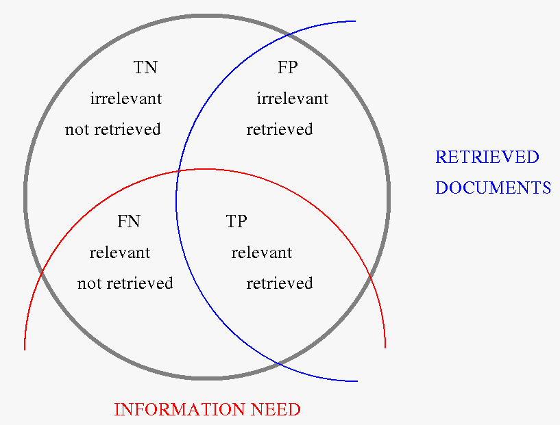
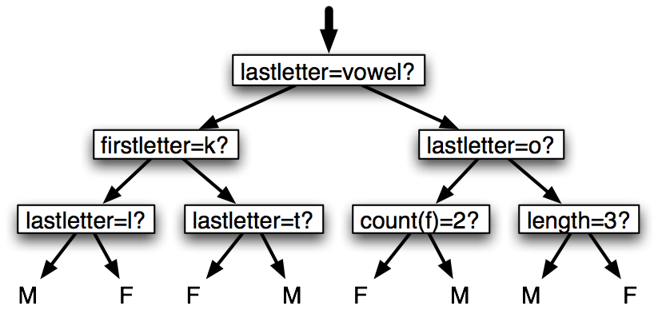
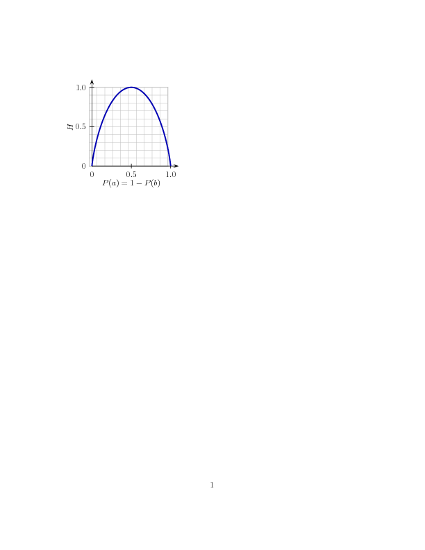

.. -*- mode: rst -*-
.. include:: ../definitions.rst

.. standard global imports

    >>> import nltk, re, pprint
    
.. TODO: cover tf.idf

.. _chap-data-intensive:

=================================
5. Classifying Text Automatically
=================================

.. nomenclature note: training corpus/test corpus or training set/test set??
.. discuss qc corpus
.. explain that segmentation (e.g. tokenization, sentence segmentation) can
   be viewed as a classification task

Detecting patterns is a central part of |NLP|.
Words ending in `-ed`:lx: tend to be past tense verbs (Chapter chap-tag_).
Frequent use of `will`:lx: is indicative of news text (Chapter chap-words_).
These observable patterns |mdash| word structure and word frequency |mdash|
happen to correlate with particular aspects of meaning, such as tense and topic.
But how did we know where to start looking, which aspects of form to associate
with which aspects of meaning? 

The goal of this chapter is to answer the following questions:

#. How can we identify particular features of language data that
   are salient for classifying it?
#. How can we construct models of language that can
   be used to perform language processing tasks automatically?
#. What can we learn about language from these models?

Along the way we will study some important machine learning techniques,
including as decision trees, naive Bayes' classifiers, maximum entropy classifiers.
We will gloss over the mathematical and statistical underpinnings of these
techniques, focusing instead on how and when to use them (see the
further readings section for more technical background). 
Before looking at these methods, we first need to appreciate the
broad scope of this topic.

----------------------------
Everything is Classification
----------------------------

Tagging as Classification
-------------------------

In Chapter chap-tag_ we saw that part-of-speech tagging is a kind of classification.
A bigram tagger chooses the tag to assign to a word based on the identity of
the word and the tag of the previous word.  A regular expression tagger looks
at the internal make-up of the word.  However, the regular expression tagger had
to be hand-crafted.  Instead, we can train a classifier to work out which
suffixes are most informative.  The first step is to define a function to extract
the features |mdash| the observable properties |mdash| of the input that our
classifier will exploit.

    >>> def suffix_features(word, n=3):
    ...     features = {}
    ...     for i in range(1, n+1):
    ...         features["suffix(%d)" % i] = word[-i:]
    ...     return features
    ...
    >>> suffix_features('studied')
    {'suffix(1)': 'd', 'suffix(3)': 'ied', 'suffix(2)': 'ed'}
    >>> suffix_features('if')
    {'suffix(1)': 'f', 'suffix(3)': 'if', 'suffix(2)': 'if'}

The features behave like tinted glasses, highlighting some of the
properties (colors) in our data and making it impossible to see
other properties.
    
    >>> tagged_data = nltk.corpus.brown.tagged_words(categories='news')
    >>> features = [(suffix_features(n), g) for (n,g) in tagged_data]
    >>> size = int(len(tagged_data) * 0.9)
    >>> classifier = nltk.DecisionTreeClassifier.train(features[:size])
    >>> nltk.classify.accuracy(classifier, features[size:])
    0.809864757359

[explain how to access informative features from the classifier,
and learn something about the data.]

.. note:: |TRY|
   Modify the above code to implement a bigram tagger.
   Define ``bigram_features(prevtag, word)`` to put
   its two parameters into a dictionary.  Create a list
   ``features`` by iterating over the bigrams of the tagged
   data, using ``nltk.ibigrams()``, and pulling out the
   previous tag and the current word.  Try using the
   naive Bayes' classifier ``nltk.NaiveBayesClassifier``.

Segmentation as Classification
------------------------------

Encoding this information -- features.  We need to encode this info in
a concrete way.  Use a feature dictionary for each occurrence, mapping
feature names (eg 'prevword') to concrete values (eg a string, int).
Features should have simple values (i.e. not list values).

.. pylisting:: segmentation

   def preprocess(sents):
       tokens = []
       boundaries = []
       for sent in sents:
           for token in sent:
               tokens.append(token)
           boundaries.append(False)
           boundaries[-1] = True
       return (tokens, boundaries)

   def get_instances(tokens, boundaries):
       instances = []
       for i in range(len(tokens)):
           if tokens[i] in ".?!":
               try:
                   instances.append(
                       (dict( upper = tokens[i+1][0].isupper(),
                              abbrev = len(tokens[i-1]) == 1 ),
                        boundaries[i]))
               except IndexError:
                   pass
       return instances     

   >>> tokens, boundaries = preprocess(nltk.corpus.abc.sents())
   >>> data = get_instances(tokens, boundaries)
   >>> train = data[1000:]
   >>> test = data[:1000]
   >>> classifier = nltk.NaiveBayesClassifier.train(train)
   >>> nltk.classify.accuracy(classifier, test)
   0.9960

QC corpus

and more generally, that we can use the frequency of a small
number of diagnostic words in order to automatically guess the genre
of a text (Table brown-types_).  

generally, that the internal structure of words tells us something
about their part of speech.  Detecting and understanding such patterns
is central to many NLP tasks, particularly those that try to access
the meaning of a text.

We have already seen a simple application of classification in the
case of part-of-speech tagging.  Recall that we
devised a regular expression tagger (Section sec-automatic-tagging_)
that assigned part-of-speech tags based on hand-crafted patterns.
We can do a similar task automatically, by training a classifier:

Categorized Corpora
-------------------

Description of the available categorized corpora

Searching Automatically Annotated Data
--------------------------------------

In some cases, we may find that the hand-annotated corpora that are
available are too small to perform the analysis we desire; but that
unannotated corpora do not contain the information we need to perform
a search.  One solution in these cases is to build an automatically
annotated corpus, and then to search that corpus.  

For example, if we wish to search for occurrences of the "way
construction," such as "pushed his way across the crowded room," we
could use pattern such as *VERBed PRONOUN way PREP*.  However, we may
not have a part-of-speech tagged corpus that is sufficiently large to
find enough instances of this construction.  We could therefore build
an automatic part-of-speech tagger using an existing corpus, and then
apply it to a much larger body of text.  Although the automatic
part-of-speech tagger would make occasional errors, we would still be
able to find most of the occurrences of the desired pattern.

When using this technique, it is important to consider possible biases
that might be introduced by the automatic annotation process.  In
particular, the automatic annotator may systematically make an error
that would prevent us from finding an important set of instances for
our pattern.  In order to avoid this problem, you should evaluate the
automatic system's accuracy, and consider what effect that accuracy
might have on your search.  It is also advisable to avoid using an
automatic classifier whose output is closely tied to the type of
construction we are looking for, because doing so increases the
likelihood that a deficiency in the automatic annotator will
systematically block the search process.

Categorizing
------------

Once we've found examples the constructions of interest, we can then
categorize them.  

using two sources of information: content and
context.

Once we've found occurrences of the we're interested in, the next step is
to categorize them.  In general, we're interested in two things:

  - features of the construction itself
  - features of the context that we think are relevant to the phenomenon.

  
Counting
--------

Now that we've got our occurrences coded up, we want to look at how
often different combinations occur.

- we can look for both graded and categorical distictions

  - for categorical distinctions, we don't necessarily require that
    the counts be zero; every rule has its exception.

Example: what makes a name sound male or female?  Walk through it,
explain some features, do some counts using python.  

.. _sec-data-modeling:

-------------
Data Modeling
-------------

Exploratory data analysis helps us to understand the linguistic
patterns that occur in natural language corpora.  Once we have a basic
understanding of those patterns, we can attempt to create `models`:dt:
that capture those patterns.  Typically, these models will be
constructed automatically, using algorithms that attempt to select a
model that accurately describes an existing corpus; but it is also
possible to build analytically motivated models.  Either way, these
explicit models serve two important purposes: they help us to
understand the linguistic patterns, and they can be used to make
predictions about new language data.

The extent to which explicit models can give us insight into
linguistic patterns depends largely on what kind of model is used.
Some models, such as decision trees, are relatively transparent, and
give us direct information about which factors are important in making
decisions, and about which factors are related to one another.  Other
models, such as multi-level neural networks, are much more opaque --
although it can be possible to gain insight by studying them, it
typically takes a lot more work.

But all explicit models can make predictions about new "`unseen`:dt:"
language data that was not included in the corpus used to build the
model.  These predictions can be evaluated to assess the accuracy of
the model.  Once a model is deemed sufficiently accurate, it can then
be used to automatically predict information about new language
data.  These predictive models can be combined into systems that
perform many useful language processing tasks, such as document
classification, automatic translation, and question answering.

What do models tell us?
-----------------------

Before we delve into the mechanics of different models, it's important
to spend some time looking at exactly what automatically constructed
models can tell us about language.

One important consideration when dealing with language models is the
distinction between descriptive models and explanatory models.
Descriptive models capture patterns in the data but they don't
provide any information about *why* the data contains those patterns.
For example, as we saw in Table absolutely_, the synonyms
`absolutely`:lx: and `definitely`:lx: are not interchangeable:
we say `absolutely adore`:lx: not `definitely adore`:lx:,
and `definitely prefer`:lx: not `absolutely prefer`:lx:.
In contrast, explanatory models attempt
to capture properties and relationships that underlie the linguistic patterns.
For example, we might introduce the abstract concept of "polar adjective",
as one that has an extreme meaning, and categorize some adjectives
like `adore`:lx: and `detest`:lx: as polar.  Our explanatory model
would contain the constraint that `absolutely`:lx: can only combine with
polar adjectives, and `definitely`:lx: can only combine with non-polar adjectives.
In summary, descriptive models provide information about correlations
in the data, while explanatory models go further to postulate causal relationships.

Most models that are automatically constructed from a corpus are
descriptive models; in other words, they can tell us what features are
relevant to a given patterns or construction, but they can't
necessarily tell us how those features and patterns relate to one
another.  If our goal is to understand the linguistic patterns, then
we can use this information about which features are related as a
starting point for further experiments designed to tease apart the
relationships between features and patterns.  On the other hand, if
we're just interested in using the model to make predictions (e.g., as
part of a language processing system), then we can use the model to
make predictions about new data, without worrying about the precise
nature of the underlying causal relationships.

Supervised Classification
-------------------------

One of the most basic tasks in data modeling is `classification`:dt:.
In classification tasks, we wish to choose the correct `class
label`:dt: for a given input.  Each input is considered in isolation
from all other inputs, and set of labels is defined in advance.
Some examples of classification tasks are:

.. more compelling, interesting and/or more linguistically-oriented
   examples here:?

* Classify an email as "spam" or "not spam."
* Classify a news document as "sports," "technology," "politics," or "other."
* Classify a name as "male" or "female."
* Classify an occurrence of the word "bank" as "Noun-seaside,"
  "Noun-financial," "Verb-tilt," or "Verb-financial."

.. note:: The basic classification task has a number of interesting
  variants: for example, in multi-class classification, each instance
  may be assigned multiple labels; in open-class classification, the
  set of labels is not defined in advance; and in sequence
  classification, a list of inputs are jointly classified.

Classification models are typically trained using a corpus that
contains the correct label for each input.  This `training corpus`:dt:
is typically constructed by manually annotating each input with the
correct label, but for some tasks it is possible to automatically
construct training corpora.  Classification models that are built
based on training corpora that contain the correct label for each
input are called `supervised`:dt: classification models.

Feature Extraction
------------------

The first step in creating a model is deciding what information about
the input might be relevant to the classification task; and how to
represent that information.  In other words, we must decide which
`features`:dt: of the input are relevant, and how to `encode`:dt:
those features.  Most automatic learning methods restrict features to
have simple value types, such as booleans, numbers, and strings.  But
note that just because a feature has a simple type, does not
necessarily mean that the feature's value is simple to express or
compute; indeed, it is even possible to use very complex and
informative values, such as the output of a second supervised
classifier, as features.

.. _fig-supervised-classification:
.. figure:: ../images/supervised-classification.png
   :scale: 50:150:60

   Supervised Classification.  (a) During training, a feature
   extractor is used to convert each input value to a feature set.
   Pairs of feature sets and labels are fed into the machine learning
   algorithm to generate a model.  (b) During prediction, the same
   feature extractor is used to convert unseen inputs to feature sets.
   These feature sets are then fed into the model, which generates
   predicted labels.
   
For NLTK's classifiers, the features for each input are stored using a
dictionary that maps feature names to corresponding values.  Feature
names are case-sensitive strings that typically provide a short
human-readable description of the feature.  Feature values are
simple-typed values, such as booleans, numbers, and strings.  For
example, if we had built an ``animal_classifier`` model for
classifying animals, then we might provide it with the following
feature set:

>>> animal = {'fur': True, 'legs': 4, 
...           'size': 'large', 'spots': True}
>>> animal_classifier.classify(animal)
'leopard'

Generally, feature sets are constructed from inputs using a `feature
extraction`:dt: function.  This function takes an input value, and
possibly its context, as parameters, and returns a corresponding
feature set.  This feature set can then be passed to the machine
learning algorithm for training, or to the learned model for
prediction.  For example, we might use the following function to
extract features for a document classification task:

.. pylisting:: feature_extractor

    def extract_features(document):
       features = {}
       for word in document:
           features['contains(%s)' % word] = True
       return features

   >>> extract_features(nltk.corpus.brown.words('cj79'))
   {'contains(of)': True, 'contains(components)': True, 
    'contains(some)': True, 'contains(that)': True, 
    'contains(passage)': True, 'contains(table)': True, ...}

In addition to a feature extractor, we need to select or build a
training corpus, consisting of a list of examples and corresponding
class labels.  For many interesting tasks, appropriate corpora have
already been assembled.  Given a feature extractor and a training
corpus, we can train a classifier.  First, we run the feature
extractor on each instance in the training corpus, and building a list
of (featureset, label) tuples.  Then, we pass this list to the
classifier's constructor:

.. XX THIS IS CURRENTLY NOT USING THE CONSTRUCTOR

>>> train = [(extract_features(word), label)
...          for (word, label) in labeled_words]
>>> classifier = nltk.NaiveBayesClassifier.train(train)

The constructed model ``classifier`` can then be used to predict the
labels for unseen inputs:

>>> test_featuresets = [extract_features(word)
...                     for word in unseen_labeled_words]
>>> predicted = classifier.batch_classify(test)

.. note:: When working with large corpora, constructing a single list
   that contains the features of every instance can use up a large
   amount of memory.  In these cases, we can make use of the function
   ``nltk.classify.apply_features``, which returns an object that
   acts like a list but does not store all values in memory:

   >>> train = apply_features(extract_features, labeled_words)
   >>> test = apply_features(extract_features, unseen_words)

Selecting relevant features, and deciding how to encode them for the
learning method, can have an enormous impact on its ability to extract
a good model.  Much of the interesting work in modeling a phenomenon
is deciding what features might be relevant, and how we can represent
them.  Although it's often possible to get decent performance by using
a fairly simple and obvious set of features, there are usually
significant gains to be had by using carefully constructed features
based on an understanding of the task at hand.  

Typically, feature extractors are built through a process of
trial-and-error, guided by intuitions about what information is
relevant to the problem at hand.  It's often useful to start with a
"kitchen sink" approach, including all the features that you can think of,
and then checking to see which features actually appear to be helpful.
However, there are usually limits to the number of features that you
should use with a given learning algorithm -- if you provide too many
features, then the algorithm will have a higher chance of relying on
idiosyncracies of your training data that don't generalize well to new
examples.  This problem is known as `overfitting`:dt:, and can
especially problematic when working with small training sets.

Once a basic system is in place, a very productive method for refining
the feature set is `error analysis`:dt:.  First, the training corpus
is split into two pieces: a training subcorpus, and a `development`:dt:
subcorpus.  The model is trained on the training subcorpus, and then
run on the development subcorpus.  We can then examine individual cases in
the development subcorpus where the model predicted the wrong label, and
try to determine what additional pieces of information would allow it
to make the right decision (or which existing pieces of information
are tricking it into making the wrong decision).  The feature set can
then be adjusted accordingly, and the error analysis procedure can be
repeated, ideally using a different development/training split.

Example: Predicting Name Genders
--------------------------------

In section `Exploratory Data Analysis`_, we looked at some of the
factors that might influence whether an English name sounds more like
a male name or a female name.  Now we can build a simple model for
this classification task.  We'll use the same ``names`` corpus that we
used for exploratory data analysis, divided into a training set and an
evaluation set:

    >>> from nltk.corpus import names
    >>> import random
    >>>
    >>> # Construct a list of classified names, using the names corpus.
    >>> namelist = ([(name, 'male') for name in names.words('male.txt')] + 
    ...             [(name, 'female') for name in names.words('female.txt')])
    >>>
    >>> # Randomly split the names into a test & train set.
    >>> random.shuffle(namelist)
    >>> train = namelist[500:]
    >>> test = namelist[:500]

Next, we'll build a simple feature extractor, using some of the
features that appeared to be useful in the exploratory data analysis.
We'll also throw in a number of features that seem like they might be
useful:

.. pylisting:: gender_features

   def gender_features(name):
       features = {} 
       features["firstletter"] = name[0].lower()
       features["lastletter"] = name[0].lower()
       for letter in 'abcdefghijklmnopqrstuvwxyz':
           features["count(%s)" % letter] = name.lower().count(letter)
           features["has(%s)" % letter] = (letter in name.lower())
       return features

    >>> gender_features('John')
    {'count(j)': 1, 'has(d)': False, 'count(b)': 0, ...}

Now that we have a corpus and a feature extractor, we can train a
classifier.  We'll use a "Naive Bayes" classifier, which will be
described in more detail in section `Naive Bayes Classifiers`_.

.. XX THIS IS CURRENTLY NOT USING THE CONSTRUCTOR

    >>> train_featuresets = [(gender_features(n), g) for (n,g) in train]
    >>> classifier = nltk.NaiveBayesClassifier.train(train_featuresets)

Now we can use the classifier to predict the gender for unseen names:

    >>> classifier.classify(gender_features('Blorgy'))
    'male'
    >>> classifier.classify(gender_features('Alaphina'))
    'female'

And using the test corpus, we can check the overall accuracy of the
classifier across a collection of unseen names with known labels:

    >>> test_featuresets = [(gender_features(n),g) for (n,g) in test]
    >>> print nltk.classify.accuracy(classifier, test_featuresets)
    0.688

Example: Predicting Sentiment
-----------------------------

Movie review domain; ACL 2004 paper by Lillian Lee and Bo Pang.
Movie review corpus included with NLTK.

.. pylisting:: movie-reviews

   import nltk, random

   TEST_SIZE = 500

   def word_features(doc):
       words = nltk.corpus.movie_reviews.words(doc)
       return nltk.FreqDist(words), doc[0]

   def get_data():
       featuresets = apply(word_features, nltk.corpus.movie_reviews.files())
       random.shuffle(featuresets)
       return featuresets[TEST_SIZE:], featuresets[:TEST_SIZE]

   >>> train_featuresets, test_featuresets = get_data()
   >>> c1 = nltk.NaiveBayesClassifier.train(train_featuresets)
   >>> print nltk.classify.accuracy(c1, test_featuresets)
   0.774
   >>> c2 = nltk.DecisionTreeClassifier.train(train_featuresets)
   >>> print nltk.classify.accuracy(c2, test_featuresets)
   0.576
    
Example: Documents By Genre
---------------------------

Initial work on a classifier to use frequency of modal verbs to classify
documents by genre:

.. pylisting:: modals

   import nltk, math
   modals = ['can', 'could', 'may', 'might', 'must', 'will']

   def modal_counts(tokens):
       return nltk.FreqDist(word for word in tokens if word in modals)

   # just the most frequent modal verb
   def modal_features1(tokens):
       return dict(most_frequent_modal = model_counts(tokens).max())

   # one feature per verb, set to True if the verb occurs more than once
   def modal_features2(tokens):
       fd = modal_counts(tokens)
       return dict( (word,(fd[word]>1)) for word in modals)

   # one feature per verb, with a small number of scalar values
   def modal_features3(tokens):
       fd = modal_counts(tokens)
       features = {}
       for word in modals:
           try:
               features[word] = int(-math.log10(float(fd[word])/len(tokens)))
           except OverflowError:
               features[word] = 1000
       return features

   # 4 bins per verb based on frequency
   def modal_features4(tokens):
       fd = modal_counts(tokens)
       features = {}
       for word in modals:
           freq = float(fd[word])/len(tokens)
           for logfreq in range(3,7):
               features["%s(%d)" % (word, logfreq)] = (freq < 10**(-logfreq))
       return features

   >>> genres = ['hobbies', 'humor', 'science_fiction', 'news', 'romance', 'religion'] 
   >>> train = [(modal_features4(nltk.corpus.brown.words(g)[:2000]), g) for g in genres]
   >>> test = [(modal_features4(nltk.corpus.brown.words(g)[2000:4000]), g) for g in genres]
   >>> classifier = nltk.NaiveBayesClassifier.train(train)
   >>> print 'Accuracy: %6.4f' % nltk.classify.accuracy(classifier, test)

Example: Recognizing Textual Entailment
---------------------------------------

Recognizing textual entailment (RTE) is the task of determining
whether a given piece of text *T* entails another text called the
"hypothesis". To date, there have been four RTE Challenges, where
shared development and test data is made available to competing teams.
Here are a couple of examples of Text/Hypothesis pairs from the
Challenge 3 development dataset. The label *True* indicates that the
entailment holds, and *False*, that it fails to hold.

    Challenge 3, Pair 34 (True)
    
      **T**: Parviz Davudi was representing Iran at a meeting of the Shanghai
      Co-operation Organisation (SCO), the fledgling association that
      binds Russia, China and four former Soviet republics of central
      Asia together to fight terrorism.
    
      **H**: China is a member of SCO.

    Challenge 3, Pair 81 (False)

      **T**: According to NC Articles of Organization, the members of LLC
      company are H. Nelson Beavers, III, H. Chester Beavers and Jennie
      Beavers Stewart.

      **H**: Jennie Beavers Stewart is a share-holder of Carolina Analytical
      Laboratory.

It should be emphasised that the relationship between Text and
Hypothesis is not intended to be logical entailment, but rather
whether a human would conclude that the Text provides reasonable
evidence for taking the Hypothesis to be true.

We can treat RTE as a classification task, in which we try to
predict the *True*\ /*False* label for each pair. Although it seems
likely that successful approaches to this task will involve a
combination of parsing, compositional and lexical semantics and real world
knowledge, many early attempts at RTE achieved reasonably good results
with shallow analysis, based on similarity between the Text and
Hypothesis at the word level. In the ideal case, we would expect that if
there is an entailment, then all the information expressed by the Hypothesis
should also be present in the Text. Conversely, if there is information
found in the Hypothesis that is absent from the Text, then there
will be no entailment. We let words (i.e., word types) go proxy for information, and
our features count the degree of word overlap, and the degree to which
there are words in the Hypothesis but not in the Text (captured by the
method ``hyp_extra()``). Not all words are equally important |mdash|
Named Entity mentions such as the names of people, organizations and
places are likely to be more significant, which motivates us to
extract distinct information for ``word``\ s  and ``ne``\ s (Named
Entities). In addition, some high frequency function words are
filtered out as "stopwords".

.. pylisting:: rte_features

    def rte_features(rtepair):
	extractor = RTEFeatureExtractor(rtepair)
	features['word_overlap'] = len(extractor.overlap('word'))
	features['word_hyp_extra'] = len(extractor.hyp_extra('word'))
	features['ne_overlap'] = len(extractor.overlap('ne'))
	features['ne_hyp_extra'] = len(extractor.hyp_extra('ne'))
	return features 

To illustrate the content of these features, we examine some
attributes of the Text/Hypothesis Pair 34 shown earlier:

    >>> rtepair = nltk.corpus.rte.pairs(['rte3_dev.xml'])[33]
    >>> extractor = RTEFeatureExtractor(rtepair)
    >>> print extractor.text_words
    set(['Russia', 'Organisation', 'Shanghai', 'Asia', 'four', 'at',
    'operation', 'SCO', ...])
    >>> print extractor.hyp_words
    set(['member', 'SCO', 'China'])
    >>> print extractor.overlap('word')
    set([])
    >>> print extractor.overlap('ne')
    set(['SCO', 'China'])
    >>> print extractor.hyp_extra('word')
    set(['member'])  

These features indicate that all important words in the Hypothesis are
contained in the Text, and thus there is some evidence for labelling this
as *True*.

.. need to decide how to import RTEFeatureExtractor

The module ``nltk.classify.rte_classify`` reaches just over 58%
accuracy on the combined RTE test data using methods like these. Although
this figure is not very impressive, it is surprisingly hard to achieve
much better results without considerable effort, and the performance
is comparable with that achieved by systems submitted for RTE
Challenge 1.

.. check the official challenge results
     

----------
Evaluation
----------

In order to decide whether a classification model is accurately
capturing a pattern, we must evaluate that model.  The result of this
evaluation is important for deciding how trustworthy the model is, and
for what purposes we can use it.  Evaluation can also be a useful tool
for guiding us in making future improvements to the model.

.. There are several techniques that can be used to measure how well a
   system does, and each has its pluses and minuses.

Evaluation Set
--------------

Most evaluation techniques calculate a score for a model by comparing
the labels that it generates for the inputs in an `evaluation set`:dt:
with the correct labels for those inputs.  This evaluation set
typically has the same format as the training corpus.  However, it is
very important that the evaluation set be distinct from the training
corpus: if we simply re-used the training corpus as the evaluation
set, then a model that simply memorized its input, without learning
how to generalize to new examples, would receive very high scores.
Similarly, if we use a development corpus, then it must be distinct
from the evaluation set as well.  Otherwise, we risk building a model
that does not generlize well to new inputs; and our evaluation scores
may be misleadingly high.

If we are actively developing a model, by adjusting the features that
it uses or any hand-tuned parameters, then we may want to make use of
two evaluation sets.  We would use the first evaluation set while
developing the model, to evaluate whether specific changes to the
model are beneficial.  However, once we've made use of this first
evaluation set to help develop the model, we can no longer trust that
it will give us an accurate idea of how well the model would perform
on new data.  We therefore save the second evaluation set until our
model development is complete, at which point we can use it to check
how well our model will perform on new input values.

When building an evaluation set, we must be careful to ensure that is
sufficiently different from the training corpus that it will
effectively evaluate the performance of the model on new inputs.  For
example, if our evaluation set and training corpus are both drawn from
the same underlying data source, then the results of our evaluation
will only tell us how well the model is likely to do on other texts
that come from the same (or a similar) data source.  

.. Which data should be used?  (eg random sampling vs single chunk)

Accuracy
--------

The simplest metric that can be used to evaluate a classifier,
`accuracy`:dt:, measures the percentage of inputs in the evaluation
set that the classifier correctly labeled.  For example, a name gender
classifier that predicts the correct name 60 times in an evaluation
set containing 80 names would have an accuracy of 60/80 = 75%.  The
function ``nltk.classify.accuracy`` can be used to calculate the
accuracy of a classifier model on a given evaluation set:

   >>> classifier = nltk.NaiveBayesClassifier.train(train)
   >>> print 'Accuracy: %4.2f' % nltk.classify.accuracy(classifier, test)
   0.75

When interpreting the accuracy score of a classifier, it is important
to take into consideration the frequencies of the individual class
labels in the evaluation set.  For example, consider a classifier that
determines the correct word sense for each occurance of the word
"bank."  If we evaluate this classifier on financial newswire text,
then we may find that the ``financial-institution`` sense is used 19
times out of 20.  In that case, an accuracy of 95% would hardly be
impressive, since we could achieve that accuracy with a model that
always returns the ``finanical-institution`` sense.  However, if we
instead evaluate the classifier on a more balanced corpus, where the
most frequent word sense has a frequency of 40%, then a 95% accuracy
score would be a much more positive result.

- Simplest metric: accuracy.  Describe what it is, where it can be
  limited in usefulness.

.. SB: examples of meaningless accuracy scores, when irrelevant material
       is included; e.g. let X be the event that a document is on a particular
       topic; the presence of a large number of irrelevant documents can
       falsely exaggerate the accuracy score.  Even a majority class classifier
       that scores every document as irrelevant will get a high accuracy score.

Precision and Recall
--------------------

Another instance where accuracy scores can be misleading is in
"search" tasks, such as information retrieval, where we are attempting
to find documents that are relevant to a particular task.  Since the
number of irrelevant documents far outweighs the number of relevant
documents, the accuracy score for a model that labels every document
as irrelevant would be very close to 100%.  

.. _fig-precision-recall:

   True and False Positives and Negatives

It is therefore conventional to use a different set of measures for
search tasks, based on the number of items in each of the four
categories shown in Figure fig-precision-recall_:

- `True positives`:dt: are relevant items that we correctly identified
  as relevant.
- `True negatives`:dt: are relevant items that we correctly identified
  as irrelevant.
- `False positives`:dt: (or `Type I errors`:dt:) are irrelevant items
  that we incorrectly identified as relevant.
- `False negatives`:dt: (or `Type II errors`:dt:) are relevant items
  that we incorrectly identified as irrelevant.

Given these four numbers, we can define the following metrics:

- `Precision`:dt:, which indicates how many of the items that we
  identified were relevant, is `TP/(TP+FP)`:math:.
- `Recall`:dt:, which indicates how many of the relevant items that we
  identified, is `TP/(TP+FN)`:math:.
- The `F-Measure`:dt: (or `F-Score`:dt:), which combines the precision
  and recall to give a single score, is defined to be the harmonic
  mean of the precision and recall: `2/(1/Precision+1/Recall)`:math:.

Confusion Matrices
------------------

When performing classification tasks with three or more labels, it can
be informative to subdivide the errors made by the model based on
which types of mistake it made.  A `confusion matrix`:dt: is a table
where each cell `[i,j]`:math: indicates how often label `j`:math: was
predicted when the correct label was `i`:math:.  Thus, the diagonal
entries (i.e., cells `[i,i]`:math:) indicate labels that were
correctly predicted; and the off-diagonal entries indicate errors.  In
the following example, we display a confusion matrix for a test
sequence that contains two errors.

>>> reference = 'DET NN VB DET JJ NN NN IN DET NN'.split()
>>> guess     = 'DET VB VB DET NN NN NN IN DET NN'.split()
>>> cm = nltk.ConfusionMatrix(reference, guess)
        | D         |
        | E I J N V |
        | T N J N B |
    ----+-----------+
    DET |<3>. . . . |
     IN | .<1>. . . |
     JJ | . .<.>1 . |
     NN | . . .<3>1 |
     VB | . . . .<1>|
    ----+-----------+
    (row = reference; col = test)

The confusion matrix indicates that the errors were a substitution of
NN for JJ; and of VB for NN.  (Note that periods (``.``) are used to
indicate cells whose value is 0; and that the diagonal cells are
marked with angle brackets.)

.. Give this example -- upper-left corner of baseline tagger's cm?
         |  N                       B                               
         |  o           A           E  B  B  B           D     D  D 
         |  n  '        B  A  A  B  D  E  E  E  C  C  C  O  D  T  T 
         |  e  '  ,  .  X  P  T  E  Z  N  R  Z  C  D  S  D  T  I  S 
    -----+----------------------------------------------------------
    None | <.> .  .  .  1  1  .  .  .  .  .  .  .  .  .  1  .  .  2 
      '' |  .<10> .  .  .  .  .  .  .  .  .  .  .  .  .  .  .  .  . 
       , |  .  . <9> .  .  .  .  .  .  .  .  .  .  .  .  .  .  .  . .
       . |  .  .  . <9> .  .  .  .  .  .  .  .  .  .  .  .  .  .  . 
     ABX |  .  .  .  . <.> .  .  .  .  .  .  .  .  .  .  .  .  .  . 
      AP |  .  .  .  .  . <1> .  .  .  .  .  .  .  .  .  .  .  .  . 
      AT |  .  .  .  .  .  .<29> .  .  .  .  .  .  .  .  .  .  .  . .
      BE |  .  .  .  .  .  .  . <1> .  .  .  .  .  .  .  .  .  .  . 
    BEDZ |  .  .  .  .  .  .  .  . <3> .  .  .  .  .  .  .  .  .  . 
     BEN |  .  .  .  .  .  .  .  .  . <1> .  .  .  .  .  .  .  .  . 
     BER |  .  .  .  .  .  .  .  .  .  . <2> .  .  .  .  .  .  .  . .
     BEZ |  .  .  .  .  .  .  .  .  .  .  . <1> .  .  .  .  .  .  . 
      CC |  .  .  .  .  .  .  .  .  .  .  .  .<10> .  .  .  .  .  . 
     ...                    .         .        .
   -----+----------------------------------------------------------
   (row = reference; col = test)

Cross-Validation
----------------

In order to evaluate our models, we must reserve a portion of the
annotated data for the test set.  If the test set is too small, then
our evaluation may not be accurate.  However, making the test set
larger usually means making the training set smaller, which can have a
significant impact on performance if a limited amount of annotated
data is available.  

One solution to this problem is to perform multiple evaluations on
different test sets, and then to combine the scores from those
evaluations.  This technique is known as `cross-validation`:dt:.  In
particular, we subdivide the original corpus into `N`:math:
subcorpora.  For each of these subcorpora, we train a model using all
of the data *except* the data in that subcorpus; and then test that
model on the subcorpus.  Even though the individual subcorpora might
be too small to give accurate evaluation scores on their own, the
combined evaluation score is based on a large amount of data, and is
therefore quite reliable.

A second, and equally important, advantage of using cross-validation
is that it allows us to examine how widely the performance varies
across different training sets.  If we get very similar scores for all
`N`:math: training sets, then we can be fairly confident that the
score is accurate.  On the other hand, if the scores of the `N`:math:
training sets varies wildly, then we should probably be skeptical
about the accuray of the evalution score.  

.. mention statistical significance tests explicitly here?

Error Analysis
--------------

The metrics above give us a general feel for how well a system does,
but doesn't tell us much about why it gets that performance .. are
there patterns in what it gets wrong?  If so, that can help us to
improve the system, or if we can't improve it, then at least make us
more aware of what the limitations of the system are, and what kind of
data it will produce more reliable or less reliable results for.

Error analysis should always be performed on a development subcorpus,
seperate from the test set, to ensure that the test set can still be
used to evaluate the model.  The first step in performing error
analysis is to run the model on the development subcorpus, and print
out information about the inputs where the model generated the
incorrect label.  This listing can then be examined, in an attempt to
find patterns in the errors made by the model, to determine what
additional pieces of information would allow it to make the right
decision, or which existing pieces of information are tricking it into
making the wrong decision.  The feature set can then be adjusted
accordingly, and the error analysis repeated until no more progress is
made.

----------------------
Classification Methods
----------------------

In this section, we'll take a closer took at three machine learning
methods that can be used to automatically build classification models:
Decision Trees, Naive Bayes classifiers, and Maximum Entropy
classifiers.  As we've seen, it's possible treat these learning
methods as black boxes, simply training models and using them for
prediction without understanding how they work.  But there's a lot to be learned
from taking a closer look at how these learning methods select models
based on the data in a training corpus.  An understanding of these
methods can help guide our selection of appropriate features, and
especially our decisions about how those features should be encoded.
And an understanding of the generated models can allow us to extract
useful information about which features are most informative, and how
those features relate to one another.

--------------
Decision Trees
--------------

.. Note that they haven't necessarily seen syntax trees before this, so
   it may seem odd to them (or at least not obvious) that these "trees"
   are upside down.

A `decision tree`:dt: is a tree-structured flowchart used to choose
labels for input values.  This flowchart consists of `decision
nodes`:dt:, which check feature values, and `leaf nodes`:dt:, which
assign labels.  To choose the label for an input value, we begin at
the flowchart's initial decision node, known as its `root node`:dt:.
This node contains a condition that checks one of the input value's
features, and selects a branch based on that feature's value.
Following the branch that describes our input value, we arrive at a
new decision node, with a new condition on the input value's features.
We continue following the branch selected by each node's condition,
until we arrive at a leaf node, which provides a label for the input
value.  Figure fig-decision-tree_ shows an example decision tree model for
the name gender task.

.. _fig-decision-tree:

   Decision Tree model for the name gender task.  Note that tree
   diagrams are conventially drawn "upside down," with the root at the
   top, and the leaves at the bottom.

Once we have a decision tree, it is thus fairly streight forward to
use it to assign labels to new input values.  What's less streight
forward is how we can build a decision tree that models a given
training corpus.  But before we look at the learning algorithm for
building decision trees, we'll consider a simpler task: picking the
best "decision stump" for a corpus.  A `decision stump`:dt: is is a
decision tree with a single node, that decides how to classify inputs
based on a single feature.  It contains one leaf for each possible
feature value, specifying the class label that should be assigned to
inputs whose features have that value.  In order to build a decision
stump, we must first decide which feature should be used.  The
simplest method is to just build a decision stump for each possible
feature, and see which one achieves the highest accuracy on the
training data; but we'll discuss some other alternatives below.  Once
we've picked a feature, we can build the decision stump by assigning a
label to each leaf based on the most frequent label for the selected
examples in the training corpus (i.e., the examples where the selected
feature has that value).

Given the algorithm for choosing decision stumps, the algorithm for
growing larger decision trees is straightforward.  We
begin by selecting the overall best decision stump for the corpus.  We
then check the accuracy of each of the leaves on the training corpus.
Any leaves that do not achieve sufficiently good accuracy are then
replaced by new decision stumps, trained on the subset of the training
corpus that is selected by the path to the leaf.  For example, we
could grow the decision tree in Figure fig-decision-tree_ by replacing the
leftmost leaf with a new decision stump, trained on the subset of the
training corpus names that do not start with a "k" or end with a vowel
or an "l."

Entropy and Information Gain
----------------------------

As was mentioned before, there are a number of methods that can be
used to select the most informative feature for a decision stump.  One
popular alternative is to use `information gain`:dt:, a measure of how
much more organized the input values become when we divide them up
using a given feature.  To measure how disorganized the original set
of input values are, we calculate entropy of their labels, which will
be high if the input values have highly varied labels, and low if many
input values all have the same label.  In particular, entropy is
defined as the sum of the probability of each label times the log
probability of that same label:

:math:`H` = :math:`|sum|`\ :sub:`l |in| labels`\
:math:`P(l)` |times| :math:`log`\ :sub:`2`\ :math:`P(l)`.

.. _fig-entropy:

   The entropy of labels in the name gender prediction task, as a
   function of the percentage of names in a given set that are male.

For example, Figure fig-entropy_ shows how the entropy of labels in
the name gender prediction task depends on the ratio of male to female
names.  Note that if most input values have the same label (e.g., if
P(male) is near 0 or near 1), then entropy is be low.  In particular,
labels that have low frequency do not contribute much to the entropy
(since :math:`P(l)` is low); and labels with high frequency also do
not contribute much to the entropy (since :math:`log`\ :sub:`2`\
:math:`P(l)` is be low).  On the other hand, if the input values have
a wide variety of labels, then there are many labels with a "medium"
frequency, where neither :math:`P(l)` nor :math:`log`\ :sub:`2`\
:math:`P(l)` is low, so the entropy is high.

.. pylisting:: entropy

    import math
    def entropy(labels):
       probs = [freqdist.freq(l) for l in nltk.FreqDist(labels)]
       return -sum([p * math.log(p,2) for p in probs])

    >>> entropy(['male', 'male', 'male', 'male'])
    0.0
    >>> entropy(['male', 'female', 'male', 'male'])
    0.811278124459
    >>> entropy(['female', 'male', 'female', 'male'])
    1.0
    >>> entropy(['female', 'female', 'male', 'female'])
    0.811278124459
    >>> entropy(['female', 'female', 'female', 'female'])
    0.0

Once we have calculated the entropy of the original set of input
values' labels, we can figure out how much more organized the labels
become once we apply the decision stump.  To do so, we calculate the
entropy for each of the decision stump's leaves, and take the average
of those leaf entropy values (weighted by the number of samples in
each leaf).  The information gain is then equal to the original
entropy minus this new, reduced entropy.  The higher the information
gain, the better job the decision stump does of dividing the input
values into coherent groups, so we can build decision trees by
selecting the decision stumps with the highest information gain.

Another consideration for decision trees is efficiency.  The simple
algorithm for selecting decision stumps described above must construct
a candidate decision stump for every possible feature; and this
process must be repeated for every node in the constructed decision
tree.  A number of algorithms have been developed to cut down on the
training time by storing and reusing information about previously
evaluated examples.  <<references>>.

Decision trees have a number of useful qualities.  To begin with,
they're simple to understand, and easy to interpret.  This is
especially true near the top of the decision tree, where it is usually
possible for the learning algorithm to find very useful features.
Decision trees are especially well suited to cases where many
hierarchical categorical distinctions can be made.  For example,
decision trees can be very effective at modelling phylogeny trees.

However, decision trees also have a few disadvantages.  One problem is
that, since each branch in the decision tree splits the training data,
the amount of training data available to train nodes lower in the tree
can become quite small.  As a result, these lower decision nodes may
`overfit`:dt: the training corpus, learning patterns that reflect
idiosynracies of the training corpus, rather than genuine patterns in
the underlying problem.  One solution to this problem is to stop
dividing nodes once the amount of training data becomes too small.
Another solution is to grow a full decision tree, but then to
`prune`:dt: decision nodes that do not improve performance on a
development corpus.

A second problem with decision trees is that they force features to be
checked in a specific order, even when features may act relatively
independently of one another.  For example, when classifying documents
into topics (such as sports, automotive, or murder mystery), features
such as ``hasword(football)`` are highly indicative of a specific
label, regardless of what other the feature values are.  Since there
is limited space near the top of the decision tree, most of these
features will need to be repeated on many different branches in the
tree.  And since the number of branches increases exponentially as we
go down the tree, the amount of repetition can be very large.

A related problem is that decision trees are not good at making use of
features that are weak predictors of the correct label.  Since these
features make relatively small incremental improvements, they tend to
occur very low in the decision tree.  But by the time the decision
tree learner has descended far enough to use these features, there is
not enough training data left to reliably determine what effect they
should have.  If we could instead look at the effect of these features
across the entire training corpus, then we might be able to make some
conclusions about how they should affect the choice of label.

The fact that decision trees require that features be checked in a
specific order limits their ability to make use of features that are
relatively independent of one another.  The Naive Bayes classification
method, which we'll discuss next, overcomes this limitation by
allowing all features to act "in parallel."

Naive Bayes Classifiers
-----------------------

In `Naive Bayes`:dt: classifiers, every feature gets a say in
determining which label should be assigned to a given input value.  To
choose a label for an input value, the Naive Bayes classifier begins
by calculating the `prior probability`:dt: of each label, which is
determined by checking frequency of each label in the training corpus.
The contribution from each feature is then combined with this prior
probability, to arrive at a likelihood estimate for each label.  The
label whose likelihood estimate is the highest is then assigned to the
input value.  Figure fig-naive-bayes-triangle_ illustrates this process.

.. I go back and forth on whether we should include a figure like this
   one.  I think it gives a good high-level feeling of what's going
   on, but the details don't really line up with the algorithm's 
   specifics, and it takes a good amount of work to explain the figure.

.. _fig-naive-bayes-triangle:
.. figure:: ../images/naive-bayes-triangle.png
   :scale: 30:100:30

   An abstract illustration of the procedure used by the Naive Bayes
   classifier to choose the topic for a document.  In the training
   corpus, most documents are automotive, so the classifier starts out
   at a pointer closer to the "automative" label.  But it then
   considers the effect of each feature.  In this example, the input
   document contains the word "dark," which is a weak indicator for
   murder mysteries; but it also contains the word "football," which
   is a strong indicator for sports documents.  After every feature
   has made its contribution, the classifier checks which label it is
   closest to, and assigns that label to the input.

Individual features make their contribution to the overall decision by
"voting against" labels that don't occur with that feature very often.
In particular, the likelihood score for each label is reduced by
multiplying it by the probability that an input value with that label
would have the feature.  For example, if the word "run" occurs in 12%
of the sports documents, 10% of the murder mystery documents, and 2%
of the automotive documents, then the likelihood score for the sports
label will be multiplied by 0.12; the likelihood score for the murder
mystery label will be multiplied by 0.1; and the likelihood score for
the automotive label will be multiplied by 0.02.  The overall effect
will be to reduce the score of the murder mystery label slightly more
than the score of the sports label; and to significantly reduce the
automotive label with respect to the other two labels.  This overall
process is illustrated in Figure fig-naive-bayes-bargraph_.

.. _fig-naive-bayes-bargraph:
.. figure:: ../images/naive_bayes_bargraph.png
   :scale: 30:120:30

   Calculating label likelihoods with Naive Bayes.  Naive Bayes begins
   by calculating the prior probability of each label, based on how
   frequently each label occurs in the training data.  Every feature
   then contributes to the likelihood estimate for each label, by
   multiplying it by the probability that input values with that label
   will have that feature.  The resulting likelihood score can be
   thought of as an estimate of the probability that a randomly
   selected value from the training corpus would have both the given
   label and the set of features, assuming that the feature
   probabilities are all independent.

Underlying Probabilistic Model
------------------------------

Another way of understanding the Naive Bayes classifier is that it
chooses the most likely label for an input, under the assumption that
every input value is generated by first choosing a class label for
that input value, and then generating each feature, entirely
independent of every other feature.  Of course, this assumption is
unrealistic: features are often highly dependent on one another in
ways that don't just reflect differences in the class label.  We'll
return to some of the consequences of this assumption at the end of
this section.  But making this simplifying assumption makes it much
easier to combine the contributions of the different features, since
we don't need to worry about how they should interact with one
another.

.. _fig-naive-bayes-graph:
.. figure:: ../images/naive_bayes_graph.png
   :scale: 30:120:30

   A `Bayesian Network Graph`:dt: illustrating the generative process
   that is assumed by the Naive Bayes classifier.  To generate a
   labeled input, the model first chooses a label for the input; and
   then it generates each of the input's features based on that label.
   Every feature is assumed to be entirely independent of every other
   feature, given the label.

Based on this assumption, we can calculate an expression for
:math:`P(label|features)`, the probability that an input will have a
particular label, given that it has a particular set of features.  To
choose a label for a new input, we can then simply pick the label
:math:`l` that maximizes :math:`P(l|features)`.

To begin, we note that :math:`P(label|features)` is equal to the
probability that an input has a particular label *and* the specified
set of features, divided by the probability that it has the specified
set of features:

:math:`P(label|features) = P(features, label)/P(features)`

Next, we note that :math:`P(features)` will be the same for every
choice of label, so if we are simply interested in finding the most
likely label, it suffices to calculate :math:`P(features, label)`,
which we'll call the label likelihood.

.. Note:: If we want to generate a probability estimate for each
   label, rather than just choosing the most likely label, then the
   easiest way to compute P(features) is to simply calculate the sum
   over labels of P(features, label):

   :math:`P(features)` =
   :math:`|sum|`\ 
   :sub:`l \in| labels` \
   :math:`P(features, label)``

The label likelihood can be expanded out as the probability of the
label times the probability of the features given the label:

`P(features, label) = P(label)`:math: |times| `P(features|label)`:math:

Furthermore, since the features are all independent of one another
(given the label), we can seperate out the probability of each
individual feature:

:math:`P(features, label)` = :math:`P(label)` |times| |prod|\ :sub:`f \in| features`\ :math:`P(f|label)``

This is exactly the equation we discussed above for calculating the
label likelihood: :math:`P(label)` is the prior probability for a
given label, and each :math:`P(f|label)` is the contribution of a single
feature to the label likelihood.

Zero Counts and Smoothing
-------------------------

The simplest way to calculate :math:`P(f|label)`, the contribution of a
feature `f` toward the label likelihood for a label `label`, is to
take the percentage of training instances with the given label that
also have the given feature:

:math:`P(f|label) = count(f, label) / count(label)`

However, this simple approach can become problematic when a feature
*never* occurs with a given label in the training corpus.  In this
case, our calculated value for :math:`P(f|label)` will be zero, which will
cause the label likelihood for the given label to be zero.  Thus, the
input will never be assigned this label, regardless of how well the
other features fit the label.

The basic problem here is with our calculation of :math:`P(f|label)`, the
probability that an input will have a feature, given a label.  In
particular, just because we haven't seen a feature/label combination
occur in the training corpus, doesn't mean it's impossible for that
combination to occur.  For example, we may not have seen any murder
mystery documents that contained the word "football," but we wouldn't
want to conclude that it's completely impossible for such documents to
exist.  

Thus, although :math:`count(f,label)/count(label)` is a good estimate for
:math:`P(f|label)` when :math:`count(f, label)` is relatively high, this
estimate becomes less reliable when :math:`count(f)` becomes smaller.
Therefore, when building Naive Bayes models, we usually make use of
more sophisticated techniques, known as `smoothing`:dt: techniques,
for calculating :math:`P(f|label)`, the probability of a feature given a
label.  For example, the "Expected Likelihood Estimation" for the
probability of a feature given a label basically adds 0.5 to each
:math:`count(f,label)` value; and the "Heldout Estimation" uses a heldout
corpus to calculate the relationship between feature freequencies and
feature probabilities.  For more information on smoothing techniques,
see <<ref -- manning & schutze?>>.

Non-Binary Features
-------------------

We have assumed here that each feature is binary -- in other words
that each input either has a feature or does not.  Label-valued
features (e.g., a color feature which could be red, green, blue,
white, or orange) can be converted to binary features by replacing
them with features such as "color-is-red".  Numeric features can be
converted to binary features by `binning`:dt:, which replaces them with
features such as "4<x<6".  

Another alternative is to use regression methods to model the
probabilities of numeric features.  For example, if we assume that the
height feature has a bell curve distribution, then we could estimate
P(height|label) by finding the mean and variance of the heights of the
inputs with each label.  In this case, :math:`P(f=v|label)` would not
be a fixed value, but would vary depending on the value of `v`.

The Naivite of Independence
---------------------------

The reason that Naive Bayes classifiers are called "naive" is that
it's unreasonable to assume that all features are independent of one
another (given the label).  In particular, almost all real-world
problems contain features with varying degrees of dependence on one
another.  If we had to avoid any features that were dependent on one
another, it would be very difficult to construct good feature sets
that provide the required information to the machine learning
algorithm.

So what happens when we ignore the independence assumption, and use
the Naive Bayes classifier with features that are not independent?
One problem that arises is that the classifier can end up
"double-counting" the effect of highly correlated features, pushing
the classifier closer to a given label than is justified.

To see how this can occur, consider a name gender classifier that
contains two identical features, :math:`f`\ :sub:`1` and :math:`f`\
:sub:`2`.  In other words, :math:`f`\ :sub:`2` is an exact copy of
:math:`f`\ :sub:`1`, and contains no new information.  Nevertheless,
when the classifier is considering an input, it will include the
contribution of both :math:`f`\ :sub:`1` and :math:`f`\ :sub:`2` when
deciding which label to choose.  Thus, the information content of
these two features is given more weight than it should be.

Of course, we don't usually build Naive Bayes classifiers that contain
two identical features.  However, we do build classifiers that contain
features which are dependent on one another.  For example, the
features ``ends-with(a)`` and ``ends-with(vowel)`` are dependent on
one another, because if an input value has the first feature, then it
must also have the second feature.  For features like these, the
duplicated information may be given more weight than is justified by
the training corpus.

The Cause of Double-Counting
----------------------------

The basic problem that causes this double-counting issue is that
during training, feature contributions are computed seperately; but
when using the classifier to choose labels for new inputs, those
feature contributions are combined.  One solution, therefore, is to
consider the possible interactions between feature contributions
during training.  We could then use those interactions to adjust the
contributions that individual features make.

To make this more precise, we can rewrite the equation used to
calculate out the likelihood of a label, seperating out the
contribution made by each feature (or label):

.. .. _parameterized-naive-bayes:

:math:`P(features, label) = w[label]` |times| |prod|\ :sub:`f |in| features` :math:`w[f, label]`

Here, :math:`w[label]` is the "starting score" for a given label; and
:math:`w[f, label]` is the contribution made by a given feature
towards a label's likelihood.  We call these values :math:`w[label]`
and :math:`w[f, label]` the `parameters`:dt: or `weights`:dt: for the
model.  Using the Naive Bayes algorithm, we set each of these
parameters independently:

:math:`w[label] = P(label)`

:math:`w[f, label] = P(f|label)`

However, in the next section, we'll look at a classifier that
considers the possible interactions between these parameters when
choosing their values.

---------------------------
Maximum Entropy Classifiers
---------------------------

The `Maximum Entropy`:dt: classifier uses a model that is very similar
to the model used by the Naive Bayes classifier.  But rather than
using probabilities to set the model's parameters, it uses search
techniques to find a set of parameters that will maximize the
performance of the classifier.  In particular, it looks for the set of
parameters that maximizes the `total likelihood`:dt: of the training
corpus, which is defined as:

``\sum_{(x) in corpus} P(label(x)|features(x))``

Where ``P(label|features)``, the probability that an input whose
features are ``features`` will have class label ``label``, is defined as:
                              
`P(label|features) = P(label, features) / sum_{label} P(label, features)`

Because of the potentially complex iteractions between the effects of
related features, there is no way to directly calculate the model
parameters that maximize the likelihood of the training corpus.
Therefore, Maximium Entropy classifiers choose the model paremeters
using `iterative optimization`:dt: techniques, which initialze the
model's parameters to random values, and then repeatedly refine those
parameters to bring them closer to the optimal solution.  These
iterative optimization techniques guarantee that each refinement of
the parameters will bring them closer to the optimal values; but do
not necessarily provide a means of determining when those optimal
values have been reached.  Because the parameters for Maximum Entropy
classifiers are seleced using iterative optimization techniques, they
can take a long time to learn.  This is especially true when the size
of the training corpus, the number of features, and the number of
labels are all large.

.. note:: Some iterative optimization techniques are much faster than
   others.  When training Maximum Entropy models, avoid the use of
   Generalized Iterative Scaling (GIS) or Improved Iterative Scaling
   (IIS), which are both considerably slower than the Conjugate
   Gradient (CG) and the BFGS optimization methods.

.. For related work section:?
   The use of iterative optimization techniques to find the parameters
   that maximize the performance of a model is quite common in machine
   learning.  

The Maximum Entropy Model
-------------------------

The Maximum Entropy classifier model is a generalization of the model
used by the Naive Bayes classifier.  Like the Naive Bayes model, the
Maximum Entropy classifier calculates the likelihood of each label for
a given input value by multiplying together the parameters that are
applicable for the input value and label.  The Naive Bayes classifier
model defines a parameter for each label, specifying its prior
probability; and a parameter for each (feature, label) pair,
specifying the contribution of individual features towards a label's
likelihood.

In contrast, the Maximum Entropy classifier model leaves it up to the
user to decide what combinations of labels and features should receive
their own parameters.  In particular, it is possible to use a single
parameter to associate a feature with more than one label; or to
associate more than one feature with a given label.  This can
sometimes be used to allow the model to "generalize" over some of the
differences between related labels or features.

Each combination of labels and features that receives its own
parameter is called a `joint-feature`:dt:.  Note that joint-features
are properties of *labeled* values, whereas (simple) features are
properties of *unlabeled* values.  

.. note:: In literature that describes and discusses Maximum Entropy
   models, the term "features" is often used to refer to
   joint-features.  The term `contexts`:dt: is used to refer to what
   we have been calling (simple) features.

Typically, the joint-features that are used to construct Maximum
Entropy models exactly mirror those that are used by the Naive Bayes
model.  In particular, a joint-feature is defined for each label,
corresponding to `w[label]`:math:; and for each combination of
(simple) feature and label, corresponding to `w[f, label]`:math:.
Given the joint-features for a Maximum Entropy model, the score
assigned to a label for a given input is simply the product of the
parameters associated with the joint-features that apply to that input
and label:

.. .. _parameterized-maxent:

:math:`P(input, label) =` |prod|\ :sub:`joint-features(input,label)` :math:`w[joint-feature]`

Maximizing Entropy
------------------

The intuition that motivates Maximum Entropy classification is that we
should build a model that captures the frequencies of individual
joint-features; but that does not make any unwarranted assumptions.
An example will help to illustrate this principle.

Suppose we are assigned the task of picking the correct word sense for
a given word, from a list of ten possible senses (labeled A-J).  At
first, we are not told anything more about the word or the senses.
There are many probability distributions that we could choose for the
ten senses, such as:

.. |d1| replace:: `(i)`
.. |d2| replace:: `(ii)`
.. |d3| replace:: `(iii)`
.. |d4| replace:: `(iv)`
.. |d5| replace:: `(v)`
.. |d6| replace:: `(vi)`
.. |d7| replace:: `(vii)`

.. table::

   ==== ===== ===== ===== ===== ===== ===== ===== ===== ===== =====
        A     B     C     D     E     F     G     H     I     J  
   ==== ===== ===== ===== ===== ===== ===== ===== ===== ===== =====
   |d1|  10%   10%   10%   10%   10%   10%   10%   10%   10%   10% 
   |d2|   5%   15%    0%   30%    0%    8%   12%    0%    6%   24%
   |d3|   0%  100%    0%    0%    0%    0%    0%    0%    0%    0%
   ==== ===== ===== ===== ===== ===== ===== ===== ===== ===== =====

Although any of these distributions *might* be correct, we are likely
to choose distribution |d1|, because without any more information,
there is no reason to believe that any word sense is more likely than
any other.  On the other hand, distributions |d2| and |d3| reflect
assumptions that are not supported by what we know.

One way to capture this intuition that distribution |d1| is more "fair"
than the other two is to make use of the concept of entropy.  In the
discussion of decision trees, we described entropy as a measure of how
"disorganized" a set of labels was.  In particular, if a single label
dominates, then entropy is low; but if the labels are more evenly
distributed, then entropy is high.  In our example, we chose
distribution |d1| because the labels' probabilities are evenly
distributed -- in other words, because its entropy is high.  In
general, the `Maximum Entropy principle`:dt: states that, among the
distributions that are consistent with what we know, we should choose
the distribution whose entropy is highest.

Next, suppose that we are told that sense A is used 55% of the time.
Once again, there are many distributions that are consistent with this
new piece of information, such as:

.. table::

   ==== ===== ===== ===== ===== ===== ===== ===== ===== ===== =====
        A     B     C     D     E     F     G     H     I     J  
   ==== ===== ===== ===== ===== ===== ===== ===== ===== ===== =====
   |d4|  55%   45%    0%    0%    0%    0%    0%    0%    0%    0% 
   |d5|  55%    5%    5%    5%    5%    5%    5%    5%    5%    5% 
   |d6|  55%    3%    1%    2%    9%    5%    0%   25%    0%    0%
   ==== ===== ===== ===== ===== ===== ===== ===== ===== ===== =====

But again, we will likely choose the distribution that makes the
fewest unwarranted assumptions -- in this case, distribution |d5|.

Finally, suppose that we are told that the word "up" appears in the
nearby context 10% of the time; and that when it does appear in the
context, there's an 80% chance that sense A or C will be used.  In
this case, we will have a harder time coming up with an appropriate
distribution by hand; however, we can verify that the following
distribution looks appropriate:

.. table::

   ==== ==== ===== ===== ===== ===== ===== ===== ===== ===== ===== =====
             A     B     C     D     E     F     G     H     I     J  
   ==== ==== ===== ===== ===== ===== ===== ===== ===== ===== ===== =====
   |d7| +up   5.1% 0.25%  2.9% 0.25% 0.25% 0.25% 0.25% 0.25% 0.25% 0.25%
   ` `  -up  49.9% 4.46% 4.46% 4.46% 4.46% 4.46% 4.46% 4.46% 4.46% 4.46%
   ==== ==== ===== ===== ===== ===== ===== ===== ===== ===== ===== =====

In particular, the distribution is consistent with what we know: if we
add up the probabilities in column A, we get 55%; if we add up the
probabilities of row 1, we get 10%; and if we add up the boxes for
senses A and C in the +up row, we get 8% (or 80% of the +up cases).
Furthermore, the remaining probabilities appear to be "evenly
distributed."

Throughout this example, we have restricted ourselves to distributions
that are consistent with what we know; and among these, we chose the
distribution with the highest entropy.  This is exactly what the
Maximum Classifier does as well.  In particular, for each
joint-feature, the Maximum Entropy model calculates the "emperical
frequency" of that feature -- i.e., the frequency with which it occurs
in the training corpus.  It then searches for the distribution which
maximizes entropy, while still predicting the correct frequency for
each joint-feature.  

-------------------------------------
Generative vs Conditional Classifiers
-------------------------------------

An important difference between the Naive Bayes classifier and the
Maximum Entropy classifier has to do with what they are attempting to
build a model for from the training corpus.  The Naive Bayes
classifier is an example of a `generative`:dt: classifier, which
builds a model that predict `P(input, label)`:math:, the joint
probability of a `(input, label)`:math: pair.  As a result, generative
models can be used to answer the following questions:

1. What is the most likely label for a given input?
2. How likely is a given label for a given input?
3. What is the most likely input value?
4. How likely is a given input value?
5. How likely is a given input value with a given label?
6. What is the most likely label for an input that might have one
   of two values (but we don't know which)?

The Maximum Entropy classifier, on the other hand, is an example of a
conditional classifier.  `Conditional`:dt: classifiers build models
that predict `P(label|input)`:math:, the probability of a label,
*given* the input value.  Thus, generative models can still be used to
answer questions 1 and 2.  However, generative models can *not* be
used to answer the remaining questions 3-6.

In general, generative models are strictly more powerful than
conditional models, since we can calculate the conditional probability
`P(label|input)`:math: from the joint probability `P(input,
label)`:math:, but not vice versa.  

However, this additional power comes at a price.  Because the model is
more powerful, it has more "free parameters" which need to be learned.
However, the size of the training corpus is fixed.  Thus, when using a
more powerful model, we end up with less data that can be used to
train each parameter's value, making it harder to find the best
parameter values.  As a result, a generative model may not do as good
a job at answering questions 1 and 2 as a conditional model, since the
conditional model can focus its efforts on those two questions.
However, if we do need answers to questions like 3-6, then we have no
choice but to use a generative model.

The difference between a generative model and a conditional model is
analagous to the difference between a topological map and a picture of
a skyline.  Although the topological map can be used to answer a wider
variety of questions, it is significantly more difficult to generate
an accurate topological map than it is to generate an accurate skyline.

Picture::

  I want a figure here.  But the images I used for this on my slide
  are probably copyrighted, so I'll need to draw/find some new images.
  They should be a side-by-side picture of a topological map and a
  skyline.  The left/right axis of each should be labeled as (output
  value), the up/down axis of each should be labeled as (probability),
  and the forward/back axis of the topo map should be (input value).

.. (el) I'm intentionally leaving this section out for now:
   ----------------
   Bias vs Variance
   ----------------
   
     The term bias is used in two ways:
   
     - ML bias & Statistical bias
   
     - ML bias: an assumption implicit in a ML technique that either rules out a class of models (absolute bias) or gives preference to a class of models (relative bias)
   
     - (when) do we need ML bias?
   
     Statistical bias:
   
       - Build a model from every possible training set (of a given size)
       - Average those models.
       - Statistical bias = error of this averaged model
   
     Variance:
   
       - Average (squared) difference between an individual model and the averaged model
       - Average model error = bias^2 + variance
   
   
--------------------
Joint Classification
--------------------

Each of the classifier models that we have discussed so classification
assigns a label to each input independently of the other inputs.  In
er words, there is no interaction between the classification of
different input values.  In many contexts, this makes perfect sense.
For example, decisions about whether names tend to be male or female
can be made on a case-by-case basis.  However, there are often cases
where we are interested in performing solving classification problems
that are closely related to one another.  For example, if we are
classifying words according to which word sense they use, then we
expect words will usually be used with a single sense within any given
document.  But we can not make use of this information if we treat the
classification task for each occurance of a word in the document as
independent of the others.  Similarly, when performing part of speech
tagging, it is possible to produce a sequence of part of speech tags
that are individually reasonable, but that are incompatible with one
another, making them very unlikely when considered as a complete
sequence.

In these cases, it is appropriate to use `joint classification`:dt:
models, which find an appropriate labeleing for a set of related
problems, taking into account the constraints and dependencies between
those problems.  There are a very wide variety of joint classification
models and strategies, which can be used to model many different
problem domains.

The n-gram part-of-speech taggers we constructed in Chapter chap-tag_
are an example of a "greedy" joint classification strategy.
`Greedy`:dt: strategies work by first finding the most likely answer
for one of the related problems; and then using that answer to help
find the best answer to the next problem.  The n-gram part-of-speech
taggers started by guessing the tag for the first word; and then
relied on that guess to find the most likely tag for the next word.
This process continues until all the problems have been answered.
Although greedy joint classifiers are very simple and easy to
implement, they can be succeptible to `cascading errors`:dt:, where
the classifier makes mistake on one problem, but commits to that
incorrect answer, and as a result it generates incorrect answers for
subsequent problems as well.

.. commented out:
   pylisting:: tagging

   def features(word):
       return dict( len = len(word),
                    last1 = word[-1:],
                    last2 = word[-2:],
                    last3 = word[-3:])

   >>> data = [(features(word), tag) for (word, tag) in nltk.corpus.brown.tagged_words('news')]
   >>> train = data[1000:]
   >>> test = data[:1000]
   >>> classifier = nltk.NaiveBayesClassifier.train(train)
   >>> nltk.classify.accuracy(classifier, test)
   0.8110

The transformation-based Brill tagger described in Chapter chap-tag_
represent another possible strategy.  Transformational joint
classifiers work by creating an initial assignment of labels for the
problems, and then iteratively refining that assignment in an
attmpt to repair inconsistencies between related problems.

A third type of joint classification model is exemplified by Hidden
Markov Model (HMM) taggers.  An HMM begins by constructing two
probability distributions: one distribution,
`P(tag[i]|tag[i-1])`:math:, indicates how likely it is for different
tags to follow one another, and is used to capture the dependencies
between adjacent problems.  The other distribution,
`P(word[i]|tag[i])`:math:, is used to capture the dependencies between
words and tags.  Using these two distributions, a Hidden Markov Model
tagger can use `dynamic programming`:dt: methods to find the sequence
of tags that maximizes the product of all the
`P(tag[i]|tag[i-1])`:math: and `P(word[i]|tag[i])`:math: scores.
Thus, this type of model differs from the greedy models in that it
considers *all* possible sequences of labels.  As a result, it is less
likely to have cascading errors.

All three of these general techniques (greedy, transformational, and
dynamic programming) can be applied to other joint classification
problems, such as performing word sense disambiguation within a
document or generating the syntactic structure for a given sentence.

.. ------------------------------------------------------------
   I don't think we have room for IR in this chapter; and we don't
   have much in the toolkit for it anyway.
   ---------------------
   Information Retrieval
   ---------------------
   ------------------------------------------------------------

..
  ---------------------
  Unsupervised Learning
  ---------------------
  [[el: some of this got covered in the previous chapter]]

  - Even when there's no labeled training data, we can still use
    automatic methods to learn about the data.
  - What patterns tend to occur?
  - How do those patterns relate to one another?

  Example: Punkt sentence tokenizer.

  - Dividing a paragraph into sentences is hard. (western languages)
  - Mainly because we can't tell if "." is used as part of an
    abbreviation or not.
  - Punkt uses unsupervised methods to find common abbreviations.
  - If "xyz" is almost always followed by "." then it's probably an
    abbreviation.
  
  .. SB: evaluating segmentations, and windowdiff (if deleted from this chapter should go back in data chapter)

  It can be useful to know whether two words are "similar."

  - Search: don't just find the exact terms you specify.
  - Question Answering: handle synonyms.
  - Parsing: what words act similarly to one another?

  Different notions of "similarity":

  - What words tend to co-occur?
  - What words occur in similar contexts?

  Document clustering:

  - vocabulary (ignore words other than the n most frequent and m least frequent; or use tf.idf)
  - document vectors
  - WordNet
  - news collection?  unsupervised topic detection?

.. SB: brief overview of machine learning methods that help cope with existence
       of small amounts of labeled data and larger amounts of unlabeled data.
.. EL: (aka semi-supervised learning)       

--------------------------
Machine Learning in Python
--------------------------

Python provides an excellent environment for performing basic text
processing and feature extraction.  However, it is not able to perform
the numerically intensive calculations required by machine learning
methods nearly as quickly as lower-level languages such as C.  Thus,
if you attempt to use the pure-Python machine learning implementations
(such as ``nltk.NaiveBayesClassifier``) on large data sets, you may
find that the learning algorithm takes an unreasonable amount of time
and memory to complete.

If you plan to train classifiers with large amounts of training data
or a large number of features, we recommend that you make use of
NLTK's facilities for interfacing with external machine learning
packages.  Once these packages have been installed, NLTK can
transparently make use of them (via system calls) to train classifier
models signifcantly faster than the pure-Python classifier
implementations.  See the NLTK webpage or a list of recommended
machine learning packages that are supported by NLTK.

.. SB: I think numpy and other numerical libraries do their work in C, and
       are probably quite efficient.  Not clear about support for sparse arrays.
.. EL: Yes, but even with numpy etc, python is *slow* for this stuff.
       I speak from experience. :)

..       
  ------------
  Data Sources
  ------------

  Publishers: LDC, ELRA

  Annual competitions: CoNLL, TREC, CLEF

-------
Summary
-------

* intuitions about how language works are unreliable.

* data modeling helps us to understand the linguistic patterns, and
  can be used to make predictions about new language data.

* automatically constructed models are typically descriptive, not
  explanatory.

* supervised classification: training data, dev set, test set.

* feature extraction

* evaluation [don't test on train/train on test!]

* decision trees

* naive bayes

* maxent

---------------
Further Reading
---------------

  - choosing prepositions http://itre.cis.upenn.edu/~myl/languagelog/archives/002003.html

  - Jurafsky and Martin, Manning and Schutze chapters
  - lots more I can add here [el]

---------
Exercises
---------

#. |easy| Read up on one of the language technologies mentioned in this section, such as
   word sense disambiguation, semantic role labeling, question answering, machine translation,
   named entity detection.
   Find out what type and quantity of annotated data is required for developing such systems.
   Why do you think a large amount of data is required?

#. |easy|
   Exercise: compare the performance of different machine learning
   methods.  (they're still black boxes at this point)
   
#. |easy|
   The synonyms `strong`:lx: and `powerful`:lx: pattern
   differently (try combining them with `chip`:lx: and `sales`:lx:).

#. |soso|
   Accessing extra features from WordNet to augment those that appear
   directly in the text (e.g. hyperym of any monosemous word)

#. |hard|
   Task involving PP Attachment data; predict choice of preposition
   from the nouns.

#. |hard| Suppose you wanted to automatically generate a prose description of a scene,
   and already had a word to uniquely describe each entity, such as `the jar`:lx:,
   and simply wanted to decide whether to use `in`:lx: or `on`:lx: in relating
   various items, e.g. `the book is in the cupboard`:lx: vs `the book is on the shelf`:lx:.
   Explore this issue by looking at corpus data; writing programs as needed.

.. _prepositions:
.. ex::
   .. ex:: in the car *vs* on the train
   .. ex:: in town *vs* on campus
   .. ex:: in the picture *vs* on the screen
   .. ex:: in Macbeth *vs* on Letterman

.. include:: footer.rst

