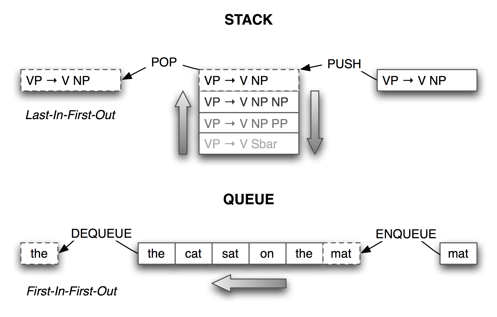

.. -*- mode: rst -*-
.. include:: ../definitions.rst
.. include:: regexp-defns.rst

.. standard global imports

    >>> import nltk, re, pprint

.. TODO: introduce the concept of search, backtracking
.. TODO: introduce diagnostic print statements
.. TODO: timeit()
.. TODO: docstrings, commenting practice
.. TODO: recipes for flattening a list of lists into a list, and for the reverse grouping a list into a list of lists
.. TODO: generating all combinations, e.g. map list of words to list of lists of stress patterns; concatenate to make phrase-level stress patterns in all possible ways
.. TODO: finding all pairs of nouns that occur in the same sentence more than n times in a text
.. TODO: boolean values?
.. TODO: introduce `obj` notation to get string from object; useful for concatenating strings and ints
.. TODO: for sentence in tagged_corpus: tokens, tags = zip(*sentence)
.. TODO: discuss duck typing
.. TODO: check ch06-extras for further content
.. TODO: shared values between multiple dictionaries
.. TODO: illustrate graph data structure using a network of adjectives
         with links to indicate same vs different semantic orientation
         cf Hatzivassiloglou and McKeown EACL 1997
         http://www.aclweb.org/anthology/P97-1023
.. TODO: general technique for computing transitive closures, e.g.
         adjectives connected by synonymy to a particular word, cf.
         http://www.aclweb.org/anthology/W04-3253
.. TODO: explain function vs method

.. _chap-structured-programming:

==============================
6. Writing Structured Programs
==============================

By now you will have a sense of the capabilities of the Python programming language
for processing natural language.  However, if you're new to Python or to programming, you may
still be wrestling with Python and not feel like you are in full control yet.  In this chapter we'll
address the following questions:

1. how can we write well-structured, readable programs that you and others will be able to re-use easily?

2. how do the fundamental building blocks work, such as loops, functions and assignment?

3. what are some of the pitfalls with Python programming and how can we avoid them?

Along the way, you will consolidate your knowledge of fundamental programming
constructs, learn more about using features of the Python language in a natural
and concise way, and learn some useful techniques in visualizing natural language data.
As before, this chapter contains many examples and
exercises (and as before, some exercises introduce new material).
Readers new to programming should work through them carefully
and consult other introductions to programming if necessary;
experienced programmers can quickly skim this chapter.

In the other chapters of this book, we have organized the programming
content as dictated by the needs of |NLP|.  Here we revert to a more
conventional approach where the sequence of concepts is based on
the structure of the programming language.  There's not room for
a complete presentation of the language, so we will focus on likely
pitfalls, and on idioms that are suitable for |NLP|.

.. _sec-back-to-the-basics:

------------------
Back to the Basics
------------------

Assignment
----------

Assignment would seem to be the most elementary programming concept, and not
worth a separate discussion.  However, there are some surprising subtleties and
pitfalls here.  Consider the following code fragment:  

    >>> foo = 'Monty'
    >>> bar = foo
    >>> foo = 'Python'
    >>> bar
    'Monty'

This behaves exactly as expected.  When we write ``bar = foo``,
the value of ``foo`` (the string ``'Monty'``) is assigned to ``bar``.
That is, ``bar`` is a `copy`:dt: of ``foo``, so when we overwrite
``foo`` with a new string ``'Python'``, the value
of ``bar`` is not affected.

However, assignment statements do not always involve making copies in this way.
Assignment always copies the value of an expression, but a value is not
always what you might expect it to be.  In particular,
the "value" of a structured object such as a list is actually just a
`reference`:em: to the object.  In the following example, we
assign the reference of ``foo`` to the new variable ``bar``.
Now when we modify something inside ``foo``, we can see
that the contents of ``bar`` have also been changed.

    >>> foo = ['Monty', 'Python']
    >>> bar = foo
    >>> foo[1] = 'Bodkin'
    >>> bar
    ['Monty', 'Bodkin']

.. _array-memory:
.. figure:: ../images/array-memory.png
   :scale: 40:100:75

   List Assignment and Computer Memory

The line ``bar = foo`` does not copy the contents of the
variable, only its "object reference".
To understand what is going on here, we need to
know how lists are stored in the computer's memory.
In Figure array-memory_, we see that a list ``foo`` is
a reference to an object stored at location 3133 (which is
itself a series of pointers to other locations holding strings).
When we assign ``bar = foo``, it is just the object reference
3133 that gets copied.
This behavior extends to other aspects of the language, such as
parameter passing (Section sec-functions_).

Let's experiment some more, by creating a variable ``empty`` holding the
empty list, then using it three times on the next line.

    >>> empty = []
    >>> nested = [empty, empty, empty]
    >>> nested
    [[], [], []]
    >>> nested[1].append('Python')
    >>> nested
    [['Python'], ['Python'], ['Python']]

Observe that changing one of the items inside our nested list of lists changed them all.
This is because each of the three elements is actually just a reference to one and the
same list in memory.

.. note:: |TRY|
   Use multiplication to create a list of lists: ``nested = [[]] * 3``.
   Now modify one of the elements of the list, and observe that all the
   elements are changed.

Now, notice that when we assign a new value to one of the elements of the list,
it does not propagate to the others:

    >>> nested = [[]] * 3
    >>> nested[1].append('Python')
    >>> nested[1] = ['Monty']
    >>> nested
    [['Python'], ['Monty'], ['Python']]

We began with a list containing three references to a single empty list object.  Then we
modified that object by appending ``'Python'`` to it, resulting in a list containing
three references to a single list object ``['Python']``.
Next, we *overwrote* one of those references with a reference to a new object ``['Monty']``.
This last step modified one of the three object references inside the nested list.
However, the ``['Python']`` object wasn't changed, and is still referenced from two places in
our nested list of lists.  It is crucial to appreciate this difference between
modifying an object via an object reference, and overwriting an object reference.

.. note::
   To copy the items from a list ``foo`` to a new list ``bar``, you can write
   ``bar = foo[:]``.  This copies the object references inside the list.
   To copy a structure without copying any object references, use ``copy.deepcopy()``.

Equality
--------

Python provides two ways to check that a pair of items are the same.
The ``is`` operator tests for object identity.  We can use it to
verify our earlier observations about objects.  First we create
a list containing several copies of the same object, and demonstrate
that they are not only identical according to ``==``, but also
that they are one and the same object:

    >>> size = 5
    >>> python = ['Python']
    >>> snake_nest = [python] * size
    >>> snake_nest[0] == snake_nest[1] == snake_nest[2] == snake_nest[3] == snake_nest[4]
    True
    >>> snake_nest[0] is snake_nest[1] is snake_nest[2] is snake_nest[3] is snake_nest[4]
    True

Now let's put a new python in this nest.  We can easily show that the objects are not
all identical (though its more work to find the interloper):

    >>> import random
    >>> position = random.choice(range(size))
    >>> snake_nest[position] = ['Python']
    >>> snake_nest
    [['Python'], ['Python'], ['Python'], ['Python'], ['Python']]
    >>> snake_nest[0] == snake_nest[1] == snake_nest[2] == snake_nest[3] == snake_nest[4]
    True
    >>> snake_nest[0] is snake_nest[1] is snake_nest[2] is snake_nest[3] is snake_nest[4]
    False
    
Conditionals
------------

In the condition part of an ``if`` statement, a
nonempty string or list is evaluated as true, while an empty string or
list evaluates as false. 

    >>> mixed = ['cat', '', ['dog'], []]
    >>> for element in mixed:
    ...     if element: 
    ...         print element
    ... 
    cat
    ['dog']

That is, we *don't* need to say ``if len(element) > 0:`` in the
condition.

What's the difference between using ``if...elif`` as opposed to using
a couple of ``if`` statements in a row? Well, consider the following
situation:

    >>> animals = ['cat', 'dog']
    >>> if 'cat' in animals:
    ...     print 1
    ... elif 'dog' in animals:
    ...     print 2
    ... 
    1
    >>>

Since the ``if`` clause of the statement is satisfied, Python never
tries to evaluate the ``elif`` clause, so we never get to print out
``2``. By contrast, if we replaced the ``elif`` by an ``if``, then we
would print out both ``1`` and ``2``. So an ``elif`` clause
potentially gives us more information than a bare ``if`` clause; when
it evaluates to true, it tells us not only that the condition is
satisfied, but also that the condition of the main ``if`` clause was
*not* satisfied.

We can check that all or any items meet some condition:

    >>> all(len(w) > 4 for w in sent)
    False
    >>> any(len(w) > 4 for w in sent)
    True

Python Coding Style
-------------------

When writing programs you make many subtle choices about names,
spacing, comments, and so on.  When you look at code written by
other people, needless differences in style make it harder to
to interpret the code.  Therefore, the designers of the Python
language have published a style guide for Python code, available
at ``http://www.python.org/dev/peps/pep-0008/``.
The underlying value presented in the style guide is `consistency`:em:,
for the purpose of maximizing the readability of code.
We briefly review some of its key recommendations here, and refer
readers to the full guide for detailed discussion with examples.

Code layout should use four spaces per indentation level.  You should
avoid tabs for indentation, since these can be misinterpreted by
different text editors and the indentation can be messed up.
Lines should be less than 80 characters long; if necessary you can
break a line inside parentheses, brackets, or braces, because
Python is able to detect that the line continues over to the next line, e.g.:

.. doctest-ignore::
    >>> cv_word_pairs = [(cv, w) for w in rotokas_words
    ...                          for cv in re.findall('[ptksvr][aeiou]', w)]
    >>> cfd = nltk.ConditionalFreqDist((g,w)
    ...                                for g in brown.categories()
    ...                                for w in brown.words(categories=g))
    >>> ha_words = ['aaahhhh', 'ah', 'ahah', 'ahahah', 'ahh', 'ahhahahaha',
    ...             'ahhh', 'ahhhh', 'ahhhhhh', 'ahhhhhhhhhhhhhh', 'ha',
    ...             'haaa', 'hah', 'haha', 'hahaaa', 'hahah', 'hahaha']

If you need to break a line outside parentheses, brackets, or braces,
you can often add extra parentheses, and you can always add a backslash at
the end of the line that is broken:

.. doctest-ignore::
    >>> if (len(syllables) > 4 and len(syllables[2]) == 3 and
    ...    syllables[2][2] in [aeiou] and syllables[2][3] == syllables[1][3]):
    ...     process(syllables)
    >>> if len(syllables) > 4 and len(syllables[2]) == 3 and \
    ...    syllables[2][2] in [aeiou] and syllables[2][3] == syllables[1][3]:
    ...     process(syllables)

Procedural vs Declarative Style
-------------------------------

We have just seen how the same task can be performed in different
ways, with implications for efficiency.  Another factor influencing
program development is *programming style*.  Consider the following
program to compute the average length of words in the Brown Corpus:

    >>> tokens = nltk.corpus.brown.words(categories='news')
    >>> count = 0
    >>> total = 0
    >>> for token in tokens:
    ...     count += 1
    ...     total += len(token)
    >>> print float(total) / count
    4.2765382469

In this program we use the variable ``count`` to keep track of the
number of tokens seen, and ``total`` to store the combined length of
all words.  This is a low-level style, not far removed from machine
code, the primitive operations performed by the computer's CPU.
The two variables are just like a CPU's registers, accumulating values
at many intermediate stages, values that are meaningless until the end. 
We say that this program is written in a *procedural* style, dictating
the machine operations step by step.  Now consider the following
program that computes the same thing:

    >>> total = sum(len(t) for t in tokens)
    >>> print float(total)/len(tokens)
    4.2765382469

The first line uses a list comprehension to sum the token lengths,
while the second line computes the average as before.
Each line of code performs a complete, meaningful task, which
can be understood in terms of high-level properties like:
"``total`` is the sum of the lengths of the tokens".
Implementation details are left to the Python interpreter.
Accordingly, we say that this program is written in a *declarative* style.
Let's look at an extreme example:

    >>> word_list = []
    >>> len_word_list = len(word_list)
    >>> i = 0
    >>> while i < len(tokens):
    ...     j = 0
    ...     while j < len_word_list and word_list[j] < tokens[i]:
    ...         j += 1
    ...     if j == 0 or tokens[i] != word_list[j]:
    ...         word_list.insert(j, tokens[i])
    ...         len_word_list += 1
    ...     i += 1

The equivalent declarative version makes use of higher-level built-in functions,
and its purpose is instantly recognizable:

    >>> word_list = sorted(set(tokens))

Another case where a loop counter seems to be necessary is for printing
a counter with each line of output.  Instead, we can use ``enumerate()``, which
processes a sequence ``s`` and produces a tuple of the form ``(i, s[i])`` for each
item in ``s``, starting with ``(0, s[0])``.  Here we enumerate the keys of the
frequency distribution, and capture the integer-string pair in the variables ``rank``
and ``word``.  We print ``rank+1`` so that the counting appears to start from ``1``,
as required when producing a list of ranked items.

    >>> fd = nltk.FreqDist(nltk.corpus.brown.words())
    >>> cumulative = 0.0
    >>> for rank, word in enumerate(fd):
    ...     cumulative += fd[word] * 100.0 / fd.N()
    ...     print "%3d %6.2f%% %s" % (rank+1, cumulative, word)
    ...     if cumulative > 25:
    ...         break
    ...
      1   5.40% the
      2  10.42% ,
      3  14.67% .
      4  17.78% of
      5  20.19% and
      6  22.40% to
      7  24.29% a
      8  25.97% in

Its sometimes tempting to use loop variables to store a maximum or minimum value
seen so far.  Let's use this method to find the longest word in a text.

    >>> text = nltk.corpus.gutenberg.words('milton-paradise.txt')
    >>> longest = ''
    >>> for word in text:
    ...     if len(word) > len(longest):
    ...         longest = word
    >>> longest
    'unextinguishable'

However, a more transparent solution uses two list comprehensions,
both having forms that should be familiar by now:

    >>> maxlen = max(len(word) for word in text)
    >>> [word for word in text if len(word) == maxlen]
    ['unextinguishable', 'transubstantiate', 'inextinguishable', 'incomprehensible']

Note that our first solution found the first word having the longest length, while the
second solution found *all* of the longest words (which is usually what we would want).
Although there's a theoretical efficiency difference between the two solutions,
the main overhead is reading the data into main memory; once its there, a second pass
through the data is effectively instantaneous.  We also need to balance our concerns about
program efficiency with programmer efficiency.  A fast but cryptic solution
will be harder to understand and maintain.

Some Legitimate Uses for Counters
---------------------------------

There are cases where we still want to use loop variables in a list comprehension.
For example, we need to use a loop variable to extract successive overlapping n-grams
from a list:
    
    >>> sent = ['The', 'dog', 'gave', 'John', 'the', 'newspaper']
    >>> n = 3
    >>> [sent[i:i+n] for i in range(len(sent)-n+1)]
    [['The', 'dog', 'gave'],
     ['dog', 'gave', 'John'],
     ['gave', 'John', 'the'],
     ['John', 'the', 'newspaper']]

It is quite tricky to get the range of the loop variable right.
Since this is a common operation in |NLP|\ , |NLTK|
supports it with functions ``bigrams(text)`` and ``trigrams(text)``, and
a general purpose ``ngrams(text, n)``.

Here's an example of how we can use loop variables in
building multidimensional structures.
For example, to build an array with *m* rows and *n* columns,
where each cell is a set, we could use a nested list comprehension:

    >>> m, n = 3, 7
    >>> array = [[set() for i in range(n)] for j in range(m)]
    >>> array[2][5].add('Alice')
    >>> pprint.pprint(array)
    [[set([]), set([]), set([]), set([]), set([]), set([]), set([])],
     [set([]), set([]), set([]), set([]), set([]), set([]), set([])],
     [set([]), set([]), set([]), set([]), set([]), set(['Alice']), set([])]]

Observe that the loop variables ``i`` and ``j`` are not used
anywhere in the resulting object, they are just needed for a syntactically
correct ``for`` statement.  As another example of this usage, observe
that the expression ``['very' for i in range(3)]`` produces a list
containing three instances of ``'very'``, with no integers in sight.

Note that it would be incorrect to do this work using multiplication,
for reasons that were discussed earlier in this section.

    >>> array = [[set()] * n] * m
    >>> array[2][5].add(7)
    >>> pprint.pprint(array)
    [[set([7]), set([7]), set([7]), set([7]), set([7]), set([7]), set([7])],
     [set([7]), set([7]), set([7]), set([7]), set([7]), set([7]), set([7])],
     [set([7]), set([7]), set([7]), set([7]), set([7]), set([7]), set([7])]]

Iteration is an important programming device.  It is tempting to import idioms
from other languages, when Python offers some elegant and highly readable
alternatives.

---------
Sequences
---------

So far, we have seen three kinds of sequence object: strings, lists, and tuples.
As sequences, they have some common properties: they can be indexed and they have
a length:

    >>> text = 'I turned off the spectroroute'
    >>> words = ['I', 'turned', 'off', 'the', 'spectroroute']
    >>> pair = (6, 'turned')
    >>> text[2], words[3], pair[1]
    ('t', 'the', 'turned')
    >>> len(text), len(words), len(pair)
    (29, 5, 2)

Other objects, including dictionaries and sets, behave like sequences
when they appear in a suitable context:

    >>> fd = {'Monty': 24, 'Python': 80}
    >>> list(fd)
    ['Monty', 'Python']
    >>> for key in fd:
    ...     print fd[key],
    ...
    24 80

Operating on Sequence Types
---------------------------

We can iterate over the items in a sequence ``s`` in a variety of useful ways,
as shown in Table python-sequence_.

.. table:: python-sequence

   ======================================  ===============================================
   Python Expression                       Comment                                        
   ======================================  ===============================================
   ``for item in s``                       iterate over the items of ``s``
   ``for item in sorted(s)``               iterate over the items of ``s`` in order
   ``for item in set(s)``                  iterate over unique elements of ``s``
   ``for item in reversed(s)``             iterate over elements of ``s`` in reverse
   ``for item in set(s).difference(t)``    iterate over elements of ``s`` not in ``t``
   ``for item in random.shuffle(s)``       iterate over elements of ``s`` in random order
   ======================================  ===============================================

   Various ways to iterate over sequences

The sequence functions illustrated in Table python-sequence_ can be combined
in various ways; for example, to get unique elements of ``s`` sorted
in reverse, use ``reversed(sorted(set(s)))``.

We can convert between these sequence types.  For example,
``tuple(s)`` converts any kind of sequence into a tuple, and
``list(s)`` converts any kind of sequence into a list.
We can convert a list of strings to a single string using the
``join()`` function, e.g. ``':'.join(words)``.

Notice in the above code sample that we computed multiple values on a
single line, separated by commas.  These comma-separated expressions
are actually just tuples |mdash| Python allows us to omit the
parentheses around tuples if there is no ambiguity. When we print a
tuple, the parentheses are always displayed. By using tuples in this
way, we are implicitly aggregating items together.

In the next example, we use tuples to re-arrange the
contents of our list.  (We can omit the parentheses
because the comma has higher precedence than assignment.)

    >>> words[2], words[3], words[4] = words[3], words[4], words[2]
    >>> words    
    ['I', 'turned', 'the', 'spectroroute', 'off']

This is an idiomatic and readable way to move items inside a list.
It is equivalent to the following traditional way of doing such
tasks that does not use tuples (notice that this method needs a
temporary variable ``tmp``).

    >>> tmp = words[2]
    >>> words[2] = words[3]
    >>> words[3] = words[4]
    >>> words[4] = tmp

As we have seen, Python has sequence functions such as ``sorted()`` and ``reversed()``
that rearrange the items of a sequence.  There are also functions that
modify the `structure`:em: of a sequence and which can be handy for
language processing.  Thus, ``zip()`` takes
the items of two or more sequences and "zips" them together into a single list of pairs.
Given a sequence ``s``, ``enumerate(s)`` returns an iterator that
produces a pair of an index and the item at that index.

    >>> words = ['I', 'turned', 'off', 'the', 'spectroroute']
    >>> tags = ['NNP', 'VBD', 'IN', 'DT', 'NN']
    >>> zip(words, tags)
    [('I', 'NNP'), ('turned', 'VBD'), ('off', 'IN'),
    ('the', 'DT'), ('spectroroute', 'NN')]
    >>> list(enumerate(words))
    [(0, 'I'), (1, 'turned'), (2, 'off'), (3, 'the'), (4, 'spectroroute')]

Combining Different Sequence Types
----------------------------------

Let's combine our knowledge of these three sequence types, together with list
comprehensions, to perform the task of sorting the words in a string by
their length.

    >>> words = 'I turned off the spectroroute'.split()
    >>> wordlens = [(len(word), word) for word in words]
    >>> wordlens.sort()
    >>> ' '.join(w for (_, w) in wordlens)
    'I off the turned spectroroute'

Each of the above lines of code contains a significant feature.
The first line demonstrates that a simple string is actually
an object with methods defined on it such as ``split()``.
The second line shows the construction of a list of tuples,
where each tuple consists of a number (the word length) and the
word, e.g. ``(3, 'the')``.  The third line sorts the list in-place.
The last line discards the length
information then joins the words back into a single string.

We began by talking about the commonalities in these sequence types,
but the above code illustrates important differences in their
roles.  First, strings appear at the beginning and the end: this is
typical in the context where our program is reading in some text and
producing output for us to read.  Lists and tuples are used in the
middle, but for different purposes.  A list is typically a sequence of
objects all having the `same type`:em:, of `arbitrary length`:em:.  We often
use lists to hold sequences of words.  In contrast,
a tuple is typically a collection of objects of `different types`:em:, of
`fixed length`:em:.  We often use a tuple to hold a `record`:dt:,
a collection of different `fields`:dt: relating to some entity.
This distinction between the use of lists and tuples takes some
getting used to,
so here is another example:

    >>> lexicon = [
    ...     ('the', 'DT', ['Di:', 'D@']),
    ...     ('off', 'IN', ['Qf', 'O:f'])
    ... ]

Here, a lexicon is represented as a list because it is a
collection of objects of a single type |mdash| lexical entries |mdash|
of no predetermined length.  An individual entry is represented as a
tuple because it is a collection of objects with different
interpretations, such as the orthographic form, the part of speech,
and the pronunciations represented in the
`SAMPA <http://www.phon.ucl.ac.uk/home/sampa/index.html>`_ computer
readable phonetic alphabet.  Note that these pronunciations are stored
using a list. (Why?)

The distinction between lists and tuples has been described in terms of
usage.  However, there is a more fundamental difference: in Python,
lists are `mutable`:dt:, while tuples are `immutable`:dt:.  In other
words, lists can be modified, while tuples cannot.  Here are some of
the operations on lists that do in-place modification of the list.

    >>> lexicon.sort()
    >>> lexicon[1] = ('turned', 'VBD', ['t3:nd', 't3`nd'])
    >>> del lexicon[0]

.. note:: |TRY|
   Convert lexicon to a tuple, using ``lexicon = tuple(lexicon)``,
   then try each of the above operations, to confirm that none of
   them is permitted on tuples.

Stacks and Queues
-----------------

Lists are a versatile data type.  We can use lists to
implement so-called `abstract data types`:dt: such as stacks and queues.
A `stack`:dt: is a container that has a last-in-first-out (or LIFO) policy
for adding and removing items (see Figure stack-queue_).

.. _stack-queue:

   Stacks and Queues

Stacks are used to keep track of the current context in
computer processing of natural languages (and programming languages too).
We will seldom have to deal with stacks explicitly, as the implementation
of |NLTK| parsers, treebank corpus readers, (and even Python functions),
all use stacks behind the scenes.
However, it is important to understand what stacks are and how they work.

.. pylisting:: check-parens
   :caption: Check parentheses are balanced

   def check_parens(tokens):
       stack = []
       for token in tokens:
           if token == '(':     # push
               stack.append(token)
           elif token == ')':   # pop
               stack.pop()
       return stack

   >>> phrase = "( the cat ) ( sat ( on ( the mat )"
   >>> print check_parens(phrase.split())
   ['(', '(']

In Python, we can treat a list as a stack by limiting ourselves to the three
operations defined on stacks: ``append(item)`` (to push ``item`` onto the stack),
``pop()`` to pop the item off the top of the stack, and ``[-1]`` to access the
item on the top of the stack.  The program in Figure check-parens_ processes a sentence with
phrase markers, and checks that the parentheses are balanced.
The loop pushes material onto the stack when it gets an open parenthesis,
and pops the stack when it gets a close parenthesis.
We see that two are left on the stack at the end;
i.e. the parentheses are not balanced.

Although the program in Figure check-parens_ is a useful illustration of stacks,
it is overkill because we could have done a direct count:
``phrase.count('(') == phrase.count(')')``.  However, we
can use stacks for more sophisticated processing of strings
containing nested structure, as shown in Figure convert-parens_.
Here we build a (potentially deeply-nested) list of lists.
Whenever a token other than a parenthesis is encountered,
we add it to a list at the appropriate level of nesting.
The stack keeps track of this level of nesting, exploiting
the fact that the item at the top of the stack is actually shared with a
more deeply nested item.  (Hint: add diagnostic print statements to
the function to help you see what it is doing.)

.. pylisting:: convert-parens
   :caption: Convert a nested phrase into a nested list using a stack

   def convert_parens(tokens):
       stack = [[]]
       for token in tokens:
           if token == '(':     # push
               sublist = []
               stack[-1].append(sublist)
               stack.append(sublist)
           elif token == ')':   # pop
               stack.pop()
           else:                # update top of stack
               stack[-1].append(token)
       return stack[0]

   >>> phrase = "( the cat ) ( sat ( on ( the mat ) ) )"
   >>> print convert_parens(phrase.split())
   [['the', 'cat'], ['sat', ['on', ['the', 'branch']]]]    

Lists can be used to represent another important data structure.
A `queue`:dt: is a container that has a first-in-first-out (or FIFO) policy
for adding and removing items (see Figure stack-queue_).
We could use a queue of length `n`:math: to create all the n-grams of a text.
As with stacks, we will seldom have to deal with queues explicitly,
as the implementation of |NLTK| n-gram taggers (Section sec-n-gram-tagging_)
and chart parsers (Appendix app-chart_) use queues behind the scenes.
Here's how queues can be implemented using lists.

    >>> queue = ['the', 'cat', 'sat']
    >>> queue.append('on')
    >>> queue.append('the')
    >>> queue.append('branch')
    >>> queue.pop(0)
    'the'
    >>> queue.pop(0)
    'cat'
    >>> queue
    ['sat', 'on', 'the', 'branch']

Trees
-----

We have just seen how nested sequences can be used to represent
the phrase structure of a sentence::

    [['the', 'cat'], ['sat', ['on', ['the', 'branch']]]]

This is such a fundamental part of |NLP| that a special
data type is defined.
A `tree`:dt: is a set of connected labeled nodes, each reachable
by a unique path from a distinguished root node.  Here's an
example of a tree (note that they are standardly drawn upside-down): 

.. ex::
  .. tree:: (S (NP Allic) (VP (V chased) (NP the rabbit)))

We use a 'family' metaphor to talk about the
relationships of nodes in a tree: for example, `s`:gc: is the
`parent`:dt: of `vp`:gc:; conversely `vp`:gc: is a `daughter`:dt: (or
`child`:dt:) of `s`:gc:.  Also, since `np`:gc: and `vp`:gc: are both
daughters of `s`:gc:, they are also `sisters`:dt:.
For convenience, there is also a text format for specifying
trees: 

.. doctest-ignore::
      (S 
         (NP Alice)
         (VP 
            (V chased)
            (NP 
               (Det the)
               (N rabbit))))

Although we will focus on syntactic trees, trees can be used to encode
`any`:em: homogeneous hierarchical structure that spans a sequence
of linguistic forms (e.g. morphological structure, discourse structure).
In the general case, leaves and node values do not have to be strings.

In |NLTK|, we create a tree by giving a node label and a list of children:

    >>> tree1 = nltk.Tree('NP', ['Alice'])
    >>> print tree1
    (NP Alice)
    >>> tree2 = nltk.Tree('NP', ['the', 'rabbit'])
    >>> print tree2
    (NP the rabbit)

|nopar|
We can incorporate these into successively larger trees as follows:

    >>> tree3 = nltk.Tree('VP', ['chased', tree2])
    >>> tree4 = nltk.Tree('S', [tree1, tree3])
    >>> print tree4
    (S (NP Alice) (VP chased (NP the rabbit)))

|nopar|
Here are some of the methods available for tree objects:

    >>> print tree4[1]
    (VP chased (NP the rabbit))
    >>> tree4[1].node
    'VP'
    >>> tree4.leaves()
    ['Alice', 'chased', 'the', 'rabbit']
    >>> tree4[1][1][1]
    'rabbit'

The bracketed representation for complex trees can be difficult to read.
In these cases, the ``draw`` method can be very useful. 
It opens a new window, containing a graphical representation
of the tree.  The tree display window allows you to zoom in and out;
to collapse and expand subtrees; and to print the graphical
representation to a postscript file (for inclusion in a document).

    >>> tree3.draw()                           # doctest: +SKIP

.. image:: ../images/parse_draw.png
   :scale: 70

.. _sec-functions:

---------------------------------------------------
Functions: The Foundation of Structured Programming
---------------------------------------------------

Once you have been programming for a while, you will find that
the number of completely novel things you have to do in creating a program
decreases significantly.  Half of the work may involve simple tasks that
you have done before.  Thus it is important for your code to be `re-usable`:em:.
One effective way to do this is to abstract commonly used sequences of steps
into a `function`:dt:.

For example, suppose we find that we often want to read text from an HTML file.
This involves several steps: opening the file, reading it in, normalizing
whitespace, and stripping HTML markup.  We can collect these steps into a
function, and give it a name such as ``get_text()``:

.. pylisting:: get_text
   :caption: Read text from a file

   import re
   def get_text(file):
       """Read text from a file, normalizing whitespace
       and stripping HTML markup."""
       text = open(file).read()
       text = re.sub('\s+', ' ', text)
       text = re.sub(r'<.*?>', ' ', text)
       return text

Now, any time we want to get cleaned-up text from an HTML file, we can just call
``get_text()`` with the name of the file as its only argument.  It will return
a string, and we can assign this to a variable, e.g.:
``contents = get_text("test.html")``.  Each time we want to use this series of
steps we only have to call the function.

Notice that a function definition consists of the keyword ``def`` (short for "define"), followed
by the function name, followed by a sequence of parameters enclosed in parentheses, then
a colon.  The following lines contain an indented block of code, the `function body`:dt:.

Using functions has the benefit of saving space in our program.  More
importantly, our choice of name for the function helps make the program *readable*.
In the case of the above example, whenever our program needs to read cleaned-up
text from a file we don't have to clutter the program with four lines of code, we
simply need to call ``get_text()``.  This naming helps to provide some "semantic
interpretation" |mdash| it helps a reader of our program to see what the program "means".

Notice that the above function definition contains a string.  The first string inside
a function definition is called a `docstring`:dt:.  Not only does it document the
purpose of the function to someone reading the code, it is accessible to a programmer
who has loaded the code from a file:

    >>> help(get_text)
    Help on function get_text:

    get_text(file)
        Read text from a file, normalizing whitespace
        and stripping HTML markup.

We have seen that functions help to make our work reusable and readable.  They
also help make it *reliable*.  When we re-use code that has already been developed
and tested, we can be more confident that it handles a variety of cases correctly.
We also remove the risk that we forget some important step, or introduce a bug.
The program that calls our function also has increased reliability.  The author
of that program is dealing with a shorter program, and its components behave
transparently.

To summarize, as its name suggests, a function captures functionality.
It is a segment of code that can be given a meaningful name and which performs
a well-defined task.  Functions allow us to abstract away from the details,
to see a bigger picture, and to program more effectively.

The rest of this section takes a closer look at functions, exploring the
mechanics and discussing aspects of literate programming.

Function Parameters
-------------------

We pass information to functions using a function's parameters,
the parenthesized list of variables and constants following
the function's name, e.g. ``repeat(monty, 3)``.  Here's a complete example:

    >>> def repeat(msg, num):
    ...     return msg * num
    >>> monty = 'Monty Python'
    >>> repeat(monty, 3)
    'Monty PythonMonty PythonMonty Python'

It is not necessary to have any parameters, as we see in the following example:

    >>> def monty():
    ...     return "Monty Python"
    >>> monty()
    "Monty Python"

When there are a lot of parameters it is easy to get confused about the
correct order.  Instead we can refer to parameters by name, and even assign
them a default value just in case one was not provided by the calling
program.  Now the parameters can be specified in any order, and can be omitted.

    >>> def repeat(msg='<empty>', num=1):
    ...     return msg * num
    >>> repeat(num=3)
    '<empty><empty><empty>'
    >>> repeat(msg='Alice')
    'Alice'
    >>> repeat(num=5, msg='Alice')
    'AliceAliceAliceAliceAlice'

These are called keyword arguments.
If we mix these two kinds of parameters, then we must ensure that the unnamed parameters precede the named ones.
It has to be this way, since unnamed parameters are defined by position.  We can define a function that takes
an arbitrary of unnamed and named parameters, and access them via an in-place list of arguments ``*args`` and
an in-place dictionary of keyword arguments ``*kwargs``.

    >>> def generic(*args, **kwargs):
    ...     print *args
    ...     print **kwargs
    ...
    >>> generic(1, "African swallow", monty="python")
    (1, 'African swallow')
    {'monty': 'python'}

When ``*args`` appears as a function parameter, it actually corresponds to all the unnamed parameters of
the function.  Here's another illustration of this aspect of Python syntax, for the ``zip()`` function which
operates on a variable number of arguments.

    >>> song = [['four', 'calling', 'birds'],
    ...         ['three', 'French', 'hens'],
    ...         ['two', 'turtle', 'doves']]
    >>> zip(song[0], song[1], song[2])
    [('four', 'three', 'two'), ('calling', 'French', 'turtle'), ('birds', 'hens', 'doves')]
    >>> zip(*song)
    [('four', 'three', 'two'), ('calling', 'French', 'turtle'), ('birds', 'hens', 'doves')]

    

Parameter Passing
-----------------

Back in Section sec-back-to-the-basics_ you saw that assignment works on values,
but that the value of a structured object is a `reference`:em: to that object.  The same
is true for functions.  Python interprets function parameters as values (this is
known as `call-by-value`:dt:).  In the following code, ``set_up()`` has two parameters,
both of which are modified inside the function.  We begin by assigning an empty string
to ``w`` and an empty dictionary to ``p``.  After calling the function, ``w`` is unchanged,
while ``p`` is changed:

    >>> def set_up(word, properties):
    ...     word = 'cat'
    ...     properties['pos'] = 'noun'
    ...
    >>> w = ''
    >>> p = {}
    >>> set_up(w, p)
    >>> w
    ''
    >>> p
    {'pos': 'noun'}

Notice that ``w`` was not changed by the function.
When we called ``set_up(w, p)``, the value of ``w`` (an empty string) was assigned to
a new variable ``word``.  Inside the function, the value of ``word`` was modified.
However, that change did not propagate to ``w``.  This parameter passing is
identical to the following sequence of assignments:

    >>> w = ''
    >>> word = w
    >>> word = 'cat'
    >>> w
    ''

Let's look at what happened with the dictionary ``p``.
When we called ``set_up(w, p)``, the value of ``p`` (a reference to an empty
dictionary) was assigned to a new local variable ``properties``,
so now both variables now reference the same memory location.
The function modifies ``properties``, and this change is also
reflected in the value of ``p`` as we saw.
This behavior is just as if we had done the following sequence of assignments:

    >>> p = {}
    >>> properties = p
    >>> properties['pos'] = 'noun'
    >>> p
    {'pos': 'noun'}

Thus, to understand Python's call-by-value parameter passing,
it is enough to understand how assignment works.

Scope Rules (notes)
-------------------

* local and global variables
* global variables introduce dependency on context and limits the reusability of a function
* importance of avoiding side-effects

Checking Parameter Types
------------------------

Python does not force us to declare the type of a variable when we write a program,
and this permits us to define functions that are flexible
about the type of their arguments.  For example, a tagger might expect
a sequence of words, but it wouldn't care whether this sequence is expressed
as a list, a tuple, or an iterator.

However, often we want to write programs for later use by others, and want
to program in a defensive style, providing useful warnings when functions
have not been invoked correctly.  Observe that the following ``tag()``
function behaves sensibly for string arguments,
but that it does not complain when it is passed a dictionary.

    >>> def tag(word):
    ...     if word in ['a', 'the', 'all']:
    ...         return 'DT'
    ...     else:
    ...         return 'NN'
    ...
    >>> tag('the')
    'DT'
    >>> tag('dog')
    'NN'
    >>> tag({'lexeme':'turned', 'pos':'VBD', 'pron':['t3:nd', 't3`nd']})
    'NN'

It would be helpful if the author of this function took some extra steps to
ensure that the ``word`` parameter of the ``tag()`` function is a string.
A naive approach would be to check the type of the argument using
``if not type(word) is str``, and if ``word`` is not a string, to simply
return Python's special empty value, ``None``.
However, this approach is dangerous because the calling program
may not detect the error, and the diagnostic return value may be
propagated to other parts of the program with unpredictable consequences.
Here's a better solution, that uses an assertion:

    >>> def tag(word):
    ...     assert type(word) is str, "argument to tag() must be a string"
    ...     if word in ['a', 'the', 'all']:
    ...         return 'DT'
    ...     else:
    ...         return 'NN'

This produces an error that cannot be ignored, since it halts program execution.
Additionally, the error message is easy to interpret.  Adding assertions to
a program helps you find logical errors, and is a kind of "defensive programming."

.. note::
   For runtime efficiency you can
   tell the interpreter to ignore assertions using its optimize flag
   (``python -O``).

[Further discussion of duck-typing]

The Return Statement
--------------------

Another aspect of defensive programming concerns the return statement of a function.
In order to be confident that all execution paths through a function lead to a
return statement, it is best to have a single return statement at the end of
the function definition.
This approach has a further benefit: it makes it more likely that the
function will only return a single type.
Thus, the following version of our ``tag()`` function is safer:

    >>> def tag(word):
    ...     result = 'NN'                       # default value, a string
    ...     if word in ['a', 'the', 'all']:     # in certain cases...
    ...         result = 'DT'                   #   overwrite the value
    ...     return result                       # all paths end here

A return statement can be used to pass multiple values back to the calling
program, by packing them into a tuple.
Here we define a function that returns a tuple
consisting of the average word length of a sentence, and the inventory
of letters used in the sentence.  It would have been clearer to write
two separate functions.

    >>> def proc_words(words):
    ...     avg_wordlen = sum(len(word) for word in words)/len(words)
    ...     chars_used = ''.join(sorted(set(''.join(words))))
    ...     return avg_wordlen, chars_used
    >>> proc_words(['Not', 'a', 'good', 'way', 'to', 'write', 'functions'])
    (3, 'Nacdefginorstuwy')

.. EK: wouldn't it be better to use an example which isn't then open to criticism?

Functions do not need to have a return statement at all.
Some functions do their work as a side effect, printing a result,
modifying a file, or updating the contents of a parameter to the function.
Consider the following three sort functions; the last approach is dangerous
because a programmer could use it without realizing that it had modified
its input.

    >>> def my_sort1(l):      # good: modifies its argument, no return value
    ...     l.sort()
    >>> def my_sort2(l):      # good: doesn't touch its argument, returns value
    ...     return sorted(l)
    >>> def my_sort3(l):      # bad: modifies its argument and also returns it
    ...     l.sort()
    ...     return l

Functional Decomposition
------------------------

Well-structured programs usually make extensive use of functions.
When a block of program code grows longer than 10-20 lines, it is a
great help to readability if the code is broken up into one or more
functions, each one having a clear purpose.  This is analogous to
the way a good essay is divided into paragraphs, each expressing one main idea.

Functions provide an important kind of *abstraction*.
They allow us to group multiple actions into a single, complex action,
and associate a name with it.
(Compare this with the way we combine the actions of
`go`:lx: and `bring back`:lx: into a single more complex action `fetch`:lx:.)
When we use functions, the main program can be written at a higher level
of abstraction, making its structure transparent, e.g.

.. doctest-ignore::
    >>> data = load_corpus()
    >>> results = analyze(data)
    >>> present(results)

Appropriate use of functions makes programs more readable and maintainable.
Additionally, it becomes possible to reimplement a function
|mdash| replacing the function's body with more efficient code |mdash|
without having to be concerned with the rest of the program.

Consider the ``freq_words`` function in Figure freq-words1_.
It updates the contents of a frequency distribution that is
passed in as a parameter, and it also prints a list of the
`n`:math: most frequent words.

.. pylisting:: freq-words1

   def freq_words(url, freqdist, n):
       text = nltk.clean_url(url)
       for word in nltk.wordpunct_tokenize(text):
           freqdist.inc(word.lower())
       print freqdist.keys()[:n]

   >>> constitution = "http://www.archives.gov/national-archives-experience/charters/constitution_transcript.html"
   >>> fd = nltk.FreqDist()
   >>> freq_words(constitution, fd, 20)
   ['the', 'of', 'charters', 'bill', 'constitution', 'rights', ',',
   'declaration', 'impact', 'freedom', '-', 'making', 'independence']

This function has a number of problems.
The function has two side-effects: it modifies the contents of its second
parameter, and it prints a selection of the results it has computed.
The function would be easier to understand and to reuse elsewhere if we
initialize the ``FreqDist()`` object inside the function (in the same place
it is populated), and if we moved the selection and display of results to the
calling program.  In Figure freq-words2_ we `refactor`:dt: this function,
and simplify its interface by providing a single ``url`` parameter.

.. pylisting:: freq-words2

   def freq_words(url):
       freqdist = nltk.FreqDist()
       text = nltk.clean_url(url)
       for word in nltk.wordpunct_tokenize(text):
           freqdist.inc(word.lower())
       return freqdist

   >>> fd = freq_words(constitution)
   >>> print fd.keys()[:20]
   ['the', 'of', 'charters', 'bill', 'constitution', 'rights', ',',
   'declaration', 'impact', 'freedom', '-', 'making', 'independence']

Note that we have now simplified the work of ``freq_words``
to the point that we can do its work with three lines of code:

    >>> words = nltk.wordpunct_tokenize(nltk.clean_url(constitution))
    >>> fd = nltk.FreqDist(word.lower() for word in words)
    >>> fd.keys()[:20]
    ['the', 'of', 'charters', 'bill', 'constitution', 'rights', ',',
    'declaration', 'impact', 'freedom', '-', 'making', 'independence']

Documenting Functions
---------------------

If we have done a good job at decomposing our program into functions, then it should
be easy to describe the purpose of each function in plain language, and provide
this in the docstring at the top of the function definition.  This statement
should not explain how the functionality is implemented; in fact it should be possible
to re-implement the function using a different method without changing this
statement.

NLTK's docstrings are (mostly) written using the "epytext" markup
language.  Using an explicit markup language allows us to generate
prettier online documentation, e.g. see:

   http://nltk.org/doc/api/nltk.tree.Tree-class.html

[Examples of function-level docstrings with epytext markup.]

-------------------------
Doing More with Functions
-------------------------

Functions as Parameters
-----------------------

So far the parameters we have passed into functions have been simple objects like
strings, or structured objects like lists.  Python also lets us pass a function as
an argument to another function.  Now we can abstract out the operation, and apply
a `different operation`:em: on the `same data`:em:.  As the following examples show,
we can pass the built-in function ``len()`` or a user-defined function ``last_letter()``
as parameters to another function:

    >>> sent = ['Take', 'care', 'of', 'the', 'sense', ',', 'and', 'the',
    ...         'sounds', 'will', 'take', 'care', 'of', 'themselves', '.']
    >>> def extract_property(prop):
    ...     return [prop(word) for word in sent]
    ...
    >>> extract_property(len)
    [4, 4, 2, 3, 5, 1, 3, 3, 6, 4, 4, 4, 2, 10, 1]
    >>> def last_letter(word):
    ...     return word[-1]
    >>> extract_property(last_letter)
    ['e', 'e', 'f', 'e', 'e', ',', 'd', 'e', 's', 'l', 'e', 'e', 'f', 's', '.']    

Observe that ``len`` and ``last_letter`` are objects that can be
passed around like lists and dictionaries.  Notice that parentheses
are only used after a function name if we are invoking the function;
when we are simply treating the function as an object these are not used.

Python provides us with one more way to define functions as arguments
to other functions, so-called `lambda expressions`:dt:.  Supposing there
was no need to use the above ``last_letter()`` function in multiple places,
and thus no need to give it a name.  We can equivalently write the following:

    >>> extract_property(lambda w: w[-1])
    ['e', 'e', 'f', 'e', 'e', ',', 'd', 'e', 's', 'l', 'e', 'e', 'f', 's', '.']

Our next example illustrates passing a function to the ``sorted()`` function.
When we call the latter with a single argument (the list to be sorted),
it uses the built-in lexicographic comparison function ``cmp()``.
However, we can supply our own sort function, e.g. to sort by decreasing
length.

    >>> sorted(sent)
    [',', '.', 'Take', 'and', 'care', 'care', 'of', 'of', 'sense', 'sounds',
    'take', 'the', 'the', 'themselves', 'will']
    >>> sorted(sent, cmp)
    [',', '.', 'Take', 'and', 'care', 'care', 'of', 'of', 'sense', 'sounds',
    'take', 'the', 'the', 'themselves', 'will']
    >>> sorted(sent, lambda x, y: cmp(len(y), len(x)))
    ['themselves', 'sounds', 'sense', 'Take', 'care', 'will', 'take', 'care',
    'the', 'and', 'the', 'of', 'of', ',', '.']

Iterators
---------

[itertools, bigrams vs ibigrams, efficiency, ...]

Accumulative Functions
----------------------

These functions start by initializing some storage, and iterate over
input to build it up, before returning some final object (a large structure
or aggregated result).  A standard way to do this is to initialize an
empty list, accumulate the material, then return the list, as shown
in function ``search1()`` in Figure search-examples_.

.. pylisting:: search-examples
   :caption: Accumulating Output into a List
   
   def search1(substring, words):
       result = []
       for word in words:
           if substring in word:
               result.append(word)
       return result

   def search2(substring, words):
       for word in words:
           if substring in word:
               yield word

   print "search1:"
   for item in search1('zz', nltk.corpus.brown.words()):
       print item
   print "search2:"
   for item in search2('zz', nltk.corpus.brown.words()):
       print item
   
The function ``search2()`` is a generator.
The first time this function is called, it gets as far as the ``yield``
statement and stops.  The calling program gets the first word and does
any necessary processing.  Once the calling program is ready for another
word, execution of the function is continued from where it stopped, until
the next time it encounters a ``yield`` statement.  This approach is
typically more efficient, as the function only generates the data as it is
required by the calling program, and does not need to allocate additional
memory to store the output.

Here's a more sophisticated example of a generator, which produces
all permutations of a list of words.  (We could use this method for testing
a grammar, cf Chapter chap-parse_).

    >>> def perms(seq):
    ...     if len(seq) <= 1:
    ...         yield seq
    ...     else:
    ...         for perm in perms(seq[1:]):
    ...             for i in range(len(perm)+1):
    ...                 yield perm[:i] + seq[0:1] + perm[i:]
    ...
    >>> list(perms(['police', 'fish', 'buffalo']))
    [['police', 'fish', 'buffalo'], ['fish', 'police', 'buffalo'],
     ['fish', 'buffalo', 'police'], ['police', 'buffalo', 'fish'],
     ['buffalo', 'police', 'fish'], ['buffalo', 'fish', 'police']]

Higher-Order Functions
----------------------

Python provides some higher-order functions that are standard
features of functional programming languages such as Haskell.
We illustrate them here, alongside the equivalent expression
using list comprehensions.

Let's start by defining a function ``is_content_word()``
which checks whether a word is from the open class of content words.
We use this function as the first parameter of ``filter()``,
which applies the function to each item in the sequence contained
in its second parameter, and only retains the items for which
the function returns ``True``.

    >>> def is_content_word(word):
    ...     return word.lower() not in ['a', 'of', 'the', 'and', 'will', ',', '.']
    >>> filter(is_content_word, sent)
    ['Take', 'care', 'sense', 'sounds', 'take', 'care', 'themselves']
    >>> [w for w in sent if is_content_word(w)]
    ['Take', 'care', 'sense', 'sounds', 'take', 'care', 'themselves']
    
Another higher-order function is ``map()``, which applies a function
to every item in a sequence.  Here is a simple
way to find the average length of a sentence in the news
section of the Brown Corpus:

    >>> lengths = map(len, nltk.corpus.brown.sents(categories='news'))
    >>> sum(lengths) / float(len(lengths))
    21.7508111616
    >>> lengths = [len(w) for w in nltk.corpus.brown.sents(categories='news'))]
    >>> sum(lengths) / float(len(lengths))
    21.7508111616

In the above examples we specified a user-defined function ``is_content_word()``
and a built-in function ``len()``.  We can also provide a lambda expression.
Here's an example which counts the number of vowels in each word.

    >>> map(lambda w: len(filter(lambda c: c.lower() in "aeiou", w)), sent)
    [2, 2, 1, 1, 2, 0, 1, 1, 2, 1, 2, 2, 1, 3, 0]
    >>> [len([c for c in w if c.lower() in "aeiou"]) for w in sent]
    [2, 2, 1, 1, 2, 0, 1, 1, 2, 1, 2, 2, 1, 3, 0]
    
The solutions based on list comprehensions are usually more readable than the
solutions based on higher-order functions, and we have favored the former
approach throughout this book.

Named Arguments
---------------

One of the difficulties in re-using functions is remembering the order of arguments.
Consider the following function, that finds the ``n`` most frequent words that are
at least ``min_len`` characters long:

    >>> def freq_words(file, min, num):
    ...     text = open(file).read()
    ...     tokens = nltk.wordpunct_tokenize(text)
    ...     freqdist = nltk.FreqDist(t for t in tokens if len(t) >= min)
    ...     return freqdist.keys()[:num]
    >>> freq_words('ch01.rst', 4, 10)
    ['words', 'that', 'text', 'word', 'Python', 'with', 'this', 'have', 'language', 'from']

This function has three arguments.  It follows the convention of listing the most
basic and substantial argument first (the file).  However, it might be hard to remember
the order of the second and third arguments on subsequent use.  We can make this function
more readable by using `keyword arguments`:dt:.  These appear in the function's argument
list with an equals sign and a default value:

    >>> def freq_words(file, min=1, num=10):
    ...     text = open(file).read()
    ...     tokens = nltk.wordpunct_tokenize(text)
    ...     freqdist = nltk.FreqDist(t for t in tokens if len(t) >= min)
    ...     return freqdist.keys()[:num]

Now there are several equivalent ways to call this function:
``freq_words('ch01.rst', 4, 10)``, 
``freq_words('ch01.rst', min=4, num=10)``,
``freq_words('ch01.rst', num=10, min=4)``.

When we use an integrated development environment such as IDLE,
simply typing the name of a function at the command prompt will
list the arguments.  Using named arguments helps someone to re-use the code...

A side-effect of having named arguments is that they permit optionality.  Thus we
can leave out any arguments where we are happy with the default value:
``freq_words('ch01.rst', min=4)``, ``freq_words('ch01.rst', 4)``.

Another common use of optional arguments is to permit a flag, e.g.:

    >>> def freq_words(file, min=1, num=10, trace=False):
    ...     freqdist = FreqDist()
    ...     if trace: print "Opening", file
    ...     text = open(file).read()
    ...     if trace: print "Read in %d characters" % len(file)
    ...     for word in nltk.wordpunct_tokenize(text):
    ...         if len(word) >= min:
    ...             freqdist.inc(word)
    ...             if trace and freqdist.N() % 100 == 0: print "."
    ...     if trace: print
    ...     return freqdist.keys()[:num]

Exceptions
----------

[not strictly part of a section on functions; but we'll mainly use them for
defensive programming, duck typing, etc, inside functions.]

.. _sec-algorithm-design:

----------------
Algorithm Design
----------------

A major part of algorithmic problem solving is selecting or adapting
an appropriate algorithm for the problem at hand.  Sometimes there are
several alternatives, and choosing the best one depends on knowledge
about how each alternative performs as the size of the data grows.
Whole books are written on this topic, and we only have space to introduce
some key concepts and elaborate on the approaches that are most prevalent
in natural language processing.

The best known strategy is known as `divide-and-conquer`:dt:.
We attack a problem of size *n* by dividing it into two problems of size *n/2*,
solve these problems, and combine their results into a solution of the original problem.
For example, suppose that we had a pile of cards with a single word written on each card.
We could sort this pile by splitting it in half and giving it to two other people
to sort (they could do the same in turn).  Then, when two sorted piles come back, it
is an easy task to merge them into a single sorted pile.
See Figure mergesort_ for an illustration of this process.

.. _mergesort:
.. figure:: ../images/mergesort.png
   :scale: 30

   Sorting by Divide-and-Conquer (Mergesort)

Another example is the process of looking up a word in a dictionary.  We open
the book somewhere around the middle and compare our word with the current
page.  If its earlier in the dictionary we repeat the process on the first
half; if its later we use the second half.  This search method is called
`binary search`:lx: since it splits the problem in half at every step.

In another approach to algorithm design, we attack a problem
by transforming it into an instance of a problem we already know how to solve.
For example, in order to detect duplicates entries in a list, we can `pre-sort`:dt:
the list, then scan through it once to check if any adjacent pairs of elements
are identical.

Recursion
---------

The above examples of sorting and searching have a striking property:
to solve a problem of size `n`:math:, we have to break it in half and
then work on one or more problems of size `n/2`:math:.
A common way to implement such methods uses `recursion`:dt:.
We define a function `f`:math: which simplifies the problem,
and `calls itself`:em: to solve one or more easier instances
of the same problem.  It then combines the results into a solution
for the original problem.

For example, suppose we have a set of `n`:math: words, and want to
calculate how many different ways they can be combined to make a
sequence of words.  If we have only one word (`n=1`:math:), there is
just one way to make it into a sequence.  If we have a set of two
words, there are two ways to put them into a sequence.  For three
words there are six possibilities.  In general, for `n`:math: words,
there are `n`:math: |times| `n-1` |times| |dots| |times| `2`:math: |times| `1`:math:
ways (i.e. the factorial of `n`:math:).  We can code this up as follows:

    >>> def factorial1(n):
    ...     result = 1
    ...     for i in range(n):
    ...         result *= (i+1)
    ...     return result

However, there is also a recursive algorithm for solving this problem,
based on the following observation.  Suppose we have a way to
construct all orderings for `n-1`:math: distinct words.  Then
for each such ordering, there are `n`:math: places where we can
insert a new word: at the start, the end, or any of the `n-2`:math:
boundaries between the words.  Thus we simply multiply the number
of solutions found for `n-1`:math: by the value of `n`:math:.
We also need the `base case`:dt:, to say that if we have a single
word, there's just one ordering.  We can code this up as follows:

    >>> def factorial2(n):
    ...     if n == 1:
    ...         return 1
    ...     else:
    ...         return n * factorial(n-1)

These two algorithms solve the same problem.  One uses iteration
while the other uses recursion.

It is standard to use a recursive function to traverse a tree.
The listing in Figure traverse_ demonstrates this.  Note that
we have used "duck typing" to detect that ``t`` is a tree (i.e.
``t.node`` is defined).

.. pylisting:: traverse
   :caption: A Recursive Function to Traverse a Tree
   
   def traverse(t):
       try:
           t.node
           print '(', t.node,
           for child in t:
               traverse(child)
           print ')',
       except AttributeError:
           print t,

    >>> t = nltk.Tree('(S (NP Alice) (VP chased (NP the rabbit)))')
    >>> traverse(t)
    ( S ( NP Alice ) ( VP chased ( NP the rabbit ) ) )

As our last example, let's use recursion to build a deeply-nested
object.  A `letter trie`:dt: is a data structure that can be used
for indexing a lexicon, one letter at a time.  For example, if ``trie``
contained a letter trie, then the sub-trie ``trie['c']`` would be a smaller
trie which held all words starting with `c`:lx:. 
Figure trie_ demonstrates the process of building a trie.
We initialize an empty trie to be a dictionary whose
default value for an entry is an empty dictionary.
Now, to insert the word `chien`:lx: (French for `dog`:lx:),
we split off the `c`:lx: and recursively insert `hien`:lx:
into the sub-trie ``trie['c']``.  The recursion continues
until there are no letters remaining in the word, when we
store the intended value (in this case, the word `dog`:lx:).

.. pylisting:: trie
   :caption: Building a Letter Trie

   def insert(trie, key, value):
       if key:
           first, rest = key[0], key[1:]
           insert(trie[first], rest, value)
       else:
           trie['value'] = value

   >>> trie = defaultdict(dict)
   >>> insert(trie, 'chat', 'cat')
   >>> insert(trie, 'chien', 'dog')
   >>> trie = dict(trie)               # for nicer printing
   >>> trie['c']['h']
   {'a': {'t': {'value': 'cat'}}, 'i': {'e': {'n': {'value': 'dog'}}}}
   >>> trie['c']['h']['a']['t']['value']
   'cat'
   >>> pprint.pprint(trie)
   {'c': {'h': {'a': {'t': {'value': 'cat'}},
                'i': {'e': {'n': {'value': 'dog'}}}}}}

Space-Time Tradeoffs
--------------------

We can sometimes significantly speed up the execution of a program by building an auxiliary
data structure, such as an index.  Here's an example of a simple text retreival system for
the Movie Reviews Corpus.  By indexing the document collection it can provide much faster lookup.

.. pylisting:: search-documents

   def raw(file):
       contents = open(file).read()
       contents = re.sub(r'<.*?>', ' ', contents)
       contents = re.sub('\s+', ' ', contents)
       return contents

   def snippet(doc, term): # buggy
       text = ' '*30 + raw(doc) + ' '*30
       pos = text.index(term)
       return text[pos-30:pos+30]

   print "Building Index..."
   files = nltk.corpus.movie_reviews.abspaths()
   idx = nltk.Index((w, file) for file in files for w in raw(file).split())

   while True:
       query = raw_input("query> ")
       if query in idx:
           for doc in idx[query]:
               print snippet(doc, query)
       else:
           print "Not found"

A more subtle example of a space-time tradeoff involves replacing the tokens of a corpus
with integer identifiers.  We create a vocabulary for the corpus, a list in which each
word is stored once, then invert this list so that we can look up any word to find its
identifier.  Each document is preprocessed, so that a list of words becomes a list of integers.
Any language models can now work with integers.  See the listing in Figure strings-to-ints_
for an example of how to do this for a tagged corpus.
[further discussion and performance comparison.]

.. pylisting:: strings-to-ints
   :caption: Preprocess tagged corpus data, converting all words and tags to integers

   def preprocess(tagged_corpus):
       words = set()
       tags = set()
       for sent in tagged_corpus:
           for word, tag in sent:
               words.add(word)
               tags.add(tag)
       wm = dict((w,i) for (i,w) in enumerate(words))
       tm = dict((t,i) for (i,t) in enumerate(tags))
       return [[(wm[w], tm[t]) for (w,t) in sent] for sent in tagged_corpus]

Another example of a space-time tradeoff is maintaining a vocabulary list.
If you need to process an input text to check that all words are in an
existing vocabulary, the vocabulary should be stored as a set, not a list.
Sets index their elements |mdash| which takes more space |mdash|
and testing for membership of a large set will
be much faster than testing for membership of an equivalent list. 

Dynamic Programming
-------------------

Dynamic programming is a general technique for designing algorithms
which is widely used in natural language processing.  The term
'programming' is used in a different sense to what you might expect,
to mean planning or scheduling.  Dynamic programming is used when a
problem contains overlapping sub-problems.  Instead of computing
solutions to these sub-problems repeatedly, we simply store them in a
lookup table.
In the remainder of this section we will introduce dynamic programming,
but in a rather different context to syntactic parsing.

Pingala was an Indian author who lived around the 5th century B.C.,
and wrote a treatise on Sanskrit prosody called the *Chandas Shastra*.
Virahanka extended this work around the 6th century A.D., studying the
number of ways of combining short and long syllables to create a meter
of length *n*.  He found, for example, that there are five ways to
construct a meter of length 4: *V*\ :subscript:`4` = *{LL, SSL, SLS,
LSS, SSSS}*.  Observe that we can split *V*\ :subscript:`4` into two
subsets, those starting with *L* and those starting with
*S*, as shown in v4_.

.. _v4:
.. ex::
   .. parsed-literal::

    *V*\ :subscript:`4` =
      LL, LSS
        i.e. L prefixed to each item of *V*\ :subscript:`2` = {L, SS}
      SSL, SLS, SSSS
        i.e. S prefixed to each item of *V*\ :subscript:`3` = {SL, LS, SSS}

.. pylisting:: virahanka
   :caption: Four Ways to Compute Sanskrit Meter

   def virahanka1(n):
       if n == 0:
           return [""]
       elif n == 1:
           return ["S"]
       else:
           s = ["S" + prosody for prosody in virahanka1(n-1)]
           l = ["L" + prosody for prosody in virahanka1(n-2)]
           return s + l

   def virahanka2(n):
       lookup = [[""], ["S"]]
       for i in range(n-1):
           s = ["S" + prosody for prosody in lookup[i+1]]
           l = ["L" + prosody for prosody in lookup[i]]
           lookup.append(s + l)
       return lookup[n]

   def virahanka3(n, lookup={0:[""], 1:["S"]}):
       if n not in lookup:
           s = ["S" + prosody for prosody in virahanka3(n-1)]
           l = ["L" + prosody for prosody in virahanka3(n-2)]
           lookup[n] = s + l
       return lookup[n]

   from nltk import memoize
   @memoize
   def virahanka4(n):
       if n == 0:
           return [""]
       elif n == 1:
           return ["S"]
       else:
           s = ["S" + prosody for prosody in virahanka4(n-1)]
           l = ["L" + prosody for prosody in virahanka4(n-2)]
           return s + l

   >>> virahanka1(4)
   ['SSSS', 'SSL', 'SLS', 'LSS', 'LL']  
   >>> virahanka2(4)
   ['SSSS', 'SSL', 'SLS', 'LSS', 'LL']  
   >>> virahanka3(4)
   ['SSSS', 'SSL', 'SLS', 'LSS', 'LL']  
   >>> virahanka4(4)
   ['SSSS', 'SSL', 'SLS', 'LSS', 'LL']  

With this observation, we can write a little recursive function called
``virahanka1()`` to compute these meters, shown in Figure virahanka_.
Notice that, in order to compute *V*\ :subscript:`4` we first compute
*V*\ :subscript:`3` and *V*\ :subscript:`2`.  But to compute *V*\ :subscript:`3`,
we need to first compute *V*\ :subscript:`2` and *V*\ :subscript:`1`.  This `call
structure`:dt: is depicted in call-structure_.

.. _call-structure:
.. ex:: 
   .. tree:: (V4 (V3 (V2 V1 V0) V1) (V2 V1 V0))

As you can see, *V*\ :subscript:`2` is computed twice.
This might not seem like a significant problem, but 
it turns out to be rather wasteful as *n* gets large:
to compute *V*\ :subscript:`20` using this recursive technique, we
would compute *V*\ :subscript:`2` 4,181 times;
and for *V*\ :subscript:`40` we would compute *V*\ :subscript:`2` 63,245,986 times!
A much better alternative is to store the value of *V*\ :subscript:`2` in a table
and look it up whenever we need it.  The same goes for other values, such
as *V*\ :subscript:`3` and so on.  Function ``virahanka2()`` implements a
dynamic programming approach to the problem.  It works by filling up a
table (called ``lookup``) with solutions to *all* smaller instances of the
problem, stopping as soon as we reach the value we're interested in.
At this point we read off the value and return it.  Crucially, each
sub-problem is only ever solved once.

Notice that the approach taken in ``virahanka2()`` is to solve smaller
problems on the way to solving larger problems.  Accordingly, this is known as the
`bottom-up`:dt: approach to dynamic programming.  Unfortunately it turns out
to be quite wasteful for some applications, since it
may compute solutions to sub-problems that are never required for
solving the main problem.  This wasted computation can be avoided
using the `top-down`:dt: approach to dynamic programming, which is
illustrated in the function ``virahanka3()`` in Figure virahanka_.
Unlike the bottom-up approach, this approach is recursive.  It avoids
the huge wastage of ``virahanka1()`` by checking whether it has
previously stored the result.  If not, it computes the result
recursively and stores it in the table.  The last step is to return
the stored result.  The final method is to use a Python `decorator`:dt:
called ``memoize``, which takes care of the housekeeping work done
by ``virahanka3()`` without cluttering up the program.

This concludes our brief introduction to dynamic programming.
We will encounter it again in Section sec-parsing_ and
Appendix app-chart_.

.. note:: Dynamic programming is a kind of `memoization`:dt:.
   A memoized function stores results of previous calls to the
   function along with the supplied parameters.  If the function is
   subsequently called with those parameters, it returns the
   stored result instead of recalculating it.

Backtracking (notes)
--------------------

[This discussion will provide the background for understanding the
recursive descent parser, covered in Chapter chap-parse_.]

Timing (notes)
--------------

We can easily test the efficiency gains made by the use of dynamic programming,
or any other putative performance enhancement, using the ``timeit`` module:

.. doctest-ignore::
    >>> from timeit import Timer
    >>> Timer("PYTHON CODE", "INITIALIZATION CODE").timeit()

[MORE]

.. note:: Authors' note:
   *The rest of this chapter is incomplete.*

---------------------------
Program Development (NOTES)
---------------------------

Programming is a skill that is acquired over several years of
experience with a variety of programming languages and tasks.  Key
high-level abilities are *algorithm design* and its manifestation in
*structured programming*.  Key low-level abilities include familiarity
with the syntactic constructs of the language, and knowledge of a
variety of diagnostic methods for trouble-shooting a program which
does not exhibit the expected behavior.

Multi-Module Programs
---------------------

[overview of Python modules and packages]

Debugging
---------

* adding diagnostic print statements
* hunting with divide-and-conquer
* defensive programming: adding asserts etc
* showing code to someone else...
* reading the stack-trace

* The Python debugger: allows you to monitor program execution, set "breakpoints",
  step through particular sections and inspect variables 

.. doctest-ignore::
    >>> import pdb
    >>> import mymodule
    >>> pdb.run('mymodule.test()')

Commands:

list [first [,last]]: list sourcecode for the current file

next: continue execution until the next line in the current function is reached

cont: continue execution until a breakpoint is reached (or the end of the program)

break: list the breakpoints

break n: insert a breakpoint at this line number in the current file

break file.py:n: insert a breakpoint at this line in the specified file

break function: insert a breakpoint at the first executable line of the function

Profiling
---------

[more]

.. _sec-visualization:
.. _sec-libraries:

----------------------------
A Sample of Python Libraries
----------------------------

The ``pylab`` Package (notes)
-----------------------------

Python has some libraries that are useful for visualizing language data.
The PyLab package supports sophisticated
plotting functions with a MATLAB-style interface, and is available from
``http://matplotlib.sourceforge.net/``.

So far we have focused on textual presentation and the use of formatted print
statements to get output lined up in columns.  It is often very useful to display
numerical data in graphical form, since this often makes it easier to detect
patterns.  For example, in Figure modal-tabulate_ we saw a table of numbers
showing the frequency of particular modal verbs in the Brown Corpus, classified
by genre.  The program in Figure modal-plot_ presents the same information in graphical
format.  The output is shown in Figure modal-genre_ (a color figure in the online version).

.. pylisting:: modal-plot
   :caption: Frequency of Modals in Different Sections of the Brown Corpus

   colors = 'rgbcmyk' # red, green, blue, cyan, magenta, yellow, black
   def bar_chart(categories, words, counts):
       "Plot a bar chart showing counts for each word by category"
       import pylab
       ind = pylab.arange(len(words))
       width = 1.0 / (len(categories) + 1)
       bar_groups = []
       for c in range(len(categories)):
           bars = pylab.bar(ind+c*width, counts[categories[c]], width, color=colors[c % len(colors)])
           bar_groups.append(bars)
       pylab.xticks(ind+width, words)
       pylab.legend([b[0] for b in bar_groups], categories, loc='upper left')
       pylab.ylabel('Frequency')
       pylab.title('Frequency of Six Modal Verbs by Genre')
       pylab.show()

   >>> genres = ['news', 'religion', 'hobbies', 'government', 'adventure']
   >>> modals = ['can', 'could', 'may', 'might', 'must', 'will']
   >>> cfdist = nltk.ConditionalFreqDist((g,w)
   ...                                   for g in genres
   ...                                   for w in nltk.corpus.brown.words(categories=g)
   ...                                   if w in modals)
   ...
   >>> counts = {}
   >>> for genre in genres:
   ...     counts[genre] = [cfdist[genre][word] for word in modals]
   >>> bar_chart(genres, modals, counts)

.. _modal-genre:
.. figure:: ../images/modal_genre.png
   :scale: 25

   Bar Chart Showing Frequency of Modals in Different Sections of Brown Corpus

..
  def count_words_by_tag(t, genres):
      cfdist = nltk.ConditionalFreqDist()
      for genre in genres:
          for (word,tag) in nltk.corpus.brown.tagged_words(categories=genre):
              if tag == t:
                   cfdist[genre].inc(word.lower())
      return cfdist
    

From the bar chart it is immediately obvious that `may`:lx: and `must`:lx: have
almost identical relative frequencies.  The same goes for `could`:lx: and `might`:lx:.

We can generate data visualizations on the fly, based on user input via the web...
To do this we have to specify the ``Agg`` backend for ``matplotlib`` before
importing ``pylab``, as follows:

    >>> import matplotlib
    >>> matplotlib.use('Agg')
    >>> import pylab

Next, we use all the same PyLab methods as before, but instead of displaying the
result on a graphical terminal using ``pylab.show()``, we save it to a file
using ``pylab.savefig()``.  We specify the filename and dpi, then print
HTML markup that directs the web browser to load the file.

.. doctest-ignore::
    >>> pylab.savefig('modals.png')
    >>> print 'Content-Type: text/html'
    >>> print
    >>> print '<html><body>'
    >>> print ''
    >>> print '</body></html>'

The ``networkx`` Package (notes)
--------------------------------

The NetworkX package is for
displaying network diagrams, and is available from ``https://networkx.lanl.gov/``.

[Example with WordNet visualization.]

The ``csv`` Package (notes)
---------------------------

[Example accessing lexical data]

    >>> import csv
    >>> file = open("dict.csv", "rb")
    >>> for row in csv.reader(file):
    ...     print row
    ['sleep', 'sli:p', 'v.i', 'a condition of body and mind ...']
    ['walk', 'wo:k', 'v.intr', 'progress by lifting and setting down each foot ...']
    ['wake', 'weik', 'intrans', 'cease to sleep']

Database Connectivity (notes)
-----------------------------

[Example storing corpus analysis to a database]

---------------
Further Reading
---------------

[Harel2004]_

[Levitin2004]_

[Knuth2006Trees]_

http://docs.python.org/lib/typesseq-strings.html

http://www.jwz.org/doc/worse-is-better.html

http://c2.com/cgi/wiki?DontRepeatYourself

Pages on Python pitfalls.

---------
Exercises
---------

#. |easy| Find out more about sequence objects using Python's help facility.
   In the interpreter, type ``help(str)``, ``help(list)``, and ``help(tuple)``.
   This will give you a full list of the functions supported by each type.
   Some functions have special names flanked with underscore; as the
   help documentation shows, each such function corresponds to something
   more familiar.  For example ``x.__getitem__(y)`` is just a long-winded
   way of saying ``x[y]``.

#. |easy| Identify three operations that can be performed on both tuples
   and lists.  Identify three list operations that cannot be performed on
   tuples.  Name a context where using a list instead of a tuple generates
   a Python error.

#. |easy| Find out how to create a tuple consisting of a single item.
   There are at least two ways to do this.

#. |easy| Create a list ``words = ['is', 'NLP', 'fun', '?']``.  Use
   a series of assignment statements (e.g. ``words[1] = words[2]``)
   and a temporary variable ``tmp`` to transform this list into the
   list ``['NLP', 'is', 'fun', '!']``.  Now do the same transformation
   using tuple assignment.

#. |easy| Does the method for creating a sliding window of n-grams
   behave correctly for the two limiting cases: `n`:math: = 1, and `n`:math: = ``len(sent)``?

#. |easy| Create two dictionaries, ``d1`` and ``d2``, and add some entries to
   each.  Now issue the command ``d1.update(d2)``.  What did this do?
   What might it be useful for?

#. |easy| We pointed out that when empty strings and empty lists occur
   in the condition part of an ``if`` clause, they evaluate to
   false. In this case, they are said to be occuring in a `Boolean
   context`:dt:.
   Experiment with different kind of non-Boolean expressions in Boolean
   contexts, and see whether they evaluate as true or false.

#. |soso| Create a list of words and store it in a variable ``sent1``.
   Now assign ``sent2 = sent1``.  Modify one of the items in ``sent1``
   and verify that ``sent2`` has changed.

   a) Now try the same exercise but instead assign ``sent2 = sent1[:]``.
      Modify ``sent1`` again and see what happens to ``sent2``.  Explain.
   b) Now define ``text1`` to be a list of lists of strings (e.g. to
      represent a text consisting of multiple sentences.  Now assign
      ``text2 = text1[:]``, assign a new value to one of the words,
      e.g. ``text1[1][1] = 'Monty'``.  Check what this did to ``text2``.
      Explain.
   c) Load Python's ``deepcopy()`` function (i.e. ``from copy import deepcopy``),
      consult its documentation, and test that it makes a fresh copy of any
      object.

#. |soso| Write code that starts with a string of words and
   results in a new string consisting of the same words, but where
   the first word swaps places with the second, and so on. For
   example, ``'the cat sat on the mat'`` will be converted into ``'cat
   the on sat mat the'``.

#. |soso| Initialize an *n*\ -by-*m* list of lists of empty strings using list
   multiplication, e.g. ``word_table = [[''] * n] * m``.  What happens
   when you set one of its values, e.g. ``word_table[1][2] = "hello"``?
   Explain why this happens.  Now write an expression using ``range()``
   to construct a list of lists, and show that it does not have this problem.

#. |soso| Write code to initialize a two-dimensional array of sets called
   ``word_vowels`` and process a list of words, adding each
   word to ``word_vowels[l][v]`` where ``l`` is the length of the word and ``v`` is
   the number of vowels it contains.

#. |soso| Write a function ``novel10(text)`` that prints any word that
   appeared in the last 10% of a text that had not been encountered earlier.

#. |soso| Write a program that takes a sentence expressed as a single string,
   splits it and counts up the words.  Get it to print out each word and the
   word's frequency, one per line, in alphabetical order.

#. |soso| Write code that builds a dictionary of dictionaries of sets.

#. |soso| Use ``sorted()`` and ``set()`` to get a sorted list of tags used in the Brown
   corpus, removing duplicates.

#. |soso| Write code to convert text into *hAck3r*, where characters are
   mapped according to the following table:

   +---------+---+---+---+----+---+--------+-----+
   | Input:  | e | i | o | l  | s | .      | ate |
   +---------+---+---+---+----+---+--------+-----+
   | Output: | 3 | 1 | 0 | \| | 5 | 5w33t! | 8   |
   +---------+---+---+---+----+---+--------+-----+

#. |soso| Read up on Gematria, a method for assigning numbers to words, and for
   mapping between words having the same number to discover the hidden meaning of
   texts (``http://en.wikipedia.org/wiki/Gematria``, ``http://essenes.net/gemcal.htm``).

   a) Write a function ``gematria()`` that sums the numerical values of
      the letters of a word, according to the letter values in ``letter_vals``:

      letter_vals = {'a':1, 'b':2, 'c':3, 'd':4, 'e':5, 'f':80, 'g':3, 'h':8,
       'i':10, 'j':10, 'k':20, 'l':30, 'm':40, 'n':50, 'o':70, 'p':80, 'q':100,
       'r':200, 's':300, 't':400, 'u':6, 'v':6, 'w':800, 'x':60, 'y':10, 'z':7}

   b) Process a corpus (e.g. ``nltk.corpus.state_union``) and for each document, count how
      many of its words have the number 666.

   c) Write a function ``decode()`` to process a text, randomly replacing words with
      their Gematria equivalents, in order to discover the "hidden meaning" of the text.

#. |soso| Write a function ``shorten(text, n)`` to process a text, omitting the ``n``
   most frequently occurring words of the text.  How readable is it?

#. |easy| Write code that removes whitespace at the beginning and end of a
   string, and normalizes whitespace between words to be a single
   space character.

   #) do this task using ``split()`` and ``join()``

   #) do this task using regular expression substitutions

#. |easy| What happens when the formatting strings ``%6s`` and ``%-6s``
   are used to display strings that are longer than six characters?

#. |easy| We can use a dictionary to specify the values to be
   substituted into a formatting string.  Read Python's library
   documentation for formatting strings
   (`http://docs.python.org/lib/typesseq-strings.html
   <http://docs.python.org/lib/typesseq-strings.html>`_),
   and use this method to display today's date in two
   different formats.

#. |easy| Write a program to sort words by length.  Define a helper function
   ``cmp_len`` which uses the ``cmp`` comparison function on word
   lengths.

#. |soso| Write code to print out an index for a lexicon, allowing someone
   to look up words according to their meanings (or pronunciations; whatever
   properties are contained in lexical entries).

#. |soso| Figure baseline-tagger_ in Chapter chap-tag_ plotted a curve showing
   change in the performance of a lookup tagger as the model size was increased.
   Plot the performance curve for a unigram tagger, as the amount of training
   data is varied.

#. |easy| Review the answers that you gave for the exercises in sec-back-to-the-basics_,
   and rewrite the code as one or more functions.

#. |soso| In this section we saw examples of some special functions such as ``filter()`` and
   ``map()``.  Other functions in this family are ``zip()`` and ``reduce()``.
   Find out what these do, and write some code to try them out.
   What uses might they have in language processing?

#. |soso| Write a function that takes a list of words (containing duplicates) and
   returns a list of words (with no duplicates) sorted by decreasing frequency.
   E.g. if the input list contained 10 instances of the word ``table`` and 9 instances
   of the word ``chair``, then ``table`` would appear before ``chair`` in the output
   list.

#. |soso| Write a function that takes a text and a vocabulary as its arguments
   and returns the set of words that appear in the text but not in the
   vocabulary.  Both arguments can be represented as lists of strings.
   Can you do this in a single line, using ``set.difference()``?

#. |soso| As you saw, ``zip()`` combines two lists into a single list
   of pairs. What happens when the lists are of unequal lengths?
   Define a function ``myzip()`` that does something different with
   unequal lists.

#. |soso| Import the ``itemgetter()`` function from the ``operator`` module in Python's
   standard library (i.e. ``from operator import itemgetter``).  Create a list
   ``words`` containing several words.  Now try calling:
   ``sorted(words, key=itemgetter(1))``, and ``sorted(words, key=itemgetter(-1))``.
   Explain what ``itemgetter()`` is doing.

#. |soso| Write a recursive function ``lookup(trie, key)`` that looks up a key in a trie,
   and returns the value it finds.  Extend the function to return a word when it is uniquely
   determined by its prefix (e.g. ``vanguard`` is the only word that starts with ``vang-``,
   so ``lookup(trie, 'vang')`` should return the same thing as ``lookup(trie, 'vanguard')``).

#. |soso| Read about string edit distance and the Levenshtein Algorithm.
   Try the implementation provided in ``nltk.edit_dist()``.
   How is this using dynamic programming?  Does it use the bottom-up or
   top-down approach?
   [See also ``http://norvig.com/spell-correct.html``]

#. |soso| The Catalan numbers arise in many applications of combinatorial mathematics,
   including the counting of parse trees (Section sec-a-problem-of-scale_).  The series
   can be defined as follows: C\ :subscript:`0` = 1, and
   C\ :subscript:`n+1` = |Sigma|\ :subscript:`0..n` (C\ :subscript:`i`\ C\ :subscript:`n-i`).

   a) Write a recursive function to compute `n`:math:\ th Catalan number C\ :subscript:`n`

   b) Now write another function that does this computation using dynamic programming

   c) Use the ``timeit`` module to compare the performance of these functions as `n`:math:
      increases.

#. |hard| 
   Reproduce some of the results of [Zhao07]_ concerning authorship identification.

#. |hard| Study gender-specific lexical choice, and see if you can
   reproduce some of the results of ``http://www.clintoneast.com/articles/words.php``

#. |hard| Write a recursive function that pretty prints a trie in alphabetically
   sorted order, as follows

   chat: 'cat'
   --ien: 'dog'
   -???: ???

#. |hard| Write a recursive function that processes text, locating the uniqueness point in
   each word, and discarding the remainder of each word.  How much compression does this
   give?  How readable is the resulting text?

#. |hard| Develop a simple extractive summarization tool, that prints the
   sentences of a document which contain the highest total word
   frequency.  Use ``FreqDist()`` to count word frequencies, and use
   ``sum`` to sum the frequencies of the words in each sentence.
   Rank the sentences according to their score.  Finally, print the *n*
   highest-scoring sentences in document order.  Carefully review the
   design of your program, especially your approach to this double
   sorting.  Make sure the program is written as clearly as possible.
   
#. |hard|
   Develop your own NGramTagger class that inherits from NLTK's class,
   and which encapsulates the method of collapsing the vocabulary of
   the tagged training and testing data that was described in Chapter
   chap-tag_.  Make sure that the unigram and default backoff taggers
   have access to the full vocabulary.  

#. |hard| **Statistically Improbable Phrases:**
   Design an algorithm to find the statistically improbable
   phrases of a document collection.
   http://www.amazon.com/gp/search-inside/sipshelp.html

#. |hard| Write a program to implement a brute-force algorithm for
   discovering word squares, a kind of `n`:math: |times| `n`:math crossword
   in which the entry in the `n`:math:\ th row is the same as the entry
   in the `n`:math:\ th column.  For discussion, see
   ``http://itre.cis.upenn.edu/~myl/languagelog/archives/002679.html``

.. #. |hard| Extend the example in Figure compound-keys_ in the following ways:

   a) Define two sets ``verbs`` and ``preps``, and add each verb and preposition
      as they are encountered.  (Note that you can add an item to a set without
      bothering to check whether it is already present.)

   b) Create nested loops to display the results, iterating over verbs and
      prepositions in sorted order.  Generate one line of output per verb,
      listing prepositions and attachment ratios as follows:
      ``raised: about 0:3, at 1:0, by 9:0, for 3:6, from 5:0, in 5:5...``

   c) We used a tuple to represent a compound key consisting of two strings.
      However, we could have simply concatenated the strings, e.g.
      ``key = verb + ":" + prep``, resulting in a simple string key.
      Why is it better to use tuples for compound keys?

.. include:: footer.rst
