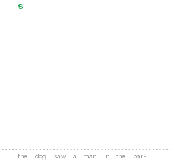
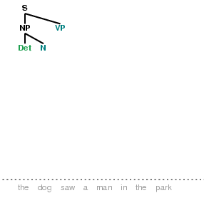
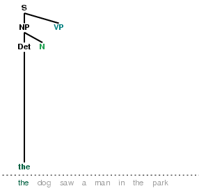
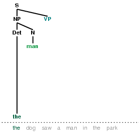
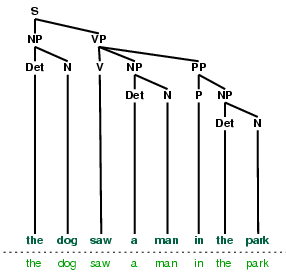
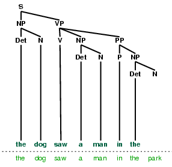

.. -*- mode: rst -*-
.. include:: ../definitions.rst

.. standard global imports

    >>> import nltk, re, pprint

.. TODO: explain that cfg grammars must not mix lexical and phrasal RHS
.. TODO: explain why RHS can't have a sequence of terminals
.. TODO: motivate or omit mathematical notation for formalizing CFGs
.. TODO: include overview of ContextFreeGrammar and Production in 8.4
.. TODO: make URLs clickable in the HTML version
.. TODO: mention Chomsky Normal Form

.. _chap-parse:

=======================
8. Grammars and Parsing
=======================

Earlier chapters focused on words: how to identify them,
analyze their structure, assign them to lexical categories,
and access their meanings.
We have also seen how to identify patterns in word sequences or n-grams.
However, these methods only scratch the surface. 
We need a way to deal with the ambiguity that natural language is famous for.
We also need to be able to cope with the fact that there are an infinite number
of possible sentences, and we can only write finite programs to analyze their
structures and discover their meanings.
 
The goal of this chapter is to answer the following questions:

#. How can we use a formal grammar to describe the structure of an infinite set of sentences?
#. How do we represent the structure of sentences using syntax trees?
#. How do parsers analyze a sentence and automatically build a syntax tree?

Along the way, we will cover the fundamentals of English syntax, and
see that there are systematic aspects of meaning that are much easier
to capture once we have identified the structure of sentences.

.. _dilemmas:

-------------------------
Some Grammatical Dilemmas
-------------------------

Infinite Possibilities
----------------------

Sentences have an interesting property that they can be embedded inside
larger sentences.  Consider the following examples:

.. ex::
  .. ex:: Usain Bolt broke the 100m record
  .. ex:: The Jamaica Observer reported that Usain Bolt broke the 100m record 
  .. ex:: Andre said The Jamaica Observer reported that Usain Bolt broke the 100m record
  .. ex:: I think Andre said the Jamaica Observer reported that Usain Bolt broke the 100m record

If we replaced whole sentences with the symbol `s`:gc:, we would see patterns like
`Andre said S`:lx: and `I think S`:lx:.  These are templates for taking a sentence
and constructing a bigger sentence.  There are other templates we can use, like
`S but S`:lx:, and `S when S`:lx:.  With a bit of ingenuity we can construct some
really long sentences using these templates.  Here's an impressive example from
a Winnie the Pooh story by A.A. Milne,
*In which Piglet is Entirely Surrounded by Water*: 

   You can imagine Piglet's joy when at last the ship came in sight of
   him. In after-years he liked to think that he had been in Very
   Great Danger during the Terrible Flood, but the only danger he had
   really been in was the last half-hour of his imprisonment, when
   Owl, who had just flown up, sat on a branch of his tree to comfort
   him, and told him a very long story about an aunt who had once laid
   a seagull's egg by mistake, and the story went on and on, rather
   like this sentence, until Piglet who was listening out of his
   window without much hope, went to sleep quietly and naturally,
   slipping slowly out of the window towards the water until he was
   only hanging on by his toes, at which moment, luckily, a sudden
   loud squawk from Owl, which was really part of the story, being
   what his aunt said, woke the Piglet up and just gave him time to
   jerk himself back into safety and say, "How interesting, and did
   she?" when -- well, you can imagine his joy when at last he saw
   the good ship, Brain of Pooh (Captain, C. Robin; 1st Mate, P. Bear)
   coming over the sea to rescue him...

This long sentence actually has a simple structure that begins
`S but S when S`:lx:.  We can see from this example that there is
no upper bound on the length of a sentence.  Its striking that
we can produce and understand sentences of arbitrary length
that we've never heard before.  Its not hard to concoct an
entirely novel sentence, one that has probably never been used before
in the history of the language, yet all speakers of the language
will agree about its meaning.

The purpose of a grammar is to provide a compact definition of
this infinite set of sentences.  It achieves this using `recursion`:dt:,
with the help of grammar `productions`:dt: of the form
`s`:gc: |rarr| `s`:gc: `and`:lx: `s`:gc:, as we will explore in
sec-context-free-grammar_.  In chap-semantics_ we will extend this,
to automatically build up the meaning of a sentence out of the meanings
of its parts.

Ubiquitous Ambiguity
--------------------

A well-known example of ambiguity is shown in marx-elephant_  
(from Groucho Marx, Animal Crackers, 1930):

.. _marx-elephant:
.. ex::

   While hunting in Africa, I shot an elephant in my pajamas.
   How an elephant got into my pajamas I'll never know.

Let's take a closer look at the ambiguity in the phrase:
`I shot an elephant in my pajamas`:lx:.  First we
need to define a simple grammar:

    >>> groucho_grammar = nltk.parse_cfg("""
    ... S -> NP VP
    ... PP -> P NP
    ... NP -> Det N | Det N PP | 'I'
    ... VP -> V NP | VP PP
    ... Det -> 'an' | 'my'
    ... N -> 'elephant' | 'pajamas'
    ... V -> 'shot' 
    ... P -> 'in' 
    ... """)

This grammar permits the sentence to be analyzed in two ways,
depending on whether the prepositional phrase `in my pajamas`:lx:
describes the elephant or the shooting event.

    >>> sent = ['I', 'shot', 'an', 'elephant', 'in', 'my', 'pajamas']
    >>> parser = nltk.ChartParser(groucho_grammar) 
    >>> trees = parser.nbest_parse(sent)
    >>> for tree in trees:
    ...     print tree
    ... 
    (S
      (NP I)
      (VP
        (V shot)
        (NP (Det an) (N elephant) (PP (P in) (NP (Det my) (N pajamas))))))
    (S
      (NP I)
      (VP
        (VP (V shot) (NP (Det an) (N elephant)))
        (PP (P in) (NP (Det my) (N pajamas)))))

The program produces two bracketed structures, which we can depict as
trees, as shown in elephant_:

.. _elephant:
.. ex::

  .. ex::
    .. tree:: (S (NP I) (VP (V shot)  (NP (Det an) (N elephant) (PP (P in) (NP (Det my) (N pajamas)))))) 

  .. ex::
    .. tree:: (S (NP I) (VP (VP (V shot) (NP (Det an) (N elephant))) (PP (P in) (NP (Det my) (N pajamas))))) 

Notice that there's no ambiguity concerning the meaning of any of the words.
E.g. the word `shot`:lx: doesn't refer to the act of using a gun in the first sentence,
and using a camera in the second sentence.

.. note:: |TRY|
   Consider the following sentences and see if you can think of two quite different
   interpretations: `Fighting animals could be dangerous.`:lx:
   `Visiting relatives can be tiresome.`:lx:.  Is ambiguity of the individual
   words to blame?  If not, what is the cause of the ambiguity?

Perhaps another kind of syntactic variation, word order, is easier to
understand.  We know that the two sentences `Kim likes Sandy`:lx: and
`Sandy likes Kim`:lx: have different meanings, and that `likes Sandy
Kim`:lx: is simply ungrammatical.  Similarly, we know that the
following two sentences are equivalent:

.. ex::
  .. ex:: The farmer *loaded* the cart with sand
  .. ex:: The farmer *loaded* sand into the cart

However, consider the semantically similar verbs `filled`:lx: and `dumped`:lx:.
Now the word order cannot be altered (ungrammatical sentences are
prefixed with an asterisk.)

.. ex::
  .. ex:: The farmer *filled* the cart with sand
  .. ex:: \*The farmer *filled* sand into the cart
  .. ex:: \*The farmer *dumped* the cart with sand
  .. ex:: The farmer *dumped* sand into the cart

This chapter presents grammars and parsing, as the formal and
computational methods for investigating and modeling the linguistic
phenomena we have been touching on (or tripping over).
As we shall see, patterns of well-formedness and ill-formedness in a
sequence of words can be understood with respect to the underlying
:dt:`phrase structure` of the sentences.  We can develop formal
models of these structures using grammars and parsers.
As before, the motivation is natural language *understanding*.  How
much more of the meaning of a text can we access when we can reliably
recognize the linguistic structures it contains?  Having read in a
text, can a program 'understand' it enough to be able to answer simple
questions about "what happened" or "who did what to whom."  Also as
before, we will develop simple programs to process annotated corpora
and perform useful tasks.

Old School Grammar
------------------

Early experiences with the kind of grammar taught in school are sometimes perplexing,
if not downright frustrating.
Written work is graded by a teacher who red-lined all
the grammar errors they wouldn't put up with.
Like the plural pronoun or the dangling preposition in the last sentence,
or sentences like this one that lack a main verb.
If you learnt English as a second language, you might have found it difficult
to discover which of these errors actually need to be fixed (or should that be: *needs* to be fixed?).
As a consequence, many people are afraid of grammar.  However, as users of
language we depend on our knowledge of grammar in order to produce and
understand sentences.  To see why grammar matters, consider the following
two sentences, which have an important difference of meaning:

.. ex::
  .. _rest:
  .. ex:: The vice-presidential candidate, who was wearing a $10,000 outfit,
          smiled broadly.
  .. _nonrest:
  .. ex:: The vice-presidential candidate who was wearing a $10,000 outfit smiled broadly.

In rest_, we assume there is just one candidate, and say
two things about her: that she was wearing an expensive outfit and that she smiled. In
nonrest_, on the other hand, we use the description `who was wearing a $10,000 outfit`:lx:
as a means of identifying which particular candidate we are referring to.
In the above examples, punctuation is a clue to grammatical structure.  In particular,
it tells us whether the relative clause is restrictive or non-restrictive. 

In contrast, other grammatical concerns are nothing more than
vestiges of antiquated style.  For example, consider the injunction that :lx:`however`
|mdash| when used to mean *nevertheless* |mdash|
must not appear at the start of a sentence.
Pullum argues that Strunk and White [StrunkWhite1999]_ were
merely insisting that English usage should conform to "an utterly
unimportant minor statistical detail of style concerning adverb
placement in the literature they knew" [Pullum2005However]_.
This is a case where, a `descriptive`:em: observation about language use became
a `prescriptive`:em: requirement.

In |NLP| we usually discard such prescriptions,
and use grammar to formalize observations about language as it is used,
particularly as it is used in corpora.
We create our own formal grammars and write programs to parse sentences.
This is a far cry from "old school" grammar.  It is a thoroughly objective
approach that makes grammatical structures explicit with the help of
corpora, formal grammars, and parsers.

.. _sec-whats-the-use-of-syntax:

-------------------------
What's the Use of Syntax?
-------------------------

Syntactic Ambiguity
-------------------

We have seen that sentences can be ambiguous.  If we overheard someone
say :lx:`I went to the bank`, we wouldn't know whether it was
a river bank or a financial institution.  This ambiguity concerns
the meaning of the word :lx:`bank`, and is a kind of :dt:`lexical
ambiguity`.

However, other kinds of ambiguity cannot be explained in terms of
ambiguity of specific words.  Consider a phrase involving
an adjective with a conjunction:
`big cats and dogs`:lx:.
Does `big`:lx: have wider scope than `and`:lx:, or is it the other way
round? In fact, both interpretations are possible, and we can
represent the different scopes using parentheses:

.. ex::
  .. ex::  big (cats and dogs)
  .. ex::  (big cats) and dogs

One convenient way of representing this scope difference at a structural
level is by means of a `tree diagram`:dt:, as shown in tree-diagram_.

.. _tree-diagram:
.. ex::
  .. ex::
    .. tree:: (NP (Adj big)
                  (NP
                     (N cats)
                     (Conj and)
                     (N dogs)))
  .. ex::
    .. tree:: (NP (NP
                     (Adj big)
                     (N cats))
                  (Conj and)
                  (NP
                     (N dogs)))

Note that linguistic trees grow upside down: the node labeled `s`:gc:
is the `root`:dt: of the tree, while the `leaves`:dt: of the tree are
labeled with the words.

In NLTK, you can easily produce trees like this yourself with the
following commands:

    >>> tree = nltk.Tree('(NP (Adj big) (NP (N cats) (Conj and) (N dogs)))')
    >>> tree.draw()             # doctest: +SKIP

We can construct other examples of syntactic ambiguity
involving the coordinating conjunctions `and`:lx: and `or`:lx:, e.g.
`Kim left or Dana arrived and everyone cheered`:lx:.
We can describe this ambiguity in terms of the relative
semantic `scope`:dt: of `or`:lx: and `and`:lx:.

For our third illustration of ambiguity, we look at
prepositional phrases.
Consider a sentence like: :lx:`I saw the man with a telescope`.  Who
has the telescope?  To clarify what is going on here, consider the
following pair of sentences:

.. ex::
  .. ex:: The policeman saw a burglar *with a gun*.
         (not some other burglar)
  .. ex:: The policeman saw a burglar *with a telescope*.
         (not with his naked eye)

In both cases, there is a prepositional phrase introduced by
:lx:`with`.  In the first case this phrase modifies the noun
:lx:`burglar`, and in the second case it modifies the verb :lx:`saw`.
We could again think of this in terms of scope: does the prepositional
phrase (`pp`:gc:) just have scope over the `np`:gc:
`a burglar`:lx:, or does it have scope over
the whole verb phrase? As before, we can represent the difference in terms
of tree structure:

.. _burglar:
.. ex::
  .. ex::
    .. tree:: (S <NP the policeman>
                 (VP (V saw)
                     (NP <NP the burglar>
                         <PP with a gun>)))
  .. ex::
    .. tree:: (S <NP the policeman>
                 (VP (V saw)
                     <NP the burglar>
                     <PP with a telescope>))

In burglar_\ a, the `pp`:gc: attaches to the `np`:gc:,
while in burglar_\ b, the `pp`:gc: attaches to the `vp`:gc:.

We can generate these trees in Python as follows:

    >>> s1 = '(S (NP the policeman) (VP (V saw) (NP (NP the burglar) (PP with a gun))))'
    >>> s2 = '(S (NP the policeman) (VP (V saw) (NP the burglar) (PP with a telescope)))'
    >>> tree1 = nltk.bracket_parse(s1)
    >>> tree2 = nltk.bracket_parse(s2)

We can discard the structure to get the list of `leaves`:dt:, and
we can confirm that both trees have the same leaves (except for the last word).
We can also see that the trees have different `heights`:dt: (given by the
number of nodes in the longest branch of the tree, starting at `s`:gc:
and descending to the words):

    >>> tree1.leaves()
    ['the', 'policeman', 'saw', 'the', 'burglar', 'with', 'a', 'gun']
    >>> tree1.leaves()[:-1] == tree2.leaves()[:-1]
    True
    >>> tree1.height() == tree2.height()
    False

In general, how can we determine whether a prepositional phrase
modifies the preceding noun or verb? This problem is known as
`prepositional phrase attachment ambiguity`:dt:.
The `Prepositional Phrase Attachment Corpus`:dt: makes it
possible for us to study this question systematically.  The corpus is
derived from the IBM-Lancaster Treebank of Computer Manuals and from
the Penn Treebank, and distills out only the essential information
about `pp`:gc: attachment. Consider the sentence from the WSJ
in ppattach-a_.  The corresponding line in the Prepositional Phrase
Attachment Corpus is shown in ppattach-b_.

.. ex::
  .. _ppattach-a:
  .. ex::
     Four of the five surviving workers have asbestos-related diseases,
     including three with recently diagnosed cancer.
  .. _ppattach-b:
  .. ex::
     ::

       16 including three with cancer N

|nopar|
That is, it includes an identifier for the original sentence, the
head of the relevant verb phrase (i.e., `including`:lx:), the head of
the verb's `np`:gc: object (`three`:lx:), the preposition
(`with`:lx:), and the head noun within the prepositional phrase
(`cancer`:lx:). Finally, it contains an "attachment" feature (``N`` or
``V``) to indicate whether the prepositional phrase attaches to
(modifies) the noun phrase or the verb phrase. 
Here are some further examples:

.. _ppattachments:
.. ex::
   :: 

     47830 allow visits between families N
     47830 allow visits on peninsula V
     42457 acquired interest in firm N
     42457 acquired interest in 1986 V

|nopar|
The PP attachments in ppattachments_ can also be made explicit by
using phrase groupings as in phrase-groupings_.

.. _phrase-groupings:
.. ex::
   :: 

     allow (NP visits (PP between families))
     allow (NP visits) (PP on peninsula)
     acquired (NP interest (PP in firm))
     acquired (NP interest) (PP in 1986)

Observe in each case that the argument of the verb is either a single
complex expression ``(visits (between families))`` or a pair of
simpler expressions ``(visits) (on peninsula)``.

We can access the Prepositional Phrase Attachment Corpus from NLTK as follows:

    >>> nltk.corpus.ppattach.tuples('training')[9]
    ('16', 'including', 'three', 'with', 'cancer', 'N')

If we go back to our first examples of `pp`:gc: attachment ambiguity,
it appears as though it is the `pp`:gc: itself (e.g., `with a gun`:lx:
versus `with a telescope`:lx:) that determines the attachment. However,
we can use this corpus to find examples where other factors come into play.
For example, it appears that the verb is the key factor in ppattach-verb_.

.. _ppattach-verb:
.. ex::
   :: 

     8582 received offer from group V
     19131 rejected offer from group N

Constituency
------------

We claimed earlier that one of the motivations for building syntactic
structure was to help make explicit how a sentence says "who did what
to whom". Let's just focus for a while on the "who" part of this
story: in other words, how can syntax tell us what the subject of a
sentence is? At first, you might think this task is rather simple
|mdash| so simple indeed that we don't need to bother with syntax. In
a sentence such as `The fierce dog bit the man`:lx:
we know that it is the dog that is doing the biting. So we could
say that the noun phrase immediately preceding the verb is the
subject of the sentence. And we might try to make this more explicit
in terms of sequences part-of-speech tags.  Let's try to come up with a simple
definition of `noun phrase`:idx:; we might start off with something
like this, based on our knowledge of noun phrase chunking (Chapter chap-chunk_):

.. ex::
    `dt jj* nn`:gc:

|nopar|
We're using regular expression notation here in the form of
`jj*`:gc: to indicate a sequence of zero or more `jj`:gc:\s. So this
is intended to say that a noun phrase can consist of a
determiner, possibly followed by some adjectives, followed by a
noun. Then we can go on to say that if we can find a sequence of
tagged words like this that precedes a word tagged as a verb, then
we've identified the subject. But now think about this sentence:

.. ex:: The child with a fierce dog bit the man.

|nopar|
This time, it's the child that is doing the biting. But the tag
sequence preceding the verb is:

.. ex::
    `dt nn in dt jj nn`:gc:

Our previous attempt at identifying the subject would have
incorrectly come up with `the fierce dog`:lx: as the subject.
So our next hypothesis would have to be a bit more complex. For
example, we might say that the subject can be identified as any string
matching the following pattern before the verb:

.. ex::
     `dt jj* nn (in dt jj* nn)*`:gc:

In other words, we need to find a noun phrase followed by zero or more
sequences consisting of a preposition followed by a noun phrase. Now
there are two unpleasant aspects to this proposed solution. The first
is esthetic: we are forced into repeating the sequence of tags (`dt
jj* nn`:gc:) that constituted our initial notion of noun phrase, and
our initial notion was in any case a drastic simplification. More
worrying, this approach still doesn't work! For consider the following
example:

.. _seagull:
.. ex:: The seagull that attacked the child with the fierce dog bit the man.

|nopar|
This time the seagull is the culprit, but it won't be detected as subject by our
attempt to match sequences of tags. So it seems that we need a
richer account of how words are *grouped* together into patterns, and
a way of referring to these groupings at different points in the
sentence structure. This idea of grouping is often called
syntactic `constituency`:dt:.

As we have just seen, a well-formed sentence of a language is more
than an arbitrary sequence of words from the language.  Certain kinds
of words usually go together.  For instance, determiners like `the`:lx:
are typically followed by adjectives or nouns, but not by verbs.
Groups of words form intermediate structures called phrases or
:dt:`constituents`.  These constituents can be identified using
standard syntactic tests, such as substitution, movement and
coordination.  For example, if a sequence of words can be replaced
with a pronoun, then that sequence is likely to be a constituent.
According to this test, we can infer that the italicized string in the
following example is a constituent, since it can be replaced by
`they`:lx:\:

.. ex::
  .. ex:: *Ordinary daily multivitamin and mineral supplements* could 
         help adults with diabetes fight off some minor infections.
  .. ex:: *They* could help adults with diabetes fight off some minor
         infections.

In order to identify whether a phrase is the subject of a sentence, we
can use the construction called `Subject-Auxiliary Inversion`:dt: in
English. This construction allows us to form so-called Yes-No
Questions. That is, corresponding to the statement in have1_, we have
the question in have2_:

.. ex::
  .. _have1:
  .. ex:: All the cakes have been eaten.
  .. _have2:
  .. ex:: Have *all the cakes* been eaten?

Roughly speaking, if a sentence already contains an auxiliary verb,
such as `has`:lx: in have1_, then we can turn it into a Yes-No
Question by moving the auxiliary verb 'over' the subject noun phrase
to the front of the sentence. If there is no auxiliary in the
statement, then we insert the appropriate form of `do`:lx: as the
fronted auxiliary and replace the tensed main verb by its base form:

.. ex::
  .. ex:: The fierce dog bit the man.
  .. ex:: Did *the fierce dog* bite the man?

As we would hope, this test also confirms our earlier claim about the
subject constituent of seagull_:

.. ex:: Did *the seagull that attacked the child with the fierce dog* bite
       the man?

To sum up then, we have seen that the notion of constituent brings a
number of benefits. By having a constituent labeled `noun phrase`:gc:,
we can provide a unified statement of the classes of word that
constitute that phrase, and reuse this statement in describing noun
phrases wherever they occur in the sentence. Second, we can use the
notion of a noun phrase in defining the subject of sentence, which in
turn is a crucial ingredient in determining the "who does what to
whom" aspect of meaning.

.. _sec-context-free-grammar:

--------------------
Context Free Grammar
--------------------

As we have seen, languages are infinite |mdash| there is no principled
upper-bound on the length of a sentence.  Nevertheless, we would like
to write (finite) programs that can process well-formed sentences.  It turns
out that we can characterize what we mean by well-formedness using a
grammar.  The way that finite grammars are able to describe an
infinite set uses `recursion`:dt:.  (We already came across this idea
when we looked at regular expressions: the finite expression ``a+`` is
able to describe the infinite set ``{a, aa, aaa, aaaa, ...}``).  Apart
from their compactness, grammars usually capture important structural
and distributional properties of the language, and can be used to map
between sequences of words and abstract representations of meaning.
Even if we were to impose an upper bound on sentence length to ensure
the language was finite, we would probably still want to come up with
a compact representation in the form of a grammar.

A `grammar`:dt: is a formal system that specifies which sequences of
words are well-formed in the language, and that provides one or more
phrase structures for well-formed sequences.  We will be looking at
:dt:`context-free grammar` (CFG), which is a collection of
`productions`:dt: of the form `s`:gc: |rarr| `np vp`:gc:.  This says
that a constituent `s`:gc: can consist of sub-constituents `np`:gc:
and `vp`:gc:. Similarly, the production `v`:gc: |rarr| ``'saw' | ``'walked'``
means that the constituent `v`:gc: can consist of the string
`saw`:lx: or `walked`:lx:.
For a phrase structure tree to be well-formed relative to
a grammar, each non-terminal node and its children must correspond to
a production in the grammar.

A Simple Grammar
----------------

Let's start off by looking at a simple context-free grammar.
By convention, the left-hand-side of the first production is
the `start-symbol`:dt: of the grammar, and all well-formed trees
must have this symbol as their root label.

.. _grammar1:
.. ex::

 | S |rarr| NP VP
 | NP |rarr| Det N | Det N PP
 | VP |rarr| V | V NP | V NP PP
 | PP |rarr| P NP
 |
 | Det |rarr| 'the' | 'a'
 | N |rarr| 'man' | 'park' | 'dog' | 'telescope'
 | V |rarr| 'saw' | 'walked'
 | P |rarr| 'in' | 'with'

This grammar contains productions involving various syntactic categories,
as laid out in Table syncat_.

.. table:: syncat

   ======    ====================    =====================
   Symbol    Meaning                 Example
   ======    ====================    =====================
   S         sentence                `the man walked`:lx:
   NP        noun phrase             `a dog`:lx:
   VP        verb phrase             `saw a park`:lx:
   PP        prepositional phrase    `with a telescope`:lx:
   ...       ...                     ...
   Det       determiner              `the`:lx:
   N         noun                    `dog`:lx:
   V         verb                    `walked`:lx:
   P         preposition             `in`:lx:
   ======    ====================    =====================

   Syntactic Categories

In our following discussion of grammar, we will use the following terminology.
The grammar consists of productions, where each production involves a
single `non-terminal`:dt: (e.g. `s`:gc:, `np`:gc:), an arrow, and one
or more non-terminals and `terminals`:dt: (e.g. `walked`:lx:).
The productions are often divided into two main groups.
The `grammatical productions`:dt: are those without a terminal on
the right hand side.  The `lexical productions`:dt: are those having
a terminal on the right hand side.
A special case of non-terminals are the `pre-terminals`:dt:, which
appear on the left-hand side of lexical productions.
We will say that a grammar `licenses`:dt: a tree if each non-terminal
`x`:gc: with children `y`:gc:\ :subscript:`1` ... `y`:gc:\ :subscript:`n`
corresponds to a production in the grammar of the form:
`x`:gc: |rarr| `y`:gc:\ :subscript:`1` ... `y`:gc:\ :subscript:`n`.

In order to get started with developing simple grammars of your own, you
will probably find it convenient to play with the recursive descent
parser demo, ``nltk.draw.rdparser.demo()``.
The demo opens a window that displays a list of grammar productions in the
left hand pane and the current parse diagram in the central pane:

.. image:: ../images/parse_rdparsewindow.png
   :scale: 100

The demo comes with the grammar in grammar1_ already loaded. We will
discuss the parsing algorithm in greater detail below, but for the
time being you can get an idea of how it works by using the *autostep* button.
If we parse the string `The dog saw a man in the park` using
the grammar in grammar1_, we end up with two trees:

.. ex::
  .. ex::
    .. tree:: (S (NP (Det the) (N dog))
                 (VP (V saw)
                     (NP (Det a) (N man))
                     (PP (P in) (NP (Det the) (N park)))))
  .. ex::
    .. tree:: (S (NP (Det the) (N dog))
                 (VP (V saw)
                     (NP (Det a)
                         (N man)
                         (PP (P in) (NP (Det the) (N park))))))

Since our grammar licenses two trees for this sentence, the sentence is
said to be :dt:`structurally ambiguous`.  The ambiguity in question is called
a `prepositional phrase attachment ambiguity`:idx:, as we saw earlier in this chapter.
As you may recall, it is an ambiguity about attachment since the
`pp`:gc: `in the park`:lx: needs to be attached to one of two places
in the tree: either as a daughter of `VP`:gc: or else as a daughter of
`np`:gc:.
When the `pp`:gc: is attached to `vp`:gc:, the seeing event happened
in the park.  However, if the `pp`:gc: is attached to `np`:gc:,
then the man was in the park, and the agent of the seeing (the dog)
might have been sitting on the balcony of an apartment overlooking the park.
As we will see, dealing with ambiguity is a key challenge in parsing.

Recursion in Syntactic Structure
--------------------------------

A grammar is said to be :dt:`recursive` if a category occurring on the left hand
side of a production (such as `s`:gc: in this case) also appears on
the right hand side of a production. If this dual occurrence takes
place in *one and the same production*, then we have :dt:`direct
recursion`; otherwise we have :dt:`indirect recursion`. There is no
recursion in grammar1_. However, the grammar in grammar2_ illustrates both kinds of
recursive production:

.. _grammar2:
.. ex::
     .. parsed-literal::

        S  |rarr| NP VP
        NP |rarr| Det Nom | Det Nom PP | PropN
        Nom |rarr| Adj Nom | N
        VP |rarr| V | V NP | V NP PP | V S
        PP |rarr| P NP

        PropN |rarr| 'John' | 'Mary' 
        Det |rarr| 'the' | 'a'
        N |rarr| 'man' | 'woman' | 'park' | 'dog' | 'lead' | 'telescope' | 'butterfly'
        Adj  |rarr| 'fierce' | 'black' |  'big' | 'European'
        V |rarr| 'saw' | 'chased' | 'barked'  | 'disappeared' | 'said' | 'reported' 
        P |rarr| 'in' | 'with' 

Notice that the production `Nom`:gc: |rarr| `Adj Nom`:gc: (where
`Nom`:gc: is the category of nominals) involves direct
recursion on the category `Nom`:gc:, whereas indirect recursion on `s`:gc:
arises from the combination of two productions, namely `s`:gc: |rarr|
`np vp`:gc: and `vp`:gc: |rarr| `v s`:gc:.  

To see how recursion is handled in this grammar, consider the following
trees.  Example nested-nominals_ involves nested nominal phrases,
while nested-sentences_ contains nested sentences.

.. ex::
  .. ex::
    .. _nested-nominals:
    .. tree::
     (S (NP (Det a) (Nom (Adj fierce)(Nom (Adj black) (N dog))))
         (VP (V chased)
            (NP (Det the) (Nom (Adj big)(Nom (Adj European) (N butterfly))))))
  .. ex::
    .. _nested-sentences:
    .. tree::
      (S (NP (Det the) (N man))
         (VP (V said)
             (S (NP (Det the) (N woman))
                (VP (V thought)
                    (S (NP (Det the) (N dog))
                             (VP (V barked)))))))

If you did the exercises for the last section, you will have noticed
that the recursive descent parser fails to deal properly with the
following production: `np`:gc: |rarr| `np pp`:gc:.
From a linguistic point of view, this production is perfectly respectable,
and will allow us to derive trees like this:

.. ex::
  .. tree::
    (S (NP 
           (NP 
               (NP (Det the) (N man))
               (PP (P with) (NP  (Det a) (N dog))))
            (PP (P in  (NP  (Det the) (N park)))))
         (VP (V disappeared)))

More schematically, the trees for these compound noun phrases will be
of the following shape:

.. _leftrec:
.. ex::
  .. tree::
    (NP (NP (NP (NP Det N) PP) PP) PP)

The structure in leftrec_ is called a `left recursive`:dt: structure.
These occur frequently in analyses of English, and
the failure of recursive descent parsers to deal adequately with left
recursion means that we will need to find alternative approaches.

Heads, Complements and Modifiers
--------------------------------

Let us take a closer look at verbs.
The grammar grammar2_ correctly generates examples like subcat1_,
corresponding to the four productions with `vp`:gc: on the left hand side:

.. _subcat1:
.. ex::
   .. ex:: The woman gave the telescope to the dog
   .. ex:: The woman saw a man
   .. ex:: A man said that the woman disappeared
   .. ex:: The dog barked

That is, `gave`:lx: can occur with a following `np`:gc: and `pp`:gc:; 
`saw`:lx: can occur with a following `np`:gc:; 
`said`:lx: can occur with a following `s`:gc:; 
and `barked`:lx: can occur with no following phrase.
In these cases, `np`:gc:, `pp`:gc: and `s`:gc: are called :dt:`complements`
of the respective verbs, and the verbs themselves are called
:dt:`heads` of the verb phrase.

However, there are fairly strong constraints on what verbs can occur
with what complements. Thus, we would like our grammars to mark the
following examples as ungrammatical:

.. _subcat2:
.. ex:: 
   .. ex:: \*The woman disappeared the telescope to the dog
   .. ex:: \*The dog barked a man
   .. ex:: \*A man gave that the woman disappeared
   .. ex:: \*A man said

.. note:: It is possible to create examples that involve 'non-standard'
   but interpretable combinations of verbs and complements. Thus,
   we can, at a stretch, interpret `the man disappeared the dog`:lx:
   to mean that the man made the dog disappear. We will ignore such examples here.

How can we ensure that our grammar correctly excludes the
ungrammatical examples in subcat2_?  We need some way of constraining
grammar productions which expand `vp`:gc: so that verbs *only* co-occur
with their correct complements. We do this by dividing the class of
verbs into `subcategories`:dt:, each of which is associated with a
different set of complements. For example, `transitive verbs`:dt: such
as `saw`:lx:, `kissed`:lx: and `hit`:lx: require a following `np`:gc:
object complement. Borrowing from the terminology of chemistry, we
sometimes refer to the `valency`:dt: of a verb, that is, its capacity
to combine with a sequence of arguments and thereby compose a verb
phrase.

Let's introduce a new category label for such verbs, namely
`tv`:gc: (for Transitive Verb), and use it in the following productions:

.. ex::
   .. parsed-literal::

     `vp`:gc: |rarr| `tv np`:gc:
     `tv`:gc: |rarr| 'saw' | 'kissed' | 'hit'

Now `*the dog barked the man`:lx: is excluded since we haven't listed
`barked`:lx: as a `V_tr`:gc:, but `the woman saw a man`:lx: is still allowed.
Table verbcat_ provides more examples of labels for verb subcategories.

.. table:: verbcat

   ======    ====================    ========================
   Symbol    Meaning                 Example
   ======    ====================    ========================
   IV        intransitive verb       *barked*
   TV        transitive verb         *saw a man*
   DatV      dative verb             *gave a dog to a man*
   SV        sentential verb         *said that a dog barked*
   ======    ====================    ========================

   Verb Subcategories

The revised grammar for `vp`:gc: will now look like this:

.. _subcat3:
.. ex::
   .. parsed-literal:: 

      `vp`:gc: |rarr| `datv np pp`:gc:
      `vp`:gc: |rarr| `tv np`:gc:
      `vp`:gc: |rarr| `sv s`:gc:
      `vp`:gc: |rarr| `iv`:gc: 

      `datv`:gc: |rarr| 'gave' | 'donated' | 'presented'
      `tv`:gc: |rarr| 'saw' | 'kissed' | 'hit' | 'sang'
      `sv`:gc: |rarr| 'said' | 'knew' | 'alleged'
      `iv`:gc: |rarr| 'barked' | 'disappeared' | 'elapsed' | 'sang'

Notice that according to subcat3_, a given lexical item can belong to more
than one subcategory. For example, `sang`:lx: can occur both with and
without a following `np`:gc: complement.

Scaling Up
----------

So far, we have only considered "toy grammars," small grammars that
illustrate the key aspects of parsing.  But there is an obvious
question as to whether the approach can be scaled up to cover
large corpora of natural languages. How hard would it be to construct
such a set of productions by hand? In general, the answer is: *very
hard*. Even if we allow ourselves to use various formal devices that
give much more succinct representations of grammar productions (some
of which will be discussed in Chapter chap-advanced-parsing_), it is still extremely
difficult to keep control of the complex interactions between the many
productions required to cover the major constructions of a
language. In other words, it is hard to modularize grammars so that
one portion can be developed independently of the other parts. This in
turn means that it is difficult to distribute the task of grammar
writing across a team of linguists. Another difficulty is that as the
grammar expands to cover a wider and wider range of constructions,
there is a corresponding increase in the number of analyses which are
admitted for any one sentence. In other words, ambiguity increases
with coverage.

Despite these problems, some large collaborative
projects have achieved interesting and impressive results in
developing rule-based grammars for several languages. Examples are the
Lexical Functional Grammar (LFG) Pargram project
(http://www2.parc.com/istl/groups/nltt/pargram/), the Head-Driven
Phrase Structure Grammar (HPSG) LinGO Matrix framework
(http://www.delph-in.net/matrix/), and the Lexicalized Tree Adjoining
Grammar XTAG Project (http://www.cis.upenn.edu/~xtag/).

Context Free Grammar in NLTK
----------------------------

In NLTK, context free grammars are defined in the ``nltk.grammar`` module.
In Figure cfg_ we define a grammar and use it to parse a simple
sentence.  You will learn more about parsing in the next section.

.. pylisting:: cfg
   :caption: Context Free Grammars in NLTK

   grammar = nltk.parse_cfg("""
     S -> NP VP
     VP -> V NP | V NP PP
     V -> "saw" | "ate"
     NP -> "John" | "Mary" | "Bob" | Det N | Det N PP
     Det -> "a" | "an" | "the" | "my"
     N -> "dog" | "cat" | "cookie" | "park"
     PP -> P NP
     P -> "in" | "on" | "by" | "with"
     """)
   >>> sent = "Mary saw Bob".split()
   >>> rd_parser = nltk.RecursiveDescentParser(grammar)
   >>> for p in rd_parser.nbest_parse(sent):
   ...      print p
   (S (NP Mary) (VP (V saw) (NP Bob)))

.. _sec-parsing:

---------------------------------
Parsing With Context Free Grammar
---------------------------------

A :dt:`parser` processes input sentences according to the
productions of a grammar, and builds one or more
constituent structures that conform to the grammar.
A grammar is a declarative specification of well-formedness |mdash|
it is actually just a string, not a program.
A parser is a procedural interpretation of the grammar.
It searches through the space of trees licensed by a grammar
to find one that has the required sentence along its fringe.

A parser permits a grammar to be evaluated against
a collection of test sentences, helping linguists
to discover mistakes in their grammatical analysis.
A parser can serve as a model of psycholinguistic processing,
helping to explain the difficulties that humans have with processing
certain syntactic constructions.
Many natural language applications involve parsing at some point;
for example, we would expect the natural language questions
submitted to a question-answering system to undergo parsing as an initial step.

In this section we see two simple parsing algorithms,
a top-down method called recursive descent parsing,
and a bottom-up method called shift-reduce parsing.

Recursive Descent Parsing 
-------------------------

The simplest kind of parser interprets a grammar as a specification
of how to break a high-level goal into several lower-level subgoals.
The top-level goal is to find an `s`:gc:.  The `s`:gc: |rarr| `np vp`:gc:
production permits the parser to replace this goal with two subgoals:
find an `np`:gc:, then find a `vp`:gc:.  Each of these subgoals can be
replaced in turn by sub-sub-goals, using productions that have `np`:gc:
and `vp`:gc: on their left-hand side.  Eventually, this expansion
process leads to subgoals such as: find the word `telescope`:lx:.  Such
subgoals can be directly compared against the input string, and
succeed if the next word is matched.  If there is no match the parser
must back up and try a different alternative.

The recursive descent parser builds a parse tree during the above
process.  With the initial goal (find an `s`:gc:), the `s`:gc: root node
is created.  As the above process recursively expands its goals using
the productions of the grammar, the parse tree is extended downwards
(hence the name *recursive descent*).  We can see this in action using
the parser demonstration ``nltk.draw.rdparser.demo()``.
Six stages of the execution of this parser are shown in Table rdparser_.

.. table:: rdparser

   +---------------------------+--------------------------+---------------------------+
   | |rdparser1|               | |rdparser2|              | |rdparser3|               |
   |                           |                          |                           |
   | a. Initial stage          | b. 2nd production        | c. Matching `the`:lx:     |
   +---------------------------+--------------------------+---------------------------+
   | |rdparser4|               | |rdparser5|              | |rdparser6|               |
   |                           |                          |                           |
   | d. Cannot match `man`:lx: | e. Completed parse       | f. Backtracking           |
   +---------------------------+--------------------------+---------------------------+

   Six Stages of a Recursive Descent Parser

During this process, the parser is often forced to choose between several
possible productions.  For example, in going from step 3 to step 4, it
tries to find productions with `n`:gc: on the left-hand side.  The
first of these is `n`:gc: |rarr| `man`:lx:.  When this does not work
it `backtracks`:idx:, and tries other `n`:gc: productions in order, under it
gets to `n`:gc: |rarr| `dog`:lx:, which matches the next word in the
input sentence.  Much later, as shown in step 5, it finds a complete
parse.  This is a tree that covers the entire sentence, without any
dangling edges.  Once a parse has been found, we can get the parser to
look for additional parses.  Again it will backtrack and explore other
choices of production in case any of them result in a parse.

NLTK provides a recursive descent parser:

    >>> rd_parser = nltk.RecursiveDescentParser(grammar)
    >>> sent = 'Mary saw a dog'.split()
    >>> for t in rd_parser.nbest_parse(sent):
    ...     print t
    (S (NP Mary) (VP (V saw) (NP (Det a) (N dog))))

.. Note:: ``RecursiveDescentParser()`` takes an optional parameter ``trace``. 
   If ``trace`` is greater than zero, then the parser will report the steps
   that it takes as it parses a text.

Recursive descent parsing has three key shortcomings.  First,
left-recursive productions like `np`:gc: |rarr| `np pp`:gc: send it
into an infinite loop.  Second, the parser wastes a lot of time
considering words and structures that do not correspond to the input
sentence.  Third, the backtracking process may discard parsed
constituents that will need to be rebuilt again later.  For example,
backtracking over `vp`:gc: |rarr| `v np`:gc: will discard the subtree
created for the `np`:gc:.  If the parser then proceeds with `vp`:gc:
|rarr| `v np pp`:gc:, then the `np`:gc: subtree must be created all
over again.

Recursive descent parsing is a kind of `top-down parsing`:dt:.
Top-down parsers use a grammar to *predict* what the input will be,
before inspecting the input!  However, since the input is available to
the parser all along, it would be more sensible to consider the input
sentence from the very beginning.  This approach is called
`bottom-up parsing`:dt:, and we will see an example in the next section.

Shift-Reduce Parsing 
--------------------

A simple kind of bottom-up parser is the `shift-reduce parser`:dt:.
In common with all bottom-up parsers, a shift-reduce
parser tries to find sequences of words and phrases that correspond
to the *right hand* side of a grammar production, and replace them
with the left-hand side, until the whole sentence is reduced to
an `s`:gc:.

The shift-reduce parser repeatedly pushes the next input word onto a
stack (Section sec-back-to-the-basics_); this is the `shift`:dt: operation.
If the top *n* items on the stack match
the *n* items on the right hand side of some production,
then they are all popped off the stack, and the item on the left-hand
side of the production is pushed on the stack.  This replacement of
the top *n* items with a single item is the `reduce`:dt: operation.
(This reduce operation may only be applied to the top of the stack;
reducing items lower in the stack must be done before later items are
pushed onto the stack.)  The parser finishes when all the input is
consumed and there is only one item remaining on the stack, a parse
tree with an `s`:gc: node as its root.

The shift-reduce parser builds a parse tree during the above process.
If the top of stack holds the word `dog`:lx:, and if the grammar has a
production `n`:gc: |rarr| `dog`:lx:, then the reduce operation causes the word
to be replaced with the parse tree for this production.  For
convenience we will represent this tree as ``N(dog)``.  At a later
stage, if the top of the stack holds two items ``Det(the) N(dog)`` and
if the grammar has a production `np`:gc: |rarr| `det n`:gc: then the reduce
operation causes these two items to be replaced with ``NP(Det(the),
N(dog))``.  This process continues until a parse tree for the entire
sentence has been constructed.  We can see this in action using the
parser demonstration ``nltk.draw.srparser.demo()``.
Six stages of the execution of this parser are shown in Figure srparser_.

.. table:: srparser

   +------------------------------------+------------------------------------+
   | .. image:: ../images/srparser1.png | .. image:: ../images/srparser2.png |
   |    :scale: 50                      |    :scale: 50                      |
   |                                    |                                    |
   | 1. Initial State                   | 2. After one shift                 |
   +------------------------------------+------------------------------------+
   | .. image:: ../images/srparser3.png | .. image:: ../images/srparser4.png |
   |    :scale: 50                      |    :scale: 50                      |
   |                                    |                                    |
   | 3. After reduce shift reduce       | 4. After recognizing the second NP |
   +------------------------------------+------------------------------------+
   | .. image:: ../images/srparser5.png | .. image:: ../images/srparser6.png |
   |    :scale: 50                      |    :scale: 50                      |
   |                                    |                                    |
   | 5. Complex NP                      | 6. Final Step                      |
   +------------------------------------+------------------------------------+

   Six Stages of a Shift-Reduce Parser

NLTK provides ``ShiftReduceParser()``, a simple
implementation of a shift-reduce parser.  This parser does not
implement any backtracking, so it is not guaranteed to find a parse
for a text, even if one exists.  Furthermore, it will only find at
most one parse, even if more parses exist.  We can provide an
optional ``trace`` parameter that controls how verbosely the
parser reports the steps that it takes as it parses a text: 

    >>> sr_parse = nltk.ShiftReduceParser(grammar)
    >>> sent = 'Mary saw a dog'.split()
    >>> print sr_parse.parse(sent)
      (S (NP Mary) (VP (V saw) (NP (Det a) (N dog))))

.. note:: |TRY|
   Run the above parser in tracing mode to see the sequence of shift and reduce
   operations, using ``sr_parse = nltk.ShiftReduceParser(grammar, trace=2)``

Shift-reduce parsers have a number of problems.
A shift-reduce parser may fail to parse the sentence, even though the
sentence is well-formed according to the grammar.  In such cases,
there are no remaining input words to shift, and there is no way to
reduce the remaining items on the stack, as exemplified in Table conflict_\ 1.
The parser entered this blind alley at an earlier
stage shown in Table conflict_\ 2, when it reduced instead of
shifted.  This situation is called a `shift-reduce conflict`:dt:.  At
another possible stage of processing shown in Table conflict_\ 3,
the parser must choose between two possible reductions, both matching
the top items on the stack: `vp`:gc: |rarr| `vp np pp`:gc: or `np`:gc: |rarr|
`np pp`:gc:.  This situation is called a `reduce-reduce conflict`:dt:.

.. table:: conflict

   +------------------------------------------+
   | .. image:: ../images/srparser7.png       |
   |    :scale: 50                            |
   |                                          |
   | 1. Dead end                              |
   +------------------------------------------+
   | .. image:: ../images/srparser8.png       |
   |    :scale: 50                            |
   |                                          |
   | 2. Shift-reduce conflict                 |
   +------------------------------------------+
   | .. image:: ../images/srparser9.png       |
   |    :scale: 50                            |
   |                                          |
   | 3. Reduce-reduce conflict                |
   +------------------------------------------+

   Conflict in Shift-Reduce Parsing

.. To do: diagram showing search tree with success and failure.

Shift-reduce parsers may implement policies for resolving such
conflicts.  For example, they may address shift-reduce conflicts by
shifting only when no reductions are possible, and they may address
reduce-reduce conflicts by favoring the reduction operation that removes
the most items from the stack.  No such policies are failsafe however.

The advantages of shift-reduce parsers over recursive descent parsers
is that they only build structure that corresponds to the words in the
input.  Furthermore, they only build each sub-structure once,
e.g. ``NP(Det(the), N(man))`` is only built and pushed onto the stack
a single time, regardless of whether it will later be used by the `vp`:gc:
|rarr| `v np pp`:gc: reduction or the `np`:gc: |rarr| `np pp`:gc: reduction.

The Left-Corner Parser
----------------------

One of the problems with the recursive descent parser is that it can
get into an infinite loop.  This is because it applies the grammar
productions blindly, without considering the actual input sentence.
A left-corner parser is a hybrid between the bottom-up and top-down
approaches we have seen.

Grammar grammar2_ allows us to produce the following parse of `John saw
Mary`:lx:\ :

.. _jmtree:
.. ex::
  .. tree::
   (S (NP John) 
      (VP (V saw)
         (NP Mary)))

Recall that the grammar in grammar2_ has the following productions for expanding `np`:gc:\ :

.. ex::
   .. _r1:
   .. ex:: `np`:gc: |rarr| `dt nom`:gc:
   .. _r2:
   .. ex:: `np`:gc: |rarr| `dt nom pp`:gc:
   .. _r3:
   .. ex:: `np`:gc: |rarr| `propn`:gc: 

Suppose we ask you to first look at tree jmtree_, and then decide
which of the `np`:gc: productions you'd want a recursive descent parser to
apply first |mdash| obviously, r3_ is the right choice! How do you
know that it would be pointless to apply r1_ or r2_ instead? Because
neither of these productions will derive a string whose first word is
`John`:lx:.  That is, we can easily tell that in a successful
parse of `John saw Mary`:lx:, the parser has to expand `np`:gc: in
such a way that `np`:gc: derives the string `John`:lx: |alpha|. More
generally, we say that a category `B`:math: is a `left-corner`:dt: of
a tree rooted in `A`:math: if  `A`:math: |DoubleRightArrow|\ *
`B`:math: |alpha|.

.. ex::
  .. tree:: <A B a>

A `left-corner parser`:dt: is a top-down parser with bottom-up filtering.
Unlike an ordinary recursive descent parser, it does not get trapped
in left recursive productions. 
Before starting its work, a left-corner parser preprocesses the
context-free grammar to build a table where each row contains two
cells, the first holding a non-terminal, and the second holding the
collection of possible left corners of that non-terminal. Table lc_
illustrates this for the grammar from grammar2_.

.. table:: lc

   ========  ============================
   Category  Left-Corners (pre-terminals)
   ========  ============================
   S         NP
   NP        Det, PropN
   VP        V
   PP        P
   ========  ============================

   Left-Corners in grammar2_

Each time a production is considered by the parser, it checks that the
next input word is compatible with at least one of the pre-terminal
categories in the left-corner table.

[TODO: *explain how this effects the action of the parser, and why this solves the problem.*]

Summary
-------

A context-free phrase structure grammar (|CFG|) is a formal model for
describing whether a given string can be assigned a particular
constituent structure. Given a set of syntactic categories, the |CFG|
uses a set of productions to say how a phrase of some category *A* can
be analyzed into a sequence of smaller parts |alpha|\ :sub:`1`
... |alpha|\ :sub:`n`.  But a grammar is a static description of a set
of strings; it does not tell us what sequence of steps we need to take
to build a constituent structure for a string. For this, we need to
use a parsing algorithm.  We presented two such algorithms: Top-Down Recursive
Descent Bottom-Up Shift-Reduce (sec-parsing_).
As we pointed out, both parsing approaches suffer
from important shortcomings. The Recursive Descent parser cannot
handle left-recursive productions (e.g., productions such as `np`:gc:
|rarr| `np pp`:gc:), and blindly expands categories top-down without
checking whether they are compatible with the input string. The
Shift-Reduce parser is not guaranteed to find a valid parse for the
input even if one exists, and builds substructure without checking
whether it is globally consistent with the grammar. As we will
describe further below, the Recursive Descent parser is also
inefficient in its search for parses.

.. _chart-parsing:

-------------
Chart Parsing
-------------

The simple parsers discussed above suffer from limitations in
both completeness and efficiency. In order to remedy these, we will
apply the algorithm design technique of `dynamic programming`:idx: to
the parsing problem.  As we saw in Section sec-algorithm-design-strategies_,
dynamic programming stores intermediate results and re-uses them when
appropriate, achieving significant efficiency gains. This technique
can be applied to syntactic parsing, allowing us to store
partial solutions to the parsing task and then look them up as
necessary in order to efficiently arrive at a complete solution.
This approach to parsing is known as `chart parsing`:dt:, and is the
focus of this section.

Well-Formed Substring Tables
----------------------------

Dynamic programming allows us to build the `pp`:gc: `in my pyjamas`:lx:
just once.  The first time we build it we save it in a table, then we look it
up when we need to use it as a subconstituent of either the object `np`:gc: or
the higher `vp`:gc:. This table is known as a
`well-formed substring table`:dt: (or |WFST| for short). 
We will show how to construct the |WFST| bottom-up so as to systematically record
what syntactic constituents have been found.

Let's set our input to be the sentence in elephant_.
It is helpful to think of the input as being indexed like a Python
list. We have illustrated this in Figure stringpos_.

.. _stringpos:
.. figure:: ../images/chart_positions.png
   :scale: 25

   Slice Points in the Input String

|nopar|
This allows us to say that, for instance, the word `shot`:lx: spans
(1, 2) in the input.  This is reminiscent of the slice notation:

    >>> text = ["I", "shot", "an", "elephant", "in", "my", "pajamas"]
    >>> text[1:2]
    ['shot']

|nopar|
In a |WFST|, we record the position of the words
by filling in cells in a triangular matrix:
the vertical axis will denote the start position of a substring,
while the horizontal axis will denote the end position
(thus `shot`:lx: will appear in the cell with coordinates (1, 2)).
To simplify this presentation, we will assume each word has a unique
lexical category, and we will store this (not the word) in the matrix.
So cell (1, 2) will contain the entry `v`:gc:.
More generally, if our input string is
`a`:sub:`1`\ `a`:sub:`2` ... `a`:sub:`n`, and our grammar
contains a production of the form *A* |rarr| `a`:sub:`i`, then we add *A* to
the cell (`i`-1, `i`).

So, for every word in ``text``, we can look up in our grammar what
category it belongs to.

    >>> grammar.productions(rhs=tokens[1])
    [V -> 'shot']

|nopar| 
For our |WFST|, we create an `(n-1)`:math: |times| `(n-1)`:math: matrix
as a list of lists in Python, and initialize it
with the lexical categories of each token, in the ``init_wfst()``
function in Figure wfst_.  We also define a utility function ``display()``
to pretty-print the |WFST| for us.
As expected, there is a `v`:gc: in cell (1, 2).

.. pylisting:: wfst
   :caption: Acceptor Using Well-Formed Substring Table (based on |CYK| algorithm)

    def init_wfst(tokens, grammar):
        numtokens = len(tokens)
        wfst = [[None for i in range(numtokens+1)] for j in range(numtokens+1)]
        for i in range(numtokens):
            productions = grammar.productions(rhs=tokens[i])
            wfst[i][i+1] = productions[0].lhs()
        return wfst

    def complete_wfst(wfst, tokens, trace=False):
        index = dict((p.rhs(), p.lhs()) for p in grammar.productions())
        numtokens = len(tokens)
        for span in range(2, numtokens+1):
            for start in range(numtokens+1-span):
                end = start + span
                for mid in range(start+1, end):
                    nt1, nt2 = wfst[start][mid], wfst[mid][end]
                    if nt1 and nt2 and (nt1,nt2) in index:
                        wfst[start][end] = index[(nt1,nt2)]
                        if trace:
                            print "[%s] %3s [%s] %3s [%s] ==> [%s] %3s [%s]" % \
                            (start, nt1, mid, nt2, end, start, index[(nt1,nt2)], end)
        return wfst

    def display(wfst, tokens):
        print '\nWFST ' + ' '.join([("%-4d" % i) for i in range(1, len(wfst))])
        for i in range(len(wfst)-1):
            print "%d   " % i,
            for j in range(1, len(wfst)):
                print "%-4s" % (wfst[i][j] or '.'),
            print

    >>> tokens = "I shot an elephant in my pajamas".split()
    >>> wfst0 = init_wfst(tokens, grammar)
    >>> display(wfst0, tokens)
    WFST 1    2    3    4    5    6    7   
    0    NP   .    .    .    .    .    .   
    1    .    V    .    .    .    .    .   
    2    .    .    Det  .    .    .    .   
    3    .    .    .    N    .    .    .   
    4    .    .    .    .    P    .    .   
    5    .    .    .    .    .    Det  .   
    6    .    .    .    .    .    .    N 
    >>> wfst1 = complete_wfst(wfst0, tokens, trace=True)
    >>> display(wfst1, tokens)
    WFST 1    2    3    4    5    6    7   
    0    NP   .    .    S    .    .    S   
    1    .    V    .    VP   .    .    VP  
    2    .    .    Det  NP   .    .    .   
    3    .    .    .    N    .    .    .   
    4    .    .    .    .    P    .    PP  
    5    .    .    .    .    .    Det  NP  
    6    .    .    .    .    .    .    N

Returning to our tabular representation, given that we have `det`:gc:
in cell (2, 3) for the word `an`:lx:, and `n`:gc: in cell (3, 4) for the
word `elephant`:lx:, what should we put into cell (2, 4) for `an elephant`:lx:?
We need to find a production of the form *A* |rarr| `det`:gc: `n`:gc:.
Consulting the grammar, we know that we can enter `np`:gc: in cell (0,2).

More generally, we can enter *A* in `(i, j)`:math: if there
is a production *A* |rarr| *B* *C*, and we find
nonterminal *B* in `(i, k)`:math: and *C* in `(k, j)`:math:.
The program in Figure wfst_ uses this rule to complete the |WFST|.
By setting ``trace`` to ``True`` when calling the function ``complete_wfst()``,
we see tracing output that shows the |WFST| being constructed:

    >>> wfst1 = complete_wfst(wfst0, tokens, trace=True)
    [2] Det [3]   N [4] ==> [2]  NP [4]
    [5] Det [6]   N [7] ==> [5]  NP [7]
    [1]   V [2]  NP [4] ==> [1]  VP [4]
    [4]   P [5]  NP [7] ==> [4]  PP [7]
    [0]  NP [1]  VP [4] ==> [0]   S [4]
    [1]  VP [4]  PP [7] ==> [1]  VP [7]
    [0]  NP [1]  VP [7] ==> [0]   S [7]

|nopar| For example, this says that since we found ``Det`` at
``wfst[0][1]`` and ``N`` at ``wfst[1][2]``, we can add ``NP`` to
``wfst[0][2]``.

.. note::
   To help us easily retrieve productions by their right hand
   sides, we create an index for the grammar.
   This is an example of a space-time trade-off: we do a reverse lookup
   on the grammar, instead of having to check through entire list of
   productions each time we want to look up via the right hand side.

We conclude that there is a parse for the whole input string once
we have constructed an `s`:gc: node in cell (0, 7), showing that we
have found a sentence that covers the whole input.

Notice that we have not used any built-in parsing functions here.
We've implemented a complete, primitive chart parser from the ground up!

|WFST|\ 's have several shortcomings.
First, as you can see, the |WFST| is not itself a parse tree, so the technique is
strictly speaking `recognizing`:dt: that a sentence is admitted by a
grammar, rather than parsing it.
Second, it requires every non-lexical grammar production to be
`binary`:em: (see the discussion of normal forms in Section sec-grammar-induction_).
Although it is possible to convert an arbitrary |CFG| into this form,
we would prefer to use an approach without such a requirement.
Third, as a bottom-up approach it is potentially wasteful, being
able to propose constituents in locations that would not be licensed by
the grammar.

Finally, the |WFST| did not represent the structural ambiguity in
the sentence (i.e. the two verb phrase readings).  The `vp`:gc:
in cell (`2,8`) was actually entered twice, once for a `v np`:gc:
reading, and once for a `vp pp`:gc: reading.  These are different
hypotheses, and the second overwrote the first (as it happens this didn't
matter since the left hand side was the same.)
Chart parsers use a slighly richer data structure to solve these problems,
known as the `active chart`:dt:.

Active Charts
-------------

The same information can be represented in a directed acyclic graph,
as shown in chartinita_ for the initialized WFST and
chartinitb_ for the completed WFST.

.. ex::

  .. _chartinita:
  .. ex::
      .. image:: ../images/chart_wfst1.png
         :scale: 25

  .. _chartinitb:
  .. ex::
     .. image:: ../images/chart_wfst2.png
        :scale: 25

In general, a chart parser hypothesizes constituents (i.e. adds edges)
based on the grammar, the tokens, and the constituents already found.
Any constituent that is compatible with the current knowledge can be hypothesized;
even though many of these hypothetical constituents will never be used in
the final result.  A |WFST| just records these hypotheses.

All of the edges that we've seen so far represent complete
constituents.  However, it is helpful to record
*incomplete* constituents, to document the work
already done by the parser.  For example, when a
top-down parser processes *VP* |rarr| *V* *NP* *PP*,
it may find *V* and *NP* but not the *PP*.  This work
can be reused when processing *VP* |rarr| *V* *NP*.
Thus, we will record the
hypothesis that "the `v`:gc: constituent `likes`:lx: is the beginning of a `vp`:gc:."

We can do this by adding a `dot`:dt: to the edge's right hand side.
Material to the left of the dot records what has been found so far;
material to the right of the dot specifies what still needs to be found in order
to complete the constituent.  For example, the edge in
dottededge_ records the hypothesis that "a `vp`:gc: starts with the `v`:gc:
`likes`:lx:, but still needs an `np`:gc: to become complete":

.. _dottededge:
.. ex::
   .. image:: ../images/chart_intro_dottededge.png
      :scale: 30

These `dotted edges`:dt: are used to record all of the hypotheses that a
chart parser makes about constituents in a sentence.

Types of Edge
-------------

Let's take stock.
An edge [`VP`:gc: |rarr| |dot| `V`:gc: `NP`:gc: `PP`:gc:, (*i*, *i*)]
records the hypothesis that a `VP`:gc: begins at location *i*, and that we anticipate
finding a sequence `V NP PP`:gc: starting here.  This is known as a
`self-loop edge`:dt:; see chart-intro-selfloop_.
An edge [`VP`:gc: |rarr| `V`:gc: |dot| `NP`:gc: `PP`:gc:, (*i*, *j*)]
records the fact that we have discovered a `V`:gc: spanning (*i*, *j*),
and hypothesize a following `NP PP`:gc: sequence to complete a `VP`:gc:
beginning at *i*.  This is known as an `incomplete edge`:dt:;
see chart-intro-incomplete_.
An edge [`VP`:gc: |rarr| `V`:gc: `NP`:gc: `PP`:gc: |dot| , (*i*, *k*)]
records the discovery that a `VP`:gc: consisting of the sequence
`V NP PP`:gc: has been discovered for the span (*i*, *j*).  This is known
as a `complete edge`:dt:; see chart-intro-parseedge_.
If a complete edge spans the entire sentence, and has the grammar's
start symbol as its left-hand side, then the edge is called a `parse
edge`:dt:, and it encodes one or more parse trees for the sentence;
see chart-intro-parseedge_.

.. ex::

   .. _chart-intro-selfloop:
   .. ex::
      .. image:: ../images/chart_intro_selfloop.png
         :scale: 25

   .. _chart-intro-incomplete:
   .. ex::
      .. image:: ../images/chart_intro_incomplete.png
         :scale: 25

   .. _chart-intro-parseedge:
   .. ex::
      .. image:: ../images/chart_intro_parseedge.png
         :scale: 25

The Chart Parser
----------------

To parse a sentence, a chart parser first creates an empty chart
spanning the sentence.  It then finds edges that are licensed by its
knowledge about the sentence, and adds them to the chart one at a time
until one or more parse edges are found.  The edges that it adds can
be licensed in one of three ways:

i. The *input* can license an edge: each word `w`:sub:`i`
   in the input licenses the complete edge [`w`:sub:`i` |rarr|
   |dot|, (*i*, *i*\ +1)].

#. The *grammar* can license an edge: each grammar
   production A |rarr| |alpha| licenses the self-loop edge [*A* |rarr|
   |dot| |alpha|, (*i*, *i*)] for every *i*, 0 |leq| *i* < *n*.

#. The *current chart contents* can license an edge:
   a suitable pair of existing edges triggers the addition
   of a new edge. 

Chart parsers use a set of `rules`:dt: to heuristically decide
when an edge should be added to a chart.  This set of rules, along
with a specification of when they should be applied, forms a
`strategy`:dt:.

The Fundamental Rule
--------------------

One rule is particularly important, since it is used by every chart
parser: the `Fundamental Rule`:dt:.  This rule is used to combine an
incomplete edge that's expecting a nonterminal *B* with a following, complete
edge whose left hand side is *B*.  The rule is defined and illustrated in fundamental-rule_.
We will use |alpha|, |beta|, and |gamma| to denote (possibly empty) sequences
of terminals or non-terminals.

.. _fundamental-rule:
.. ex:: `Fundamental Rule`:dt: If the chart contains the edges
   [*A* |rarr| |alpha|\ |dot|\ *B*\ |beta|\ , (*i*, *j*\ )] and
   [*B* |rarr| |gamma|\ |dot|\ , (*j*, *k*\ )] then add a new edge
   [*A* |rarr| |alpha|\ *B*\ |dot|\ |beta|\ , (*i*, *k*)].
   .. image:: ../images/chart_fundamental.png
      :scale: 30

In the new edge, the dot has moved one place to the right.
Its span is the combined span of the original edges.
Note that in adding this new edge we do not remove the other two,
because they might be used again.

Bottom-Up Parsing
-----------------

As we saw with the shift-reduce parser in sec-parsing_,
bottom-up parsing starts from the input string,
and tries to find sequences of words and phrases that
correspond to the *right hand* side of a grammar production. The
parser then replaces these with the left-hand side of the production,
until the whole sentence is reduced to an `S`:gc:.  Bottom-up chart
parsing is an extension of this approach in which hypotheses about
structure are recorded as edges on a chart. In terms of our earlier
terminology, bottom-up chart parsing can be seen as a parsing
strategy; in other words, bottom-up is a particular choice of
heuristics for adding new edges to a chart. 

The general procedure for chart parsing is
inductive: we start with a base case, and then show how we can move
from a given state of the chart to a new state. Since we are working
bottom-up, the base case for our induction will be determined by the
words in the input string, so we add new edges for each word.  Now,
for the induction step, suppose the chart contains an edge labeled
with constituent *A*. Since we are working bottom-up, we want to build
constituents that can have an *A* as a daughter. In other words, we
are going to look for productions of the form *B* |rarr| *A* |beta| and use
these to label new edges.

Let's look at the procedure a bit more formally.  To create a
bottom-up chart parser, we add to the Fundamental Rule two new rules:
the `Bottom-Up Initialization Rule`:dt:; and the `Bottom-Up Predict
Rule`:dt:.
The Bottom-Up Initialization Rule says to add all edges licensed by
the input.

.. ex::

  .. _bottom-up-initialization-rule:
  .. ex:: `Bottom-Up Initialization Rule`:dt:

   .. parsed-literal::

    For every word w\ :subscript:`i` add the edge
      [`w`:subscript:`i` |rarr|  |dot| , (*i*, *i*\ +1)]

  .. _buex1:
  .. ex::
    .. image:: ../images/chart_bu_ex1.png
       :scale: 30

Next, suppose the chart contains a complete edge *e* whose
left hand category is *A*. Then the Bottom-Up Predict Rule requires the
parser to add a self-loop edge at the left boundary of *e*
for each grammar production whose right hand side begins with category
*A*.

.. ex::

  .. _bottom-up-predict-rule:
  .. ex:: `Bottom-Up Predict Rule`:dt:

    .. parsed-literal::

      If the chart contains the complete edge
        [*A* |rarr| |alpha| |dot| , (*i*, *j*\ )]
      and the grammar contains the production
        *B* |rarr| *A* |beta|
      then add the self-loop edge
        [*B* |rarr|  |dot| *A* |beta| , (*i*, *i*\ )]

  .. _buex2:
  .. ex::
     .. image:: ../images/chart_bu_ex2.png
        :scale: 30

Continuing our working example,
supposing our grammar has suitable lexical productions,
we can add three self-loop edges to the chart, as
shown in buex2_.

The next step is to use the Fundamental Rule to add edges
like [`np`:gc: |rarr| Lee |dot| , (0, 1)],
where we have "moved the dot" one position to the right.
After this, we will now be able to add new self-loop edges such as 
[`s`:gc: |rarr|  |dot| `np`:gc: `vp`:gc:, (0, 0)] and
[`vp`:gc: |rarr|  |dot| `vp`:gc: `np`:gc:, (1, 1)], and use these to
build more complete edges.

Using these three rules, we can parse a sentence as shown in
bottom-up-strategy_.

.. _bottom-up-strategy:
.. ex::
   `Bottom-Up Strategy`:dt:

   .. parsed-literal::

    Create an empty chart spanning the sentence. 
    Apply the Bottom-Up Initialization Rule to each word. 
    Until no more edges are added: 
      Apply the Bottom-Up Predict Rule everywhere it applies. 
      Apply the Fundamental Rule everywhere it applies. 
    Return all of the parse trees corresponding to the parse edges in the chart. 

.. note:: |TRY|
   |NLTK| provides a useful interactive tool for visualizing the operation of a
   chart parser: ``nltk.draw.chart.demo()``.
   The tool comes with a pre-defined input string and grammar, but both
   of these can be readily modified with options inside the *Edit* menu.

Top-Down Parsing
----------------

Top-down chart parsing works in a similar way to the recursive descent
parser, in that it starts off with the top-level goal of finding an `s`:gc:.
This goal is broken down into the subgoals of trying to find constituents such as `np`:gc: and
`vp`:gc: predicted by the grammar.
To create a top-down chart parser, we use the Fundamental Rule as before plus
three other rules: the `Top-Down Initialization Rule`:dt:, the `Top-Down
Expand Rule`:dt:, and the `Top-Down Match Rule`:dt:.
The Top-Down Initialization Rule in td-init-rule_
captures the fact that the root of any
parse must be the start symbol `s`:gc:\.

.. ex::

  .. _td-init-rule:
  .. ex:: `Top-Down Initialization Rule`:dt:

    .. parsed-literal::

      For every grammar production of the form:
        `s`:gc: |rarr| |alpha|
      add the self-loop edge: 
        [`s`:gc: |rarr|  |dot| |alpha|\ , (0, 0)]

  .. _chart_td_ex1:  
  .. ex::

     |chart_td_ex1|

.. |chart_td_ex1| image:: ../images/chart_td_ex1.png
   :scale: 30

In chart_td_ex1_, we are predicting that we will be able to find an `np`:gc: and a
`vp`:gc: starting at 0, but have not yet satisfied these subgoals.
In order to find an  `np`:gc: we need to
invoke a production that has `np`:gc: on its left hand side. This work
is done by the Top-Down Expand Rule td-expand-rule_.
This tells us that if our chart contains an incomplete
edge whose dot is followed by a nonterminal *B*, then the parser
should add any self-loop edges licensed by the grammar whose left-hand
side is *B*.

.. ex::

  .. _td-expand-rule:
  .. ex:: `Top-Down Expand Rule`:dt:

    .. parsed-literal::

      If the chart contains the incomplete edge
        [*A* |rarr| |alpha| |dot| *B* |beta| , (*i*, *j*)]
      then for each grammar production
        *B* |rarr| |gamma|
      add the edge
        [*B* |rarr| |dot| |gamma| , (*j*, *j*\ )]

  .. _chart_td_ex2:
  .. ex::   
       |chart_td_ex2|

.. |chart_td_ex2| image:: ../images/chart_td_ex2.png
   :scale: 30

The Top-Down Match rule allows the predictions of the grammar to be
matched against the input string. Thus, if the chart contains an incomplete
edge whose dot is followed by a terminal *w*, then the parser should
add an edge if the terminal corresponds to the current input symbol.

.. ex::
  .. _top-down-match-rule:
  .. ex:: `Top-Down Match Rule`:dt:

    .. parsed-literal::

      If the chart contains the incomplete edge
        [*A* |rarr| |alpha| |dot| w\ :subscript:`j` |beta|\ , (*i*, *j*\ )], 
      where w\ :subscript:`j` is the *j* :sup:`th` word of the input,
      then add a new complete edge
        [`w`:subscript:`j` |rarr| |dot| , (*j*, *j*\ +1)]

  .. _chart_td_ex3:
  .. ex::
        |chart_td_ex3|
        
.. |chart_td_ex3| image:: ../images/chart_td_ex3.png
   :scale: 30

The chart in chart_td_ex3_ illustrates how our example chart after applying the
Top-Down Match rule.  After this, we can apply the fundamental rule to
add the edge [`np`:gc: |rarr| Lee |dot| , (0, 1)].

Using these four rules, we can parse a sentence top-down as shown in
top-down-strategy_.

.. _top-down-strategy:
.. ex::
   `Top-Down Strategy`:dt:

   .. parsed-literal::

    Create an empty chart spanning the sentence. 
    Apply the Top-Down Initialization Rule (at node 0) 
    Until no more edges are added: 
      Apply the Top-Down Expand Rule everywhere it applies. 
      Apply the Top-Down Match Rule everywhere it applies. 
      Apply the Fundamental Rule everywhere it applies. 
    Return all of the parse trees corresponding to the parse edges in
    the chart. 

.. note: |TRY|
   We encourage you to experiment with the |NLTK| chart parser demo,
   as before, in order to test out the top-down strategy yourself.

The Earley Algorithm
--------------------

The Earley algorithm [Earley1970ECF]_ is a parsing strategy that
resembles the Top-Down Strategy, but deals more efficiently with
matching against the input string. Table earley-terminology_ shows the
correspondence between the parsing rules introduced above and the
rules used by the Earley algorithm.

.. table:: earley-terminology

    +-------------------------------+------------------------------+
    |**Top-Down**\ /**Bottom-Up**   |   **Earley**                 |
    +===============================+==============================+
    | Top-Down Initialization Rule  |  Predictor Rule              |
    | Top-Down Expand Rule          |                              |
    +-------------------------------+------------------------------+
    | Top-Down/Bottom-Up Match Rule |  Scanner Rule                |
    +-------------------------------+------------------------------+
    | Fundamental Rule              |  Completer Rule              |
    +-------------------------------+------------------------------+

    Terminology for rules in the Earley algorithm

Let's look in more detail at the Scanner Rule. Suppose the chart
contains an incomplete edge with a lexical category *P* immediately after
the dot,  the next word in the input is *w*, *P* is a part-of-speech
label for *w*. Then the Scanner Rule admits a new complete edge in
which *P* dominates *w*. More precisely:

.. _scanner-rule:
.. ex::
   `Scanner Rule`:dt:

   .. parsed-literal::

    If the chart contains the incomplete edge
      [*A* |rarr| |alpha| |dot| *P* |beta|, (*i*, *j*)] 
    and  *w*\ :subscript:`j` is the *j*\ :sup:`th` word of the input,
    and *P* is a valid part of speech for *w*\ :subscript:`j`,
    then add the new complete edges
      [*P* |rarr| *w*\ :subscript:`j` |dot|\ , (*j*, *j*\ +1)] 
      [*w*\ :subscript:`j` |rarr| |dot|\ , (*j*, *j*\ +1)]  

|nopar| To illustrate, suppose the input is of the form 
`I saw ...`:lx:, and the chart already contains the edge 
[`vp`:gc: |rarr|  |dot| `v`:gc: ..., (1, 1)]. Then the Scanner Rule will add to 
the chart the edges [`v`:gc: |rarr| 'saw', (1, 2)]
and ['saw'|rarr| |dot|\ , (1, 2)]. So in effect the Scanner Rule packages up a
sequence of three rule applications: the Bottom-Up Initialization Rule for 
[*w* |rarr| |dot|\ , (*j*, *j*\ +1)],
the Top-Down Expand Rule for [*P* |rarr| |dot| *w*\ :subscript:`j`, (*j*, *j*)], and 
the Fundamental Rule for [*P* |rarr| *w*\ :subscript:`j` |dot|\ , (*j*,
*j*\ +1))]. This is considerably more efficient than the Top-Down Strategy, that
adds a new edge of the form [*P* |rarr| |dot| *w* , (*j*, *j*)] for
`every`:em: lexical rule *P* |rarr| *w*, regardless of whether *w* can
be found in the input.
By contrast with Bottom-Up Initialization, however, the
Earley algorithm proceeds strictly left-to-right through the input,
applying all applicable rules at that point in the chart, and never backtracking.

.. note:: |TRY|
   The |NLTK| chart parser demo, ``nltk.draw.chart.demo()``, allows the option of
   parsing according to the Earley algorithm.

Chart Parsing in NLTK
---------------------

NLTK defines a simple yet flexible chart parser,
``ChartParser``.  A new chart parser is constructed from a
grammar and a strategy.  The strategy is applied until no new edges are added to the
chart.
|NLTK| defines two ready-made strategies:
``TD_STRATEGY``, a basic top-down strategy; and ``BU_STRATEGY``, a
basic bottom-up strategy.  When constructing a chart parser, you
can use either of these strategies, or create your own.  We've
already seen how to define a chart parser in section dilemmas_.
This time we'll specify a strategy and turn on tracing:

.. doctest-ignore::
    >>> sent = ['I', 'shot', 'an', 'elephant', 'in', 'my', 'pajamas']
    >>> parser = nltk.ChartParser(groucho_grammar, nltk.parse.BU_STRATEGY)
    >>> trees = parser.nbest_parse(sent, trace=2)

.. note: |TRY|
   Try running the above example to view the operation of the chart
   parser in detail.  In the output, ``[-----]`` indicates a complete edge,
   ``>`` indicates a self-loop edge, ``[----->`` indicates an
   incomplete edge, and ``[======]`` indicates a parse edge.

---------------
Summary (notes)
---------------

* Sentences have internal organization, or constituent structure,
  that can be represented using a tree; notable features of constituent
  structure are: recursion, heads, complements, modifiers

* A grammar is a compact characterization of a potentially infinite set of sentences;
  we say that a tree is well-formed according to a grammar, or that a grammar licenses a tree.

* Syntactic ambiguity arises when one sentence has more than one syntactic structure
  (e.g. prepositional phrase attachment ambiguity).

* A parser is a procedure for finding one or more trees corresponding to a grammatically
  well-formed sentence.

* A simple top-down parser is the recursive descent parser (summary, problems)

* A simple bottom-up parser is the shift-reduce parser (summary, problems)

* It is difficult to develop a broad-coverage grammar...

---------------
Further Reading
---------------

For more examples of parsing with |NLTK|, please see the
guide at ``http://nltk.org/doc/guides/parse.html``.

There are many introductory books on syntax. [O'Grady1989LI]_ is a
general introduction to linguistics, while [Radford1988TG]_ provides a
gentle introduction to transformational grammar, and can be
recommended for its coverage of transformational approaches to
unbounded dependency constructions.  The most widely used
term in linguistics for formal grammar is
`generative grammar`:lx:, though it has nothing to do with generation. 

[BurtonRoberts1997AS]_ is very practically oriented textbook on how to
analyze constituency in English, with extensive exemplification and
exercises. [Huddleston2002CGE]_ provides an up-to-date and comprehensive analysis of
syntactic phenomena in English.

Chapter 12 of [JurafskyMartin2008]_ covers formal grammars of English;
Sections 13.1-3 cover simple parsing algorithms and techniques
for dealing with ambiguity;
Chapter 16 covers the Chomsky hierarchy and the formal complexity
of natural language.

* LALR(1), LR(k)

* Marcus parser

* Lexical Functional Grammar (LFG) 

  * `Pargram project <http://www2.parc.com/istl/groups/nltt/pargram/>`_

  * `LFG Portal <http://www.essex.ac.uk/linguistics/lfg/>`_

* Head-Driven Phrase Structure Grammar (HPSG) `LinGO Matrix framework <http://www.delph-in.net/matrix/>`_

* Lexicalized Tree Adjoining Grammar `XTAG Project <http://www.cis.upenn.edu/~xtag/>`_

---------
Exercises
---------

#. |easy| Can you come up with grammatical sentences that have probably never
   been uttered before?  (Take turns with a partner.)  What does this tell you
   about human language?

#. |easy| Recall Strunk and White's prohibition against sentence-initial
   `however`:lx: used to mean "although".
   Do a web search for `however`:lx: used at the start of the sentence.
   How widely used is this construction?

#. |easy| Consider the sentence `Kim arrived or Dana left and everyone cheered`.
   Write down the parenthesized forms to show the relative scope of `and`:lx:
   and `or`:lx:.  Generate tree structures corresponding to both of these interpretations.

#. |easy| The ``Tree`` class implements a variety of other useful methods.
   See the ``Tree`` help documentation for more details, i.e. import
   the Tree class and then type ``help(Tree)``.

#. |easy| **Building trees:**

   a) Write code to produce two trees, one for each reading of the phrase
      `old men and women`:lx:

   #) Encode any of the trees presented in this chapter as a labeled
      bracketing and use ``nltk.bracket_parse()`` to check that it is well-formed.
      Now use ``draw()`` to display the tree.

   #) As in (a) above, draw a tree for `The woman saw a man last Thursday`:lx:.

#. |easy| Write a recursive function to traverse a tree and return the
   depth of the tree, such that a tree with a single node would have
   depth zero.  (Hint: the depth of a subtree is the maximum depth
   of its children, plus one.)

#. |easy| Analyze the A.A. Milne sentence about Piglet, by underlining all
   of the sentences it contains then replacing these with `s`:gc:
   (e.g. the first sentence becomes `s`:gc: `when`:lx` `s`:gc:).
   Draw a tree structure for this "compressed" sentence.  What are
   the main syntactic constructions used for building such a long
   sentence?

#. |easy| In the recursive descent parser demo, experiment with changing the
   sentence to be parsed by selecting *Edit Text* in the *Edit* menu.

#. |easy| Can the grammar in grammar1_ be used to describe sentences that are
   more than 20 words in length?

#. |easy| Use the graphical chart-parser interface to experiment with
   different rule invocation strategies. Come up with your own strategy
   that you can execute manually using the graphical interface. Describe
   the steps, and report any efficiency improvements it has (e.g. in terms
   of the size of the resulting chart). Do these improvements depend on
   the structure of the grammar? What do you think of the prospects for
   significant performance boosts from cleverer rule invocation
   strategies?

#. |easy| With pen and paper, manually trace the execution of a recursive descent
   parser and a shift-reduce parser, for a CFG you have already seen, or one
   of your own devising.

#. |easy| We have seen that a chart parser adds but never removes edges
   from a chart.  Why?

#. |soso| You can modify the grammar in the recursive descent parser demo
   by selecting *Edit Grammar*  in the *Edit* menu. Change
   the first expansion production, namely ``NP -> Det N PP``, to ``NP -> NP
   PP``. Using the *Step* button, try to build a parse tree. What happens?

#. |soso| Extend the grammar in grammar2_ with productions that expand prepositions as
   intransitive, transitive and requiring a `pp`:gc:
   complement. Based on these productions, use the method of the
   preceding exercise to draw a tree for the sentence `Lee ran away home`:lx:\.

#. |soso| Pick some common verbs and complete the following tasks:

   a) Write a program to find those verbs in the Prepositional Phrase Attachment Corpus
      ``nltk.corpus.ppattach``.  Find any cases where the same verb
      exhibits two different attachments, but where the first noun,
      or second noun, or preposition, stay unchanged (as we saw in
      our discussion of syntactic ambiguity in Section sec-whats-the-use-of-syntax_).

   b) Devise CFG grammar productions to cover some of these cases.

#. |soso| Write a program to compare the efficiency of a top-down chart parser
   compared with a recursive descent parser (Section sec-parsing_).
   Use the same grammar and input sentences for both.  Compare their performance
   using the ``timeit`` module (Section XREF).

#. |soso| Compare the performance of the top-down, bottom-up, and left-corner
   parsers using the same grammar and three grammatical test
   sentences. Use ``timeit`` to log the amount of time each
   parser takes on the same sentence (Section XREF).  Write a function that runs all
   three parsers on all three sentences, and prints a 3-by-3 grid of
   times, as well as row and column totals. Discuss your findings.

#. |soso| Read up on "garden path" sentences.  How might the computational
   work of a parser relate to the difficulty humans have with
   processing these sentences?
   ``http://en.wikipedia.org/wiki/Garden_path_sentence``

#. |soso| To compare multiple trees in a single window, we can use the
   ``draw_trees()`` method.  Define some trees and try it out:

    >>> from nltk.draw.tree import draw_trees
    >>> draw_trees(tree1, tree2, tree3)                    # doctest: +SKIP

#. |soso| Using tree positions, list the subjects of the first 100
   sentences in the Penn treebank; to make the results easier to view,
   limit the extracted subjects to subtrees whose height is 2.

#. |soso| Inspect the Prepositional Phrase Attachment Corpus
   and try to suggest some factors that influence `pp`:gc: attachment.

#. |soso| In this section we claimed that there are linguistic regularities
   that cannot be described simply in terms of n-grams.
   Consider the following sentence, particularly the position of the phrase
   `in his turn`:lx:.  Does this illustrate a problem for an approach based
   on n-grams?

     `What was more, the in his turn somewhat youngish Nikolay Parfenovich
     also turned out to be the only person in the entire world to acquire a
     sincere liking to our "discriminated-against" public procurator.`
     (Dostoevsky: The Brothers Karamazov)

#. |soso| Write a recursive function that produces a nested bracketing for
   a tree, leaving out the leaf nodes, and displaying the non-terminal
   labels after their subtrees.  So the above example about Pierre
   Vinken would produce:
   ``[[[NNP NNP]NP , [ADJP [CD NNS]NP JJ]ADJP ,]NP-SBJ MD [VB [DT NN]NP [IN [DT JJ NN]NP]PP-CLR [NNP CD]NP-TMP]VP .]S``
   Consecutive categories should be separated by space.

.. recurse over tree to look for coordinate constructions (cf 4th
   example in chapter 1.1); (possible extension: callback function for Tree.subtrees())

#. |soso| Download several electronic books from Project Gutenberg.
   Write a program to scan these texts for any extremely long sentences.
   What is the longest sentence you can find?  What syntactic construction(s)
   are responsible for such long sentences?

#. |hard| One common way of defining the subject of a sentence `s`:gc: in
   English is as *the noun phrase that is the daughter of* `s`:gc: *and
   the sister of* `vp`:gc:.   Write a function that takes the tree for
   a sentence and returns the subtree corresponding to the subject of the
   sentence.  What should it do if the root node of the tree passed to
   this function is not `s`:gc:, or it lacks a subject?

#. |hard| Write a function that takes a grammar (such as the one defined in
   Figure cfg_) and returns a random sentence generated by the grammar.
   (Use ``grammar.start()`` to find the start symbol of the grammar;
   ``grammar.productions(lhs)`` to get the list of productions from the grammar
   that have the specified left-hand side; and ``production.rhs()`` to get
   the right-hand side of a production.)

#. |hard| **Lexical Acquisition:**
   As we saw in Chapter chap-chunk_, it is possible 
   to collapse chunks down to their chunk label.  When we do this
   for sentences involving the word `gave`:lx:, we find patterns
   such as the following::

      gave NP
      gave up NP in NP
      gave NP up
      gave NP NP
      gave NP to NP

   a) Use this method to study the complementation patterns of a verb
      of interest, and write suitable grammar productions.

   b) Identify some English verbs that are near-synonyms, such as the
      :lx:`dumped/filled/loaded` example from earlier in this chapter.
      Use the chunking method to study the complementation patterns of
      these verbs.  Create a grammar to cover these cases.  Can the verbs
      be freely substituted for each other, or are their constraints?
      Discuss your findings.

#. |hard| **Left-corner parser:** Develop a left-corner parser
   based on the recursive descent parser, and inheriting from ``ParseI``.

#. |hard| Extend NLTK's shift-reduce parser to incorporate backtracking, so
   that it is guaranteed to find all parses that exist (i.e. it is `complete`:dt:).

#. |hard| Modify the functions ``init_wfst()`` and ``complete_wfst()`` so
   that when a non-terminal symbol is added to a cell in the |WFST|, it includes
   a record of the cells from which it was derived. Implement a
   function that will convert a |WFST| in this form to a parse tree.

.. include:: footer.rst

