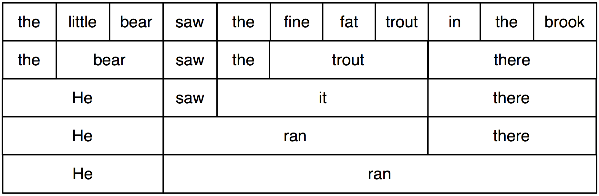
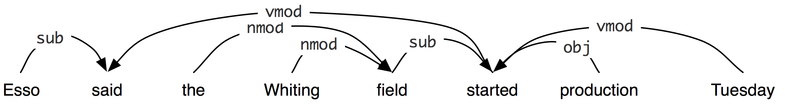
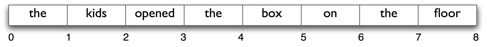
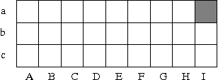

.. -*- mode: rst -*-
.. include:: ../definitions.rst

.. standard global imports

    >>> import nltk, re, pprint

.. TODO: explain that cfg grammars must not mix lexical and phrasal RHS
.. TODO: explain why RHS can't have a sequence of terminals
.. TODO: motivate or omit mathematical notation for formalizing CFGs
.. TODO: include overview of ContextFreeGrammar and Production in 8.4
.. TODO: make URLs clickable in the HTML version
.. TODO: mention Chomsky Normal Form
.. TODO: give an example of a text generated from bigrams, then talk the
         reader through constructing a simple grammar over this by talking
         about local contexts, and contrast this with the grammar
.. TODO: update images in parser-problem table (NP -> NP PP replaced
         by Nom -> Nom PP
.. TODO: find a different example of left-recursive rules

.. _chap-parse:

===============================
8. Analyzing Sentence Structure
===============================

Earlier chapters focused on words: how to identify them,
analyze their structure, assign them to lexical categories,
and access their meanings.
We have also seen how to identify patterns in word sequences or n-grams.
However, these methods only scratch the surface of the complex constraints
that govern sentences.
We need a way to deal with the ambiguity that natural language is famous for.
We also need to be able to cope with the fact that there are an unlimited number
of possible sentences, and we can only write finite programs to analyze their
structures and discover their meanings.
 
The goal of this chapter is to answer the following questions:

#. How can we use a formal grammar to describe the structure of an unlimited set of sentences?
#. How do we represent the structure of sentences using syntax trees?
#. How do parsers analyze a sentence and automatically build a syntax tree?

Along the way, we will cover the fundamentals of English syntax, and
see that there are systematic aspects of meaning that are much easier
to capture once we have identified the structure of sentences.

.. _sec-dilemmas:

-------------------------
Some Grammatical Dilemmas
-------------------------

Linguistic Data and Unlimited Possibilities
-------------------------------------------

Previous chapters have shown you how to process and analyse text
corpora, and we have stressed the challenges for NLP in dealing with
the vast amount of electronic language data that is growing
daily. Let's consider this data more closely, and make the thought
experiment that we have a gigantic corpus consisting of everything
that has been either uttered or written in English over, say, the last
50 years. Would we be justified in calling this corpus "the language
of modern English"? There are a number of reasons why we might answer
No. Recall that in Chapter chap-words_, we asked you to search
the web for instances of the pattern `the of`:lx:.  Although it is
easy to find examples on the web containing this sequence, such as
`New man at the of IMG`:lx:
(`<http://www.telegraph.co.uk/sport/2387900/New-man-at-the-of-IMG.html>`_),
speakers of English will say that most such examples are errors, and
therefore not part of English after all. 

Accordingly, we can argue
that the "modern English" is not  equivalent to the very big
set of word sequences in our imaginary corpus. Speakers
of English can make judgements about these sequences, and will reject
some of them as being ungrammatical. 

Equally, it is easy to compose a new sentence that is not so far in
our imaginary corpus, and have speakers agree that it is perfectly
good English.  For example, sentences have an interesting property
that they can be embedded inside larger sentences.  Consider the
following sequence:

.. ex::
  .. ex:: Usain Bolt broke the 100m record
  .. ex:: The Jamaica Observer reported that Usain Bolt broke the 100m record 
  .. ex:: Andre said The Jamaica Observer reported that Usain Bolt broke the 100m record
  .. ex:: I think Andre said the Jamaica Observer reported that Usain Bolt broke the 100m record

If we replaced whole sentences with the symbol `s`:gc:, we would see patterns like
`Andre said S`:lx: and `I think S`:lx:.  These are templates for taking a sentence
and constructing a bigger sentence.  There are other templates we can use, like
`S but S`:lx:, and `S when S`:lx:.  With a bit of ingenuity we can construct some
really long sentences using these templates.  Here's an impressive example from
a Winnie the Pooh story by A.A. Milne,
*In which Piglet is Entirely Surrounded by Water*: 

   You can imagine Piglet's joy when at last the ship came in sight of
   him. In after-years he liked to think that he had been in Very
   Great Danger during the Terrible Flood, but the only danger he had
   really been in was the last half-hour of his imprisonment, when
   Owl, who had just flown up, sat on a branch of his tree to comfort
   him, and told him a very long story about an aunt who had once laid
   a seagull's egg by mistake, and the story went on and on, rather
   like this sentence, until Piglet who was listening out of his
   window without much hope, went to sleep quietly and naturally,
   slipping slowly out of the window towards the water until he was
   only hanging on by his toes, at which moment, luckily, a sudden
   loud squawk from Owl, which was really part of the story, being
   what his aunt said, woke the Piglet up and just gave him time to
   jerk himself back into safety and say, "How interesting, and did
   she?" when -- well, you can imagine his joy when at last he saw
   the good ship, Brain of Pooh (Captain, C. Robin; 1st Mate, P. Bear)
   coming over the sea to rescue him...

This long sentence actually has a simple structure that begins
`S but S when S`:lx:.  We can see from this example that language
provides us with constructions which seem to allow us to extend the
length of sentences indefinitely.  It is also striking that
we can understand sentences of arbitrary length
that we've never heard before:  it's not hard to concoct an
entirely novel sentence, one that has probably never been used before
in the history of the language, yet all speakers of the language
will understand it.

The purpose of a grammar is to give an explicit description of a
language. But the way in which we think of a grammar is closely
intertwined with what we consider to be a language. Is it a 
large but finite set of observed utterances and written texts? Is it
something more abstract like the implicit knowledge that competent
speakers have about grammatical sentences? Or is it some combination
of the two? We do not intend to take a stand on this issue, but
instead to give you an introduction to some of the main approaches.

In this chapter, we will primarily adopt the formal framework that was
initially developed within the tradition of "generative grammar"
[Chomsky1965]_. Here, a "language" is considered to be a possibly infinite set
of strings, and a grammar is formal device for "generating" the
members of this set.  It achieves this using `recursion`:dt:,
with the help of grammar `productions`:dt: of the form
`s`:gc: |rarr| `s`:gc: `and`:lx: `s`:gc:, as we will explore in
sec-context-free-grammar_.  In chap-semantics_ we will extend this,
to automatically build up the meaning of a sentence out of the meanings
of its parts.

Ubiquitous Ambiguity
--------------------

A well-known example of ambiguity is shown in marx-elephant_  
(from Groucho Marx, Animal Crackers, 1930):

.. _marx-elephant:
.. ex::

   While hunting in Africa, I shot an elephant in my pajamas.
   How an elephant got into my pajamas I'll never know.

Let's take a closer look at the ambiguity in the phrase:
`I shot an elephant in my pajamas`:lx:.  First we
need to define a simple grammar:

    >>> groucho_grammar = nltk.parse_cfg("""
    ... S -> NP VP
    ... PP -> P NP
    ... NP -> Det N | Det N PP | 'I'
    ... VP -> V NP | VP PP
    ... Det -> 'an' | 'my'
    ... N -> 'elephant' | 'pajamas'
    ... V -> 'shot' 
    ... P -> 'in' 
    ... """)

This grammar permits the sentence to be analyzed in two ways,
depending on whether the prepositional phrase `in my pajamas`:lx:
describes the elephant or the shooting event.

    >>> sent = ['I', 'shot', 'an', 'elephant', 'in', 'my', 'pajamas']
    >>> parser = nltk.ChartParser(groucho_grammar) 
    >>> trees = parser.nbest_parse(sent)
    >>> for tree in trees:
    ...     print tree
    ... 
    (S
      (NP I)
      (VP
        (V shot)
        (NP (Det an) (N elephant) (PP (P in) (NP (Det my) (N pajamas))))))
    (S
      (NP I)
      (VP
        (VP (V shot) (NP (Det an) (N elephant)))
        (PP (P in) (NP (Det my) (N pajamas)))))

The program produces two bracketed structures, which we can depict as
trees, as shown in elephant_:

.. _elephant:
.. ex::

  .. ex::
    .. tree:: (S (NP I) (VP (V shot)  (NP (Det an) (N elephant) (PP (P in) (NP (Det my) (N pajamas)))))) 

  .. ex::
    .. tree:: (S (NP I) (VP (VP (V shot) (NP (Det an) (N elephant))) (PP (P in) (NP (Det my) (N pajamas))))) 

Notice that there's no ambiguity concerning the meaning of any of the words;
e.g. the word `shot`:lx: doesn't refer to the act of using a gun in the first sentence,
and using a camera in the second sentence.

.. note:: |TRY|
   Consider the following sentences and see if you can think of two quite different
   interpretations: `Fighting animals could be dangerous.`:lx:
   `Visiting relatives can be tiresome.`:lx:.  Is ambiguity of the individual
   words to blame?  If not, what is the cause of the ambiguity?

This chapter presents grammars and parsing, as the formal and
computational methods for investigating and modeling the linguistic
phenomena we have been touching on (or tripping over).
As we shall see, patterns of well-formedness and ill-formedness in a
sequence of words can be understood with respect to the 
:dt:`phrase structure` and :dt:`dependencies`.  We can develop formal
models of these structures using grammars and parsers.
As before, a key motivation is natural language *understanding*.  How
much more of the meaning of a text can we access when we can reliably
recognize the linguistic structures it contains?  Having read in a
text, can a program "understand" it enough to be able to answer simple
questions about "what happened" or "who did what to whom."  Also as
before, we will develop simple programs to process annotated corpora
and perform useful tasks.

.. _sec-whats-the-use-of-syntax:

-------------------------
What's the Use of Syntax?
-------------------------

Beyond n-grams
--------------

We gave an example in Chapter chap-corpora_ of how to use the
the frequency information in bigrams to generate text that seems
perfectly acceptable for small sequences of words but rapidly
degenerates into nonsense. Here's another pair of examples that we created by
computing the bigrams over the text of a childrens' story, *The
Adventures of Buster Brown* (http://www.gutenberg.org/files/22816/22816.txt):

.. _ex-salad:
.. ex:: 
    .. ex:: He roared with me the pail slip down his back

    .. ex:: The worst part and clumsy looking for whoever heard light

You intuitively know that these strings are "word-salad", but you
probably find it hard to pin down exactly what is wrong with them. One
benefit of studying grammar is that it provides a conceptual framework
and vocabulary for spelling out these intuitions. Let's consider in more detail the string
`the worst part and clumsy looking`:lx:. This looks like a `coordinate
structure`:dt:, where two phrases are joined by a coordinating
conjunction such as `and`:lx:, `but`:lx: or `or`:lx:. Here's an
informal (and simplified) statement of how coordination works
syntactically:

Coordinate Structure:

    If *v*\ :sub:`1` and *v*\ :sub:`2` are both phrases of grammatical
    category *X*, then *v*\ :sub:`1` `and`:lx: *v*\ :sub:`2` is also a
    phrase of category  *X*.

Here are a couple of examples. In the first, two `np`:gc: \s (noun
phrases) have been conjoined to make an `np`:gc:, while in the second,
two `ap`:gc: \s (adjective phrases) have been conjoined to make an
`ap`:gc:.

.. _ex-coord:
.. ex:: 
    .. ex:: The book's ending was (NP *the worst part and the best part*) for me.

    .. ex:: On land they are (AP *slow and clumsy looking*).

What we `can't`:em: do is conjoin an `np`:gc: and an `ap`:gc:, which is
why `the worst part and clumsy looking`:lx: is ungrammatical. In order
to make these ideas more formal, we need to examine what is meant by
saying that a sequence of words is a phrase of some grammatical
category. This takes us to the topic of `constituent structure`:dt:.

Constituent structure is based on the observation that words combine
with other words to form units. The evidence that a sequence of words
forms such a unit is given by substitutability |mdash| that is, a
sequence of words in a well-formed sentence can be replaced by a
shorter sequence without rendering the sentence ill-formed. To clarify
this idea, consider the following sentence:

.. _ex-bb0:
.. ex:: The little bear saw the fine fat trout in the brook.

The fact that we can substitute `He`:lx: for `The little bear`:lx:
indicates that the latter sequence is a unit. By contrast, we cannot
replace  `little bear saw`:lx: in the same way.

.. explain * ?

.. ex:: 
    .. ex :: He saw the fine fat trout in the brook.
    .. ex :: \*The he the fine fat trout in the brook.

In Figure ic-diagram_, we systematically substitute longer sequences
by shorter ones in a way which preserves grammaticality. Each sequence
that forms a unit can in fact be replaced by a single word, and we end
up with just two elements.

.. _ic-diagram: 

   Substitution of word sequences

Units consisting of more than one word are sometimes called
`constructions`:dt:, and a construction or word which forms
part of a larger construction is a `constituent`:dt:. All the words in
the sentence ex-bb0_ are constituents, as are sequences such as
`little bear`:lx: and `in the brook`:lx:. An `immediate
constituent`:lx: are the constituents into which a construction can be
directly decomposed. For example, the immediate constituents of the
whole sentence are the sequences `The little bear`:lx: and  `saw the
fine fat trout in the brook`:lx:. 

.. Some of the decisions about how to group words into constituents
.. are open to debate. Discuss?

Two constructions belong to the same grammatical category if they are
distributionally similar; that is, they can occur in broadly the same
range of contexts. If we looked at a large enough corpus, we would
expect `he`:lx:\ /`him`:lx: to share most of its contexts with `the
bear`:lx:, but not with, say, `in`:lx:. Consequently, we assign
`he`:lx:\ /`him`:lx: to the same grammatical category as `the
bear`:lx:. Since members of this category often have more than one
immediate constituent, we call it a `phrase`:dt:, in this case `noun
phrase`:dt: (`np`:gc). By contrast, the categories to which individual
words belong are `lexical`:dt: categories. 

.. note:: Words such as personal pronouns are an exception to this
    generalization. Although they are not phrasal, it is convenient to
    assign them to the category `np`:gc:, and we adopt a similar
    convention for proper nouns.

In Figure ic-diagram-labeled_, we have added
grammatical category labels to the words we saw in the earlier figure. 

.. _ic-diagram-labeled: 
.. figure:: ../images/ic_diagram_labeled.png
   :scale: 25:100:25

   Grammatical categories

If we now strip out the words apart from the topmost row, add an
`s`:gc: node, and flip the figure over, we end up with a standard
phrase structure tree.

.. ex::
    .. tree:: (S (NP (Det the)(Nom (Adj little)(N bear)))(VP (VP (V saw) (NP (Det the)(Nom (Adj fine)(Adj fat)(N trout))))(PP (P in) (NP(Det the)(Nom (N brook))))))

Beyond Chunking
---------------

You might be asking what's new about phrasal constituents, since the
are very similar to the chunks presented in Chapter chap-chunk_. To
answer this, let's return to the challenge of making explicit how a
sentence says "who did what to whom". Let's just focus for a while on
the "who" part of this story. As a first approximation, we'll say that
this amounts to telling what the grammatical subject of a sentence
is. Can we do this using chunks? Based on the techniques described in
Chapter chap-chunk_, a chunking analysis of ex-bb0_ will look as
follows:

::

    (S
      (NP the/DT little/JJ bear/NN)
      saw/VBD
      (NP the/DT fine/JJ fat/JJ trout/NN)
      in/IN
      (NP the/DT brook/NN))

So we might adopt the heuristic that the subject of a sentence is the
`np`:gc: chunk that immediately precedes the tensed verb: this would
correctly yield ``(NP the/DT little/JJ bear/NN)`` as
subject. Unfortunately, this simple rule very quickly fails, as shown
by a more complex example.

    >>> from nltk.corpus import conll2000
    >>> print conll2000.chunked_sents()[1]
    (S
      Chancellor/NNP
      (PP of/IN)
      (NP the/DT Exchequer/NNP)
      (NP Nigel/NNP Lawson/NNP)
      (NP 's/POS restated/VBN commitment/NN)
      (PP to/TO)
      (NP a/DT firm/NN monetary/JJ policy/NN)
      (VP has/VBZ helped/VBN to/TO prevent/VB)
      (NP a/DT freefall/NN)
      (PP in/IN)
      (NP sterling/NN)
      (PP over/IN)
      (NP the/DT past/JJ week/NN)
      ./.)

What's doing the "preventing" in this example is not the firm monetary
policy, but rather the restated commitment to such a policy. We can
also see from this example that a different simple rule, namely
treating the initial `np`:gc: chunk  as the subject, also fails, since this
would give us the ``(NP the/DT Exchequer/NNP)``. By contrast, a
complete phrase structure analysis of
the sentence would group together all the pre-verbal `np`:gc: chunks
into a single `np`:gc: constituent:

.. ex:: 
    .. tree:: (NP(NP (NP (Nom (N Chancellor) (PP (P of)(NP (Det the) (N Exchequer))))(NP Nigel Lawson)) (POSS 's))(Nom (Adj restated)(Nom (N commitment)(PP (P to)(NP (Det a)(Nom (Adj firm) (Nom (Adj monetary)(Nom (N policy)))))))))

We still have a little work to determine which part of this complex
`np`:gc: corresponds to the "who", but nevertheless, this is much
more tractable than answering the same question from a flat sequence
of chunks.

"Subject" and "direct object" are examples of `grammatical
functions`:dt:. Although they are not captured directly in a phrase
structure grammar, they can be defined in terms of tree
configurations. In ex-gfs_, the subject of `s`:gc: is the `np`:gc:
immediately dominated by  `s`:gc: while the direct object of `v`:gc:
is the `np`:gc: directly dominated by `vp`:gc:.

.. _ex-gfs:
.. ex::
    .. tree:: (S <NP \ > <VP V NP ...>)

.. _sec-context-free-grammar:

--------------------
Context Free Grammar
--------------------

Let's summarize the results of the previous section. In a phrase
structure grammar, we show how words combine to form phrases. These
phrases combine again to form larger constructions. Conversely, given
a sentence, the grammar specifies how the sentence can be subdivided
into its immediate constituents, and how these again can be subdivided
until we reach the level of words. A phrase structure tree is a
hierarchical structure which depicts such an analysis into immediate
constituents at successive levels.

We have presented grammatical categories as classes of word sequences
that share distributional properties, and then given labels to those
categories, such as `np`:gc:, `vp`:gc: and so on. From now on, we will
be more casual, and fail to draw the distinction unless the context
demands it.

In formal language theory, a `language`:dt: *L* is defined to be a set
of strings made up from a set *V* of atomic symbols
(e.g. words). Consider the set of all possible strings
that can be made up from sequences drawn from *V*. This set is
infinite, since there is no upper bound on the length of the strings,
and it is a superset of *L*. The task of a `formal grammar`:dt: is to
specify which sequences of symbols belong to *L*.  A :dt:`context-free
grammar` (CFG) is one particular kind of formal grammar, and is
intended to formalize a phrase structure grammar. In addition to
specifying whether a string is part of the language, a CFG associates
a phrase structure tree with each well-formed sentence. The notion of
immediate constituent is captured by `productions`:dt: of the
grammar. An example of a production is `s`:gc: |rarr| `np vp`:gc:.
This says that a constituent `s`:gc: has immediate constituents
`np`:gc: and `vp`:gc:. The lefthand side of a production can also be a
lexical category. Similarly, the production `v`:gc: |rarr| `saw`:lx: |
`walked`:lx: means that the constituent `v`:gc: can consist of the
string `saw`:lx: or `walked`:lx:.  For a given phrase structure tree to be
well-formed relative to a grammar, each non-terminal node and its
children must correspond to a production in the grammar.

A Simple Grammar
----------------

Let's start off by looking at a simple context-free grammar.
By convention, the left-hand-side of the first production is
the `start-symbol`:dt: of the grammar, and all well-formed trees
must have this symbol as their root label.

.. pylisting:: cfg1
   :caption: A Simple Context-Free Grammar

   grammar1 = nltk.parse_cfg("""
     S -> NP VP
     VP -> V NP | V NP PP
     PP -> P NP
     V -> "saw" | "ate" | "walked"
     NP -> "John" | "Mary" | "Bob" | Det N | Det N PP
     Det -> "a" | "an" | "the" | "my"
     N -> "man" | "dog" | "cat" | "cookie" | "park"

     P -> "in" | "on" | "by" | "with"
     """)

This grammar contains productions involving various syntactic categories,
as laid out in Table syncat_.

.. table:: syncat

   ======    ====================    =====================
   Symbol    Meaning                 Example
   ======    ====================    =====================
   S         sentence                `the man walked`:lx:
   NP        noun phrase             `a dog`:lx:
   VP        verb phrase             `saw a park`:lx:
   PP        prepositional phrase    `with a telescope`:lx:
   ...       ...                     ...
   Det       determiner              `the`:lx:
   N         noun                    `dog`:lx:
   V         verb                    `walked`:lx:
   P         preposition             `in`:lx:
   ======    ====================    =====================

   Syntactic Categories

.. also mention somewhere 

In order to get started with developing simple grammars of your own, you
will probably find it convenient to play with the recursive descent
parser demo, ``nltk.draw.rdparser.demo()``.
The demo opens a window that displays a list of grammar productions in the
left hand pane and the current parse diagram in the central pane:

.. image:: ../images/parse_rdparsewindow.png
   :scale: 100

The demo comes with a grammar similar to ``grammar1`` already loaded;
however, you can edit this as you please. We will
discuss the parsing algorithm in greater detail below, but for the
time being you can get an idea of how it works by using the *autostep* button.
If we parse the string `The dog saw a man in the park` using
the grammar in ``grammar1``, we end up with two trees:

.. ex::
  .. ex::
    .. tree:: (S (NP (Det the) (N dog))
                 (VP (V saw)
                     (NP (Det a) (N man))
                     (PP (P in) (NP (Det the) (N park)))))
  .. ex::
    .. tree:: (S (NP (Det the) (N dog))
                 (VP (V saw)
                     (NP (Det a)
                         (N man)
                         (PP (P in) (NP (Det the) (N park))))))

Since our grammar licenses two trees for this sentence, the sentence is
said to be :dt:`structurally ambiguous`.  The ambiguity in question is called
a `prepositional phrase attachment ambiguity`:idx:, as we saw earlier in this chapter.
As you may recall, it is an ambiguity about attachment since the
`pp`:gc: `in the park`:lx: needs to be attached to one of two places
in the tree: either as a daughter of `VP`:gc: or else as a daughter of
`np`:gc:.
When the `pp`:gc: is attached to `vp`:gc:, the seeing event happened
in the park.  However, if the `pp`:gc: is attached to `np`:gc:,
then the man was in the park, and the agent of the seeing (the dog)
might have been sitting on the balcony of an apartment overlooking the park.

Recursion in Syntactic Structure
--------------------------------

A grammar is said to be :dt:`recursive` if a category occurring on the left hand
side of a production (such as `s`:gc: in this case) also appears on
the right hand side of a production. If this dual occurrence takes
place in *one and the same production*, then we have :dt:`direct
recursion`; otherwise we have :dt:`indirect recursion`. There is no
recursion in ``grammar``. However, the grammar in ``grammar2`` illustrates both kinds of
recursive production:

.. pylisting:: cfg2
   :caption: A Recursive Context-Free Grammar

   grammar2 = nltk.parse_cfg("""
     S  -> NP VP
     NP -> Det Nom | PropN
     Nom -> Adj Nom | N
     VP -> V Adj | V NP | V S
     PropN -> 'Buster_Bear' | 'Chatterer' 
     Det -> 'the'
     N -> 'bear' | 'squirrel' | 'tree'
     Adj  -> 'angry' | 'frightened' |  'little' | 'tall'
     V ->  'chased'  | 'said' | 'thought' | 'was'
     """)

Notice that the production ``Nom -> Adj Nom`` (where ``Nom`` is the
category of nominals) involves direct recursion on the category
``Nom``, whereas indirect recursion on ``S`` arises from the
combination of two productions, namely ``S -> NP VP`` and ``VP -> V S``.

To see how recursion is handled in this grammar, consider the following
trees.  Example nested-nominals_ involves nested nominal phrases,
while nested-sentences_ contains nested sentences.

.. ex::
  .. ex::
    .. _nested-nominals:
    .. tree::
     (S (NP (Det the) (Nom (Adj angry)(Nom (N bear))))
         (VP (V chased)
            (NP (Det the) (Nom (Adj frightened)(Nom (Adj little) (N squirrel))))))
  .. ex::
    .. _nested-sentences:
    .. tree::
      (S (NP (PropN Chatterer))
         (VP (V said)
             (S (NP (PropN Buster))
                (VP (V thought)
                    (S (NP (Det the) (N tree))
                             (VP (V was)(Adj tall)))))))

If you have experimented with the recursive descent parser, you may
have noticed that it fails to deal properly with the
following production: `np`:gc: |rarr| `np pp`:gc:.
From a linguistic point of view, this production is perfectly respectable,
and will allow us to derive trees like this:

.. ex::
  .. tree::
    (S (NP 
           (NP 
               (NP (Det the) (N man))
               (PP (P with) (NP  (Det a) (N dog))))
            (PP (P in  (NP  (Det the) (N park)))))
         (VP (V disappeared)))

More schematically, the trees for these compound noun phrases will be
of the following shape:

.. _leftrec:
.. ex::
  .. tree::
    (NP (NP (NP (NP Det N) PP) PP) PP)

The structure in leftrec_ is called a `left recursive`:dt: structure.
These occur frequently in analyses of English, and
the failure of recursive descent parsers to deal adequately with left
recursion means that we will need to find alternative approaches.

-----------------------------------
Dependencies and Dependency Grammar
-----------------------------------

Phrase structure grammar is concerned with how words and sequences of
words `combine`:em: to form constituents. A distinct and complementary
approach, dependency grammar, focusses instead on how words
`relate`:em to other words. Dependency is a binary asymmetric relation that
holds between a `head`:dt: and its `dependents`:dt. 
The head of a sentence is usually taken to be the tensed verb, and every other word is
either dependent on the sentence head, or connects to it through a path of
dependencies. A dependency representation is a labeled directed graph,
where the nodes are the lexical items and the labeled arcs represent
dependency relations from heads to dependents. 

Figure depgraph0_ illustrates a dependency graph, where arrows point
from heads to their dependents.

.. _depgraph0:

   Dependency Structure

The arcs in Figure depgraph0_ are labeled with the
grammatical function that holds between a dependent and its
head. For example, `i`:lx: is the ``SBJ`` (subject) of `shot`:lx:
(which is the head of the whole sentence), and `in`:lx: is
an ``NMOD`` (noun modifier of  `elephant`:lx:. In contrast to phrase
structure grammar, therefore, dependency grammars can be used to
directly express grammatical functions as a type of dependency.

An alternative method of representing the dependency relationships is
illustrated in depgraph1_, where dependents are shown as
daughters of their heads. These trees provide an alternative approach
to capturing the `pp`:gc: attachement ambiguity.

.. _depgraph1:
.. ex::
    .. tree:: (shot I (elephant (in pyjamas my)))
    .. tree:: (shot I elephant (in pyjamas my))

Various criteria have been proposed for deciding what is the head *H* and
what is the dependent *D* in a construction *C*. Some of the most important
are the following:

#. *H* determines the distribution class of *C*; or alternatively, the
   external syntactic properties of *C* are due to *H*.
#. *H* determines the semantic type of *C*.
#. *H* is obligatory while *D* may be optional.
#. *H* selects *D* and determines whether it is obligatory or
   optional.
#. The morphological form of *D* is determined by *H* (e.g. agreement
   or case government).

A dependency graph is `projective`:dt: if, when all the words are
written in linear order, the edges can be drawn above the words
without crossing. This is equivalent to saying that a word and all its
descendents (dependents and dependents of its dependents, etc) form a
contiguous substring of the sentence. Figure depgraph0_ is
projective. In languages with more flexible word order than English,
non-projective dependencies are more frequent.

.. give example?

Valency
-------

Let us take a closer look at verbs.
The grammar ``grammar2`` correctly generates examples like subcat1_,
corresponding to the four productions with `vp`:gc: on the left hand side:

.. _subcat1:
.. ex::
   .. ex:: The woman gave the telescope to the dog
   .. ex:: The woman saw a man
   .. ex:: A man said that the woman disappeared
   .. ex:: The dog barked

That is, `gave`:lx: can occur with a following `np`:gc: and `pp`:gc:; 
`saw`:lx: can occur with a following `np`:gc:; 
`said`:lx: can occur with a following `s`:gc:; 
and `barked`:lx: can occur with no following phrase.
In these cases, `np`:gc:, `pp`:gc: and `s`:gc: are called :dt:`complements`
of the respective verbs, and the verbs themselves are called
:dt:`heads` of the verb phrase.

However, there are fairly strong constraints on what verbs can occur
with what complements. Thus, we would like our grammars to mark the
following examples as ungrammatical:

.. _subcat2:
.. ex:: 
   .. ex:: \*The woman disappeared the telescope to the dog
   .. ex:: \*The dog barked a man
   .. ex:: \*A man gave that the woman disappeared
   .. ex:: \*A man said

.. note:: It is possible to create examples that involve 'non-standard'
   but interpretable combinations of verbs and complements. Thus,
   we can, at a stretch, interpret `the man disappeared the dog`:lx:
   to mean that the man made the dog disappear. We will ignore such examples here.

How can we ensure that our grammar correctly excludes the
ungrammatical examples in subcat2_?  We need some way of constraining
grammar productions which expand `vp`:gc: so that verbs *only* co-occur
with their correct complements. We do this by dividing the class of
verbs into `subcategories`:dt:, each of which is associated with a
different set of complements. For example, `transitive verbs`:dt: such
as `saw`:lx:, `kissed`:lx: and `hit`:lx: require a following `np`:gc:
object complement. Borrowing from the terminology of chemistry, we
sometimes refer to the `valency`:dt: of a verb, that is, its capacity
to combine with a sequence of arguments and thereby compose a verb
phrase.

Let's introduce a new category label for such verbs, namely
`tv`:gc: (for Transitive Verb), and use it in the following productions:

.. ex::
   .. parsed-literal::

     `vp`:gc: |rarr| `tv np`:gc:
     `tv`:gc: |rarr| 'saw' | 'kissed' | 'hit'

Now `*the dog barked the man`:lx: is excluded since we haven't listed
`barked`:lx: as a `V_tr`:gc:, but `the woman saw a man`:lx: is still allowed.
Table verbcat_ provides more examples of labels for verb subcategories.

.. table:: verbcat

   ======    ====================    ========================
   Symbol    Meaning                 Example
   ======    ====================    ========================
   IV        intransitive verb       *barked*
   TV        transitive verb         *saw a man*
   DatV      dative verb             *gave a dog to a man*
   SV        sentential verb         *said that a dog barked*
   ======    ====================    ========================

   Verb Subcategories

The revised grammar for `vp`:gc: will now look like this:

.. _subcat3:
.. ex::
   .. parsed-literal:: 

      `vp`:gc: |rarr| `datv np pp`:gc:
      `vp`:gc: |rarr| `tv np`:gc:
      `vp`:gc: |rarr| `sv s`:gc:
      `vp`:gc: |rarr| `iv`:gc: 

      `datv`:gc: |rarr| 'gave' | 'donated' | 'presented'
      `tv`:gc: |rarr| 'saw' | 'kissed' | 'hit' | 'sang'
      `sv`:gc: |rarr| 'said' | 'knew' | 'alleged'
      `iv`:gc: |rarr| 'barked' | 'disappeared' | 'elapsed' | 'sang'

Notice that according to subcat3_, a given lexical item can belong to more
than one subcategory. For example, `sang`:lx: can occur both with and
without a following `np`:gc: complement.

Scaling Up
----------

So far, we have only considered "toy grammars," small grammars that
illustrate the key aspects of parsing.  But there is an obvious
question as to whether the approach can be scaled up to cover
large corpora of natural languages. How hard would it be to construct
such a set of productions by hand? In general, the answer is: *very
hard*. Even if we allow ourselves to use various formal devices that
give much more succinct representations of grammar productions, it is still extremely
difficult to keep control of the complex interactions between the many
productions required to cover the major constructions of a
language. In other words, it is hard to modularize grammars so that
one portion can be developed independently of the other parts. This in
turn means that it is difficult to distribute the task of grammar
writing across a team of linguists. Another difficulty is that as the
grammar expands to cover a wider and wider range of constructions,
there is a corresponding increase in the number of analyses which are
admitted for any one sentence. In other words, ambiguity increases
with coverage.

Despite these problems, some large collaborative
projects have achieved interesting and impressive results in
developing rule-based grammars for several languages. Examples are the
Lexical Functional Grammar (LFG) Pargram project
(http://www2.parc.com/istl/groups/nltt/pargram/), the Head-Driven
Phrase Structure Grammar (HPSG) LinGO Matrix framework
(http://www.delph-in.net/matrix/), and the Lexicalized Tree Adjoining
Grammar XTAG Project (http://www.cis.upenn.edu/~xtag/).

Context Free Grammar in NLTK
----------------------------

In NLTK, context free grammars are defined in the ``nltk.grammar`` module.
In Figure cfg_ we define a grammar and use it to parse a simple
sentence.  You will learn more about parsing in the next section.

.. pylisting:: cfg
   :caption: Context Free Grammars in NLTK

   grammar = nltk.parse_cfg("""
     S -> NP VP
     VP -> V NP | V NP PP
     V -> "saw" | "ate"
     NP -> "John" | "Mary" | "Bob" | Det N | Det N PP
     Det -> "a" | "an" | "the" | "my"
     N -> "dog" | "cat" | "cookie" | "park"
     PP -> P NP
     P -> "in" | "on" | "by" | "with"
     """)
   >>> sent = "Mary saw Bob".split()
   >>> rd_parser = nltk.RecursiveDescentParser(grammar)
   >>> for p in rd_parser.nbest_parse(sent):
   ...      print p
   (S (NP Mary) (VP (V saw) (NP Bob)))

.. _sec-parsing:

---------------------------------
Parsing With Context Free Grammar
---------------------------------

A :dt:`parser` processes input sentences according to the
productions of a grammar, and builds one or more
constituent structures that conform to the grammar.
A grammar is a declarative specification of well-formedness |mdash|
it is actually just a string, not a program.
A parser is a procedural interpretation of the grammar.
It searches through the space of trees licensed by a grammar
to find one that has the required sentence along its fringe.

A parser permits a grammar to be evaluated against
a collection of test sentences, helping linguists
to discover mistakes in their grammatical analysis.
A parser can serve as a model of psycholinguistic processing,
helping to explain the difficulties that humans have with processing
certain syntactic constructions.
Many natural language applications involve parsing at some point;
for example, we would expect the natural language questions
submitted to a question-answering system to undergo parsing as an initial step.

In this section we see two simple parsing algorithms,
a top-down method called recursive descent parsing,
and a bottom-up method called shift-reduce parsing.
We also see some more sophisticated algorithms,
a top-down method with bottom-up filtering called
left-corner parsing, and a dynamic programming
technique called chart parsing.

Recursive Descent Parsing 
-------------------------

The simplest kind of parser interprets a grammar as a specification
of how to break a high-level goal into several lower-level subgoals.
The top-level goal is to find an `s`:gc:.  The `s`:gc: |rarr| `np vp`:gc:
production permits the parser to replace this goal with two subgoals:
find an `np`:gc:, then find a `vp`:gc:.  Each of these subgoals can be
replaced in turn by sub-sub-goals, using productions that have `np`:gc:
and `vp`:gc: on their left-hand side.  Eventually, this expansion
process leads to subgoals such as: find the word `telescope`:lx:.  Such
subgoals can be directly compared against the input string, and
succeed if the next word is matched.  If there is no match the parser
must back up and try a different alternative.

The recursive descent parser builds a parse tree during the above
process.  With the initial goal (find an `s`:gc:), the `s`:gc: root node
is created.  As the above process recursively expands its goals using
the productions of the grammar, the parse tree is extended downwards
(hence the name *recursive descent*).  We can see this in action using
the graphical demonstration ``nltk.draw.rdparser.demo()``.
Six stages of the execution of this parser are shown in Figure rdparser1-6_.

.. _rdparser1-6:
.. figure:: ../images/rdparser1-6.png
   :scale: 50:50:50

   Six Stages of a Recursive Descent Parser

During this process, the parser is often forced to choose between several
possible productions.  For example, in going from step 3 to step 4, it
tries to find productions with `n`:gc: on the left-hand side.  The
first of these is `n`:gc: |rarr| `man`:lx:.  When this does not work
it `backtracks`:idx:, and tries other `n`:gc: productions in order, under it
gets to `n`:gc: |rarr| `dog`:lx:, which matches the next word in the
input sentence.  Much later, as shown in step 5, it finds a complete
parse.  This is a tree that covers the entire sentence, without any
dangling edges.  Once a parse has been found, we can get the parser to
look for additional parses.  Again it will backtrack and explore other
choices of production in case any of them result in a parse.

NLTK provides a recursive descent parser:

    >>> rd_parser = nltk.RecursiveDescentParser(grammar)
    >>> sent = 'Mary saw a dog'.split()
    >>> for t in rd_parser.nbest_parse(sent):
    ...     print t
    (S (NP Mary) (VP (V saw) (NP (Det a) (N dog))))

.. Note:: ``RecursiveDescentParser()`` takes an optional parameter ``trace``. 
   If ``trace`` is greater than zero, then the parser will report the steps
   that it takes as it parses a text.

Recursive descent parsing has three key shortcomings.  First,
left-recursive productions like `np`:gc: |rarr| `np pp`:gc: send it
into an infinite loop.  Second, the parser wastes a lot of time
considering words and structures that do not correspond to the input
sentence.  Third, the backtracking process may discard parsed
constituents that will need to be rebuilt again later.  For example,
backtracking over `vp`:gc: |rarr| `v np`:gc: will discard the subtree
created for the `np`:gc:.  If the parser then proceeds with `vp`:gc:
|rarr| `v np pp`:gc:, then the `np`:gc: subtree must be created all
over again.

Recursive descent parsing is a kind of `top-down parsing`:dt:.
Top-down parsers use a grammar to *predict* what the input will be,
before inspecting the input!  However, since the input is available to
the parser all along, it would be more sensible to consider the input
sentence from the very beginning.  This approach is called
`bottom-up parsing`:dt:, and we will see an example in the next section.

Shift-Reduce Parsing 
--------------------

A simple kind of bottom-up parser is the `shift-reduce parser`:dt:.
In common with all bottom-up parsers, a shift-reduce
parser tries to find sequences of words and phrases that correspond
to the *right hand* side of a grammar production, and replace them
with the left-hand side, until the whole sentence is reduced to
an `s`:gc:.

The shift-reduce parser repeatedly pushes the next input word onto a
stack (Section sec-back-to-the-basics_); this is the `shift`:dt: operation.
If the top *n* items on the stack match
the *n* items on the right hand side of some production,
then they are all popped off the stack, and the item on the left-hand
side of the production is pushed on the stack.  This replacement of
the top *n* items with a single item is the `reduce`:dt: operation.
This operation may only be applied to the top of the stack;
reducing items lower in the stack must be done before later items are
pushed onto the stack.  The parser finishes when all the input is
consumed and there is only one item remaining on the stack, a parse
tree with an `s`:gc: node as its root.
The shift-reduce parser builds a parse tree during the above process.
Each time it pops *n* items off the stack it combines them into
a partial parse tree, and pushes this back on the stack.
We can see the shift-reduce parsing algorithm in action using the
graphical demonstration ``nltk.draw.srparser.demo()``.
Six stages of the execution of this parser are shown in Figure srparser1-6_.

.. _srparser1-6:
.. figure:: ../images/srparser1-6.png
   :scale: 50:50:50

   Six Stages of a Shift-Reduce Parser

NLTK provides ``ShiftReduceParser()``, a simple
implementation of a shift-reduce parser.  This parser does not
implement any backtracking, so it is not guaranteed to find a parse
for a text, even if one exists.  Furthermore, it will only find at
most one parse, even if more parses exist.  We can provide an
optional ``trace`` parameter that controls how verbosely the
parser reports the steps that it takes as it parses a text: 

    >>> sr_parse = nltk.ShiftReduceParser(grammar)
    >>> sent = 'Mary saw a dog'.split()
    >>> print sr_parse.parse(sent)
      (S (NP Mary) (VP (V saw) (NP (Det a) (N dog))))

.. note:: |TRY|
   Run the above parser in tracing mode to see the sequence of shift and reduce
   operations, using ``sr_parse = nltk.ShiftReduceParser(grammar, trace=2)``

A shift-reduce parser can reach a dead end and fail to find any parse,
even if the input sentence is well-formed according to the grammar.
(We leave it as an exercise to fix this problem by adding backtracking to this parser.)
When this happens, no input remains, and the stack contains items
which cannot be reduced to an `s`:gc:.  The problem arises because
there are choices made earlier that cannot be undone by the parser
(although users of the graphical demonstration can undo their choices).
There are two kinds of choices to be made by the parser:
(a) which reduction to do when more than one is possible
(b) whether to shift or reduce when either action is possible.

Shift-reduce parsers may implement policies for resolving such
conflicts.  For example, they may address shift-reduce conflicts by
shifting only when no reductions are possible, and they may address
reduce-reduce conflicts by favoring the reduction operation that removes
the most items from the stack.  No such policies are failsafe however.

The advantages of shift-reduce parsers over recursive descent parsers
is that they only build structure that corresponds to the words in the
input.  Furthermore, they only build each sub-structure once,
e.g. ``NP(Det(the), N(man))`` is only built and pushed onto the stack
a single time, regardless of whether it will later be used by the `vp`:gc:
|rarr| `v np pp`:gc: reduction or the `np`:gc: |rarr| `np pp`:gc: reduction.

The Left-Corner Parser
----------------------

One of the problems with the recursive descent parser is that it can
get into an infinite loop.  This is because it applies the grammar
productions blindly, without considering the actual input sentence.
A left-corner parser is a hybrid between the bottom-up and top-down
approaches we have seen.

Grammar ``grammar`` allows us to produce the following parse of `John saw
Mary`:lx:\ :

.. _jmtree:
.. ex::
  .. tree::
   (S (NP John) 
      (VP (V saw)
         (NP Mary)))

Recall that the grammar in ``grammar2`` has the following productions for expanding `np`:gc:\ :

.. ex::
   .. _r1:
   .. ex:: `np`:gc: |rarr| `dt nom`:gc:
   .. _r2:
   .. ex:: `np`:gc: |rarr| `dt nom pp`:gc:
   .. _r3:
   .. ex:: `np`:gc: |rarr| `propn`:gc: 

Suppose we ask you to first look at tree jmtree_, and then decide
which of the `np`:gc: productions you'd want a recursive descent parser to
apply first |mdash| obviously, r3_ is the right choice! How do you
know that it would be pointless to apply r1_ or r2_ instead? Because
neither of these productions will derive a string whose first word is
`John`:lx:.  That is, we can easily tell that in a successful
parse of `John saw Mary`:lx:, the parser has to expand `np`:gc: in
such a way that `np`:gc: derives the string `John`:lx: |alpha|. More
generally, we say that a category `B`:math: is a `left-corner`:dt: of
a tree rooted in `A`:math: if  `A`:math: |DoubleRightArrow|\ *
`B`:math: |alpha|.

.. ex::
  .. tree:: <A B a>

A `left-corner parser`:dt: is a top-down parser with bottom-up filtering.
Unlike an ordinary recursive descent parser, it does not get trapped
in left recursive productions. 
Before starting its work, a left-corner parser preprocesses the
context-free grammar to build a table where each row contains two
cells, the first holding a non-terminal, and the second holding the
collection of possible left corners of that non-terminal. Table lc_
illustrates this for the grammar from ``grammar2``.

.. table:: lc

   ========  ============================
   Category  Left-Corners (pre-terminals)
   ========  ============================
   S         NP
   NP        Det, PropN
   VP        V
   PP        P
   ========  ============================

   Left-Corners in ``grammar2``

Each time a production is considered by the parser, it checks that the
next input word is compatible with at least one of the pre-terminal
categories in the left-corner table.

[TODO: *explain how this effects the action of the parser, and why this solves the problem.*]

Well-Formed Substring Tables
----------------------------

The simple parsers discussed above suffer from limitations in
both completeness and efficiency. In order to remedy these, we will
apply the algorithm design technique of `dynamic programming`:idx: to
the parsing problem.  As we saw in Section sec-algorithm-design-strategies_,
dynamic programming stores intermediate results and re-uses them when
appropriate, achieving significant efficiency gains. This technique
can be applied to syntactic parsing, allowing us to store
partial solutions to the parsing task and then look them up as
necessary in order to efficiently arrive at a complete solution.
This approach to parsing is known as `chart parsing`:dt:.  We introduce
the main idea in this section and leave the details to Appendix app-chart_.

Dynamic programming allows us to build the `pp`:gc: `in my pyjamas`:lx:
just once.  The first time we build it we save it in a table, then we look it
up when we need to use it as a subconstituent of either the object `np`:gc: or
the higher `vp`:gc:. This table is known as a
`well-formed substring table`:dt: (or |WFST| for short). 
We will show how to construct the |WFST| bottom-up so as to systematically record
what syntactic constituents have been found.

Let's set our input to be the sentence in elephant_.
It is helpful to think of the input as being indexed like a Python
list. We have illustrated this in Figure stringpos_.

.. _stringpos:

   Slice Points in the Input String

This allows us to say that, for instance, the word `shot`:lx: spans
(1, 2) in the input.  This is reminiscent of the slice notation:

    >>> text = ["I", "shot", "an", "elephant", "in", "my", "pajamas"]
    >>> text[1:2]
    ['shot']

In a |WFST|, we record the position of the words
by filling in cells in a triangular matrix:
the vertical axis will denote the start position of a substring,
while the horizontal axis will denote the end position
(thus `shot`:lx: will appear in the cell with coordinates (1, 2)).
To simplify this presentation, we will assume each word has a unique
lexical category, and we will store this (not the word) in the matrix.
So cell (1, 2) will contain the entry `v`:gc:.
More generally, if our input string is
`a`:sub:`1`\ `a`:sub:`2` ... `a`:sub:`n`, and our grammar
contains a production of the form *A* |rarr| `a`:sub:`i`, then we add *A* to
the cell (`i`-1, `i`).

So, for every word in ``text``, we can look up in our grammar what
category it belongs to.

    >>> groucho_grammar.productions(rhs=text[1])
    [V -> 'shot']

For our |WFST|, we create an `(n-1)`:math: |times| `(n-1)`:math: matrix
as a list of lists in Python, and initialize it
with the lexical categories of each token, in the ``init_wfst()``
function in Figure wfst_.  We also define a utility function ``display()``
to pretty-print the |WFST| for us.
As expected, there is a `v`:gc: in cell (1, 2).

.. pylisting:: wfst
   :caption: Acceptor Using Well-Formed Substring Table (based on |CYK| algorithm)

    def init_wfst(tokens, grammar):
        numtokens = len(tokens)
        wfst = [[None for i in range(numtokens+1)] for j in range(numtokens+1)]
        for i in range(numtokens):
            productions = grammar.productions(rhs=tokens[i])
            wfst[i][i+1] = productions[0].lhs()
        return wfst

    def complete_wfst(wfst, tokens, grammar, trace=False):
        index = dict((p.rhs(), p.lhs()) for p in grammar.productions())
        numtokens = len(tokens)
        for span in range(2, numtokens+1):
            for start in range(numtokens+1-span):
                end = start + span
                for mid in range(start+1, end):
                    nt1, nt2 = wfst[start][mid], wfst[mid][end]
                    if nt1 and nt2 and (nt1,nt2) in index:
                        wfst[start][end] = index[(nt1,nt2)]
                        if trace:
                            print "[%s] %3s [%s] %3s [%s] ==> [%s] %3s [%s]" % \
                            (start, nt1, mid, nt2, end, start, index[(nt1,nt2)], end)
        return wfst

    def display(wfst, tokens):
        print '\nWFST ' + ' '.join([("%-4d" % i) for i in range(1, len(wfst))])
        for i in range(len(wfst)-1):
            print "%d   " % i,
            for j in range(1, len(wfst)):
                print "%-4s" % (wfst[i][j] or '.'),
            print

    >>> tokens = "I shot an elephant in my pajamas".split()
    >>> wfst0 = init_wfst(tokens, groucho_grammar)
    >>> display(wfst0, tokens)
    WFST 1    2    3    4    5    6    7   
    0    NP   .    .    .    .    .    .   
    1    .    V    .    .    .    .    .   
    2    .    .    Det  .    .    .    .   
    3    .    .    .    N    .    .    .   
    4    .    .    .    .    P    .    .   
    5    .    .    .    .    .    Det  .   
    6    .    .    .    .    .    .    N 
    >>> wfst1 = complete_wfst(wfst0, tokens, groucho_grammar)
    >>> display(wfst1, tokens)
    WFST 1    2    3    4    5    6    7   
    0    NP   .    .    S    .    .    S   
    1    .    V    .    VP   .    .    VP  
    2    .    .    Det  NP   .    .    .   
    3    .    .    .    N    .    .    .   
    4    .    .    .    .    P    .    PP  
    5    .    .    .    .    .    Det  NP  
    6    .    .    .    .    .    .    N

Returning to our tabular representation, given that we have `det`:gc:
in cell (2, 3) for the word `an`:lx:, and `n`:gc: in cell (3, 4) for the
word `elephant`:lx:, what should we put into cell (2, 4) for `an elephant`:lx:?
We need to find a production of the form *A* |rarr| `det`:gc: `n`:gc:.
Consulting the grammar, we know that we can enter `np`:gc: in cell (0,2).

More generally, we can enter *A* in `(i, j)`:math: if there
is a production *A* |rarr| *B* *C*, and we find
nonterminal *B* in `(i, k)`:math: and *C* in `(k, j)`:math:.
The program in Figure wfst_ uses this rule to complete the |WFST|.
By setting ``trace`` to ``True`` when calling the function ``complete_wfst()``,
we see tracing output that shows the |WFST| being constructed:

    >>> wfst1 = complete_wfst(wfst0, tokens, groucho_grammar, trace=True)
    [2] Det [3]   N [4] ==> [2]  NP [4]
    [5] Det [6]   N [7] ==> [5]  NP [7]
    [1]   V [2]  NP [4] ==> [1]  VP [4]
    [4]   P [5]  NP [7] ==> [4]  PP [7]
    [0]  NP [1]  VP [4] ==> [0]   S [4]
    [1]  VP [4]  PP [7] ==> [1]  VP [7]
    [0]  NP [1]  VP [7] ==> [0]   S [7]

For example, this says that since we found ``Det`` at
``wfst[0][1]`` and ``N`` at ``wfst[1][2]``, we can add ``NP`` to
``wfst[0][2]``.

.. note::
   To help us easily retrieve productions by their right hand
   sides, we create an index for the grammar.
   This is an example of a space-time trade-off: we do a reverse lookup
   on the grammar, instead of having to check through entire list of
   productions each time we want to look up via the right hand side.

We conclude that there is a parse for the whole input string once
we have constructed an `s`:gc: node in cell (0, 7), showing that we
have found a sentence that covers the whole input.

Notice that we have not used any built-in parsing functions here.
We've implemented a complete, primitive chart parser from the ground up!

|WFST|\ 's have several shortcomings.
First, as you can see, the |WFST| is not itself a parse tree, so the technique is
strictly speaking `recognizing`:dt: that a sentence is admitted by a
grammar, rather than parsing it.
Second, it requires every non-lexical grammar production to be
`binary`:em: (see the discussion of normal forms in Section sec-probabilistic-parsing_).
Although it is possible to convert an arbitrary |CFG| into this form,
we would prefer to use an approach without such a requirement.
Third, as a bottom-up approach it is potentially wasteful, being
able to propose constituents in locations that would not be licensed by
the grammar.

Finally, the |WFST| did not represent the structural ambiguity in
the sentence (i.e. the two verb phrase readings).  The `vp`:gc:
in cell (`2,8`) was actually entered twice, once for a `v np`:gc:
reading, and once for a `vp pp`:gc: reading.  These are different
hypotheses, and the second overwrote the first (as it happens this didn't
matter since the left hand side was the same.)
Chart parsers use a slighly richer data structure and some interesting
algorithms to solve these problems.  Please see Appendix app-chart_
for details, and try the demonstration system using
``nltk.draw.chart.demo()``.

------------------
Dependency Grammar
------------------

One format for encoding dependency information places each word on a
line, followed by its part-of-speech tag, the index of its head, and
the label of the dependency relation (cf. [Nivre2006MP]_). The index
of a word is implicitly given by the ordering of the lines (with 1 as the
first index). This is illustrated in the following code snippet:

    >>> from nltk import DependencyGraph
    >>> dg = DependencyGraph("""Esso    NNP 2   SUB
    ... said    VBD 0   ROOT
    ... the     DT  5   NMOD
    ... Whiting NNP 5   NMOD
    ... field   NN  6   SUB
    ... started VBD 2   VMOD
    ... production  NN  6   OBJ
    ... Tuesday NNP 6   VMOD""")

As you will see, this format also adopts the convention that the head
of the sentence is dependent on an empty node, indexed as 0. We can
use the ``deptree()`` method of a ``DependencyGraph()`` object to build an |NLTK|
tree like that illustrated earlier in depgraph1_.

    >>> tree = dg.deptree()
    >>> tree.draw()                                 # doctest: +SKIP

Projective Dependency Parsing
-----------------------------

    >>> grammar = nltk.parse_dependency_grammar("""
    ... 'fell' -> 'price' | 'stock'
    ... 'price' -> 'of' 'the'
    ... 'of' -> 'stock'
    ... 'stock' -> 'the'
    ... """)
    >>> print grammar
    Dependency grammar with 5 productions
      'fell' -> 'price'
      'fell' -> 'stock'
      'price' -> 'of' 'the'
      'of' -> 'stock'
      'stock' -> 'the'
    
    >>> dp = nltk.ProjectiveDependencyParser(grammar)
    >>> for t in dp.parse(['the', 'price', 'of', 'the', 'stock', 'fell']):
    ...     print tree
    (fell (price the of the) stock)
    (fell (price the of) (stock the))
    (fell (price the (of (stock the))))

Non-Projective Dependency Parsing
---------------------------------

    >>> grammar = nltk.parse_dependency_grammar("""
    ... 'taught' -> 'play' | 'man'
    ... 'man' -> 'the'
    ... 'play' -> 'golf' | 'dog' | 'to'
    ... 'dog' -> 'his'
    ... """)
    >>> print grammar
    Dependency grammar with 7 productions
      'taught' -> 'play'
      'taught' -> 'man'
      'man' -> 'the'
      'play' -> 'golf'
      'play' -> 'dog'
      'play' -> 'to'
      'dog' -> 'his'
    
    >>> dp = nltk.NonprojectiveDependencyParser(grammar)
    >>> for g in dp.parse(['the', 'man', 'taught', 'his', 'dog', 'to', 'play', 'golf']):
    ...     print g
    [{'address': 0, 'deps': 3, 'rel': 'TOP', 'tag': 'TOP', 'word': None},
     {'address': 1, 'deps': [], 'word': 'the'},
     {'address': 2, 'deps': [1], 'word': 'man'},
     {'address': 3, 'deps': [2, 7], 'word': 'taught'},
     {'address': 4, 'deps': [], 'word': 'his'},
     {'address': 5, 'deps': [4], 'word': 'dog'},
     {'address': 6, 'deps': [], 'word': 'to'},
     {'address': 7, 'deps': [5, 6, 8], 'word': 'play'},
     {'address': 8, 'deps': [], 'word': 'golf'}]

.. note:: The dependency parser modules also support probabilistic dependency parsing.

.. _sec-a-problem-of-scale:

------------------
A Problem of Scale
------------------

Parsing builds trees over sentences, according to a phrase
structure grammar.  Now, all the examples we gave above
only involved toy grammars containing a handful of productions.
What happens if we try to scale up this approach to deal
with realistic corpora of language?  In this section we will
see how to access treebanks, and look at the challenge of developing
broad-coverage grammars.

Treebanks
---------

The ``corpus`` module defines the ``treebank`` corpus reader,
which contains a 10% sample of the Penn Treebank corpus.

    >>> from nltk.corpus import treebank
    >>> t = treebank.parsed_sents('wsj_0001.mrg')[0]
    >>> print t
    (S
      (NP-SBJ
        (NP (NNP Pierre) (NNP Vinken))
        (, ,)
        (ADJP (NP (CD 61) (NNS years)) (JJ old))
        (, ,))
      (VP
        (MD will)
        (VP
          (VB join)
          (NP (DT the) (NN board))
          (PP-CLR
            (IN as)
            (NP (DT a) (JJ nonexecutive) (NN director)))
          (NP-TMP (NNP Nov.) (CD 29))))
      (. .))

NLTK also includes a sample from the *Sinica Treebank Corpus*,
consisting of 10,000 parsed sentences drawn from the
*Academia Sinica Balanced Corpus of Modern Chinese*.
Here is a code fragment to read and display one of the trees in this corpus.

    >>> nltk.corpus.sinica_treebank.parsed_sents()[3450].draw()               # doctest: +SKIP

.. _sinica-tree:
.. ex::
    .. image:: ../images/sinica-tree.png
       :scale: 70

[MORE: PE08 corpus]

Grammar Development Strategies
------------------------------

[Test suites, intertwined analyses of phenomena...]

[Writing programs to interrogate a treebank]

For example, the program in Figure sentential_complement_
uses a simple filter to find all verbs that take
sentential complements.
        
.. pylisting:: sentential_complement

   def filter(tree):
       child_nodes = [child.node for child in tree
                      if isinstance(child, nltk.Tree)]
       return  (tree.node == 'VP') and ('S' in child_nodes)

   >>> treebank = nltk.corpus.treebank
   >>> for tree in treebank.parsed_sents()[:5]:
   ...     for subtree in tree.subtrees(filter):
   ...         print subtree
   (VP
     (VBN named)
     (S
       (NP-SBJ (-NONE- *-1))
       (NP-PRD
         (NP (DT a) (JJ nonexecutive) (NN director))
         (PP
           (IN of)
           (NP (DT this) (JJ British) (JJ industrial) (NN conglomerate))))))

.. SB: NB a later discussion of XML will include XPath, another method for tree search

Pernicious Ambiguity
--------------------

Unfortunately, as the coverage of
the grammar increases and the length of the input sentences grows, the
number of parse trees grows rapidly.  In fact, it grows at an
astronomical rate.

Let's explore this issue with the help of a simple example.
The word
`fish`:lx: is both a noun and a verb.  We can make up the sentence
`fish fish fish`:lx:, meaning *fish like to fish for other fish*.
(Try this with `police`:lx: if you prefer something more sensible.)
Here is a toy grammar for the "fish" sentences.

    >>> grammar = nltk.parse_cfg("""
    ... S -> NP V NP
    ... NP -> NP Sbar
    ... Sbar -> NP V 
    ... NP -> 'fish'
    ... V -> 'fish'
    ... """)

Now we can try parsing a longer sentence, `fish fish fish fish
fish`:lx:, which amongst other things, means 'fish that other fish
fish are in the habit of fishing fish themselves'. We use the |NLTK|
chart parser, which is presented later on in this chapter.  This
sentence has two readings.

    >>> tokens = ["fish"] * 5
    >>> cp = nltk.ChartParser(grammar, nltk.parse.TD_STRATEGY)
    >>> for tree in cp.nbest_parse(tokens):
    ...     print tree
    (S (NP (NP fish) (Sbar (NP fish) (V fish))) (V fish) (NP fish))
    (S (NP fish) (V fish) (NP (NP fish) (Sbar (NP fish) (V fish))))

As the length of this sentence goes up (3, 5, 7, ...) we get the
following numbers of parse trees:
1; 2; 5; 14; 42; 132; 429; 1,430; 4,862; 16,796; 58,786; 208,012; ...
(These are the `Catalan numbers`:idx:, which we saw in an exercise
in Section sec-algorithm-design-strategies_).
The last of these is for a sentence of length 23, the average length
of sentences in the  WSJ section of Penn Treebank.  For a sentence
of length 50 there would be over 10\ :superscript:`12` parses, and this
is only half the length of the Piglet sentence
(Section sec-dilemmas_),
which young children process effortlessly.
No practical |NLP| system could construct millions of trees for a
sentence and choose the appropriate one in the context.
It's clear that humans don't do this either!

Note that the problem is not with our choice of example. 
[Church1982CSA]_ point out that the syntactic ambiguity of `pp`:gc:
attachment in sentences like pp_ also grows in proportion to the Catalan
numbers.

.. _pp:
.. ex:: Put the block in the box on the table.

So much for structural ambiguity; what about lexical ambiguity?
As soon as we try to construct a broad-coverage grammar, we
are forced to make lexical entries highly ambiguous for their part of
speech.  In a toy grammar, `a`:lx: is only a determiner, `dog`:lx: is
only a noun, and `runs`:lx: is only a verb.  However, in a
broad-coverage grammar, `a` is also a noun (e.g. `part a`:lx:),
`dog`:lx: is also a verb (meaning to follow closely), and `runs`:lx:
is also a noun (e.g. `ski runs`:lx:).  In fact, all words can be
referred to by name: e.g. `the verb 'ate' is spelled with three
letters`:lx:; in speech we do not need to supply quotation marks.
Furthermore, it is possible to *verb* most nouns.  Thus a parser for a
broad-coverage grammar will be overwhelmed with ambiguity.  Even
complete gibberish will often have a reading, e.g. `the a are of
I`:lx:.  As [Abney1996SML]_ has pointed out, this is not word salad but a
grammatical noun phrase, in which `are`:lx: is a noun meaning a
hundredth of a hectare (or 100 sq m), and `a`:lx: and `I`:lx: are
nouns designating coordinates, as shown in Figure are_.

.. _are:

   The a are of I

|nopar|
Even though this phrase is unlikely, it is still grammatical and a
a broad-coverage parser should be able to construct a parse tree
for it.  Similarly, sentences that seem to be
unambiguous, such as `John saw Mary`:lx:, turn out to have other
readings we would not have anticipated (as Abney explains).  This
ambiguity is unavoidable, and leads to horrendous inefficiency in
parsing seemingly innocuous sentences. 
The solution to these problems is provided by
`probabilistic parsing`:em:, which allows us to `rank`:em:
the parses of an ambiguous sentence on the basis of evidence from corpora.
We return to this topic in Chapter chap-advanced-topics_.

-------
Summary
-------

* Sentences have internal organization, or constituent structure,
  that can be represented using a tree; notable features of constituent
  structure are: recursion, heads, complements, modifiers

* A grammar is a compact characterization of a potentially infinite set of sentences;
  we say that a tree is well-formed according to a grammar, or that a grammar licenses a tree.

* A grammar is a formal model for describing whether a given phrase can be
  assigned a particular constituent structure.

* Given a set of syntactic categories, a context free grammar
  uses a set of productions to say how a phrase of some category *A* can
  be analyzed into a sequence of smaller parts |alpha|\ :sub:`1` ... |alpha|\ :sub:`n`.

* Syntactic ambiguity arises when one sentence has more than one syntactic structure
  (e.g. prepositional phrase attachment ambiguity).

* A parser is a procedure for finding one or more trees corresponding to a grammatically
  well-formed sentence.

* A simple top-down parser is the recursive descent parser, which recursively
  expands the start symbol (usually `s`:gc:) with the help of the grammar
  productions, and tries to match the input sentence.  This parser cannot
  handle left-recursive productions (e.g., productions such as `np`:gc:
  |rarr| `np pp`:gc:).  It is inefficient in the way it blindly expands
  categories without checking whether they are compatible with the input string, and
  in repeatedly expanding the same non-terminals and discarding the results.

* A simple bottom-up parser is the shift-reduce parser, which shifts input onto
  a stack and tries to match the items at the top of the stack with the right
  hand side of grammar productions.  This parser is not guaranteed to find
  a valid parse for the input even if one exists, and builds substructure without
  checking whether it is globally consistent with the grammar.

* It is difficult to develop a broad-coverage grammar ...

---------------
Further Reading
---------------

For more examples of parsing with |NLTK|, please see the
guide at ``http://nltk.org/doc/guides/parse.html``.

There are many introductory books on syntax. [O'Grady1989LI]_ is a
general introduction to linguistics, while [Radford1988TG]_ provides a
gentle introduction to transformational grammar, and can be
recommended for its coverage of transformational approaches to
unbounded dependency constructions.  The most widely used
term in linguistics for formal grammar is
`generative grammar`:lx:, though it has nothing to do with generation. 

[BurtonRoberts1997AS]_ is very practically oriented textbook on how to
analyze constituency in English, with extensive exemplification and
exercises. [Huddleston2002CGE]_ provides an up-to-date and comprehensive analysis of
syntactic phenomena in English.

Chapter 12 of [JurafskyMartin2008]_ covers formal grammars of English;
Sections 13.1-3 cover simple parsing algorithms and techniques
for dealing with ambiguity;
Chapter 16 covers the Chomsky hierarchy and the formal complexity
of natural language.

* LALR(1), LR(k)

* Marcus parser

* Lexical Functional Grammar (LFG) 

  * `Pargram project <http://www2.parc.com/istl/groups/nltt/pargram/>`_

  * `LFG Portal <http://www.essex.ac.uk/linguistics/lfg/>`_

* Head-Driven Phrase Structure Grammar (HPSG) `LinGO Matrix framework <http://www.delph-in.net/matrix/>`_

* Lexicalized Tree Adjoining Grammar `XTAG Project <http://www.cis.upenn.edu/~xtag/>`_

---------
Exercises
---------

#. |easy| Can you come up with grammatical sentences that have probably never
   been uttered before?  (Take turns with a partner.)  What does this tell you
   about human language?

#. |easy| Recall Strunk and White's prohibition against sentence-initial
   `however`:lx: used to mean "although".
   Do a web search for `however`:lx: used at the start of the sentence.
   How widely used is this construction?

#. |easy| Consider the sentence `Kim arrived or Dana left and everyone cheered`.
   Write down the parenthesized forms to show the relative scope of `and`:lx:
   and `or`:lx:.  Generate tree structures corresponding to both of these interpretations.

#. |easy| The ``Tree`` class implements a variety of other useful methods.
   See the ``Tree`` help documentation for more details, i.e. import
   the Tree class and then type ``help(Tree)``.

#. |easy| **Building trees:**

   a) Write code to produce two trees, one for each reading of the phrase
      `old men and women`:lx:

   #) Encode any of the trees presented in this chapter as a labeled
      bracketing and use ``nltk.bracket_parse()`` to check that it is well-formed.
      Now use ``draw()`` to display the tree.

   #) As in (a) above, draw a tree for `The woman saw a man last Thursday`:lx:.

#. |easy| Write a recursive function to traverse a tree and return the
   depth of the tree, such that a tree with a single node would have
   depth zero.  (Hint: the depth of a subtree is the maximum depth
   of its children, plus one.)

#. |easy| Analyze the A.A. Milne sentence about Piglet, by underlining all
   of the sentences it contains then replacing these with `s`:gc:
   (e.g. the first sentence becomes `s`:gc: `when`:lx` `s`:gc:).
   Draw a tree structure for this "compressed" sentence.  What are
   the main syntactic constructions used for building such a long
   sentence?

#. |easy| In the recursive descent parser demo, experiment with changing the
   sentence to be parsed by selecting *Edit Text* in the *Edit* menu.

#. |easy| Can the grammar in ``grammar1`` be used to describe sentences that are
   more than 20 words in length?

#. |easy| Use the graphical chart-parser interface to experiment with
   different rule invocation strategies. Come up with your own strategy
   that you can execute manually using the graphical interface. Describe
   the steps, and report any efficiency improvements it has (e.g. in terms
   of the size of the resulting chart). Do these improvements depend on
   the structure of the grammar? What do you think of the prospects for
   significant performance boosts from cleverer rule invocation
   strategies?

#. |easy| With pen and paper, manually trace the execution of a recursive descent
   parser and a shift-reduce parser, for a CFG you have already seen, or one
   of your own devising.

#. |easy| We have seen that a chart parser adds but never removes edges
   from a chart.  Why?

#. |easy| Consider the sequence of words:
   `Buffalo buffalo Buffalo buffalo buffalo buffalo Buffalo buffalo`:lx:.
   This is a grammatically correct sentence, as explained at
   ``http://en.wikipedia.org/wiki/Buffalo_buffalo_Buffalo_buffalo_buffalo_buffalo_Buffalo_buffalo.``
   Consider the tree diagram presented on this Wikipedia page, and write down a suitable
   grammar.  Normalize case to lowercase, to simulate the problem that a listener has when hearing
   this sentence.  Can you find other parses for this sentence?  
   How does the number of parse trees grow as the sentence gets longer?
   (More examples of these sentences can be found at ``http://en.wikipedia.org/wiki/List_of_homophonous_phrases``).

#. |soso| You can modify the grammar in the recursive descent parser demo
   by selecting *Edit Grammar*  in the *Edit* menu. Change
   the first expansion production, namely ``NP -> Det N PP``, to ``NP -> NP
   PP``. Using the *Step* button, try to build a parse tree. What happens?

#. |soso| Extend the grammar in ``grammar2`` with productions that expand prepositions as
   intransitive, transitive and requiring a `pp`:gc:
   complement. Based on these productions, use the method of the
   preceding exercise to draw a tree for the sentence `Lee ran away home`:lx:\.

#. |soso| Pick some common verbs and complete the following tasks:

   a) Write a program to find those verbs in the Prepositional Phrase Attachment Corpus
      ``nltk.corpus.ppattach``.  Find any cases where the same verb
      exhibits two different attachments, but where the first noun,
      or second noun, or preposition, stay unchanged (as we saw in
      our discussion of syntactic ambiguity in Section sec-whats-the-use-of-syntax_).

   b) Devise CFG grammar productions to cover some of these cases.

#. |soso| Write a program to compare the efficiency of a top-down chart parser
   compared with a recursive descent parser (Section sec-parsing_).
   Use the same grammar and input sentences for both.  Compare their performance
   using the ``timeit`` module (Section XREF).

#. |soso| Compare the performance of the top-down, bottom-up, and left-corner
   parsers using the same grammar and three grammatical test
   sentences. Use ``timeit`` to log the amount of time each
   parser takes on the same sentence (Section XREF).  Write a function that runs all
   three parsers on all three sentences, and prints a 3-by-3 grid of
   times, as well as row and column totals. Discuss your findings.

#. |soso| Read up on "garden path" sentences.  How might the computational
   work of a parser relate to the difficulty humans have with
   processing these sentences?
   ``http://en.wikipedia.org/wiki/Garden_path_sentence``

#. |soso| To compare multiple trees in a single window, we can use the
   ``draw_trees()`` method.  Define some trees and try it out:

    >>> from nltk.draw.tree import draw_trees
    >>> draw_trees(tree1, tree2, tree3)                    # doctest: +SKIP

#. |soso| Using tree positions, list the subjects of the first 100
   sentences in the Penn treebank; to make the results easier to view,
   limit the extracted subjects to subtrees whose height is 2.

#. |soso| Inspect the Prepositional Phrase Attachment Corpus
   and try to suggest some factors that influence `pp`:gc: attachment.

#. |soso| In this section we claimed that there are linguistic regularities
   that cannot be described simply in terms of n-grams.
   Consider the following sentence, particularly the position of the phrase
   `in his turn`:lx:.  Does this illustrate a problem for an approach based
   on n-grams?

     `What was more, the in his turn somewhat youngish Nikolay Parfenovich
     also turned out to be the only person in the entire world to acquire a
     sincere liking to our "discriminated-against" public procurator.`
     (Dostoevsky: The Brothers Karamazov)

#. |soso| Write a recursive function that produces a nested bracketing for
   a tree, leaving out the leaf nodes, and displaying the non-terminal
   labels after their subtrees.  So the above example about Pierre
   Vinken would produce:
   ``[[[NNP NNP]NP , [ADJP [CD NNS]NP JJ]ADJP ,]NP-SBJ MD [VB [DT NN]NP [IN [DT JJ NN]NP]PP-CLR [NNP CD]NP-TMP]VP .]S``
   Consecutive categories should be separated by space.

#. |soso| Download several electronic books from Project Gutenberg.
   Write a program to scan these texts for any extremely long sentences.
   What is the longest sentence you can find?  What syntactic construction(s)
   are responsible for such long sentences?

#. |soso| Modify the functions ``init_wfst()`` and ``complete_wfst()`` so
   that the contents of each cell in the |WFST| is a set of
   non-terminal symbols rather than a single non-terminal.

#. |soso| Consider the algorithm in Figure wfst_.  Can you explain why
   parsing context-free grammar is proportional to `n`:sup:`3`\ , where *n*
   is the length of the input sentence.

#. |soso| Process each tree of the Treebank corpus sample ``nltk.corpus.treebank``
   and extract the productions with the help of ``Tree.productions()``.  Discard
   the productions that occur only once.  Productions with the same left hand side,
   and similar right hand sides can be collapsed, resulting in an equivalent but
   more compact set of rules.  Write code to output a compact grammar. 

#. |hard| One common way of defining the subject of a sentence `s`:gc: in
   English is as *the noun phrase that is the daughter of* `s`:gc: *and
   the sister of* `vp`:gc:.   Write a function that takes the tree for
   a sentence and returns the subtree corresponding to the subject of the
   sentence.  What should it do if the root node of the tree passed to
   this function is not `s`:gc:, or it lacks a subject?

#. |hard| Write a function that takes a grammar (such as the one defined in
   Figure cfg_) and returns a random sentence generated by the grammar.
   (Use ``grammar.start()`` to find the start symbol of the grammar;
   ``grammar.productions(lhs)`` to get the list of productions from the grammar
   that have the specified left-hand side; and ``production.rhs()`` to get
   the right-hand side of a production.)

#. |hard| Implement a version of the shift-reduce parser using backtracking,
   so that it finds all possible parses for a sentence.
   ``http://en.wikipedia.org/wiki/Backtracking``

#. |hard| **Lexical Acquisition:**
   As we saw in Chapter chap-chunk_, it is possible 
   to collapse chunks down to their chunk label.  When we do this
   for sentences involving the word `gave`:lx:, we find patterns
   such as the following::

      gave NP
      gave up NP in NP
      gave NP up
      gave NP NP
      gave NP to NP

   a) Use this method to study the complementation patterns of a verb
      of interest, and write suitable grammar productions.

   b) Identify some English verbs that are near-synonyms, such as the
      :lx:`dumped/filled/loaded` example from earlier in this chapter.
      Use the chunking method to study the complementation patterns of
      these verbs.  Create a grammar to cover these cases.  Can the verbs
      be freely substituted for each other, or are their constraints?
      Discuss your findings.

#. |hard| **Left-corner parser:** Develop a left-corner parser
   based on the recursive descent parser, and inheriting from ``ParseI``.

#. |hard| Extend NLTK's shift-reduce parser to incorporate backtracking, so
   that it is guaranteed to find all parses that exist (i.e. it is `complete`:dt:).

#. |hard| Modify the functions ``init_wfst()`` and ``complete_wfst()`` so
   that when a non-terminal symbol is added to a cell in the |WFST|, it includes
   a record of the cells from which it was derived. Implement a
   function that will convert a |WFST| in this form to a parse tree.

.. recurse over tree to look for coordinate constructions (cf 4th
   example in chapter 1.1); (possible extension: callback function for Tree.subtrees())

.. include:: footer.rst
