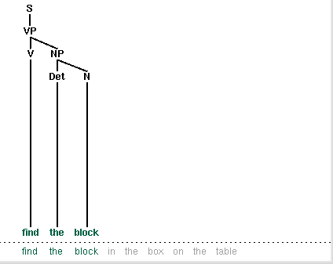
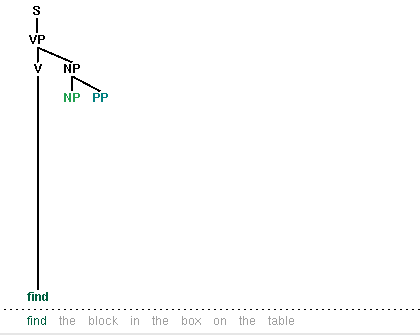
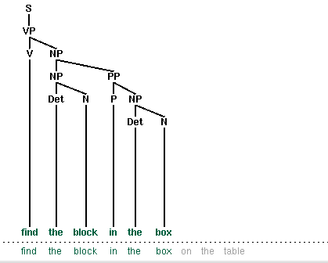
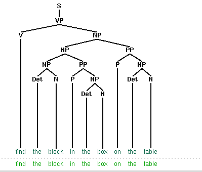
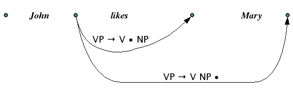
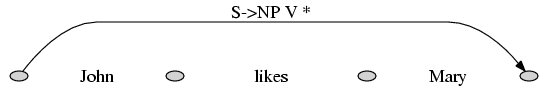
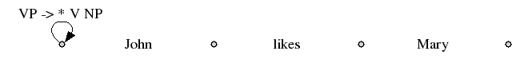
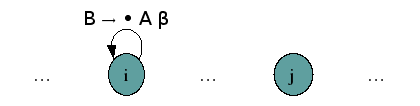
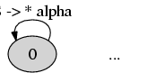

.. -*- mode: rst -*-
.. include:: ../definitions.rst

.. TODO: update images in parser-problem table (NP -> NP PP replaced
.. by Nom -> Nom PP

.. standard global imports

    >>> import nltk, re, pprint

.. _chap-advanced-parsing:

==========================================
9. Chart Parsing and Probabilistic Parsing
==========================================

.. _ch09-introduction:

------------
Introduction
------------

Chapter chap-parse_ started with an introduction to constituent
structure in English, showing how words in a sentence group together
in predictable ways. We showed how to describe this structure using
syntactic tree diagrams, and observed that it is sometimes desirable
to assign more than one such tree to a given string. In this case, we
said that the string was structurally ambiguous; and example was `old
men and women`:lx:. 

Treebanks are language resources in which the syntactic structure of a
corpus of sentences has been annotated, usually by hand. However, we
would also like to be able to produce trees algorithmically. A
context-free phrase structure grammar (|CFG|) is a formal model for
describing whether a given string can be assigned a particular
constituent structure. Given a set of syntactic categories, the |CFG|
uses a set of productions to say how a phrase of some category *A* can
be analyzed into a sequence of smaller parts |alpha|\ :sub:`1`
... |alpha|\ :sub:`n`.  But a grammar is a static description of a set
of strings; it does not tell us what sequence of steps we need to take
to build a constituent structure for a string. For this, we need to
use a parsing algorithm.  We presented two such algorithms: Top-Down Recursive
Descent Bottom-Up Shift-Reduce (sec-parsing_).
As we pointed out, both parsing approaches suffer
from important shortcomings. The Recursive Descent parser cannot
handle left-recursive productions (e.g., productions such as `np`:gc:
|rarr| `np pp`:gc:), and blindly expands categories top-down without
checking whether they are compatible with the input string. The
Shift-Reduce parser is not guaranteed to find a valid parse for the
input even if one exists, and builds substructure without checking
whether it is globally consistent with the grammar. As we will
describe further below, the Recursive Descent parser is also
inefficient in its search for parses.

So, parsing builds trees over sentences, according to a phrase
structure grammar.  Now, all the examples we gave in Chapter
chap-parse_ only involved toy grammars containing a handful of
productions. What happens if we try to scale up this approach to deal
with realistic corpora of language? Unfortunately, as the coverage of
the grammar increases and the length of the input sentences grows, the
number of parse trees grows rapidly.  In fact, it grows at an
astronomical rate.

Let's explore this issue with the help of a simple example.
The word
`fish`:lx: is both a noun and a verb.  We can make up the sentence
`fish fish fish`:lx:, meaning *fish like to fish for other fish*.
(Try this with `police`:lx: if you prefer something more sensible.)
Here is a toy grammar for the "fish" sentences.

    >>> grammar = nltk.parse_cfg("""
    ... S -> NP V NP
    ... NP -> NP Sbar
    ... Sbar -> NP V 
    ... NP -> 'fish'
    ... V -> 'fish'
    ... """)

.. note:: Remember that our program samples assume you
   begin your interactive session or your program with: ``import nltk, re, pprint``

Now we can try parsing a longer sentence, `fish fish fish fish
fish`:lx:, which amongst other things, means 'fish that other fish
fish are in the habit of fishing fish themselves'. We use the |NLTK|
chart parser, which is presented later on in this chapter.  This
sentence has two readings.

    >>> tokens = ["fish"] * 5
    >>> cp = nltk.ChartParser(grammar, nltk.parse.TD_STRATEGY)
    >>> for tree in cp.nbest_parse(tokens):
    ...     print tree
    (S (NP (NP fish) (Sbar (NP fish) (V fish))) (V fish) (NP fish))
    (S (NP fish) (V fish) (NP (NP fish) (Sbar (NP fish) (V fish))))

As the length of this sentence goes up (3, 5, 7, ...) we get the
following numbers of parse trees:
1; 2; 5; 14; 42; 132; 429; 1,430; 4,862; 16,796; 58,786; 208,012; ...
(These are the `Catalan numbers`:idx:, which we saw in an exercise
in Section sec-algorithm-design-strategies_).
The last of these is for a sentence of length 23, the average length
of sentences in the  WSJ section of Penn Treebank.  For a sentence
of length 50 there would be over 10\ :superscript:`12` parses, and this
is only half the length of the Piglet sentence
(Section sec-more-observations-about-grammar_),
which young children process effortlessly.
No practical |NLP| system could construct millions of trees for a
sentence and choose the appropriate one in the context.
It's clear that humans don't do this either!

Note that the problem is not with our choice of example. 
[Church1982CSA]_ point out that the syntactic ambiguity of `pp`:gc:
attachment in sentences like pp_ also grows in proportion to the Catalan
numbers.

.. _pp:
.. ex:: Put the block in the box on the table.

So much for structural ambiguity; what about lexical ambiguity?
As soon as we try to construct a broad-coverage grammar, we
are forced to make lexical entries highly ambiguous for their part of
speech.  In a toy grammar, `a`:lx: is only a determiner, `dog`:lx: is
only a noun, and `runs`:lx: is only a verb.  However, in a
broad-coverage grammar, `a` is also a noun (e.g. `part a`:lx:),
`dog`:lx: is also a verb (meaning to follow closely), and `runs`:lx:
is also a noun (e.g. `ski runs`:lx:).  In fact, all words can be
referred to by name: e.g. `the verb 'ate' is spelled with three
letters`:lx:; in speech we do not need to supply quotation marks.
Furthermore, it is possible to *verb* most nouns.  Thus a parser for a
broad-coverage grammar will be overwhelmed with ambiguity.  Even
complete gibberish will often have a reading, e.g. `the a are of
I`:lx:.  As [Abney1996SML]_ has pointed out, this is not word salad but a
grammatical noun phrase, in which `are`:lx: is a noun meaning a
hundredth of a hectare (or 100 sq m), and `a`:lx: and `I`:lx: are
nouns designating coordinates, as shown in Figure are_.

.. _are:
.. figure:: ../images/are.png
   :scale: 20

   The a are of I

|nopar|
Even though this phrase is unlikely, it is still grammatical and a
a broad-coverage parser should be able to construct a parse tree
for it.  Similarly, sentences that seem to be
unambiguous, such as `John saw Mary`:lx:, turn out to have other
readings we would not have anticipated (as Abney explains).  This
ambiguity is unavoidable, and leads to horrendous inefficiency in
parsing seemingly innocuous sentences. 

Let's look more closely at this issue of efficiency.
The top-down recursive-descent parser presented
in Chapter chap-parse_ can be very inefficient, since it often builds
and discards the same sub-structure many times over.  We see this
in Figure parser-problem_, where a phrase `the block`:lx: is identified
as a noun phrase several times, and where this information is discarded
each time we backtrack.

.. Note::
   You should try the recursive-descent parser demo if you haven't
   already: ``nltk.draw.srparser.demo()``

.. table:: parser-problem

   +-----------------------------------+-----------------------------------+
   | a. Initial stage                  | b. Backtracking                   |
   |                                   |                                   |
   | |findtheblock1|                   | |findtheblock2|                   |
   +-----------------------------------+-----------------------------------+
   | c. Failing to match `on`:lx:      | d. Completed parse                |
   |                                   |                                   |
   | |findtheblock3|                   | |findtheblock4|                   |
   +-----------------------------------+-----------------------------------+

   Backtracking and Repeated Parsing of Subtrees

In this chapter, we will present two independent methods for dealing with ambiguity.
The first is `chart parsing`:em:, which uses the algorithmic technique
of dynamic programming to derive the parses of an ambiguous
sentence more `efficiently`:em:.  The second is
`probabilistic parsing`:em:, which allows us to `rank`:em:
the parses of an ambiguous sentence on the basis of evidence from corpora.

.. _chart-parsing:

-------------
Chart Parsing
-------------

`chart parsing`:topic:

In the introduction to this chapter, we pointed out that the simple
parsers discussed in Chapter chap-parse_ suffered from limitations in
both completeness and efficiency. In order to remedy these, we will
apply the algorithm design technique of `dynamic programming`:idx: to
the parsing problem.  As we saw in Section sec-algorithm-design-strategies_,
dynamic programming stores intermediate results and re-uses them when
appropriate, achieving significant efficiency gains. This technique
can be applied to syntactic parsing, allowing us to store
partial solutions to the parsing task and then look them up as
necessary in order to efficiently arrive at a complete solution.
This approach to parsing is known as `chart parsing`:dt:, and is the
focus of this section.

Well-Formed Substring Tables
----------------------------

A well-known example of ambiguity is shown in elephant_  
(from Groucho Marx, Animal Crackers, 1930):

.. _elephant:
.. ex::

   While hunting in Africa, I shot an elephant in my pajamas.
   How an elephant got into my pajamas I'll never know.

Let's take a closer look at the ambiguity in the phrase:
`I shot an elephant in my pajamas`:lx:.  First we
need to define a simple grammar:

    >>> grammar = nltk.parse_cfg("""
    ... S -> NP VP
    ... PP -> P NP
    ... NP -> Det N | Det N PP | 'I'
    ... VP -> V NP | VP PP
    ... Det -> 'an' | 'my'
    ... N -> 'elephant' | 'pajamas'
    ... V -> 'shot' 
    ... P -> 'in' 
    ... """)

As you can see, this grammar allows the sentence to be analyzed in two ways,
depending on where the `pp`:gc: is attached.

.. ex::

  .. ex::
    .. tree:: (S (NP I) (VP (V shot)  (NP (Det an) (N elephant) (PP (P in) (NP (Det my) (N pajamas)))))) 

  .. ex::
    .. tree:: (S (NP I) (VP (VP (V shot) (NP (Det an) (N elephant))) (PP (P in) (NP (Det my) (N pajamas))))) 

Dynamic programming allows us to build the `pp`:gc: `in my pyjamas`:lx:
just once.  The first time we build it we save it in a table, then we look it
up when we need to use it as a subconstituent of either the object `np`:gc: or
the higher `vp`:gc:. This table is known as a
`well-formed substring table`:dt: (or |WFST| for short). 
We will show how to construct the |WFST| bottom-up so as to systematically record
what syntactic constituents have been found.

Let's set our input to be the sentence `the kids opened the box on the
floor`:lx:. It is helpful to think of the input as being indexed like a Python
list. We have illustrated this in Figure stringpos_.

.. _stringpos:
.. figure:: ../images/chart_positions.png
   :scale: 25

   Slice Points in the Input String

|nopar|
This allows us to say that, for instance, the word `shot`:lx: spans
(1, 2) in the input.  This is reminiscent of the slice notation:

    >>> text = ["I", "shot", "an", "elephant", "in", "my", "pajamas"]
    >>> text[1:2]
    ['shot']

|nopar|
In a |WFST|, we record the position of the words
by filling in cells in a triangular matrix:
the vertical axis will denote the start position of a substring,
while the horizontal axis will denote the end position
(thus `shot`:lx: will appear in the cell with coordinates (1, 2)).
To simplify this presentation, we will assume each word has a unique
lexical category, and we will store this (not the word) in the matrix.
So cell (1, 2) will contain the entry `v`:gc:.
More generally, if our input string is
`a`:sub:`1`\ `a`:sub:`2` ... `a`:sub:`n`, and our grammar
contains a production of the form *A* |rarr| `a`:sub:`i`, then we add *A* to
the cell (`i`-1, `i`).

So, for every word in ``text``, we can look up in our grammar what
category it belongs to.

    >>> grammar.productions(rhs=tokens[1])
    [V -> 'shot']

|nopar| 
For our |WFST|, we create an `(n-1)`:math: |times| `(n-1)`:math: matrix
as a list of lists in Python, and initialize it
with the lexical categories of each token, in the ``init_wfst()``
function in Figure wfst_.  We also define a utility function ``display()``
to pretty-print the |WFST| for us.
As expected, there is a `v`:gc: in cell (1, 2).

.. pylisting:: wfst
   :caption: Acceptor Using Well-Formed Substring Table (based on |CYK| algorithm)

    def init_wfst(tokens, grammar):
        numtokens = len(tokens)
        wfst = [[None for i in range(numtokens+1)] for j in range(numtokens+1)]
        for i in range(numtokens):
            productions = grammar.productions(rhs=tokens[i])
            wfst[i][i+1] = productions[0].lhs()
        return wfst

    def complete_wfst(wfst, tokens, trace=False):
        index = dict((p.rhs(), p.lhs()) for p in grammar.productions())
        numtokens = len(tokens)
        for span in range(2, numtokens+1):
            for start in range(numtokens+1-span):
                end = start + span
                for mid in range(start+1, end):
                    nt1, nt2 = wfst[start][mid], wfst[mid][end]
                    if nt1 and nt2 and (nt1,nt2) in index:
                        wfst[start][end] = index[(nt1,nt2)]
                        if trace:
                            print "[%s] %3s [%s] %3s [%s] ==> [%s] %3s [%s]" % \
                            (start, nt1, mid, nt2, end, start, index[(nt1,nt2)], end)
        return wfst

    def display(wfst, tokens):
        print '\nWFST ' + ' '.join([("%-4d" % i) for i in range(1, len(wfst))])
        for i in range(len(wfst)-1):
            print "%d   " % i,
            for j in range(1, len(wfst)):
                print "%-4s" % (wfst[i][j] or '.'),
            print

    >>> tokens = "I shot an elephant in my pajamas".split()
    >>> wfst0 = init_wfst(tokens, grammar)
    >>> display(wfst0, tokens)
    WFST 1    2    3    4    5    6    7   
    0    NP   .    .    .    .    .    .   
    1    .    V    .    .    .    .    .   
    2    .    .    Det  .    .    .    .   
    3    .    .    .    N    .    .    .   
    4    .    .    .    .    P    .    .   
    5    .    .    .    .    .    Det  .   
    6    .    .    .    .    .    .    N 
    >>> wfst1 = complete_wfst(wfst0, tokens, trace=True)
    >>> display(wfst1, tokens)
    WFST 1    2    3    4    5    6    7   
    0    NP   .    .    S    .    .    S   
    1    .    V    .    VP   .    .    VP  
    2    .    .    Det  NP   .    .    .   
    3    .    .    .    N    .    .    .   
    4    .    .    .    .    P    .    PP  
    5    .    .    .    .    .    Det  NP  
    6    .    .    .    .    .    .    N

Returning to our tabular representation, given that we have `det`:gc:
in cell (2, 3) for the word `an`:lx:, and `n`:gc: in cell (3, 4) for the
word `elephant`:lx:, what should we put into cell (2, 4) for `an elephant`:lx:?
We need to find a production of the form *A* |rarr| `det`:gc: `n`:gc:.
Consulting the grammar, we know that we can enter `np`:gc: in cell (0,2).

More generally, we can enter *A* in `(i, j)`:math: if there
is a production *A* |rarr| *B* *C*, and we find
nonterminal *B* in `(i, k)`:math: and *C* in `(k, j)`:math:.
The program in Figure wfst_ uses this inference step to complete the |WFST|.

.. note::
   To help us easily retrieve productions by their right hand
   sides, we create an index for the grammar.
   This is an example of a space-time trade-off: we do a reverse lookup
   on the grammar, instead of having to check through entire list of
   productions each time we want to look up via the right hand side.

We conclude that there is a parse for the whole input string once
we have constructed an `s`:gc: node in cell (0, 7), showing that we
have found a sentence that covers the whole input.

Notice that we have not used any built-in parsing functions here.
We've implemented a complete, primitive chart parser from the ground up!

Charts
------

By setting ``trace`` to ``True`` when calling the function ``complete_wfst()``, we get 
additional output.

    >>> wfst1 = complete_wfst(wfst0, tokens, trace=True)
    [2] Det [3]   N [4] ==> [2]  NP [4]
    [5] Det [6]   N [7] ==> [5]  NP [7]
    [1]   V [2]  NP [4] ==> [1]  VP [4]
    [4]   P [5]  NP [7] ==> [4]  PP [7]
    [0]  NP [1]  VP [4] ==> [0]   S [4]
    [1]  VP [4]  PP [7] ==> [1]  VP [7]
    [0]  NP [1]  VP [7] ==> [0]   S [7]

|nopar| For example, this says that since we found ``Det`` at
``wfst[0][1]`` and ``N`` at ``wfst[1][2]``, we can add ``NP`` to
``wfst[0][2]``.
The same information can be represented in a directed acyclic graph,
as shown in Figure chartinit_\ (a) for the initialized WFST and
chartinit_\ (b) for the completed WFST.

.. table:: chartinit

   +-------------------------------------------------------------------+
   | a. Initialized WFST                                               |
   |                                                                   |
   | |chart_wfst1|                                                     |
   +-------------------------------------------------------------------+
   | b. Completed WFST                                                 |
   |                                                                   |
   | |chart_wfst2|                                                     |
   +-------------------------------------------------------------------+

   A Graph Representation for the WFST

.. |chart_wfst1| image:: ../images/chart_wfst1.png
   :scale: 25

.. |chart_wfst2| image:: ../images/chart_wfst2.png
   :scale: 25

A |WFST| is a data structure that can be used by a variety of parsing
algorithms. The particular method for constructing a |WFST| that we
have just seen and has some shortcomings.

First, as you can see, the |WFST| is not itself a parse tree, so the technique is
strictly speaking `recognizing`:dt: that a sentence is admitted by a
grammar, rather than parsing it.

Second, it requires every non-lexical grammar production to be
`binary`:em: (see the discussion of normal forms in Section sec-grammar-induction_).
Although it is possible to convert an arbitrary |CFG| into this form,
we would prefer to use an approach without such a requirement.

Third, as a bottom-up approach it is potentially wasteful, being
able to propose constituents in locations that would not be licensed by
the grammar.

Finally, the |WFST| did not represent the structural ambiguity in
the sentence (i.e. the two verb phrase readings).  The `vp`:gc:
in cell (`2,8`) was actually entered twice, once for a `v np`:gc:
reading, and once for a `vp pp`:gc: reading.
In the next section we will address these issues.

they can hold multiple hypotheses for a given span

-------------
Active Charts
-------------

.. _chart_fundamental:
.. figure:: ../images/chart_fundamental.png
   :scale: 30

   Example of Dotted Edges and the Fundamental Rule

In general, a chart parser hypothesizes constituents (i.e. adds edges)
based on the grammar, the tokens, and the constituents already found.
Any constituent that is compatible with the current knowledge can be hypothesized;
even though many of these hypothetical constituents will never be used in
the final result.  A |WFST| just records these hypotheses.

All of the edges that we've seen so far represent complete
constituents.  However, as we will see, it is helpful to hypothesize
*incomplete* constituents.  For example, the work done by a
parser in processing the production *VP* |rarr| *V* *NP* *PP*
can be reused when processing *VP* |rarr| *V* *NP*.
Thus, we will record the
hypothesis that "the `v`:gc: constituent `likes`:lx: is the beginning of a `vp`:gc:."

We can record such hypotheses by adding a `dot`:dt: to the
edge's right hand side.  Material to the left of the dot specifies
what the constituent starts with; and material to the
right of the dot specifies what still needs to be found in order
to complete the constituent.  For example, the edge in the
Figure dottededge_ records the hypothesis that "a `vp`:gc: starts with the `v`:gc:
`likes`:lx:, but still needs an `np`:gc: to become complete":

.. _dottededge:
.. figure:: ../images/chart_intro_dottededge.png
   :scale: 30

   Chart Containing Incomplete VP Edge

|nopar| These `dotted edges`:dt: are used to record all of the hypotheses that a
chart parser makes about constituents in a sentence.  Formally
a dotted edge [`A` |rarr| `c`:sub:`1` |dots| `c`:sub:`d` |dot| `c`:sub:`d+1` |dots| `c`:sub:`n`, (*i*, *j*)] 
records the hypothesis that a constituent of type `A` with span (`i, j`)
starts with children `c`:sub:`1` |dots| `c`:sub:`d`, but still
needs children `c`:sub:`d+1` |dots| `c`:sub:`n` to be complete
(`c`:sub:`1` |dots| `c`:sub:`d` and `c`:sub:`d+1` |dots| `c`:sub:`n` may be empty).
If `d = n`:math:, then `c`:sub:`d+1` |dots| `c`:sub:`n` is
empty and the edge represents a complete constituent and is called
a `complete edge`:dt:.  Otherwise, the edge represents an incomplete
constituent, and is called an `incomplete edge`:dt:.  In Figure
chart_terms_\ (a), [`vp`:gc: |rarr| `v`:gc: `np`:gc: |dot|, (1, 3)] is a
complete edge, and [`vp`:gc: |rarr| `v`:gc: |dot| `np`:gc:, (1, 2)] is
an incomplete edge.

If `d = 0`:math:, then `c`:sub:`1` |dots| `c`:sub:`n` is empty
and the edge is called a `self-loop edge`:dt:.  
This is illustrated in Table chart_terms_\ (b).
If a complete edge spans the entire sentence, and has the grammar's
start symbol as its left-hand side, then the edge is called a `parse
edge`:dt:, and it encodes one or more parse trees for the sentence.  In
Table chart_terms_\ (c), [`s`:gc: |rarr| `np`:gc: `vp`:gc: |dot|, (0, 3)] is a parse edge.

.. table:: chart_terms

   +--------------------------+-------------------------+-------------------------+
   | a. Incomplete Edge       | b. Self Loop Edge       | c. Parse Edge           |
   | |chart_intro_incomplete| | |chart_intro_selfloop|  | |chart_intro_parseedge| |
   +--------------------------+-------------------------+-------------------------+

   Chart Terminology

The Chart Parser
----------------

To parse a sentence, a chart parser first creates an empty chart
spanning the sentence.  It then finds edges that are licensed by its
knowledge about the sentence, and adds them to the chart one at a time
until one or more parse edges are found.  The edges that it adds can
be licensed in one of three ways:

1. The *input* can license an edge.  In particular, each word `w`:sub:`i`
   in the input licenses the complete edge [`w`:sub:`i` |rarr|
   |dot|, (*i*, *i*\ +1)].

#. The *grammar* can license an edge.  In particular, each grammar
   production A |rarr| |alpha| licenses the self-loop edge [*A* |rarr|
   |dot| |alpha|, (*i*, *i*)] for every *i*, 0 |leq| *i* < *n*.

#. The *current chart contents* can license an edge.

However, it is not wise to add `all`:em: licensed edges to the chart,
since many of them will not be used in any complete parse.  For
example, even though the edge in the following chart is licensed (by
the grammar), it will never be used in a complete parse:

.. _uselessedge:        

   Chart Containing Redundant Edge

Chart parsers therefore use a set of `rules`:dt: to heuristically decide
when an edge should be added to a chart.  This set of rules, along
with a specification of when they should be applied, forms a
`strategy`:dt:.

The Fundamental Rule
--------------------

One rule is particularly important, since it is used by every chart
parser: the `Fundamental Rule`:dt:. 
This rule is used to combine an
incomplete edge that's expecting a nonterminal *B* with a following, complete
edge whose left hand side is *B*.

.. _fundamental-rule:
.. ex::
   `Fundamental Rule`:dt:

   .. parsed-literal::

    If the chart contains the edges
      [*A* |rarr| |alpha| |dot| *B* |beta| , (*i*, *j*\ )]
      [*B* |rarr| |gamma| |dot| , (*j*, *k*\ )]
    then add the new edge
      [*A* |rarr| |alpha| *B* |dot| |beta| , (*i*, *k*)]
    where |alpha|, |beta|, and |gamma| are (possibly empty) sequences
    of terminals or non-terminals

Note that the dot has moved one place to the right, and the span of this new edge is the combined
span of the other two.  Note also that in adding this new edge we do not remove the other two,
because they might be used again.

A somewhat more intuitive version of the operation of the Fundamental
Rule can be given using chart diagrams. Thus, if we have a chart of
the form shown in Table fr_\ (a),
then we can add a new complete edge as shown in Table fr_\ (b).

.. table:: fr

   +-------------------------------+-------------------------------+
   | a. Input                      | b. Output                     |
   | |chart_fr1|                   | |chart_fr2|                   |
   +-------------------------------+-------------------------------+

   Fundamental Rule

.. [#] The Fundamental Rule corresponds to the Completer
   function in the Earley algorithm; cf. [JurafskyMartin2008]_.

Bottom-Up Parsing
-----------------

As we saw in Chapter chap-parse_, bottom-up parsing starts from the
input string, and tries to find sequences of words and phrases that
correspond to the *right hand* side of a grammar production. The
parser then replaces these with the left-hand side of the production,
until the whole sentence is reduced to an `S`:gc:.  Bottom-up chart
parsing is an extension of this approach in which hypotheses about
structure are recorded as edges on a chart. In terms of our earlier
terminology, bottom-up chart parsing can be seen as a parsing
strategy; in other words, bottom-up is a particular choice of
heuristics for adding new edges to a chart. 

The general procedure for chart parsing is
inductive: we start with a base case, and then show how we can move
from a given state of the chart to a new state. Since we are working
bottom-up, the base case for our induction will be determined by the
words in the input string, so we add new edges for each word.  Now,
for the induction step, suppose the chart contains an edge labeled
with constituent *A*. Since we are working bottom-up, we want to build
constituents that can have an *A* as a daughter. In other words, we
are going to look for productions of the form *B* |rarr| *A* |beta| and use
these to label new edges.

Let's look at the procedure a bit more formally.  To create a
bottom-up chart parser, we add to the Fundamental Rule two new rules:
the `Bottom-Up Initialization Rule`:dt:; and the `Bottom-Up Predict
Rule`:dt:.
The Bottom-Up Initialization Rule says to add all edges licensed by
the input.

.. _bottom-up-initialization-rule:
.. ex::
   `Bottom-Up Initialization Rule`:dt:

   .. parsed-literal::

    For every word w\ :subscript:`i` add the edge
      [`w`:subscript:`i` |rarr|  |dot| , (*i*, *i*\ +1)]

Table bu-init-chart_\ (a) illustrates this rule using the chart notation,
while Table bu-init-chart_\ (b) shows the bottom-up
initialization for the input `Lee likes coffee`:lx:.

.. table:: bu-init-chart

   +------------------------------+----------------------------+
   | a. Generic                   | b. Example                 |
   | |chart_bu_init|              | |chart_bu_ex1|             |
   +------------------------------+----------------------------+

   Bottom-Up Initialization Rule

.. |chart_bu_ex1| image:: ../images/chart_bu_ex1.png
   :scale: 30

Notice that the dot on the right hand side of these productions
is telling us that we have complete edges for the lexical items. By
including this information, we
can give a uniform statement of how the Fundamental Rule operates in
Bottom-Up parsing, as we will shortly see.

Next, suppose the chart contains a complete edge *e* whose
left hand category is *A*. Then the Bottom-Up Predict Rule requires the
parser to add a self-loop edge at the left boundary of *e*
for each grammar production whose right hand side begins with category
*A*.

.. _bottom-up-predict-rule:
.. ex::
   `Bottom-Up Predict Rule`:dt:

   .. parsed-literal::

    If the chart contains the complete edge
      [*A* |rarr| |alpha| |dot| , (*i*, *j*\ )]
    and the grammar contains the production
      *B* |rarr| *A* |beta|
    then add the self-loop edge
      [*B* |rarr|  |dot| *A* |beta| , (*i*, *i*\ )]

Graphically, if the chart looks as in Figure bu-predict-chart_\ (a),
then the Bottom-Up Predict Rule tells the parser to augment the chart
as shown in Figure bu-predict-chart_\ (b).

.. table:: bu-predict-chart

   +----------------------------+--------------------------+
   | a. Input                   | b. Output                |
   | |chart_bu_predict1|        | |chart_bu_predict2|      |
   +----------------------------+--------------------------+

   Bottom-Up Prediction Rule

To continue our earlier example, let's suppose that our grammar
contains the lexical productions shown in lexical-productions_.
This allows us to add three self-loop edges to the chart, as
shown in buex2_.

.. _lexical-productions:
.. ex::

     `np`:gc: |rarr| `Lee`:lx: | `coffee`:lx:

     `v`:gc: |rarr| `likes`:lx:

.. _buex2:
.. ex::
   .. image:: ../images/chart_bu_ex2.png
      :scale: 30

Once our chart contains an instance of the pattern shown in Figure bu-predict-chart_\ (b),
we can use the Fundamental Rule to add an edge where we have "moved the dot" one
position to the right, as shown in Figure bu-fr_
(we have omitted the self-loop edges for simplicity.)

.. table:: bu-fr

   +----------------------+------------------------------+
   | a. Generic           | b. Example                   |
   |                      |                              |
   | |chart_bu_fr|        | |chart_bu_ex3|               |
   +----------------------+------------------------------+

   Fundamental Rule used in Bottom-Up Parsing

.. |chart_bu_fr| image:: ../images/chart_bu_fr.png
   :scale: 30

.. |chart_bu_ex3| image:: ../images/chart_bu_ex3.png
   :scale: 30

|nopar| We will now be able to add new self-loop edges such as 
[`s`:gc: |rarr|  |dot| `np`:gc: `vp`:gc:, (0, 0)] and
[`vp`:gc: |rarr|  |dot| `vp`:gc: `np`:gc:, (1, 1)], and use these to
build more complete edges.

Using these three productions, we can parse a sentence as shown in
bottom-up-strategy_.

.. _bottom-up-strategy:
.. ex::
   `Bottom-Up Strategy`:dt:

   .. parsed-literal::

    Create an empty chart spanning the sentence. 
    Apply the Bottom-Up Initialization Rule to each word. 
    Until no more edges are added: 
      Apply the Bottom-Up Predict Rule everywhere it applies. 
      Apply the Fundamental Rule everywhere it applies. 
    Return all of the parse trees corresponding to the parse edges in the chart. 

.. note:: |TRY|
   |NLTK| provides a useful interactive tool for visualizing the operation of a
   chart parser: ``nltk.draw.chart.demo()``.
   The tool comes with a pre-defined input string and grammar, but both
   of these can be readily modified with options inside the *Edit* menu.

Top-Down Parsing
----------------

Top-down chart parsing works in a similar way to the recursive descent
parser discussed in Chapter chap-parse_, in that it starts off with
the top-level goal of finding an `s`:gc:. This goal is then broken into
the subgoals of trying to find constituents such as `np`:gc: and
`vp`:gc: that can be immediately dominated by  `s`:gc:.
To create a top-down chart parser, we use the Fundamental Rule as before plus
three other rules: the `Top-Down Initialization Rule`:dt:, the `Top-Down
Expand Rule`:dt:, and the `Top-Down Match Rule`:dt:.
The Top-Down Initialization Rule in td-init-rule_
captures the fact that the root of any
parse must be the start symbol `s`:gc:\.
It is illustrated graphically in Table td-init-chart_.

.. _td-init-rule:
.. ex::
   `Top-Down Initialization Rule`:dt:

   .. parsed-literal::

    For every grammar production of the form:
      `s`:gc: |rarr| |alpha|
    add the self-loop edge: 
      [`s`:gc: |rarr|  |dot| |alpha|\ , (0, 0)]

.. table:: td-init-chart

   +----------------------+------------------------------+
   | a. Generic           | b. Example                   |
   |                      |                              |
   | |chart_td_init|      | |chart_td_ex1|               |
   +----------------------+------------------------------+

   Top-Down Initialization Rule

.. |chart_td_ex1| image:: ../images/chart_td_ex1.png
   :scale: 30

As we mentioned before, the dot on the right hand side of a production
records how far our goals have been satisfied. So in Figure
td-init-chart_\ (b), we are predicting that we will be able to find an `np`:gc: and a
`vp`:gc:, but have not yet satisfied these subgoals. So how do we
pursue them? In order to find an  `np`:gc:, for instance, we need to
invoke a production that has `np`:gc: on its left hand side. The step
of adding the required edge to the chart is accomplished with the
Top-Down Expand Rule td-expand-rule_.
This tells us that if our chart contains an incomplete
edge whose dot is followed by a nonterminal *B*, then the parser
should add any self-loop edges licensed by the grammar whose left-hand
side is *B*.

.. _td-expand-rule:
.. ex::
   `Top-Down Expand Rule`:dt:

   .. parsed-literal::

    If the chart contains the incomplete edge
      [*A* |rarr| |alpha| |dot| *B* |beta| , (*i*, *j*)]
    then for each grammar production
      *B* |rarr| |gamma|
    add the edge
      [*B* |rarr| |dot| |gamma| , (*j*, *j*\ )]

|nopar| Thus, given a chart that looks like the one in Table td-expand-chart_\ (a),
the Top-Down Expand Rule augments it with the edge shown in Table td-expand-chart_\ (b).
In terms of our running example, we now have the chart shown in Table td-expand-chart_\ (c).

.. table:: td-expand-chart

   +----------------------+------------------------+---------------------------------+
   | a. Input             | b. Output              | c. Example                      |
   | |chart_td_expand1|   | |chart_td_expand2|     | |chart_td_ex2|                  |
   +----------------------+------------------------+---------------------------------+

   Top-Down Expand Rule

.. |chart_td_ex2| image:: ../images/chart_td_ex2.png
   :scale: 30

The Top-Down Match rule allows the predictions of the grammar to be
matched against the input string. Thus, if the chart contains an incomplete
edge whose dot is followed by a terminal *w*, then the parser should
add an edge if the terminal corresponds to the current input symbol.

.. _top-down-match-rule:
.. ex::
   `Top-Down Match Rule`:dt:

   .. parsed-literal::

    If the chart contains the incomplete edge
      [*A* |rarr| |alpha| |dot| w\ :subscript:`j` |beta|\ , (*i*, *j*\ )], 
    where w\ :subscript:`j` is the *j* :sup:`th` word of the input,
    then add a new complete edge
      [`w`:subscript:`j` |rarr| |dot| , (*j*, *j*\ +1)]

|nopar| Graphically, the Top-Down Match rule takes us from
Table td-match-chart_\ (a), to Table td-match-chart_\ (b).

.. table:: td-match-chart

   +--------------------------+------------------------+
   | a. Input                 | b. Output              |
   | |chart_td_match1|        | |chart_td_match2|      |
   +--------------------------+------------------------+

   Top-Down Match Rule

Figure td-example_\ (a) illustrates how our example chart after applying the
Top-Down Match rule.
What rule is relevant now? The Fundamental Rule. If we remove the
self-loop edges from Figure td-example_\ (a) for simplicity, the
Fundamental Rule gives us Figure td-example_\ (b).

.. table:: td-example

   +--------------------------------------+------------------------------------+
   | a. Apply Top-Down Match Rule         | b. Apply Fundamental Rule          |
   | |chart_td_ex3|                       | |chart_td_ex4|                     |
   +--------------------------------------+------------------------------------+

   Top-Down Example (cont)

.. |chart_td_ex3| image:: ../images/chart_td_ex3.png
   :scale: 30

.. |chart_td_ex4| image:: ../images/chart_td_ex4.png
   :scale: 30

Using these four rules, we can parse a sentence top-down as shown in
top-down-strategy_.

.. I don't see why 'each word': Apply the Top-Down Initialization Rule to each word. 
.. It is defined to apply to node (0, 0)

.. _top-down-strategy:
.. ex::
   `Top-Down Strategy`:dt:

   .. parsed-literal::

    Create an empty chart spanning the sentence. 
    Apply the Top-Down Initialization Rule. 
    Until no more edges are added: 
      Apply the Top-Down Expand Rule everywhere it applies. 
      Apply the Top-Down Match Rule everywhere it applies. 
      Apply the Fundamental Rule everywhere it applies. 
    Return all of the parse trees corresponding to the parse edges in
    the chart. 

We encourage you to experiment with the |NLTK| chart parser demo,
as before, in order to test out the top-down strategy yourself.

The Earley Algorithm
--------------------

The Earley algorithm [Earley1970ECF]_ is a parsing strategy that
resembles the Top-Down Strategy, but deals more efficiently with
matching against the input string. Table earley-terminology_ shows the
correspondence between the parsing rules introduced above and the
rules used by the Earley algorithm.

.. table:: earley-terminology

    +-------------------------------+------------------------------+
    |**Top-Down**\ /**Bottom-Up**   |   **Earley**                 |
    +===============================+==============================+
    | Top-Down Initialization Rule  |  Predictor Rule              |
    | Top-Down Expand Rule          |                              |
    +-------------------------------+------------------------------+
    | Top-Down/Bottom-Up Match Rule |  Scanner Rule                |
    +-------------------------------+------------------------------+
    | Fundamental Rule              |  Completer Rule              |
    +-------------------------------+------------------------------+

    Terminology for rules in the Earley algorithm

Let's look in more detail at the Scanner Rule. Suppose the chart
contains an incomplete edge with a lexical category *P* immediately after
the dot,  the next word in the input is *w*, *P* is a part-of-speech
label for *w*. Then the Scanner Rule admits a new complete edge in
which *P* dominates *w*. More precisely:

.. _scanner-rule:
.. ex::
   `Scanner Rule`:dt:

   .. parsed-literal::

    If the chart contains the incomplete edge
      [*A* |rarr| |alpha| |dot| *P* |beta|, (*i*, *j*)] 
    and  *w*\ :subscript:`j` is the *j*\ :sup:`th` word of the input,
    and *P* is a valid part of speech for *w*\ :subscript:`j`,
    then add the new complete edges
      [*P* |rarr| *w*\ :subscript:`j` |dot|\ , (*j*, *j*\ +1)] 
      [*w*\ :subscript:`j` |rarr| |dot|\ , (*j*, *j*\ +1)]  

|nopar| To illustrate, suppose the input is of the form 
`I saw ...`:lx:, and the chart already contains the edge 
[`vp`:gc: |rarr|  |dot| `v`:gc: ..., (1, 1)]. Then the Scanner Rule will add to 
the chart the edges [`v`:gc: |rarr| 'saw', (1, 2)]
and ['saw'|rarr| |dot|\ , (1, 2)]. So in effect the Scanner Rule packages up a
sequence of three rule applications: the Bottom-Up Initialization Rule for 
[*w* |rarr| |dot|\ , (*j*, *j*\ +1)],
the Top-Down Expand Rule for [*P* |rarr| |dot| *w*\ :subscript:`j`, (*j*, *j*)], and 
the Fundamental Rule for [*P* |rarr| *w*\ :subscript:`j` |dot|\ , (*j*,
*j*\ +1))]. This is considerably more efficient than the Top-Down Strategy, that
adds a new edge of the form [*P* |rarr| |dot| *w* , (*j*, *j*)] for
`every`:em: lexical rule *P* |rarr| *w*, regardless of whether *w* can
be found in the input.
By contrast with Bottom-Up Initialization, however, the
Earley algorithm proceeds strictly left-to-right through the input,
applying all applicable rules at that point in the chart, and never backtracking.
The |NLTK| chart parser demo, ``nltk.draw.chart.demo()``, allows the option of
parsing according to the Earley algorithm.

Chart Parsing in NLTK
---------------------

NLTK defines a simple yet flexible chart parser,
``ChartParser``.  A new chart parser is constructed from a
grammar and a list of chart rules (also known as a *strategy*).  These
rules will be applied, in order, until no new edges are added to the
chart.  In particular, ``ChartParser`` uses the algorithm shown in chart-algorithm_.

.. _chart-algorithm:
.. ex::
   .. parsed-literal::   

    Until no new edges are added:
      For each chart rule *R*:
        Apply *R* to any applicable edges in the chart. 
        Return any complete parses in the chart. 

``nltk.parse.chart`` defines two ready-made strategies:
``TD_STRATEGY``, a basic top-down strategy; and ``BU_STRATEGY``, a
basic bottom-up strategy.  When constructing a chart parser, you
can use either of these strategies, or create your own.

The following example illustrates the use of the chart parser.
We start by defining a simple grammar, and tokenizing a sentence.
We make sure it is a list (not an iterator), since
we wish to use the same tokenized sentence several times.

.. pylisting:: chart-demo
   :caption: Chart Parsing with NLTK

   grammar = nltk.parse_cfg('''
     NP  -> NNS | JJ NNS | NP CC NP
     NNS -> "men" | "women" | "children" | NNS CC NNS
     JJ  -> "old" | "young"
     CC  -> "and" | "or"
     ''')
   parser = nltk.ChartParser(grammar, nltk.parse.BU_STRATEGY)

   >>> sent = 'old men and women'.split()
   >>> for tree in parser.nbest_parse(sent):
   ...     print tree
   (NP (JJ old) (NNS (NNS men) (CC and) (NNS women)))
   (NP (NP (JJ old) (NNS men)) (CC and) (NP (NNS women)))

The ``trace`` parameter can be specified when creating a parser, to
turn on tracing (higher trace levels produce more verbose output).
Example butrace_ shows the trace output for parsing a
sentence with the bottom-up strategy.
Notice that in this output, ``'[-----]'`` indicates a complete edge,
``'>'`` indicates a self-loop edge, and ``'[----->'`` indicates an
incomplete edge.

.. pylisting:: butrace
   :caption: Trace of Bottom-Up Parser

   >>> parser = nltk.ChartParser(grammar, nltk.parse.BU_STRATEGY, trace=2)
   >>> trees = parser.nbest_parse(sent)
   |.   old   .   men   .   and   .  women  .|
   Bottom Up Init Rule:
   |[---------]         .         .         .| [0:1] 'old' 
   |.         [---------]         .         .| [1:2] 'men' 
   |.         .         [---------]         .| [2:3] 'and' 
   |.         .         .         [---------]| [3:4] 'women' 
   Bottom Up Predict Rule:
   |>         .         .         .         .| [0:0] JJ -> * 'old' 
   |.         >         .         .         .| [1:1] NNS -> * 'men' 
   |.         .         >         .         .| [2:2] CC -> * 'and' 
   |.         .         .         >         .| [3:3] NNS -> * 'women' 
   Fundamental Rule:
   |[---------]         .         .         .| [0:1] JJ -> 'old' * 
   |.         [---------]         .         .| [1:2] NNS -> 'men' * 
   |.         .         [---------]         .| [2:3] CC -> 'and' * 
   |.         .         .         [---------]| [3:4] NNS -> 'women' * 
   Bottom Up Predict Rule:
   |>         .         .         .         .| [0:0] NP -> * JJ NNS 
   |.         >         .         .         .| [1:1] NP -> * NNS 
   |.         >         .         .         .| [1:1] NNS -> * NNS CC NNS 
   |.         .         .         >         .| [3:3] NP -> * NNS 
   |.         .         .         >         .| [3:3] NNS -> * NNS CC NNS 
   Fundamental Rule:
   |[--------->         .         .         .| [0:1] NP -> JJ * NNS 
   |.         [---------]         .         .| [1:2] NP -> NNS * 
   |.         [--------->         .         .| [1:2] NNS -> NNS * CC NNS 
   |[-------------------]         .         .| [0:2] NP -> JJ NNS * 
   |.         [------------------->         .| [1:3] NNS -> NNS CC * NNS 
   |.         .         .         [---------]| [3:4] NP -> NNS * 
   |.         .         .         [--------->| [3:4] NNS -> NNS * CC NNS 
   |.         [-----------------------------]| [1:4] NNS -> NNS CC NNS * 
   |.         [-----------------------------]| [1:4] NP -> NNS * 
   |.         [----------------------------->| [1:4] NNS -> NNS * CC NNS 
   |[=======================================]| [0:4] NP -> JJ NNS * 
   Bottom Up Predict Rule:
   |.         >         .         .         .| [1:1] NP -> * NP CC NP 
   |>         .         .         .         .| [0:0] NP -> * NP CC NP 
   |.         .         .         >         .| [3:3] NP -> * NP CC NP 
   Fundamental Rule:
   |.         [--------->         .         .| [1:2] NP -> NP * CC NP 
   |[------------------->         .         .| [0:2] NP -> NP * CC NP 
   |.         .         .         [--------->| [3:4] NP -> NP * CC NP 
   |.         [----------------------------->| [1:4] NP -> NP * CC NP 
   |[--------------------------------------->| [0:4] NP -> NP * CC NP 
   |.         [------------------->         .| [1:3] NP -> NP CC * NP 
   |[----------------------------->         .| [0:3] NP -> NP CC * NP 
   |.         [-----------------------------]| [1:4] NP -> NP CC NP * 
   |[=======================================]| [0:4] NP -> NP CC NP * 
   |.         [----------------------------->| [1:4] NP -> NP * CC NP 
   |[--------------------------------------->| [0:4] NP -> NP * CC NP 

---------------------
Probabilistic Parsing
---------------------

.. TODO: mention interest in having weights is because they can be learned.
   Without this it is mysterious why we would want to bother.
   Technical aspects follow, but this is important motivation (Steven)

.. TODO: expand opening discussion to remind reader why we're doing this
   (we had moved stuff to front of chapter) (Steven)

As we pointed out in the introduction to this
chapter, dealing with ambiguity is a key challenge to broad coverage
parsers. We have shown how chart parsing can help improve the
efficiency of computing multiple parses of the same sentences. But
the sheer number of parses can be just overwhelming. We will show how
probabilistic parsing helps to manage a large space of parses.  
However, before we deal with these parsing issues,
we must first back up and introduce weighted grammars.

Weighted Grammars
-----------------

We begin by considering the verb `give`:lx:.  This verb requires both
a direct object (the thing being given) and an indirect object (the
recipient).  These complements can be given in either order, as
illustrated in example dative_.  In the "prepositional dative" form,
the indirect object appears last, and inside a prepositional phrase,
while in the "double object" form, the indirect object comes first:

.. _dative:
.. ex::
   .. ex::
      Kim gave a bone to the dog
   .. ex::
      Kim gave the dog a bone

Using the Penn Treebank sample, we can examine all instances of
prepositional dative and double object constructions involving
`give`:lx:, as shown in Figure give_.

.. pylisting:: give
   :caption: Usage of Give and Gave in the Penn Treebank sample

   def give(t):
       return t.node == 'VP' and len(t) > 2 and t[1].node == 'NP'\
              and (t[2].node == 'PP-DTV' or t[2].node == 'NP')\
              and ('give' in t[0].leaves() or 'gave' in t[0].leaves())
   def sent(t):
       return ' '.join(token for token in t.leaves() if token[0] not in '*-0')
   def print_node(t, width):
           output = "%s %s: %s / %s: %s" %\
               (sent(t[0]), t[1].node, sent(t[1]), t[2].node, sent(t[2]))
           if len(output) > width:
               output = output[:width] + "..."
           print output

   >>> for tree in nltk.corpus.treebank.parsed_sents():
   ...     for t in tree.subtrees(give):
   ...         print_node(t, 72)
   gave NP: the chefs / NP: a standing ovation
   give NP: advertisers / NP: discounts for maintaining or increasing ad sp...
   give NP: it / PP-DTV: to the politicians
   gave NP: them / NP: similar help
   give NP: them / NP: 
   give NP: only French history questions / PP-DTV: to students in a Europe...
   give NP: federal judges / NP: a raise
   give NP: consumers / NP: the straight scoop on the U.S. waste crisis
   gave NP: Mitsui / NP: access to a high-tech medical product
   give NP: Mitsubishi / NP: a window on the U.S. glass industry
   give NP: much thought / PP-DTV: to the rates she was receiving , nor to ...
   give NP: your Foster Savings Institution / NP: the gift of hope and free...
   give NP: market operators / NP: the authority to suspend trading in futu...
   gave NP: quick approval / PP-DTV: to $ 3.18 billion in supplemental appr...
   give NP: the Transportation Department / NP: up to 50 days to review any...
   give NP: the president / NP: such power
   give NP: me / NP: the heebie-jeebies
   give NP: holders / NP: the right , but not the obligation , to buy a cal...
   gave NP: Mr. Thomas / NP: only a `` qualified '' rating , rather than ``...
   give NP: the president / NP: line-item veto power

We can observe a strong tendency for the shortest complement to appear
first.  However, this does not account for a form like
``give NP: federal judges / NP: a raise``, where animacy may be
playing a role.  In fact there turn out to be a large number of contributing
factors, as surveyed by [Bresnan2006GG]_.

How can such tendencies be expressed in a conventional context free
grammar?  It turns out that they cannot.  However, we can address the
problem by adding weights, or probabilities, to the productions of a grammar.

A `probabilistic context free grammar`:dt: (or *PCFG*) is a context free
grammar that associates a probability with each of its productions.
It generates the same set of parses for a text that the corresponding
context free grammar does, and assigns a probability to each parse.
The probability of a parse generated by a PCFG is simply the product
of the probabilities of the productions used to generate it.

The simplest way to define a PCFG is to load it from a specially
formatted string consisting of a sequence of weighted productions,
where weights appear in brackets, as shown in Figure pcfg1_.

.. pylisting:: pcfg1
   :caption: Defining a Probabilistic Context Free Grammar (PCFG)

   grammar = nltk.parse_pcfg("""
       S    -> NP VP              [1.0]
       VP   -> TV NP              [0.4]
       VP   -> IV                 [0.3]
       VP   -> DatV NP NP         [0.3]
       TV   -> 'saw'              [1.0]
       IV   -> 'ate'              [1.0]
       DatV -> 'gave'             [1.0]
       NP   -> 'telescopes'       [0.8]
       NP   -> 'Jack'             [0.2]
       """)
   >>> print grammar
   Grammar with 9 productions (start state = S)
       S -> NP VP [1.0]
       VP -> TV NP [0.4]
       VP -> IV [0.3]
       VP -> DatV NP NP [0.3]
       TV -> 'saw' [1.0]
       IV -> 'ate' [1.0]
       DatV -> 'gave' [1.0]
       NP -> 'telescopes' [0.8]
       NP -> 'Jack' [0.2]

It is sometimes convenient to combine multiple productions into a single line,
e.g. ``VP -> TV NP [0.4] | IV [0.3] | DatV NP NP [0.3]``.
In order to ensure that the trees generated by the grammar form a
probability distribution, PCFG grammars impose the constraint
that all productions with a given left-hand side must have
probabilities that sum to one.
The grammar in Figure pcfg1_ obeys this constraint: for ``S``,
there is only one production, with a probability of 1.0; for ``VP``,
0.4+0.3+0.3=1.0; and for ``NP``, 0.8+0.2=1.0.
The parse tree returned by ``parse()`` includes probabilities:

    >>> viterbi_parser = nltk.ViterbiParser(grammar)
    >>> print viterbi_parser.parse(['Jack', 'saw', 'telescopes'])
    (S (NP Jack) (VP (TV saw) (NP telescopes))) (p=0.064)

The next two sections introduce two probabilistic parsing algorithms
for PCFGs.  The first is an A* parser that uses Viterbi-style dynamic
programming to find the single most likely parse for a given text.
Whenever it finds multiple possible parses for a subtree, it discards
all but the most likely parse.  The second is a bottom-up chart parser
that maintains a queue of edges, and adds them to the chart one at a
time.  The ordering of this queue is based on the probabilities
associated with the edges, allowing the parser to expand more likely
edges before less likely ones.  Different queue orderings are used to
implement a variety of different search strategies.  These algorithms
are implemented in the ``nltk.parse.viterbi`` and
``nltk.parse.pchart`` modules.

A* Parser
---------

An `A* Parser`:dt: is a bottom-up PCFG parser that uses
dynamic programming to find the single most likely parse for a text [Klein2003Astar]_.
It parses texts by iteratively filling in a 
`most likely constituents table`:dt:.  This table records the most likely tree for each
span and node value.  For example, after parsing the sentence "I saw the man with
the telescope" with the grammar ``cfg.toy_pcfg1``, the most likely constituents table
contains the following entries (amongst others):

.. table:: mlct

   ===== ==== ==================================================================  ============
   Span  Node Tree                                                                Prob
   ===== ==== ==================================================================  ============
   [0:1] NP   (NP I)                                                              0.15
   [6:7] NP   (NN telescope)                                                      0.5
   [5:7] NP   (NP the telescope)                                                  0.2
   [4:7] PP   (PP with (NP the telescope))                                        0.122
   [0:4] S    (S (NP I) (VP saw (NP the man)))                                    0.01365
   [0:7] S    (S (NP I) (VP saw (NP (NP the man) (PP with (NP the telescope)))))  0.0004163250
   ===== ==== ==================================================================  ============

   Fragment of Most Likely Constituents Table

Once the table has been completed, the parser
returns the entry for the most likely constituent that spans the
entire text, and whose node value is the start symbol.  For this
example, it would return the entry with a span of [0:6] and a node
value of "S".

Note that we only record the *most likely* constituent for any given
span and node value.  For example, in the table above, there are
actually two possible constituents that cover the span [1:6] and have
"VP" node values.

1. "saw the man, who has the telescope":

  (VP saw
     (NP (NP John)
          (PP with (NP the telescope))))

2. "used the telescope to see the man":

  (VP saw
     (NP John)
     (PP with (NP the telescope)))

|nopar|
Since the grammar we are using to parse the text indicates that the
first of these tree structures has a higher probability, the parser
discards the second one.

**Filling in the Most Likely Constituents Table:**
Because the grammar used by ``ViterbiParse`` is a PCFG, the
probability of each constituent can be calculated from the
probabilities of its children.  Since a constituent's children can
never cover a larger span than the constituent itself, each entry of
the most likely constituents table depends only on entries for
constituents with *shorter* spans (or equal spans, in the case of
unary and epsilon productions).

``ViterbiParse`` takes advantage of this fact, and fills in the most
likely constituent table incrementally.  It starts by filling in the
entries for all constituents that span a single element of text.
After it has filled in all the table entries for constituents that
span one element of text, it fills in the entries for constituents
that span two elements of text.  It continues filling in the entries
for constituents spanning larger and larger portions of the text,
until the entire table has been filled.

To find the most likely constituent with a given span and node value,
``ViterbiParse`` considers all productions that could produce that
node value.  For each production, it checks the most likely
constituents table for sequences of children that collectively cover
the span and that have the node values specified by the production's
right hand side.  If the tree formed by applying the production to the
children has a higher probability than the current table entry, then
it updates the most likely constituents table with the new tree.

**Handling Unary Productions and Epsilon Productions:**
A minor difficulty is introduced by unary productions and epsilon
productions: an entry of the most likely constituents table might
depend on another entry with the same span.  For example, if the
grammar contains the production ``V`` |rarr| ``VP``, then the table
entries for ``VP`` depend on the entries for ``V`` with the same span.
This can be a problem if the constituents are checked in the wrong
order.  For example, if the parser tries to find the most likely
constituent for a ``VP`` spanning [1:3] before it finds the most
likely constituents for ``V`` spanning [1:3], then it can't apply the
``V`` |rarr| ``VP`` production.

To solve this problem, ``ViterbiParse`` repeatedly checks each span
until it finds no new table entries.  Note that cyclic grammar
productions (e.g. ``V`` |rarr| ``V``) will *not* cause this procedure
to enter an infinite loop.  Since all production probabilities are
less than or equal to 1, any constituent generated by a cycle in the
grammar will have a probability that is less than or equal to the
original constituent; so ``ViterbiParse`` will discard it.

In NLTK, we create Viterbi parsers using ``ViterbiParse()``.
Note that since ``ViterbiParse`` only finds the single most likely
parse, that ``nbest_parse()`` will never return more than one parse.

.. pylisting:: viterbi-parse

   grammar = nltk.parse_pcfg('''
     NP  -> NNS [0.5] | JJ NNS [0.3] | NP CC NP [0.2]
     NNS -> "men" [0.1] | "women" [0.2] | "children" [0.3] | NNS CC NNS [0.4]
     JJ  -> "old" [0.4] | "young" [0.6]
     CC  -> "and" [0.9] | "or" [0.1]
     ''')
   viterbi_parser = nltk.ViterbiParser(grammar)

   >>> sent = 'old men and women'.split()
   >>> print viterbi_parser.parse(sent)
   (NP (JJ old) (NNS (NNS men) (CC and) (NNS women))) (p=0.000864)    

The ``trace`` method can be used to set the level of tracing output
that is generated when parsing a text.  Trace output displays the
constituents that are considered, and indicates which ones are added
to the most likely constituent table.  It also indicates the
likelihood for each constituent.

    >>> viterbi_parser.trace(3)
    >>> print viterbi_parser.parse(sent)
    Inserting tokens into the most likely constituents table...
       Insert: |=...| old
       Insert: |.=..| men
       Insert: |..=.| and
       Insert: |...=| women
    Finding the most likely constituents spanning 1 text elements...
       Insert: |=...| JJ -> 'old' [0.4]                 0.4000000000 
       Insert: |.=..| NNS -> 'men' [0.1]                0.1000000000 
       Insert: |.=..| NP -> NNS [0.5]                   0.0500000000 
       Insert: |..=.| CC -> 'and' [0.9]                 0.9000000000 
       Insert: |...=| NNS -> 'women' [0.2]              0.2000000000 
       Insert: |...=| NP -> NNS [0.5]                   0.1000000000 
    Finding the most likely constituents spanning 2 text elements...
       Insert: |==..| NP -> JJ NNS [0.3]                0.0120000000 
    Finding the most likely constituents spanning 3 text elements...
       Insert: |.===| NP -> NP CC NP [0.2]              0.0009000000 
       Insert: |.===| NNS -> NNS CC NNS [0.4]           0.0072000000 
       Insert: |.===| NP -> NNS [0.5]                   0.0036000000 
      Discard: |.===| NP -> NP CC NP [0.2]              0.0009000000 
      Discard: |.===| NP -> NP CC NP [0.2]              0.0009000000 
    Finding the most likely constituents spanning 4 text elements...
       Insert: |====| NP -> JJ NNS [0.3]                0.0008640000 
      Discard: |====| NP -> NP CC NP [0.2]              0.0002160000 
      Discard: |====| NP -> NP CC NP [0.2]              0.0002160000 
    (NP (JJ old) (NNS (NNS men) (CC and) (NNS women))) (p=0.000864)

A Bottom-Up PCFG Chart Parser
-----------------------------

The `A* parser`:idx: described in the previous section finds
the single most likely parse for a given text.  However, when parsers
are used in the context of a larger NLP system, it is often necessary
to produce several alternative parses.  In the context of an overall system,
a parse that is assigned low probability by the parser might still have the
best overall probability.

For example, a probabilistic parser might decide that the most likely
parse for "I saw John with the cookie" is is the structure with the
interpretation "I used my cookie to see John"; but that parse would be
assigned a low probability by a semantic system.  Combining the
probability estimates from the parser and the semantic system, the
parse with the interpretation "I saw John, who had my cookie" would be
given a higher overall probability.

This section describes a probabilistic bottom-up chart parser.
It maintains an `edge queue`:dt:, and adds these edges to the chart one at a time.
The ordering of this queue is based on the probabilities associated with the edges,
and this allows the parser to insert the most probable edges first.
Each time an edge is added to the chart, it may become possible
to insert new edges, so these are added to the queue.
The bottom-up chart parser continues adding the edges in the
queue to the chart until enough complete parses have been found, or
until the edge queue is empty.

Like an edge in a regular chart, a probabilistic edge
consists of a dotted production, a span, and a (partial) parse tree.
However, unlike ordinary charts, this time the tree is weighted
with a probability.  Its probability
is the product of the probability of the production that
generated it and the probabilities of its children.  For example, the
probability of the edge ``[Edge: S`` |rarr| ``NP`` |dot| ``VP, 0:2]``
is the probability of the PCFG production ``S`` |rarr| ``NP VP``
multiplied by the probability of its `np`:gc: child.
(Note that an edge's tree only includes children for elements to the left
of the edge's dot.  Thus, the edge's probability does *not* include
probabilities for the constituents to the right of the edge's dot.)

Bottom-Up PCFG Strategies
-------------------------

The `edge queue`:idx: is a sorted list of edges that can be added to the
chart.  It is initialized with a single edge for each token in the
text, with the form ``[Edge: token |rarr| |dot|]``.
As each edge from the queue is added to the chart, it may
become possible to add further edges, according to two rules:
(i) the Bottom-Up Initialization Rule can be used to add a
self-loop edge whenever an edge whose dot is in position 0 is added to the chart; or
(ii) the Fundamental Rule can be used to combine a new edge
with edges already present in the chart.  These additional edges
are queued for addition to the chart.

By changing the sort order used by the queue, we can control the
strategy that the parser uses to explore the search space.  Since
there are a wide variety of reasonable search strategies,
``BottomUpChartParser()`` does not define any sort order.
Instead, different strategies are implemented in subclasses of ``BottomUpChartParser()``.

.. We should either explain "inside probabilities" or rename this parser (to
        ``LowestCostFirstParser``?). 

**Lowest Cost First:**
The simplest way to order the edge queue is to sort edges by the
probabilities of their associated trees (``nltk.InsideChartParser()``).
This ordering concentrates the efforts of the parser on those edges
that are more likely to be correct analyses of their underlying tokens.

The probability of an edge's tree provides an upper bound on the
probability of any parse produced using that edge.  The probabilistic
"cost" of using an edge to form a parse is one minus its tree's
probability.  Thus, inserting the edges with the most likely trees
first results in a `lowest-cost-first search strategy`:dt:.
Lowest-cost-first search is optimal: the first
solution it finds is guaranteed to be the best solution.

However, lowest-cost-first search can be rather inefficient.  Recall that a
tree's probability is the product of the probabilities of all the
productions used to generate it.  Consequently, smaller trees tend to have higher
probabilities than larger ones.  Thus, lowest-cost-first search tends to work
with edges having small trees before considering edges with larger trees.
Yet any complete parse of the text will necessarily have a
large tree, and so this strategy will tend to produce complete parses only
once most other edges are processed.

Let's consider this problem from another angle.
The basic shortcoming with lowest-cost-first search is that it ignores the
probability that an edge's tree will be part of a complete parse.  The parser will
try parses that are locally coherent even if they are unlikely to
form part of a complete parse.  Unfortunately, it can be quite
difficult to calculate the probability that a tree is part of a
complete parse.  However, we can use a variety of techniques to
approximate that probability.

**Best-First Search:**
This method sorts the edge queue in descending order of the edges'
span, no the assumption that edges having a larger span are more likely
to form part of a complete parse.
Thus, ``LongestParse`` employs a `best-first search strategy`:dt:,
where it inserts the edges that are closest to producing
complete parses before trying any other edges.  Best-first search is
*not* an optimal search strategy: the first solution it finds is not
guaranteed to be the best solution.  However, it will usually find a
complete parse much more quickly than lowest-cost-first search.

**Beam Search:**
When large grammars are used to parse a text, the edge queue can grow
quite long.  The edges at the end of a large well-sorted queue are
unlikely to be used.  Therefore, it is reasonable to remove (or
*prune*) these edges from the queue.  This strategy is known as
`beam search`:dt:; it only keeps the best partial results.
The bottom-up chart parsers take an optional parameter ``beam_size``;
whenever the edge queue grows longer than this, it is pruned.
This parameter is best used in conjunction with ``InsideChartParser()``.
Beam search reduces the space requirements for lowest-cost-first
search, by discarding edges that are not likely to be used.  But beam
search also loses many of lowest-cost-first search's more useful
properties.  Beam search is not optimal: it is not guaranteed to find
the best parse first.  In fact, since it might prune a necessary edge,
beam search is not even `complete`:idx:\ : it is not guaranteed to return a
parse if one exists.

In NLTK we can construct these parsers using
``InsideChartParser``, ``LongestChartParser``, ``RandomChartParser``.

.. pylisting:: bottom-up-chart-parsers

   inside_parser = nltk.InsideChartParser(grammar)
   longest_parser = nltk.LongestChartParser(grammar)
   beam_parser = nltk.InsideChartParser(grammar, beam_size=20)

   >>> print inside_parser.parse(sent)
   (NP (JJ old) (NNS (NNS men) (CC and) (NNS women))) (p=0.000864)
   >>> for tree in inside_parser.nbest_parse(sent):
   ...     print tree
   (NP
     (JJ old)
     (NNS (NNS men) (CC and) (NNS women))) (p=0.000864)
   (NP
     (NP (JJ old) (NNS men))
     (CC and)
     (NP (NNS women))) (p=0.000216)

The ``trace`` method can be used to set the level of tracing output
that is generated when parsing a text.  Trace output displays edges as
they are added to the chart, and shows the probability for each edges'
tree.

    >>> inside_parser.trace(3)
    >>> trees = inside_parser.nbest_parse(sent)
      |. . . [-]| [3:4] 'women'                          [1.0]
      |. . [-] .| [2:3] 'and'                            [1.0]
      |. [-] . .| [1:2] 'men'                            [1.0]
      |[-] . . .| [0:1] 'old'                            [1.0]
      |. . [-] .| [2:3] CC -> 'and' *                    [0.9]
      |. . > . .| [2:2] CC -> * 'and'                    [0.9]
      |[-] . . .| [0:1] JJ -> 'old' *                    [0.4]
      |> . . . .| [0:0] JJ -> * 'old'                    [0.4]
      |> . . . .| [0:0] NP -> * JJ NNS                   [0.3]
      |. . . [-]| [3:4] NNS -> 'women' *                 [0.2]
      |. . . > .| [3:3] NP -> * NNS                      [0.5]
      |. . . > .| [3:3] NNS -> * NNS CC NNS              [0.4]
      |. . . > .| [3:3] NNS -> * 'women'                 [0.2]
      |[-> . . .| [0:1] NP -> JJ * NNS                   [0.12]
      |. . . [-]| [3:4] NP -> NNS *                      [0.1]
      |. . . > .| [3:3] NP -> * NP CC NP                 [0.2]
      |. [-] . .| [1:2] NNS -> 'men' *                   [0.1]
      |. > . . .| [1:1] NP -> * NNS                      [0.5]
      |. > . . .| [1:1] NNS -> * NNS CC NNS              [0.4]
      |. > . . .| [1:1] NNS -> * 'men'                   [0.1]
      |. . . [->| [3:4] NNS -> NNS * CC NNS              [0.08]
      |. [-] . .| [1:2] NP -> NNS *                      [0.05]
      |. > . . .| [1:1] NP -> * NP CC NP                 [0.2]
      |. [-> . .| [1:2] NNS -> NNS * CC NNS              [0.04]
      |. [---> .| [1:3] NNS -> NNS CC * NNS              [0.036]
      |. . . [->| [3:4] NP -> NP * CC NP                 [0.02]
      |[---] . .| [0:2] NP -> JJ NNS *                   [0.012]
      |> . . . .| [0:0] NP -> * NP CC NP                 [0.2]
      |. [-> . .| [1:2] NP -> NP * CC NP                 [0.01]
      |. [---> .| [1:3] NP -> NP CC * NP                 [0.009]
      |. [-----]| [1:4] NNS -> NNS CC NNS *              [0.0072]
      |. [-----]| [1:4] NP -> NNS *                      [0.0036]
      |. [----->| [1:4] NNS -> NNS * CC NNS              [0.00288]
      |[---> . .| [0:2] NP -> NP * CC NP                 [0.0024]
      |[-----> .| [0:3] NP -> NP CC * NP                 [0.00216]
      |. [-----]| [1:4] NP -> NP CC NP *                 [0.0009]
      |[=======]| [0:4] NP -> JJ NNS *                   [0.000864]
      |. [----->| [1:4] NP -> NP * CC NP                 [0.00072]
      |[=======]| [0:4] NP -> NP CC NP *                 [0.000216]
      |. [----->| [1:4] NP -> NP * CC NP                 [0.00018]
      |[------->| [0:4] NP -> NP * CC NP                 [0.0001728]
      |[------->| [0:4] NP -> NP * CC NP                 [4.32e-05]

.. _sec-grammar-induction:

-----------------
Grammar Induction
-----------------

As we have seen, PCFG productions are just like CFG productions,
adorned with probabilities.  So far, we have simply specified these
probabilities in the grammar.  However, it is more usual to *estimate*
these probabilities from training data, namely a collection of parse
trees or *treebank*.

The simplest method uses *Maximum Likelihood Estimation*, so called
because probabilities are chosen in order to maximize the likelihood
of the training data.  The probability of a production
``VP`` |rarr| ``V NP PP`` is *p(V,NP,PP | VP)*.  We calculate this as
follows::

                        count(VP → V NP PP)
      P(V,NP,PP | VP) = -------------------
                        count(VP → ...)

..  I couldn't make the |rarr| macro work in the formula above, the
    literal Unicode arrow charicter works properly.

Here is a simple program that induces a grammar from the first
three parse trees in the Penn Treebank corpus:

    >>> from itertools import islice
    >>> productions = []
    >>> S = nltk.Nonterminal('S')
    >>> for tree in nltk.corpus.treebank.parsed_sents('wsj_0002.mrg'):
    ...      productions += tree.productions()
    >>> grammar = nltk.induce_pcfg(S, productions)
    >>> for production in grammar.productions()[:10]:
    ...      print production
    CC -> 'and' [1.0]
    NNP -> 'Agnew' [0.166666666667]
    JJ -> 'industrial' [0.2]
    NP -> CD NNS [0.142857142857]
    , -> ',' [1.0]
    S -> NP-SBJ NP-PRD [0.5]
    VP -> VBN S [0.5]
    NNP -> 'Rudolph' [0.166666666667]
    NP -> NP PP [0.142857142857]
    NNP -> 'PLC' [0.166666666667]

Normal Forms
------------

Grammar induction usually involves normalizing the grammar
in various ways.  NLTK trees
support binarization (Chomsky Normal Form), parent annotation,
Markov order-N smoothing, and unary collapsing:

    >>> treebank_string = """(S (NP-SBJ (NP (QP (IN at) (JJS least) (CD nine) (NNS tenths)) )
    ...     (PP (IN of) (NP (DT the) (NNS students) ))) (VP (VBD passed)))"""
    >>> t = nltk.bracket_parse(treebank_string)
    >>> print t
    (S
      (NP-SBJ
        (NP (QP (IN at) (JJS least) (CD nine) (NNS tenths)))
        (PP (IN of) (NP (DT the) (NNS students))))
      (VP (VBD passed)))
    >>> t.collapse_unary(collapsePOS=True)
    >>> print t
    (S
      (NP-SBJ
        (NP+QP (IN at) (JJS least) (CD nine) (NNS tenths))
        (PP (IN of) (NP (DT the) (NNS students))))
      (VP+VBD passed))
    >>> t.chomsky_normal_form()
    >>> print t
    (S
      (NP-SBJ
        (NP+QP
          (IN at)
          (NP+QP|<JJS-CD-NNS>
            (JJS least)
            (NP+QP|<CD-NNS> (CD nine) (NNS tenths))))        
        (PP (IN of) (NP (DT the) (NNS students))))
      (VP+VBD passed))

These trees are shown in treetransforms_.

.. _treetransforms:
.. ex:: 
   .. ex::
      .. tree:: (S (NP-SBJ (NP (QP (IN at) (JJS least) (CD nine) (NNS tenths))) (PP (IN of) (NP (DT the) (NNS students)))) (VP (VBD passed)))
   .. ex::
      .. tree:: (S (NP-SBJ (NP+QP (IN at) (JJS least) (CD nine) (NNS tenths)) (PP (IN of) (NP (DT the) (NNS students)))) (VP+VBD passed))
   .. ex::
      .. tree:: (S (NP-SBJ (NP+QP (IN at) (NP+QP|\<JJS-CD-NNS\> (JJS least) (NP+QP|\<CD-NNS\> (CD nine) (NNS tenths)))) (PP (IN of) (NP (DT the) (NNS students)))) (VP+VBD passed))

----------
Conclusion
----------

[to be written]

---------------
Further Reading
---------------

Section 13.4 of [JurafskyMartin2008]_ covers chart parsing, and Chapter 14
contains a more formal presentation of statistical parsing.

* [Manning2003Probabilistic]_

* [Klein2003Astar]_

---------
Exercises
---------

#. |easy| Consider the sequence of words:
   `Buffalo buffalo Buffalo buffalo buffalo buffalo Buffalo buffalo`:lx:.
   This is a grammatically correct sentence, as explained at
   ``http://en.wikipedia.org/wiki/Buffalo_buffalo_Buffalo_buffalo_buffalo_buffalo_Buffalo_buffalo.``
   Consider the tree diagram presented on this Wikipedia page, and write down a suitable
   grammar.  Normalize case to lowercase, to simulate the problem that a listener has when hearing
   this sentence.  Can you find other parses for this sentence?  
   How does the number of parse trees grow as the sentence gets longer?
   (More examples of these sentences can be found at ``http://en.wikipedia.org/wiki/List_of_homophonous_phrases``).

#. |soso| Consider the algorithm in Figure wfst_.  Can you explain why
   parsing context-free grammar is proportional to `n`:sup:`3`\ ?

#. |soso| Modify the functions ``init_wfst()`` and ``complete_wfst()`` so
   that the contents of each cell in the |WFST| is a set of
   non-terminal symbols rather than a single non-terminal.

#. |hard| Modify the functions ``init_wfst()`` and ``complete_wfst()`` so
   that when a non-terminal symbol is added to a cell in the |WFST|, it includes
   a record of the cells from which it was derived. Implement a
   function that will convert a |WFST| in this form to a parse tree.

#. |easy| Use the graphical chart-parser interface to experiment with
   different rule invocation strategies. Come up with your own strategy
   that you can execute manually using the graphical interface. Describe
   the steps, and report any efficiency improvements it has (e.g. in terms
   of the size of the resulting chart). Do these improvements depend on
   the structure of the grammar? What do you think of the prospects for
   significant performance boosts from cleverer rule invocation
   strategies?

#. |easy| We have seen that a chart parser adds but never removes edges
   from a chart.  Why?

#. |soso| Write a program to compare the efficiency of a top-down chart parser
   compared with a recursive descent parser (Section sec-parsing_).
   Use the same grammar and input sentences for both.  Compare their performance
   using the ``timeit`` module (Section XREF).

.. include:: footer.rst
