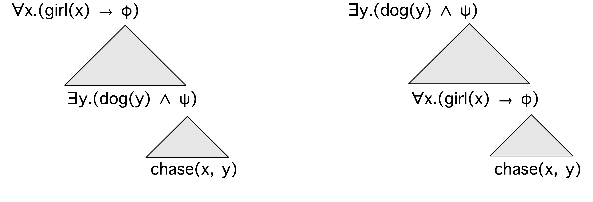
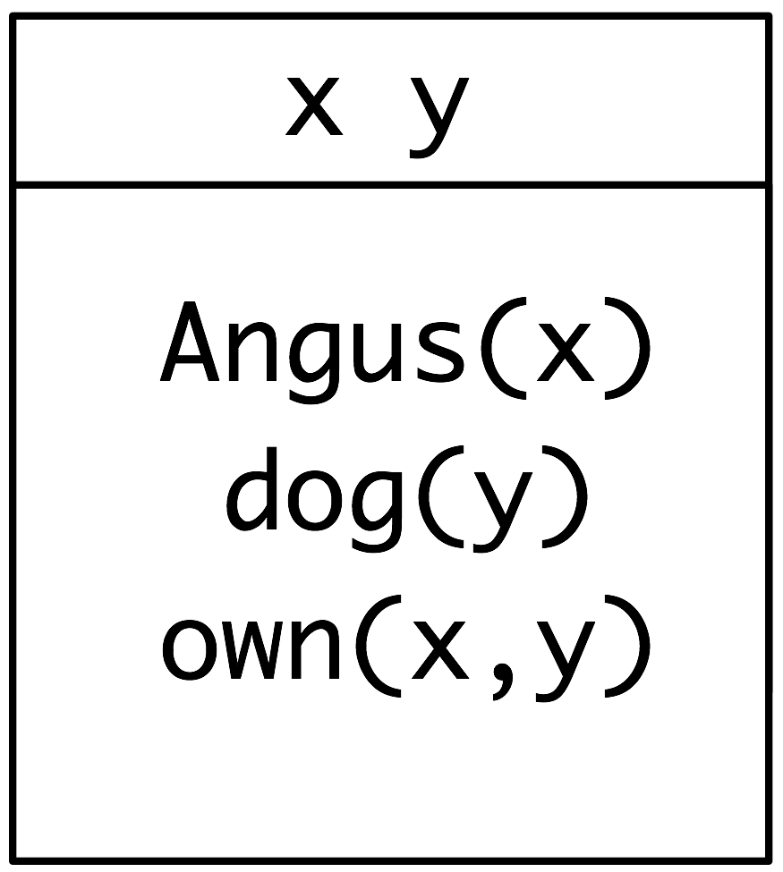

.. -*- mode: rst -*-
.. include:: ../definitions.rst

.. standard global imports

    >>> import nltk, re, pprint

.. TO-DO: relational algebra?

.. _chap-semantics:

======================================
10. Analyzing the Meaning of Sentences
======================================

We have seen how useful it is to harness the power of a computer to
process text on a large scale.  However, there are some significant
challenges at the other end of the spectrum.  Now that we have the
machinery of parsers and feature based grammars, we are ready to
apply these to analyze the meaning of sentences.
The goal of this chapter is to answer the following questions:

#. How can we represent natural language meaning so that a computer
   can do useful things with these representations?
#. How can we associate meaning representations with an
   unlimited set of sentences?
#. How can we use programs that process meaning representations to
   query and update stores of knowledge?

Along the way we will learn some formal techniques in the field of logical semantics,
and see how these can be used for interrogating databases that store facts
about the world. 

.. _sec-nlu-introduction:

------------------------------
Natural Language Understanding
------------------------------

Querying a Database
-------------------

There are a variety of tasks that a computer could perform which appear
to require some degree of natural language understanding.  For instance,
suppose we type in a question and the computer responds with a suitable
answer:

.. _ex-dbq0:
.. ex::
   .. _ex-dbq01:
   .. ex:: Which country is Athens in?
   .. _ex-dbq02:
   .. ex:: Greece.

Building software that allows this task to be carried out in a general
way is extremely hard, but solving it for a particular subdomain is
easy. We start off by assuming that we have data about cities and
countries in a structured form. To be concrete, we will use a database
table whose first few rows are shown in Table cities_.

.. Note:: The data illustrated in Table cities_ is drawn from the Chat-80 system
   described by [Warren1982EEA]_.  Population figures are given in thousands,
   but note that the data used in these examples dates back at least
   to the 1980s, and was already somewhat out of date at the point
   when [Warren1982EEA]_ was published.

.. table:: cities

    ============  ==============  ===========
    City          Country         Population
    ============  ==============  ===========
    athens        greece          1368
    bangkok       thailand        1178
    barcelona     spain	          1280
    berlin        east_germany    3481
    birmingham    united_kingdom  1112
    ============  ==============  ===========

    ``city_table``: A table of cities, countries and populations

The obvious way to retrieve answers from this tabular data involves
writing queries in a database query language such as SQL. 

.. Note::
     SQL (Structured Query Language) is a language designed for
     retrieving and managing data in relational databases.
     If you want to find out more about SQL,
     `<http://www.w3schools.com/sql/>`_ is a convenient online
     reference.

For example, executing the query ex-dbq1_ will pull out the value ``'greece'``:
  
.. _ex-dbq1:
.. ex::
   SELECT Country FROM city_table WHERE City = 'athens'

This specifies a result set consisting of all values for the column
``Country`` in data rows where the value of the ``City`` column is
``'athens'``.

How can we get the same effect using English as our input to the query
system? The feature-based grammar formalism described in
Chapter chap-featgram_ makes it easy to translate from
English to SQL. The grammar ``sql0.fcfg`` illustrates how to assemble
a meaning representation for a sentence in tandem with parsing the
sentence. Each phrase structure rule is supplemented with a recipe for
constructing a value for the feature ``sem``. You can see that these
recipes are extremely simple; in each case, we use the string
concatenation operation ``+`` (see Chapter chap-featgram_ [NB give section]) to splice
the values for the daughter constituents to make a value for the
mother constituent.
  
    >>> nltk.data.show_cfg('grammars/book_grammars/sql0.fcfg')
    % start S
    S[sem=(?np + WHERE + ?vp)] -> NP[sem=?np] VP[sem=?vp]
    VP[sem=(?v + ?pp)] -> IV[sem=?v] PP[sem=?pp]
    VP[sem=(?v + ?ap)] -> IV[sem=?v] AP[sem=?ap]
    NP[sem=(?det + ?n)] -> Det[sem=?det] N[sem=?n]
    PP[sem=(?p + ?np)] -> P[sem=?p] NP[sem=?np]
    AP[sem=?pp] -> A[sem=?a] PP[sem=?pp]
    NP[sem='Country="greece"'] -> 'Greece'
    NP[sem='Country="china"'] -> 'China'
    Det[sem='SELECT'] -> 'Which' | 'What'
    N[sem='City FROM city_table'] -> 'cities'
    IV[sem=''] -> 'are'
    A -> 'located'
    P[sem=''] -> 'in'

This allows us to parse a query into SQL.
  
    >>> from nltk.parse import load_earley
    >>> from string import join
    >>> cp = load_earley('grammars/book_grammars/sql0.fcfg')
    >>> query = 'What cities are located in China'
    >>> trees = cp.nbest_parse(query.split())
    >>> answer = trees[0].node['sem']
    >>> q = join(answer)
    >>> print q
    SELECT City FROM city_table WHERE Country="china"

.. note:: |TRY|
   Run the parser with maximum tracing on, i.e.,
   ``cp = load_earley('grammars/book_grammars/sql0.fcfg', trace=3)``, and examine
   how the values of ``sem`` are built up as complete edges are added
   to the chart.

Finally, we execute the query over the database ``city.db`` and
retrieve some results.

    >>> from nltk.sem import chat80
    >>> rows = chat80.sql_query('corpora/city_database/city.db', q)
    >>> for r in rows: print "%s" % r,
    canton chungking dairen harbin kowloon mukden peking shanghai sian tientsin

To summarize, we have constructed a task that involves the computer returning useful data
in response to a natural language query, and we implemented this
by translating a small subset of English into SQL. We can say that
that our software already "understands" SQL, in the sense of being
able to execute SQL queries against a database, and as a result it also undertands
queries such as `What cities are located in China`:lx:. This parallels
being able to translate from German into English as an example of
natural language understanding.
Suppose that you are a native speaker of English, and have started to
learn German. Your teacher asks if you understand what ex-sem1_ means:

.. _ex-sem1:
.. ex::
   Die Kamera gef\ |aumlaut|\ llt Stefan. 

If you know the meanings of the individual words in ex-sem1_, and know
how these meanings are combined to make up the meaning of the whole
sentence, you might say that ex-sem1_ means the same as ex-sem21_, or
more idiomatically, ex-sem22_:

.. _ex-sem2:
.. ex::
   .. _ex-sem21:
   .. ex::
      The camera pleases Stefan.

   .. _ex-sem22:
   .. ex::
      Stefan likes the camera.
   
An observer |mdash| let's call her Olga |mdash| might well take
this as evidence that you do grasp the meaning of ex-sem1_. But this
would depend on Olga herself understanding English. If she doesn't,
then your translation from German to English is not going to convince
her of your ability to understand German. We will return to this issue shortly.

The grammar ``sql0.fcfg``, together with the NLTK Earley parser, is
instrumental in carrying out the translation from English to SQL. How adequate is this
grammar? You saw that the SQL translation for the whole sentence was
built up from the translations of the parts. However, it is not clear
what to make of these parts. Although we could break down the
procedure of querying a database into a sequence of steps, there is no 
apparent correspondence between these steps and the fragments of SQL
that are associated with the syntactic components of the
sentence. Similarly, if we look at the way the structure of the
phrase `Which cities`:lx:, the determiner and noun correspond
respectively to ``SELECT`` and ``City FROM city_table``, neither of
which have a well-defined meaning in isolation from the other.

There is another criticism we can level at the grammar: we have
"hard-wired" an embarrassing amount of detail about the database into
it.  We need to know the name of the relevant table (e.g.,
``city_table``) and the names of the fields. But our database could
have contained exactly the same rows of data yet used a different
table name and different field names, in which case the SQL queries
would not be executable. Equally, we could have stored our data in a
different format, such as XML, in which case retrieving the same
results would require us to translate our English queries into an XML
query language rather than SQL. These considerations suggest that we
should be translating English into something that is more abstract and
generic than SQL.

In order to sharpen the point, let's consider another English query
and its translation:

.. _ex-dbq2:
.. ex::
   .. _ex-dbq21:
   .. ex:: What	cities are in China and have populations above 1,000,000?
   .. _ex-dbq22:
   .. ex:: SELECT City FROM city_table WHERE Country = 'china' AND
           Population > 1000

.. note:: |TRY|
   Extend the grammar ``sql0.fcfg`` so that it will translate
   ex-dbq21_ into ex-dbq22_, and check the values returned by
   the query. 

   You will probably find it easiest to first extend the grammar to
   handle queries like `What cities have populations above
   1,000,000`:lx: before tackling conjunction. After you have had a go
   at this task, you can compare your solution to ``grammars/book_grammars/sql1.fcfg`` in
   the NLTK data distribution.

Observe that the `and`:lx: conjunction in ex-dbq21_ is translated
into an ``AND`` in the SQL counterpart, ex-dbq22_. The latter tells us
to select results from rows where two conditions are true
together: the value of the ``Country`` column is ``'china'`` and the
value of the ``Population`` column is greater than 1000.

This interpretation for `and`:lx: involves a new idea: it talks about
`what is true in some particular situation`:em:. Although  we
haven't exhausted the meaning of `and`:lx: in English, we have given
it a meaning which is independent of any query language. In fact, we
have given it the standard interpretation from classical logic. In the
following sections, we will explore an approach in which sentences of
natural language are translated into logic instead of an executable
query language. One advantage is that logical formalisms are more
abstract and therefore more generic. If we wanted to, once we had our
translation into logic, we could then translate it further into a
task-specific query language. In fact, most serious attempts to query
databases via natural language have adopted this methodology;

Natural Language, Semantics and Logic
-------------------------------------

We started out trying to capture the meaning of ex-dbq01_ by
translating it into a query in another language, SQL, which the
computer could interpret and execute. But this still begged the
question whether the translation was correct. Stepping back from
database query, we noted that the meaning of `and`:lx: seems to depend
on being able to specify when statements are true or not in a
particular situation. Instead of translating a
sentence *S* from one language to another, we try to say what *S* is
`about`:em: by relating it to a situation in the world. Let's pursue
this further. Imagine there is a situation *s* where there are two
entities, Stefan and a specific camera, say Agfa Isola Serial
No. KX7750. In addition, there is a relation holding between the two
entities, which we will call the *please* relation. If you understand
the meaning of ex-sem1_, then you know that it is true in situation
*s*. In part, you know this because you know that `Die Kamera`:lx:
refers to Agfa Isola Serial No. KX7750, `Stefan`:lx: refers to Stefan,
and `gefällt`:lx: refers to the *please* relation. You
also know that the entity designated by the grammatical subject of
`gefällt`:lx: is the stimulus of *please*, while the
entity corresponding to the grammatical object plays the role of the
experiencer.

We have introduced two
fundamental notions in semantics. The
first is that declarative sentences are `true or false in certain situations`:em:. 
The second is that definite noun phrases and proper nouns `refer to things
in the world`:em:. So ex-sem1_
is true in a situation where Stefan likes the camera in question,
here illustrated in in Figure fig-stefan-and-camera_.

.. _fig-stefan-and-camera:
.. figure:: ../images/stefan_and_camera_with_arrows.png
   :scale: 20:100:20

Once we have adopted the notion of truth in a situation, we have a
powerful tool for reasoning.  In particular, we can look at 
sets of sentences, and ask whether they could be true together in some
situation. For example, the sentences in ex-cons1_ can be both true,
while those in ex-cons2_ and  ex-cons3_ cannot be. In other words, the sentences in
ex-cons1_ are `consistent`:dt:, while those in ex-cons2_ and ex-cons3_ are
`inconsistent`:dt:.

.. _ex-cons1:
.. ex::
   .. _ex-cons11:
   .. ex:: Sylvania is to the north of Freedonia.
   .. _ex-cons12:
   .. ex:: Freedonia is a republic.

.. _ex-cons2:
.. ex::
   .. _ex-cons21:
   .. ex:: The capital of Freedonia has a population of 9,000.
   .. _ex-cons22:
   .. ex:: No city in Freedonia has a population of 9,000.

.. _ex-cons3:
.. ex::
   .. _ex-cons31:
   .. ex:: Sylvania is to the north of Freedonia.
   .. _ex-cons32:
   .. ex:: Freedonia is to the north of Sylvania.

We have chosen sentences about fictional countries (featured in the
Marx Brothers' 1933 movie *Duck Soup*) to emphasize that your ability
to reason about these examples does `not`:em: depend on what is true
or false in the actual world. If you know the meaning of `no`:lx:, and
that the capital of a country is a city in that country, then you
should be able to conclude that the two sentences in ex-cons2_ are
inconsistent, regardless of where Freedonia is or what the population
of its capital is. That is, there's no possible situation in which
both sentences could be true. Similarly, if you know that the relation
expressed by `to the north of`:lx: is asymmetric, then you should be
able to conclude that the two sentences in ex-cons3_ are inconsistent.

Broadly speaking, logic-based approaches to natural language semantics
focus on those aspects of natural language which guide our
judgments of consistency and inconsistency. The syntax of a logical
language is designed to make these features formally explicit. As a
result, determining properties like consistency can often be reduced
to symbolic manipulation, that is, to a task that can be carried out
by a computer.

A `model`:dt: for a set *W* of sentences is a formal
representation of a situation in which all the sentences in *W*
are true. Standardly, models are represented in set theory. The domain
*D* of discourse (all the entities we currently care about) is a set of
individuals, while properties and relations are usually treated as
sets built up from *D*. Let's look at a concrete example. Our domain
*D* will consist of three
children, Stefan, Klaus and Evi, represented respectively as ``s``,
``k`` and ``e``. We write this as *D* = ``{s, k, e}``. The property `boy`:math: is the
set consisting of Stefan and Klaus, the property `girl`:math: is the
set consisting of Evi, and the property `is running`:math: is the
set consisting of Stefan and Evi. fig-model-kids_ is a graphical
rendering of the model.

.. _fig-model-kids:
.. figure:: ../images/model_kids.png
   :scale: 10

   A picture of a model

.. SB: I found this transition slightly abrupt.

Let's try to put this discussion into a broader perspective. Can a
computer understand the meaning of a sentence? And how could we tell
if it did?  This is similar to asking 'Can a computer think?' Alan
Turing [Turing1950CMI]_ famously proposed to answer this by examining
the ability of a computer to hold sensible conversations with a
human. Suppose you are having a chat session with a person and a
computer, but you are not told at the outset which is which. If you
cannot identify which of your partners is the computer after chatting
to each of them, then the computer has successfully imitated a
human. If a computer succeeds in passing itself off as human in this
'imitation game', then according to Turing, we should be prepared to
say that the computer `can`:em: think and can be said to be
intelligent. So Turing sidestepped the question of somehow examining
the internal states of a computer by instead using its `behaviour`:em:
as evidence of intelligence. By the same reasoning, we have assumed 
that in order to say that a computer understands English, it just
needs to behave as though it did.  What is important here is not so
much the specifics of Turing's imitation game, but rather the proposal
to judge a capacity for natural language understanding in terms of
observable behaviour on the part of the computer. 

-------------------
Propositional Logic
-------------------

A logical language is designed to capture aspects of natural language
which contribute to determining
whether a set of sentences is consistent. This in turn requires that a logical
representation of a sentence `S`:math: helps make the
`truth-conditions`:dt: of a `S`:math: explicit.

.. _ex-proplog1:
.. ex::
   .. _ex-proplog11:
   .. ex::
      [Shanghai is to the north of Guangzhou] and 
      [the urban population of Shanghai is 15.5 million].
      
   .. _ex-proplog12:
   .. ex::
      [Klaus chased Evi] and [Evi ran away].

If we temporarily ignore the internal details of the sentences
enclosed by square brackets, then both of them have the same
structure:

.. _ex-proplog2:
.. ex:: `P`:math: `and`:lx: `Q`:math:

We will sometimes say that ex-proplog2_ is the `logical form`:dt: of
sentences like ex-proplog1_. We can state the truth-conditions for
ex-proplog2_ along the following lines:

.. _ex-proplog3:
.. ex:: A sentence of the form '`P`:math: `and`:lx: `Q`:math:' is true
        in a situation `s`:math: if `P`:math: is true in `s`:math: and
	`Q`:math: is true in `s`:math:.

The inconsistency of ex-cons3_ arises from the
asymmetry of the relation `x is to the north of y`:lx: (where
`x`:math: and `y`:math: are place-holders for noun
phrases). Informally, we can state the following rule:

    if `x`:math: is to the north of `y`:math: then `y`:math: is not to the north of
    `x`:math:.

In propositional logic, negation expressions such as `not`:lx: are
treated as sentence operators. That is, the logical form of
ex-proplog51_ is something like ex-proplog52_.

.. _ex-proplog5:
.. ex::
   .. _ex-proplog51:
   .. ex::
      Sylvania is not to the north of Freedonia.
      
   .. _ex-proplog52:
   .. ex::
      It is not the case that [Sylvania is to the north of Freedonia].

A more succinct version of ex-proplog52_ is |neg|\ `P`:math:, where |neg|
symbolizes `it is not the case that`:lx:.  A sentence of the form '|neg|\ `P`:math:' is true
in a situation `s`:math: if `P`:math: is not true in
`s`:math:. Consequently, we can make the following argument.

.. ex-proplog82_ from ex-proplog81_:

.. _ex-proplog8:
.. ex::
      [Freedonia is to the north of Sylvania].
      
      Therefore, |neg| [Sylvania is to the north of Freedonia].

So the two sentences in ex-cons3_ can be augmented to the following
set:

.. _ex-proplog9:
.. ex::
   [Sylvania is to the north of Freedonia]

   [Freedonia is to the north of Sylvania]

   |neg| [Sylvania is to the north of Freedonia]

Thus, the set in ex-proplog9_ contains a pair of sentences whose
logical forms
are `P`:math: and |neg|\ `P`:math:. But a fundamental assumption of
classical logic is that a sentence cannot be both true and false in a
situation. Any set of sentences which contains both `P`:math: and
|neg|\ `P`:math: is inconsistent. In this way, we can see how reducing
sentences to their logical forms allows us to determine inconsistency.

.. SB: Note that Restall's new logic textbook uses & not wedge for conjunction
   I'd be happy to use the NLTK syntax everywhere, instead of having two
   syntaxes, for the benefit of newcomers who will find syntax an obstacle

`Propositional logic`:dt: is a formal
system for systematically representing just those parts of linguistic
structure which correspond to certain sentential conjunctions such as
`and`:lx:, `or`:lx: and `if..., then...`:lx:. In the formalization of
propositional logic, the counterparts of such conjunctions are
sometimes called `boolean operators`:dt:.  The basic expressions of
propositional logic are `propositional symbols`:dt:, which we shall
continue to write as `P`:math:, `Q`:math:, `R`:math:, etc.  There are
varying conventions for representing boolean operators. Here's one
choice: a unary operator |neg| (`not`:lx:), and four binary operators
|wedge| (`and`:lx:), |vee| (`or`:lx:), |rarr| (`if..., then...`:lx:)
and |iff| (`if and only if`:lx:).  Then the set of `formulas`:dt: of
propositional logic can be defined as follows:

   i. Every propositional symbol is a formula.

   #. If |phi| is a formula, then so is |neg| |phi|.

   #. If |phi| and |psi| are formulas, then so are
      (|phi| |wedge| |psi|),
      (|phi| |vee| |psi|),
      (|phi| |rarr| |psi|) 
      (|phi| |iff| |psi|).

The module ``nltk.sem.logic`` allows us to parse formulas of
propositional logic. However, it only recognizes ASCII versions of the boolean operators: 

    >>> from nltk.sem import logic
    >>> logic.boolean_ops()
    negation       	-
    conjunction    	&
    disjunction    	|
    implication    	->
    equivalence    	<-> 

Within ``logic``, ``LogicParser()`` parses logical expressions into
various subclasses of ``Expression``:

    >>> lp = logic.LogicParser()
    >>> lp.parse('-(P & Q)')
    <NegatedExpression -(P & Q)>
    >>> lp.parse('P & Q')
    <AndExpression (P & Q)>
    >>> lp.parse('P | (R -> Q)')
    <OrExpression (P | (R -> Q))>
    >>> lp.parse('P <-> -- P')
    <IffExpression (P <-> --P)>

Recall that we interpret sentences of a logical language
relative to a model, which is a very simplified version of the
world. A model for propositional logic needs to assign the values
``True`` or ``False`` to every possible formula. We do this
inductively: first, every propositional symbol is assigned a value,
and then we compute the value of complex formulas by consulting the
meanings of the Boolean connectives and applying them to the values of
the formula's components. A ``Valuation`` is a mapping from basic
expressions of the logic to their values. Here's an example:

    >>> val = nltk.sem.Valuation([('P', True), ('Q', True), ('R', False)])

We initialize a ``Valuation`` with a list of pairs, each of which
consists of a semantic symbol and a semantic value. The resulting
object is essentially just a dictionary that maps logical expressions
(treated as strings) to appropriate values.

    >>> val['P']
    True

As we will see later, our models need to be somewhat more complicated
in order to handle the more complex logical forms discussed in the
next section; for the time being, just ignore the ``dom`` and
``g`` parameters in the following declarations.

    >>> dom = set([])
    >>> g = nltk.sem.Assignment(dom)

Now let's initialize a model ``m`` that uses ``val``:

    >>> m = nltk.sem.Model(dom, val)
    
Every instance of ``Model`` defines appropriate truth functions for the
boolean connectives; these can be invoked to show how input values are
mapped to output values. Here are the truth conditions for ``&`` and ``->``
(encoded via the functions ``AND()`` and ``IMPLIES()`` respectively):

    >>> ops = [m.AND, m.IMPLIES]
    >>> for o in ops:
    ...     print "==========="
    ...     print o.func_name
    ...     for first in [True, False]:
    ...         for second in [True, False]:
    ...             print "%-5s %-5s => %s" % (first, second, o(first, second))
    ===========
    AND
    True  True  => True
    True  False => False
    False True  => False
    False False => False
    ===========
    IMPLIES
    True  True  => True
    True  False => False
    False True  => True
    False False => True

If you reflect on the truth conditions of ``->``, you will see that it
departs in many cases from our usual intuitions about the conditional
in English. A formula of the form ``P -> Q`` is only false when ``P``
is true and ``Q`` is false. If ``P`` is false (say ``P`` corresponds
to `The moon is made of green cheese`:lx:) and ``Q`` is true (say
``Q`corresponds to `Two plus two equals four`:lx:) then ``P -> Q``
will come out true.

Every model comes with an ``evaluate()`` method, which will determine
the semantic value of logical expression, such as formulas of
propositional logic; of course, these values depend on the initial
truth values we assigned to propositional symbols such as ``'P'``,
``'Q'`` and ``'R'``.

    >>> print m.evaluate('(P & Q)', g)
    True
    >>> print m.evaluate('-(P & Q)', g)
    False
    >>> print m.evaluate('(P & R)', g)
    False
    >>> print m.evaluate('(P | R)', g)
    True

.. note:: |TRY| 
   Experiment with evaluating different formulas of
   propositional logic. Does the model give the values that you
   expected?

Up until now, we have treated the internal structure of sentences as
being opaque to logical analysis. However, if we are to formalize
arguments such as ex-proplog8_ in a way that allows us to compute with
them, we have to be able look inside clauses. This is what we turn to
in the next section.

-----------------
First-Order Logic
-----------------

Syntax
------

In |fol|, propositions are analyzed into predicates and
arguments, which takes us a step closer to the structure of natural
languages. The standard construction rules for |FOL| recognize
`terms`:dt: such as individual variables and individual constants, and
`predicates`:dt: which take differing numbers of arguments. For
example, `Angus walks`:lx: might be formalized as `walk(angus)`:mathit:
and `Angus sees Bertie`:lx: as `see(angus, bertie)`:mathit:. We will call
`walk`:mathit: a `unary predicate`:dt:, and `see`:mathit: a `binary
predicate`:dt:. The symbols used as predicates do not have intrinsic
meaning, although it is hard to remember this. Returning to one of our
earlier examples, there is no `logical`:em: difference between ex-predlog11_
and  ex-predlog12_.

.. _ex-predlog1:
.. ex::
   .. _ex-predlog11:
   .. ex::
      please(agfa_kx7750, stefan)
      
   .. _ex-predlog12:
   .. ex::
       gef\ |aumlaut|\ llen(agfa_kx7750, stefan)

By itself, |FOL| has nothing substantive to say about lexical
semantics |mdash| the meaning of individual words |mdash| although
some theories of lexical semantics can be encoded in |FOL|. Whether an
atomic predication like `see(angus, bertie)`:mathit: is true or false in
a situation is not a matter of logic, but depends on the particular
valuation that we have chosen for the constants `see`:mathit:,
`angus`:mathit: and `bertie`:mathit:. For this reason, such expressions
are called `non-logical constants`:dt:. By contrast, `logical
constants`:dt: (such as the boolean operators) always receive the same
interpretation in every model for |FOL|.

We should mention here that one binary predicate which has special
status, and that is equality, as in formulas such as `angus =
aj`:mathit:. Equality is regarded as a logical constant, since for
individual terms `t1`:math: and `t2`:math:, the formula `t1 = t2`:math: is
true if and only if `t1`:math: and `t2`:math: refer to one and the
same entity.

.. SB: Note that the angle brackets don't appear in the PDF output version

It is often helpful to inspect the syntactic structure of expressions
of |FOL|, and the usual way of doing this is to assign `types`:dt: to
expressions. Following the tradition of Montague grammar [refs], we
will use two `basic types`:dt:\: `e`:math: is the type of entities,
while  `t`:math: is the type of formulas, i.e., expressions which have
truth values. Given these two basic types, we can form `complex
types`:dt: for functors, i.e., expressions which denote
functions. That is, given any types |sigma| and |tau|, |langle|\ |sigma|,
|tau|\ |rangle| is a complex type corresponding to functions from
'|sigma| things' to '|tau| things'. For example, |langle|\ `e`:mathit:,
`t`:mathit:\ |rangle| is the type of expressions from entities to
truth values, namely unary predicates. The ``LogicParser`` can be
invoked so that it carries out type checking. 

    >>> tlp = logic.LogicParser(type_check=True)
    >>> parsed = tlp.parse('walk(angus)')
    >>> parsed.argument
    <ConstantExpression angus>
    >>> parsed.argument.type
    e
    >>> parsed.function
    <ConstantExpression walk>
    >>> parsed.function.type
    <e,t>

A binary predicate is given type |langle|\ `e`:mathit:, |langle|\
`e`:mathit:, `t`:mathit:\ |rangle|\ |rangle|, that is, the type of
something which combines with an argument of type `e`:mathit: to make
a unary predicate.

    >>> parsed = tlp.parse('see(a, b)')
    >>> parsed.function
    <ApplicationExpression see(a)>
    >>> parsed.function.type
    <e,t>
    >>> parsed.function.function
    <ConstantExpression see>
    >>> parsed.function.function.type
    <e,<e,t>>

In |FOL|, arguments of predicates can also be individual variables
such as `x`:math:, `y`:math: and `z`:math:. Individual variables are similar to
personal pronouns like `he`:lx:, `she`:lx: and `it`:lx:, in that we
need to know about the context of use in order to figure out their
denotation. 

One way of interpreting the pronoun in ex-predlog2_ is by
pointing to a relevant individual in the local context.

.. _ex-predlog2:
.. ex:: He disappeared.

Another way is to supply a textual antecedent for the pronoun
`he`:lx:, for example by uttering ex-predlog31_ prior to
ex-predlog2_. Here, we say that `she`:lx: is `coreferential`:dt: with
the noun phrase `Cyril`:lx:. As a result, ex-predlog2_ is semantically
equivalent to ex-predlog32_.

.. _ex-predlog3:
.. ex::
   .. _ex-predlog31:
   .. ex:: Cyril is Angus's dog.

   .. _ex-predlog32:
   .. ex:: Cyril disappeared.

Consider by contrast the occurrence of `she`:lx: in ex-predlog41_. In
this case, it is `bound`:dt: by the indefinite `NP`:gc: 
`a poodle`:lx:, 
and this is a different relationship than
coreference. If we replace the pronoun `she`:lx: by `a poodle`:lx:,
the result ex-predlog42_ is `not`:em: semantically equivalent to ex-predlog41_.

.. _ex-predlog4:
.. ex::
   .. _ex-predlog41:
   .. ex:: Angus had a dog but he disappeared.

   .. _ex-predlog42:
   .. ex:: Angus had a dog but a dog disappeared.

Corresponding to ex-predlog51_, we can construct an `open formula`:dt:
ex-predlog52_ with two occurrences of the variable `x`:math:. (We
ignore tense to simplify exposition.)

.. _ex-predlog5:
.. ex::
   .. _ex-predlog51:
   .. ex:: He is a dog and he disappeared.

   .. _ex-predlog52:
   .. ex:: `dog(x)`:mathit:  |wedge| `disappear(x)`:mathit: 

By placing an `existential quantifier`:dt: |exists|\ `x`:math: ('for
some `x`:math:') in front of ex-predlog52_, we can `bind`:dt: these
variables, as in ex-predlog61_, which means ex-predlog62_ or, more
idiomatically, ex-predlog63_.

.. _ex-predlog6:
.. ex::
   .. _ex-predlog61:
   .. ex:: |exists|\ `x.dog(x)`:mathit:  |wedge| `disappear(x)`:mathit: 

   .. _ex-predlog62:
   .. ex:: At least one entity is a dog and disappeared.

   .. _ex-predlog63:
   .. ex:: A dog disappeared.

The |NLTK| rendering of ex-predlog61_ is ex-exists_.

.. _ex-exists:
.. ex:: ``exists x.(dog(x) & disappear(x))``

If all variable occurrences in a formula are bound, the formula is
said to be `closed`:dt:. Any variables which are not bound in a formula
are `free`:dt: in that formula. 
We mentioned before that the ``parse()`` method of ``nltk.sem.logic``\ 's
``LogicParser`` returns objects of class ``Expression``, and each
instance ``expr`` of this class comes with a method ``free()`` which returns the set
of variables that are free in ``expr``.

    >>> print lp.parse('dog(cyril)').free()
    set([])
    >>> print lp.parse('dog(x)').free()
    set([Variable('x')])
    >>> print lp.parse('own(angus, cyril)').free()
    set([])
    >>> print lp.parse('exists x.dog(x)').free()
    set([])
    >>> print lp.parse(r'exists x.own(y, x)').free()
    set([Variable('y')])

In addition to the existential quantifier, |FOL| offers us the
`universal quantifier`:dt: |forall|\ `x`:math: ('for all
`x`:math:'), illustrated in ex-predlog7_.

.. _ex-predlog7:
.. ex::
   .. _ex-predlog71:
   .. ex:: |forall|\ `x.dog(x)`:mathit: |rarr| `disappear(x)`:mathit: 

   .. _ex-predlog72:
   .. ex:: Everything has the property that if it is a dog, it disappears.

   .. _ex-predlog73:
   .. ex:: Every dog disappeared.

The |NLTK| rendering of ex-predlog71_ is ex-forall_.

.. _ex-forall:
.. ex:: ``all x.(dog(x) -> disappear(x))``

One important property of ex-predlog71_ often trips people up. The
logical rendering in effect says that `if`:em: something is a dog, then
it runs away, but makes no commitment to the existence of dogs. So
in a situation where there are no dogs, ex-predlog71_ will still
come out true. (Remember that ``'(p implies q)'`` is true when ``'p'``
is false.) Now you might argue that ex-predlog71_ does presuppose the
existence of dogs, and that the logic formalization is wrong.  But it
is possible to find other examples which lack such a presupposition.
For instance, we might explain that the value of the Python expression
``re.sub('ate', '8', astring)`` is the result of replacing all
occurrences of ``'ate'`` in ``astring`` by ``'8'``, even though there
may in fact be no such occurrences.

In Section sec-computing-with-language-simple-statistics_, we pointed out that
mathematical set notation was a helpful method of specifying
properties `P`:math: of words that we wanted to select from a
document. We illustrated this with ex-set-comprehension-math2_, which we
glossed as "the set of all `w`:math: such that `w`:math: is an element
of `V`:math: (the vocabulary) and `w`:math: has property `P`:math:".

.. _ex-set-comprehension-math2:
.. ex:: {`w`:math: | `w`:math: |element| `V`:math: & `P(w)`:math:\ }

It turns out to be extremely useful to add something to |FOL| that
will achieve the same effect. We do this with the `λ
operator`:dt: |lambda|\ `x`:math:. The |lambda| counterpart to
ex-set-comprehension-math2_ is ex-lambda1_. (Since we are not trying
to do set-theory here, we just treat `V`:math: as a unary predicate.)

.. _ex-lambda1:
.. ex:: |lambda|\ `w`:math:. (`V(w)`:math: |wedge| `P(w)`:math:)

.. Note:: |lambda| expression were originally designed to represent
    computable functions and to provide a foundation for mathematics
    and logic. The theory in which |lambda| expressions are studied is
    known as the |lambda|-calculus.

|lambda| is a binding operator, just as the |FOL| quantifiers are. If
we have an open formula such as ex-walk-chewgum11_, then we can bind
the variable `x`:math: with the |lambda| operator, as shown in
ex-walk-chewgum12_.

.. _ex-walk-chewgum1:
.. ex::
   .. _ex-walk-chewgum11:
   .. ex:: (`walk(x)`:mathit: |wedge| `chew_gum(x)`:mathit:) 

   .. _ex-walk-chewgum12:
   .. ex:: |lambda|\ `x.(walk(x)`:mathit: |wedge| `chew_gum(x)`:mathit:)

ex-walk-chewgum12_ is represented in |NLTK| as 

.. _ex-lambda:
.. ex:: ``\x.(walk(x) & chew_gum(x))``

Actually, this is a slight oversimplification, since ``\`` also
happens to be a special character in Python. We could escape it
(with another ``\``), but in practice we will use raw strings, as
illustrated here:

    >>> e = lp.parse(r'\x.(walk(x) & chew_gum(x))')
    >>> e
    <LambdaExpression \x.(walk(x) & chew_gum(x))>
    >>> e.free()
    set([])
    >>> print lp.parse(r'\x.(walk(x) & chew_gum(y))')
    \x.(walk(x) & chew_gum(y))

We have a special name for the result of binding the variables in an
expression: `λ abstraction`:dt:. When one initially encounters
|lambda|-abstracts, it can be hard to get an intuitive sense of their
meaning. A couple of English glosses for ex-walk-chewgum12_ are: "be
an `x`:math: such that `x`:math: walks and `x`:math: chews gum" or
"have the property of walking and chewing gum". Within the tradition
of formal semantics of natural language, it has often been suggested
that |lambda|-abstracts are good representations for verb phrases (or
subjectless clauses), particularly when these occur as arguments in
their own right. This is illustrated in ex-walk-chewgum21_ and its
translation ex-walk-chewgum22_.

.. _ex-walk-chewgum2:
.. ex::
   .. _ex-walk-chewgum21:
   .. ex:: To walk and chew-gum is hard

   .. _ex-walk-chewgum22:
   .. ex:: ``hard(\x.(walk(x) & chew_gum(x))``

So the general picture is this: given an an open formula |phi| with
free variable `x`:math:, abstracting over `x`:math: yields a property
expression |lambda|\ `x.`:math:\ |phi| |mdash| the property of being
an `x`:math: such that |phi|. ex-walk-chewgum22_ illustrates a case
where we say something about a property, namely that it is hard. But
what we usually do with properties is attribute them to
individuals. And in fact if |phi| is an open formula, then the
abstract |lambda|\ `x.`:math:\ |phi| can be used as a unary
predicate. In ex-walk-chewgum3_, ex-walk-chewgum12_ is predicated of
the term `gerald`:mathit:.

.. _ex-walk-chewgum3:
.. ex:: ``\x.(walk(x) & chew_gum(x)) (gerald)``

Given the intended interpretation of ex-walk-chewgum3_, we would like
it to be semantically equivalent to ex-walk-chewgum4_.

.. _ex-walk-chewgum4:
.. ex:: ``(walk(gerald) & chew_gum(gerald))``

In fact, the equivalence of ex-walk-chewgum3_ and  ex-walk-chewgum4_
follows from one of the axioms of the |lambda| calculus, namely
`β-conversion`:dt:. 

The rule of |beta|-conversion:
    |lambda|\ `x.`:math: |alpha|\ (`t`:math:) = |alpha|\ [`t/x`:math:]

.. SB: here t is used as a term; elsewhere it is a type

This rule can be read as follows: if we apply a |lambda|\ -abstract
|lambda|\ `x.`:math:\ |alpha| to a term `t`:math: , the result is the same
as removing the |lambda|\ `x.`:math: operator and replacing all free
occurrences of `x`:math: in |alpha| by `t`:math:. (This second operation
is what is meant by the notation |alpha|\ [`t/x`:math:].) So, for
example, if we apply the rule of |beta|-conversion to
ex-walk-chewgum3_, we remove the initial '|lambda|\ `x.`:math:' from 
|lambda|\ `x.(walk(x)`:mathit: |wedge| `chew_gum(x)`:mathit:) and
then replace all free occurrences of `x`:math: in `((walk(x)`:mathit:
|wedge| `chew_gum(x)`:mathit:) by the term
`gerald`:mathit:. |beta|-conversion of expressions is invoked in the ``logic``
module with the ``simplify()`` method.

    >>> print lp.parse(r'\x.(walk(x) & chew_gum(x))(gerald)')
    \x.(walk(x) & chew_gum(x))(gerald)
    >>> print lp.parse(r'\x.(walk(x) & chew_gum(x))(gerald)').simplify()
    (walk(gerald) & chew_gum(gerald))    

Although we have so far only considered cases where the body of the
|lambda| abstract is an open formula, i.e., of type t, this is not a
necessary restriction; the body can be any well-formed
expression. Here's an example with two |lambda|\ s.

.. _ex-double-lambda:
.. ex::  ``\x.\y.(dog(x) & own(y, x))``

Just as ex-walk-chewgum12_ plays the role of a unary predicate,
ex-double-lambda_ works like a binary predicate: it can be applied to
two arguments. The ``LogicParser`` allows nested |lambda|\ s to be
written in abbreviated form, as illustrated in the second case below.

    >>> print lp.parse(r'\x.\y.(dog(x) & own(y, x))(cyril)').simplify()
    \y.(dog(cyril) & own(y,cyril))
    >>> print lp.parse(r'\x y.(dog(x) & own(y, x))(cyril, angus)').simplify()
    (dog(cyril) & own(angus,cyril))

Alphabetic Variants
-------------------

When carrying out |beta|-reduction, some care has to be taken with
variables. Consider, for example, the |lambda| terms alpha1a_ and
alpha1b_, which differ only in the identity of a free variable.

.. _alpha1:
.. ex::

   .. _alpha1a:
   .. ex:: ``\y.see(y, x)``

   .. _alpha1b:
   .. ex:: ``\y.see(y, z)``

Suppose now that we apply the |lambda|-term ``\P.exists x.P(x)`` to each of these terms:

.. _alpha2:
.. ex::

   .. _alpha2a:
   .. ex:: ``\P.exists x.P(x)(\y.see(y, x))``

   .. _alpha2b:
   .. ex:: ``\P.exists x.P(x)(\y.see(y, z))``

In principle, the results of the application should be semantically
equivalent.
But if we let the free variable ``x`` in alpha1a_ be 'captured' by the
existential quantifier in alpha2a_, then after reduction, the results
will be different:

.. _alpha3:
.. ex::

   .. _alpha3a:
   .. ex:: ``exists x.see(x, x)``

   .. _alpha3b:
   .. ex:: ``exists x.see(x, z)``

alpha3a_ means there is some ``x`` that sees him/herself, whereas
alpha3b_ means that there is some ``x`` that sees an unspecified
individual ``z``. What has gone wrong here? Clearly, we want to forbid
the kind of variable capture shown in alpha3a_, and it seems that we
have been too literal about the label of the particular variable bound
by the existential quantifier in the functor expression of alpha2a_.
In fact, given any variable-binding expression (involving |forall|,
|exists| or |lambda|), the particular name chosen for the bound
variable is completely arbitrary. For example, ``exists x.P(x)`` and
``exists y.P(y)`` are equivalent; they are called `α equivalents`:dt:
(or `alphabetic variants`:dt:). The process of relabeling bound
variables is known as `α-conversion`:dt:. When we test for equality of
``VariableBinderExpression``\s in the ``logic`` module (i.e., using
``==``), we are in fact testing for |alpha|-equivalence:

     >>> e1 = lp.parse('exists x.P(x)')
     >>> print e1
     exists x.P(x)
     >>> e2 = e1.alpha_convert(nltk.sem.Variable('z'))
     >>> print e2
     exists z.P(z)
     >>> e1 == e2
     True

When |beta|-reduction is carried out on an application
``f(a)``, we check whether there are free variables in ``a``
which also occur as bound variables in any subterms of
``f``. Suppose, as in the example discussed above, that
``x`` is free in ``a``, and that ``f`` contains the
subterm ``exists x.P(x)``. In this case, we
produce an alphabetic variant of ``exists x.P(x)``, 
say, ``exists z1.P(z1)``, and then
carry on with the reduction. This relabeling is carried out
automatically by the |beta|\ -reduction code in ``logic``, and the
results can be seen in the following example.

     >>> e3 = lp.parse('\P.exists x.P(x)(\y.see(y, x))')
     >>> print e3
     (\P.exists x.P(x))(\y.see(y,x))
     >>> print e3.simplify()
     exists z1.see(z1,x)

Summary
-------

We'll take this opportunity to restate our earlier syntactic rules for
propositional logic and add the formation rules for quantifiers. In
addition, we make explicit the types of the expressions
involved. We'll adopt the convention that 
|langle|\ `e`:mathit:\ :sup:`n`, `t`:mathit:\ |rangle| 
is the type of a predicate which combines with `n`:mathit: arguments
of type `e`:mathit: to yield an expression
of type `t`:mathit:. In this case, we say that `n`:mathit: is the
`arity`:dt: of the predicate.

   i. If `P`:math: is a predicate of type |langle|\ `e`:mathit:\ :sup:`n`,
      `t`:mathit:\ |rangle|,
      and `t`:mathit:\ :sub:`1`, ... `t`:mathit:\ :sub:`n`
      are terms of type `e`:mathit:, then
      `P`:math:\ (`t`:mathit:\ :sub:`1`, ... `t`:mathit:\ :sub:`n`) is
      of type `t`:mathit:.

   ii. If |phi| is of type `t`:mathit:, then so is |neg|\ |phi|.

   #.  If |phi| and |psi| are of type `t`:mathit:, then so are
       (|phi| |wedge| |psi|),
       (|phi| |vee| |psi|),
       (|phi| |rarr| |psi|) and
       (|phi| |iff| |psi|).

   #. If |phi| is of type `t`:mathit:, and `x`:math: is a variable of type `e`:mathit:, then
      |exists|\ `x.`:math:\ |phi| and  |forall|\ `x.`:math:\ |phi| are of
      type `t`:mathit:.

   #. If |alpha| is of type |tau|, and `x`:math: is a variable of type e, then
      |lambda|\ `x.`:math:\ |alpha| is of type |langle|\ `e`:mathit:, |tau|\ |rangle|.

Table nltk_logic_ summarizes the logical constants of the ``logic``
module, and two of the methods of ``Expression``\ s.

.. table:: nltk_logic

    +---------------+-------------------------------------+
    | Example       |Description                          |
    +===============+=====================================+
    |     ``-``     |negation                             |
    +---------------+-------------------------------------+
    |    ``&``      |conjunction                          |
    +---------------+-------------------------------------+
    |    ``|``      |disjunction                          |
    +---------------+-------------------------------------+
    |    ``->``     |implication                          |
    +---------------+-------------------------------------+
    |    ``<->``    |equivalence                          |
    +---------------+-------------------------------------+
    |    ``=``      |equality                             |
    +---------------+-------------------------------------+
    |    ``!=``     |inequality                           |
    +---------------+-------------------------------------+
    |    ``exists`` |existential quantifier               |
    +---------------+-------------------------------------+
    |    ``all``    |universal quantifier                 |
    +---------------+-------------------------------------+
    |     ``\``     |lambda operator                      |
    +---------------+-------------------------------------+
    | ``e.free()``  |show free variables of ``e``         |
    +---------------+-------------------------------------+
    | ``e.simplify``|carry out |beta|-conversion on ``e`` |
    +---------------+-------------------------------------+
			

Model-checking
--------------

We have looked at the syntax of |FOL|, and in Section
sec-evaluating-english-sentences_ we will examine the task of
translating English into |FOL|. Yet as we argued in Section
sec-nlu-introduction_, this only gets us further forward if
we can give a meaning to sentences of |FOL|. In other words, we need
to give a `truth-conditional semantics`:em: to |FOL|.
From the point of view of computational semantics, there are obvious
limits in how far one can push this approach. Although we want to talk
about sentences being true or false in situations, we only have the
means of representing situations in the computer in a symbolic
manner. Despite this limitation, it is still possible to gain a
clearer picture of truth-conditional semantics by encoding models in
|NLTK|. 

Given a |fol| language `L`:math:, a model `M`:math: for `L`:math: is a
pair |langle|\ `D`:math:, `Val`:math:\ |rangle|, where `D`:math: is an
nonempty set called the `domain`:dt: of the model, and `Val`:math: is
a function called the `valuation function`:dt: which assigns values
from `D`:math: to expressions of `L`:math: as follows:

    i. For every individual constant `c`:math: in `L`:math:,
       `Val(c)`:math: is an element of  `D`:math:.

    #. For every predicate symbol `P`:math: of arity `n`:math: |geq| 0,
       `Val(P)`:math: is a function from  `D`:math:\ :sup:`n` to
       {`True`:mathit:, `False`:mathit:}. (If the rank of  `P`:math:
       is 0, then `Val(P)`:math: is simply a truth value, the
       `P`:math: is regarded as a propositional symbol.)

According to (2), if `P`:math: is of arity `n`:math:, then `Val(P)`:math:
will be a function `f`:math: from pairs of elements of  `D`:math: to
{`True`:mathit:, `False`:mathit:}. In the models we shall build in
|NLTK|, we'll adopt a more convenient alternative, in which
`Val(P)`:math: is a set `S`:math: of pairs, defined as follows:

.. ex::  `S`:math: = {`s`:math: | `f(s)`:math: = `True`:mathit:\ }

Such an `f`:math: is called the `characteristic function`:dt: of `S`:math:
(as discussed further in Appendex app-sets_).

Relations are represented semantically in |NLTK| in the standard
set-theoretic way: as sets of tuples. For example, let's suppose we
have a domain of discourse consisting of the individuals Bertie, Olive and Cyril,
where Bertie is a boy, Olive is a girl and Cyril is a dog. For mnemonic
reasons, we use ``b``, ``o`` and ``c`` as the corresponding labels
in the model. We can declare the domain as follows:

    >>> dom = set(['b', 'o', 'c'])

We will use the utility function ``parse_valuation()`` to convert a
list of strings of the form `symbol`:mathit: ``=>`` `value`:mathit:
into a ``Valuation`` object.

    >>> from nltk.sem import parse_valuation
    >>> v = """
    ... bertie => b
    ... olive => o
    ... cyril => c
    ... boy => {b}
    ... girl => {o}
    ... dog => {c}
    ... walk => {o, c}
    ... see => {(b, o), (c, b), (o, c)}
    ... """
    >>> val = parse_valuation(v)
    >>> print val
    {'bertie': 'b',
     'boy': set([('b',)]),
     'cyril': 'c',
     'dog': set([('c',)]),
     'girl': set([('o',)]),
     'olive': 'o',
     'see': set([('o', 'c'), ('c', 'b'), ('b', 'o')]),
     'walk': set([('c',), ('o',)])}

So according to this valuation, the value of ``see`` is a set of
tuples such that Bertie sees Olive, Cyril sees Bertie, and
Olive sees Cyril.

.. note:: |TRY|
   Draw a picture of the domain of ``m`` and the sets corresponding to
   each of the unary predicates, by analogy with the diagram shown in
   fig-model-kids_. 

You may have noticed that our unary predicates (i.e, ``boy``, ``girl``,
``dog``) also come out as sets of singleton tuples, rather
than just sets of individuals. This is a convenience which allows us
to have a uniform treatment of relations of any arity. A predication
of the form `P`:math:\ (|tau|\ :sub:`1`,  ... |tau|\ :sub:`n`), where
`P`:math: is of arity `n`:math:, comes out true just in case the
tuple of values corresponding to (|tau|\ :sub:`1`,  ... |tau|\
:sub:`n`) belongs to the set of tuples in the value of  `P`:math:.

    >>> ('c', 'b') in val['see']
    True
    >>> ('b',) in val['boy']
    True

Individual Variables and Assignments
------------------------------------

In our models, the counterpart of a context of use is a variable
`Assignment`:dt:. This is a mapping from individual variables to
entities in the domain.  Assignments are created using the
``Assignment`` constructor, which also takes the model's domain of
discourse as a parameter. We are not required to actually enter any
bindings, but if we do, they are in a (`variable`:mathit:,
`value`:mathit:) format similar to what we saw earlier for valuations.

    >>> g = nltk.sem.Assignment(dom, [('x', 'o'), ('y', 'c')])
    >>> g
    {'y': 'c', 'x': 'o'}

In addition, there is a ``print()`` format for assignments which
uses a notation closer to that often found in logic textbooks:

    >>> print g
    g[c/y][o/x]

Let's now look at how we can evaluate an atomic formula of
|FOL|. First, we create a model, then we use the ``evaluate()`` method
to compute the truth value.

    >>> m = nltk.sem.Model(dom, val)
    >>> m.evaluate('see(olive, y)', g)
    True

What's happening here? Essentially, we are evaluating the formula
``see('o', 'c')`` just as in our earlier example.
However, when the interpretation function encounters the variable ``'y'``,
rather than checking for a value in ``val``, it asks the variable
assignment ``g`` to come up with a value:
    
    >>> g['y']
    'c'

Since we already know that ``'o'`` and ``'c'`` stand in the `see`:mathit:
relation, the value ``True`` is what we expected. In this case, we can
say that assignment ``g`` `satisfies`:dt: the formula ``'see(olive, y)'``.
By contrast, the following formula evaluates to ``False`` relative to
``g`` |mdash| check that you see why this is.
    
    >>> m.evaluate('see(y, x)', g)
    False

In our approach (though not in standard |fol|), variable assignments
are `partial`:em:. For example, ``g`` says nothing about any variables
apart from ``'x'`` and ``'y'``. The method ``purge()`` clears all
bindings from an assignment.

    >>> g.purge()
    >>> g
    {}

If we now try to evaluate a formula such as ``'see(olive, y)'`` relative to
``g``, it is like trying to interpret a sentence containing a `him`:lx: when
we don't know what `him`:lx: refers to. In this case, the evaluation function
fails to deliver a truth value.

    >>> m.evaluate('see(olive, y)', g)
    'Undefined'

Quantification and Scope
------------------------

One of the crucial insights of modern
logic is that the notion of variable satisfaction can be used to
provide an interpretation to quantified formulas. Let's 
use exists1_ as an example.

.. _exists1:
   .. ex:: ``exists x.(girl(x) & walk(x))``

When is it true? Let's think about all the individuals in our domain,
i.e., in ``dom``. We want to check whether any of these individuals
have the property of being a girl and walking. In other words, we want
to know if there is some ``u`` in ``dom`` such that ``g[u/x]``
satisfies the open formula exists2_.

.. _exists2:
.. ex:: ``girl(x) & walk(x)``

Consider the following:

    >>> m.evaluate('exists x.(girl(x) & walk(x))', g)
    True

``evaluate()`` returns ``True`` here because there is some ``u`` in
``dom`` such that exists2_ is satisfied by an assigment which binds
``'x'`` to ``u``. In fact, ``'o'`` is such a ``u``:

    >>> m.evaluate('girl(x) & walk(x)', g.add('x', 'o'))
    True

One useful tool offered by NLTK is the ``satisfiers()`` method. This
returns a set of all the individuals that satisfy an open formula. The
method parameters are a parsed formula, a variable, and an
assignment. Here are a few examples:

    >>> fmla1 = lp.parse('girl(x) | boy(x)')
    >>> m.satisfiers(fmla1, 'x', g)
    set(['b', 'o'])
    >>> fmla2 = lp.parse('girl(x) -> walk(x)')
    >>> m.satisfiers(fmla2, 'x', g)
    set(['c', 'b', 'o'])
    >>> fmla3 = lp.parse('walk(x) -> girl(x)')
    >>> m.satisfiers(fmla3, 'x', g)
    set(['b', 'o'])

It's useful to think about why ``fmla2`` and ``fmla3`` receive the
values they do. The truth conditions for ``->`` mean that 
``fmla2`` is equivalent to ``-girl(x) | walk(x)``, which  is satisfied
by something which either isn't a girl 
or walks. Since neither ``b`` (Bertie) nor ``c`` (Cyril)
are girls, according to model ``m``, they both satisfy 
the whole formula. And of course ``'o'`` satisfies the formula because ``'o'``
satisfies both disjuncts. Now, since every member of the domain of
discourse satisfies ``fmla2``, the corresponding universally
quantified formula is also true.

    >>> m.evaluate('all x.(girl(x) -> walk(x))', g)
    True

In other words, a universally quantified formula |forall|\
`x.`:mathit:\ |phi| is true with respect to ``g`` just in case for
every ``u``, |phi| is true with respect to ``g[u/x]``. 

.. note:: |TRY|
   Try to figure out, first with pencil and paper, and then using
   ``m.evaluate()``, what the truth values are for ``'all x.(girl(x) &
   walk(x))'`` and ``'exists x.(boy(x) -> walk(x))'``. Make sure you
   understand why they receive these values.
 
  

Quantifier Scope Ambiguity
--------------------------

What happens when we want to give a formal representation of a
sentence with *two* quantifiers, such as the following?

.. _scope1:
.. ex:: Everybody admires someone.

There are (at least) two ways of expressing scope1_ in |FOL|:

.. _scope2:
.. ex::

   .. _scope2a:
   .. ex:: ``all x.(person(x) -> exists y.(person(y) & admire(x,y)))``

   .. _scope2b:
   .. ex:: ``exists y.(person(y) & all x.(person(x) -> admire(x,y)))``

Can we use both of these? Then answer is Yes, but they have different
meanings. scope2b_ is logically stronger than scope2a_: it claims that
there is a unique person, say Bruce, who is admired by everyone.
scope2a_, on the other hand, just requires that for every person
`u`:mathit:, we can find some person `u'`:mathit: whom `u`:mathit:
admires; but this could be a different person  `u'`:mathit: in each case. We
distinguish between scope2a_ and scope2b_ in terms of the `scope`:dt:
of the quantifiers. In the first, |forall| has wider scope than
|exists|, while in scope2b_, the scope ordering is reversed. So now we
have two ways of representing the meaning of scope1_, and they are
both quite legitimate. In other words, we are claiming that scope1_ is
*ambiguous* with respect to quantifier scope, and the formulas in
scope2_ give us a formal means of making the two readings
explicit. However, we are not just interested in associating two
distinct representations with scope1_. We also want to show in detail
how the two representations lead to different conditions for truth in
a formal model.

In order to examine the ambiguity more closely, let's fix our
valuation as follows:

    >>> from nltk.sem import parse_valuation
    >>> v2 = """
    ... bruce => b
    ... cyril => c
    ... elspeth => e
    ... julia => j
    ... matthew => m
    ... person => {b, e, j, m}
    ... admire => {(j, b), (b, b), (m, e), (e, m), (c, a)}
    ... """
    >>> val2 = parse_valuation(v2)

We can use the graph in admiregraph_ to visualize the
`admire`:mathit: relation.

.. _admiregraph:
.. ex::
   .. image:: ../images/models_admire.png
      :scale: 15:100:15

In admiregraph_, an arrow between two individuals `x`:math: and
`y`:math: indicates that `x`:math: admires
`y`:math:. So ``j`` and ``b`` both admire ``b`` (Bruce is very vain), while ``e`` admires
``m`` and ``m`` admires ``e``. In this model, formula scope2a_ above
is true but scope2b_ is false. One way of exploring these results is by
using the ``satisfiers()`` method of ``Model`` objects.

    >>> dom2 = val2.domain
    >>> m2 = nltk.sem.Model(dom2, val2)
    >>> g2 = nltk.sem.Assignment(dom2)
    >>> fmla4 = lp.parse('(person(x) -> exists y.(person(y) & admire(x, y)))')
    >>> m2.satisfiers(fmla4, 'x', g2)
    set(['m', 'c', 'b', 'e', 'j'])

This shows that ``fmla4`` holds of every individual in the domain.
By contrast, consider the formula ``fmla5`` below; this has no
satisfiers for the variable ``y``.

    >>> fmla5 = lp.parse('(person(y) & all x.(person(x) -> admire(x, y)))')
    >>> m2.satisfiers(fmla5, 'y', g2)
    set([])
    >>> 

That is, there is no person that is admired by everybody. Taking a
different open formula, ``fmla6``, we can verify that there is a
person, namely Bruce, who is admired by both Julia and Bruce.

    >>> fmla6 = lp.parse('(person(y) & all x.((x = bruce | x = julia) -> admire(x, y)))')
    >>> m2.satisfiers(fmla6, 'y', g2)
    set(['b'])

.. note:: |TRY|
   Devise a new model based on ``m2`` such that scope2a_
   comes out false in your model; similarly, devise a new model such that scope2b_
   comes out true.

.. TO-DO: say something about interpreting first order lamba
.. abstracts

.. _sec-evaluating-english-sentences:

----------------------------------
The Semantics of English Sentences
----------------------------------

Compositional Semantics in Feature-Based Grammar
------------------------------------------------

At the beginning of the chapter we briefly illustrated a method of
building semantic representations on the basis of a syntactic parse,
using the grammar framework developed in Chapter chap-featgram_. This
time, rather than constructing an SQL query, we will build a logical
form.  sem1_ illustrates a first approximation to the kind of analyses
we would like to build.

.. _sem1:
.. ex::
   .. tree:: (S[sem=\<\bark\(cyril\)\>](NP[sem=\<\(cyril\)\>] Cyril)(VP[sem=\<\bark\>] (V[sem=\<\bark\>] barks)))

In sem1_, the ``sem`` value at the root node shows a semantic
representation for the whole sentence, while the ``sem`` values at
lower nodes show semantic representations for constituents of the
sentence. Since the values of ``sem`` have to be treated in special
manner, they are distinguished from other feature values by being
enclosed in angle brackets. 

So far, so good, but how do we write grammar rules which will give us
this kind of result? Our approach will be similar to that adopted for
the grammar ``sql0.fcfg`` at the start of this chapter, in that we
will assign semantic representations to lexical nodes, and then
compose the semantic representations for phrases from those of the
daughters. However, in the present case we will use function
application rather than string concatenation as the mode of
composition. To be more specific, suppose we have a `np`:gc: and
`vp`:gc: constituents with appropriate values for their ``sem``
nodes. Then the ``sem`` value of an `s`:gc: is handled by a rule like
sem2_. (Observe that in the case where the value of ``sem`` is a
variable, we omit the angle brackets.)

.. _sem2:
.. ex:: ``S[sem = <?vp(?np)>] -> NP[sem=?subj] VP[sem=?vp]``

sem2_ tells us that given some ``sem`` value ``?subj`` for the subject
`np`:gc: and some ``sem`` value ``?vp`` for the `vp`:gc:, the ``sem``
value of the `s`:gc: mother is constructed by applying ``?vp`` as a
functor to ``?np``.  From this, we can conclude that ``?vp`` has to
denote a function which has the denotation of ``?np`` in its
domain. sem2_ is a nice example of
building semantics using the principle of compositionality.

To complete the grammar is very straightforward; all we require are the
rules shown below.

::

     VP[sem=?v] -> IV[sem=?v]
     NP[sem=<cyril>] -> 'Cyril'
     IV[sem=<bark>] -> 'barks'

The `vp`:gc: rule says that the mother's semantics is the same as the
head daughter's. The two lexical rules just introduce non-logical
constants to serve as the semantic values of `Cyril`:lx: and
`barks`:lx: respectively. 

Quantified NPs
--------------

You might be thinking this is all too easy |mdash| surely there is a
bit more to building compositional semantics. What about quantifiers,
for instance? Right, this is a crucial issue. For example, we want
sem5a_ to be given the logical form in sem5b_. How can this
be accomplished? 

.. _sem5: 
.. ex::
   .. _sem5a:
   .. ex:: 
      A dog barks.
   .. _sem5b:
   .. ex:: 
      ``exists x.(dog(x) & (bark(x))``

Let's make the assumption that our `only`:em: operation for building
complex semantic representations is function
application. Then our problem is this: how do we give a semantic
representation to the quantified `np`:gc:\ s `a dog`:lx: so that
it can be combined with ``'bark'`` to give the result
in sem5b_? As a first step, let's make the subject's ``sem`` value
act as the functor rather than the argument. (This is sometimes called
`type-raising`:dt:.) Now we are
looking for way of instantiating ``?np`` so that ``[sem=<?np(bark)>]``
is equivalent
to ``[sem=<exists x.(dog(x) & bark(x))>]``.
Doesn't this look a bit reminiscent of carrying out |beta|-reduction
in the |lambda|-calculus? In other words, we want a |lambda| term
`M`:mathit: to replace ``'?np'`` so that applying `M`:mathit: to
``'bark'`` yields sem5b_.  To do this, we replace the occurence of
``'bark'`` in sem5b_ by a predicate variable ``'P'``, and bind the variable with
|lambda|, as shown in sem7_.

.. _sem7: 
.. ex:: ``\P.exists x.(dog(x) & P(x))``

We have used a different style of variable in
sem7_ |mdash| that is ``'P'`` rather than ``'x'`` or ``'y'`` |mdash| to signal
that we are abstracting over a different kind of thing |mdash| not an
individual, but a function of type <e, t>. So the type of
sem7_ as a whole is <<e, t>, t>. We
will take this to be the type of `np`:gc:\ s in general. To illustrate
further, a universally quantified `np`:gc: will look like sem7univ_.

.. _sem7univ: 
.. ex:: ``\P.all x.(dog(x) -> P(x))``

We are pretty much done now, except that we also want to carry out a
further abstraction plus application for the process of combining the
semantics of the determiner `a`:lx: namely sem8_ with the semantics of
`dog`:lx:.

.. _sem7det: 
.. ex:: ``\Q P.exists x.(Q(x) & P(x))``

Applying sem8_ as a functor to ``'dog'`` yields sem7_, and applying
that to ``'bark'`` gives us 
``\P.exists x.(dog(x) & P(x))(bark)``. Finally, carrying out |beta|\-reduction 
yields just what we wanted, namely sem5b_.

Transitive Verbs
----------------

Our next challenge is to deal with sentences containing transitive
verbs, such as sem8_.

.. _sem8: 
.. ex:: Angus chases a dog.

The output semantics that we want to build is ``exists x.(dog(x) & chase(angus, x))``\ .
Let's look at how we can use |lambda|-abstraction to get this
result. A significant constraint on possible solutions is to require
that the semantic representation of `a dog`:lx: be independent of
whether the `np`:gc: acts as subject or object of the sentence. In
other words, we want to get the formula above as our output while sticking to
sem7_ as the `np`:gc: semantics. A second constraint is that
`vp`:gc:\s should have a uniform type of interpretation regardless
of whether they consist of just an intransitive verb or a transitive
verb plus object. More specifically, we stipulate that `vp`:gc:\s
are always of type |langle|\ *e*, *t*\ |rangle|. Given these
constraints, here's a semantic representation for `owns a dog`:lx:
which does the trick.

.. _sem99: 
.. ex:: ``\y.exists x.(dog(x) & chase(y, x))``

Think of sem99_ as the property of being a `y`:math: such that
for some dog `x`:math:, `y`:math: chases `x`:math:; or more
colloquially, being a `y`:math: who chases a dog. Our task now
resolves to designing a semantic representation for
`chases`:lx: which can combine with sem7_ so as to allow
sem99_ to be derived. 

Let's carry out a kind of inverse |beta|-reduction on sem99_,
giving rise to sem10_.

.. _sem10: 
.. ex:: ``\P.exists x.(dog(x) & P(x))(\z.chase(y, z))``

sem10_ may be slightly hard to read at first; you need to see that
it involves applying the quantified `np`:gc: representation from 
sem7_ to ``'\z.chase(y,z))'``. sem10_ is 
equivalent via |beta|-reduction to sem99_.

Now let's replace the functor in sem10_ by a variable ``'X'`` of the
same type as an `np`:gc:; that is, of type |langle|\ |langle|\ *e*, *t*\
|rangle|, *t*\ |rangle|. 

.. _sem11: 
.. ex:: ``X(\z.chase(y, z))``

The representation of a transitive verb will have to apply to
an argument of the type of ``'X'`` to yield a functor of the type of
`vp`:gc:\ s, that is, of type |langle|\ *e*, *t*\ |rangle|. We can ensure
this by abstracting over both the ``'X'`` variable in sem11_ and also
the subject variable ``'y'``. So the full solution is reached by
giving `chases`:lx: the semantic representation shown in sem12_.

.. _sem12: 
.. ex:: ``\X y.X(\x.chase(y, x))``

If sem12_ is applied to sem7_, the result after |beta|-reduction is
equivalent to sem99_, which is what we wanted all along:

    >>> tvp = lp.parse(r'\X x.X(\y.chase(x,y))')
    >>> np = lp.parse(r'(\P.exists x.(dog(x) & P(x)))')
    >>> vp = logic.ApplicationExpression(tvp, np)
    >>> print vp
    (\X x.X(\y.chase(x,y)))(\P.exists x.(dog(x) & P(x)))
    >>> print vp.simplify()
    \x.exists z1.(dog(z1) & chase(x,z1))

In order to build a semantic representation for a sentence, we also
need to combine in the semantics of the subject `np`:gc:. If the
latter is a quantified expression like `every girl`:lx:, everything
proceeds in the same way as we showed for `a dog barks`:lx: earlier
on; the subject is translated as a functor which is applied to the
semantic representation of the `vp`:gc:.  However, we now seem to have
created another problem for ourselves with proper names. So far, these
have been treated semantically as individual constants, and these
cannot be applied as functors to expressions like
sem99_. Consequently, we need to come up with a different semantic
representation for them. What we do
in this case is re-interpret proper names so that they too are
functors, like quantified `np`:gc:\ s. Here is the required
|lambda| expression for `Angus`:lx:.

.. _sem13: 
.. ex:: ``\P.P(angus)``

sem13_ denotes the characteristic function corresponding to the set of
all properties which are true of Angus. Converting from an individual
constant to an expression like sem12_ is known as `type raising`:dt:,
and allows us to flip functors with arguments. That is, type raising
means that we can replace a Boolean-valued application such as 
`f(a`:mathit:) with an equivalent application 
|lambda|\ `P.P(a)(f)`:mathit:.

The grammar ``sem2.fcfg`` contains a small set of rules for parsing
and translating simple examples of the kind that we have been looking
at. Here's a slightly more complicated example.

    >>> parser = load_earley('grammars/book_grammars/sem2.fcfg', trace=0)
    >>> sentence = 'Angus gives a bone to every dog'
    >>> tokens = sentence.split()
    >>> trees = parser.nbest_parse(tokens)
    >>> for tree in trees:
    ...     print tree.node['sem']
    all z2.(dog(z2) -> exists z1.(bone(z1) & give(angus,z1,z2)))

|NLTK| provides some utilities to make it easier to derive and inspect
semantic interpretations. The function ``text_interpret()`` is
intended for batch interpretation of a list of input sentences. It
builds a dictionary ``d`` where for each sentence ``sent`` in the
input, ``d[sent]`` is a list of pairs (*synrep*, *semrep*) consisting
of trees and semantic representations for ``sent``. The value 
is a list since ``sent`` may be syntactically ambiguous; in the
following example, however, there is only one parse tree per sentence
in the list.

    >>> sents = ['Irene walks', 'Cyril bites an ankle']
    >>> results  = nltk.sem.text_interpret(sents, 'grammars/book_grammars/sem2.fcfg')
    >>> for sent in sents:
    ...     for (synrep, semrep) in results[sent]:
    ...         print synrep
    (S[sem=<walk(irene)>]
      (NP[-loc, num='sg', sem=<\P.P(irene)>]
        (PropN[-loc, num='sg', sem=<\P.P(irene)>] Irene))
      (VP[num='sg', sem=<\x.walk(x)>]
        (IV[num='sg', sem=<\x.walk(x)>, tns='pres'] walks)))
    (S[sem=<exists z3.(ankle(z3) & bite(cyril,z3))>]
      (NP[-loc, num='sg', sem=<\P.P(cyril)>]
        (PropN[-loc, num='sg', sem=<\P.P(cyril)>] Cyril))
      (VP[num='sg', sem=<\x.exists z3.(ankle(z3) & bite(x,z3))>]
        (TV[num='sg', sem=<\X x.X(\y.bite(x,y))>, tns='pres'] bites)
        (NP[num='sg', sem=<\Q.exists x.(ankle(x) & Q(x))>]
          (Det[num='sg', sem=<\P Q.exists x.(P(x) & Q(x))>] an)
          (Nom[num='sg', sem=<ankle>] (N[num='sg', sem=<ankle>] ankle)))))

We have seen now how to convert English sentences into logical forms, and
earlier we saw how logical forms could be checked as true or false in a
model. Putting these two mappings together, we can check the truth
value of English sentences in a given model. Let's take model ``m`` as
defined above. The utility ``text_evaluate()`` resembles
``text_interpret()`` except that we need to pass a model and a
variable assignment as parameters. The output is a triple  (*synrep*,
*semrep*, *value*) where *synrep*,
*semrep* are as before, and *value* is a truth value.

    >>> sent = 'Cyril sees every boy'
    >>> results = nltk.sem.text_evaluate([sent], 'grammars/book_grammars/sem2.fcfg', m, g)
    >>> for (syntree, semrel, value) in results[sent]:
    ...     print semrep
    ...     print value
    exists z3.(ankle(z3) & bite(cyril,z3))
    True

A more extensive example of evaluating English sentences in a model
can be found in [howto Chat80 REF].

Quantifier Ambiguity Revisited
------------------------------

One important limitation of our approach so far is
that it does not deal with scope ambiguity. Instead,
quantifier scope ordering directly reflects scope in the parse
tree. As a result, a sentence like scope1_, repeated here, will always
be translated as scope12a_, not scope12b_.

.. _scope11:
.. ex:: Every girl chases a dog.

.. _scope12:
.. ex::

   .. _scope12a:
   .. ex:: ``all x.(girl(x) -> exists y.(dog(y) & chase(x,y)))``

   .. _scope12b:
   .. ex:: ``exists y.dog(y) & all x.(girl(x) -> chase(x,y))``

There are numerous approaches to dealing with scope ambiguity, and we
will look very briefly at one of the simplest. To start with, let's
briefly consider the structure of scoped formulas. Figure fig-quant-ambig_
depicts the way in which the two readings of scope11_ differ. 

.. _fig-quant-ambig:

   Quantifier Scopings

Let's consider the lefthand structure first. At the top, we have the
quantifier corresponding to `every girl`:lx:. The |phi| can be thought
of as a placeholder for whatever is inside the scope of the
quantifier. Moving downwards, we see that we can plug in the
quantifier corresponding to `a dog`:lx: as an instantiation of
|phi|. This gives a new placeholder |psi|, representing the scope of
`a dog`:lx:, and into this we can plug the 'core' of the semantics,
namely the open sentence corresponding to `x`:mathit: `chases`:lx:
`y`:mathit:. The structure on righthand is identical, except we have
swapped round the order of the two quantifiers. 

In the approach known as `Cooper storage`:dt:, a semantic
representation is no longer an expression of |FOL|, but instead a pair
consisting of a 'core' semantic representation plus a list of `binding
operators`:dt:. For the moment, think of a binding operator as being
identical to the semantic representation of a quantified `np`:gc: such
as sem7univ_ or sem7det_. Following along the lines indicated in
Figure fig-quant-ambig_, let's assume that we have constructed a
Cooper-storage style semantic representation of sentence scope11_, and
let's take our core to be the open formula ``chase(x,y)``. Given a
list of binding operators corresponding to the two `np`:gc:\ s in
scope11_, we pick a binding operator off the list, and combine it with
the core.

::

    \P.exists y.(dog(y) & P(y))(\z2.chase(z1,z2))

Then we take the result, and apply the next binding operator from the
list to it.

::

   \P.all x.(girl(x) -> P(x))(\z1.exists x.(dog(x) & chase(z1,x)))

Once the list is empty, we have a conventional logical form for the
sentence. Combining binding operators with the core in this way is
called `S-Retrieval`:dt:. If we are careful to allow every possible
order of binding operators (for example, by taking all permutation
orders of the list), then we will be able to generate every possible
scope ordering of quantifiers.

The next question to address is how we build up a core+store
representation compositionally. As before, each phrasal and lexical
rule in the grammar will have a ``sem`` feature, but now there will be
embedded features ``core`` and ``store``. To illustrate the machinery,
we will examine a simpler example, namely `Cyril smiles`:lx:. Here's a
lexical rule for the verb `smiles`:lx: (taken from the grammar
``storage.fcfg``) which looks pretty innocuous.

::

    IV[sem=[core=<\x.smile(x)>, store=(/)]] -> 'smiles' 

The rule for the proper name `Cyril`:lx: is more complex.

::
 
    NP[sem=[core=<@x>, store=(<bo(\P.P(cyril),@x)>)]] -> 'Cyril'

The ``bo`` predicate has two subparts: the standard (type-raised)
representation of a proper name, and the expression ``@x``, which is
called the `address`:dt: of the binding operator. (We'll explain the
need for the address variable shortly.) ``@x`` is a
metavariable, that is, a variable that ranges over individual
variables of the logic and, as you will see, it also constitutes the
content of the value of ``core``. The rule for `vp`:gc: just
percolates up the semantics of the  `iv`:gc:, and most of the
interesting work is done by the `s`:gc: rule.

::

    VP[sem=?s] -> IV[sem=?s]

    S[sem=[core=<?vp(?subj)>, store=(?b1+?b2)]] -> 
       NP[sem=[core=?subj, store=?b1]] VP[sem=[core=?vp, store=?b2]]

The ``core`` value at the ``S`` node is the result of applying the
``VP``\ 's ``core`` value, namely ``\x.smile(x)``, to the subject
``NP``\ 's value. The latter will not be ``@x``, but rather an
instantiation of ``@x``, say ``z3``. After |beta|\ -reduction,
``<?vp(?subj)>`` will be unified with ``<smile(z3)>``. Now, when
``@x`` is instantiated as part of the parsing process, it will be
instantiated uniformly. In particular, the occurrence of ``@x`` in the
subject ``NP``\ 's ``store`` will also be mapped to ``z3``, yielding
the element ``bo(\P.P(cyril),z3)``. These steps can be seen in
the following parse tree.

::

    (S[sem=[core=<smile(z3)>, store=(bo(\P.P(cyril),z3))]]
      (NP[sem=[core=<z3>, store=(bo(\P.P(cyril),z3))]] Cyril)
      (VP[sem=[core=<\x.smile(x)>, store=()]]
        (IV[sem=[core=<\x.smile(x)>, store=()]] smiles)))

Let's move on to our more complex example, scope11_, and see what the
storage style ``sem`` value is, after parsing with grammar
``storage.fcfg``.

::

    core  = <chase(z3,z4)>                                                          
    store = (bo(\P.all x.(girl(x) -> P(x)),z3), bo(\P.exists x.(dog(x) & P(x)),z4)) 

It should be clearer now why the address variables are an important
part of the binding operator. Recall that during S-retrieval, we will
be taking binding operators off the ``store`` list and applying them
successively to the core. Suppose we start with ``bo(\P.all x.(girl(x)
-> P(x)),z3)``, which we want to combine with ``chase(z3,z4)``. The
quantifier part of binding operator is ``\P.all x.(girl(x) -> P(x))``,
and to combine this with  ``chase(z3,z4)``, the latter needs to first
turned into a |lambda|\ -abstract. How do we know which variable to
abstract over? This is what the address ``z3`` tells us; i.e. that
`every girl`:lx: has the role of chaser rather than chasee.

The module ``nltk.sem.cooper_storage`` deals with the task of turning
storage-style semantic representations into standard logical
forms. First, we construct a ``CooperStore`` instance, and inspect its
``store`` and ``core``.

    >>> from nltk.sem import cooper_storage as cs
    >>> sentence = 'every girl chases a dog'
    >>> trees = cs.parse_with_bindops(sentence, grammar='grammars/book_grammars/storage.fcfg')
    >>> semrep = trees[0].node['sem']
    >>> cs_semrep = cs.CooperStore(semrep)
    >>> print cs_semrep.core
    chase(z3,z4)
    >>> for bo in cs_semrep.store:
    ...     print bo
    bo(\P.all x.(girl(x) -> P(x)),z3)
    bo(\P.exists x.(dog(x) & P(x)),z4)

Finally we call ``s_retrieve()`` and check the readings.

    >>> cs_semrep.s_retrieve(trace=True)
    Permutation 1
       (\P.all x.(girl(x) -> P(x)))(\z3.chase(z3,z4))
       (\P.exists x.(dog(x) & P(x)))(\z4.all x.(girl(x) -> chase(x,z4)))
    Permutation 2
       (\P.exists x.(dog(x) & P(x)))(\z4.chase(z3,z4))
       (\P.all x.(girl(x) -> P(x)))(\z3.exists x.(dog(x) & chase(z3,x)))

    >>> for reading in cs_semrep.readings:
    ...     print reading
    exists x.(dog(x) & all z5.(girl(z5) -> chase(z5,x)))
    all x.(girl(x) -> exists z6.(dog(z6) & chase(x,z6)))

|NLTK| contains implementations of two other approaches to scope
ambiguity, namely `hole semantics`:dt: as described in
[Blackburn2005RIN]_ and `Glue semantics`:dt: as described in
[Dalrymple:1999:RRB]_. We do not have space to discuss these here, but
documentation can be found at [howto REFS].

---------------
Inference Tools
---------------

In order to perform inference over semantic representations, |NLTK|
can call both theorem provers and model builders.
The library includes a pure Python tableau-based first order theorem prover;
this is intended to allow students to study 
tableau methods for theorem proving, and provides an
opportunity for experimentation.  In addition, |NLTK| provides
interfaces to two third party tools, namely the theorem prover Prover9, 
and the model builder Mace4  [McCune]_.  

The ``get_prover(G, A)`` method by default calls Prover9, and takes as
parameters a proof goal ``G`` and a list ``A`` of assumptions.
Here, we verify that if every dog barks, and Rover is a dog,
then it is true that Rover barks:

    >>> from nltk.inference import inference
    >>> a = lp.parse('all x.(dog(x) -> bark(x))')
    >>> b = lp.parse('dog(rover)')
    >>> c = lp.parse('bark(rover)')
    >>> prover = inference.get_prover(c, [a,b])
    >>> prover.prove()
    True

A theorem prover can also be used to check the logical equivalence of
expressions.  For two expressions *A* and *B*, we can pass (*A* |iff|
*B*) into a theorem prover and know that the theorem will be proved if
and only if the expressions are logically equivalent.  |NLTK|\ 's
standard equality operator for ``Expression``\ s (``==``) is able to
handle situations where two expressions are identical up to
|alpha|-conversion.  However, it would be impractical for |NLTK| to
invoke a wider range of logic rules every time we checked for equality
of two expressions. Consequently, both the ``logic`` and ``drt``
modules in |NLTK| have a separate method, ``tp_equals``, for checking
'equality' up to logical equivalence.

    >>> a = lp.parse('all x.walk(x)')
    >>> b = lp.parse('all y.walk(y)')
    >>> a == b
    True
    >>> c = lp.parse('-(P(x) & Q(x))')
    >>> d = lp.parse('-P(x) | -Q(x)')
    >>> c == d
    False
    >>> c.tp_equals(d)
    True

-------------------
Discourse Semantics
-------------------

Discourse Representation Theory
-------------------------------

The standard approach to quantification in |FOL| is limited to single
sentences. Yet there seem to be examples such as drs0_ where the scope of a
quantifier can extend over two or more sentence:

.. ex::
    .. _drs0:
    .. ex:: Angus owns a dog. It bit Irene.
    .. _drs1:
    .. ex::  |exists|\ `x.(dog(x)`:mathit: |wedge| `own(Angus, x)`:mathit: |wedge| `bite(x, Irene))`:mathit:

That is, the `np`:gc: `a dog`:lx: acts like a quantifier which binds
the `it`:lx: in the second sentence.  Discourse Representation Theory
(|DRT|, [KampReyle]_) was developed with the specific goal of
providing a means for handling this and other semantic phenomena which
seem to be characteristic of discourse |mdash| sentences in a sequence
whose interpretation depends in part on what preceded them. A
`discourse representation structure`:dt: (|DRS|) presents the meaning
of discourse in terms of a list of `discourse referents`:dt: (the
things under discussion in the discourse) together with a list of
`conditions`:dt: on those discourse referents. These look respectively
like the individual variables and atomic open formulas of
|FOL|. Figure fig-drs1_ illustrates how |DRS| for the first sentence
in drs0_ is augmented to become a |DRS| for both sentences.

.. _fig-drs1:

   Building a DRS

When the second sentence of drs0_ is processed, it is interpreted in
the context of what is already present fig-drs1_. The pronoun `it`:lx:
triggers the addition of a new discourse referent, say `u`:mathit:,
and we need to find an `anaphoric antecedent`:dt: for it |mdash| that
is, we want to figure out what `it`:lx: refers to. In |DRT|, the task
of finding antecedents for anaphoric pronouns is framed in terms of
linking the pronoun to a discourse referent already within the current |DRS|,
and `y`:mathit: is the obvious choice. (We will say more about
anaphora resolution shortly.) This processing step gives rise
to a new condition `u`:mathit: = `y`:mathit:.
The remaining content contributed by
the second sentence is also merged with the content of the first, and
this is shown on the righthand side of Figure fig-drs1_.

Figure fig-drs1_ illustrates how a |DRS| can represent more than just
a single sentence. In this case, it is a two-sentence discourse, but
in principle a single |DRS| could correspond to the interpretation of
a whole text. We can inquire into the truth conditions of the
righthand |DRS| in figure fig-drs1_. Informally, it is true in some
situation `s`:mathit: if there are entities **a**, **c** and **i** in
`s`:mathit: corresponding to the discourse referents in the |DRS| such
that all the conditions true in `s`:mathit: ; that is, **a** is named
`Angus`:lx:, **c** is a dog, **a** owns **c**, **i** is named
`Irene`:lx: and **c** bit **i**.

In order to process |DRS|\ s computationally, we need to convert them
into a linear format. The ``nltk.sem.drt`` module uses
a ``DRS()`` constructor which takes lists of discourse referents
and conditions as initialization parameters. 

::

    DRS([x,y],[Angus(x),dog(y),own(x,y)])

The easiest way to build a ``DRS`` object in |NLTK| is by parsing a
string representation. Once we have done this, we can use the
``draw()`` method to visualize the result, as shown in fig-drs-screenshot_.

    >>> from nltk.sem import drt
    >>> dp = drt.DrtParser()
    >>> drs1 = dp.parse('([x,y],[Angus(x),dog(y),own(x, y)])')
    >>> print drs1
    ([x,y],[Angus(x), dog(y), own(x,y)])
    >>> drs1.draw()

.. _fig-drs-screenshot:
.. figure:: ../images/drs_screenshot0.png
   :scale: 180:100:180

   DRS Screenshot

When we discussed the truth conditions of the |DRS|\ s in Figure
fig-drs1_, we assumed that the topmost discourse referents were
interpreted like existentially quantifiers, while the conditions were
interpreted as though they are conjoined. In fact, every |DRS| can be
translated into a formula of |FOL|, and the ``toFol()`` method
implements this translation.

    >>> from nltk.sem import drt
    >>> dp = drt.DrtParser()
    >>> drs1 = dp.parse('([x,y],[Angus(x),dog(y),own(x, y)])')
    >>> print drs1
    ([x,y],[Angus(x), dog(y), own(x,y)])
    >>> print drs1.toFol()
    exists x y.(Angus(x) & (dog(y) & own(x,y)))

In addition to the functionality available for |FOL|
expressions, |DRT| ``Expression``\ s have a |DRS|\ -concatenation operator,
represented as the ``+`` symbol.  The concatenation of two |DRS|\ s
is a single |DRS| containing the merged discourse referents and the
conditions from both arguments.  |DRS|\ -concatenation automatically
|alpha|\ -converts bound variables to avoid name-clashes.  The
``+`` symbol is overloaded so that |DRT| expressions can be added
together easily. 

    >>> drs2 = dp.parse('([x],[walk(x)]) + ([y],[run(y)])')
    >>> print drs2
    (([x],[walk(x)]) + ([y],[run(y)]))
    >>> print drs2.simplify()
    ([x,y],[walk(x), run(y)])

While all the conditions see so far have been atomic, it is possible
to embed one |DRS| within another, and this is how universal
quantification is handled. In ``drs3``, there are no top-level
discourse referents, and the sole condition is made up of two
sub-\|DRS|\ s, connected by an implication. Again, we can use
``toFol()`` to get a handle on the truth conditions.

    >>> drs3 = dp.parse('([],[(([x],[dog(x)]) -> ([y],[ankle(y),bite(x, y)]))])')
    >>> print drs3.toFol()
    all x.(dog(x) -> exists y.(ankle(y) & bite(x,y)))

Anaphora Resolution
-------------------

We pointed out earlier that |DRT| is designed to allow anaphoric pronouns to be
interpreted by linking to existing discourse referents. |DRT| sets
constraints on which discourse referents are 'accessible' as possible
antecedents, but is not intended to explain how a particular antecedent
is chosen from the set of candidates.
The  module ``nltk.sem.drt_resolve_anaphora`` adopts a similarly
conservative strategy: if the |DRS| contains a condition of the form
``PRO(x)``, the method ``resolve_anaphora()`` replaces this with a
condition of the form ``x = [...]``, where ``[...]`` is a list of
possible antecedents.

    >>> drs4 = dp.parse('([x,y],[Angus(x),dog(y),own(x, y)])')
    >>> drs5 = dp.parse('([u,z],[PRO(u),Irene(z),bite(u,z)])')
    >>> drs6 = drs4 + drs5
    >>> print drs6.simplify()
    ([x,y,u,z],[Angus(x), dog(y), own(x,y), PRO(u), Irene(z), bite(u,z)])
    >>> print drs6.simplify().resolve_anaphora()
    ([x,y,u,z],[Angus(x), dog(y), own(x,y), (u = [x,y,z]), Irene(z), bite(u,z)])

Since the algorithm for anaphora resolution has been separated into
its own module, this facilitates swapping in alternative procedures
which try to make more intelligent guesses about the correct
antecedent.

Since the treatment of |DRS|\ s in ``nltk.sem.drt`` is fully
compatible with the existing machinery for handling |lambda|
abstraction, it is straightforward to build compositional semantic
representations which are based on |DRT| rather than |FOL|. The
general approach is illustrated in the following rule for indefinites
(which is part of the grammar ``drt.fcfg``). For ease of comparison,
we have added the parallel rule for indefinites from from
``sem2.fcfg``.

::

    Det[num=sg,sem=<\P Q.((DRS([x],[])+P(x))+Q(x))>] -> 'a'
    Det[num=sg,sem=<\P Q. exists x.(P(x) & Q(x))>] -> 'a'

To get a better idea of how the |DRT| rule works, look at this subtree
for the `np`:gc: `a dog`:lx:.

::

        (NP[num='sg', sem=<\Q.(([x],[dog(x)]) + Q(x))>]
          (Det[num='sg', sem=<\P Q.((([x],[]) + P(x)) + Q(x))>] a)
          (Nom[num='sg', sem=<\x.([],[dog(x)])>]
            (N[num='sg', sem=<\x.([],[dog(x)])>] dog)))))

The |lambda| abstract for the indefinite is applied as a functor to
``\x.([],[dog(x)])`` which leads to ``\Q.((([x],[]) + ([],[dog(x)])) +
Q(x))``; after simplification, we get ``\Q.(([x],[dog(x)]) + Q(x))``
as the representation for the `np`:gc:  as a whole.

In order to parse with grammar ``drt.fcfg``, we specify in the call to
``load_earley()`` that ``sem`` values in feature structures are to
parsed using ``drt.DrtParser`` in place of the default ``LogicParser``.

    >>> from nltk.parse import load_earley
    >>> parser = load_earley('grammars/book_grammars/drt.fcfg', trace=0, logic_parser=drt.DrtParser())
    >>> trees = parser.nbest_parse('Angus owns a dog'.split())
    >>> print trees[0].node['sem'].simplify()
    ([x,z2],[Angus(x), dog(z2), own(x,z2)])

Discourse Processing
--------------------

When we interpret a sentence, we use a rich context for
interpretation, determined in part by the preceding context and in
part by our background assumptions. |DRT| provides a theory of how the
meaning of a sentence is integrated into a representation of the prior
discourse, but two things have been glaringly absent from the
processing approach just discussed. First, there has been no attempt
to incorporate any kind of inference; and second, we have only
processed individual sentences. These omissions are redressed by the
module ``nltk.inference.discourse``, which is inspired by the CURT
system of [Blackburn2005RIN]_.  

Whereas a discourse is a
sequence `s`:mathit:\ :sub:`1`, ... `s`:mathit:\ :sub:`n` of
sentences, a `discourse thread`:lx: is a sequence
`s`:mathit:\ :sub:`1`\ `-r`:mathit:\ :sub:`i`, ... `s`:mathit:\
:sub:`n`\ `-r`:mathit:\ :sub:`j`
of readings, one for each sentence in the discourse.  The
module processes sentences incrementally, keeping track of all possible
threads when there is ambiguity. For simplicity, the following example
ignores scope ambiguity.

    >>> from nltk.inference.discourse import DiscourseTester as DT
    >>> dt = DT(['A student dances', 'Every student is a person'])
    >>> dt.readings()
    s0 readings:
    s0-r0: exists x.(student(x) & dance(x))
    s1 readings:
    s1-r0: all x.(student(x) -> person(x))

When a new sentence is added to the current discourse, setting the
parameter ``consistchk=True`` causes consistency to be checked
by invoking the model checker for each thread, i.e., sequence of
admissible readings. In this case, the user has the option
of retracting the sentence in question.

    >>> dt.add_sentence('No person dances', consistchk=True)
    Inconsistent discourse d0 ['s0-r0', 's1-r0', 's2-r0']:
    s0-r0: exists x.(student(x) & dance(x))
    s1-r0: all x.(student(x) -> person(x))
    s2-r0: -exists x.(person(x) & dance(x))
    >>> dt.retract_sentence('No person dances', quiet=False)
    Current sentences are 
    s0: A student dances
    s1: Every student is a person

In a similar manner, we use ``informchk=True`` to check whether
the new sentence is informative relative to the current discourse (by
asking the theorem prover to derive it from the discourse).

    >>> dt.add_sentence('A person dances', informchk=True)
    Sentence 'A person dances' under reading 'exists x.(person(x) & dance(x))':
    Not informative relative to thread 'd0'

It is also possible to pass in an additional set of assumptions as
background knowledge and use these to filter out inconsistent
readings; see http://nltk.org/doc/guides/discourse.html for more details.

The ``discourse`` module can accommodate semantic 
ambiguity and filter out readings that are not admissable.
By invoking both Glue Semantics and |DRT|, the following example processes the 
two-sentence discourse `Every dog chases a boy.  He runs`:lx:.  As
shown, the first sentence has two possible readings, while 
the second sentence contains an anaphoric pronoun, indicated as ``PRO(x)``.

    >>> from nltk.inference.discourse import DrtGlueReadingCommand as RC
    >>> dt = DT(['Every dog chases a boy', 'He runs'], RC())
    >>> dt.readings()
    s0 readings:
    s0-r0: ([],[(([x],[dog(x)]) -> ([z15],[boy(z15), chase(x,z15)]))])
    s0-r1: ([z16],[boy(z16), (([x],[dog(x)]) -> ([],[chase(x,z16)]))])
    s1 readings:
    s1-r0: ([x],[PRO(x), run(x)])

When we examine the two threads ``d0`` and ``d1``, we see
that that reading ``s0-r0``, where `every dog`:lx: out-scopes
``a boy``, is deemed inadmissable because the pronoun in the
second sentence cannot be resolved.  By contrast, in thread ``d1`` the
pronoun (relettered to ``z24``) has been bound *via* the
equation ``(z24 = z20)``.  

Inadmissable readings are filtered out by passing the parameter
``filter=True``.

    >>> dt.readings(show_thread_readings=True)
    d0: ['s0-r0', 's1-r0'] : INVALID: AnaphoraResolutionException
    d1: ['s0-r1', 's1-r0'] : ([z20,z24],[boy(z20), (([x],[dog(x)]) -> 
    ([],[chase(x,z20)])), (z24 = z20), run(z24)])
    >>> dt.readings(filter=True, show_thread_readings=True)
    d1: ['s0-r1', 's1-r0'] : ([z26,z29],[boy(z26), (([x],[dog(x)]) -> 
    ([],[chase(x,z26)])), (z29 = z26), run(z29)])

    >>> dt.readings(show_thread_readings=True)
    d0: ['s0-r0', 's1-r0'] : INVALID: AnaphoraResolutionException
    d1: ['s0-r1', 's1-r0'] : ([z20,z24],[boy(z20), (([x],[dog(x)]) -> 
    ([],[chase(x,z20)])), (z24 = z20), run(z24)])

-------
Summary
-------

* First order logic is a suitable language for representing for
  natural language meaning in a computational setting since it is
  flexible enough to represent many useful aspects of natural meaning, and
  there are efficient theorem provers for reasoning with first order
  logic. 

* As well as translating natural language sentences into first order
  logic, we can state the truth conditions of these sentences by
  examining models of first order formulas.

* In order to build meaning representations compositionally, we
  supplement first order logic with the |lambda| calculus.

* |beta|-reduction in the |lambda|-calculus corresponds semantically
  to application of a function to an argument. Syntactically, it
  involves replacing a variable bound by |lambda| in the functor with
  the expression that provides the argument in the function
  application.

* If two |lambda|-abstracts differ only in the label of the variable
  bound by |lambda|, they are said to be |alpha|
  equivalents. Relabeling a variable bound by a |lambda| is called
  |alpha|-conversion.

* A key part of constructing a model lies in building a valuation
  which assigns interpretations to non-logical constants. These are
  interpreted as either n-ary predicates or as
  individual constants. 

* An open expression is an expression containing one or more free
  variables. Open expressions only receive an interpretation when
  their free variables receive values from a
  variable assignment.

* Quantifiers are interpreted by constructing, for a formula |phi|\
  [`x`:mathit:\ ] open in variable `x`:mathit:, the set of individuals
  which make |phi|\ [`x`:mathit:\ ] true when an assignment *g*
  assigns them as the value of `x`:mathit:. The quantifier then places
  constraints on that set.

* A closed expression is one that has no free variables; that is, the
  variables are all bound. A closed sentence is true or
  false with respect to all variable assignments.

* Given a formula with two nested quantifiers *Q*\ :sub:`1` and *Q*\
  :sub:`2`, the outermost quantifier *Q*\ :sub:`1` is said to have wide
  scope (or scope over *Q*\ :sub:`2`). English sentences are frequently
  ambiguous with respect to the scope of the quantifiers they
  contain. 

* English sentences can be associated with a semantic representation
  by treating ``sem`` as a feature in a feature-based grammar. The
  ``sem`` value of a complex expressions typically involves functional
  application of the ``sem`` values of the component expressions.

---------------
Further Reading
---------------

For more examples of semantic analysis with |NLTK|, please see the
guides at
``http://nltk.org/doc/guides/sem.html`` and
``http://nltk.org/doc/guides/logic.html``.

cf. [Androutsopoulos1995NLI]_.

[Heim1998SGG]_ is a thorough application of formal semantics to
transformational grammars in the Government-Binding model.

[Blackburn2005RIN]_ is the first textbook devoted to computational
semantics, and provides an excellent introduction to the area.

Hodges

Gamut

DRT

The use of characteristic functions for interpreting expressions of
natural language was primarily due to Richard
Montague. [Dowty1981IMS]_ gives a comprehensive and reasonably
approachable introduction to Montague's grammatical framework.

A more recent and wide-reaching study of the use of a |lambda| based
approach to natural language can be found in [Carpenter1997TLS]_.

---------
Exercises
---------

#. |easy| Translate the following sentences into propositional logic
   and verify that they parse with ``LogicParser``. Provide a key
   which shows how the propositional variables in your translation
   correspond to expressions of English.
   #) If Angus sings, it is not the case that Bertie sulks.
   #) Cyril runs and barks.
   #) It will snow if it doesn't rain.
   #) It's not the case that Irene will be happy if Olive or Tofu comes.
   #) Pat didn't cough or sneeze.
   #) If you don't come if I call, I won't come if you call.

#. |easy| Translate the following sentences into
   predicate-argument formula of first order logic.
   #) Angus likes Cyril and Irene hates Cyril.
   #) Tofu is taller than Bertie.
   #) Bruce loves himself and Pat does too.
   #) Cyril saw Bertie, but Angus didn't.
   #) Cyril is a fourlegged friend.
   #) Tofu and Olive are near each other.

#. |easy| Translate the following sentences into
   quantified formulas of first order logic.
   #) Angus likes someone and someone likes Julia.
   #) Angus loves a dog who loves him.
   #) Nobody smiles at Pat.
   #) Somebody coughs and sneezes.
   #) Nobody coughed or sneezed.
   #) Bruce loves somebody other than Bruce.
   #) Nobody other than Matthew loves somebody Pat.
   #) Cyril likes everyone except for Irene.
   #) Exactly one person is asleep.

#. |easy| Translate the following verb phrases using |lambda| abstracts.
   quantified formulas of first order logic.
   #) feed Cyril and give a capuccino to Angus
   #) be given 'War and Peace' by Pat
   #) be loved by everyone
   #) be loved or detested by everyone
   #) be loved by everyone and detested by no-one

#. |easy| Construct a |lambda| abstract and bind it to the variable
   ``e1`` so that if ``e2`` is ``lp.parse('kim')``, then the results
   of ``ApplicationExpression(e1, e2)`` are alphabetic variants of the
   various expressions ``e3`` shown below. In addition, provide an
   informal English translation of ``e3.simplify()`` in each case.

    >>> from nltk.sem import LogicParser, ApplicationExpression
    >>> lp = LogicParser()
    >>> e2 = lp.parse('pat')
    >>> e3 = ApplicationExpression(e1, e2)

    >>> print e3.simplify()
    exists y.love(pat,y)

    >>> print e3.simplify()
    exists y.(love(pat,y) | love(y,pat))

     >>> print e3.simplify()
    exists y.(love(pat,y) | love(y,pat))

    >>> print e3.simplify()
    walk(fido)

#. |easy| As in the preceding exercise, find a |lambda| abstract ``e1`` that yields
   results equivalent to those shown below.

    >>> e2 = lp.parse('chase')
    >>> e3 = ApplicationExpression(e1, e2)
    >>> print e3.simplify()
    \x.all y.(dog(y) -> chase(x,pat))

    >>> e2 = lp.parse('chase')
    >>> e3 = ApplicationExpression(e1, e2)
    >>> print e3.simplify()
    \x.exists y.(dog(y) & chase(pat,x))

    >>> e2 = lp.parse('give')
    >>> e3 = ApplicationExpression(e1, e2)
    >>> print e3.simplify()
    \x0 x1.exists y.(present(y) & give(x1,y,x0))

#. |easy| As in the preceding exercise, find a |lambda| abstract ``e1`` that yields
   results equivalent to those shown below.

    >>> e2 = lp.parse('bark')
    >>> e3 = ApplicationExpression(e1, e2)
    >>> print e3.simplify()
    exists y.(dog(x) & bark(x))

    >>> e2 = lp.parse('bark')
    >>> e3 = ApplicationExpression(e1, e2)
    >>> print e3.simplify()
    bark(fido)

    >>> e2 = lp.parse('\\P. all x. (dog(x) -> P(x))')
    >>> e3 = ApplicationExpression(e1, e2)
    >>> print e3.simplify()
    all x.(dog(x) -> bark(x))

#. |soso| Develop a method for translating English sentences into
   formulas with monadic `generalized quantifiers`:dt:. In such an
   approach, given a generalized quantifier ``Q``, a quantified
   formula is of the form ``Q(A, B)``, where both ``A`` and ``B`` are
   expressions of type |langle|*e*, *t*\ |rangle|. Then, for example,
   ``all(A, B)`` is true iff ``A`` denotes a subset of what ``B`` denotes.

#. |soso| Extend the approach in the preceding exercise so that the
   the truth conditions for quantifiers like `most`:lx: and `exactly three`:lx: can be
   computed in a model.

#. |soso| Modify the ``sem.evaluate`` code so that it will
   give a helpful error message if an expression is not in the domain
   of a model's valuation function.

#. |hard| Select three or four contiguous sentences from a book for children. A possible
   source of examples are the collections of stories in
   ``nltk.corpus.gutenberg``: ``bryant-stories.txt``,
   ``burgess-busterbrown.txt`` and
   ``edgeworth-parents.txt``. Develop a grammar which will allow your
   sentences to be translated into first order logic, and build a
   model which will allow those translations to be checked for truth
   or falsity. 

#. |hard| Carry out the preceding exercise, but use DRT as the meaning representation.

#. |hard| Taking [WarrenPereira1982] as a starting point, develop a technique
   for converting a natural language query into a form that can be
   evaluated more efficiently in a model. For example, given a query
   of the form ``'(P(x) & Q(x)'``, convert it to ``'(Q(x) & P(x)'`` if
   the extension of ``'Q'`` is smaller than the extension of 
   ``'P'``.

.. include:: footer.rst
