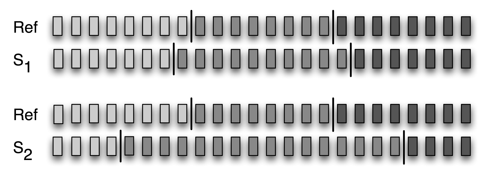

.. -*- mode: rst -*-
.. include:: ../definitions.rst

.. standard global imports

    >>> import nltk, re, pprint

.. TODO: random syllables according to a canon "%s%s" % (random.choice('ptkbdg'), random.choice('aeiou'))
.. TODO: linguistic annotation
.. TODO: paradigms
.. TODO: XML query for access to treebank data (load tree as XML)
.. TODO: mention GOLD ontology
.. TODO: building resources for small languages, e.g. spell checker (cf Devonish question)

.. _chap-data:

============================
11. Managing Linguistic Data
============================

Structured collections of annotated linguistic data are essential in most areas of |NLP|,
however, we still face many obstacles in using them.
The goal of this chapter is to answer the following questions:

#. How do we design a new language resource and ensure that its
   coverage, balance, and documentation support a wide range of uses?
#. When existing data is in the wrong format for some analysis tool,
   how can we convert it to a suitable format?
#. What is a good way to document the existence of a resource we
   have created so that others can easily find it?

Along the way, we will study the design of existing corpora, the
typical workflow for creating a corpus, and the lifecycle of corpus.
As in other chapters, there will be many examples drawn from
practical experience managing linguistic data, including
data that has been collected in the course of linguistic fieldwork,
laboratory work, and web crawling.

------------------------------
Corpus Structure: a Case Study
------------------------------

The TIMIT corpus of read speech was the first annotated speech database to be
widely distributed, and it has an especially clear organization.
TIMIT was developed by a consortium including Texas Instruments and MIT, from which
it derives its name.
It was designed to provide data for the acquisition of acoustic-phonetic knowledge and to 
support the development and evaluation of automatic speech recognition systems. 

The Structure of TIMIT
----------------------

Like the Brown Corpus, which displays a balanced selection of text genres and sources,
TIMIT includes a balanced selection of dialects, speakers, and materials.  For each of
eight dialect regions, 50 male and female speakers having a range of ages and educational
backgrounds each read ten carefully chosen sentences.  Two sentences, read by all
speakers, were designed to bring out dialect variation:

.. ex::
   .. ex::
      she had your dark suit in greasy wash water all year 
   .. ex::
      don't ask me to carry an oily rag like that 

The remaining sentences were chosen to be phonetically rich, involving all phones (sounds) and
a comprehensive range of diphones (phone bigrams).  Additionally, the design strikes a balance
between multiple speakers saying the same sentence in order to permit comparison across
speakers, and having a large range of sentences covered by the corpus to get maximal
coverage of diphones.  Five of the sentences read by each speaker are also read by six other
speakers (for comparability).  The remaining three sentences read by each speaker were unique
to that speaker (for coverage).

NLTK includes a sample from the TIMIT corpus.  You can access its documentation in the usual
way, using ``help(nltk.corpus.timit)``.  Print ``nltk.corpus.timit.files()`` to see a list of the
160 recorded utterances in the corpus sample.
Each file name has internal structure as shown in Figure timit_.

.. _timit:
.. figure:: ../images/timit.png
   :scale: 30

   Structure of a TIMIT Identifier in the NLTK Corpus Package

Each item has a phonetic transcription which can be accessed using the ``phones()``
method.  We can access the corresponding word tokens in the customary way.  Both access
methods permit an optional argument ``offset=True`` which includes the start and end offsets
of the corresponding span in the audio file.

    >>> phonetic = nltk.corpus.timit.phones('dr1-fvmh0/sa1')
    >>> phonetic
    ['h#', 'sh', 'iy', 'hv', 'ae', 'dcl', 'y', 'ix', 'dcl', 'd', 'aa', 'kcl',
    's', 'ux', 'tcl', 'en', 'gcl', 'g', 'r', 'iy', 's', 'iy', 'w', 'aa',
    'sh', 'epi', 'w', 'aa', 'dx', 'ax', 'q', 'ao', 'l', 'y', 'ih', 'ax', 'h#']
    >>> nltk.corpus.timit.word_times('dr1-fvmh0/sa1')
    [('she', 7812, 10610), ('had', 10610, 14496), ('your', 14496, 15791),
    ('dark', 15791, 20720), ('suit', 20720, 25647), ('in', 25647, 26906),
    ('greasy', 26906, 32668), ('wash', 32668, 37890), ('water', 38531, 42417),
    ('all', 43091, 46052), ('year', 46052, 50522)]

In addition to this text data, TIMIT includes a lexicon that provides the canonical
pronunciation of every word, which can be compared with a particular utterance:

    >>> timitdict = nltk.corpus.timit.transcription_dict()
    >>> timitdict['greasy'] + timitdict['wash'] + timitdict['water']
    ['g', 'r', 'iy1', 's', 'iy', 'w', 'ao1', 'sh', 'w', 'ao1', 't', 'axr']
    >>> phonetic[17:30]
    ['g', 'r', 'iy', 's', 'iy', 'w', 'aa', 'sh', 'epi', 'w', 'aa', 'dx', 'ax']

This gives us a sense of what a speech processing system
would have to do in producing or recognizing speech in this particular dialect
(New England).  Finally, TIMIT includes demographic data about the speakers,
permitting fine-grained study of vocal, social, and gender characteristics.

    >>> nltk.corpus.timit.spkrinfo('dr1-fvmh0')
    SpeakerInfo(id='VMH0', sex='F', dr='1', use='TRN', recdate='03/11/86',
    birthdate='01/08/60', ht='5\'05"', race='WHT', edu='BS',
    comments='BEST NEW ENGLAND ACCENT SO FAR')

Notable Design Features
-----------------------

TIMIT illustrates several key features of corpus design.
First, the corpus contains two layers of annotation, at the phonetic and orthographic
levels.  In general, a text or speech corpus may be annotated at many different linguistic levels,
including morphological, syntactic, and discourse levels.  Moreover, even at a given
level there may be different labeling schemes or even disagreement amongst annotators,
such that we want to represent multiple versions.
A second property of TIMIT is its balance across multiple dimensions of variation,
for coverage of dialect regions and diphones.  The inclusion of speaker
demographics brings in many more independent variables, that may help to
account for variation in the data, and which facilitate later uses of the
corpus for purposes that were not envisaged when the corpus was created,
such as sociolinguistics.
A third property is that there is a sharp division between the original
linguistic event captured as an audio recording, and the annotations of that event.
The same holds true of text corpora, in the sense that the original text usually
has an external source, and is considered to be an immutable artifact.  Any transformations
of that artifact which involve human judgment |mdash| even something as
simple as tokenization |mdash| are subject to later revision, thus it is important to
retain the source material in a form that is as close to the original as possible.

.. _timit-structure:
.. figure:: ../images/timit-structure.png
   :scale: 30

   Structure of the Published TIMIT Corpus

A fourth feature of TIMIT is the hierarchical structure of the corpus.
With 4 files per sentence, and 10 sentences for each of 500 speakers, there are 20,000 files.  These are
organized into a tree structure, shown schematically in Figure timit-structure_.
At the top level there is a split between training and testing sets, which gives
away its intended use for developing and evaluating statistical models.

Finally, notice that even though TIMIT is a speech corpus, its transcriptions and associated
data are just text, and can be processed using programs just like any other text corpus.
Therefore, many of the computational methods described in this book are applicable.
Moreover, notice that all of the data types included in the TIMIT corpus fall into
the two basic categories of lexicon and text, which we will discuss below.
Even the speaker demographics data is just another instance of the lexicon data type.

This last observation is less surprising when we consider that text and record structures are the
primary domains for the two subfields of computer science that focus on data management,
namely text retrieval and databases.  A notable feature of linguistic data management is
that usually brings both data types together, and that it can draw on results and techniques
from both fields.

Fundamental Data Types
----------------------

.. _datatypes:
.. figure:: ../images/datatypes.png
   :scale: 35

   Basic Linguistic Datatypes: Lexicons and Texts

Despite its complexity, the TIMIT corpus only contains two fundamental data types,
namely lexicons and texts.
As we saw in Chapter chap-corpora_, most lexical resources can be represented using
a `record`:dt: structure, i.e. a key plus one or more fields, as
shown in Figure datatypes_.  A lexical resource could be a conventional
dictionary or comparative wordlist, as illustrated.  It could also
be a phrasal lexicon, where the key field is a phrase rather than a single word.
A thesaurus also consists of record-structured data, where we look up entries
via non-key fields that correspond to topics.
We can also construct special tabulations (known as paradigms)
to illustrate contrasts and systematic variation, as shown in Figure
datatypes_ for three verbs.  TIMIT's speaker table is also a kind
of lexicon.

At the most abstract level, a `text`:dt: is a representation of a real or fictional speech event,
and the time-course of that event carries over into the text itself.  A text could be a small
unit, such as a word or sentence, or a complete narrative or dialogue.  It may come with
annotations such as part-of-speech tags, morphological analysis, discourse structure, and so forth.
As we saw in the IOB tagging technique (Chapter chap-chunk_), it is possible to represent higher-level
constituents using tags on individual words.  Thus the abstraction of text shown in
Figure datatypes_ is sufficient.

Despite the complexities and idiosyncrasies of individual corpora, at base they are
collections of texts together with record-structured data.  The contents of a corpus
are often biased towards one or other of these types.
For example, the Brown Corpus contains 500 text files, but we still use a table to relate
the files to 15 different genres.  At the other end of the spectrum, WordNet
contains 117,659 synset records, yet it incorporates many example sentences (mini-texts)
to illustrate word usages.  TIMIT is an interesting mid-point on this spectrum, containing substantial
free-standing material of both the text and lexicon types.

.. _sec-life-cycle-of-a-corpus:

--------------------------
The Life-Cycle of a Corpus
--------------------------

Corpora are not born fully-formed, but involve careful preparation
and input from many people over an extended period.  Raw data needs
to be collected, cleaned up, documented, and stored in a systematic
structure.  Various layers of annotation might be applied, some requiring
specialized knowledge of the morphology or syntax of the language.
Success at this stage depends on creating an efficient workflow
involving appropriate tools and format converters.
Quality control procedures can be put in place to find inconsistencies
in the annotations, and to ensure the highest
possible level of inter-annotator agreement.  Because of the
scale and complexity of the task, large corpora may take years to
prepare, and involve tens or hundreds of person-years of effort.
In this section we briefly review the various stages in the
life-cycle of a corpus.

Three Corpus Creation Scenarios
-------------------------------

In one type of corpus, the design unfolds interactively
in the course of the creator's explorations. This is the pattern
typical of traditional "field linguistics," in which material from
elicitation sessions is analyzed
repeatedly as it is gathered, with tomorrow's elicitation often based
on questions that arise in analyzing today's. The resulting field
notes are then used during subsequent years of research, and may serve
as an archival resource indefinitely |mdash| the field notes of linguists
and anthropologists working in the early years of the 20th century
remain an important source of information today. Computerization is an
obvious boon to work of this type, as exemplified by the popular
program `Shoebox`:dt: |mdash| now about two decades old and re-released as `Toolbox`:dt: |mdash|
which replaces the field linguist's traditional shoebox full of file cards.
Other software tools, even simple word processors and spreadsheets, are routinely
used to acquire the data.  In the next section we will look at how to extract
data from these sources.

Another corpus creation scenario is typical of experimental research
where a body of carefully-designed material is collected from a range of subjects,
then analyzed to evaluate a hypothesis or develop a technology.
Today, such datasets are collected and analyzed in digital form.
Among scientists (such as phoneticians or psychologists), they
are rarely published and therefore rarely preserved. Among engineers,
it has become common for such databases to be shared and re-used at
least within a laboratory or company, and often to be published more
widely. Corpora of this type are the basis of the
"common task" method of research management, which over the
past two decades has become the norm in government-funded research programs
in speech- and language-related technology.
We have already encountered such corpora in the earlier chapters;
we will see how to write Python programs to implement the kinds of
curation tasks that are necessary before such corpora are published.

Finally, there are efforts to gather a "reference corpus" for a
particular language, such as the `American National Corpus`:dt: (ANC)
and the `British National Corpus`:dt: (BNC). Here the goal
has been to produce a comprehensive record of the
many forms, styles and uses of a language.
The core application is typically lexicographic, that is, the construction
of dictionaries based on a careful study of patterns of use.
Apart from the sheer challenge of scale, there is a heavy reliance
on automatic annotation tools together with post-editing to
fix any errors.  However, we can write Python programs to find
and repair the errors, and also to analyzing the corpus for balance. 

Curation and Quality Control
----------------------------

Good tools for automatic and manual preparation of data
are essential, however the creation of a high-quality corpus depends just
as much on such mundane things as documentation and training.
Annotation guidelines define the task and document the markup
conventions.  They may be regularly updated to cover difficult
cases, and any new rules that are devised to achieve more
consistent annotations.  Annotators need to be trained in the
annotation procedures, including any methods for resolving
cases not covered explicitly in the guidelines.

Large annotation tasks require multiple annotators.
How consistently can a group of annotators perform?
We can easily measure this by having the same source
material annotated by multiple annotators.
It is insufficient to report that there is 80% agreement,
as we have no way to tell if this is good or bad.
I.e. for an easy task such as tagging, this would be a bad score,
while for a difficult task such as semantic role labeling,
this would be an exceptionally good score.

The `Kappa`:dt: coefficient |kappa| measures agreement between
two people making category judgments, correcting for expected
chance agreement.  For example, suppose an item is to be annotated,
and four coding options are equally likely.
Then two people coding randomly would be expected to agree 25% of the time.
Thus, an agreement of 25% will be assigned |kappa| = 0, and better
levels of agreement will be scaled accordingly.
For an agreement of 50%, we would get
|kappa| = 0.333, as 50 is a third of the way from 25 to 100.

.. _windowdiff:

   A Reference Segmentation and Two Hypothetical Segmentations

We can also measure the agreement in two independent segmentations
of language input (e.g. for tokenization, sentence segmentation,
named-entity segmentation).  In Figure windowdiff_ we see two
possible segmentations of a sequence of items
(e.g. tokenization, chunking, sentence segmentation),
which might have been produced by two programs or annotators.
If we naively score S\ :subscript:`1` and S\ :subscript:`2`
for their alignment with the reference segmentation,
both will score 0 as neither got the correct alignment.
However, S\ :subscript:`1` is clearly better than S\ :subscript:`2`,
and so we need a corresponding measure, such as `Windowdiff`:dt:.
Windowdiff is a simple algorithm for evaluating the quality
of a segmentation, by running a sliding window over the
data and awarding partial credit for near misses.
The following code illustrates the algorithm
running on the segmentations from Figure
windowdiff_ using a window size of 3:
   
    >>> ref = "00000001000000010000000"
    >>> s1  = "00000010000000001000000"
    >>> s2  = "00010000000000000001000"
    >>> nltk.windowdiff(ref,ref,3)
    0
    >>> nltk.windowdiff(ref,s1,3)
    4
    >>> nltk.windowdiff(ref,s2,3)
    16

The Lifecycle of Linguistic Data: Evolution vs Curation
-------------------------------------------------------

Once a corpus has been disseminated, it typically gains a life of its own,
as others adapt it to their needs.  This may involve reformatting a text file (e.g. converting
to XML), renaming files, retokenizing the text, selecting a subset of the data to enrich,
and so forth.  Multiple research groups may do this work independently, as exemplified
in Figure evolution_.  At a later date, when someone wants to combine sources
of information from different version, the task may be extremely onerous.

.. _evolution:
.. figure:: ../images/evolution.png
   :scale: 36

   Evolution of a Corpus over Time

The task of using derived corpora is made even more difficult by the lack of
any record about how the derived version was created, and which version is the most
up-to-date.

An alternative to this chaotic situation is for all corpora to be centrally curated,
and for committees of experts to revise and extend a reference corpus at periodic
intervals, considering proposals for new content from third-parties, much like a dictionary is edited.
However, this is impractical.

A better solution is to have a canonical, immutable primary source, which supports
incoming references to any sub-part, and then for all annotations (including segmentations)
to reference this source.  This way, two independent tokenizations of the same text
can be represented without touch the source text, as can any further labeling and grouping
of those annotations.  This method is known as `standoff annotation`:dt:.

[More discussion and examples]

--------------
Acquiring Data
--------------

Scenarios: fieldwork, web, manual entry using local tool, machine learning with manual post-editing

Conventional office software is widely used in computer-based language
documentation work, given its familiarity and ready availability.
This includes word processors and spreadsheets.

Spiders
-------

* what they do: basic idea is simple
* python code to find all the anchors, extract the href, and make an absolute URL for fetching
* many issues: starting points, staying within a single site, only getting HTML
* various stand-alone tools for spidering, and mirroring
* cleaning HTML with ``nltk.clean_html()`` or with BeautifulSoup.

Extracting Data from Word Processor Files
-----------------------------------------

Word processing software is often used in the manual preparation
of texts and lexicons in projects that have limited computational
infrastructure.  Such projects often provide templates for data
entry, though the word processing software does not ensure that
the data is correctly structured.  For example, each text may
be required to have a title and date.  Similarly, each lexical
entry may have certain obligatory fields.  
As the data grows in size and complexity, a larger
proportion of time may be spent maintaining its consistency.
  
How can we extract the content of such files so
that we can manipulate it in external programs?
Moreover, how can we validate the content of these files to
help authors create well-structured data, so that the
quality of the data can be maximized in the context of
the original authoring process?

Consider a dictionary in
which each entry has a part-of-speech field, drawn from a set of 20
possibilities, displayed after the pronunciation field, and rendered
in 11-point bold.  No conventional word processor has search or macro
functions capable of verifying that all part-of-speech fields have
been correctly entered and displayed.  This task requires exhaustive
manual checking.  If the word processor permits the document to be
saved in a non-proprietary format, such as text, HTML, or XML, we can
sometimes write programs to do this checking automatically.

Consider the following fragment of a lexical entry:
"sleep [sli:p] **vi** *condition of body and mind...*\ ".
We can enter this in MSWord, then "Save as Web Page",
then inspect the resulting HTML file::

    
sleep
       
      [sli:p]
       
      <b>vi</b>
       
      <i>a condition of body and mind ...<o:p></o:p></i>
    

Observe that the entry is represented as an HTML paragraph, using the
``
`` element, and that the part of speech appears inside a ```` element.  The following program defines
the set of legal parts-of-speech, ``legal_pos``.  Then it extracts all
11-point content from the ``dict.htm`` file and stores it in the set
``used_pos``.  Observe that the search pattern contains a
parenthesized sub-expression; only the material that matches this
sub-expression is returned by ``re.findall``.  Finally, the program
constructs the set of illegal parts-of-speech as ``used_pos -
legal_pos``:

    >>> legal_pos = set(['n', 'v.t.', 'v.i.', 'adj', 'det'])
    >>> pattern = re.compile(r"'font-size:11.0pt'>([a-z.]+)<")
    >>> document = open("dict.htm").read()
    >>> used_pos = set(re.findall(pattern, document))
    >>> illegal_pos = used_pos.difference(legal_pos)
    >>> print list(illegal_pos)
    ['v.i', 'intrans']

This simple program represents the tip of the iceberg.  We can develop
sophisticated tools to check the consistency of word processor files,
and report errors so that the maintainer of the dictionary can correct
the original file *using the original word processor*.

Once we know the data is correctly formatted, we
can write other programs to convert the data into a different format.
For example, the program in Figure html2csv_ strips out the HTML markup using ``ntlk.clean_html()``,
extracts the words and their pronunciations, and generates output
in "comma-separated value" (CSV) format:

.. pylisting:: html2csv
   :caption: Converting HTML Created by Microsoft Word into Comma-Separated Values

   def lexical_data(html_file):
       SEP = '_ENTRY'
       html = open(html_file).read()
       html = re.sub(r'<p', SEP + '<p', html)
       text = nltk.clean_html(html)
       text = ' '.join(text.split())
       for entry in text.split(SEP):
           if entry.count(' ') > 2:
               yield entry.split(' ', 3)

   >>> import csv
   >>> writer = csv.writer(open("dict1.csv", "wb"))
   >>> writer.writerows(lexical_data("dict.htm"))

Extracting Data from Spreadsheets and Databases
-----------------------------------------------

**Spreadsheets.** These are often used for wordlists or paradigms.  A
comparative wordlist may be stored in a spreadsheet, with a row for
each cognate set, and a column for each language.  Examples are
available from ``www.rosettaproject.org``.  Programs such as Excel can
export spreadsheets in the CSV format, and we can write programs to
manipulate them, with the help of Python's ``csv`` module.

[csv examples]

**Databases.** Sometimes lexicons are stored in a full-fledged
relational database.  When properly normalized, these databases can
implement many well-formedness constraints.  For example, we can
require that all parts-of-speech come from a specified vocabulary by
declaring that the part-of-speech field is an *enumerated type*.
However, the relational model is often too restrictive for linguistic
data, which typically has many optional and repeatable fields (e.g.
dictionary sense definitions and example sentences).
Query languages such as SQL cannot express many
linguistically-motivated queries, e.g. *find all words that appear
in example sentences for which no dictionary entry is provided*.
Now supposing that the database supports exporting query results to CSV format,
and that we can save the data to a file ``dict.csv``::

    "sleep","sli:p","v.i","a condition of body and mind ..."
    "walk","wo:k","v.intr","progress by lifting and setting down each foot ..."
    "wake","weik","intrans","cease to sleep"

Now we can express this query as shown below:

    >>> import csv
    >>> lexicon = csv.reader(open('dict.csv'))
    >>> pairs = [(lexeme, defn) for (lexeme, _, _, defn) in lexicon]
    >>> lexemes, defns = zip(*pairs) 
    >>> defn_words = set(w for defn in defns for w in defn.split())
    >>> sorted(defn_words.difference(lexemes))
    ['...', 'a', 'and', 'body', 'by', 'cease', 'condition', 'down', 'each',
    'foot', 'lifting', 'mind', 'of', 'progress', 'setting', 'to']

----------------
Working with XML
----------------

The Extensible Markup Language (XML) provides a framework for designing
domain-specific markup languages.  It is sometimes used for representing
annotated text and for lexical resources.  Unlike HTML, with its predefined
tags, XML permits us to make up our own tags.  Unlike a database, XML
permits us to create data without first specifying its structure, and it
permits us to have optional and repeatable elements.

Using XML for Linguistic Structures
-----------------------------------

Thanks to its flexibility and extensibility, XML is a natural
choice for representing linguistic structures.  Here's an example
of a simple lexical entry:

|  <entry>
|    <headword>whale</headword>
|    <pos>noun</pos>
|    <gloss>any of the larger cetacean mammals having a streamlined
|       body and breathing through a blowhole on the head</gloss>
|  </entry>

[well-formedness; significance of whitespace]

[adding extra fields; second gloss: "a very large person; impressive in size or qualities"]

[added nested structure, e.g. for gloss and translation into another language.]

[fields that are conditional on the value of other fields, e.g. nouns should have
plural (if irregular); verbs should have past tense (if irregular)]

[representing parse trees]

The Role of XML
---------------

We can use XML to represent linguistic information, however the flexibility
comes at a price.  Each time we introduce a complication, e.g. by permitting
an element to be optional or repeated, we make more work for any program
that accesses the data.  We also make it harder to check the validity of the
data.

Thus, using XML to represent linguistic structures does not solve the data
modeling problem or the data interchange problem.
We still have to work out how best to structure the data, and
we still have to write programs to read and write the format.

[Some principles of normalization from databases that apply to XML:
not duplicating information but storing it once; identifying
dependencies; dealing with many-to-many relations.]  

ElementTree API
---------------

[Requires Python 2.5, included with NLTK for convenience.]

[Overview of Shakespeare XML Corpus]

    >>> from nltk.etree.ElementTree import ElementTree
    >>> from nltk import data
    >>> merchant = ElementTree().parse(data.find('corpora/shakespeare/merchant.xml'))
    >>> merchant[0]
    <Element TITLE at 2101670>
    >>> merchant[0].text
    'The Merchant of Venice'

The variable ``merchant`` contains an XML tree.  Its first child is a TITLE element,
whose text content is the name of the play.  We can access the other children as
follows:

    >>> merchant.getchildren()
    [<Element TITLE at 2101670>, <Element PERSONAE at 21016c0>, <Element SCNDESCR at 2101eb8>,
    <Element PLAYSUBT at 2101ee0>, <Element ACT at 2101f30>, <Element ACT at 2156a08>,
    <Element ACT at 21e2558>, <Element ACT at 224cee0>, <Element ACT at 22ac148>]
    
The play consists of a title, the personae, a scene description, a subtitle, and five acts.
Each act has a title and some scenes, and each scene consists of speeches which are made
up of lines, a structure with four levels of nesting.  Let's dig down into Act IV: 

    >>> merchant[-2][0].text
    'ACT IV'
    >>> merchant[-2][1]
    <Element SCENE at 224cf80>
    >>> merchant[-2][1][0].text
    'SCENE I.  Venice. A court of justice.'
    >>> merchant[-2][1][54]
    <Element SPEECH at 226ee40>
    >>> merchant[-2][1][54][0]
    <Element SPEAKER at 226ee90>
    >>> merchant[-2][1][54][0].text
    'PORTIA'
    >>> merchant[-2][1][54][1]
    <Element LINE at 226eee0>
    >>> merchant[-2][1][54][1].text
    "The quality of mercy is not strain'd,"

Although we can access the entire tree this way, it is more convenient to search for
sub-elements with particular names.  Recall that the elements at the top level have
several types.  We can iterate over just the types we are interested in (such as
the acts), using ``merchant.findall('ACT')``.  Here's an example of doing such
tag-specific searches at every level of nesting:

    >>> for i, act in enumerate(merchant.findall('ACT')):
    ...     for j, scene in enumerate(act.findall('SCENE')):
    ...         for k, speech in enumerate(scene.findall('SPEECH')):
    ...             for line in speech.findall('LINE'):
    ...                 if 'music' in str(line.text):
    ...                     print "Act %d Scene %d Speech %d: %s" % (i+1, j+1, k+1, line.text)
    Act 3 Scene 2 Speech 9: Let music sound while he doth make his choice;
    Act 3 Scene 2 Speech 9: Fading in music: that the comparison
    Act 3 Scene 2 Speech 9: And what is music then? Then music is
    Act 5 Scene 1 Speech 23: And bring your music forth into the air.
    Act 5 Scene 1 Speech 23: Here will we sit and let the sounds of music
    Act 5 Scene 1 Speech 23: And draw her home with music.
    Act 5 Scene 1 Speech 24: I am never merry when I hear sweet music.
    Act 5 Scene 1 Speech 25: Or any air of music touch their ears,
    Act 5 Scene 1 Speech 25: By the sweet power of music: therefore the poet
    Act 5 Scene 1 Speech 25: But music for the time doth change his nature.
    Act 5 Scene 1 Speech 25: The man that hath no music in himself,
    Act 5 Scene 1 Speech 25: Let no such man be trusted. Mark the music.
    Act 5 Scene 1 Speech 29: It is your music, madam, of the house.
    Act 5 Scene 1 Speech 32: No better a musician than the wren.

Instead of navigating each step of the way down the hierarchy, we can search for
particular embedded elements.  For example, let's examine the sequence of speakers.
We can use a frequency distribution to see who has the most to say:

    >>> speaker_seq = [s.text for s in merchant.findall('ACT/SCENE/SPEECH/SPEAKER')]
    >>> speaker_freq = nltk.FreqDist(speaker_seq)
    >>> top5 = speaker_freq.keys()[:5]
    >>> top5
    ['PORTIA', 'SHYLOCK', 'BASSANIO', 'GRATIANO', 'ANTONIO']

We can also look for patterns in who follows who in the dialogues.
Since there's 23 speakers, we need to reduce the "vocabulary"
to a manageble size first, using the method described in
Section sec-dictionaries_.

    >>> mapping = nltk.defaultdict(lambda: 'OTH')
    >>> for s in top5:
    ...     mapping[s] = s[:4]
    ...
    >>> speaker_seq2 = [mapping[s] for s in speaker_seq]
    >>> cfd = nltk.ConditionalFreqDist(nltk.ibigrams(speaker_seq2))
    >>> cfd.tabulate()
         ANTO BASS GRAT  OTH PORT SHYL
    ANTO    0   11    4   11    9   12
    BASS   10    0   11   10   26   16
    GRAT    6    8    0   19    9    5
     OTH    8   16   18  153   52   25
    PORT    7   23   13   53    0   21
    SHYL   15   15    2   26   21    0

Using Google's Search API
-------------------------

[How to register; example of submitting a query and navigating the results.]

Using XML API for working with Toolbox Data
-------------------------------------------

In Section sec-lexical-resources_ we saw a simple interface
for accessing Toolbox data, a popular and well-established format
used by linguists for managing data.

In this section we discuss a variety of
techniques for manipulating Toolbox data in ways that are not supported
by the Toolbox software.  (The methods we discuss could be
applied to other record-structured data, regardless of the actual file format.)

We can use the ``toolbox.xml()`` method to access a Toolbox
file and load it into an ``elementtree`` object.

    >>> from nltk.corpus import toolbox
    >>> lexicon = toolbox.xml('rotokas.dic')

There are two ways to access the contents of the lexicon object, by
indexes and by paths.  Indexes use the familiar syntax, thus
``lexicon[3]`` returns entry number 3 (which is actually the fourth
entry counting from zero).  And ``lexicon[3][0]`` returns its first
field:

    >>> lexicon[3][0] 
    <Element lx at 77bd28>
    >>> lexicon[3][0].tag
    'lx'
    >>> lexicon[3][0].text
    'kaa'

The second way to access the contents of the lexicon object uses
paths.  The lexicon is a series of ``record`` objects, each containing
a series of field objects, such as ``lx`` and ``ps``.  We can
conveniently address all of the lexemes using the path ``record/lx``.
Here we use the ``findall()`` function to search for any matches to
the path ``record/lx``, and we access the text content of the element,
normalizing it to lowercase.

    >>> [lexeme.text.lower() for lexeme in lexicon.findall('record/lx')]
    ['kaa', 'kaa', 'kaa', 'kaakaaro', 'kaakaaviko', 'kaakaavo', 'kaakaoko',
    'kaakasi', 'kaakau', 'kaakauko', 'kaakito', 'kaakuupato', ..., 'kuvuto']

It is often convenient to add new fields that are derived automatically from
existing ones.  Such fields often facilitate search and analysis.
For example, in Figure add-cv-field_ we define a function ``cv()`` which
maps a string of consonants and vowels to the corresponding CV sequence,
e.g. ``kakapua`` would map to ``CVCVCVV``.
This mapping has four steps.  First, the string is converted to lowercase,
then we replace any non-alphabetic characters ``[^a-z]`` with an underscore.
Next, we replace all vowels with ``V``.  Finally, anything that is not
a ``V`` or an underscore must be a consonant, so we replace it with a ``C``.
Now, we can scan the lexicon and add a new ``cv`` field after every ``lx`` field.
Figure add-cv-field_ shows what this does to a particular entry; note
the last line of output, which shows the new CV field.

.. pylisting:: add-cv-field
   :caption: Adding a new cv field to a lexical entry

   from nltk.etree.ElementTree import SubElement

   def cv(s):
       s = s.lower()
       s = re.sub(r'[^a-z]',     r'_', s)
       s = re.sub(r'[aeiou]',    r'V', s)
       s = re.sub(r'[^V_]',      r'C', s)
       return (s)

   def add_cv_field(entry):
       for field in entry:
           if field.tag == 'lx':
               cv_field = SubElement(entry, 'cv')
               cv_field.text = cv(field.text)

   >>> lexicon = toolbox.xml('rotokas.dic')
   >>> add_cv_field(lexicon[53])
   >>> print nltk.corpus.reader.toolbox.to_sfm_string(lexicon[53])
   \lx kaeviro
   \ps V
   \pt A
   \ge lift off
   \ge take off
   \tkp go antap
   \sc MOTION
   \vx 1
   \nt used to describe action of plane
   \dt 03/Jun/2005
   \ex Pita kaeviroroe kepa kekesia oa vuripierevo kiuvu.
   \xp Pita i go antap na lukim haus win i bagarapim.
   \xe Peter went to look at the house that the wind destroyed.
   \cv CVVCVCV

Finally, we take a look at simple methods to generate summary reports,
giving us an overall picture of the quality and organisation of the data.

First, suppose that we wanted to compute the average number of fields for
each entry.  This is just the total length of the entries (the number
of fields they contain), divided by the number of entries in the
lexicon:

    >>> sum(len(entry) for entry in lexicon) / len(lexicon)
    13

.. pylisting:: toolbox-validation
   :caption: Validating Toolbox Entries Using a Context Free Grammar

   grammar = nltk.parse_cfg('''
     S -> Head PS Glosses Comment Date Examples
     Head -> Lexeme Root
     Lexeme -> "lx"
     Root -> "rt" |
     PS -> "ps"
     Glosses -> Gloss Glosses |
     Gloss -> "ge" | "gp"
     Date -> "dt"
     Examples -> Example Ex_Pidgin Ex_English Examples |
     Example -> "ex"
     Ex_Pidgin -> "xp"
     Ex_English -> "xe"
     Comment -> "cmt" |
     ''')

   def validate_lexicon(grammar, lexicon):
       rd_parser = nltk.RecursiveDescentParser(grammar)
       for entry in lexicon[10:20]:
           marker_list = [field.tag for field in entry]
           if rd_parser.get_parse_list(marker_list):
               print "+", ':'.join(marker_list)
           else:
               print "-", ':'.join(marker_list)

   >>> lexicon = toolbox.xml('rotokas.dic')[10:20]
   >>> validate_lexicon(grammar, lexicon)
   - lx:ps:ge:gp:sf:nt:dt:ex:xp:xe:ex:xp:xe
   - lx:rt:ps:ge:gp:nt:dt:ex:xp:xe:ex:xp:xe
   - lx:ps:ge:gp:nt:dt:ex:xp:xe:ex:xp:xe
   - lx:ps:ge:gp:nt:sf:dt
   - lx:ps:ge:gp:dt:cmt:ex:xp:xe:ex:xp:xe
   + lx:ps:ge:ge:ge:gp:cmt:dt:ex:xp:xe
   + lx:rt:ps:ge:gp:cmt:dt:ex:xp:xe:ex:xp:xe
   + lx:rt:ps:ge:ge:gp:dt
   - lx:rt:ps:ge:ge:ge:gp:dt:cmt:ex:xp:xe:ex:xp:xe:ex:xp:xe
   + lx:rt:ps:ge:gp:dt:ex:xp:xe

We could try to write
down a grammar for lexical entries, and look for entries which do not
conform to the grammar.  In general, toolbox entries have nested
structure.  Thus they correspond to a tree over the fields.  We can
check for well-formedness by parsing the field names.
In Figure chunk-toolbox_ we set up
a putative grammar for the entries, then parse each entry.
Those that are accepted by the grammar prefixed with
a ``'+'``, and those that are rejected are prefixed with a ``'-'``.

.. pylisting:: chunk-toolbox
   :caption: Chunking a Toolbox Lexicon

   import os.path, sys
   from nltk_contrib import toolbox

   grammar = r"""
         lexfunc: {<lf>(<lv><ln|le>*)*}
         example: {<rf|xv><xn|xe>*}
         sense:   {<sn><ps><pn|gv|dv|gn|gp|dn|rn|ge|de|re>*<example>*<lexfunc>*}
         record:   {<lx><hm><sense>+<dt>}
       """

   >>> from nltk.etree.ElementTree import ElementTree
   >>> db = toolbox.ToolboxData()
   >>> db.open(nltk.data.find('corpora/toolbox/iu_mien_samp.db'))
   >>> lexicon = db.chunk_parse(grammar, encoding='utf8')
   >>> toolbox.data.indent(lexicon)
   >>> tree = ElementTree(lexicon)
   >>> tree.write(sys.stdout, encoding='utf8')

Interlinear Text
----------------

The NLTK corpus collection includes many interlinear text samples
(though no suitable corpus reader as yet).

`General Ontology for Linguistic Description`:dt: (GOLD)
``http://www.linguistics-ontology.org/``

Creating Metadata for Language Resources
----------------------------------------

OLAC metadata extends the `Dublin Core`:dt: metadata set with descriptors
that are important for language resources.

The container for an OLAC metadata record is the element ``<olac>``.
Here is a valid OLAC metadata record from the Pacific And Regional
Archive for Digital Sources in Endangered Cultures (PARADISEC)::

  <olac:olac xsi:schemaLocation="http://purl.org/dc/elements/1.1/ http://www.language-archives.org/OLAC/1.0/dc.xsd
    http://purl.org/dc/terms/ http://www.language-archives.org/OLAC/1.0/dcterms.xsd
    http://www.language-archives.org/OLAC/1.0/ http://www.language-archives.org/OLAC/1.0/olac.xsd">
    <dc:title>Tiraq Field Tape 019</dc:title>
    <dc:identifier>AB1-019</dc:identifier>
    <dcterms:hasPart>AB1-019-A.mp3</dcterms:hasPart>
    <dcterms:hasPart>AB1-019-A.wav</dcterms:hasPart>
    <dcterms:hasPart>AB1-019-B.mp3</dcterms:hasPart>
    <dcterms:hasPart>AB1-019-B.wav</dcterms:hasPart>
    <dc:contributor xsi:type="olac:role" olac:code="recorder">Brotchie, Amanda</dc:contributor>
    <dc:subject xsi:type="olac:language" olac:code="x-sil-MME"/>
    <dc:language xsi:type="olac:language" olac:code="x-sil-BCY"/>
    <dc:language xsi:type="olac:language" olac:code="x-sil-MME"/>
    <dc:format>Digitised: yes;</dc:format>
    <dc:type>primary_text</dc:type>
    <dcterms:accessRights>standard, as per PDSC Access form</dcterms:accessRights>
    <dc:description>SIDE A
1. Elicitation Session - Discussion and
      translation of Lise's and Marie-Claire's Songs and Stories from
      Tape 18 (Tamedal)

SIDE B
1. Elicitation Session: Discussion
      of and translation of Lise's and Marie-Clare's songs and stories
      from Tape 018 (Tamedal)
2. Kastom Story 1 - Bislama
      (Alec). Language as given: Tiraq</dc:description>
  </olac:olac>

NLTK Version 0.9 includes support for reading an OLAC record, for example:

    >>> file = nltk.data.find('corpora/treebank/olac.xml')
    >>> xml = open(file).read()
    >>> nltk.olac.pprint_olac(xml)
    identifier  : LDC99T42
    title       : Treebank-3
    type        : (olac:linguistic-type=primary_text)
    description : Release type: General
    creator     : Mitchell P. Marcus, Beatrice Santorini, Mary Ann Marcinkiewicz and Ann Taylor (olac:role=author)
    identifier  : ISBN: 1-58563-163-9
    description : Online documentation: http://www.ldc.upenn.edu/Catalog/docs/treebank3/
    subject     : English (olac:language=x-sil-ENG)

-----------------------
Converting Data Formats
-----------------------

* write our own parser and formatted print
* use existing libraries, e.g. csv

Formatting Entries
------------------

We can also print a formatted
version of a lexicon.  It allows us to request specific fields without
needing to be concerned with their relative ordering in the original file.

    >>> lexicon = toolbox.xml('rotokas.dic')
    >>> for entry in lexicon[70:80]:
    ...     lx = entry.findtext('lx')
    ...     ps = entry.findtext('ps')
    ...     ge = entry.findtext('ge')
    ...     print "%s (%s) '%s'" % (lx, ps, ge)
    kakae (???) 'small'
    kakae (CLASS) 'child'
    kakaevira (ADV) 'small-like'
    kakapikoa (???) 'small'
    kakapikoto (N) 'newborn baby'
    kakapu (V) 'place in sling for purpose of carrying'
    kakapua (N) 'sling for lifting'
    kakara (N) 'arm band'
    Kakarapaia (N) 'village name'
    kakarau (N) 'frog'

We can use the same idea to generate HTML tables instead of plain text.
This would be useful for publishing a Toolbox lexicon on the web.
It produces HTML elements ``<table>``, ``<tr>`` (table row), and
``<td>`` (table data).

    >>> html = "<table>\n"
    >>> for entry in lexicon[70:80]:
    ...     lx = entry.findtext('lx')
    ...     ps = entry.findtext('ps')
    ...     ge = entry.findtext('ge')
    ...     html += "  <tr><td>%s</td><td>%s</td><td>%s</td></tr>\n" % (lx, ps, ge)
    >>> html += "</table>"
    >>> print html
    <table>
      <tr><td>kakae</td><td>???</td><td>small</td></tr>
      <tr><td>kakae</td><td>CLASS</td><td>child</td></tr>
      <tr><td>kakaevira</td><td>ADV</td><td>small-like</td></tr>
      <tr><td>kakapikoa</td><td>???</td><td>small</td></tr>
      <tr><td>kakapikoto</td><td>N</td><td>newborn baby</td></tr>
      <tr><td>kakapu</td><td>V</td><td>place in sling for purpose of carrying</td></tr>
      <tr><td>kakapua</td><td>N</td><td>sling for lifting</td></tr>
      <tr><td>kakara</td><td>N</td><td>arm band</td></tr>
      <tr><td>Kakarapaia</td><td>N</td><td>village name</td></tr>
      <tr><td>kakarau</td><td>N</td><td>frog</td></tr>
    </table>

XML output

    >>> import sys
    >>> from nltk.etree.ElementTree import ElementTree
    >>> tree = ElementTree(lexicon[3])
    >>> tree.write(sys.stdout)
    <record>
      <lx>kaa</lx>
      <ps>N</ps>
      <pt>MASC</pt>
      <cl>isi</cl>
      <ge>cooking banana</ge>
      <tkp>banana bilong kukim</tkp>
      <pt>itoo</pt>
      <sf>FLORA</sf>
      <dt>12/Aug/2005</dt>
      <ex>Taeavi iria kaa isi kovopaueva kaparapasia.</ex>
      <xp>Taeavi i bin planim gaden banana bilong kukim tasol long paia.</xp>
      <xe>Taeavi planted banana in order to cook it.</xe>
    </record>

Exercises
---------

* |soso| Create a spreadsheet using office software, containing one lexical entry per
  row, consisting of a headword, a part of speech, and a gloss.  Save the
  spreadsheet in CSV format.  Write Python code to read the CSV file and print it in
  Toolbox format, using ``lx`` for the headword, ``ps`` for the part of speech,
  and ``gl`` for the gloss.

-----------------------
Analyzing Language Data
-----------------------

I.e. linguistic exploration

Export to statistics package via CSV

In this section we consider a variety of analysis tasks.

**Finding Minimal Sets:**
In order to establish a contrast segments (or lexical properties, for
that matter), we would like to find pairs of words which are identical
except for a single property.  For example, the words pairs *mace* vs
*maze* and *face* vs *faze* |mdash| and many others like them |mdash| demonstrate the
existence of a phonemic distinction between *s* and *z* in English.
NLTK provides flexible support for constructing minimal sets, using
the ``MinimalSet()`` class.  This class needs three pieces of information
for each item to be added:
``context``: the material that must be fixed across all members of a minimal set;
``target``: the material that changes across members of a minimal set;
``display``: the material that should be displayed for each item.

.. table:: minimal-set-parameters

   =========================  ==================  ===============  ===========
   Minimal Set                Context             Target           Display
   =========================  ==================  ===============  ===========
   *bib*, *bid*, *big*        first two letters   third letter     word
   *deal (N)*, *deal (V)*     whole word          pos              word (pos)
   =========================  ==================  ===============  ===========

   Examples of Minimal Set Parameters

We begin by creating a list of parameter values, generated from the
full lexical entries.  In our first example, we will print minimal sets
involving lexemes of length 4, with a target position of 1 (second
segment).  The ``context`` is taken to be the entire word, except for
the target segment.  Thus, if lex is ``kasi``, then context is
``lex[:1]+'_'+lex[2:]``, or ``k_si``.  Note that no parameters are
generated if the lexeme does not consist of exactly four segments.

    >>> lexemes = [lexeme.text.lower() for lexeme in lexicon.findall('record/lx')]
    >>> pos = 1
    >>> ms = nltk.MinimalSet((lex[:pos] + '_' + lex[pos+1:], lex[pos], lex)
    ...                       for lex in lexemes if len(lex) == 4)

Now we print the table of minimal sets.  We specify that each
context was seen at least 3 times.

    >>> for context in ms.contexts(3):
    ...     print context + ':',
    ...     for target in ms.targets():
    ...         print "%-4s" % ms.display(context, target, "-"),
    ...     print
    k_si: kasi -    kesi kusi kosi
    k_va: kava -    -    kuva kova
    k_ru: karu kiru keru kuru koru
    k_pu: kapu kipu -    -    kopu
    k_ro: karo kiro -    -    koro
    k_ri: kari kiri keri kuri kori
    k_pa: kapa -    kepa -    kopa
    k_ra: kara kira kera -    kora
    k_ku: kaku -    -    kuku koku
    k_ki: kaki kiki -    -    koki

Observe in the above example that the context, target, and displayed
material were all based on the lexeme field.  However, the idea of
minimal sets is much more general.  For instance, suppose we wanted to
get a list of wordforms having more than one possible part-of-speech.
Then the target will be part-of-speech field, and the context will be
the lexeme field.  We will also display the English gloss field.

    >>> entries = [(e.findtext('lx'), e.findtext('ps'), e.findtext('ge'))
    ...               for e in lexicon
    ...               if e.findtext('lx') and e.findtext('ps') and e.findtext('ge')]
    >>> ms = nltk.MinimalSet((lx, ps[0], "%s (%s)" % (ps[0], ge))
    ...               for (lx, ps, ge) in entries)
    >>> for context in ms.contexts()[:10]:
    ...     print "%10s:" % context, "; ".join(ms.display_all(context))
      kokovara: N (unripe coconut); V (unripe)
         kapua: N (sore); V (have sores)
          koie: N (pig); V (get pig to eat)
          kovo: C (garden); N (garden); V (work)
        kavori: N (crayfish); V (collect crayfish or lobster)
        korita: N (cutlet?); V (dissect meat)
          keru: N (bone); V (harden like bone)
      kirokiro: N (bush used for sorcery); V (write)
        kaapie: N (hook); V (snag)
           kou: C (heap); V (lay egg)

.. Analysing Texts:
   Use the toolbox lexicon to tag a text with part-of-speech information,
   then do POS-sensitive concordance-style searches.

The following program uses ``MinimalSet`` to find pairs of entries in the
corpus which have different attachments based on the *verb* only.

.. doctest-ignore::
    >>> ms = nltk.MinimalSet()
    >>> for entry in nltk.corpus.ppattach.attachments('training'):
    ...     target  = entry.attachment
    ...     context = (entry.noun1, entry.prep, entry.noun2)
    ...     display = (target, entry.verb)
    ...     ms.add(context, target, display)
    >>> for context in ms.contexts():
    ...     print context, ms.display_all(context)

Here is one of the pairs found by the program.

.. ex::
   :: 

      received (NP offer) (PP from group)
      rejected (NP offer (PP from group))

This finding gives us clues to a structural difference: the verb
:lx:`receive` usually comes with two following arguments; we receive
something *from* someone.  In contrast, the verb :lx:`reject` only
needs a single following argument; we can reject something without
needing to say where it originated from.

-------
Summary
-------

* diverse motivations for corpus collection
* corpus structure, balance, documentation
* OLAC

---------------
Further Reading
---------------

**Shoebox/Toolbox and other tools for field linguistic data management:**
Full details of the Shoebox data format are provided with the distribution [Buseman1996Shoebox]_,
and with the latest distribution, freely available from ``http://www.sil.org/computing/toolbox/``.
Many other software tools support the format.  More examples of our efforts with the format
are documented in [Bird1999NELS]_, [Robinson2007Toolbox]_.
Dozens of other tools for linguistic data management are available, some
surveyed by [Bird2003Portability]_.

**Some Major Corpora:**
The primary sources of linguistic corpora are the *Linguistic Data Consortium* and
the *European Language Resources Agency*, both with extensive online catalogs.
More details concerning the major corpora mentioned in the chapter are available:
American National Corpus [Reppen2005ANC]_,
British National Corpus [BNC1999]_,
Thesaurus Linguae Graecae [TLG1999]_,
Child Language Data Exchange System (CHILDES) [MacWhinney1995CHILDES]_,
TIMIT [Garofolo1986TIMIT]_.
The following papers give accounts of work on corpora that put them to
entirely different uses than were envisaged at the time they were created
[Graff2000Switchboard]_, [Cieri2002DASL]_.

**XML:**
Published corpora that use XML; standard interchange formats, e.g. for lexicons
and ontologies.  Python+XML books; XML-aware editors.

**Annotation models and tools:**
An extensive set of models and tools are available, surveyed at
``http://www.exmaralda.org/annotation/``.
The initial proposal for standoff annotation was [Thompson1997Standoff]_.
The Annotation Graph model was proposed by [Bird2001Annotation]_.

**Scoring measures:**
Full details of the two scoring methods are available:
Kappa: [Carletta1996Kappa]_,
Windowdiff: [Pevzner2002Windowdiff]_.

---------
Exercises
---------

#. |soso| In Figure add-cv-field_ the new field appeared at the bottom of the
   entry.  Modify this program so that it inserts the new subelement right after
   the ``lx`` field.  (Hint: create the new ``cv`` field using ``Element('cv')``,
   assign a text value to it, then use the ``insert()`` method of the parent element.)

#. |soso| Write a function that deletes a specified field from a lexical entry.
   (We could use this to sanitize our lexical data before giving it to others,
   e.g. by removing fields containing irrelevant or uncertain content.)

#. |soso| Write a program that scans an HTML dictionary file to find entries
   having an illegal part-of-speech field, and reports the *headword* for
   each entry.

#. |soso| Write a program to find any parts of speech (``ps`` field) that
   occurred less than ten times.  Perhaps these are typing mistakes?

#. |soso| We saw a method for discovering cases of whole-word reduplication.
   Write a function to find words that may contain partial
   reduplication.  Use the ``re.search()`` method, and the following
   regular expression: ``(..+)\1``

#. |soso| We saw a method for adding a ``cv`` field.  There is an interesting
   issue with keeping this up-to-date when someone modifies the content
   of the ``lx`` field on which it is based.  Write a version of this
   program to add a ``cv`` field, replacing any existing ``cv`` field.

#. |soso| Write a function to add a new field ``syl`` which gives a count of
   the number of syllables in the word.

#. |soso| Write a function which displays the complete entry for a lexeme.
   When the lexeme is incorrectly spelled it should display the entry
   for the most similarly spelled lexeme.

#. |soso| Write a function that takes a lexicon and finds which pairs of
   consecutive fields are most frequent (e.g. ``ps`` is often followed by ``pt``).
   (This might help us to discover some of the structure of a lexical entry.) 

#. |hard| Obtain a comparative wordlist in CSV format, and write a program
   that prints those cognates having an edit-distance of at least three
   from each other.

#. |hard| Build an index of those lexemes which appear in example sentences.
   Suppose the lexeme for a given entry is *w*.
   Then add a single cross-reference field ``xrf`` to this entry, referencing
   the headwords of other entries having example sentences containing
   *w*.  Do this for all entries and save the result as a toolbox-format file.

#. |soso| Write a recursive function to produce an XML representation for a
   tree, with non-terminals represented as XML elements, and leaves represented
   as text content, e.g.:

|   <S>
|     <NP type="SBJ">
|       <NP>
|         <NNP>Pierre</NNP>
|         <NNP>Vinken</NNP>
|       </NP>
|       <COMMA>,</COMMA>

.. include:: footer.rst

A linguist's field notes may include extensive examples of many genres
(proverbs, conversations, narratives, rituals, and so forth), and may
come to constitute a reference corpus of modest but useful size. There
are many extinct languages for which such material is all the data we
will ever have, and many more endangered languages for which such
documentation is urgently needed. Sociolinguists typically base their
work on analysis of a set of recorded interviews, which may over time
grow to create another sort of reference corpus. In some labs, the
residue of decades of work may comprise literally thousands of hours
of recordings, many of which have been transcribed and annotated to
one extent or another.  The `CHILDES`:dt: corpus, comprising
transcriptions of parent-child interactions in many languages,
contributed by many individual researchers, has come to constitute a
widely-used reference corpus for language acquisition
research. Speech technologists aim to produce training and testing
material of broad applicability, and wind up creating
another sort of reference corpus.  To date, linguistic technology
R\&D has been the primary source of published linguistic databases of
all sorts (see e.g. ``http://www.ldc.upenn.edu/``).

As large, varied linguistic databases are published, phoneticians or
psychologists are increasingly likely to base experimental
investigations on balanced, focused subsets extracted from databases
produced for entirely different reasons. Their motivations include the
desire to save time and effort, the desire to work on material
available to others for replication, and sometimes a desire to study
more naturalistic forms of linguistic behavior. The process of
choosing a subset for such a study, and making the measurements
involved, is usually in itself a non-trivial addition to the
database. This recycling of linguistic databases for new purposes is a
normal and expected consequence of publication.  For instance, the
Switchboard database, originally collected for speaker identification research,
has since been used as the basis for published studies in speech recognition, word pronunciation,
disfluency, syntax, intonation and discourse structure.

At present, only a tiny fraction of the linguistic databases that are
collected are published in any meaningful sense. This is mostly
because publication of such material was both time-consuming and
expensive, and because use of such material by other researchers was
also both expensive and technically difficult. However, general
improvements in hardware, software and networking have changed this,
and linguistic databases can now be created, published,
stored and used without inordinate effort or large expense.

In practice, the implications of these cost-performance changes are
only beginning to be felt.  The main problem is that adequate tools
for creation, publication and use of linguistic data are not widely
available. In most cases, each project must create its own set of
tools, which hinders publication by researchers who lack the
expertise, time or resources to make their data accessible to others.
Furthermore, we do not have adequate, generally accepted standards for
expressing the structure and content of linguistic databases. Without
such standards, general-purpose tools are impossible |mdash| though at the
same time, without available tools, adequate standards are unlikely to
be developed, used and accepted.  Just as importantly, there must be a
critical mass of users and published material to motivate maintenance
of data and access tools over time.

Relative to these needs, the present chapter has modest goals, namely to
equip readers to take linguistic databases into their own hands by writing
programs to help create, publish, transform and analyze the data.  In the
rest of this section we take a close look at the fundamental data types,
an exemplary speech corpus, and the lifecycle of linguistic data.

----

This has been made possible by three significant technological developments over the past decade.
First, inexpensive mass storage technology permits large resources to be stored in 
digital form, while the Extensible Markup Language (XML) and Unicode provide flexible ways 
to represent structured data and give it good prospects for long-term survival.
Second, digital publication has been a practical and efficient means of sharing language 
resources.  Finally, search engines, mailing lists, and online resource catalogs
make it possible for people to discover the existence of the resources they may be seeking.

Together with these technological advances have been three other developments that have
shifted the NLP community in the direction of data-intensive approaches.  First, the
"shared task method," an initiative of government sponsors, supports
major sections within the community to identify a common goal for the coming year, and
provides "gold standard" data on which competing systems can be evaluated.
Second, data publishers such as the Linguistic Data Consortium have
negotiated with hundreds of data providers (including newswire services in many countries),
and created hundreds of annotated corpora stored in well-defined and consistent formats.
Finally, organizations that purchase NLP systems, or that publish NLP papers,
now expect the quality of the work to be demonstrated using standard datasets.

However, before embarking on this sequence of issues, we start by examining the
organization of linguistic data.

